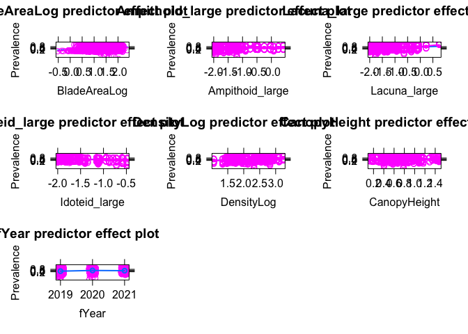

Taxa Comparison All Data
================

## GLM and LM to assess taxa effects on disease

Using all sites and years and not restricting to temperature data

``` r
all_epi <- read_csv("data/epifauna_for_region_specific_models_no_epiphyte.csv")
```

    ## Rows: 2370 Columns: 21
    ## ── Column specification ────────────────────────────────────────────────────────
    ## Delimiter: ","
    ## chr  (5): Region, SiteCode, TidalHeight, Meadow, site_unique_code
    ## dbl (16): Year, Blade, Prevalence, LesionArea, BladeArea, BladeAreaLog, Epif...
    ## 
    ## ℹ Use `spec()` to retrieve the full column specification for this data.
    ## ℹ Specify the column types or set `show_col_types = FALSE` to quiet this message.

``` r
all_epi$fYear <- as.factor(all_epi$Year)

les <- subset(all_epi, LesionArea>0)
les$LesionAreaLog <- log10(les$LesionArea)
```

## Prevalence

Compare 3 models: epifauna predictors and seagrass predictors (blade
area and density), epifauna predictors + blade area only, epifauna +
density only.

``` r
prev1 <- glmer(Prevalence ~ BladeAreaLog + 
                Ampithoid_large + Lacuna_large + Idoteid_large +
                DensityLog + CanopyHeight +
                fYear +(1|Region) +(1|Meadow), 
              family = "binomial", 
              data=all_epi)

prev2 <- glmer(Prevalence ~ BladeAreaLog + 
                 Ampithoid_large + Lacuna_large + Idoteid_large +
                 
                 fYear +(1|Region) +(1|Meadow), 
               family = "binomial", 
               data=all_epi)

prev3 <- glmer(Prevalence ~ 
        Ampithoid_large + Lacuna_large + Idoteid_large +
          DensityLog + CanopyHeight +

        fYear +(1|Region) +(1|Meadow), 
      family = "binomial", 
      data=all_epi)

prev4 <- glmer(Prevalence ~ BladeAreaLog + 
                DensityLog + CanopyHeight +
        fYear +(1|Region) +(1|Meadow), 
      family = "binomial", 
      data=all_epi)

AIC(prev1, prev2, prev3, prev4)
```

    ##       df      AIC
    ## prev1 11 2742.881
    ## prev2  9 2757.125
    ## prev3 10 2784.314
    ## prev4  8 2774.518

``` r
df.AIC <- AIC(prev1, prev2, prev3, prev4)
df.AIC$deltaAIC <- df.AIC$AIC-min(df.AIC$AIC)
df.AIC$likelihood <- exp(-df.AIC$deltaAIC/2)
df.AIC$weight <- format(df.AIC$likelihood/sum(df.AIC$likelihood), scientific = FALSE)
df.AIC$predictors <- c("Full model (individual leaf area, all taxa abundances, seagrass structure)", 
                  "Drop seagrass structure from full model",
                  "Drop individual leaf area from full model", 
                  "Drop taxa abundances from full model") 
df.AIC
```

    ##       df      AIC deltaAIC   likelihood            weight
    ## prev1 11 2742.881  0.00000 1.000000e+00 0.999193388888142
    ## prev2  9 2757.125 14.24406 8.071263e-04 0.000806475287177
    ## prev3 10 2784.314 41.43345 1.006560e-09 0.000000001005748
    ## prev4  8 2774.518 31.63705 1.349278e-07 0.000000134818933
    ##                                                                       predictors
    ## prev1 Full model (individual leaf area, all taxa abundances, seagrass structure)
    ## prev2                                    Drop seagrass structure from full model
    ## prev3                                  Drop individual leaf area from full model
    ## prev4                                       Drop taxa abundances from full model

``` r
kable(df.AIC, digits=4, caption = "Model comparison for prevalence")
```

|       |  df |      AIC | deltaAIC | likelihood | weight            | predictors                                                                 |
|:------|----:|---------:|---------:|-----------:|:------------------|:---------------------------------------------------------------------------|
| prev1 |  11 | 2742.881 |   0.0000 |      1e+00 | 0.999193388888142 | Full model (individual leaf area, all taxa abundances, seagrass structure) |
| prev2 |   9 | 2757.125 |  14.2441 |      8e-04 | 0.000806475287177 | Drop seagrass structure from full model                                    |
| prev3 |  10 | 2784.314 |  41.4335 |      0e+00 | 0.000000001005748 | Drop individual leaf area from full model                                  |
| prev4 |   8 | 2774.518 |  31.6371 |      0e+00 | 0.000000134818933 | Drop taxa abundances from full model                                       |

Model comparison for prevalence

By AIC, the model including epifauna taxa, blade area, and density is
better than alternatives

Check residuals

``` r
prev1_E <- simulateResiduals(prev1)
plot(prev1_E)
```

<!-- -->

Look at model results

``` r
plot_model(prev1, type="std", show.p=T, show.values=T, title = "",value.offset = 0.5)
```

<!-- -->

``` r
plot(predictorEffects(prev1, partial.residuals=T))
```

<!-- -->

``` r
plot(predictorEffects(prev1))
```

<!-- -->

``` r
plot(predictorEffect("Ampithoid_large", prev1, partial.residuals=T))
```

<!-- -->

``` r
performance(prev1)
```

    ## # Indices of model performance
    ## 
    ## AIC      |     AICc |      BIC | R2 (cond.) | R2 (marg.) |   ICC |  RMSE | Sigma | Log_loss | Score_log | Score_spherical
    ## -------------------------------------------------------------------------------------------------------------------------
    ## 2742.881 | 2742.993 | 2806.358 |      0.405 |      0.122 | 0.322 | 0.435 | 1.000 |    0.555 |      -Inf |       4.418e-04

So, Lacuna abundance is significant and positive for prevalence. Other
taxa are not significant. Standized coefficeint for Lacuna is larger
than for density and similar to blade area. However, the model still
explains only 37% of variation in disease (12% from fixed effects,
including year).

## Lesion Area

Compare same three models, but these are linear (using log transformed
lesion area). Note, we could do a GLM with gamma distribution and log
link but the coefficients are similar, and the log-transformed LM is the
same as in the SEMs, so for consistency use the same model structure.

``` r
les1 <- lmer(LesionAreaLog ~ BladeAreaLog +
               Ampithoid_large + Lacuna_large + Idoteid_large +
               DensityLog + CanopyHeight + 
               fYear + (1|Meadow) + (1|Region), 
             data=les)

les2 <- lmer(LesionAreaLog ~ BladeAreaLog +
               Ampithoid_large + Lacuna_large + Idoteid_large +
               fYear + (1|Meadow) + (1|Region), 
             data=les)

les3 <- lmer(LesionAreaLog ~ 
               Ampithoid_large + Lacuna_large + Idoteid_large +
               DensityLog + CanopyHeight + 
               fYear + (1|Meadow) + (1|Region), 
             data=les)
les4 <- lmer(LesionAreaLog ~ BladeAreaLog +
               DensityLog + CanopyHeight + 
               fYear + (1|Meadow) + (1|Region), 
             data=les)
AIC(les1, les2, les3, les4)
```

    ##      df      AIC
    ## les1 12 2210.892
    ## les2 10 2202.543
    ## les3 11 2227.890
    ## les4  9 2210.472

``` r
df.AIC <- AIC(les1, les2, les3, les4)
df.AIC$deltaAIC <- df.AIC$AIC-min(df.AIC$AIC)
df.AIC$likelihood <- exp(-df.AIC$deltaAIC/2)
df.AIC$weight <- df.AIC$likelihood/sum(df.AIC$likelihood)
df.AIC$predictors <- c("Full model (individual leaf area, all taxa abundances, seagrass structure)", 
                  "Drop seagrass structure from full model",
                  "Drop individual leaf area from full model", 
                  "Drop taxa abundances from full model")
kable(df.AIC, digits = 4, caption = "Model comparison for lesion area")
```

|      |  df |      AIC | deltaAIC | likelihood | weight | predictors                                                                 |
|:-----|----:|---------:|---------:|-----------:|-------:|:---------------------------------------------------------------------------|
| les1 |  12 | 2210.892 |   8.3491 |     0.0154 | 0.0149 | Full model (individual leaf area, all taxa abundances, seagrass structure) |
| les2 |  10 | 2202.543 |   0.0000 |     1.0000 | 0.9668 | Drop seagrass structure from full model                                    |
| les3 |  11 | 2227.890 |  25.3474 |     0.0000 | 0.0000 | Drop individual leaf area from full model                                  |
| les4 |   9 | 2210.472 |   7.9297 |     0.0190 | 0.0183 | Drop taxa abundances from full model                                       |

Model comparison for lesion area

Dropping shoot density improves the model somewhat. Use second model.

Check residuals

``` r
les2_E <- simulateResiduals(les2)
plot(les2_E)
```

<!-- -->

Look at model results

``` r
plot_model(les2, type="std", show.p=T, show.values=T)
```

<!-- -->

``` r
plot(predictorEffects(les2, partial.residuals=T))
```

<!-- -->

``` r
plot(predictorEffects(les2))
```

<!-- -->

``` r
performance(les2)
```

    ## # Indices of model performance
    ## 
    ## AIC      |     AICc |      BIC | R2 (cond.) | R2 (marg.) |   ICC |  RMSE | Sigma
    ## --------------------------------------------------------------------------------
    ## 2202.543 | 2202.747 | 2252.464 |      0.253 |      0.119 | 0.152 | 0.632 | 0.640

Similar to prevalence model, lacuna is significant and positive for
lesion area. More snails = more disease. Idoteid is also positive,
though effect size is less, and ampithoid and not significant.

## Conclusions

1.  Prevalence and lesion area increase with lacuna abundance; lesion
    area increases with idoteid abundance
2.  Pattern of decreasing lesion area with ampithoid abundance, but not
    significant across all sites and years - maybe due to relatively few
    sites with high abundances of ampithoids
