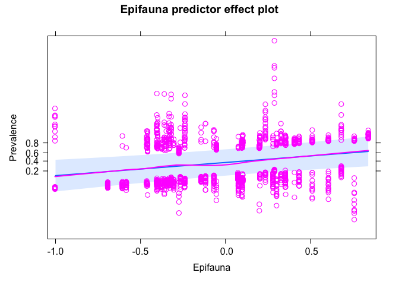
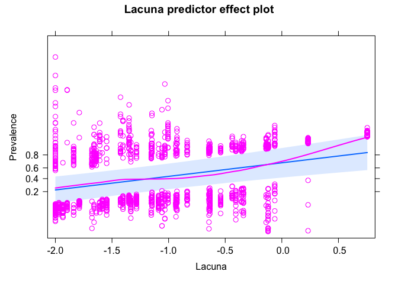
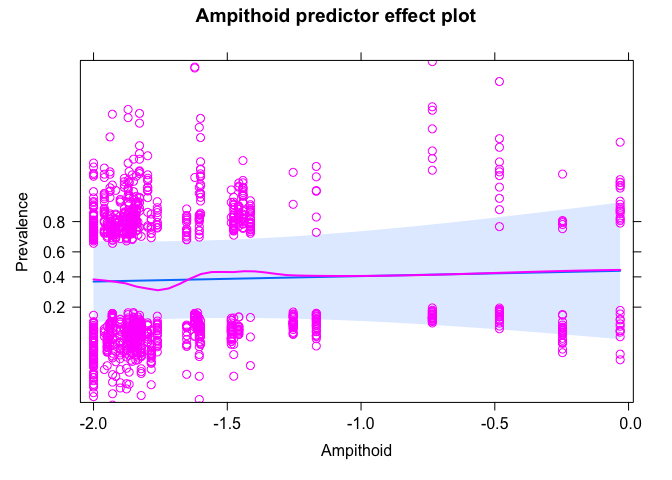
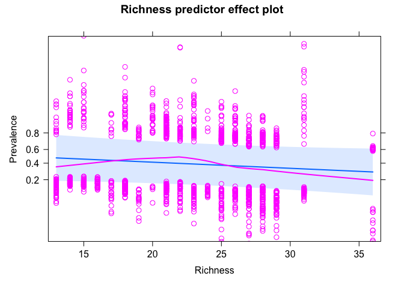
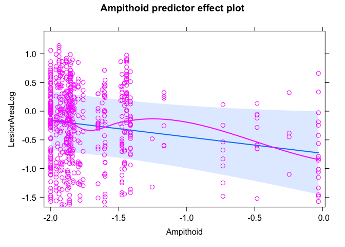
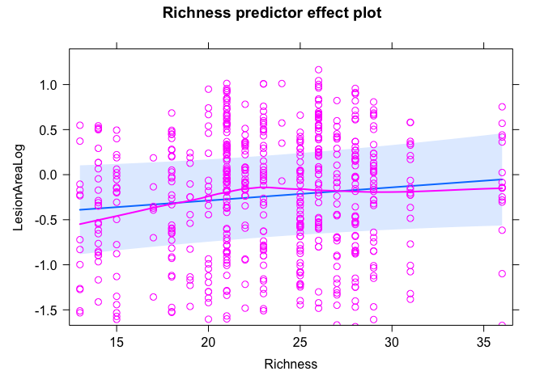

Community Interaction SEM results
================

# SEMs comparing epifauna vs lacuna vs ampithoid vs iodteid vs richness

Try including epiphyte at the blade level. This variable was not
important before, but I’ve changed the structure of the SEMs (two years
only, meadow-scale predictors). And, the relationship with taxa might
vary (haven’t looked at that). Also, the data are now updated with
better BB data.

A few notes:  
- Large epifauna only (except at BB).  
- Epiphyte blades only. A handful are missing due to no epiphytes (wrong
leaf etc)  
- Zeros are included (not NAs), all sites for all models.  
- Taxa abundances are log-transformed.

``` r
# data ###
dis <- read_csv("data/epiphyte_SEM_data_all_large.csv")
```

    ## Rows: 1350 Columns: 49
    ## ── Column specification ────────────────────────────────────────────────────────
    ## Delimiter: ","
    ## chr   (9): Meter, SampleId, Region, SiteCode, TidalHeight, GrazingScars, Bro...
    ## dbl  (39): Transect, Blade, LongestBladeLength, LongestBladeWidth, SheathLen...
    ## date  (1): SampleDate
    ## 
    ## ℹ Use `spec()` to retrieve the full column specification for this data.
    ## ℹ Specify the column types or set `show_col_types = FALSE` to quiet this message.

``` r
# updating the SEM to compare the effects of using large vs all animals
dis$BladeAreaLog <- log10(dis$BladeArea)
dis$EpiphyteLog <- log10(dis$EpiphytePerAreamgcm2+0.01)
# use the full data set without subsetting because the SEM no longer includes epiphytes or grazing
dis1 <- select(dis, c(Epifauna = Epifauna_all, TempAnomWarm_June, MonthlyMeanTemp_June, CanopyHeight, 
                      DensityLog, YearBinary, Year, Meadow, Region,BladeAreaLog, TidalHeightBinary, 
                      Prevalence, LesionArea, EpiphytePerAreamgcm2, EpiphyteLog,
                      Lacuna = Lacuna_all, 
                      Ampithoid = Ampithoid_all, Idoteid = Idoteid_all, Richness = Richness_all))

dis1_large <- select(dis, c(Epifauna = Epifauna_large, TempAnomWarm_June, MonthlyMeanTemp_June, CanopyHeight, 
                      DensityLog, YearBinary, Year, Meadow, Region,BladeAreaLog, TidalHeightBinary, 
                      Prevalence, LesionArea, EpiphyteLog, Lacuna = Lacuna_large, 
                      Ampithoid = Ampithoid_large, Idoteid = Idoteid_large, Richness = Richness_large))
dis_large <- na.omit(dis1_large)
dis_large$Meadow_Year <- paste(dis_large$Meadow, dis_large$Year, sep = "_")
site_large <- distinct(dis_large, Meadow_Year, .keep_all = T)
site_large <- select(site_large, -c(Prevalence, LesionArea, EpiphyteLog, TidalHeightBinary, BladeAreaLog))
# site <- read_csv("data/epifauna_site_for_plotting.csv")
# site <- select(site, c())
```

## Prevalence + Epifauna

``` r
sem_prev_epi <- psem(
  lmer(Epifauna ~ TempAnomWarm_June + MonthlyMeanTemp_June + 
         CanopyHeight + DensityLog +
         YearBinary +
         (1|Meadow) + (1|Region),
       data=site_large),
  lmer(CanopyHeight ~ TempAnomWarm_June + MonthlyMeanTemp_June + 
         YearBinary + 
         (1|Meadow) + (1|Region),
       data=site_large),
  lmer(DensityLog ~ TempAnomWarm_June + MonthlyMeanTemp_June +
         YearBinary + 
         (1|Meadow) + (1|Region),
       data=site_large),
    lmer(BladeAreaLog ~ Epifauna + CanopyHeight + DensityLog + 
         TempAnomWarm_June + MonthlyMeanTemp_June +
         TidalHeightBinary + YearBinary +
         (1|Region) + (1|Meadow),
       data=dis_large),
  lmer(EpiphyteLog ~ BladeAreaLog + Epifauna + CanopyHeight + DensityLog + 
         TempAnomWarm_June + MonthlyMeanTemp_June +
         TidalHeightBinary + YearBinary +
         (1|Region) + (1|Meadow),
       data=dis_large),
  glmer(Prevalence ~ BladeAreaLog + EpiphyteLog + 
          Epifauna + CanopyHeight + DensityLog + 
          TempAnomWarm_June + MonthlyMeanTemp_June + 
          TidalHeightBinary + YearBinary + 
          (1|Region) + (1|Meadow),
        data=dis_large,
        family = "binomial"),
  DensityLog%~~%CanopyHeight
)
summary(sem_prev_epi)
```

    ##   |                                                                              |                                                                      |   0%  |                                                                              |=======================                                               |  33%  |                                                                              |===============================================                       |  67%  |                                                                              |======================================================================| 100%

    ## 
    ## Structural Equation Model of sem_prev_epi 
    ## 
    ## Call:
    ##   Epifauna ~ TempAnomWarm_June + MonthlyMeanTemp_June + CanopyHeight + DensityLog + YearBinary
    ##   CanopyHeight ~ TempAnomWarm_June + MonthlyMeanTemp_June + YearBinary
    ##   DensityLog ~ TempAnomWarm_June + MonthlyMeanTemp_June + YearBinary
    ##   BladeAreaLog ~ Epifauna + CanopyHeight + DensityLog + TempAnomWarm_June + MonthlyMeanTemp_June + TidalHeightBinary + YearBinary
    ##   EpiphyteLog ~ BladeAreaLog + Epifauna + CanopyHeight + DensityLog + TempAnomWarm_June + MonthlyMeanTemp_June + TidalHeightBinary + YearBinary
    ##   Prevalence ~ BladeAreaLog + EpiphyteLog + Epifauna + CanopyHeight + DensityLog + TempAnomWarm_June + MonthlyMeanTemp_June + TidalHeightBinary + YearBinary
    ##   DensityLog ~~ CanopyHeight
    ## 
    ##     AIC      BIC
    ##  116.333   221.119
    ## 
    ## ---
    ## Tests of directed separation:
    ## 
    ##                           Independ.Claim Test.Type       DF Crit.Value P.Value 
    ##   CanopyHeight ~ TidalHeightBinary + ...      coef 1307.004     0.0042  0.9484 
    ##     DensityLog ~ TidalHeightBinary + ...      coef 1307.001     0.0169  0.8966 
    ##       Epifauna ~ TidalHeightBinary + ...      coef 1305.003     0.0000  0.9956 
    ## 
    ## Global goodness-of-fit:
    ## 
    ##   Fisher's C = 0.333 with P-value = 0.999 and on 6 degrees of freedom
    ## 
    ## ---
    ## Coefficients:
    ## 
    ##       Response            Predictor Estimate Std.Error        DF Crit.Value
    ##       Epifauna    TempAnomWarm_June  -0.0170    0.0056   23.6027     8.2905
    ##       Epifauna MonthlyMeanTemp_June   0.0167    0.0449    9.3690     0.1199
    ##       Epifauna         CanopyHeight  -0.7181    0.2149   38.9462     9.1972
    ##       Epifauna           DensityLog  -0.4677    0.1818   30.4214     4.9938
    ##       Epifauna           YearBinary  -0.0833    0.0747   19.2954     1.1829
    ##   CanopyHeight    TempAnomWarm_June  -0.0054    0.0035   22.0873     2.1953
    ##   CanopyHeight MonthlyMeanTemp_June  -0.0728    0.0352   10.7257     3.6930
    ##   CanopyHeight           YearBinary  -0.1096    0.0453   16.8258     5.7554
    ##     DensityLog    TempAnomWarm_June  -0.0121    0.0044   20.7963     6.5429
    ##     DensityLog MonthlyMeanTemp_June   0.0750    0.0509   12.8657     1.7202
    ##     DensityLog           YearBinary  -0.0610     0.051   16.6099     1.4062
    ##   BladeAreaLog             Epifauna  -0.0626    0.0426   87.7021     2.0172
    ##   BladeAreaLog         CanopyHeight   0.6842    0.0641   86.5019   107.1005
    ##   BladeAreaLog           DensityLog  -0.1456    0.0559  101.2453     6.0711
    ##   BladeAreaLog    TempAnomWarm_June  -0.0029    0.0018   68.5047     2.3280
    ##   BladeAreaLog MonthlyMeanTemp_June  -0.0058    0.0179   16.5561     0.0838
    ##   BladeAreaLog    TidalHeightBinary  -0.2414    0.0132 1305.5598   332.7172
    ##   BladeAreaLog           YearBinary   0.0553    0.0179  954.1424     9.3890
    ##    EpiphyteLog         BladeAreaLog  -0.1593    0.0436 1316.7196    13.3331
    ##    EpiphyteLog             Epifauna   0.1379    0.0842  255.6101     2.5751
    ##    EpiphyteLog         CanopyHeight  -0.4370    0.1296  286.6236    10.9755
    ##    EpiphyteLog           DensityLog  -0.2158    0.1117  331.2801     3.5593
    ##    EpiphyteLog    TempAnomWarm_June   0.0086    0.0037  500.9209     5.1057
    ##    EpiphyteLog MonthlyMeanTemp_June  -0.2232    0.0449  189.0115    22.1647
    ##    EpiphyteLog    TidalHeightBinary  -0.0565    0.0234 1306.7835     5.8313
    ##    EpiphyteLog           YearBinary  -0.0372    0.0297 1223.4455     1.5531
    ##     Prevalence         BladeAreaLog   1.7422    0.2963 1338.0000     5.8795
    ##     Prevalence          EpiphyteLog  -0.0142    0.1642 1338.0000    -0.0865
    ##     Prevalence             Epifauna   1.2960    0.4302 1338.0000     3.0126
    ##     Prevalence         CanopyHeight   1.7492    0.6821 1338.0000     2.5646
    ##     Prevalence           DensityLog   2.6509    0.5716 1338.0000     4.6379
    ##     Prevalence    TempAnomWarm_June   0.0252    0.0192 1338.0000     1.3135
    ##     Prevalence MonthlyMeanTemp_June   0.3921     0.225 1338.0000     1.7427
    ##     Prevalence    TidalHeightBinary   0.6429     0.143 1338.0000     4.4968
    ##     Prevalence           YearBinary   0.3695     0.172 1338.0000     2.1491
    ##   ~~DensityLog       ~~CanopyHeight  -0.1001         -   45.0000    -0.6518
    ##   P.Value Std.Estimate    
    ##    0.0083      -0.3647  **
    ##    0.7367       0.0674    
    ##    0.0043      -0.5966  **
    ##    0.0329      -0.5526   *
    ##    0.2902      -0.1002    
    ##    0.1526      -0.1398    
    ##    0.0816      -0.3541    
    ##    0.0283      -0.1588   *
    ##    0.0184      -0.2191   *
    ##    0.2126       0.2565    
    ##    0.2524      -0.0621    
    ##    0.1591      -0.0611    
    ##    0.0000       0.5549 ***
    ##    0.0154      -0.1679   *
    ##    0.1317      -0.0616    
    ##    0.7758      -0.0227    
    ##    0.0000      -0.2851 ***
    ##    0.0022       0.0649  **
    ##    0.0003      -0.0668 ***
    ##    0.1098       0.0564    
    ##    0.0010      -0.1486  **
    ##    0.0601      -0.1044    
    ##    0.0243       0.0751   *
    ##    0.0000      -0.3692 ***
    ##    0.0159       -0.028   *
    ##    0.2129      -0.0183    
    ##    0.0000            - ***
    ##    0.9310            -    
    ##    0.0026            -  **
    ##    0.0103            -   *
    ##    0.0000            - ***
    ##    0.1890            -    
    ##    0.0814            -    
    ##    0.0000            - ***
    ##    0.0316            -   *
    ##    0.2590      -0.1001    
    ## 
    ##   Signif. codes:  0 '***' 0.001 '**' 0.01 '*' 0.05
    ## 
    ## ---
    ## Individual R-squared:
    ## 
    ##       Response method Marginal Conditional
    ##       Epifauna   none     0.25        0.83
    ##   CanopyHeight   none     0.18        0.89
    ##     DensityLog   none     0.09        0.93
    ##   BladeAreaLog   none     0.51        0.68
    ##    EpiphyteLog   none     0.14        0.87
    ##     Prevalence  delta     0.16        0.50

Passes global fit.

Epifauna abundance is significant and positive predictor of prevalence.

Coefficient table:

``` r
a <- coefs(sem_prev_epi)
knitr::kable(a, digits = 4)
```

| Response       | Predictor            | Estimate | Std.Error |        DF | Crit.Value | P.Value | Std.Estimate |        |
|:---------------|:---------------------|---------:|:----------|----------:|-----------:|--------:|-------------:|:-------|
| Epifauna       | TempAnomWarm_June    |  -0.0170 | 0.0056    |   23.6027 |     8.2905 |  0.0083 |      -0.3647 | \*\*   |
| Epifauna       | MonthlyMeanTemp_June |   0.0167 | 0.0449    |    9.3690 |     0.1199 |  0.7367 |       0.0674 |        |
| Epifauna       | CanopyHeight         |  -0.7181 | 0.2149    |   38.9462 |     9.1972 |  0.0043 |      -0.5966 | \*\*   |
| Epifauna       | DensityLog           |  -0.4677 | 0.1818    |   30.4214 |     4.9938 |  0.0329 |      -0.5526 | \*     |
| Epifauna       | YearBinary           |  -0.0833 | 0.0747    |   19.2954 |     1.1829 |  0.2902 |      -0.1002 |        |
| CanopyHeight   | TempAnomWarm_June    |  -0.0054 | 0.0035    |   22.0873 |     2.1953 |  0.1526 |      -0.1398 |        |
| CanopyHeight   | MonthlyMeanTemp_June |  -0.0728 | 0.0352    |   10.7257 |     3.6930 |  0.0816 |      -0.3541 |        |
| CanopyHeight   | YearBinary           |  -0.1096 | 0.0453    |   16.8258 |     5.7554 |  0.0283 |      -0.1588 | \*     |
| DensityLog     | TempAnomWarm_June    |  -0.0121 | 0.0044    |   20.7963 |     6.5429 |  0.0184 |      -0.2191 | \*     |
| DensityLog     | MonthlyMeanTemp_June |   0.0750 | 0.0509    |   12.8657 |     1.7202 |  0.2126 |       0.2565 |        |
| DensityLog     | YearBinary           |  -0.0610 | 0.051     |   16.6099 |     1.4062 |  0.2524 |      -0.0621 |        |
| BladeAreaLog   | Epifauna             |  -0.0626 | 0.0426    |   87.7021 |     2.0172 |  0.1591 |      -0.0611 |        |
| BladeAreaLog   | CanopyHeight         |   0.6842 | 0.0641    |   86.5019 |   107.1005 |  0.0000 |       0.5549 | \*\*\* |
| BladeAreaLog   | DensityLog           |  -0.1456 | 0.0559    |  101.2453 |     6.0711 |  0.0154 |      -0.1679 | \*     |
| BladeAreaLog   | TempAnomWarm_June    |  -0.0029 | 0.0018    |   68.5047 |     2.3280 |  0.1317 |      -0.0616 |        |
| BladeAreaLog   | MonthlyMeanTemp_June |  -0.0058 | 0.0179    |   16.5561 |     0.0838 |  0.7758 |      -0.0227 |        |
| BladeAreaLog   | TidalHeightBinary    |  -0.2414 | 0.0132    | 1305.5598 |   332.7172 |  0.0000 |      -0.2851 | \*\*\* |
| BladeAreaLog   | YearBinary           |   0.0553 | 0.0179    |  954.1424 |     9.3890 |  0.0022 |       0.0649 | \*\*   |
| EpiphyteLog    | BladeAreaLog         |  -0.1593 | 0.0436    | 1316.7196 |    13.3331 |  0.0003 |      -0.0668 | \*\*\* |
| EpiphyteLog    | Epifauna             |   0.1379 | 0.0842    |  255.6101 |     2.5751 |  0.1098 |       0.0564 |        |
| EpiphyteLog    | CanopyHeight         |  -0.4370 | 0.1296    |  286.6236 |    10.9755 |  0.0010 |      -0.1486 | \*\*   |
| EpiphyteLog    | DensityLog           |  -0.2158 | 0.1117    |  331.2801 |     3.5593 |  0.0601 |      -0.1044 |        |
| EpiphyteLog    | TempAnomWarm_June    |   0.0086 | 0.0037    |  500.9209 |     5.1057 |  0.0243 |       0.0751 | \*     |
| EpiphyteLog    | MonthlyMeanTemp_June |  -0.2232 | 0.0449    |  189.0115 |    22.1647 |  0.0000 |      -0.3692 | \*\*\* |
| EpiphyteLog    | TidalHeightBinary    |  -0.0565 | 0.0234    | 1306.7835 |     5.8313 |  0.0159 |      -0.0280 | \*     |
| EpiphyteLog    | YearBinary           |  -0.0372 | 0.0297    | 1223.4455 |     1.5531 |  0.2129 |      -0.0183 |        |
| Prevalence     | BladeAreaLog         |   1.7422 | 0.2963    | 1338.0000 |     5.8795 |  0.0000 |       0.3266 | \*\*\* |
| Prevalence     | EpiphyteLog          |  -0.0142 | 0.1642    | 1338.0000 |    -0.0865 |  0.9310 |      -0.0064 |        |
| Prevalence     | Epifauna             |   1.2960 | 0.4302    | 1338.0000 |     3.0126 |  0.0026 |       0.2371 | \*\*   |
| Prevalence     | CanopyHeight         |   1.7492 | 0.6821    | 1338.0000 |     2.5646 |  0.0103 |       0.2659 | \*     |
| Prevalence     | DensityLog           |   2.6509 | 0.5716    | 1338.0000 |     4.6379 |  0.0000 |       0.5731 | \*\*\* |
| Prevalence     | TempAnomWarm_June    |   0.0252 | 0.0192    | 1338.0000 |     1.3135 |  0.1890 |       0.0986 |        |
| Prevalence     | MonthlyMeanTemp_June |   0.3921 | 0.225     | 1338.0000 |     1.7427 |  0.0814 |       0.2899 |        |
| Prevalence     | TidalHeightBinary    |   0.6429 | 0.143     | 1338.0000 |     4.4968 |  0.0000 |       0.1424 | \*\*\* |
| Prevalence     | YearBinary           |   0.3695 | 0.172     | 1338.0000 |     2.1491 |  0.0316 |       0.0813 | \*     |
| \~\~DensityLog | \~\~CanopyHeight     |  -0.1001 | \-        |   45.0000 |    -0.6518 |  0.2590 |      -0.1001 |        |

## Prev + Amp

``` r
sem_prev_amp <- psem(
  lmer(Ampithoid ~ TempAnomWarm_June + MonthlyMeanTemp_June + 
         CanopyHeight + DensityLog +
         YearBinary +
         (1|Meadow) + (1|Region),
       data=site_large),
  lmer(CanopyHeight ~ TempAnomWarm_June + MonthlyMeanTemp_June + 
         YearBinary + 
         (1|Meadow) + (1|Region),
       data=site_large),
  lmer(DensityLog ~ TempAnomWarm_June + MonthlyMeanTemp_June +
         YearBinary + 
         (1|Meadow) + (1|Region),
       data=site_large),
    lmer(BladeAreaLog ~ Ampithoid + CanopyHeight + DensityLog + 
         TempAnomWarm_June + MonthlyMeanTemp_June +
         TidalHeightBinary + YearBinary +
         (1|Region) + (1|Meadow),
       data=dis_large),
  lmer(EpiphyteLog ~ BladeAreaLog + Ampithoid + CanopyHeight + DensityLog + 
         TempAnomWarm_June + MonthlyMeanTemp_June +
         TidalHeightBinary + YearBinary +
         (1|Region) + (1|Meadow),
       data=dis_large),
  glmer(Prevalence ~ BladeAreaLog + EpiphyteLog + 
          Ampithoid + CanopyHeight + DensityLog + 
          TempAnomWarm_June + MonthlyMeanTemp_June + 
          TidalHeightBinary + YearBinary + 
          (1|Region) + (1|Meadow),
        data=dis_large,
        family = "binomial"),
  DensityLog%~~%CanopyHeight
)
```

    ## Warning in checkConv(attr(opt, "derivs"), opt$par, ctrl = control$checkConv, :
    ## Model failed to converge with max|grad| = 0.0107381 (tol = 0.002, component 1)

``` r
summary(sem_prev_amp)
```

    ##   |                                                                              |                                                                      |   0%  |                                                                              |=======================                                               |  33%  |                                                                              |===============================================                       |  67%  |                                                                              |======================================================================| 100%

    ## 
    ## Structural Equation Model of sem_prev_amp 
    ## 
    ## Call:
    ##   Ampithoid ~ TempAnomWarm_June + MonthlyMeanTemp_June + CanopyHeight + DensityLog + YearBinary
    ##   CanopyHeight ~ TempAnomWarm_June + MonthlyMeanTemp_June + YearBinary
    ##   DensityLog ~ TempAnomWarm_June + MonthlyMeanTemp_June + YearBinary
    ##   BladeAreaLog ~ Ampithoid + CanopyHeight + DensityLog + TempAnomWarm_June + MonthlyMeanTemp_June + TidalHeightBinary + YearBinary
    ##   EpiphyteLog ~ BladeAreaLog + Ampithoid + CanopyHeight + DensityLog + TempAnomWarm_June + MonthlyMeanTemp_June + TidalHeightBinary + YearBinary
    ##   Prevalence ~ BladeAreaLog + EpiphyteLog + Ampithoid + CanopyHeight + DensityLog + TempAnomWarm_June + MonthlyMeanTemp_June + TidalHeightBinary + YearBinary
    ##   DensityLog ~~ CanopyHeight
    ## 
    ##     AIC      BIC
    ##  116.621   221.407
    ## 
    ## ---
    ## Tests of directed separation:
    ## 
    ##                           Independ.Claim Test.Type       DF Crit.Value P.Value 
    ##   CanopyHeight ~ TidalHeightBinary + ...      coef 1307.004     0.0042  0.9484 
    ##     DensityLog ~ TidalHeightBinary + ...      coef 1307.001     0.0169  0.8966 
    ##      Ampithoid ~ TidalHeightBinary + ...      coef 1305.002     0.0302  0.8622 
    ## 
    ## Global goodness-of-fit:
    ## 
    ##   Fisher's C = 0.621 with P-value = 0.996 and on 6 degrees of freedom
    ## 
    ## ---
    ## Coefficients:
    ## 
    ##       Response            Predictor Estimate Std.Error        DF Crit.Value
    ##      Ampithoid    TempAnomWarm_June  -0.0119    0.0041   23.5013     7.4039
    ##      Ampithoid MonthlyMeanTemp_June   0.1423    0.0425   14.2872     9.4237
    ##      Ampithoid         CanopyHeight  -0.1141    0.1825   27.3156     0.3297
    ##      Ampithoid           DensityLog   0.0323    0.1527   25.6654     0.0355
    ##      Ampithoid           YearBinary  -0.1593    0.0474   16.1330    10.8099
    ##   CanopyHeight    TempAnomWarm_June  -0.0054    0.0035   22.0873     2.1953
    ##   CanopyHeight MonthlyMeanTemp_June  -0.0728    0.0352   10.7257     3.6930
    ##   CanopyHeight           YearBinary  -0.1096    0.0453   16.8258     5.7554
    ##     DensityLog    TempAnomWarm_June  -0.0121    0.0044   20.7963     6.5429
    ##     DensityLog MonthlyMeanTemp_June   0.0750    0.0509   12.8657     1.7202
    ##     DensityLog           YearBinary  -0.0610     0.051   16.6099     1.4062
    ##   BladeAreaLog            Ampithoid   0.0338    0.0448   47.3668     0.5303
    ##   BladeAreaLog         CanopyHeight   0.7419    0.0619  139.6888   131.7490
    ##   BladeAreaLog           DensityLog  -0.1044    0.0519   88.6712     3.5359
    ##   BladeAreaLog    TempAnomWarm_June  -0.0008    0.0017   51.2154     0.1807
    ##   BladeAreaLog MonthlyMeanTemp_June  -0.0192    0.0171   14.3530     1.0608
    ##   BladeAreaLog    TidalHeightBinary  -0.2414    0.0132 1306.0097   332.4250
    ##   BladeAreaLog           YearBinary   0.0651    0.0201  883.2043    10.2472
    ##    EpiphyteLog         BladeAreaLog  -0.1612    0.0435 1316.5899    13.7024
    ##    EpiphyteLog            Ampithoid  -0.2202    0.1038   58.7462     4.3120
    ##    EpiphyteLog         CanopyHeight  -0.5637    0.1219  401.1432    20.7733
    ##    EpiphyteLog           DensityLog  -0.2564    0.1087  246.9364     5.2712
    ##    EpiphyteLog    TempAnomWarm_June   0.0039    0.0038  363.9419     0.9611
    ##    EpiphyteLog MonthlyMeanTemp_June  -0.2009    0.0478  205.1647    16.0035
    ##    EpiphyteLog    TidalHeightBinary  -0.0568    0.0233 1306.9311     5.9075
    ##    EpiphyteLog           YearBinary  -0.0789    0.0336 1094.3155     5.4696
    ##     Prevalence         BladeAreaLog   1.7151    0.2962 1338.0000     5.7907
    ##     Prevalence          EpiphyteLog   0.0150    0.1639 1338.0000     0.0914
    ##     Prevalence            Ampithoid   0.1772    0.5752 1338.0000     0.3081
    ##     Prevalence         CanopyHeight   1.0038    0.6864 1338.0000     1.4624
    ##     Prevalence           DensityLog   2.1599    0.5763 1338.0000     3.7481
    ##     Prevalence    TempAnomWarm_June   0.0103    0.0196 1338.0000     0.5226
    ##     Prevalence MonthlyMeanTemp_June   0.3094    0.2284 1338.0000     1.3549
    ##     Prevalence    TidalHeightBinary   0.6391     0.143 1338.0000     4.4689
    ##     Prevalence           YearBinary   0.3455    0.2038 1338.0000     1.6949
    ##   ~~DensityLog       ~~CanopyHeight  -0.1001         -   45.0000    -0.6518
    ##   P.Value Std.Estimate    
    ##    0.0120      -0.2306   *
    ##    0.0082       0.5231  **
    ##    0.5706      -0.0862    
    ##    0.8520       0.0347    
    ##    0.0046      -0.1743  **
    ##    0.1526      -0.1398    
    ##    0.0816      -0.3541    
    ##    0.0283      -0.1588   *
    ##    0.0184      -0.2191   *
    ##    0.2126       0.2565    
    ##    0.2524      -0.0621    
    ##    0.4701       0.0362    
    ##    0.0000       0.6017 ***
    ##    0.0633      -0.1204    
    ##    0.6726      -0.0159    
    ##    0.3201      -0.0759    
    ##    0.0000      -0.2852 ***
    ##    0.0014       0.0764  **
    ##    0.0002      -0.0676 ***
    ##    0.0422      -0.0991   *
    ##    0.0000      -0.1917 ***
    ##    0.0225       -0.124   *
    ##    0.3276       0.0342    
    ##    0.0001      -0.3322 ***
    ##    0.0152      -0.0281   *
    ##    0.0195      -0.0389   *
    ##    0.0000            - ***
    ##    0.9272            -    
    ##    0.7580            -    
    ##    0.1436            -    
    ##    0.0002            - ***
    ##    0.6012            -    
    ##    0.1755            -    
    ##    0.0000            - ***
    ##    0.0901            -    
    ##    0.2590      -0.1001    
    ## 
    ##   Signif. codes:  0 '***' 0.001 '**' 0.01 '*' 0.05
    ## 
    ## ---
    ## Individual R-squared:
    ## 
    ##       Response method Marginal Conditional
    ##      Ampithoid   none     0.26        0.95
    ##   CanopyHeight   none     0.18        0.89
    ##     DensityLog   none     0.09        0.93
    ##   BladeAreaLog   none     0.53        0.66
    ##    EpiphyteLog   none     0.14        0.87
    ##     Prevalence  delta     0.12        0.50

Passes global fit.

Ampithoid abundance is not significant predictor of prevalence.

Coefficient table:

``` r
b <- coefs(sem_prev_amp)
knitr::kable(b, digits = 4)
```

| Response       | Predictor            | Estimate | Std.Error |        DF | Crit.Value | P.Value | Std.Estimate |        |
|:---------------|:---------------------|---------:|:----------|----------:|-----------:|--------:|-------------:|:-------|
| Ampithoid      | TempAnomWarm_June    |  -0.0119 | 0.0041    |   23.5013 |     7.4039 |  0.0120 |      -0.2306 | \*     |
| Ampithoid      | MonthlyMeanTemp_June |   0.1423 | 0.0425    |   14.2872 |     9.4237 |  0.0082 |       0.5231 | \*\*   |
| Ampithoid      | CanopyHeight         |  -0.1141 | 0.1825    |   27.3156 |     0.3297 |  0.5706 |      -0.0862 |        |
| Ampithoid      | DensityLog           |   0.0323 | 0.1527    |   25.6654 |     0.0355 |  0.8520 |       0.0347 |        |
| Ampithoid      | YearBinary           |  -0.1593 | 0.0474    |   16.1330 |    10.8099 |  0.0046 |      -0.1743 | \*\*   |
| CanopyHeight   | TempAnomWarm_June    |  -0.0054 | 0.0035    |   22.0873 |     2.1953 |  0.1526 |      -0.1398 |        |
| CanopyHeight   | MonthlyMeanTemp_June |  -0.0728 | 0.0352    |   10.7257 |     3.6930 |  0.0816 |      -0.3541 |        |
| CanopyHeight   | YearBinary           |  -0.1096 | 0.0453    |   16.8258 |     5.7554 |  0.0283 |      -0.1588 | \*     |
| DensityLog     | TempAnomWarm_June    |  -0.0121 | 0.0044    |   20.7963 |     6.5429 |  0.0184 |      -0.2191 | \*     |
| DensityLog     | MonthlyMeanTemp_June |   0.0750 | 0.0509    |   12.8657 |     1.7202 |  0.2126 |       0.2565 |        |
| DensityLog     | YearBinary           |  -0.0610 | 0.051     |   16.6099 |     1.4062 |  0.2524 |      -0.0621 |        |
| BladeAreaLog   | Ampithoid            |   0.0338 | 0.0448    |   47.3668 |     0.5303 |  0.4701 |       0.0362 |        |
| BladeAreaLog   | CanopyHeight         |   0.7419 | 0.0619    |  139.6888 |   131.7490 |  0.0000 |       0.6017 | \*\*\* |
| BladeAreaLog   | DensityLog           |  -0.1044 | 0.0519    |   88.6712 |     3.5359 |  0.0633 |      -0.1204 |        |
| BladeAreaLog   | TempAnomWarm_June    |  -0.0008 | 0.0017    |   51.2154 |     0.1807 |  0.6726 |      -0.0159 |        |
| BladeAreaLog   | MonthlyMeanTemp_June |  -0.0192 | 0.0171    |   14.3530 |     1.0608 |  0.3201 |      -0.0759 |        |
| BladeAreaLog   | TidalHeightBinary    |  -0.2414 | 0.0132    | 1306.0097 |   332.4250 |  0.0000 |      -0.2852 | \*\*\* |
| BladeAreaLog   | YearBinary           |   0.0651 | 0.0201    |  883.2043 |    10.2472 |  0.0014 |       0.0764 | \*\*   |
| EpiphyteLog    | BladeAreaLog         |  -0.1612 | 0.0435    | 1316.5899 |    13.7024 |  0.0002 |      -0.0676 | \*\*\* |
| EpiphyteLog    | Ampithoid            |  -0.2202 | 0.1038    |   58.7462 |     4.3120 |  0.0422 |      -0.0991 | \*     |
| EpiphyteLog    | CanopyHeight         |  -0.5637 | 0.1219    |  401.1432 |    20.7733 |  0.0000 |      -0.1917 | \*\*\* |
| EpiphyteLog    | DensityLog           |  -0.2564 | 0.1087    |  246.9364 |     5.2712 |  0.0225 |      -0.1240 | \*     |
| EpiphyteLog    | TempAnomWarm_June    |   0.0039 | 0.0038    |  363.9419 |     0.9611 |  0.3276 |       0.0342 |        |
| EpiphyteLog    | MonthlyMeanTemp_June |  -0.2009 | 0.0478    |  205.1647 |    16.0035 |  0.0001 |      -0.3322 | \*\*\* |
| EpiphyteLog    | TidalHeightBinary    |  -0.0568 | 0.0233    | 1306.9311 |     5.9075 |  0.0152 |      -0.0281 | \*     |
| EpiphyteLog    | YearBinary           |  -0.0789 | 0.0336    | 1094.3155 |     5.4696 |  0.0195 |      -0.0389 | \*     |
| Prevalence     | BladeAreaLog         |   1.7151 | 0.2962    | 1338.0000 |     5.7907 |  0.0000 |       0.3212 | \*\*\* |
| Prevalence     | EpiphyteLog          |   0.0150 | 0.1639    | 1338.0000 |     0.0914 |  0.9272 |       0.0067 |        |
| Prevalence     | Ampithoid            |   0.1772 | 0.5752    | 1338.0000 |     0.3081 |  0.7580 |       0.0356 |        |
| Prevalence     | CanopyHeight         |   1.0038 | 0.6864    | 1338.0000 |     1.4624 |  0.1436 |       0.1525 |        |
| Prevalence     | DensityLog           |   2.1599 | 0.5763    | 1338.0000 |     3.7481 |  0.0002 |       0.4665 | \*\*\* |
| Prevalence     | TempAnomWarm_June    |   0.0103 | 0.0196    | 1338.0000 |     0.5226 |  0.6012 |       0.0401 |        |
| Prevalence     | MonthlyMeanTemp_June |   0.3094 | 0.2284    | 1338.0000 |     1.3549 |  0.1755 |       0.2286 |        |
| Prevalence     | TidalHeightBinary    |   0.6391 | 0.143     | 1338.0000 |     4.4689 |  0.0000 |       0.1414 | \*\*\* |
| Prevalence     | YearBinary           |   0.3455 | 0.2038    | 1338.0000 |     1.6949 |  0.0901 |       0.0760 |        |
| \~\~DensityLog | \~\~CanopyHeight     |  -0.1001 | \-        |   45.0000 |    -0.6518 |  0.2590 |      -0.1001 |        |

## Prev + Lac

``` r
sem_prev_lac <- psem(
  lmer(Lacuna ~ TempAnomWarm_June + MonthlyMeanTemp_June + 
         CanopyHeight + DensityLog +
         YearBinary +
         (1|Meadow) + (1|Region),
       data=site_large),
  lmer(CanopyHeight ~ TempAnomWarm_June + MonthlyMeanTemp_June + 
         YearBinary + 
         (1|Meadow) + (1|Region),
       data=site_large),
  lmer(DensityLog ~ TempAnomWarm_June + MonthlyMeanTemp_June +
         YearBinary + 
         (1|Meadow) + (1|Region),
       data=site_large),
    lmer(BladeAreaLog ~ Lacuna + CanopyHeight + DensityLog + 
         TempAnomWarm_June + MonthlyMeanTemp_June +
         TidalHeightBinary + YearBinary +
         (1|Region) + (1|Meadow),
       data=dis_large),
  lmer(EpiphyteLog ~ BladeAreaLog + Lacuna + CanopyHeight + DensityLog + 
         TempAnomWarm_June + MonthlyMeanTemp_June +
         TidalHeightBinary + YearBinary +
         (1|Region) + (1|Meadow),
       data=dis_large),
  glmer(Prevalence ~ BladeAreaLog + EpiphyteLog + 
          Lacuna + CanopyHeight + DensityLog + 
          TempAnomWarm_June + MonthlyMeanTemp_June + 
          TidalHeightBinary + YearBinary + 
          (1|Region) + (1|Meadow),
        data=dis_large,
        family = "binomial"),
  DensityLog%~~%CanopyHeight
)
```

    ## Warning in checkConv(attr(opt, "derivs"), opt$par, ctrl = control$checkConv, :
    ## Model failed to converge with max|grad| = 0.016154 (tol = 0.002, component 1)

``` r
summary(sem_prev_lac)
```

    ##   |                                                                              |                                                                      |   0%  |                                                                              |=======================                                               |  33%  |                                                                              |===============================================                       |  67%  |                                                                              |======================================================================| 100%

    ## 
    ## Structural Equation Model of sem_prev_lac 
    ## 
    ## Call:
    ##   Lacuna ~ TempAnomWarm_June + MonthlyMeanTemp_June + CanopyHeight + DensityLog + YearBinary
    ##   CanopyHeight ~ TempAnomWarm_June + MonthlyMeanTemp_June + YearBinary
    ##   DensityLog ~ TempAnomWarm_June + MonthlyMeanTemp_June + YearBinary
    ##   BladeAreaLog ~ Lacuna + CanopyHeight + DensityLog + TempAnomWarm_June + MonthlyMeanTemp_June + TidalHeightBinary + YearBinary
    ##   EpiphyteLog ~ BladeAreaLog + Lacuna + CanopyHeight + DensityLog + TempAnomWarm_June + MonthlyMeanTemp_June + TidalHeightBinary + YearBinary
    ##   Prevalence ~ BladeAreaLog + EpiphyteLog + Lacuna + CanopyHeight + DensityLog + TempAnomWarm_June + MonthlyMeanTemp_June + TidalHeightBinary + YearBinary
    ##   DensityLog ~~ CanopyHeight
    ## 
    ##     AIC      BIC
    ##  116.509   221.295
    ## 
    ## ---
    ## Tests of directed separation:
    ## 
    ##                           Independ.Claim Test.Type       DF Crit.Value P.Value 
    ##   CanopyHeight ~ TidalHeightBinary + ...      coef 1307.004     0.0042  0.9484 
    ##     DensityLog ~ TidalHeightBinary + ...      coef 1307.001     0.0169  0.8966 
    ##         Lacuna ~ TidalHeightBinary + ...      coef 1305.008     0.0122  0.9119 
    ## 
    ## Global goodness-of-fit:
    ## 
    ##   Fisher's C = 0.509 with P-value = 0.998 and on 6 degrees of freedom
    ## 
    ## ---
    ## Coefficients:
    ## 
    ##       Response            Predictor Estimate Std.Error        DF Crit.Value
    ##         Lacuna    TempAnomWarm_June   0.0176    0.0106   23.3242     2.4964
    ##         Lacuna MonthlyMeanTemp_June   0.0172    0.0922    9.4575     0.0294
    ##         Lacuna         CanopyHeight   0.0207    0.3838   38.0893     0.0025
    ##         Lacuna           DensityLog   0.1001    0.3357   37.3613     0.0707
    ##         Lacuna           YearBinary  -0.2652    0.1342   19.1186     3.7484
    ##   CanopyHeight    TempAnomWarm_June  -0.0054    0.0035   22.0873     2.1953
    ##   CanopyHeight MonthlyMeanTemp_June  -0.0728    0.0352   10.7257     3.6930
    ##   CanopyHeight           YearBinary  -0.1096    0.0453   16.8258     5.7554
    ##     DensityLog    TempAnomWarm_June  -0.0121    0.0044   20.7963     6.5429
    ##     DensityLog MonthlyMeanTemp_June   0.0750    0.0509   12.8657     1.7202
    ##     DensityLog           YearBinary  -0.0610     0.051   16.6099     1.4062
    ##   BladeAreaLog               Lacuna  -0.0002    0.0244   97.7686     0.0001
    ##   BladeAreaLog         CanopyHeight   0.7259    0.0586   72.3600   142.3152
    ##   BladeAreaLog           DensityLog  -0.1098    0.0525   82.3809     3.8471
    ##   BladeAreaLog    TempAnomWarm_June  -0.0015    0.0017   61.5480     0.7527
    ##   BladeAreaLog MonthlyMeanTemp_June  -0.0109    0.0172   13.3636     0.3283
    ##   BladeAreaLog    TidalHeightBinary  -0.2414    0.0132 1305.5656   332.3803
    ##   BladeAreaLog           YearBinary   0.0586    0.0185  978.7128     9.8569
    ##    EpiphyteLog         BladeAreaLog  -0.1614    0.0435 1316.5411    13.7339
    ##    EpiphyteLog               Lacuna  -0.1002    0.0482  353.7633     4.1664
    ##    EpiphyteLog         CanopyHeight  -0.4694    0.1239  220.7511    13.7866
    ##    EpiphyteLog           DensityLog  -0.2325    0.1095  245.9877     4.2646
    ##    EpiphyteLog    TempAnomWarm_June   0.0086    0.0036  341.2032     5.2076
    ##    EpiphyteLog MonthlyMeanTemp_June  -0.2255     0.045  229.5183    22.7017
    ##    EpiphyteLog    TidalHeightBinary  -0.0568    0.0234 1306.6745     5.9187
    ##    EpiphyteLog           YearBinary  -0.0609    0.0305 1259.3148     3.9604
    ##     Prevalence         BladeAreaLog   1.7214    0.2933 1338.0000     5.8683
    ##     Prevalence          EpiphyteLog   0.0305    0.1579 1338.0000     0.1933
    ##     Prevalence               Lacuna   1.0240    0.2318 1338.0000     4.4174
    ##     Prevalence         CanopyHeight   0.5792    0.5512 1338.0000     1.0509
    ##     Prevalence           DensityLog   1.6535    0.4683 1338.0000     3.5310
    ##     Prevalence    TempAnomWarm_June  -0.0127    0.0153 1338.0000    -0.8283
    ##     Prevalence MonthlyMeanTemp_June   0.2886    0.1563 1338.0000     1.8462
    ##     Prevalence    TidalHeightBinary   0.6404    0.1427 1338.0000     4.4877
    ##     Prevalence           YearBinary   0.5069    0.1742 1338.0000     2.9103
    ##   ~~DensityLog       ~~CanopyHeight  -0.1001         -   45.0000    -0.6518
    ##   P.Value Std.Estimate    
    ##    0.1276       0.2302    
    ##    0.8674       0.0425    
    ##    0.9604       0.0105    
    ##    0.7918       0.0722    
    ##    0.0678      -0.1949    
    ##    0.1526      -0.1398    
    ##    0.0816      -0.3541    
    ##    0.0283      -0.1588   *
    ##    0.0184      -0.2191   *
    ##    0.2126       0.2565    
    ##    0.2524      -0.0621    
    ##    0.9929       -4e-04    
    ##    0.0000       0.5887 ***
    ##    0.0532      -0.1266    
    ##    0.3890      -0.0319    
    ##    0.5762      -0.0428    
    ##    0.0000      -0.2852 ***
    ##    0.0017       0.0688  **
    ##    0.0002      -0.0677 ***
    ##    0.0420      -0.0672   *
    ##    0.0003      -0.1596 ***
    ##    0.0400      -0.1124   *
    ##    0.0231       0.0756   *
    ##    0.0000      -0.3729 ***
    ##    0.0151      -0.0281   *
    ##    0.0468        -0.03   *
    ##    0.0000            - ***
    ##    0.8467            -    
    ##    0.0000            - ***
    ##    0.2933            -    
    ##    0.0004            - ***
    ##    0.4075            -    
    ##    0.0649            -    
    ##    0.0000            - ***
    ##    0.0036            -  **
    ##    0.2590      -0.1001    
    ## 
    ##   Signif. codes:  0 '***' 0.001 '**' 0.01 '*' 0.05
    ## 
    ## ---
    ## Individual R-squared:
    ## 
    ##       Response method Marginal Conditional
    ##         Lacuna   none     0.05        0.83
    ##   CanopyHeight   none     0.18        0.89
    ##     DensityLog   none     0.09        0.93
    ##   BladeAreaLog   none     0.52        0.67
    ##    EpiphyteLog   none     0.12        0.87
    ##     Prevalence  delta     0.11        0.35

Passes global fit.

Lacuna abundance is significant and positive predictor of prevalence.

Coefficient table:

``` r
c <- coefs(sem_prev_lac)
knitr::kable(c, digits = 4)
```

| Response       | Predictor            | Estimate | Std.Error |        DF | Crit.Value | P.Value | Std.Estimate |        |
|:---------------|:---------------------|---------:|:----------|----------:|-----------:|--------:|-------------:|:-------|
| Lacuna         | TempAnomWarm_June    |   0.0176 | 0.0106    |   23.3242 |     2.4964 |  0.1276 |       0.2302 |        |
| Lacuna         | MonthlyMeanTemp_June |   0.0172 | 0.0922    |    9.4575 |     0.0294 |  0.8674 |       0.0425 |        |
| Lacuna         | CanopyHeight         |   0.0207 | 0.3838    |   38.0893 |     0.0025 |  0.9604 |       0.0105 |        |
| Lacuna         | DensityLog           |   0.1001 | 0.3357    |   37.3613 |     0.0707 |  0.7918 |       0.0722 |        |
| Lacuna         | YearBinary           |  -0.2652 | 0.1342    |   19.1186 |     3.7484 |  0.0678 |      -0.1949 |        |
| CanopyHeight   | TempAnomWarm_June    |  -0.0054 | 0.0035    |   22.0873 |     2.1953 |  0.1526 |      -0.1398 |        |
| CanopyHeight   | MonthlyMeanTemp_June |  -0.0728 | 0.0352    |   10.7257 |     3.6930 |  0.0816 |      -0.3541 |        |
| CanopyHeight   | YearBinary           |  -0.1096 | 0.0453    |   16.8258 |     5.7554 |  0.0283 |      -0.1588 | \*     |
| DensityLog     | TempAnomWarm_June    |  -0.0121 | 0.0044    |   20.7963 |     6.5429 |  0.0184 |      -0.2191 | \*     |
| DensityLog     | MonthlyMeanTemp_June |   0.0750 | 0.0509    |   12.8657 |     1.7202 |  0.2126 |       0.2565 |        |
| DensityLog     | YearBinary           |  -0.0610 | 0.051     |   16.6099 |     1.4062 |  0.2524 |      -0.0621 |        |
| BladeAreaLog   | Lacuna               |  -0.0002 | 0.0244    |   97.7686 |     0.0001 |  0.9929 |      -0.0004 |        |
| BladeAreaLog   | CanopyHeight         |   0.7259 | 0.0586    |   72.3600 |   142.3152 |  0.0000 |       0.5887 | \*\*\* |
| BladeAreaLog   | DensityLog           |  -0.1098 | 0.0525    |   82.3809 |     3.8471 |  0.0532 |      -0.1266 |        |
| BladeAreaLog   | TempAnomWarm_June    |  -0.0015 | 0.0017    |   61.5480 |     0.7527 |  0.3890 |      -0.0319 |        |
| BladeAreaLog   | MonthlyMeanTemp_June |  -0.0109 | 0.0172    |   13.3636 |     0.3283 |  0.5762 |      -0.0428 |        |
| BladeAreaLog   | TidalHeightBinary    |  -0.2414 | 0.0132    | 1305.5656 |   332.3803 |  0.0000 |      -0.2852 | \*\*\* |
| BladeAreaLog   | YearBinary           |   0.0586 | 0.0185    |  978.7128 |     9.8569 |  0.0017 |       0.0688 | \*\*   |
| EpiphyteLog    | BladeAreaLog         |  -0.1614 | 0.0435    | 1316.5411 |    13.7339 |  0.0002 |      -0.0677 | \*\*\* |
| EpiphyteLog    | Lacuna               |  -0.1002 | 0.0482    |  353.7633 |     4.1664 |  0.0420 |      -0.0672 | \*     |
| EpiphyteLog    | CanopyHeight         |  -0.4694 | 0.1239    |  220.7511 |    13.7866 |  0.0003 |      -0.1596 | \*\*\* |
| EpiphyteLog    | DensityLog           |  -0.2325 | 0.1095    |  245.9877 |     4.2646 |  0.0400 |      -0.1124 | \*     |
| EpiphyteLog    | TempAnomWarm_June    |   0.0086 | 0.0036    |  341.2032 |     5.2076 |  0.0231 |       0.0756 | \*     |
| EpiphyteLog    | MonthlyMeanTemp_June |  -0.2255 | 0.045     |  229.5183 |    22.7017 |  0.0000 |      -0.3729 | \*\*\* |
| EpiphyteLog    | TidalHeightBinary    |  -0.0568 | 0.0234    | 1306.6745 |     5.9187 |  0.0151 |      -0.0281 | \*     |
| EpiphyteLog    | YearBinary           |  -0.0609 | 0.0305    | 1259.3148 |     3.9604 |  0.0468 |      -0.0300 | \*     |
| Prevalence     | BladeAreaLog         |   1.7214 | 0.2933    | 1338.0000 |     5.8683 |  0.0000 |       0.3268 | \*\*\* |
| Prevalence     | EpiphyteLog          |   0.0305 | 0.1579    | 1338.0000 |     0.1933 |  0.8467 |       0.0138 |        |
| Prevalence     | Lacuna               |   1.0240 | 0.2318    | 1338.0000 |     4.4174 |  0.0000 |       0.3107 | \*\*\* |
| Prevalence     | CanopyHeight         |   0.5792 | 0.5512    | 1338.0000 |     1.0509 |  0.2933 |       0.0892 |        |
| Prevalence     | DensityLog           |   1.6535 | 0.4683    | 1338.0000 |     3.5310 |  0.0004 |       0.3620 | \*\*\* |
| Prevalence     | TempAnomWarm_June    |  -0.0127 | 0.0153    | 1338.0000 |    -0.8283 |  0.4075 |      -0.0502 |        |
| Prevalence     | MonthlyMeanTemp_June |   0.2886 | 0.1563    | 1338.0000 |     1.8462 |  0.0649 |       0.2161 |        |
| Prevalence     | TidalHeightBinary    |   0.6404 | 0.1427    | 1338.0000 |     4.4877 |  0.0000 |       0.1436 | \*\*\* |
| Prevalence     | YearBinary           |   0.5069 | 0.1742    | 1338.0000 |     2.9103 |  0.0036 |       0.1130 | \*\*   |
| \~\~DensityLog | \~\~CanopyHeight     |  -0.1001 | \-        |   45.0000 |    -0.6518 |  0.2590 |      -0.1001 |        |

## Prev + Ido

``` r
sem_prev_ido <- psem(
  lmer(Idoteid ~ TempAnomWarm_June + MonthlyMeanTemp_June + 
         CanopyHeight + DensityLog +
         YearBinary +
         (1|Meadow) + (1|Region),
       data=site_large),
  lmer(CanopyHeight ~ TempAnomWarm_June + MonthlyMeanTemp_June + 
         YearBinary + 
         (1|Meadow) + (1|Region),
       data=site_large),
  lmer(DensityLog ~ TempAnomWarm_June + MonthlyMeanTemp_June +
         YearBinary + 
         (1|Meadow) + (1|Region),
       data=site_large),
    lmer(BladeAreaLog ~ Idoteid + CanopyHeight + DensityLog + 
         TempAnomWarm_June + MonthlyMeanTemp_June +
         TidalHeightBinary + YearBinary +
         (1|Region) + (1|Meadow),
       data=dis_large),
  lmer(EpiphyteLog ~ BladeAreaLog + Idoteid + CanopyHeight + DensityLog + 
         TempAnomWarm_June + MonthlyMeanTemp_June +
         TidalHeightBinary + YearBinary +
         (1|Region) + (1|Meadow),
       data=dis_large),
  glmer(Prevalence ~ BladeAreaLog + EpiphyteLog + 
          Idoteid + CanopyHeight + DensityLog + 
          TempAnomWarm_June + MonthlyMeanTemp_June + 
          TidalHeightBinary + YearBinary + 
          (1|Region) + (1|Meadow),
        data=dis_large,
        family = "binomial"),
  DensityLog%~~%CanopyHeight
)
```

    ## Warning in checkConv(attr(opt, "derivs"), opt$par, ctrl = control$checkConv, :
    ## Model failed to converge with max|grad| = 0.0207277 (tol = 0.002, component 1)

``` r
summary(sem_prev_ido)
```

    ##   |                                                                              |                                                                      |   0%  |                                                                              |=======================                                               |  33%  |                                                                              |===============================================                       |  67%  |                                                                              |======================================================================| 100%

    ## 
    ## Structural Equation Model of sem_prev_ido 
    ## 
    ## Call:
    ##   Idoteid ~ TempAnomWarm_June + MonthlyMeanTemp_June + CanopyHeight + DensityLog + YearBinary
    ##   CanopyHeight ~ TempAnomWarm_June + MonthlyMeanTemp_June + YearBinary
    ##   DensityLog ~ TempAnomWarm_June + MonthlyMeanTemp_June + YearBinary
    ##   BladeAreaLog ~ Idoteid + CanopyHeight + DensityLog + TempAnomWarm_June + MonthlyMeanTemp_June + TidalHeightBinary + YearBinary
    ##   EpiphyteLog ~ BladeAreaLog + Idoteid + CanopyHeight + DensityLog + TempAnomWarm_June + MonthlyMeanTemp_June + TidalHeightBinary + YearBinary
    ##   Prevalence ~ BladeAreaLog + EpiphyteLog + Idoteid + CanopyHeight + DensityLog + TempAnomWarm_June + MonthlyMeanTemp_June + TidalHeightBinary + YearBinary
    ##   DensityLog ~~ CanopyHeight
    ## 
    ##     AIC      BIC
    ##  116.407   221.193
    ## 
    ## ---
    ## Tests of directed separation:
    ## 
    ##                           Independ.Claim Test.Type       DF Crit.Value P.Value 
    ##   CanopyHeight ~ TidalHeightBinary + ...      coef 1307.004     0.0042  0.9484 
    ##     DensityLog ~ TidalHeightBinary + ...      coef 1307.001     0.0169  0.8966 
    ##        Idoteid ~ TidalHeightBinary + ...      coef 1305.001     0.0026  0.9593 
    ## 
    ## Global goodness-of-fit:
    ## 
    ##   Fisher's C = 0.407 with P-value = 0.999 and on 6 degrees of freedom
    ## 
    ## ---
    ## Coefficients:
    ## 
    ##       Response            Predictor Estimate Std.Error        DF Crit.Value
    ##        Idoteid    TempAnomWarm_June   0.0001    0.0054   23.5496     0.0005
    ##        Idoteid MonthlyMeanTemp_June  -0.0530    0.0441   10.3594     1.2520
    ##        Idoteid         CanopyHeight   0.3554    0.2256   37.0215     1.9603
    ##        Idoteid           DensityLog   0.1679    0.1844   23.4089     0.6078
    ##        Idoteid           YearBinary  -0.0195    0.0712   18.6915     0.0705
    ##   CanopyHeight    TempAnomWarm_June  -0.0054    0.0035   22.0873     2.1953
    ##   CanopyHeight MonthlyMeanTemp_June  -0.0728    0.0352   10.7257     3.6930
    ##   CanopyHeight           YearBinary  -0.1096    0.0453   16.8258     5.7554
    ##     DensityLog    TempAnomWarm_June  -0.0121    0.0044   20.7963     6.5429
    ##     DensityLog MonthlyMeanTemp_June   0.0750    0.0509   12.8657     1.7202
    ##     DensityLog           YearBinary  -0.0610     0.051   16.6099     1.4062
    ##   BladeAreaLog              Idoteid  -0.0413    0.0414   53.5755     0.9200
    ##   BladeAreaLog         CanopyHeight   0.7439    0.0611   92.0091   135.7817
    ##   BladeAreaLog           DensityLog  -0.0980     0.053   87.5514     3.0040
    ##   BladeAreaLog    TempAnomWarm_June  -0.0011    0.0016   39.5783     0.4400
    ##   BladeAreaLog MonthlyMeanTemp_June  -0.0181    0.0172   11.0726     0.9241
    ##   BladeAreaLog    TidalHeightBinary  -0.2414    0.0132 1305.8704   332.6165
    ##   BladeAreaLog           YearBinary   0.0574    0.0177  866.2975    10.2859
    ##    EpiphyteLog         BladeAreaLog  -0.1613    0.0436 1317.6898    13.6646
    ##    EpiphyteLog              Idoteid   0.0905    0.0972   63.8238     0.7908
    ##    EpiphyteLog         CanopyHeight  -0.5444    0.1248  260.4624    18.1833
    ##    EpiphyteLog           DensityLog  -0.2945    0.1112  181.2899     6.5426
    ##    EpiphyteLog    TempAnomWarm_June   0.0052     0.004  123.4027     1.5130
    ##    EpiphyteLog MonthlyMeanTemp_June  -0.2021    0.0546   67.0358    11.7318
    ##    EpiphyteLog    TidalHeightBinary  -0.0569    0.0234 1307.2814     5.9151
    ##    EpiphyteLog           YearBinary  -0.0377    0.0299  966.4577     1.5613
    ##     Prevalence         BladeAreaLog   1.7225    0.2973 1338.0000     5.7935
    ##     Prevalence          EpiphyteLog  -0.0119    0.1653 1338.0000    -0.0719
    ##     Prevalence              Idoteid   0.8490    0.4892 1338.0000     1.7354
    ##     Prevalence         CanopyHeight   0.6234    0.6776 1338.0000     0.9199
    ##     Prevalence           DensityLog   1.9035    0.5889 1338.0000     3.2322
    ##     Prevalence    TempAnomWarm_June  -0.0047    0.0246 1338.0000    -0.1912
    ##     Prevalence MonthlyMeanTemp_June   0.5655    0.3371 1338.0000     1.6776
    ##     Prevalence    TidalHeightBinary   0.6389     0.143 1338.0000     4.4674
    ##     Prevalence           YearBinary   0.3477    0.1727 1338.0000     2.0132
    ##   ~~DensityLog       ~~CanopyHeight  -0.1001         -   45.0000    -0.6518
    ##   P.Value Std.Estimate    
    ##    0.9817        0.003    
    ##    0.2884      -0.2258    
    ##    0.1698       0.3115    
    ##    0.4434       0.2093    
    ##    0.7935      -0.0247    
    ##    0.1526      -0.1398    
    ##    0.0816      -0.3541    
    ##    0.0283      -0.1588   *
    ##    0.0184      -0.2191   *
    ##    0.2126       0.2565    
    ##    0.2524      -0.0621    
    ##    0.3418      -0.0382    
    ##    0.0000       0.6033 ***
    ##    0.0866       -0.113    
    ##    0.5110      -0.0234    
    ##    0.3569      -0.0713    
    ##    0.0000      -0.2852 ***
    ##    0.0014       0.0674  **
    ##    0.0002      -0.0676 ***
    ##    0.3772       0.0351    
    ##    0.0000      -0.1851 ***
    ##    0.0114      -0.1424   *
    ##    0.2210       0.0455    
    ##    0.0011      -0.3342  **
    ##    0.0151      -0.0282   *
    ##    0.2118      -0.0186    
    ##    0.0000            - ***
    ##    0.9427            -    
    ##    0.0827            -    
    ##    0.3576            -    
    ##    0.0012            -  **
    ##    0.8484            -    
    ##    0.0934            -    
    ##    0.0000            - ***
    ##    0.0441            -   *
    ##    0.2590      -0.1001    
    ## 
    ##   Signif. codes:  0 '***' 0.001 '**' 0.01 '*' 0.05
    ## 
    ## ---
    ## Individual R-squared:
    ## 
    ##       Response method Marginal Conditional
    ##        Idoteid   none     0.13        0.84
    ##   CanopyHeight   none     0.18        0.89
    ##     DensityLog   none     0.09        0.93
    ##   BladeAreaLog   none     0.53        0.67
    ##    EpiphyteLog   none     0.12        0.86
    ##     Prevalence  delta     0.15        0.57

Passes global fit.

Idoteid abundance is not significant predictor of prevalence.

Coefficient table:

``` r
d <- coefs(sem_prev_ido)
knitr::kable(d, digits = 4)
```

| Response       | Predictor            | Estimate | Std.Error |        DF | Crit.Value | P.Value | Std.Estimate |        |
|:---------------|:---------------------|---------:|:----------|----------:|-----------:|--------:|-------------:|:-------|
| Idoteid        | TempAnomWarm_June    |   0.0001 | 0.0054    |   23.5496 |     0.0005 |  0.9817 |       0.0030 |        |
| Idoteid        | MonthlyMeanTemp_June |  -0.0530 | 0.0441    |   10.3594 |     1.2520 |  0.2884 |      -0.2258 |        |
| Idoteid        | CanopyHeight         |   0.3554 | 0.2256    |   37.0215 |     1.9603 |  0.1698 |       0.3115 |        |
| Idoteid        | DensityLog           |   0.1679 | 0.1844    |   23.4089 |     0.6078 |  0.4434 |       0.2093 |        |
| Idoteid        | YearBinary           |  -0.0195 | 0.0712    |   18.6915 |     0.0705 |  0.7935 |      -0.0247 |        |
| CanopyHeight   | TempAnomWarm_June    |  -0.0054 | 0.0035    |   22.0873 |     2.1953 |  0.1526 |      -0.1398 |        |
| CanopyHeight   | MonthlyMeanTemp_June |  -0.0728 | 0.0352    |   10.7257 |     3.6930 |  0.0816 |      -0.3541 |        |
| CanopyHeight   | YearBinary           |  -0.1096 | 0.0453    |   16.8258 |     5.7554 |  0.0283 |      -0.1588 | \*     |
| DensityLog     | TempAnomWarm_June    |  -0.0121 | 0.0044    |   20.7963 |     6.5429 |  0.0184 |      -0.2191 | \*     |
| DensityLog     | MonthlyMeanTemp_June |   0.0750 | 0.0509    |   12.8657 |     1.7202 |  0.2126 |       0.2565 |        |
| DensityLog     | YearBinary           |  -0.0610 | 0.051     |   16.6099 |     1.4062 |  0.2524 |      -0.0621 |        |
| BladeAreaLog   | Idoteid              |  -0.0413 | 0.0414    |   53.5755 |     0.9200 |  0.3418 |      -0.0382 |        |
| BladeAreaLog   | CanopyHeight         |   0.7439 | 0.0611    |   92.0091 |   135.7817 |  0.0000 |       0.6033 | \*\*\* |
| BladeAreaLog   | DensityLog           |  -0.0980 | 0.053     |   87.5514 |     3.0040 |  0.0866 |      -0.1130 |        |
| BladeAreaLog   | TempAnomWarm_June    |  -0.0011 | 0.0016    |   39.5783 |     0.4400 |  0.5110 |      -0.0234 |        |
| BladeAreaLog   | MonthlyMeanTemp_June |  -0.0181 | 0.0172    |   11.0726 |     0.9241 |  0.3569 |      -0.0713 |        |
| BladeAreaLog   | TidalHeightBinary    |  -0.2414 | 0.0132    | 1305.8704 |   332.6165 |  0.0000 |      -0.2852 | \*\*\* |
| BladeAreaLog   | YearBinary           |   0.0574 | 0.0177    |  866.2975 |    10.2859 |  0.0014 |       0.0674 | \*\*   |
| EpiphyteLog    | BladeAreaLog         |  -0.1613 | 0.0436    | 1317.6898 |    13.6646 |  0.0002 |      -0.0676 | \*\*\* |
| EpiphyteLog    | Idoteid              |   0.0905 | 0.0972    |   63.8238 |     0.7908 |  0.3772 |       0.0351 |        |
| EpiphyteLog    | CanopyHeight         |  -0.5444 | 0.1248    |  260.4624 |    18.1833 |  0.0000 |      -0.1851 | \*\*\* |
| EpiphyteLog    | DensityLog           |  -0.2945 | 0.1112    |  181.2899 |     6.5426 |  0.0114 |      -0.1424 | \*     |
| EpiphyteLog    | TempAnomWarm_June    |   0.0052 | 0.004     |  123.4027 |     1.5130 |  0.2210 |       0.0455 |        |
| EpiphyteLog    | MonthlyMeanTemp_June |  -0.2021 | 0.0546    |   67.0358 |    11.7318 |  0.0011 |      -0.3342 | \*\*   |
| EpiphyteLog    | TidalHeightBinary    |  -0.0569 | 0.0234    | 1307.2814 |     5.9151 |  0.0151 |      -0.0282 | \*     |
| EpiphyteLog    | YearBinary           |  -0.0377 | 0.0299    |  966.4577 |     1.5613 |  0.2118 |      -0.0186 |        |
| Prevalence     | BladeAreaLog         |   1.7225 | 0.2973    | 1338.0000 |     5.7935 |  0.0000 |       0.3227 | \*\*\* |
| Prevalence     | EpiphyteLog          |  -0.0119 | 0.1653    | 1338.0000 |    -0.0719 |  0.9427 |      -0.0053 |        |
| Prevalence     | Idoteid              |   0.8490 | 0.4892    | 1338.0000 |     1.7354 |  0.0827 |       0.1471 |        |
| Prevalence     | CanopyHeight         |   0.6234 | 0.6776    | 1338.0000 |     0.9199 |  0.3576 |       0.0947 |        |
| Prevalence     | DensityLog           |   1.9035 | 0.5889    | 1338.0000 |     3.2322 |  0.0012 |       0.4112 | \*\*   |
| Prevalence     | TempAnomWarm_June    |  -0.0047 | 0.0246    | 1338.0000 |    -0.1912 |  0.8484 |      -0.0184 |        |
| Prevalence     | MonthlyMeanTemp_June |   0.5655 | 0.3371    | 1338.0000 |     1.6776 |  0.0934 |       0.4178 |        |
| Prevalence     | TidalHeightBinary    |   0.6389 | 0.143     | 1338.0000 |     4.4674 |  0.0000 |       0.1414 | \*\*\* |
| Prevalence     | YearBinary           |   0.3477 | 0.1727    | 1338.0000 |     2.0132 |  0.0441 |       0.0765 | \*     |
| \~\~DensityLog | \~\~CanopyHeight     |  -0.1001 | \-        |   45.0000 |    -0.6518 |  0.2590 |      -0.1001 |        |

## Prev + Rich

``` r
sem_prev_rich <- psem(
  lmer(Richness ~ TempAnomWarm_June + MonthlyMeanTemp_June + 
         CanopyHeight + DensityLog +
         YearBinary +
         (1|Meadow) + (1|Region),
       data=site_large),
  lmer(CanopyHeight ~ TempAnomWarm_June + MonthlyMeanTemp_June + 
         YearBinary + 
         (1|Meadow) + (1|Region),
       data=site_large),
  lmer(DensityLog ~ TempAnomWarm_June + MonthlyMeanTemp_June +
         YearBinary + 
         (1|Meadow) + (1|Region),
       data=site_large),
    lmer(BladeAreaLog ~ Richness + CanopyHeight + DensityLog + 
         TempAnomWarm_June + MonthlyMeanTemp_June +
         TidalHeightBinary + YearBinary +
         (1|Region) + (1|Meadow),
       data=dis_large),
  lmer(EpiphyteLog ~ BladeAreaLog + Richness + CanopyHeight + DensityLog + 
         TempAnomWarm_June + MonthlyMeanTemp_June +
         TidalHeightBinary + YearBinary +
         (1|Region) + (1|Meadow),
       data=dis_large),
  glmer(Prevalence ~ BladeAreaLog + EpiphyteLog + 
          Richness + CanopyHeight + DensityLog + 
          TempAnomWarm_June + MonthlyMeanTemp_June + 
          TidalHeightBinary + YearBinary + 
          (1|Region) + (1|Meadow),
        data=dis_large,
        family = "binomial"),
  DensityLog%~~%CanopyHeight
)
```

    ## boundary (singular) fit: see help('isSingular')

``` r
summary(sem_prev_rich)
```

    ##   |                                                                              |                                                                      |   0%  |                                                                              |=======================                                               |  33%  |                                                                              |===============================================                       |  67%  |                                                                              |======================================================================| 100%

    ## 
    ## Structural Equation Model of sem_prev_rich 
    ## 
    ## Call:
    ##   Richness ~ TempAnomWarm_June + MonthlyMeanTemp_June + CanopyHeight + DensityLog + YearBinary
    ##   CanopyHeight ~ TempAnomWarm_June + MonthlyMeanTemp_June + YearBinary
    ##   DensityLog ~ TempAnomWarm_June + MonthlyMeanTemp_June + YearBinary
    ##   BladeAreaLog ~ Richness + CanopyHeight + DensityLog + TempAnomWarm_June + MonthlyMeanTemp_June + TidalHeightBinary + YearBinary
    ##   EpiphyteLog ~ BladeAreaLog + Richness + CanopyHeight + DensityLog + TempAnomWarm_June + MonthlyMeanTemp_June + TidalHeightBinary + YearBinary
    ##   Prevalence ~ BladeAreaLog + EpiphyteLog + Richness + CanopyHeight + DensityLog + TempAnomWarm_June + MonthlyMeanTemp_June + TidalHeightBinary + YearBinary
    ##   DensityLog ~~ CanopyHeight
    ## 
    ##     AIC      BIC
    ##  116.331   221.117
    ## 
    ## ---
    ## Tests of directed separation:
    ## 
    ##                           Independ.Claim Test.Type       DF Crit.Value P.Value 
    ##   CanopyHeight ~ TidalHeightBinary + ...      coef 1307.004     0.0042  0.9484 
    ##     DensityLog ~ TidalHeightBinary + ...      coef 1307.001     0.0169  0.8966 
    ##       Richness ~ TidalHeightBinary + ...      coef 1305.004     0.0000  0.9967 
    ## 
    ## Global goodness-of-fit:
    ## 
    ##   Fisher's C = 0.331 with P-value = 0.999 and on 6 degrees of freedom
    ## 
    ## ---
    ## Coefficients:
    ## 
    ##       Response            Predictor Estimate Std.Error        DF Crit.Value
    ##       Richness    TempAnomWarm_June  -0.3287    0.0887    8.8316     7.6882
    ##       Richness MonthlyMeanTemp_June   0.4208    0.4508    6.3224     0.6028
    ##       Richness         CanopyHeight  -1.8608    2.7279    6.1840     0.2459
    ##       Richness           DensityLog   0.7720    1.9171    3.0088     0.0905
    ##       Richness           YearBinary  -0.1344    1.5571   22.2834     0.0062
    ##   CanopyHeight    TempAnomWarm_June  -0.0054    0.0035   22.0873     2.1953
    ##   CanopyHeight MonthlyMeanTemp_June  -0.0728    0.0352   10.7257     3.6930
    ##   CanopyHeight           YearBinary  -0.1096    0.0453   16.8258     5.7554
    ##     DensityLog    TempAnomWarm_June  -0.0121    0.0044   20.7963     6.5429
    ##     DensityLog MonthlyMeanTemp_June   0.0750    0.0509   12.8657     1.7202
    ##     DensityLog           YearBinary  -0.0610     0.051   16.6099     1.4062
    ##   BladeAreaLog             Richness   0.0005    0.0023  194.7444     0.0526
    ##   BladeAreaLog         CanopyHeight   0.7233    0.0593   72.1725   138.0459
    ##   BladeAreaLog           DensityLog  -0.1089    0.0525   85.9370     3.8138
    ##   BladeAreaLog    TempAnomWarm_June  -0.0014    0.0017   86.1642     0.6109
    ##   BladeAreaLog MonthlyMeanTemp_June  -0.0103    0.0173   14.3813     0.2946
    ##   BladeAreaLog    TidalHeightBinary  -0.2414    0.0132 1305.4970   332.4562
    ##   BladeAreaLog           YearBinary   0.0588    0.0177  932.1908    10.8055
    ##    EpiphyteLog         BladeAreaLog  -0.1661    0.0435 1318.9661    14.5505
    ##    EpiphyteLog             Richness   0.0122    0.0043  386.7837     7.5753
    ##    EpiphyteLog         CanopyHeight  -0.6109    0.1239  188.2611    23.2479
    ##    EpiphyteLog           DensityLog  -0.2497    0.1072  229.0281     5.1419
    ##    EpiphyteLog    TempAnomWarm_June   0.0081    0.0036  450.2779     4.7966
    ##    EpiphyteLog MonthlyMeanTemp_June  -0.2025    0.0459  194.5918    17.4666
    ##    EpiphyteLog    TidalHeightBinary  -0.0581    0.0233 1307.3907     6.1955
    ##    EpiphyteLog           YearBinary  -0.0415    0.0294 1209.5972     1.9703
    ##     Prevalence         BladeAreaLog   1.7348    0.2973 1338.0000     5.8342
    ##     Prevalence          EpiphyteLog   0.0284    0.1642 1338.0000     0.1730
    ##     Prevalence             Richness  -0.0362    0.0272 1338.0000    -1.3301
    ##     Prevalence         CanopyHeight   1.1573    0.7073 1338.0000     1.6362
    ##     Prevalence           DensityLog   2.1680    0.5886 1338.0000     3.6831
    ##     Prevalence    TempAnomWarm_June  -0.0008    0.0179 1338.0000    -0.0423
    ##     Prevalence MonthlyMeanTemp_June   0.3047    0.1935 1338.0000     1.5751
    ##     Prevalence    TidalHeightBinary   0.6437    0.1433 1338.0000     4.4919
    ##     Prevalence           YearBinary   0.3080    0.1731 1338.0000     1.7801
    ##   ~~DensityLog       ~~CanopyHeight  -0.1001         -   45.0000    -0.6518
    ##   P.Value Std.Estimate    
    ##    0.0220      -0.5261   *
    ##    0.4656       0.1273    
    ##    0.6371      -0.1157    
    ##    0.7832       0.0683    
    ##    0.9380      -0.0121    
    ##    0.1526      -0.1398    
    ##    0.0816      -0.3541    
    ##    0.0283      -0.1588   *
    ##    0.0184      -0.2191   *
    ##    0.2126       0.2565    
    ##    0.2524      -0.0621    
    ##    0.8188       0.0071    
    ##    0.0000       0.5866 ***
    ##    0.0541      -0.1255    
    ##    0.4366      -0.0296    
    ##    0.5956      -0.0407    
    ##    0.0000      -0.2852 ***
    ##    0.0010       0.0691  **
    ##    0.0001      -0.0696 ***
    ##    0.0062       0.0667  **
    ##    0.0000      -0.2077 ***
    ##    0.0243      -0.1207   *
    ##    0.0290       0.0706   *
    ##    0.0000      -0.3349 ***
    ##    0.0129      -0.0288   *
    ##    0.1607      -0.0204    
    ##    0.0000            - ***
    ##    0.8626            -    
    ##    0.1835            -    
    ##    0.1018            -    
    ##    0.0002            - ***
    ##    0.9663            -    
    ##    0.1152            -    
    ##    0.0000            - ***
    ##    0.0751            -    
    ##    0.2590      -0.1001    
    ## 
    ##   Signif. codes:  0 '***' 0.001 '**' 0.01 '*' 0.05
    ## 
    ## ---
    ## Individual R-squared:
    ## 
    ##       Response method Marginal Conditional
    ##       Richness   none     0.31        0.38
    ##   CanopyHeight   none     0.18        0.89
    ##     DensityLog   none     0.09        0.93
    ##   BladeAreaLog   none     0.51        0.67
    ##    EpiphyteLog   none     0.11        0.88
    ##     Prevalence  delta     0.12        0.50

Passes global fit.

Epifauna richness is not significant predictor of prevalence.

Coefficient table:

``` r
e <- coefs(sem_prev_rich)
knitr::kable(e, digits = 4)
```

| Response       | Predictor            | Estimate | Std.Error |        DF | Crit.Value | P.Value | Std.Estimate |        |
|:---------------|:---------------------|---------:|:----------|----------:|-----------:|--------:|-------------:|:-------|
| Richness       | TempAnomWarm_June    |  -0.3287 | 0.0887    |    8.8316 |     7.6882 |  0.0220 |      -0.5261 | \*     |
| Richness       | MonthlyMeanTemp_June |   0.4208 | 0.4508    |    6.3224 |     0.6028 |  0.4656 |       0.1273 |        |
| Richness       | CanopyHeight         |  -1.8608 | 2.7279    |    6.1840 |     0.2459 |  0.6371 |      -0.1157 |        |
| Richness       | DensityLog           |   0.7720 | 1.9171    |    3.0088 |     0.0905 |  0.7832 |       0.0683 |        |
| Richness       | YearBinary           |  -0.1344 | 1.5571    |   22.2834 |     0.0062 |  0.9380 |      -0.0121 |        |
| CanopyHeight   | TempAnomWarm_June    |  -0.0054 | 0.0035    |   22.0873 |     2.1953 |  0.1526 |      -0.1398 |        |
| CanopyHeight   | MonthlyMeanTemp_June |  -0.0728 | 0.0352    |   10.7257 |     3.6930 |  0.0816 |      -0.3541 |        |
| CanopyHeight   | YearBinary           |  -0.1096 | 0.0453    |   16.8258 |     5.7554 |  0.0283 |      -0.1588 | \*     |
| DensityLog     | TempAnomWarm_June    |  -0.0121 | 0.0044    |   20.7963 |     6.5429 |  0.0184 |      -0.2191 | \*     |
| DensityLog     | MonthlyMeanTemp_June |   0.0750 | 0.0509    |   12.8657 |     1.7202 |  0.2126 |       0.2565 |        |
| DensityLog     | YearBinary           |  -0.0610 | 0.051     |   16.6099 |     1.4062 |  0.2524 |      -0.0621 |        |
| BladeAreaLog   | Richness             |   0.0005 | 0.0023    |  194.7444 |     0.0526 |  0.8188 |       0.0071 |        |
| BladeAreaLog   | CanopyHeight         |   0.7233 | 0.0593    |   72.1725 |   138.0459 |  0.0000 |       0.5866 | \*\*\* |
| BladeAreaLog   | DensityLog           |  -0.1089 | 0.0525    |   85.9370 |     3.8138 |  0.0541 |      -0.1255 |        |
| BladeAreaLog   | TempAnomWarm_June    |  -0.0014 | 0.0017    |   86.1642 |     0.6109 |  0.4366 |      -0.0296 |        |
| BladeAreaLog   | MonthlyMeanTemp_June |  -0.0103 | 0.0173    |   14.3813 |     0.2946 |  0.5956 |      -0.0407 |        |
| BladeAreaLog   | TidalHeightBinary    |  -0.2414 | 0.0132    | 1305.4970 |   332.4562 |  0.0000 |      -0.2852 | \*\*\* |
| BladeAreaLog   | YearBinary           |   0.0588 | 0.0177    |  932.1908 |    10.8055 |  0.0010 |       0.0691 | \*\*   |
| EpiphyteLog    | BladeAreaLog         |  -0.1661 | 0.0435    | 1318.9661 |    14.5505 |  0.0001 |      -0.0696 | \*\*\* |
| EpiphyteLog    | Richness             |   0.0122 | 0.0043    |  386.7837 |     7.5753 |  0.0062 |       0.0667 | \*\*   |
| EpiphyteLog    | CanopyHeight         |  -0.6109 | 0.1239    |  188.2611 |    23.2479 |  0.0000 |      -0.2077 | \*\*\* |
| EpiphyteLog    | DensityLog           |  -0.2497 | 0.1072    |  229.0281 |     5.1419 |  0.0243 |      -0.1207 | \*     |
| EpiphyteLog    | TempAnomWarm_June    |   0.0081 | 0.0036    |  450.2779 |     4.7966 |  0.0290 |       0.0706 | \*     |
| EpiphyteLog    | MonthlyMeanTemp_June |  -0.2025 | 0.0459    |  194.5918 |    17.4666 |  0.0000 |      -0.3349 | \*\*\* |
| EpiphyteLog    | TidalHeightBinary    |  -0.0581 | 0.0233    | 1307.3907 |     6.1955 |  0.0129 |      -0.0288 | \*     |
| EpiphyteLog    | YearBinary           |  -0.0415 | 0.0294    | 1209.5972 |     1.9703 |  0.1607 |      -0.0204 |        |
| Prevalence     | BladeAreaLog         |   1.7348 | 0.2973    | 1338.0000 |     5.8342 |  0.0000 |       0.3231 | \*\*\* |
| Prevalence     | EpiphyteLog          |   0.0284 | 0.1642    | 1338.0000 |     0.1730 |  0.8626 |       0.0126 |        |
| Prevalence     | Richness             |  -0.0362 | 0.0272    | 1338.0000 |    -1.3301 |  0.1835 |      -0.0879 |        |
| Prevalence     | CanopyHeight         |   1.1573 | 0.7073    | 1338.0000 |     1.6362 |  0.1018 |       0.1748 |        |
| Prevalence     | DensityLog           |   2.1680 | 0.5886    | 1338.0000 |     3.6831 |  0.0002 |       0.4657 | \*\*\* |
| Prevalence     | TempAnomWarm_June    |  -0.0008 | 0.0179    | 1338.0000 |    -0.0423 |  0.9663 |      -0.0029 |        |
| Prevalence     | MonthlyMeanTemp_June |   0.3047 | 0.1935    | 1338.0000 |     1.5751 |  0.1152 |       0.2239 |        |
| Prevalence     | TidalHeightBinary    |   0.6437 | 0.1433    | 1338.0000 |     4.4919 |  0.0000 |       0.1416 | \*\*\* |
| Prevalence     | YearBinary           |   0.3080 | 0.1731    | 1338.0000 |     1.7801 |  0.0751 |       0.0674 |        |
| \~\~DensityLog | \~\~CanopyHeight     |  -0.1001 | \-        |   45.0000 |    -0.6518 |  0.2590 |      -0.1001 |        |

## Lesion + Epifauna

``` r
les_large <- subset(dis_large, LesionArea>0)
les_large$LesionAreaLog <- log10(les_large$LesionArea)
les_large <- na.omit(les_large)

site_les <- distinct(les_large, Meadow_Year, .keep_all = T)
```

``` r
sem_les_epi <- psem(
  lmer(Epifauna ~ TempAnomWarm_June + MonthlyMeanTemp_June + 
         CanopyHeight + DensityLog +
         YearBinary +
         (1|Meadow) + (1|Region),
       data=site_les),
  lmer(CanopyHeight ~ TempAnomWarm_June + MonthlyMeanTemp_June + 
         YearBinary + 
         (1|Meadow) + (1|Region),
       data=site_les),
  lmer(DensityLog ~ TempAnomWarm_June + MonthlyMeanTemp_June +
         YearBinary + 
         (1|Meadow) + (1|Region),
       data=site_les),
    lmer(BladeAreaLog ~ Epifauna + CanopyHeight + DensityLog + 
         TempAnomWarm_June + MonthlyMeanTemp_June +
         TidalHeightBinary + YearBinary +
         (1|Region) + (1|Meadow),
       data=les_large),
  lmer(EpiphyteLog ~ BladeAreaLog + Epifauna + CanopyHeight + DensityLog + 
          TempAnomWarm_June + MonthlyMeanTemp_June + 
          TidalHeightBinary + YearBinary + 
          (1|Region) + (1|Meadow),
        data=les_large),
  lmer(LesionAreaLog ~ BladeAreaLog + EpiphyteLog + Epifauna + CanopyHeight + DensityLog + 
          TempAnomWarm_June + MonthlyMeanTemp_June + 
          TidalHeightBinary + YearBinary + 
          (1|Region) + (1|Meadow),
        data=les_large),
  DensityLog%~~%CanopyHeight
)
summary(sem_les_epi)
```

    ##   |                                                                              |                                                                      |   0%  |                                                                              |=======================                                               |  33%  |                                                                              |===============================================                       |  67%  |                                                                              |======================================================================| 100%

    ## 
    ## Structural Equation Model of sem_les_epi 
    ## 
    ## Call:
    ##   Epifauna ~ TempAnomWarm_June + MonthlyMeanTemp_June + CanopyHeight + DensityLog + YearBinary
    ##   CanopyHeight ~ TempAnomWarm_June + MonthlyMeanTemp_June + YearBinary
    ##   DensityLog ~ TempAnomWarm_June + MonthlyMeanTemp_June + YearBinary
    ##   BladeAreaLog ~ Epifauna + CanopyHeight + DensityLog + TempAnomWarm_June + MonthlyMeanTemp_June + TidalHeightBinary + YearBinary
    ##   EpiphyteLog ~ BladeAreaLog + Epifauna + CanopyHeight + DensityLog + TempAnomWarm_June + MonthlyMeanTemp_June + TidalHeightBinary + YearBinary
    ##   LesionAreaLog ~ BladeAreaLog + EpiphyteLog + Epifauna + CanopyHeight + DensityLog + TempAnomWarm_June + MonthlyMeanTemp_June + TidalHeightBinary + YearBinary
    ##   DensityLog ~~ CanopyHeight
    ## 
    ##     AIC      BIC
    ##  123.630   227.541
    ## 
    ## ---
    ## Tests of directed separation:
    ## 
    ##                           Independ.Claim Test.Type       DF Crit.Value P.Value 
    ##   CanopyHeight ~ TidalHeightBinary + ...      coef 566.3929     0.8091  0.3688 
    ##     DensityLog ~ TidalHeightBinary + ...      coef 566.4446     1.5459  0.2143 
    ##       Epifauna ~ TidalHeightBinary + ...      coef 564.3721     0.0950  0.7580 
    ## 
    ## Global goodness-of-fit:
    ## 
    ##   Fisher's C = 5.63 with P-value = 0.466 and on 6 degrees of freedom
    ## 
    ## ---
    ## Coefficients:
    ## 
    ##        Response            Predictor Estimate Std.Error       DF Crit.Value
    ##        Epifauna    TempAnomWarm_June  -0.0166    0.0061  22.4720     6.6966
    ##        Epifauna MonthlyMeanTemp_June   0.0183    0.0455   8.9827     0.1415
    ##        Epifauna         CanopyHeight  -0.7144    0.2213  36.9021     8.5299
    ##        Epifauna           DensityLog  -0.4610    0.1876  28.5181     4.5185
    ##        Epifauna           YearBinary  -0.0817    0.0816  17.4722     0.9552
    ##    CanopyHeight    TempAnomWarm_June  -0.0063    0.0037  20.7077     2.6441
    ##    CanopyHeight MonthlyMeanTemp_June  -0.0685    0.0358  10.4306     3.1852
    ##    CanopyHeight           YearBinary  -0.1187    0.0466  14.6554     6.3550
    ##      DensityLog    TempAnomWarm_June  -0.0109    0.0046  19.4935     4.8793
    ##      DensityLog MonthlyMeanTemp_June   0.0723    0.0516  12.5242     1.5475
    ##      DensityLog           YearBinary  -0.0552    0.0506  14.3316     1.1716
    ##    BladeAreaLog             Epifauna  -0.0443    0.0515  65.2667     0.6510
    ##    BladeAreaLog         CanopyHeight   0.7139    0.0834  77.6108    64.1950
    ##    BladeAreaLog           DensityLog  -0.1620    0.0638  43.6786     5.1197
    ##    BladeAreaLog    TempAnomWarm_June   0.0022    0.0021  61.3906     0.9792
    ##    BladeAreaLog MonthlyMeanTemp_June  -0.0314    0.0159   8.8266     3.4388
    ##    BladeAreaLog    TidalHeightBinary  -0.2103    0.0171 575.0568   151.3186
    ##    BladeAreaLog           YearBinary   0.0647    0.0224 469.6165     8.1521
    ##     EpiphyteLog         BladeAreaLog  -0.2476    0.0791 578.4312     9.7609
    ##     EpiphyteLog             Epifauna   0.0462    0.1239 143.5518     0.1321
    ##     EpiphyteLog         CanopyHeight  -0.3529    0.2074 150.8053     2.7667
    ##     EpiphyteLog           DensityLog  -0.3216    0.1656 172.4694     3.5236
    ##     EpiphyteLog    TempAnomWarm_June   0.0117    0.0057 129.3126     3.8214
    ##     EpiphyteLog MonthlyMeanTemp_June  -0.2773    0.0645  48.9092    15.4351
    ##     EpiphyteLog    TidalHeightBinary  -0.0575    0.0365 570.3920     2.4842
    ##     EpiphyteLog           YearBinary   0.0261    0.0453 498.6372     0.3273
    ##   LesionAreaLog         BladeAreaLog   0.5103    0.1269 583.7689    15.9390
    ##   LesionAreaLog          EpiphyteLog   0.0209    0.0624 327.1529     0.1041
    ##   LesionAreaLog             Epifauna   0.6832     0.144  49.9020    20.4009
    ##   LesionAreaLog         CanopyHeight   0.8891    0.2529  83.1886    11.3898
    ##   LesionAreaLog           DensityLog   0.2129    0.1893  51.8491     1.0726
    ##   LesionAreaLog    TempAnomWarm_June   0.0114    0.0065  52.4070     2.7785
    ##   LesionAreaLog MonthlyMeanTemp_June   0.0842    0.0549   9.8015     1.9893
    ##   LesionAreaLog    TidalHeightBinary   0.0084    0.0589 583.3371     0.0200
    ##   LesionAreaLog           YearBinary   0.0494    0.0679 460.0441     0.5185
    ##    ~~DensityLog       ~~CanopyHeight  -0.0209         -  43.0000    -0.1325
    ##   P.Value Std.Estimate    
    ##    0.0166      -0.3316   *
    ##    0.7155       0.0672    
    ##    0.0059      -0.5441  **
    ##    0.0423      -0.5280   *
    ##    0.3417      -0.0967    
    ##    0.1191      -0.1653    
    ##    0.1034      -0.3298    
    ##    0.0238      -0.1844   *
    ##    0.0393      -0.1901   *
    ##    0.2363       0.2314    
    ##    0.2969      -0.0570    
    ##    0.4227      -0.0482    
    ##    0.0000       0.5919 ***
    ##    0.0287      -0.2020   *
    ##    0.3263       0.0469    
    ##    0.0973      -0.1254    
    ##    0.0000      -0.2750 ***
    ##    0.0045       0.0833  **
    ##    0.0019      -0.1089  **
    ##    0.7168       0.0221    
    ##    0.0983      -0.1287    
    ##    0.0622      -0.1763    
    ##    0.0528       0.1119    
    ##    0.0003      -0.4866 ***
    ##    0.1155      -0.0331    
    ##    0.5675       0.0148    
    ##    0.0001       0.2738 ***
    ##    0.7472       0.0255    
    ##    0.0000       0.3990 ***
    ##    0.0011       0.3955  **
    ##    0.3052       0.1424    
    ##    0.1015       0.1336    
    ##    0.1894       0.1802    
    ##    0.8875       0.0059    
    ##    0.4719       0.0341    
    ##    0.4476      -0.0209    
    ## 
    ##   Signif. codes:  0 '***' 0.001 '**' 0.01 '*' 0.05
    ## 
    ## ---
    ## Individual R-squared:
    ## 
    ##        Response method Marginal Conditional
    ##        Epifauna   none     0.25        0.80
    ##    CanopyHeight   none     0.17        0.89
    ##      DensityLog   none     0.08        0.94
    ##    BladeAreaLog   none     0.60        0.71
    ##     EpiphyteLog   none     0.17        0.86
    ##   LesionAreaLog   none     0.23        0.48

Passes global fit.

Epifauna abundance is significant and positive predictor of lesion area

Coefficient table:

``` r
f <- coefs(sem_les_epi)
knitr::kable(f, digits = 4)
```

| Response       | Predictor            | Estimate | Std.Error |       DF | Crit.Value | P.Value | Std.Estimate |        |
|:---------------|:---------------------|---------:|:----------|---------:|-----------:|--------:|-------------:|:-------|
| Epifauna       | TempAnomWarm_June    |  -0.0166 | 0.0061    |  22.4720 |     6.6966 |  0.0166 |      -0.3316 | \*     |
| Epifauna       | MonthlyMeanTemp_June |   0.0183 | 0.0455    |   8.9827 |     0.1415 |  0.7155 |       0.0672 |        |
| Epifauna       | CanopyHeight         |  -0.7144 | 0.2213    |  36.9021 |     8.5299 |  0.0059 |      -0.5441 | \*\*   |
| Epifauna       | DensityLog           |  -0.4610 | 0.1876    |  28.5181 |     4.5185 |  0.0423 |      -0.5280 | \*     |
| Epifauna       | YearBinary           |  -0.0817 | 0.0816    |  17.4722 |     0.9552 |  0.3417 |      -0.0967 |        |
| CanopyHeight   | TempAnomWarm_June    |  -0.0063 | 0.0037    |  20.7077 |     2.6441 |  0.1191 |      -0.1653 |        |
| CanopyHeight   | MonthlyMeanTemp_June |  -0.0685 | 0.0358    |  10.4306 |     3.1852 |  0.1034 |      -0.3298 |        |
| CanopyHeight   | YearBinary           |  -0.1187 | 0.0466    |  14.6554 |     6.3550 |  0.0238 |      -0.1844 | \*     |
| DensityLog     | TempAnomWarm_June    |  -0.0109 | 0.0046    |  19.4935 |     4.8793 |  0.0393 |      -0.1901 | \*     |
| DensityLog     | MonthlyMeanTemp_June |   0.0723 | 0.0516    |  12.5242 |     1.5475 |  0.2363 |       0.2314 |        |
| DensityLog     | YearBinary           |  -0.0552 | 0.0506    |  14.3316 |     1.1716 |  0.2969 |      -0.0570 |        |
| BladeAreaLog   | Epifauna             |  -0.0443 | 0.0515    |  65.2667 |     0.6510 |  0.4227 |      -0.0482 |        |
| BladeAreaLog   | CanopyHeight         |   0.7139 | 0.0834    |  77.6108 |    64.1950 |  0.0000 |       0.5919 | \*\*\* |
| BladeAreaLog   | DensityLog           |  -0.1620 | 0.0638    |  43.6786 |     5.1197 |  0.0287 |      -0.2020 | \*     |
| BladeAreaLog   | TempAnomWarm_June    |   0.0022 | 0.0021    |  61.3906 |     0.9792 |  0.3263 |       0.0469 |        |
| BladeAreaLog   | MonthlyMeanTemp_June |  -0.0314 | 0.0159    |   8.8266 |     3.4388 |  0.0973 |      -0.1254 |        |
| BladeAreaLog   | TidalHeightBinary    |  -0.2103 | 0.0171    | 575.0568 |   151.3186 |  0.0000 |      -0.2750 | \*\*\* |
| BladeAreaLog   | YearBinary           |   0.0647 | 0.0224    | 469.6165 |     8.1521 |  0.0045 |       0.0833 | \*\*   |
| EpiphyteLog    | BladeAreaLog         |  -0.2476 | 0.0791    | 578.4312 |     9.7609 |  0.0019 |      -0.1089 | \*\*   |
| EpiphyteLog    | Epifauna             |   0.0462 | 0.1239    | 143.5518 |     0.1321 |  0.7168 |       0.0221 |        |
| EpiphyteLog    | CanopyHeight         |  -0.3529 | 0.2074    | 150.8053 |     2.7667 |  0.0983 |      -0.1287 |        |
| EpiphyteLog    | DensityLog           |  -0.3216 | 0.1656    | 172.4694 |     3.5236 |  0.0622 |      -0.1763 |        |
| EpiphyteLog    | TempAnomWarm_June    |   0.0117 | 0.0057    | 129.3126 |     3.8214 |  0.0528 |       0.1119 |        |
| EpiphyteLog    | MonthlyMeanTemp_June |  -0.2773 | 0.0645    |  48.9092 |    15.4351 |  0.0003 |      -0.4866 | \*\*\* |
| EpiphyteLog    | TidalHeightBinary    |  -0.0575 | 0.0365    | 570.3920 |     2.4842 |  0.1155 |      -0.0331 |        |
| EpiphyteLog    | YearBinary           |   0.0261 | 0.0453    | 498.6372 |     0.3273 |  0.5675 |       0.0148 |        |
| LesionAreaLog  | BladeAreaLog         |   0.5103 | 0.1269    | 583.7689 |    15.9390 |  0.0001 |       0.2738 | \*\*\* |
| LesionAreaLog  | EpiphyteLog          |   0.0209 | 0.0624    | 327.1529 |     0.1041 |  0.7472 |       0.0255 |        |
| LesionAreaLog  | Epifauna             |   0.6832 | 0.144     |  49.9020 |    20.4009 |  0.0000 |       0.3990 | \*\*\* |
| LesionAreaLog  | CanopyHeight         |   0.8891 | 0.2529    |  83.1886 |    11.3898 |  0.0011 |       0.3955 | \*\*   |
| LesionAreaLog  | DensityLog           |   0.2129 | 0.1893    |  51.8491 |     1.0726 |  0.3052 |       0.1424 |        |
| LesionAreaLog  | TempAnomWarm_June    |   0.0114 | 0.0065    |  52.4070 |     2.7785 |  0.1015 |       0.1336 |        |
| LesionAreaLog  | MonthlyMeanTemp_June |   0.0842 | 0.0549    |   9.8015 |     1.9893 |  0.1894 |       0.1802 |        |
| LesionAreaLog  | TidalHeightBinary    |   0.0084 | 0.0589    | 583.3371 |     0.0200 |  0.8875 |       0.0059 |        |
| LesionAreaLog  | YearBinary           |   0.0494 | 0.0679    | 460.0441 |     0.5185 |  0.4719 |       0.0341 |        |
| \~\~DensityLog | \~\~CanopyHeight     |  -0.0209 | \-        |  43.0000 |    -0.1325 |  0.4476 |      -0.0209 |        |

## Lesion + Amp

``` r
sem_les_amp <- psem(
  lmer(Ampithoid ~ TempAnomWarm_June + MonthlyMeanTemp_June + 
         CanopyHeight + DensityLog +
         YearBinary +
         (1|Meadow) + (1|Region),
       data=site_les),
  lmer(CanopyHeight ~ TempAnomWarm_June + MonthlyMeanTemp_June + 
         YearBinary + 
         (1|Meadow) + (1|Region),
       data=site_les),
  lmer(DensityLog ~ TempAnomWarm_June + MonthlyMeanTemp_June +
         YearBinary + 
         (1|Meadow) + (1|Region),
       data=site_les),
    lmer(BladeAreaLog ~ Ampithoid + CanopyHeight + DensityLog + 
         TempAnomWarm_June + MonthlyMeanTemp_June +
         TidalHeightBinary + YearBinary +
         (1|Region) + (1|Meadow),
       data=les_large),
  # lmer(EpiphyteLog ~ BladeAreaLog + Ampithoid + CanopyHeight + DensityLog + 
  #         TempAnomWarm_June + MonthlyMeanTemp_June + 
  #         TidalHeightBinary + YearBinary + 
  #         (1|Region) + (1|Meadow),
  #       data=les_large),
  lmer(LesionAreaLog ~ BladeAreaLog + #EpiphyteLog + 
         Ampithoid + CanopyHeight + DensityLog + 
          TempAnomWarm_June + MonthlyMeanTemp_June + 
          TidalHeightBinary + YearBinary + 
          (1|Region) + (1|Meadow),
        data=les_large),
  DensityLog%~~%CanopyHeight
)
summary(sem_les_amp)
```

    ##   |                                                                              |                                                                      |   0%  |                                                                              |=======================                                               |  33%  |                                                                              |===============================================                       |  67%  |                                                                              |======================================================================| 100%

    ## 
    ## Structural Equation Model of sem_les_amp 
    ## 
    ## Call:
    ##   Ampithoid ~ TempAnomWarm_June + MonthlyMeanTemp_June + CanopyHeight + DensityLog + YearBinary
    ##   CanopyHeight ~ TempAnomWarm_June + MonthlyMeanTemp_June + YearBinary
    ##   DensityLog ~ TempAnomWarm_June + MonthlyMeanTemp_June + YearBinary
    ##   BladeAreaLog ~ Ampithoid + CanopyHeight + DensityLog + TempAnomWarm_June + MonthlyMeanTemp_June + TidalHeightBinary + YearBinary
    ##   LesionAreaLog ~ BladeAreaLog + Ampithoid + CanopyHeight + DensityLog + TempAnomWarm_June + MonthlyMeanTemp_June + TidalHeightBinary + YearBinary
    ##   DensityLog ~~ CanopyHeight
    ## 
    ##     AIC      BIC
    ##  98.398   179.413
    ## 
    ## ---
    ## Tests of directed separation:
    ## 
    ##                           Independ.Claim Test.Type       DF Crit.Value P.Value 
    ##   CanopyHeight ~ TidalHeightBinary + ...      coef 566.3929     0.8091  0.3688 
    ##     DensityLog ~ TidalHeightBinary + ...      coef 566.4446     1.5459  0.2143 
    ##      Ampithoid ~ TidalHeightBinary + ...      coef 564.1430     0.4217  0.5163 
    ## 
    ## Global goodness-of-fit:
    ## 
    ##   Fisher's C = 6.398 with P-value = 0.38 and on 6 degrees of freedom
    ## 
    ## ---
    ## Coefficients:
    ## 
    ##        Response            Predictor Estimate Std.Error       DF Crit.Value
    ##       Ampithoid    TempAnomWarm_June  -0.0128    0.0042  21.5658     8.4468
    ##       Ampithoid MonthlyMeanTemp_June   0.1493    0.0423  14.3981    10.3510
    ##       Ampithoid         CanopyHeight  -0.1294    0.1814  24.7546     0.4273
    ##       Ampithoid           DensityLog   0.0043    0.1545  23.8424     0.0006
    ##       Ampithoid           YearBinary  -0.1692    0.0468  13.9307    12.5337
    ##    CanopyHeight    TempAnomWarm_June  -0.0063    0.0037  20.7077     2.6441
    ##    CanopyHeight MonthlyMeanTemp_June  -0.0685    0.0358  10.4306     3.1852
    ##    CanopyHeight           YearBinary  -0.1187    0.0466  14.6554     6.3550
    ##      DensityLog    TempAnomWarm_June  -0.0109    0.0046  19.4935     4.8793
    ##      DensityLog MonthlyMeanTemp_June   0.0723    0.0516  12.5242     1.5475
    ##      DensityLog           YearBinary  -0.0552    0.0506  14.3316     1.1716
    ##    BladeAreaLog            Ampithoid   0.1063    0.0499  44.6374     3.8840
    ##    BladeAreaLog         CanopyHeight   0.8198    0.0755  62.1286    95.1908
    ##    BladeAreaLog           DensityLog  -0.1353    0.0559  32.1486     4.4831
    ##    BladeAreaLog    TempAnomWarm_June   0.0047     0.002  52.0192     5.0572
    ##    BladeAreaLog MonthlyMeanTemp_June  -0.0457    0.0153  10.7710     8.1105
    ##    BladeAreaLog    TidalHeightBinary  -0.2100    0.0171 576.6453   150.7860
    ##    BladeAreaLog           YearBinary   0.0946     0.025 357.5157    13.4409
    ##   LesionAreaLog         BladeAreaLog   0.5075    0.1282 585.8371    15.5390
    ##   LesionAreaLog            Ampithoid  -0.2776    0.1648  47.1961     2.6247
    ##   LesionAreaLog         CanopyHeight   0.1613    0.2731 157.9981     0.3188
    ##   LesionAreaLog           DensityLog  -0.1279    0.1954  61.1873     0.3665
    ##   LesionAreaLog    TempAnomWarm_June  -0.0071     0.007  47.8414     0.9019
    ##   LesionAreaLog MonthlyMeanTemp_June   0.1539    0.0654  11.3671     4.6816
    ##   LesionAreaLog    TidalHeightBinary   0.0104    0.0595 579.6977     0.0304
    ##   LesionAreaLog           YearBinary  -0.0703    0.0798 376.4067     0.7468
    ##    ~~DensityLog       ~~CanopyHeight  -0.0209         -  43.0000    -0.1325
    ##   P.Value Std.Estimate    
    ##    0.0083      -0.2425  **
    ##    0.0060       0.5183  **
    ##    0.5193      -0.0933    
    ##    0.9807       0.0047    
    ##    0.0033      -0.1895  **
    ##    0.1191      -0.1653    
    ##    0.1034      -0.3298    
    ##    0.0238      -0.1844   *
    ##    0.0393      -0.1901   *
    ##    0.2363       0.2314    
    ##    0.2969      -0.0570    
    ##    0.0550       0.1222    
    ##    0.0000       0.6797 ***
    ##    0.0421      -0.1687   *
    ##    0.0288       0.1023   *
    ##    0.0162      -0.1824   *
    ##    0.0000      -0.2746 ***
    ##    0.0003       0.1218 ***
    ##    0.0001       0.2723 ***
    ##    0.1119      -0.1713    
    ##    0.5731       0.0717    
    ##    0.5471      -0.0855    
    ##    0.3471      -0.0826    
    ##    0.0526       0.3296    
    ##    0.8617       0.0073    
    ##    0.3880      -0.0486    
    ##    0.4476      -0.0209    
    ## 
    ##   Signif. codes:  0 '***' 0.001 '**' 0.01 '*' 0.05
    ## 
    ## ---
    ## Individual R-squared:
    ## 
    ##        Response method Marginal Conditional
    ##       Ampithoid   none     0.28        0.96
    ##    CanopyHeight   none     0.17        0.89
    ##      DensityLog   none     0.08        0.94
    ##    BladeAreaLog   none     0.64        0.72
    ##   LesionAreaLog   none     0.12        0.48

Passes global fit.

Ampithoid abundance is not significant predictor of lesion area (but
negative pattern).

Coefficient table:

``` r
g <- coefs(sem_les_amp)
knitr::kable(g, digits = 4)
```

| Response       | Predictor            | Estimate | Std.Error |       DF | Crit.Value | P.Value | Std.Estimate |        |
|:---------------|:---------------------|---------:|:----------|---------:|-----------:|--------:|-------------:|:-------|
| Ampithoid      | TempAnomWarm_June    |  -0.0128 | 0.0042    |  21.5658 |     8.4468 |  0.0083 |      -0.2425 | \*\*   |
| Ampithoid      | MonthlyMeanTemp_June |   0.1493 | 0.0423    |  14.3981 |    10.3510 |  0.0060 |       0.5183 | \*\*   |
| Ampithoid      | CanopyHeight         |  -0.1294 | 0.1814    |  24.7546 |     0.4273 |  0.5193 |      -0.0933 |        |
| Ampithoid      | DensityLog           |   0.0043 | 0.1545    |  23.8424 |     0.0006 |  0.9807 |       0.0047 |        |
| Ampithoid      | YearBinary           |  -0.1692 | 0.0468    |  13.9307 |    12.5337 |  0.0033 |      -0.1895 | \*\*   |
| CanopyHeight   | TempAnomWarm_June    |  -0.0063 | 0.0037    |  20.7077 |     2.6441 |  0.1191 |      -0.1653 |        |
| CanopyHeight   | MonthlyMeanTemp_June |  -0.0685 | 0.0358    |  10.4306 |     3.1852 |  0.1034 |      -0.3298 |        |
| CanopyHeight   | YearBinary           |  -0.1187 | 0.0466    |  14.6554 |     6.3550 |  0.0238 |      -0.1844 | \*     |
| DensityLog     | TempAnomWarm_June    |  -0.0109 | 0.0046    |  19.4935 |     4.8793 |  0.0393 |      -0.1901 | \*     |
| DensityLog     | MonthlyMeanTemp_June |   0.0723 | 0.0516    |  12.5242 |     1.5475 |  0.2363 |       0.2314 |        |
| DensityLog     | YearBinary           |  -0.0552 | 0.0506    |  14.3316 |     1.1716 |  0.2969 |      -0.0570 |        |
| BladeAreaLog   | Ampithoid            |   0.1063 | 0.0499    |  44.6374 |     3.8840 |  0.0550 |       0.1222 |        |
| BladeAreaLog   | CanopyHeight         |   0.8198 | 0.0755    |  62.1286 |    95.1908 |  0.0000 |       0.6797 | \*\*\* |
| BladeAreaLog   | DensityLog           |  -0.1353 | 0.0559    |  32.1486 |     4.4831 |  0.0421 |      -0.1687 | \*     |
| BladeAreaLog   | TempAnomWarm_June    |   0.0047 | 0.002     |  52.0192 |     5.0572 |  0.0288 |       0.1023 | \*     |
| BladeAreaLog   | MonthlyMeanTemp_June |  -0.0457 | 0.0153    |  10.7710 |     8.1105 |  0.0162 |      -0.1824 | \*     |
| BladeAreaLog   | TidalHeightBinary    |  -0.2100 | 0.0171    | 576.6453 |   150.7860 |  0.0000 |      -0.2746 | \*\*\* |
| BladeAreaLog   | YearBinary           |   0.0946 | 0.025     | 357.5157 |    13.4409 |  0.0003 |       0.1218 | \*\*\* |
| LesionAreaLog  | BladeAreaLog         |   0.5075 | 0.1282    | 585.8371 |    15.5390 |  0.0001 |       0.2723 | \*\*\* |
| LesionAreaLog  | Ampithoid            |  -0.2776 | 0.1648    |  47.1961 |     2.6247 |  0.1119 |      -0.1713 |        |
| LesionAreaLog  | CanopyHeight         |   0.1613 | 0.2731    | 157.9981 |     0.3188 |  0.5731 |       0.0717 |        |
| LesionAreaLog  | DensityLog           |  -0.1279 | 0.1954    |  61.1873 |     0.3665 |  0.5471 |      -0.0855 |        |
| LesionAreaLog  | TempAnomWarm_June    |  -0.0071 | 0.007     |  47.8414 |     0.9019 |  0.3471 |      -0.0826 |        |
| LesionAreaLog  | MonthlyMeanTemp_June |   0.1539 | 0.0654    |  11.3671 |     4.6816 |  0.0526 |       0.3296 |        |
| LesionAreaLog  | TidalHeightBinary    |   0.0104 | 0.0595    | 579.6977 |     0.0304 |  0.8617 |       0.0073 |        |
| LesionAreaLog  | YearBinary           |  -0.0703 | 0.0798    | 376.4067 |     0.7468 |  0.3880 |      -0.0486 |        |
| \~\~DensityLog | \~\~CanopyHeight     |  -0.0209 | \-        |  43.0000 |    -0.1325 |  0.4476 |      -0.0209 |        |

## Lesion + Lac

``` r
sem_les_lac <- psem(
  lmer(Lacuna ~ TempAnomWarm_June + MonthlyMeanTemp_June + 
         CanopyHeight + DensityLog +
         YearBinary +
         (1|Meadow) + (1|Region),
       data=site_les),
  lmer(CanopyHeight ~ TempAnomWarm_June + MonthlyMeanTemp_June + 
         YearBinary + 
         (1|Meadow) + (1|Region),
       data=site_les),
  lmer(DensityLog ~ TempAnomWarm_June + MonthlyMeanTemp_June +
         YearBinary + 
         (1|Meadow) + (1|Region),
       data=site_les),
    lmer(BladeAreaLog ~ Lacuna + CanopyHeight + DensityLog + 
         TempAnomWarm_June + MonthlyMeanTemp_June +
         TidalHeightBinary + YearBinary +
         (1|Region) + (1|Meadow),
       data=les_large),
  lmer(EpiphyteLog ~ BladeAreaLog + Lacuna + CanopyHeight + DensityLog + 
          TempAnomWarm_June + MonthlyMeanTemp_June + 
          TidalHeightBinary + YearBinary + 
          (1|Region) + (1|Meadow),
        data=les_large),
  lmer(LesionAreaLog ~ BladeAreaLog + EpiphyteLog + Lacuna + CanopyHeight + DensityLog + 
          TempAnomWarm_June + MonthlyMeanTemp_June + 
          TidalHeightBinary + YearBinary + 
          (1|Region) + (1|Meadow),
        data=les_large),
  DensityLog%~~%CanopyHeight
)
summary(sem_les_lac)
```

    ##   |                                                                              |                                                                      |   0%  |                                                                              |=======================                                               |  33%  |                                                                              |===============================================                       |  67%  |                                                                              |======================================================================| 100%

    ## 
    ## Structural Equation Model of sem_les_lac 
    ## 
    ## Call:
    ##   Lacuna ~ TempAnomWarm_June + MonthlyMeanTemp_June + CanopyHeight + DensityLog + YearBinary
    ##   CanopyHeight ~ TempAnomWarm_June + MonthlyMeanTemp_June + YearBinary
    ##   DensityLog ~ TempAnomWarm_June + MonthlyMeanTemp_June + YearBinary
    ##   BladeAreaLog ~ Lacuna + CanopyHeight + DensityLog + TempAnomWarm_June + MonthlyMeanTemp_June + TidalHeightBinary + YearBinary
    ##   EpiphyteLog ~ BladeAreaLog + Lacuna + CanopyHeight + DensityLog + TempAnomWarm_June + MonthlyMeanTemp_June + TidalHeightBinary + YearBinary
    ##   LesionAreaLog ~ BladeAreaLog + EpiphyteLog + Lacuna + CanopyHeight + DensityLog + TempAnomWarm_June + MonthlyMeanTemp_June + TidalHeightBinary + YearBinary
    ##   DensityLog ~~ CanopyHeight
    ## 
    ##     AIC      BIC
    ##  124.151   228.062
    ## 
    ## ---
    ## Tests of directed separation:
    ## 
    ##                           Independ.Claim Test.Type       DF Crit.Value P.Value 
    ##   CanopyHeight ~ TidalHeightBinary + ...      coef 566.3929     0.8091  0.3688 
    ##     DensityLog ~ TidalHeightBinary + ...      coef 566.4446     1.5459  0.2143 
    ##         Lacuna ~ TidalHeightBinary + ...      coef 564.6927     0.2996  0.5843 
    ## 
    ## Global goodness-of-fit:
    ## 
    ##   Fisher's C = 6.151 with P-value = 0.406 and on 6 degrees of freedom
    ## 
    ## ---
    ## Coefficients:
    ## 
    ##        Response            Predictor Estimate Std.Error       DF Crit.Value
    ##          Lacuna    TempAnomWarm_June   0.0174    0.0113  22.0618     2.1333
    ##          Lacuna MonthlyMeanTemp_June   0.0172    0.0944   9.0104     0.0281
    ##          Lacuna         CanopyHeight   0.0156    0.3944  36.0659     0.0013
    ##          Lacuna           DensityLog   0.1203    0.3466  35.5338     0.0954
    ##          Lacuna           YearBinary  -0.2657     0.144  17.2177     3.2657
    ##    CanopyHeight    TempAnomWarm_June  -0.0063    0.0037  20.7077     2.6441
    ##    CanopyHeight MonthlyMeanTemp_June  -0.0685    0.0358  10.4306     3.1852
    ##    CanopyHeight           YearBinary  -0.1187    0.0466  14.6554     6.3550
    ##      DensityLog    TempAnomWarm_June  -0.0109    0.0046  19.4935     4.8793
    ##      DensityLog MonthlyMeanTemp_June   0.0723    0.0516  12.5242     1.5475
    ##      DensityLog           YearBinary  -0.0552    0.0506  14.3316     1.1716
    ##    BladeAreaLog               Lacuna  -0.0260    0.0261  62.6004     0.8484
    ##    BladeAreaLog         CanopyHeight   0.7516    0.0704  56.4316    97.2344
    ##    BladeAreaLog           DensityLog  -0.1440    0.0576  32.4744     4.8756
    ##    BladeAreaLog    TempAnomWarm_June   0.0034    0.0019  71.6058     2.9341
    ##    BladeAreaLog MonthlyMeanTemp_June  -0.0327    0.0147   8.7126     4.3724
    ##    BladeAreaLog    TidalHeightBinary  -0.2101    0.0171 575.8800   150.5047
    ##    BladeAreaLog           YearBinary   0.0620    0.0227 463.8710     7.2157
    ##     EpiphyteLog         BladeAreaLog  -0.2506    0.0789 577.4976    10.0598
    ##     EpiphyteLog               Lacuna  -0.0856    0.0668 243.6537     1.5466
    ##     EpiphyteLog         CanopyHeight  -0.3596    0.1946 117.2524     3.2416
    ##     EpiphyteLog           DensityLog  -0.2903    0.1653 130.3670     2.8584
    ##     EpiphyteLog    TempAnomWarm_June   0.0120    0.0055 108.8510     4.2803
    ##     EpiphyteLog MonthlyMeanTemp_June  -0.2692    0.0657  48.0060    14.0622
    ##     EpiphyteLog    TidalHeightBinary  -0.0574    0.0364 570.0969     2.4824
    ##     EpiphyteLog           YearBinary   0.0090    0.0463 511.8902     0.0372
    ##   LesionAreaLog         BladeAreaLog   0.5111    0.1278 580.6367    15.8033
    ##   LesionAreaLog          EpiphyteLog   0.0561    0.0634 418.5910     0.7400
    ##   LesionAreaLog               Lacuna   0.2754     0.075  45.2485    12.1979
    ##   LesionAreaLog         CanopyHeight   0.3561    0.2156  64.9834     2.5843
    ##   LesionAreaLog           DensityLog  -0.2912    0.1706  34.4867     2.5942
    ##   LesionAreaLog    TempAnomWarm_June  -0.0089    0.0065  62.6631     1.7045
    ##   LesionAreaLog MonthlyMeanTemp_June   0.1338    0.0675  12.7042     3.1779
    ##   LesionAreaLog    TidalHeightBinary   0.0077    0.0594 583.2117     0.0168
    ##   LesionAreaLog           YearBinary   0.0497    0.0691 451.0346     0.5073
    ##    ~~DensityLog       ~~CanopyHeight  -0.0209         -  43.0000    -0.1325
    ##   P.Value Std.Estimate    
    ##    0.1582       0.1940    
    ##    0.8707       0.0350    
    ##    0.9710       0.0066    
    ##    0.7592       0.0766    
    ##    0.0883      -0.1748    
    ##    0.1191      -0.1653    
    ##    0.1034      -0.3298    
    ##    0.0238      -0.1844   *
    ##    0.0393      -0.1901   *
    ##    0.2363       0.2314    
    ##    0.2969      -0.0570    
    ##    0.3606      -0.0510    
    ##    0.0000       0.6232 ***
    ##    0.0344      -0.1796   *
    ##    0.0911       0.0734    
    ##    0.0671      -0.1304    
    ##    0.0000      -0.2747 ***
    ##    0.0075       0.0799  **
    ##    0.0016      -0.1102  **
    ##    0.2148      -0.0737    
    ##    0.0744      -0.1311    
    ##    0.0933      -0.1592    
    ##    0.0409       0.1152   *
    ##    0.0005      -0.4725 ***
    ##    0.1157      -0.0330    
    ##    0.8471       0.0051    
    ##    0.0001       0.2742 ***
    ##    0.3902       0.0685    
    ##    0.0011       0.2894  **
    ##    0.1128       0.1584    
    ##    0.1164      -0.1948    
    ##    0.1965      -0.1039    
    ##    0.0985       0.2866    
    ##    0.8969       0.0054    
    ##    0.4767       0.0343    
    ##    0.4476      -0.0209    
    ## 
    ##   Signif. codes:  0 '***' 0.001 '**' 0.01 '*' 0.05
    ## 
    ## ---
    ## Individual R-squared:
    ## 
    ##        Response method Marginal Conditional
    ##          Lacuna   none     0.05        0.82
    ##    CanopyHeight   none     0.17        0.89
    ##      DensityLog   none     0.08        0.94
    ##    BladeAreaLog   none     0.62        0.71
    ##     EpiphyteLog   none     0.15        0.86
    ##   LesionAreaLog   none     0.20        0.58

Passes global fit.

Lacuna abundance is significant and positive predictor of leison area.

Coefficient table:

``` r
h <- coefs(sem_les_lac)
knitr::kable(h, digits = 4)
```

| Response       | Predictor            | Estimate | Std.Error |       DF | Crit.Value | P.Value | Std.Estimate |        |
|:---------------|:---------------------|---------:|:----------|---------:|-----------:|--------:|-------------:|:-------|
| Lacuna         | TempAnomWarm_June    |   0.0174 | 0.0113    |  22.0618 |     2.1333 |  0.1582 |       0.1940 |        |
| Lacuna         | MonthlyMeanTemp_June |   0.0172 | 0.0944    |   9.0104 |     0.0281 |  0.8707 |       0.0350 |        |
| Lacuna         | CanopyHeight         |   0.0156 | 0.3944    |  36.0659 |     0.0013 |  0.9710 |       0.0066 |        |
| Lacuna         | DensityLog           |   0.1203 | 0.3466    |  35.5338 |     0.0954 |  0.7592 |       0.0766 |        |
| Lacuna         | YearBinary           |  -0.2657 | 0.144     |  17.2177 |     3.2657 |  0.0883 |      -0.1748 |        |
| CanopyHeight   | TempAnomWarm_June    |  -0.0063 | 0.0037    |  20.7077 |     2.6441 |  0.1191 |      -0.1653 |        |
| CanopyHeight   | MonthlyMeanTemp_June |  -0.0685 | 0.0358    |  10.4306 |     3.1852 |  0.1034 |      -0.3298 |        |
| CanopyHeight   | YearBinary           |  -0.1187 | 0.0466    |  14.6554 |     6.3550 |  0.0238 |      -0.1844 | \*     |
| DensityLog     | TempAnomWarm_June    |  -0.0109 | 0.0046    |  19.4935 |     4.8793 |  0.0393 |      -0.1901 | \*     |
| DensityLog     | MonthlyMeanTemp_June |   0.0723 | 0.0516    |  12.5242 |     1.5475 |  0.2363 |       0.2314 |        |
| DensityLog     | YearBinary           |  -0.0552 | 0.0506    |  14.3316 |     1.1716 |  0.2969 |      -0.0570 |        |
| BladeAreaLog   | Lacuna               |  -0.0260 | 0.0261    |  62.6004 |     0.8484 |  0.3606 |      -0.0510 |        |
| BladeAreaLog   | CanopyHeight         |   0.7516 | 0.0704    |  56.4316 |    97.2344 |  0.0000 |       0.6232 | \*\*\* |
| BladeAreaLog   | DensityLog           |  -0.1440 | 0.0576    |  32.4744 |     4.8756 |  0.0344 |      -0.1796 | \*     |
| BladeAreaLog   | TempAnomWarm_June    |   0.0034 | 0.0019    |  71.6058 |     2.9341 |  0.0911 |       0.0734 |        |
| BladeAreaLog   | MonthlyMeanTemp_June |  -0.0327 | 0.0147    |   8.7126 |     4.3724 |  0.0671 |      -0.1304 |        |
| BladeAreaLog   | TidalHeightBinary    |  -0.2101 | 0.0171    | 575.8800 |   150.5047 |  0.0000 |      -0.2747 | \*\*\* |
| BladeAreaLog   | YearBinary           |   0.0620 | 0.0227    | 463.8710 |     7.2157 |  0.0075 |       0.0799 | \*\*   |
| EpiphyteLog    | BladeAreaLog         |  -0.2506 | 0.0789    | 577.4976 |    10.0598 |  0.0016 |      -0.1102 | \*\*   |
| EpiphyteLog    | Lacuna               |  -0.0856 | 0.0668    | 243.6537 |     1.5466 |  0.2148 |      -0.0737 |        |
| EpiphyteLog    | CanopyHeight         |  -0.3596 | 0.1946    | 117.2524 |     3.2416 |  0.0744 |      -0.1311 |        |
| EpiphyteLog    | DensityLog           |  -0.2903 | 0.1653    | 130.3670 |     2.8584 |  0.0933 |      -0.1592 |        |
| EpiphyteLog    | TempAnomWarm_June    |   0.0120 | 0.0055    | 108.8510 |     4.2803 |  0.0409 |       0.1152 | \*     |
| EpiphyteLog    | MonthlyMeanTemp_June |  -0.2692 | 0.0657    |  48.0060 |    14.0622 |  0.0005 |      -0.4725 | \*\*\* |
| EpiphyteLog    | TidalHeightBinary    |  -0.0574 | 0.0364    | 570.0969 |     2.4824 |  0.1157 |      -0.0330 |        |
| EpiphyteLog    | YearBinary           |   0.0090 | 0.0463    | 511.8902 |     0.0372 |  0.8471 |       0.0051 |        |
| LesionAreaLog  | BladeAreaLog         |   0.5111 | 0.1278    | 580.6367 |    15.8033 |  0.0001 |       0.2742 | \*\*\* |
| LesionAreaLog  | EpiphyteLog          |   0.0561 | 0.0634    | 418.5910 |     0.7400 |  0.3902 |       0.0685 |        |
| LesionAreaLog  | Lacuna               |   0.2754 | 0.075     |  45.2485 |    12.1979 |  0.0011 |       0.2894 | \*\*   |
| LesionAreaLog  | CanopyHeight         |   0.3561 | 0.2156    |  64.9834 |     2.5843 |  0.1128 |       0.1584 |        |
| LesionAreaLog  | DensityLog           |  -0.2912 | 0.1706    |  34.4867 |     2.5942 |  0.1164 |      -0.1948 |        |
| LesionAreaLog  | TempAnomWarm_June    |  -0.0089 | 0.0065    |  62.6631 |     1.7045 |  0.1965 |      -0.1039 |        |
| LesionAreaLog  | MonthlyMeanTemp_June |   0.1338 | 0.0675    |  12.7042 |     3.1779 |  0.0985 |       0.2866 |        |
| LesionAreaLog  | TidalHeightBinary    |   0.0077 | 0.0594    | 583.2117 |     0.0168 |  0.8969 |       0.0054 |        |
| LesionAreaLog  | YearBinary           |   0.0497 | 0.0691    | 451.0346 |     0.5073 |  0.4767 |       0.0343 |        |
| \~\~DensityLog | \~\~CanopyHeight     |  -0.0209 | \-        |  43.0000 |    -0.1325 |  0.4476 |      -0.0209 |        |

## Lesion + Ido

``` r
sem_les_ido <- psem(
  lmer(Idoteid ~ TempAnomWarm_June + MonthlyMeanTemp_June + 
         CanopyHeight + DensityLog +
         YearBinary +
         (1|Meadow) + (1|Region),
       data=site_les),
  lmer(CanopyHeight ~ TempAnomWarm_June + MonthlyMeanTemp_June + 
         YearBinary + 
         (1|Meadow) + (1|Region),
       data=site_les),
  lmer(DensityLog ~ TempAnomWarm_June + MonthlyMeanTemp_June +
         YearBinary + 
         (1|Meadow) + (1|Region),
       data=site_les),
    lmer(BladeAreaLog ~ Idoteid + CanopyHeight + DensityLog + 
         TempAnomWarm_June + MonthlyMeanTemp_June +
         TidalHeightBinary + YearBinary +
         (1|Region) + (1|Meadow),
       data=les_large),
  lmer(EpiphyteLog ~ BladeAreaLog + Idoteid + CanopyHeight + DensityLog + 
          TempAnomWarm_June + MonthlyMeanTemp_June + 
          TidalHeightBinary + YearBinary + 
          (1|Region) + (1|Meadow),
        data=les_large),
  lmer(LesionAreaLog ~ BladeAreaLog + EpiphyteLog + Idoteid + CanopyHeight + DensityLog + 
          TempAnomWarm_June + MonthlyMeanTemp_June + 
          TidalHeightBinary + YearBinary + 
          (1|Region) + (1|Meadow),
        data=les_large),
  DensityLog%~~%CanopyHeight
)
summary(sem_les_ido)
```

    ##   |                                                                              |                                                                      |   0%  |                                                                              |=======================                                               |  33%  |                                                                              |===============================================                       |  67%  |                                                                              |======================================================================| 100%

    ## 
    ## Structural Equation Model of sem_les_ido 
    ## 
    ## Call:
    ##   Idoteid ~ TempAnomWarm_June + MonthlyMeanTemp_June + CanopyHeight + DensityLog + YearBinary
    ##   CanopyHeight ~ TempAnomWarm_June + MonthlyMeanTemp_June + YearBinary
    ##   DensityLog ~ TempAnomWarm_June + MonthlyMeanTemp_June + YearBinary
    ##   BladeAreaLog ~ Idoteid + CanopyHeight + DensityLog + TempAnomWarm_June + MonthlyMeanTemp_June + TidalHeightBinary + YearBinary
    ##   EpiphyteLog ~ BladeAreaLog + Idoteid + CanopyHeight + DensityLog + TempAnomWarm_June + MonthlyMeanTemp_June + TidalHeightBinary + YearBinary
    ##   LesionAreaLog ~ BladeAreaLog + EpiphyteLog + Idoteid + CanopyHeight + DensityLog + TempAnomWarm_June + MonthlyMeanTemp_June + TidalHeightBinary + YearBinary
    ##   DensityLog ~~ CanopyHeight
    ## 
    ##     AIC      BIC
    ##  126.126   230.037
    ## 
    ## ---
    ## Tests of directed separation:
    ## 
    ##                           Independ.Claim Test.Type       DF Crit.Value P.Value 
    ##   CanopyHeight ~ TidalHeightBinary + ...      coef 566.3929     0.8091  0.3688 
    ##     DensityLog ~ TidalHeightBinary + ...      coef 566.4446     1.5459  0.2143 
    ##        Idoteid ~ TidalHeightBinary + ...      coef 564.1055     1.5233  0.2176 
    ## 
    ## Global goodness-of-fit:
    ## 
    ##   Fisher's C = 8.126 with P-value = 0.229 and on 6 degrees of freedom
    ## 
    ## ---
    ## Coefficients:
    ## 
    ##        Response            Predictor Estimate Std.Error       DF Crit.Value
    ##         Idoteid    TempAnomWarm_June  -0.0006    0.0058  22.0009     0.0100
    ##         Idoteid MonthlyMeanTemp_June  -0.0491    0.0449   9.8901     1.0389
    ##         Idoteid         CanopyHeight   0.3691    0.2324  35.5456     1.9867
    ##         Idoteid           DensityLog   0.1981    0.1908  22.0666     0.7841
    ##         Idoteid           YearBinary  -0.0201    0.0766  16.7310     0.0653
    ##    CanopyHeight    TempAnomWarm_June  -0.0063    0.0037  20.7077     2.6441
    ##    CanopyHeight MonthlyMeanTemp_June  -0.0685    0.0358  10.4306     3.1852
    ##    CanopyHeight           YearBinary  -0.1187    0.0466  14.6554     6.3550
    ##      DensityLog    TempAnomWarm_June  -0.0109    0.0046  19.4935     4.8793
    ##      DensityLog MonthlyMeanTemp_June   0.0723    0.0516  12.5242     1.5475
    ##      DensityLog           YearBinary  -0.0552    0.0506  14.3316     1.1716
    ##    BladeAreaLog              Idoteid  -0.0341    0.0489  41.9018     0.4381
    ##    BladeAreaLog         CanopyHeight   0.7633    0.0764  70.9873    85.6867
    ##    BladeAreaLog           DensityLog  -0.1332    0.0619  41.2670     3.6678
    ##    BladeAreaLog    TempAnomWarm_June   0.0030    0.0019  60.3748     2.3782
    ##    BladeAreaLog MonthlyMeanTemp_June  -0.0339    0.0161   8.5933     3.9559
    ##    BladeAreaLog    TidalHeightBinary  -0.2106    0.0171 575.0071   151.7331
    ##    BladeAreaLog           YearBinary   0.0673     0.022 400.1263     9.0558
    ##     EpiphyteLog         BladeAreaLog  -0.2436     0.079 579.8209     9.4573
    ##     EpiphyteLog              Idoteid   0.1927    0.1292  51.9252     2.0251
    ##     EpiphyteLog         CanopyHeight  -0.4505    0.1942 128.8696     5.0755
    ##     EpiphyteLog           DensityLog  -0.3979    0.1618 114.3431     5.5594
    ##     EpiphyteLog    TempAnomWarm_June   0.0081    0.0056  56.6648     1.7887
    ##     EpiphyteLog MonthlyMeanTemp_June  -0.2254    0.0708  28.7568     8.2001
    ##     EpiphyteLog    TidalHeightBinary  -0.0550    0.0365 572.2628     2.2654
    ##     EpiphyteLog           YearBinary   0.0353    0.0451 404.2340     0.6033
    ##   LesionAreaLog         BladeAreaLog   0.5078    0.1281 582.2096    15.5696
    ##   LesionAreaLog          EpiphyteLog   0.0433    0.0654 554.6416     0.4258
    ##   LesionAreaLog              Idoteid   0.3791    0.1471  29.0564     6.1675
    ##   LesionAreaLog         CanopyHeight   0.1774    0.2556  78.0242     0.4541
    ##   LesionAreaLog           DensityLog  -0.3251    0.2059  51.4778     2.2692
    ##   LesionAreaLog    TempAnomWarm_June  -0.0135    0.0076  58.9294     2.7199
    ##   LesionAreaLog MonthlyMeanTemp_June   0.2861     0.088  24.1140     8.4192
    ##   LesionAreaLog    TidalHeightBinary   0.0141    0.0593 579.7908     0.0566
    ##   LesionAreaLog           YearBinary   0.0108    0.0682 409.7015     0.0249
    ##    ~~DensityLog       ~~CanopyHeight  -0.0209         -  43.0000    -0.1325
    ##   P.Value Std.Estimate    
    ##    0.9211      -0.0120    
    ##    0.3324      -0.1777    
    ##    0.1674       0.2774    
    ##    0.3854       0.2238    
    ##    0.8015      -0.0235    
    ##    0.1191      -0.1653    
    ##    0.1034      -0.3298    
    ##    0.0238      -0.1844   *
    ##    0.0393      -0.1901   *
    ##    0.2363       0.2314    
    ##    0.2969      -0.0570    
    ##    0.5117      -0.0376    
    ##    0.0000       0.6329 ***
    ##    0.0624      -0.1661    
    ##    0.1283       0.0653    
    ##    0.0794      -0.1353    
    ##    0.0000      -0.2754 ***
    ##    0.0028       0.0866  **
    ##    0.0022      -0.1071  **
    ##    0.1607       0.0935    
    ##    0.0260      -0.1642   *
    ##    0.0201      -0.2181   *
    ##    0.1864       0.0780    
    ##    0.0077      -0.3955  **
    ##    0.1328      -0.0316    
    ##    0.4378       0.0200    
    ##    0.0001       0.2725 ***
    ##    0.5144       0.0528    
    ##    0.0190       0.2245   *
    ##    0.5024       0.0789    
    ##    0.1381      -0.2175    
    ##    0.1044      -0.1581    
    ##    0.0078       0.6128  **
    ##    0.8121       0.0099    
    ##    0.8748       0.0075    
    ##    0.4476      -0.0209    
    ## 
    ##   Signif. codes:  0 '***' 0.001 '**' 0.01 '*' 0.05
    ## 
    ## ---
    ## Individual R-squared:
    ## 
    ##        Response method Marginal Conditional
    ##         Idoteid   none     0.14        0.83
    ##    CanopyHeight   none     0.17        0.89
    ##      DensityLog   none     0.08        0.94
    ##    BladeAreaLog   none     0.60        0.71
    ##     EpiphyteLog   none     0.14        0.85
    ##   LesionAreaLog   none     0.16        0.75

Passes global fit.

Idoteid abundance is significant and positive predictor of lesion area.

Coefficient table:

``` r
i <- coefs(sem_les_ido)
knitr::kable(i, digits = 4)
```

| Response       | Predictor            | Estimate | Std.Error |       DF | Crit.Value | P.Value | Std.Estimate |        |
|:---------------|:---------------------|---------:|:----------|---------:|-----------:|--------:|-------------:|:-------|
| Idoteid        | TempAnomWarm_June    |  -0.0006 | 0.0058    |  22.0009 |     0.0100 |  0.9211 |      -0.0120 |        |
| Idoteid        | MonthlyMeanTemp_June |  -0.0491 | 0.0449    |   9.8901 |     1.0389 |  0.3324 |      -0.1777 |        |
| Idoteid        | CanopyHeight         |   0.3691 | 0.2324    |  35.5456 |     1.9867 |  0.1674 |       0.2774 |        |
| Idoteid        | DensityLog           |   0.1981 | 0.1908    |  22.0666 |     0.7841 |  0.3854 |       0.2238 |        |
| Idoteid        | YearBinary           |  -0.0201 | 0.0766    |  16.7310 |     0.0653 |  0.8015 |      -0.0235 |        |
| CanopyHeight   | TempAnomWarm_June    |  -0.0063 | 0.0037    |  20.7077 |     2.6441 |  0.1191 |      -0.1653 |        |
| CanopyHeight   | MonthlyMeanTemp_June |  -0.0685 | 0.0358    |  10.4306 |     3.1852 |  0.1034 |      -0.3298 |        |
| CanopyHeight   | YearBinary           |  -0.1187 | 0.0466    |  14.6554 |     6.3550 |  0.0238 |      -0.1844 | \*     |
| DensityLog     | TempAnomWarm_June    |  -0.0109 | 0.0046    |  19.4935 |     4.8793 |  0.0393 |      -0.1901 | \*     |
| DensityLog     | MonthlyMeanTemp_June |   0.0723 | 0.0516    |  12.5242 |     1.5475 |  0.2363 |       0.2314 |        |
| DensityLog     | YearBinary           |  -0.0552 | 0.0506    |  14.3316 |     1.1716 |  0.2969 |      -0.0570 |        |
| BladeAreaLog   | Idoteid              |  -0.0341 | 0.0489    |  41.9018 |     0.4381 |  0.5117 |      -0.0376 |        |
| BladeAreaLog   | CanopyHeight         |   0.7633 | 0.0764    |  70.9873 |    85.6867 |  0.0000 |       0.6329 | \*\*\* |
| BladeAreaLog   | DensityLog           |  -0.1332 | 0.0619    |  41.2670 |     3.6678 |  0.0624 |      -0.1661 |        |
| BladeAreaLog   | TempAnomWarm_June    |   0.0030 | 0.0019    |  60.3748 |     2.3782 |  0.1283 |       0.0653 |        |
| BladeAreaLog   | MonthlyMeanTemp_June |  -0.0339 | 0.0161    |   8.5933 |     3.9559 |  0.0794 |      -0.1353 |        |
| BladeAreaLog   | TidalHeightBinary    |  -0.2106 | 0.0171    | 575.0071 |   151.7331 |  0.0000 |      -0.2754 | \*\*\* |
| BladeAreaLog   | YearBinary           |   0.0673 | 0.022     | 400.1263 |     9.0558 |  0.0028 |       0.0866 | \*\*   |
| EpiphyteLog    | BladeAreaLog         |  -0.2436 | 0.079     | 579.8209 |     9.4573 |  0.0022 |      -0.1071 | \*\*   |
| EpiphyteLog    | Idoteid              |   0.1927 | 0.1292    |  51.9252 |     2.0251 |  0.1607 |       0.0935 |        |
| EpiphyteLog    | CanopyHeight         |  -0.4505 | 0.1942    | 128.8696 |     5.0755 |  0.0260 |      -0.1642 | \*     |
| EpiphyteLog    | DensityLog           |  -0.3979 | 0.1618    | 114.3431 |     5.5594 |  0.0201 |      -0.2181 | \*     |
| EpiphyteLog    | TempAnomWarm_June    |   0.0081 | 0.0056    |  56.6648 |     1.7887 |  0.1864 |       0.0780 |        |
| EpiphyteLog    | MonthlyMeanTemp_June |  -0.2254 | 0.0708    |  28.7568 |     8.2001 |  0.0077 |      -0.3955 | \*\*   |
| EpiphyteLog    | TidalHeightBinary    |  -0.0550 | 0.0365    | 572.2628 |     2.2654 |  0.1328 |      -0.0316 |        |
| EpiphyteLog    | YearBinary           |   0.0353 | 0.0451    | 404.2340 |     0.6033 |  0.4378 |       0.0200 |        |
| LesionAreaLog  | BladeAreaLog         |   0.5078 | 0.1281    | 582.2096 |    15.5696 |  0.0001 |       0.2725 | \*\*\* |
| LesionAreaLog  | EpiphyteLog          |   0.0433 | 0.0654    | 554.6416 |     0.4258 |  0.5144 |       0.0528 |        |
| LesionAreaLog  | Idoteid              |   0.3791 | 0.1471    |  29.0564 |     6.1675 |  0.0190 |       0.2245 | \*     |
| LesionAreaLog  | CanopyHeight         |   0.1774 | 0.2556    |  78.0242 |     0.4541 |  0.5024 |       0.0789 |        |
| LesionAreaLog  | DensityLog           |  -0.3251 | 0.2059    |  51.4778 |     2.2692 |  0.1381 |      -0.2175 |        |
| LesionAreaLog  | TempAnomWarm_June    |  -0.0135 | 0.0076    |  58.9294 |     2.7199 |  0.1044 |      -0.1581 |        |
| LesionAreaLog  | MonthlyMeanTemp_June |   0.2861 | 0.088     |  24.1140 |     8.4192 |  0.0078 |       0.6128 | \*\*   |
| LesionAreaLog  | TidalHeightBinary    |   0.0141 | 0.0593    | 579.7908 |     0.0566 |  0.8121 |       0.0099 |        |
| LesionAreaLog  | YearBinary           |   0.0108 | 0.0682    | 409.7015 |     0.0249 |  0.8748 |       0.0075 |        |
| \~\~DensityLog | \~\~CanopyHeight     |  -0.0209 | \-        |  43.0000 |    -0.1325 |  0.4476 |      -0.0209 |        |

## Lesion + Rich

``` r
sem_les_rich <- psem(
  lmer(Richness ~ TempAnomWarm_June + MonthlyMeanTemp_June + 
         CanopyHeight + DensityLog +
         YearBinary +
         (1|Meadow) + (1|Region),
       data=site_les),
  lmer(CanopyHeight ~ TempAnomWarm_June + MonthlyMeanTemp_June + 
         YearBinary + 
         (1|Meadow) + (1|Region),
       data=site_les),
  lmer(DensityLog ~ TempAnomWarm_June + MonthlyMeanTemp_June +
         YearBinary + 
         (1|Meadow) + (1|Region),
       data=site_les),
    lmer(BladeAreaLog ~ Richness + CanopyHeight + DensityLog + 
         TempAnomWarm_June + MonthlyMeanTemp_June +
         TidalHeightBinary + YearBinary +
         (1|Region) + (1|Meadow),
       data=les_large),
  lmer(EpiphyteLog ~ BladeAreaLog + Richness + CanopyHeight + DensityLog + 
          TempAnomWarm_June + MonthlyMeanTemp_June + 
          TidalHeightBinary + YearBinary + 
          (1|Region) + (1|Meadow),
        data=les_large),
  lmer(LesionAreaLog ~ BladeAreaLog + EpiphyteLog + Richness + CanopyHeight + DensityLog + 
          TempAnomWarm_June + MonthlyMeanTemp_June + 
          TidalHeightBinary + YearBinary + 
          (1|Region) + (1|Meadow),
        data=les_large),
  DensityLog%~~%CanopyHeight
)
```

    ## boundary (singular) fit: see help('isSingular')

``` r
summary(sem_les_rich)
```

    ##   |                                                                              |                                                                      |   0%  |                                                                              |=======================                                               |  33%  |                                                                              |===============================================                       |  67%  |                                                                              |======================================================================| 100%

    ## 
    ## Structural Equation Model of sem_les_rich 
    ## 
    ## Call:
    ##   Richness ~ TempAnomWarm_June + MonthlyMeanTemp_June + CanopyHeight + DensityLog + YearBinary
    ##   CanopyHeight ~ TempAnomWarm_June + MonthlyMeanTemp_June + YearBinary
    ##   DensityLog ~ TempAnomWarm_June + MonthlyMeanTemp_June + YearBinary
    ##   BladeAreaLog ~ Richness + CanopyHeight + DensityLog + TempAnomWarm_June + MonthlyMeanTemp_June + TidalHeightBinary + YearBinary
    ##   EpiphyteLog ~ BladeAreaLog + Richness + CanopyHeight + DensityLog + TempAnomWarm_June + MonthlyMeanTemp_June + TidalHeightBinary + YearBinary
    ##   LesionAreaLog ~ BladeAreaLog + EpiphyteLog + Richness + CanopyHeight + DensityLog + TempAnomWarm_June + MonthlyMeanTemp_June + TidalHeightBinary + YearBinary
    ##   DensityLog ~~ CanopyHeight
    ## 
    ##     AIC      BIC
    ##  125.299   229.21
    ## 
    ## ---
    ## Tests of directed separation:
    ## 
    ##                           Independ.Claim Test.Type       DF Crit.Value P.Value 
    ##   CanopyHeight ~ TidalHeightBinary + ...      coef 566.3929     0.8091  0.3688 
    ##     DensityLog ~ TidalHeightBinary + ...      coef 566.4446     1.5459  0.2143 
    ##       Richness ~ TidalHeightBinary + ...      coef 564.3700     0.9541  0.3291 
    ## 
    ## Global goodness-of-fit:
    ## 
    ##   Fisher's C = 7.299 with P-value = 0.294 and on 6 degrees of freedom
    ## 
    ## ---
    ## Coefficients:
    ## 
    ##        Response            Predictor Estimate Std.Error       DF Crit.Value
    ##        Richness    TempAnomWarm_June  -0.3110    0.0947   9.7799     6.0444
    ##        Richness MonthlyMeanTemp_June   0.4151    0.4495   5.6472     0.5734
    ##        Richness         CanopyHeight  -1.4762    2.7226   5.8701     0.1556
    ##        Richness           DensityLog   1.3721    1.9941   3.7532     0.2773
    ##        Richness           YearBinary   0.2740    1.6839  22.3403     0.0223
    ##    CanopyHeight    TempAnomWarm_June  -0.0063    0.0037  20.7077     2.6441
    ##    CanopyHeight MonthlyMeanTemp_June  -0.0685    0.0358  10.4306     3.1852
    ##    CanopyHeight           YearBinary  -0.1187    0.0466  14.6554     6.3550
    ##      DensityLog    TempAnomWarm_June  -0.0109    0.0046  19.4935     4.8793
    ##      DensityLog MonthlyMeanTemp_June   0.0723    0.0516  12.5242     1.5475
    ##      DensityLog           YearBinary  -0.0552    0.0506  14.3316     1.1716
    ##    BladeAreaLog             Richness   0.0029    0.0031 235.8422     0.8170
    ##    BladeAreaLog         CanopyHeight   0.7438    0.0745  61.2604    85.6556
    ##    BladeAreaLog           DensityLog  -0.1410    0.0608  40.0240     4.2558
    ##    BladeAreaLog    TempAnomWarm_June   0.0039    0.0021 139.3903     3.1666
    ##    BladeAreaLog MonthlyMeanTemp_June  -0.0334    0.0157   9.4720     4.0048
    ##    BladeAreaLog    TidalHeightBinary  -0.2109    0.0171 574.7472   152.3465
    ##    BladeAreaLog           YearBinary   0.0695    0.0221 452.1796     9.5948
    ##     EpiphyteLog         BladeAreaLog  -0.2570    0.0791 581.4598    10.5043
    ##     EpiphyteLog             Richness   0.0102    0.0067 276.3115     2.1951
    ##     EpiphyteLog         CanopyHeight  -0.4262    0.1916  99.2905     4.6895
    ##     EpiphyteLog           DensityLog  -0.3400    0.1575 132.3405     4.3335
    ##     EpiphyteLog    TempAnomWarm_June   0.0126    0.0055 140.5811     4.7508
    ##     EpiphyteLog MonthlyMeanTemp_June  -0.2582    0.0655  45.3752    12.8861
    ##     EpiphyteLog    TidalHeightBinary  -0.0607    0.0365 572.8326     2.7582
    ##     EpiphyteLog           YearBinary   0.0271    0.0447 484.8036     0.3618
    ##   LesionAreaLog         BladeAreaLog   0.4940    0.1289 585.3276    14.5179
    ##   LesionAreaLog          EpiphyteLog   0.0384    0.0648 463.0509     0.3322
    ##   LesionAreaLog             Richness   0.0146    0.0096 183.5600     2.2008
    ##   LesionAreaLog         CanopyHeight   0.3637    0.2473  75.4542     2.0146
    ##   LesionAreaLog           DensityLog  -0.1040    0.1993  60.5962     0.2388
    ##   LesionAreaLog    TempAnomWarm_June   0.0015    0.0072  93.4937     0.0424
    ##   LesionAreaLog MonthlyMeanTemp_June   0.1358    0.0664  12.2225     3.4572
    ##   LesionAreaLog    TidalHeightBinary   0.0056    0.0596 581.0095     0.0089
    ##   LesionAreaLog           YearBinary   0.0080     0.069 449.2039     0.0133
    ##    ~~DensityLog       ~~CanopyHeight  -0.0209         -  43.0000    -0.1325
    ##   P.Value Std.Estimate    
    ##    0.0343      -0.5193   *
    ##    0.4793       0.1268    
    ##    0.7071      -0.0937    
    ##    0.6281       0.1310    
    ##    0.8827       0.0270    
    ##    0.1191      -0.1653    
    ##    0.1034      -0.3298    
    ##    0.0238      -0.1844   *
    ##    0.0393      -0.1901   *
    ##    0.2363       0.2314    
    ##    0.2969      -0.0570    
    ##    0.3670       0.0380    
    ##    0.0000       0.6167 ***
    ##    0.0456      -0.1758   *
    ##    0.0773       0.0850    
    ##    0.0748      -0.1332    
    ##    0.0000      -0.2757 ***
    ##    0.0021       0.0896  **
    ##    0.0013      -0.1130  **
    ##    0.1396       0.0587    
    ##    0.0327      -0.1554   *
    ##    0.0393      -0.1864   *
    ##    0.0309       0.1208   *
    ##    0.0008      -0.4531 ***
    ##    0.0973      -0.0349    
    ##    0.5478       0.0153    
    ##    0.0002       0.2651 ***
    ##    0.5647       0.0468    
    ##    0.1397       0.1026    
    ##    0.1599       0.1618    
    ##    0.6268      -0.0696    
    ##    0.8372       0.0180    
    ##    0.0872       0.2909    
    ##    0.9251       0.0039    
    ##    0.9082       0.0056    
    ##    0.4476      -0.0209    
    ## 
    ##   Signif. codes:  0 '***' 0.001 '**' 0.01 '*' 0.05
    ## 
    ## ---
    ## Individual R-squared:
    ## 
    ##        Response method Marginal Conditional
    ##        Richness   none     0.31        0.31
    ##    CanopyHeight   none     0.17        0.89
    ##      DensityLog   none     0.08        0.94
    ##    BladeAreaLog   none     0.59        0.71
    ##     EpiphyteLog   none     0.15        0.86
    ##   LesionAreaLog   none     0.14        0.53

Passes global fit.

Epifauna richness is not significant predictor of lesion area.

Coefficient table:

``` r
j <- coefs(sem_les_rich)
knitr::kable(j, digits = 4)
```

| Response       | Predictor            | Estimate | Std.Error |       DF | Crit.Value | P.Value | Std.Estimate |        |
|:---------------|:---------------------|---------:|:----------|---------:|-----------:|--------:|-------------:|:-------|
| Richness       | TempAnomWarm_June    |  -0.3110 | 0.0947    |   9.7799 |     6.0444 |  0.0343 |      -0.5193 | \*     |
| Richness       | MonthlyMeanTemp_June |   0.4151 | 0.4495    |   5.6472 |     0.5734 |  0.4793 |       0.1268 |        |
| Richness       | CanopyHeight         |  -1.4762 | 2.7226    |   5.8701 |     0.1556 |  0.7071 |      -0.0937 |        |
| Richness       | DensityLog           |   1.3721 | 1.9941    |   3.7532 |     0.2773 |  0.6281 |       0.1310 |        |
| Richness       | YearBinary           |   0.2740 | 1.6839    |  22.3403 |     0.0223 |  0.8827 |       0.0270 |        |
| CanopyHeight   | TempAnomWarm_June    |  -0.0063 | 0.0037    |  20.7077 |     2.6441 |  0.1191 |      -0.1653 |        |
| CanopyHeight   | MonthlyMeanTemp_June |  -0.0685 | 0.0358    |  10.4306 |     3.1852 |  0.1034 |      -0.3298 |        |
| CanopyHeight   | YearBinary           |  -0.1187 | 0.0466    |  14.6554 |     6.3550 |  0.0238 |      -0.1844 | \*     |
| DensityLog     | TempAnomWarm_June    |  -0.0109 | 0.0046    |  19.4935 |     4.8793 |  0.0393 |      -0.1901 | \*     |
| DensityLog     | MonthlyMeanTemp_June |   0.0723 | 0.0516    |  12.5242 |     1.5475 |  0.2363 |       0.2314 |        |
| DensityLog     | YearBinary           |  -0.0552 | 0.0506    |  14.3316 |     1.1716 |  0.2969 |      -0.0570 |        |
| BladeAreaLog   | Richness             |   0.0029 | 0.0031    | 235.8422 |     0.8170 |  0.3670 |       0.0380 |        |
| BladeAreaLog   | CanopyHeight         |   0.7438 | 0.0745    |  61.2604 |    85.6556 |  0.0000 |       0.6167 | \*\*\* |
| BladeAreaLog   | DensityLog           |  -0.1410 | 0.0608    |  40.0240 |     4.2558 |  0.0456 |      -0.1758 | \*     |
| BladeAreaLog   | TempAnomWarm_June    |   0.0039 | 0.0021    | 139.3903 |     3.1666 |  0.0773 |       0.0850 |        |
| BladeAreaLog   | MonthlyMeanTemp_June |  -0.0334 | 0.0157    |   9.4720 |     4.0048 |  0.0748 |      -0.1332 |        |
| BladeAreaLog   | TidalHeightBinary    |  -0.2109 | 0.0171    | 574.7472 |   152.3465 |  0.0000 |      -0.2757 | \*\*\* |
| BladeAreaLog   | YearBinary           |   0.0695 | 0.0221    | 452.1796 |     9.5948 |  0.0021 |       0.0896 | \*\*   |
| EpiphyteLog    | BladeAreaLog         |  -0.2570 | 0.0791    | 581.4598 |    10.5043 |  0.0013 |      -0.1130 | \*\*   |
| EpiphyteLog    | Richness             |   0.0102 | 0.0067    | 276.3115 |     2.1951 |  0.1396 |       0.0587 |        |
| EpiphyteLog    | CanopyHeight         |  -0.4262 | 0.1916    |  99.2905 |     4.6895 |  0.0327 |      -0.1554 | \*     |
| EpiphyteLog    | DensityLog           |  -0.3400 | 0.1575    | 132.3405 |     4.3335 |  0.0393 |      -0.1864 | \*     |
| EpiphyteLog    | TempAnomWarm_June    |   0.0126 | 0.0055    | 140.5811 |     4.7508 |  0.0309 |       0.1208 | \*     |
| EpiphyteLog    | MonthlyMeanTemp_June |  -0.2582 | 0.0655    |  45.3752 |    12.8861 |  0.0008 |      -0.4531 | \*\*\* |
| EpiphyteLog    | TidalHeightBinary    |  -0.0607 | 0.0365    | 572.8326 |     2.7582 |  0.0973 |      -0.0349 |        |
| EpiphyteLog    | YearBinary           |   0.0271 | 0.0447    | 484.8036 |     0.3618 |  0.5478 |       0.0153 |        |
| LesionAreaLog  | BladeAreaLog         |   0.4940 | 0.1289    | 585.3276 |    14.5179 |  0.0002 |       0.2651 | \*\*\* |
| LesionAreaLog  | EpiphyteLog          |   0.0384 | 0.0648    | 463.0509 |     0.3322 |  0.5647 |       0.0468 |        |
| LesionAreaLog  | Richness             |   0.0146 | 0.0096    | 183.5600 |     2.2008 |  0.1397 |       0.1026 |        |
| LesionAreaLog  | CanopyHeight         |   0.3637 | 0.2473    |  75.4542 |     2.0146 |  0.1599 |       0.1618 |        |
| LesionAreaLog  | DensityLog           |  -0.1040 | 0.1993    |  60.5962 |     0.2388 |  0.6268 |      -0.0696 |        |
| LesionAreaLog  | TempAnomWarm_June    |   0.0015 | 0.0072    |  93.4937 |     0.0424 |  0.8372 |       0.0180 |        |
| LesionAreaLog  | MonthlyMeanTemp_June |   0.1358 | 0.0664    |  12.2225 |     3.4572 |  0.0872 |       0.2909 |        |
| LesionAreaLog  | TidalHeightBinary    |   0.0056 | 0.0596    | 581.0095 |     0.0089 |  0.9251 |       0.0039 |        |
| LesionAreaLog  | YearBinary           |   0.0080 | 0.069     | 449.2039 |     0.0133 |  0.9082 |       0.0056 |        |
| \~\~DensityLog | \~\~CanopyHeight     |  -0.0209 | \-        |  43.0000 |    -0.1325 |  0.4476 |      -0.0209 |        |

## Partial coefficients

### prevalence

``` r
prev_epi_1 <- glmer(Prevalence ~ BladeAreaLog + EpiphyteLog + Epifauna + CanopyHeight + DensityLog + 
          TempAnomWarm_June + MonthlyMeanTemp_June + 
          TidalHeightBinary + YearBinary +
            (1|Region) +(1|Meadow), 
        data=dis_large,
        family="binomial")
plot(predictorEffect("Epifauna", prev_epi_1, partial.residuals=T))
```

<!-- -->

``` r
# will want to try and get the year/site means plotted onto this plot, but can hold off for now?
prev_lac_1 <- glmer(Prevalence ~ BladeAreaLog + EpiphyteLog + Lacuna + CanopyHeight + DensityLog + 
          TempAnomWarm_June + MonthlyMeanTemp_June + 
          TidalHeightBinary + YearBinary +
            (1|Region) +(1|Meadow), 
        data=dis_large,
        family="binomial")
```

    ## Warning in checkConv(attr(opt, "derivs"), opt$par, ctrl = control$checkConv, :
    ## Model failed to converge with max|grad| = 0.016154 (tol = 0.002, component 1)

``` r
plot(predictorEffect("Lacuna", prev_lac_1, partial.residuals=T))
```

<!-- -->

``` r
prev_amp_1 <- glmer(Prevalence ~ BladeAreaLog + EpiphyteLog + Ampithoid + CanopyHeight + DensityLog + 
          TempAnomWarm_June + MonthlyMeanTemp_June + 
          TidalHeightBinary + YearBinary +
            (1|Region) +(1|Meadow), 
        data=dis_large,
        family="binomial")
```

    ## Warning in checkConv(attr(opt, "derivs"), opt$par, ctrl = control$checkConv, :
    ## Model failed to converge with max|grad| = 0.0107381 (tol = 0.002, component 1)

``` r
plot(predictorEffect("Ampithoid", prev_amp_1,partial.residuals=TRUE))
```

<!-- -->

``` r
prev_ido_1 <- glmer(Prevalence ~ BladeAreaLog + EpiphyteLog + Idoteid + CanopyHeight + DensityLog + 
          TempAnomWarm_June + MonthlyMeanTemp_June + 
          TidalHeightBinary + YearBinary +
            (1|Region) +(1|Meadow), 
        data=dis_large,
        family="binomial")
```

    ## Warning in checkConv(attr(opt, "derivs"), opt$par, ctrl = control$checkConv, :
    ## Model failed to converge with max|grad| = 0.0207277 (tol = 0.002, component 1)

``` r
plot(predictorEffect("Idoteid", prev_ido_1,partial.residuals=T))
```

<!-- -->

``` r
prev_rich_1 <- glmer(Prevalence ~ BladeAreaLog + EpiphyteLog + Richness + CanopyHeight + DensityLog + 
          TempAnomWarm_June + MonthlyMeanTemp_June + 
          TidalHeightBinary + YearBinary +
            (1|Region) +(1|Meadow), 
        data=dis_large,
        family="binomial")
plot(predictorEffect("Richness", prev_rich_1,partial.residuals=TRUE, main="type='link'"))
```

<!-- -->

### lesion

``` r
les_epi_1 <- lmer(LesionAreaLog ~ BladeAreaLog + EpiphyteLog + Epifauna + CanopyHeight + DensityLog + 
          TempAnomWarm_June + MonthlyMeanTemp_June + 
          TidalHeightBinary + YearBinary +
            (1|Region) +(1|Meadow), 
        data=les_large)
plot(predictorEffect("Epifauna", les_epi_1, partial.residuals=TRUE))
```

<!-- -->

``` r
les_lac_1 <- lmer(LesionAreaLog ~ BladeAreaLog + EpiphyteLog + Lacuna + CanopyHeight + DensityLog + 
          TempAnomWarm_June + MonthlyMeanTemp_June + 
          TidalHeightBinary + YearBinary +
            (1|Region) +(1|Meadow), 
        data=les_large)
plot(predictorEffect("Lacuna", les_lac_1, partial.residuals=TRUE))
```

<!-- -->

``` r
les_amp_1 <- lmer(LesionAreaLog ~ BladeAreaLog + EpiphyteLog + Ampithoid + CanopyHeight + DensityLog + 
          TempAnomWarm_June + MonthlyMeanTemp_June + 
          TidalHeightBinary + YearBinary +
            (1|Region) +(1|Meadow), 
        data=les_large)
plot(predictorEffect("Ampithoid", les_amp_1, partial.residuals=TRUE))
```

<!-- -->

``` r
les_ido_1 <- lmer(LesionAreaLog ~ BladeAreaLog + EpiphyteLog + Idoteid + CanopyHeight + DensityLog + 
          TempAnomWarm_June + MonthlyMeanTemp_June + 
          TidalHeightBinary + YearBinary +
            (1|Region) +(1|Meadow), 
        data=les_large)
plot(predictorEffect("Idoteid", les_ido_1, partial.residuals=TRUE))
```

<!-- -->

``` r
les_rich_1 <- lmer(LesionAreaLog ~ BladeAreaLog + EpiphyteLog + Richness + CanopyHeight + DensityLog + 
          TempAnomWarm_June + MonthlyMeanTemp_June + 
          TidalHeightBinary + YearBinary +
            (1|Region) +(1|Meadow), 
        data=les_large)
plot(predictorEffect("Richness", les_rich_1, partial.residuals=T, type="rescale"))
```

<!-- -->

``` r
# plot(ggpredict(les_rich_1, terms = "Richness"), rawdata = TRUE, labels = scales::log10_trans())
```
