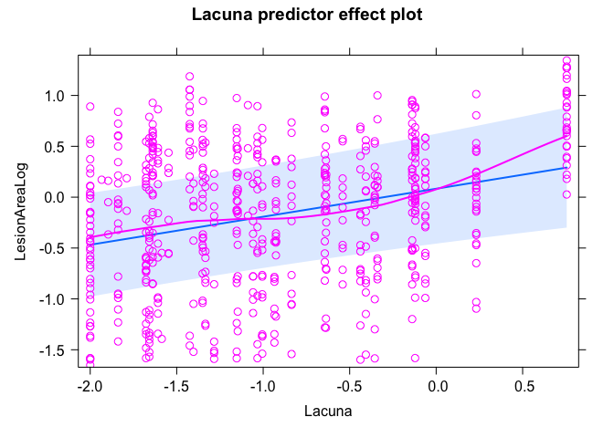
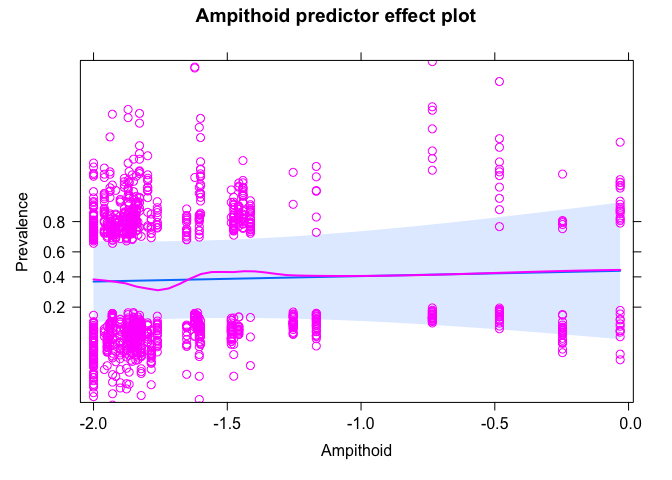
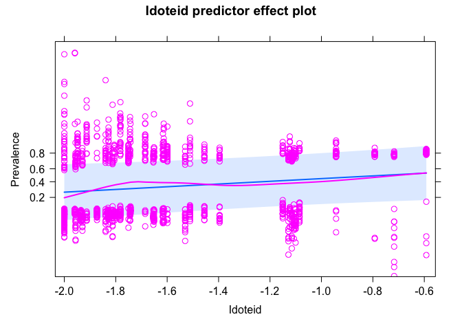
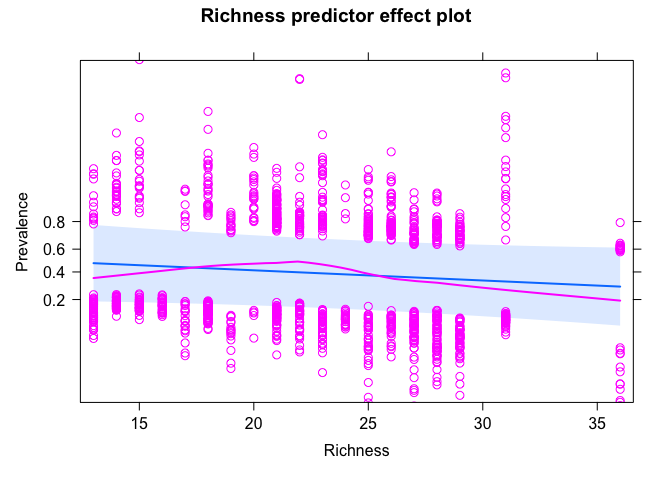
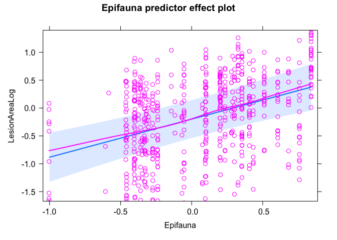
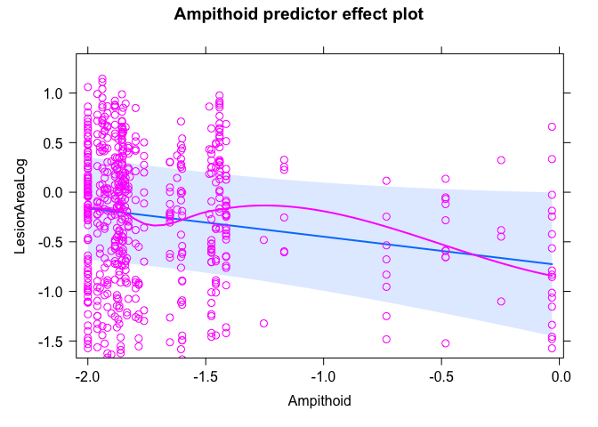
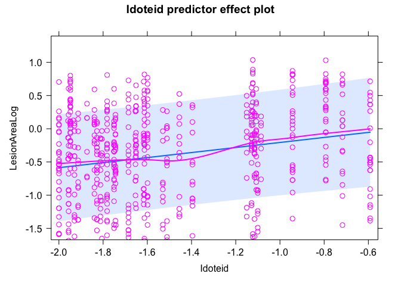
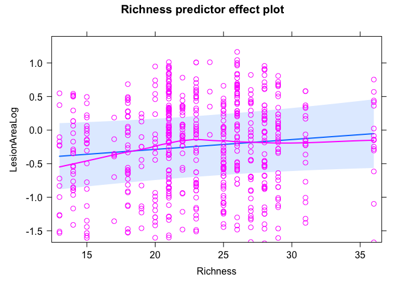

Community Interaction SEM results
================

# SEMs comparing epifauna vs lacuna vs ampithoid vs iodteid vs richness

Try including epiphyte at the blade level. This variable was not
important before, but I’ve changed the structure of the SEMs (two years
only, meadow-scale predictors). And, the relationship with taxa might
vary (haven’t looked at that). Also, the data are now updated with
better BB data.

A few notes:  
- Large epifauna only (except at BB).  
- Epiphyte blades only. A handful are missing due to no epiphytes (wrong
leaf etc)  
- Zeros are included (not NAs), all sites for all models.  
- Taxa abundances are log-transformed.

``` r
# data ###
dis <- read_csv("data/epiphyte_SEM_data_all_large.csv")
```

    ## Rows: 1350 Columns: 49
    ## ── Column specification ────────────────────────────────────────────────────────
    ## Delimiter: ","
    ## chr   (9): Meter, SampleId, Region, SiteCode, TidalHeight, GrazingScars, Bro...
    ## dbl  (39): Transect, Blade, LongestBladeLength, LongestBladeWidth, SheathLen...
    ## date  (1): SampleDate
    ## 
    ## ℹ Use `spec()` to retrieve the full column specification for this data.
    ## ℹ Specify the column types or set `show_col_types = FALSE` to quiet this message.

``` r
# updating the SEM to compare the effects of using large vs all animals
dis$BladeAreaLog <- log10(dis$BladeArea)
dis$EpiphyteLog <- log10(dis$EpiphytePerAreamgcm2+0.01)
# use the full data set without subsetting because the SEM no longer includes epiphytes or grazing
dis1 <- select(dis, c(Epifauna = Epifauna_all, TempAnomWarm_June, MonthlyMeanTemp_June, CanopyHeight, 
                      DensityLog, YearBinary, Year, Meadow, Region,BladeAreaLog, TidalHeightBinary, 
                      Prevalence, LesionArea, EpiphytePerAreamgcm2, EpiphyteLog,
                      Lacuna = Lacuna_all, 
                      Ampithoid = Ampithoid_all, Idoteid = Idoteid_all, Richness = Richness_all))

dis1_large <- select(dis, c(Epifauna = Epifauna_large, TempAnomWarm_June, MonthlyMeanTemp_June, CanopyHeight, 
                      DensityLog, YearBinary, Year, Meadow, Region,BladeAreaLog, TidalHeightBinary, 
                      Prevalence, LesionArea, EpiphyteLog, Lacuna = Lacuna_large, 
                      Ampithoid = Ampithoid_large, Idoteid = Idoteid_large, Richness = Richness_large))
dis_large <- na.omit(dis1_large)
dis_large$Meadow_Year <- paste(dis_large$Meadow, dis_large$Year, sep = "_")
site_large <- distinct(dis_large, Meadow_Year, .keep_all = T)
site_large <- select(site_large, -c(Prevalence, LesionArea, EpiphyteLog, TidalHeightBinary, BladeAreaLog))
# site <- read_csv("data/epifauna_site_for_plotting.csv")
# site <- select(site, c())
```

## Prevalence + Epifauna

``` r
sem_prev_epi <- psem(
  lmer(Epifauna ~ TempAnomWarm_June + MonthlyMeanTemp_June + 
         CanopyHeight + DensityLog +
         YearBinary +
         (1|Meadow) + (1|Region),
       data=site_large),
  lmer(CanopyHeight ~ TempAnomWarm_June + MonthlyMeanTemp_June + 
         YearBinary + 
         (1|Meadow) + (1|Region),
       data=site_large),
  lmer(DensityLog ~ TempAnomWarm_June + MonthlyMeanTemp_June +
         YearBinary + 
         (1|Meadow) + (1|Region),
       data=site_large),
    lmer(BladeAreaLog ~ Epifauna + CanopyHeight + DensityLog + 
         TempAnomWarm_June + MonthlyMeanTemp_June +
         TidalHeightBinary + YearBinary +
         (1|Region) + (1|Meadow),
       data=dis_large),
  lmer(EpiphyteLog ~ BladeAreaLog + Epifauna + CanopyHeight + DensityLog + 
         TempAnomWarm_June + MonthlyMeanTemp_June +
         TidalHeightBinary + YearBinary +
         (1|Region) + (1|Meadow),
       data=dis_large),
  glmer(Prevalence ~ BladeAreaLog + EpiphyteLog + 
          Epifauna + CanopyHeight + DensityLog + 
          TempAnomWarm_June + MonthlyMeanTemp_June + 
          TidalHeightBinary + YearBinary + 
          (1|Region) + (1|Meadow),
        data=dis_large,
        family = "binomial"),
  DensityLog%~~%CanopyHeight
)
summary(sem_prev_epi)
```

    ##   |                                                                              |                                                                      |   0%  |                                                                              |=======================                                               |  33%  |                                                                              |===============================================                       |  67%  |                                                                              |======================================================================| 100%

    ## 
    ## Structural Equation Model of sem_prev_epi 
    ## 
    ## Call:
    ##   Epifauna ~ TempAnomWarm_June + MonthlyMeanTemp_June + CanopyHeight + DensityLog + YearBinary
    ##   CanopyHeight ~ TempAnomWarm_June + MonthlyMeanTemp_June + YearBinary
    ##   DensityLog ~ TempAnomWarm_June + MonthlyMeanTemp_June + YearBinary
    ##   BladeAreaLog ~ Epifauna + CanopyHeight + DensityLog + TempAnomWarm_June + MonthlyMeanTemp_June + TidalHeightBinary + YearBinary
    ##   EpiphyteLog ~ BladeAreaLog + Epifauna + CanopyHeight + DensityLog + TempAnomWarm_June + MonthlyMeanTemp_June + TidalHeightBinary + YearBinary
    ##   Prevalence ~ BladeAreaLog + EpiphyteLog + Epifauna + CanopyHeight + DensityLog + TempAnomWarm_June + MonthlyMeanTemp_June + TidalHeightBinary + YearBinary
    ##   DensityLog ~~ CanopyHeight
    ## 
    ##     AIC      BIC
    ##  116.333   221.119
    ## 
    ## ---
    ## Tests of directed separation:
    ## 
    ##                           Independ.Claim Test.Type       DF Crit.Value P.Value 
    ##   CanopyHeight ~ TidalHeightBinary + ...      coef 1307.004     0.0042  0.9484 
    ##     DensityLog ~ TidalHeightBinary + ...      coef 1307.001     0.0169  0.8966 
    ##       Epifauna ~ TidalHeightBinary + ...      coef 1305.003     0.0000  0.9956 
    ## 
    ## Global goodness-of-fit:
    ## 
    ##   Fisher's C = 0.333 with P-value = 0.999 and on 6 degrees of freedom
    ## 
    ## ---
    ## Coefficients:
    ## 
    ##       Response            Predictor Estimate Std.Error        DF Crit.Value
    ##       Epifauna    TempAnomWarm_June  -0.0170    0.0056   23.6027     8.2905
    ##       Epifauna MonthlyMeanTemp_June   0.0167    0.0449    9.3690     0.1199
    ##       Epifauna         CanopyHeight  -0.7181    0.2149   38.9462     9.1972
    ##       Epifauna           DensityLog  -0.4677    0.1818   30.4214     4.9938
    ##       Epifauna           YearBinary  -0.0833    0.0747   19.2954     1.1829
    ##   CanopyHeight    TempAnomWarm_June  -0.0054    0.0035   22.0873     2.1953
    ##   CanopyHeight MonthlyMeanTemp_June  -0.0728    0.0352   10.7257     3.6930
    ##   CanopyHeight           YearBinary  -0.1096    0.0453   16.8258     5.7554
    ##     DensityLog    TempAnomWarm_June  -0.0121    0.0044   20.7963     6.5429
    ##     DensityLog MonthlyMeanTemp_June   0.0750    0.0509   12.8657     1.7202
    ##     DensityLog           YearBinary  -0.0610     0.051   16.6099     1.4062
    ##   BladeAreaLog             Epifauna  -0.0626    0.0426   87.7021     2.0172
    ##   BladeAreaLog         CanopyHeight   0.6842    0.0641   86.5019   107.1005
    ##   BladeAreaLog           DensityLog  -0.1456    0.0559  101.2453     6.0711
    ##   BladeAreaLog    TempAnomWarm_June  -0.0029    0.0018   68.5047     2.3280
    ##   BladeAreaLog MonthlyMeanTemp_June  -0.0058    0.0179   16.5561     0.0838
    ##   BladeAreaLog    TidalHeightBinary  -0.2414    0.0132 1305.5598   332.7172
    ##   BladeAreaLog           YearBinary   0.0553    0.0179  954.1424     9.3890
    ##    EpiphyteLog         BladeAreaLog  -0.1593    0.0436 1316.7196    13.3331
    ##    EpiphyteLog             Epifauna   0.1379    0.0842  255.6101     2.5751
    ##    EpiphyteLog         CanopyHeight  -0.4370    0.1296  286.6236    10.9755
    ##    EpiphyteLog           DensityLog  -0.2158    0.1117  331.2801     3.5593
    ##    EpiphyteLog    TempAnomWarm_June   0.0086    0.0037  500.9209     5.1057
    ##    EpiphyteLog MonthlyMeanTemp_June  -0.2232    0.0449  189.0115    22.1647
    ##    EpiphyteLog    TidalHeightBinary  -0.0565    0.0234 1306.7835     5.8313
    ##    EpiphyteLog           YearBinary  -0.0372    0.0297 1223.4455     1.5531
    ##     Prevalence         BladeAreaLog   1.7422    0.2963 1338.0000     5.8795
    ##     Prevalence          EpiphyteLog  -0.0142    0.1642 1338.0000    -0.0865
    ##     Prevalence             Epifauna   1.2960    0.4302 1338.0000     3.0126
    ##     Prevalence         CanopyHeight   1.7492    0.6821 1338.0000     2.5646
    ##     Prevalence           DensityLog   2.6509    0.5716 1338.0000     4.6379
    ##     Prevalence    TempAnomWarm_June   0.0252    0.0192 1338.0000     1.3135
    ##     Prevalence MonthlyMeanTemp_June   0.3921     0.225 1338.0000     1.7427
    ##     Prevalence    TidalHeightBinary   0.6429     0.143 1338.0000     4.4968
    ##     Prevalence           YearBinary   0.3695     0.172 1338.0000     2.1491
    ##   ~~DensityLog       ~~CanopyHeight  -0.1001         -   45.0000    -0.6518
    ##   P.Value Std.Estimate    
    ##    0.0083      -0.3647  **
    ##    0.7367       0.0674    
    ##    0.0043      -0.5966  **
    ##    0.0329      -0.5526   *
    ##    0.2902      -0.1002    
    ##    0.1526      -0.1398    
    ##    0.0816      -0.3541    
    ##    0.0283      -0.1588   *
    ##    0.0184      -0.2191   *
    ##    0.2126       0.2565    
    ##    0.2524      -0.0621    
    ##    0.1591      -0.0611    
    ##    0.0000       0.5549 ***
    ##    0.0154      -0.1679   *
    ##    0.1317      -0.0616    
    ##    0.7758      -0.0227    
    ##    0.0000      -0.2851 ***
    ##    0.0022       0.0649  **
    ##    0.0003      -0.0668 ***
    ##    0.1098       0.0564    
    ##    0.0010      -0.1486  **
    ##    0.0601      -0.1044    
    ##    0.0243       0.0751   *
    ##    0.0000      -0.3692 ***
    ##    0.0159       -0.028   *
    ##    0.2129      -0.0183    
    ##    0.0000            - ***
    ##    0.9310            -    
    ##    0.0026            -  **
    ##    0.0103            -   *
    ##    0.0000            - ***
    ##    0.1890            -    
    ##    0.0814            -    
    ##    0.0000            - ***
    ##    0.0316            -   *
    ##    0.2590      -0.1001    
    ## 
    ##   Signif. codes:  0 '***' 0.001 '**' 0.01 '*' 0.05
    ## 
    ## ---
    ## Individual R-squared:
    ## 
    ##       Response method Marginal Conditional
    ##       Epifauna   none     0.25        0.83
    ##   CanopyHeight   none     0.18        0.89
    ##     DensityLog   none     0.09        0.93
    ##   BladeAreaLog   none     0.51        0.68
    ##    EpiphyteLog   none     0.14        0.87
    ##     Prevalence  delta     0.16        0.50

Passes global fit.

Epifauna abundance is significant and positive predictor of prevalence.

Coefficient table:

``` r
a <- coefs(sem_prev_epi)
kable(a, digits = 4, caption = "Coefficients from Total Epifauna-Prevalence SEM") 
```

<table>
<caption>
Coefficients from Total Epifauna-Prevalence SEM
</caption>
<thead>
<tr>
<th style="text-align:left;">
Response
</th>
<th style="text-align:left;">
Predictor
</th>
<th style="text-align:right;">
Estimate
</th>
<th style="text-align:left;">
Std.Error
</th>
<th style="text-align:right;">
DF
</th>
<th style="text-align:right;">
Crit.Value
</th>
<th style="text-align:right;">
P.Value
</th>
<th style="text-align:right;">
Std.Estimate
</th>
<th style="text-align:left;">
</th>
</tr>
</thead>
<tbody>
<tr>
<td style="text-align:left;">
Epifauna
</td>
<td style="text-align:left;">
TempAnomWarm_June
</td>
<td style="text-align:right;">
-0.0170
</td>
<td style="text-align:left;">
0.0056
</td>
<td style="text-align:right;">
23.6027
</td>
<td style="text-align:right;">
8.2905
</td>
<td style="text-align:right;">
0.0083
</td>
<td style="text-align:right;">
-0.3647
</td>
<td style="text-align:left;">
\*\*
</td>
</tr>
<tr>
<td style="text-align:left;">
Epifauna
</td>
<td style="text-align:left;">
MonthlyMeanTemp_June
</td>
<td style="text-align:right;">
0.0167
</td>
<td style="text-align:left;">
0.0449
</td>
<td style="text-align:right;">
9.3690
</td>
<td style="text-align:right;">
0.1199
</td>
<td style="text-align:right;">
0.7367
</td>
<td style="text-align:right;">
0.0674
</td>
<td style="text-align:left;">
</td>
</tr>
<tr>
<td style="text-align:left;">
Epifauna
</td>
<td style="text-align:left;">
CanopyHeight
</td>
<td style="text-align:right;">
-0.7181
</td>
<td style="text-align:left;">
0.2149
</td>
<td style="text-align:right;">
38.9462
</td>
<td style="text-align:right;">
9.1972
</td>
<td style="text-align:right;">
0.0043
</td>
<td style="text-align:right;">
-0.5966
</td>
<td style="text-align:left;">
\*\*
</td>
</tr>
<tr>
<td style="text-align:left;">
Epifauna
</td>
<td style="text-align:left;">
DensityLog
</td>
<td style="text-align:right;">
-0.4677
</td>
<td style="text-align:left;">
0.1818
</td>
<td style="text-align:right;">
30.4214
</td>
<td style="text-align:right;">
4.9938
</td>
<td style="text-align:right;">
0.0329
</td>
<td style="text-align:right;">
-0.5526
</td>
<td style="text-align:left;">

- </td>
  </tr>
  <tr>
  <td style="text-align:left;">
  Epifauna
  </td>
  <td style="text-align:left;">
  YearBinary
  </td>
  <td style="text-align:right;">
  -0.0833
  </td>
  <td style="text-align:left;">
  0.0747
  </td>
  <td style="text-align:right;">
  19.2954
  </td>
  <td style="text-align:right;">
  1.1829
  </td>
  <td style="text-align:right;">
  0.2902
  </td>
  <td style="text-align:right;">
  -0.1002
  </td>
  <td style="text-align:left;">
  </td>
  </tr>
  <tr>
  <td style="text-align:left;">
  CanopyHeight
  </td>
  <td style="text-align:left;">
  TempAnomWarm_June
  </td>
  <td style="text-align:right;">
  -0.0054
  </td>
  <td style="text-align:left;">
  0.0035
  </td>
  <td style="text-align:right;">
  22.0873
  </td>
  <td style="text-align:right;">
  2.1953
  </td>
  <td style="text-align:right;">
  0.1526
  </td>
  <td style="text-align:right;">
  -0.1398
  </td>
  <td style="text-align:left;">
  </td>
  </tr>
  <tr>
  <td style="text-align:left;">
  CanopyHeight
  </td>
  <td style="text-align:left;">
  MonthlyMeanTemp_June
  </td>
  <td style="text-align:right;">
  -0.0728
  </td>
  <td style="text-align:left;">
  0.0352
  </td>
  <td style="text-align:right;">
  10.7257
  </td>
  <td style="text-align:right;">
  3.6930
  </td>
  <td style="text-align:right;">
  0.0816
  </td>
  <td style="text-align:right;">
  -0.3541
  </td>
  <td style="text-align:left;">
  </td>
  </tr>
  <tr>
  <td style="text-align:left;">
  CanopyHeight
  </td>
  <td style="text-align:left;">
  YearBinary
  </td>
  <td style="text-align:right;">
  -0.1096
  </td>
  <td style="text-align:left;">
  0.0453
  </td>
  <td style="text-align:right;">
  16.8258
  </td>
  <td style="text-align:right;">
  5.7554
  </td>
  <td style="text-align:right;">
  0.0283
  </td>
  <td style="text-align:right;">
  -0.1588
  </td>
  <td style="text-align:left;">

  - </td>
    </tr>
    <tr>
    <td style="text-align:left;">
    DensityLog
    </td>
    <td style="text-align:left;">
    TempAnomWarm_June
    </td>
    <td style="text-align:right;">
    -0.0121
    </td>
    <td style="text-align:left;">
    0.0044
    </td>
    <td style="text-align:right;">
    20.7963
    </td>
    <td style="text-align:right;">
    6.5429
    </td>
    <td style="text-align:right;">
    0.0184
    </td>
    <td style="text-align:right;">
    -0.2191
    </td>
    <td style="text-align:left;">

    - </td>
      </tr>
      <tr>
      <td style="text-align:left;">
      DensityLog
      </td>
      <td style="text-align:left;">
      MonthlyMeanTemp_June
      </td>
      <td style="text-align:right;">
      0.0750
      </td>
      <td style="text-align:left;">
      0.0509
      </td>
      <td style="text-align:right;">
      12.8657
      </td>
      <td style="text-align:right;">
      1.7202
      </td>
      <td style="text-align:right;">
      0.2126
      </td>
      <td style="text-align:right;">
      0.2565
      </td>
      <td style="text-align:left;">
      </td>
      </tr>
      <tr>
      <td style="text-align:left;">
      DensityLog
      </td>
      <td style="text-align:left;">
      YearBinary
      </td>
      <td style="text-align:right;">
      -0.0610
      </td>
      <td style="text-align:left;">
      0.051
      </td>
      <td style="text-align:right;">
      16.6099
      </td>
      <td style="text-align:right;">
      1.4062
      </td>
      <td style="text-align:right;">
      0.2524
      </td>
      <td style="text-align:right;">
      -0.0621
      </td>
      <td style="text-align:left;">
      </td>
      </tr>
      <tr>
      <td style="text-align:left;">
      BladeAreaLog
      </td>
      <td style="text-align:left;">
      Epifauna
      </td>
      <td style="text-align:right;">
      -0.0626
      </td>
      <td style="text-align:left;">
      0.0426
      </td>
      <td style="text-align:right;">
      87.7021
      </td>
      <td style="text-align:right;">
      2.0172
      </td>
      <td style="text-align:right;">
      0.1591
      </td>
      <td style="text-align:right;">
      -0.0611
      </td>
      <td style="text-align:left;">
      </td>
      </tr>
      <tr>
      <td style="text-align:left;">
      BladeAreaLog
      </td>
      <td style="text-align:left;">
      CanopyHeight
      </td>
      <td style="text-align:right;">
      0.6842
      </td>
      <td style="text-align:left;">
      0.0641
      </td>
      <td style="text-align:right;">
      86.5019
      </td>
      <td style="text-align:right;">
      107.1005
      </td>
      <td style="text-align:right;">
      0.0000
      </td>
      <td style="text-align:right;">
      0.5549
      </td>
      <td style="text-align:left;">
      \*\*\*
      </td>
      </tr>
      <tr>
      <td style="text-align:left;">
      BladeAreaLog
      </td>
      <td style="text-align:left;">
      DensityLog
      </td>
      <td style="text-align:right;">
      -0.1456
      </td>
      <td style="text-align:left;">
      0.0559
      </td>
      <td style="text-align:right;">
      101.2453
      </td>
      <td style="text-align:right;">
      6.0711
      </td>
      <td style="text-align:right;">
      0.0154
      </td>
      <td style="text-align:right;">
      -0.1679
      </td>
      <td style="text-align:left;">

      - </td>
        </tr>
        <tr>
        <td style="text-align:left;">
        BladeAreaLog
        </td>
        <td style="text-align:left;">
        TempAnomWarm_June
        </td>
        <td style="text-align:right;">
        -0.0029
        </td>
        <td style="text-align:left;">
        0.0018
        </td>
        <td style="text-align:right;">
        68.5047
        </td>
        <td style="text-align:right;">
        2.3280
        </td>
        <td style="text-align:right;">
        0.1317
        </td>
        <td style="text-align:right;">
        -0.0616
        </td>
        <td style="text-align:left;">
        </td>
        </tr>
        <tr>
        <td style="text-align:left;">
        BladeAreaLog
        </td>
        <td style="text-align:left;">
        MonthlyMeanTemp_June
        </td>
        <td style="text-align:right;">
        -0.0058
        </td>
        <td style="text-align:left;">
        0.0179
        </td>
        <td style="text-align:right;">
        16.5561
        </td>
        <td style="text-align:right;">
        0.0838
        </td>
        <td style="text-align:right;">
        0.7758
        </td>
        <td style="text-align:right;">
        -0.0227
        </td>
        <td style="text-align:left;">
        </td>
        </tr>
        <tr>
        <td style="text-align:left;">
        BladeAreaLog
        </td>
        <td style="text-align:left;">
        TidalHeightBinary
        </td>
        <td style="text-align:right;">
        -0.2414
        </td>
        <td style="text-align:left;">
        0.0132
        </td>
        <td style="text-align:right;">
        1305.5598
        </td>
        <td style="text-align:right;">
        332.7172
        </td>
        <td style="text-align:right;">
        0.0000
        </td>
        <td style="text-align:right;">
        -0.2851
        </td>
        <td style="text-align:left;">
        \*\*\*
        </td>
        </tr>
        <tr>
        <td style="text-align:left;">
        BladeAreaLog
        </td>
        <td style="text-align:left;">
        YearBinary
        </td>
        <td style="text-align:right;">
        0.0553
        </td>
        <td style="text-align:left;">
        0.0179
        </td>
        <td style="text-align:right;">
        954.1424
        </td>
        <td style="text-align:right;">
        9.3890
        </td>
        <td style="text-align:right;">
        0.0022
        </td>
        <td style="text-align:right;">
        0.0649
        </td>
        <td style="text-align:left;">
        \*\*
        </td>
        </tr>
        <tr>
        <td style="text-align:left;">
        EpiphyteLog
        </td>
        <td style="text-align:left;">
        BladeAreaLog
        </td>
        <td style="text-align:right;">
        -0.1593
        </td>
        <td style="text-align:left;">
        0.0436
        </td>
        <td style="text-align:right;">
        1316.7196
        </td>
        <td style="text-align:right;">
        13.3331
        </td>
        <td style="text-align:right;">
        0.0003
        </td>
        <td style="text-align:right;">
        -0.0668
        </td>
        <td style="text-align:left;">
        \*\*\*
        </td>
        </tr>
        <tr>
        <td style="text-align:left;">
        EpiphyteLog
        </td>
        <td style="text-align:left;">
        Epifauna
        </td>
        <td style="text-align:right;">
        0.1379
        </td>
        <td style="text-align:left;">
        0.0842
        </td>
        <td style="text-align:right;">
        255.6101
        </td>
        <td style="text-align:right;">
        2.5751
        </td>
        <td style="text-align:right;">
        0.1098
        </td>
        <td style="text-align:right;">
        0.0564
        </td>
        <td style="text-align:left;">
        </td>
        </tr>
        <tr>
        <td style="text-align:left;">
        EpiphyteLog
        </td>
        <td style="text-align:left;">
        CanopyHeight
        </td>
        <td style="text-align:right;">
        -0.4370
        </td>
        <td style="text-align:left;">
        0.1296
        </td>
        <td style="text-align:right;">
        286.6236
        </td>
        <td style="text-align:right;">
        10.9755
        </td>
        <td style="text-align:right;">
        0.0010
        </td>
        <td style="text-align:right;">
        -0.1486
        </td>
        <td style="text-align:left;">
        \*\*
        </td>
        </tr>
        <tr>
        <td style="text-align:left;">
        EpiphyteLog
        </td>
        <td style="text-align:left;">
        DensityLog
        </td>
        <td style="text-align:right;">
        -0.2158
        </td>
        <td style="text-align:left;">
        0.1117
        </td>
        <td style="text-align:right;">
        331.2801
        </td>
        <td style="text-align:right;">
        3.5593
        </td>
        <td style="text-align:right;">
        0.0601
        </td>
        <td style="text-align:right;">
        -0.1044
        </td>
        <td style="text-align:left;">
        </td>
        </tr>
        <tr>
        <td style="text-align:left;">
        EpiphyteLog
        </td>
        <td style="text-align:left;">
        TempAnomWarm_June
        </td>
        <td style="text-align:right;">
        0.0086
        </td>
        <td style="text-align:left;">
        0.0037
        </td>
        <td style="text-align:right;">
        500.9209
        </td>
        <td style="text-align:right;">
        5.1057
        </td>
        <td style="text-align:right;">
        0.0243
        </td>
        <td style="text-align:right;">
        0.0751
        </td>
        <td style="text-align:left;">

        - </td>
          </tr>
          <tr>
          <td style="text-align:left;">
          EpiphyteLog
          </td>
          <td style="text-align:left;">
          MonthlyMeanTemp_June
          </td>
          <td style="text-align:right;">
          -0.2232
          </td>
          <td style="text-align:left;">
          0.0449
          </td>
          <td style="text-align:right;">
          189.0115
          </td>
          <td style="text-align:right;">
          22.1647
          </td>
          <td style="text-align:right;">
          0.0000
          </td>
          <td style="text-align:right;">
          -0.3692
          </td>
          <td style="text-align:left;">
          \*\*\*
          </td>
          </tr>
          <tr>
          <td style="text-align:left;">
          EpiphyteLog
          </td>
          <td style="text-align:left;">
          TidalHeightBinary
          </td>
          <td style="text-align:right;">
          -0.0565
          </td>
          <td style="text-align:left;">
          0.0234
          </td>
          <td style="text-align:right;">
          1306.7835
          </td>
          <td style="text-align:right;">
          5.8313
          </td>
          <td style="text-align:right;">
          0.0159
          </td>
          <td style="text-align:right;">
          -0.0280
          </td>
          <td style="text-align:left;">

          - </td>
            </tr>
            <tr>
            <td style="text-align:left;">
            EpiphyteLog
            </td>
            <td style="text-align:left;">
            YearBinary
            </td>
            <td style="text-align:right;">
            -0.0372
            </td>
            <td style="text-align:left;">
            0.0297
            </td>
            <td style="text-align:right;">
            1223.4455
            </td>
            <td style="text-align:right;">
            1.5531
            </td>
            <td style="text-align:right;">
            0.2129
            </td>
            <td style="text-align:right;">
            -0.0183
            </td>
            <td style="text-align:left;">
            </td>
            </tr>
            <tr>
            <td style="text-align:left;">
            Prevalence
            </td>
            <td style="text-align:left;">
            BladeAreaLog
            </td>
            <td style="text-align:right;">
            1.7422
            </td>
            <td style="text-align:left;">
            0.2963
            </td>
            <td style="text-align:right;">
            1338.0000
            </td>
            <td style="text-align:right;">
            5.8795
            </td>
            <td style="text-align:right;">
            0.0000
            </td>
            <td style="text-align:right;">
            0.3266
            </td>
            <td style="text-align:left;">
            \*\*\*
            </td>
            </tr>
            <tr>
            <td style="text-align:left;">
            Prevalence
            </td>
            <td style="text-align:left;">
            EpiphyteLog
            </td>
            <td style="text-align:right;">
            -0.0142
            </td>
            <td style="text-align:left;">
            0.1642
            </td>
            <td style="text-align:right;">
            1338.0000
            </td>
            <td style="text-align:right;">
            -0.0865
            </td>
            <td style="text-align:right;">
            0.9310
            </td>
            <td style="text-align:right;">
            -0.0064
            </td>
            <td style="text-align:left;">
            </td>
            </tr>
            <tr>
            <td style="text-align:left;">
            Prevalence
            </td>
            <td style="text-align:left;">
            Epifauna
            </td>
            <td style="text-align:right;">
            1.2960
            </td>
            <td style="text-align:left;">
            0.4302
            </td>
            <td style="text-align:right;">
            1338.0000
            </td>
            <td style="text-align:right;">
            3.0126
            </td>
            <td style="text-align:right;">
            0.0026
            </td>
            <td style="text-align:right;">
            0.2371
            </td>
            <td style="text-align:left;">
            \*\*
            </td>
            </tr>
            <tr>
            <td style="text-align:left;">
            Prevalence
            </td>
            <td style="text-align:left;">
            CanopyHeight
            </td>
            <td style="text-align:right;">
            1.7492
            </td>
            <td style="text-align:left;">
            0.6821
            </td>
            <td style="text-align:right;">
            1338.0000
            </td>
            <td style="text-align:right;">
            2.5646
            </td>
            <td style="text-align:right;">
            0.0103
            </td>
            <td style="text-align:right;">
            0.2659
            </td>
            <td style="text-align:left;">

            - </td>
              </tr>
              <tr>
              <td style="text-align:left;">
              Prevalence
              </td>
              <td style="text-align:left;">
              DensityLog
              </td>
              <td style="text-align:right;">
              2.6509
              </td>
              <td style="text-align:left;">
              0.5716
              </td>
              <td style="text-align:right;">
              1338.0000
              </td>
              <td style="text-align:right;">
              4.6379
              </td>
              <td style="text-align:right;">
              0.0000
              </td>
              <td style="text-align:right;">
              0.5731
              </td>
              <td style="text-align:left;">
              \*\*\*
              </td>
              </tr>
              <tr>
              <td style="text-align:left;">
              Prevalence
              </td>
              <td style="text-align:left;">
              TempAnomWarm_June
              </td>
              <td style="text-align:right;">
              0.0252
              </td>
              <td style="text-align:left;">
              0.0192
              </td>
              <td style="text-align:right;">
              1338.0000
              </td>
              <td style="text-align:right;">
              1.3135
              </td>
              <td style="text-align:right;">
              0.1890
              </td>
              <td style="text-align:right;">
              0.0986
              </td>
              <td style="text-align:left;">
              </td>
              </tr>
              <tr>
              <td style="text-align:left;">
              Prevalence
              </td>
              <td style="text-align:left;">
              MonthlyMeanTemp_June
              </td>
              <td style="text-align:right;">
              0.3921
              </td>
              <td style="text-align:left;">
              0.225
              </td>
              <td style="text-align:right;">
              1338.0000
              </td>
              <td style="text-align:right;">
              1.7427
              </td>
              <td style="text-align:right;">
              0.0814
              </td>
              <td style="text-align:right;">
              0.2899
              </td>
              <td style="text-align:left;">
              </td>
              </tr>
              <tr>
              <td style="text-align:left;">
              Prevalence
              </td>
              <td style="text-align:left;">
              TidalHeightBinary
              </td>
              <td style="text-align:right;">
              0.6429
              </td>
              <td style="text-align:left;">
              0.143
              </td>
              <td style="text-align:right;">
              1338.0000
              </td>
              <td style="text-align:right;">
              4.4968
              </td>
              <td style="text-align:right;">
              0.0000
              </td>
              <td style="text-align:right;">
              0.1424
              </td>
              <td style="text-align:left;">
              \*\*\*
              </td>
              </tr>
              <tr>
              <td style="text-align:left;">
              Prevalence
              </td>
              <td style="text-align:left;">
              YearBinary
              </td>
              <td style="text-align:right;">
              0.3695
              </td>
              <td style="text-align:left;">
              0.172
              </td>
              <td style="text-align:right;">
              1338.0000
              </td>
              <td style="text-align:right;">
              2.1491
              </td>
              <td style="text-align:right;">
              0.0316
              </td>
              <td style="text-align:right;">
              0.0813
              </td>
              <td style="text-align:left;">

              - </td>
                </tr>
                <tr>
                <td style="text-align:left;">
                \~\~DensityLog
                </td>
                <td style="text-align:left;">
                \~\~CanopyHeight
                </td>
                <td style="text-align:right;">
                -0.1001
                </td>
                <td style="text-align:left;">

                - </td>
                  <td style="text-align:right;">
                  45.0000
                  </td>
                  <td style="text-align:right;">
                  -0.6518
                  </td>
                  <td style="text-align:right;">
                  0.2590
                  </td>
                  <td style="text-align:right;">
                  -0.1001
                  </td>
                  <td style="text-align:left;">
                  </td>
                  </tr>
                  </tbody>
                  </table>

``` r
# kable(dat4, booktabs = TRUE, caption = "Injuries before and after June 15, all sports-related, non-minor", linesep="") %>%
#   kable_styling(latex_options = c("HOLD_position"))
```

An alternative SEM - flip the prevalence to epifauna arrow? Not sure
this will work because of different scales

``` r
# sem_prev_epi2 <- psem(
#   lmer(Epifauna ~ Prevalence + TempAnomWarm_June + MonthlyMeanTemp_June + 
#          CanopyHeight + DensityLog +
#          YearBinary +
#          (1|Meadow) + (1|Region),
#        data=dis_large),
#   lmer(CanopyHeight ~ TempAnomWarm_June + MonthlyMeanTemp_June + 
#          YearBinary + 
#          (1|Meadow) + (1|Region),
#        data=site_large),
#   lmer(DensityLog ~ TempAnomWarm_June + MonthlyMeanTemp_June +
#          YearBinary + 
#          (1|Meadow) + (1|Region),
#        data=site_large),
#     lmer(BladeAreaLog ~ Epifauna + CanopyHeight + DensityLog + 
#          TempAnomWarm_June + MonthlyMeanTemp_June +
#          TidalHeightBinary + YearBinary +
#          (1|Region) + (1|Meadow),
#        data=dis_large),
#   lmer(EpiphyteLog ~ BladeAreaLog + Epifauna + CanopyHeight + DensityLog + 
#          TempAnomWarm_June + MonthlyMeanTemp_June +
#          TidalHeightBinary + YearBinary +
#          (1|Region) + (1|Meadow),
#        data=dis_large),
#   glmer(Prevalence ~ BladeAreaLog + EpiphyteLog + 
#           CanopyHeight + DensityLog + 
#           TempAnomWarm_June + MonthlyMeanTemp_June + 
#           TidalHeightBinary + YearBinary + 
#           (1|Region) + (1|Meadow),
#         data=dis_large,
#         family = "binomial"),
#   DensityLog%~~%CanopyHeight
# )
# summary(sem_prev_epi2)
```

This doesn’t really make sense - because the scale changes when the
arrow is reversed, which makes all the paths change.

## Prev + Amp

``` r
sem_prev_amp <- psem(
  lmer(Ampithoid ~ TempAnomWarm_June + MonthlyMeanTemp_June + 
         CanopyHeight + DensityLog +
         YearBinary +
         (1|Meadow) + (1|Region),
       data=site_large),
  lmer(CanopyHeight ~ TempAnomWarm_June + MonthlyMeanTemp_June + 
         YearBinary + 
         (1|Meadow) + (1|Region),
       data=site_large),
  lmer(DensityLog ~ TempAnomWarm_June + MonthlyMeanTemp_June +
         YearBinary + 
         (1|Meadow) + (1|Region),
       data=site_large),
    lmer(BladeAreaLog ~ Ampithoid + CanopyHeight + DensityLog + 
         TempAnomWarm_June + MonthlyMeanTemp_June +
         TidalHeightBinary + YearBinary +
         (1|Region) + (1|Meadow),
       data=dis_large),
  lmer(EpiphyteLog ~ BladeAreaLog + Ampithoid + CanopyHeight + DensityLog + 
         TempAnomWarm_June + MonthlyMeanTemp_June +
         TidalHeightBinary + YearBinary +
         (1|Region) + (1|Meadow),
       data=dis_large),
  glmer(Prevalence ~ BladeAreaLog + EpiphyteLog + 
          Ampithoid + CanopyHeight + DensityLog + 
          TempAnomWarm_June + MonthlyMeanTemp_June + 
          TidalHeightBinary + YearBinary + 
          (1|Region) + (1|Meadow),
        data=dis_large,
        family = "binomial"),
  DensityLog%~~%CanopyHeight
)
```

    ## Warning in checkConv(attr(opt, "derivs"), opt$par, ctrl = control$checkConv, :
    ## Model failed to converge with max|grad| = 0.0107381 (tol = 0.002, component 1)

``` r
summary(sem_prev_amp)
```

    ##   |                                                                              |                                                                      |   0%  |                                                                              |=======================                                               |  33%  |                                                                              |===============================================                       |  67%  |                                                                              |======================================================================| 100%

    ## 
    ## Structural Equation Model of sem_prev_amp 
    ## 
    ## Call:
    ##   Ampithoid ~ TempAnomWarm_June + MonthlyMeanTemp_June + CanopyHeight + DensityLog + YearBinary
    ##   CanopyHeight ~ TempAnomWarm_June + MonthlyMeanTemp_June + YearBinary
    ##   DensityLog ~ TempAnomWarm_June + MonthlyMeanTemp_June + YearBinary
    ##   BladeAreaLog ~ Ampithoid + CanopyHeight + DensityLog + TempAnomWarm_June + MonthlyMeanTemp_June + TidalHeightBinary + YearBinary
    ##   EpiphyteLog ~ BladeAreaLog + Ampithoid + CanopyHeight + DensityLog + TempAnomWarm_June + MonthlyMeanTemp_June + TidalHeightBinary + YearBinary
    ##   Prevalence ~ BladeAreaLog + EpiphyteLog + Ampithoid + CanopyHeight + DensityLog + TempAnomWarm_June + MonthlyMeanTemp_June + TidalHeightBinary + YearBinary
    ##   DensityLog ~~ CanopyHeight
    ## 
    ##     AIC      BIC
    ##  116.621   221.407
    ## 
    ## ---
    ## Tests of directed separation:
    ## 
    ##                           Independ.Claim Test.Type       DF Crit.Value P.Value 
    ##   CanopyHeight ~ TidalHeightBinary + ...      coef 1307.004     0.0042  0.9484 
    ##     DensityLog ~ TidalHeightBinary + ...      coef 1307.001     0.0169  0.8966 
    ##      Ampithoid ~ TidalHeightBinary + ...      coef 1305.002     0.0302  0.8622 
    ## 
    ## Global goodness-of-fit:
    ## 
    ##   Fisher's C = 0.621 with P-value = 0.996 and on 6 degrees of freedom
    ## 
    ## ---
    ## Coefficients:
    ## 
    ##       Response            Predictor Estimate Std.Error        DF Crit.Value
    ##      Ampithoid    TempAnomWarm_June  -0.0119    0.0041   23.5013     7.4039
    ##      Ampithoid MonthlyMeanTemp_June   0.1423    0.0425   14.2872     9.4237
    ##      Ampithoid         CanopyHeight  -0.1141    0.1825   27.3156     0.3297
    ##      Ampithoid           DensityLog   0.0323    0.1527   25.6654     0.0355
    ##      Ampithoid           YearBinary  -0.1593    0.0474   16.1330    10.8099
    ##   CanopyHeight    TempAnomWarm_June  -0.0054    0.0035   22.0873     2.1953
    ##   CanopyHeight MonthlyMeanTemp_June  -0.0728    0.0352   10.7257     3.6930
    ##   CanopyHeight           YearBinary  -0.1096    0.0453   16.8258     5.7554
    ##     DensityLog    TempAnomWarm_June  -0.0121    0.0044   20.7963     6.5429
    ##     DensityLog MonthlyMeanTemp_June   0.0750    0.0509   12.8657     1.7202
    ##     DensityLog           YearBinary  -0.0610     0.051   16.6099     1.4062
    ##   BladeAreaLog            Ampithoid   0.0338    0.0448   47.3668     0.5303
    ##   BladeAreaLog         CanopyHeight   0.7419    0.0619  139.6888   131.7490
    ##   BladeAreaLog           DensityLog  -0.1044    0.0519   88.6712     3.5359
    ##   BladeAreaLog    TempAnomWarm_June  -0.0008    0.0017   51.2154     0.1807
    ##   BladeAreaLog MonthlyMeanTemp_June  -0.0192    0.0171   14.3530     1.0608
    ##   BladeAreaLog    TidalHeightBinary  -0.2414    0.0132 1306.0097   332.4250
    ##   BladeAreaLog           YearBinary   0.0651    0.0201  883.2043    10.2472
    ##    EpiphyteLog         BladeAreaLog  -0.1612    0.0435 1316.5899    13.7024
    ##    EpiphyteLog            Ampithoid  -0.2202    0.1038   58.7462     4.3120
    ##    EpiphyteLog         CanopyHeight  -0.5637    0.1219  401.1432    20.7733
    ##    EpiphyteLog           DensityLog  -0.2564    0.1087  246.9364     5.2712
    ##    EpiphyteLog    TempAnomWarm_June   0.0039    0.0038  363.9419     0.9611
    ##    EpiphyteLog MonthlyMeanTemp_June  -0.2009    0.0478  205.1647    16.0035
    ##    EpiphyteLog    TidalHeightBinary  -0.0568    0.0233 1306.9311     5.9075
    ##    EpiphyteLog           YearBinary  -0.0789    0.0336 1094.3155     5.4696
    ##     Prevalence         BladeAreaLog   1.7151    0.2962 1338.0000     5.7907
    ##     Prevalence          EpiphyteLog   0.0150    0.1639 1338.0000     0.0914
    ##     Prevalence            Ampithoid   0.1772    0.5752 1338.0000     0.3081
    ##     Prevalence         CanopyHeight   1.0038    0.6864 1338.0000     1.4624
    ##     Prevalence           DensityLog   2.1599    0.5763 1338.0000     3.7481
    ##     Prevalence    TempAnomWarm_June   0.0103    0.0196 1338.0000     0.5226
    ##     Prevalence MonthlyMeanTemp_June   0.3094    0.2284 1338.0000     1.3549
    ##     Prevalence    TidalHeightBinary   0.6391     0.143 1338.0000     4.4689
    ##     Prevalence           YearBinary   0.3455    0.2038 1338.0000     1.6949
    ##   ~~DensityLog       ~~CanopyHeight  -0.1001         -   45.0000    -0.6518
    ##   P.Value Std.Estimate    
    ##    0.0120      -0.2306   *
    ##    0.0082       0.5231  **
    ##    0.5706      -0.0862    
    ##    0.8520       0.0347    
    ##    0.0046      -0.1743  **
    ##    0.1526      -0.1398    
    ##    0.0816      -0.3541    
    ##    0.0283      -0.1588   *
    ##    0.0184      -0.2191   *
    ##    0.2126       0.2565    
    ##    0.2524      -0.0621    
    ##    0.4701       0.0362    
    ##    0.0000       0.6017 ***
    ##    0.0633      -0.1204    
    ##    0.6726      -0.0159    
    ##    0.3201      -0.0759    
    ##    0.0000      -0.2852 ***
    ##    0.0014       0.0764  **
    ##    0.0002      -0.0676 ***
    ##    0.0422      -0.0991   *
    ##    0.0000      -0.1917 ***
    ##    0.0225       -0.124   *
    ##    0.3276       0.0342    
    ##    0.0001      -0.3322 ***
    ##    0.0152      -0.0281   *
    ##    0.0195      -0.0389   *
    ##    0.0000            - ***
    ##    0.9272            -    
    ##    0.7580            -    
    ##    0.1436            -    
    ##    0.0002            - ***
    ##    0.6012            -    
    ##    0.1755            -    
    ##    0.0000            - ***
    ##    0.0901            -    
    ##    0.2590      -0.1001    
    ## 
    ##   Signif. codes:  0 '***' 0.001 '**' 0.01 '*' 0.05
    ## 
    ## ---
    ## Individual R-squared:
    ## 
    ##       Response method Marginal Conditional
    ##      Ampithoid   none     0.26        0.95
    ##   CanopyHeight   none     0.18        0.89
    ##     DensityLog   none     0.09        0.93
    ##   BladeAreaLog   none     0.53        0.66
    ##    EpiphyteLog   none     0.14        0.87
    ##     Prevalence  delta     0.12        0.50

Passes global fit.

Ampithoid abundance is not significant predictor of prevalence.

Coefficient table:

``` r
b <- coefs(sem_prev_amp)
knitr::kable(b, digits = 4, caption = "Coefficients from Ampithoid-Prevalence SEM") 
```

<table>
<caption>
Coefficients from Ampithoid-Prevalence SEM
</caption>
<thead>
<tr>
<th style="text-align:left;">
Response
</th>
<th style="text-align:left;">
Predictor
</th>
<th style="text-align:right;">
Estimate
</th>
<th style="text-align:left;">
Std.Error
</th>
<th style="text-align:right;">
DF
</th>
<th style="text-align:right;">
Crit.Value
</th>
<th style="text-align:right;">
P.Value
</th>
<th style="text-align:right;">
Std.Estimate
</th>
<th style="text-align:left;">
</th>
</tr>
</thead>
<tbody>
<tr>
<td style="text-align:left;">
Ampithoid
</td>
<td style="text-align:left;">
TempAnomWarm_June
</td>
<td style="text-align:right;">
-0.0119
</td>
<td style="text-align:left;">
0.0041
</td>
<td style="text-align:right;">
23.5013
</td>
<td style="text-align:right;">
7.4039
</td>
<td style="text-align:right;">
0.0120
</td>
<td style="text-align:right;">
-0.2306
</td>
<td style="text-align:left;">

- </td>
  </tr>
  <tr>
  <td style="text-align:left;">
  Ampithoid
  </td>
  <td style="text-align:left;">
  MonthlyMeanTemp_June
  </td>
  <td style="text-align:right;">
  0.1423
  </td>
  <td style="text-align:left;">
  0.0425
  </td>
  <td style="text-align:right;">
  14.2872
  </td>
  <td style="text-align:right;">
  9.4237
  </td>
  <td style="text-align:right;">
  0.0082
  </td>
  <td style="text-align:right;">
  0.5231
  </td>
  <td style="text-align:left;">
  \*\*
  </td>
  </tr>
  <tr>
  <td style="text-align:left;">
  Ampithoid
  </td>
  <td style="text-align:left;">
  CanopyHeight
  </td>
  <td style="text-align:right;">
  -0.1141
  </td>
  <td style="text-align:left;">
  0.1825
  </td>
  <td style="text-align:right;">
  27.3156
  </td>
  <td style="text-align:right;">
  0.3297
  </td>
  <td style="text-align:right;">
  0.5706
  </td>
  <td style="text-align:right;">
  -0.0862
  </td>
  <td style="text-align:left;">
  </td>
  </tr>
  <tr>
  <td style="text-align:left;">
  Ampithoid
  </td>
  <td style="text-align:left;">
  DensityLog
  </td>
  <td style="text-align:right;">
  0.0323
  </td>
  <td style="text-align:left;">
  0.1527
  </td>
  <td style="text-align:right;">
  25.6654
  </td>
  <td style="text-align:right;">
  0.0355
  </td>
  <td style="text-align:right;">
  0.8520
  </td>
  <td style="text-align:right;">
  0.0347
  </td>
  <td style="text-align:left;">
  </td>
  </tr>
  <tr>
  <td style="text-align:left;">
  Ampithoid
  </td>
  <td style="text-align:left;">
  YearBinary
  </td>
  <td style="text-align:right;">
  -0.1593
  </td>
  <td style="text-align:left;">
  0.0474
  </td>
  <td style="text-align:right;">
  16.1330
  </td>
  <td style="text-align:right;">
  10.8099
  </td>
  <td style="text-align:right;">
  0.0046
  </td>
  <td style="text-align:right;">
  -0.1743
  </td>
  <td style="text-align:left;">
  \*\*
  </td>
  </tr>
  <tr>
  <td style="text-align:left;">
  CanopyHeight
  </td>
  <td style="text-align:left;">
  TempAnomWarm_June
  </td>
  <td style="text-align:right;">
  -0.0054
  </td>
  <td style="text-align:left;">
  0.0035
  </td>
  <td style="text-align:right;">
  22.0873
  </td>
  <td style="text-align:right;">
  2.1953
  </td>
  <td style="text-align:right;">
  0.1526
  </td>
  <td style="text-align:right;">
  -0.1398
  </td>
  <td style="text-align:left;">
  </td>
  </tr>
  <tr>
  <td style="text-align:left;">
  CanopyHeight
  </td>
  <td style="text-align:left;">
  MonthlyMeanTemp_June
  </td>
  <td style="text-align:right;">
  -0.0728
  </td>
  <td style="text-align:left;">
  0.0352
  </td>
  <td style="text-align:right;">
  10.7257
  </td>
  <td style="text-align:right;">
  3.6930
  </td>
  <td style="text-align:right;">
  0.0816
  </td>
  <td style="text-align:right;">
  -0.3541
  </td>
  <td style="text-align:left;">
  </td>
  </tr>
  <tr>
  <td style="text-align:left;">
  CanopyHeight
  </td>
  <td style="text-align:left;">
  YearBinary
  </td>
  <td style="text-align:right;">
  -0.1096
  </td>
  <td style="text-align:left;">
  0.0453
  </td>
  <td style="text-align:right;">
  16.8258
  </td>
  <td style="text-align:right;">
  5.7554
  </td>
  <td style="text-align:right;">
  0.0283
  </td>
  <td style="text-align:right;">
  -0.1588
  </td>
  <td style="text-align:left;">

  - </td>
    </tr>
    <tr>
    <td style="text-align:left;">
    DensityLog
    </td>
    <td style="text-align:left;">
    TempAnomWarm_June
    </td>
    <td style="text-align:right;">
    -0.0121
    </td>
    <td style="text-align:left;">
    0.0044
    </td>
    <td style="text-align:right;">
    20.7963
    </td>
    <td style="text-align:right;">
    6.5429
    </td>
    <td style="text-align:right;">
    0.0184
    </td>
    <td style="text-align:right;">
    -0.2191
    </td>
    <td style="text-align:left;">

    - </td>
      </tr>
      <tr>
      <td style="text-align:left;">
      DensityLog
      </td>
      <td style="text-align:left;">
      MonthlyMeanTemp_June
      </td>
      <td style="text-align:right;">
      0.0750
      </td>
      <td style="text-align:left;">
      0.0509
      </td>
      <td style="text-align:right;">
      12.8657
      </td>
      <td style="text-align:right;">
      1.7202
      </td>
      <td style="text-align:right;">
      0.2126
      </td>
      <td style="text-align:right;">
      0.2565
      </td>
      <td style="text-align:left;">
      </td>
      </tr>
      <tr>
      <td style="text-align:left;">
      DensityLog
      </td>
      <td style="text-align:left;">
      YearBinary
      </td>
      <td style="text-align:right;">
      -0.0610
      </td>
      <td style="text-align:left;">
      0.051
      </td>
      <td style="text-align:right;">
      16.6099
      </td>
      <td style="text-align:right;">
      1.4062
      </td>
      <td style="text-align:right;">
      0.2524
      </td>
      <td style="text-align:right;">
      -0.0621
      </td>
      <td style="text-align:left;">
      </td>
      </tr>
      <tr>
      <td style="text-align:left;">
      BladeAreaLog
      </td>
      <td style="text-align:left;">
      Ampithoid
      </td>
      <td style="text-align:right;">
      0.0338
      </td>
      <td style="text-align:left;">
      0.0448
      </td>
      <td style="text-align:right;">
      47.3668
      </td>
      <td style="text-align:right;">
      0.5303
      </td>
      <td style="text-align:right;">
      0.4701
      </td>
      <td style="text-align:right;">
      0.0362
      </td>
      <td style="text-align:left;">
      </td>
      </tr>
      <tr>
      <td style="text-align:left;">
      BladeAreaLog
      </td>
      <td style="text-align:left;">
      CanopyHeight
      </td>
      <td style="text-align:right;">
      0.7419
      </td>
      <td style="text-align:left;">
      0.0619
      </td>
      <td style="text-align:right;">
      139.6888
      </td>
      <td style="text-align:right;">
      131.7490
      </td>
      <td style="text-align:right;">
      0.0000
      </td>
      <td style="text-align:right;">
      0.6017
      </td>
      <td style="text-align:left;">
      \*\*\*
      </td>
      </tr>
      <tr>
      <td style="text-align:left;">
      BladeAreaLog
      </td>
      <td style="text-align:left;">
      DensityLog
      </td>
      <td style="text-align:right;">
      -0.1044
      </td>
      <td style="text-align:left;">
      0.0519
      </td>
      <td style="text-align:right;">
      88.6712
      </td>
      <td style="text-align:right;">
      3.5359
      </td>
      <td style="text-align:right;">
      0.0633
      </td>
      <td style="text-align:right;">
      -0.1204
      </td>
      <td style="text-align:left;">
      </td>
      </tr>
      <tr>
      <td style="text-align:left;">
      BladeAreaLog
      </td>
      <td style="text-align:left;">
      TempAnomWarm_June
      </td>
      <td style="text-align:right;">
      -0.0008
      </td>
      <td style="text-align:left;">
      0.0017
      </td>
      <td style="text-align:right;">
      51.2154
      </td>
      <td style="text-align:right;">
      0.1807
      </td>
      <td style="text-align:right;">
      0.6726
      </td>
      <td style="text-align:right;">
      -0.0159
      </td>
      <td style="text-align:left;">
      </td>
      </tr>
      <tr>
      <td style="text-align:left;">
      BladeAreaLog
      </td>
      <td style="text-align:left;">
      MonthlyMeanTemp_June
      </td>
      <td style="text-align:right;">
      -0.0192
      </td>
      <td style="text-align:left;">
      0.0171
      </td>
      <td style="text-align:right;">
      14.3530
      </td>
      <td style="text-align:right;">
      1.0608
      </td>
      <td style="text-align:right;">
      0.3201
      </td>
      <td style="text-align:right;">
      -0.0759
      </td>
      <td style="text-align:left;">
      </td>
      </tr>
      <tr>
      <td style="text-align:left;">
      BladeAreaLog
      </td>
      <td style="text-align:left;">
      TidalHeightBinary
      </td>
      <td style="text-align:right;">
      -0.2414
      </td>
      <td style="text-align:left;">
      0.0132
      </td>
      <td style="text-align:right;">
      1306.0097
      </td>
      <td style="text-align:right;">
      332.4250
      </td>
      <td style="text-align:right;">
      0.0000
      </td>
      <td style="text-align:right;">
      -0.2852
      </td>
      <td style="text-align:left;">
      \*\*\*
      </td>
      </tr>
      <tr>
      <td style="text-align:left;">
      BladeAreaLog
      </td>
      <td style="text-align:left;">
      YearBinary
      </td>
      <td style="text-align:right;">
      0.0651
      </td>
      <td style="text-align:left;">
      0.0201
      </td>
      <td style="text-align:right;">
      883.2043
      </td>
      <td style="text-align:right;">
      10.2472
      </td>
      <td style="text-align:right;">
      0.0014
      </td>
      <td style="text-align:right;">
      0.0764
      </td>
      <td style="text-align:left;">
      \*\*
      </td>
      </tr>
      <tr>
      <td style="text-align:left;">
      EpiphyteLog
      </td>
      <td style="text-align:left;">
      BladeAreaLog
      </td>
      <td style="text-align:right;">
      -0.1612
      </td>
      <td style="text-align:left;">
      0.0435
      </td>
      <td style="text-align:right;">
      1316.5899
      </td>
      <td style="text-align:right;">
      13.7024
      </td>
      <td style="text-align:right;">
      0.0002
      </td>
      <td style="text-align:right;">
      -0.0676
      </td>
      <td style="text-align:left;">
      \*\*\*
      </td>
      </tr>
      <tr>
      <td style="text-align:left;">
      EpiphyteLog
      </td>
      <td style="text-align:left;">
      Ampithoid
      </td>
      <td style="text-align:right;">
      -0.2202
      </td>
      <td style="text-align:left;">
      0.1038
      </td>
      <td style="text-align:right;">
      58.7462
      </td>
      <td style="text-align:right;">
      4.3120
      </td>
      <td style="text-align:right;">
      0.0422
      </td>
      <td style="text-align:right;">
      -0.0991
      </td>
      <td style="text-align:left;">

      - </td>
        </tr>
        <tr>
        <td style="text-align:left;">
        EpiphyteLog
        </td>
        <td style="text-align:left;">
        CanopyHeight
        </td>
        <td style="text-align:right;">
        -0.5637
        </td>
        <td style="text-align:left;">
        0.1219
        </td>
        <td style="text-align:right;">
        401.1432
        </td>
        <td style="text-align:right;">
        20.7733
        </td>
        <td style="text-align:right;">
        0.0000
        </td>
        <td style="text-align:right;">
        -0.1917
        </td>
        <td style="text-align:left;">
        \*\*\*
        </td>
        </tr>
        <tr>
        <td style="text-align:left;">
        EpiphyteLog
        </td>
        <td style="text-align:left;">
        DensityLog
        </td>
        <td style="text-align:right;">
        -0.2564
        </td>
        <td style="text-align:left;">
        0.1087
        </td>
        <td style="text-align:right;">
        246.9364
        </td>
        <td style="text-align:right;">
        5.2712
        </td>
        <td style="text-align:right;">
        0.0225
        </td>
        <td style="text-align:right;">
        -0.1240
        </td>
        <td style="text-align:left;">

        - </td>
          </tr>
          <tr>
          <td style="text-align:left;">
          EpiphyteLog
          </td>
          <td style="text-align:left;">
          TempAnomWarm_June
          </td>
          <td style="text-align:right;">
          0.0039
          </td>
          <td style="text-align:left;">
          0.0038
          </td>
          <td style="text-align:right;">
          363.9419
          </td>
          <td style="text-align:right;">
          0.9611
          </td>
          <td style="text-align:right;">
          0.3276
          </td>
          <td style="text-align:right;">
          0.0342
          </td>
          <td style="text-align:left;">
          </td>
          </tr>
          <tr>
          <td style="text-align:left;">
          EpiphyteLog
          </td>
          <td style="text-align:left;">
          MonthlyMeanTemp_June
          </td>
          <td style="text-align:right;">
          -0.2009
          </td>
          <td style="text-align:left;">
          0.0478
          </td>
          <td style="text-align:right;">
          205.1647
          </td>
          <td style="text-align:right;">
          16.0035
          </td>
          <td style="text-align:right;">
          0.0001
          </td>
          <td style="text-align:right;">
          -0.3322
          </td>
          <td style="text-align:left;">
          \*\*\*
          </td>
          </tr>
          <tr>
          <td style="text-align:left;">
          EpiphyteLog
          </td>
          <td style="text-align:left;">
          TidalHeightBinary
          </td>
          <td style="text-align:right;">
          -0.0568
          </td>
          <td style="text-align:left;">
          0.0233
          </td>
          <td style="text-align:right;">
          1306.9311
          </td>
          <td style="text-align:right;">
          5.9075
          </td>
          <td style="text-align:right;">
          0.0152
          </td>
          <td style="text-align:right;">
          -0.0281
          </td>
          <td style="text-align:left;">

          - </td>
            </tr>
            <tr>
            <td style="text-align:left;">
            EpiphyteLog
            </td>
            <td style="text-align:left;">
            YearBinary
            </td>
            <td style="text-align:right;">
            -0.0789
            </td>
            <td style="text-align:left;">
            0.0336
            </td>
            <td style="text-align:right;">
            1094.3155
            </td>
            <td style="text-align:right;">
            5.4696
            </td>
            <td style="text-align:right;">
            0.0195
            </td>
            <td style="text-align:right;">
            -0.0389
            </td>
            <td style="text-align:left;">

            - </td>
              </tr>
              <tr>
              <td style="text-align:left;">
              Prevalence
              </td>
              <td style="text-align:left;">
              BladeAreaLog
              </td>
              <td style="text-align:right;">
              1.7151
              </td>
              <td style="text-align:left;">
              0.2962
              </td>
              <td style="text-align:right;">
              1338.0000
              </td>
              <td style="text-align:right;">
              5.7907
              </td>
              <td style="text-align:right;">
              0.0000
              </td>
              <td style="text-align:right;">
              0.3212
              </td>
              <td style="text-align:left;">
              \*\*\*
              </td>
              </tr>
              <tr>
              <td style="text-align:left;">
              Prevalence
              </td>
              <td style="text-align:left;">
              EpiphyteLog
              </td>
              <td style="text-align:right;">
              0.0150
              </td>
              <td style="text-align:left;">
              0.1639
              </td>
              <td style="text-align:right;">
              1338.0000
              </td>
              <td style="text-align:right;">
              0.0914
              </td>
              <td style="text-align:right;">
              0.9272
              </td>
              <td style="text-align:right;">
              0.0067
              </td>
              <td style="text-align:left;">
              </td>
              </tr>
              <tr>
              <td style="text-align:left;">
              Prevalence
              </td>
              <td style="text-align:left;">
              Ampithoid
              </td>
              <td style="text-align:right;">
              0.1772
              </td>
              <td style="text-align:left;">
              0.5752
              </td>
              <td style="text-align:right;">
              1338.0000
              </td>
              <td style="text-align:right;">
              0.3081
              </td>
              <td style="text-align:right;">
              0.7580
              </td>
              <td style="text-align:right;">
              0.0356
              </td>
              <td style="text-align:left;">
              </td>
              </tr>
              <tr>
              <td style="text-align:left;">
              Prevalence
              </td>
              <td style="text-align:left;">
              CanopyHeight
              </td>
              <td style="text-align:right;">
              1.0038
              </td>
              <td style="text-align:left;">
              0.6864
              </td>
              <td style="text-align:right;">
              1338.0000
              </td>
              <td style="text-align:right;">
              1.4624
              </td>
              <td style="text-align:right;">
              0.1436
              </td>
              <td style="text-align:right;">
              0.1525
              </td>
              <td style="text-align:left;">
              </td>
              </tr>
              <tr>
              <td style="text-align:left;">
              Prevalence
              </td>
              <td style="text-align:left;">
              DensityLog
              </td>
              <td style="text-align:right;">
              2.1599
              </td>
              <td style="text-align:left;">
              0.5763
              </td>
              <td style="text-align:right;">
              1338.0000
              </td>
              <td style="text-align:right;">
              3.7481
              </td>
              <td style="text-align:right;">
              0.0002
              </td>
              <td style="text-align:right;">
              0.4665
              </td>
              <td style="text-align:left;">
              \*\*\*
              </td>
              </tr>
              <tr>
              <td style="text-align:left;">
              Prevalence
              </td>
              <td style="text-align:left;">
              TempAnomWarm_June
              </td>
              <td style="text-align:right;">
              0.0103
              </td>
              <td style="text-align:left;">
              0.0196
              </td>
              <td style="text-align:right;">
              1338.0000
              </td>
              <td style="text-align:right;">
              0.5226
              </td>
              <td style="text-align:right;">
              0.6012
              </td>
              <td style="text-align:right;">
              0.0401
              </td>
              <td style="text-align:left;">
              </td>
              </tr>
              <tr>
              <td style="text-align:left;">
              Prevalence
              </td>
              <td style="text-align:left;">
              MonthlyMeanTemp_June
              </td>
              <td style="text-align:right;">
              0.3094
              </td>
              <td style="text-align:left;">
              0.2284
              </td>
              <td style="text-align:right;">
              1338.0000
              </td>
              <td style="text-align:right;">
              1.3549
              </td>
              <td style="text-align:right;">
              0.1755
              </td>
              <td style="text-align:right;">
              0.2286
              </td>
              <td style="text-align:left;">
              </td>
              </tr>
              <tr>
              <td style="text-align:left;">
              Prevalence
              </td>
              <td style="text-align:left;">
              TidalHeightBinary
              </td>
              <td style="text-align:right;">
              0.6391
              </td>
              <td style="text-align:left;">
              0.143
              </td>
              <td style="text-align:right;">
              1338.0000
              </td>
              <td style="text-align:right;">
              4.4689
              </td>
              <td style="text-align:right;">
              0.0000
              </td>
              <td style="text-align:right;">
              0.1414
              </td>
              <td style="text-align:left;">
              \*\*\*
              </td>
              </tr>
              <tr>
              <td style="text-align:left;">
              Prevalence
              </td>
              <td style="text-align:left;">
              YearBinary
              </td>
              <td style="text-align:right;">
              0.3455
              </td>
              <td style="text-align:left;">
              0.2038
              </td>
              <td style="text-align:right;">
              1338.0000
              </td>
              <td style="text-align:right;">
              1.6949
              </td>
              <td style="text-align:right;">
              0.0901
              </td>
              <td style="text-align:right;">
              0.0760
              </td>
              <td style="text-align:left;">
              </td>
              </tr>
              <tr>
              <td style="text-align:left;">
              \~\~DensityLog
              </td>
              <td style="text-align:left;">
              \~\~CanopyHeight
              </td>
              <td style="text-align:right;">
              -0.1001
              </td>
              <td style="text-align:left;">

              - </td>
                <td style="text-align:right;">
                45.0000
                </td>
                <td style="text-align:right;">
                -0.6518
                </td>
                <td style="text-align:right;">
                0.2590
                </td>
                <td style="text-align:right;">
                -0.1001
                </td>
                <td style="text-align:left;">
                </td>
                </tr>
                </tbody>
                </table>

## Prev + Lac

``` r
sem_prev_lac <- psem(
  lmer(Lacuna ~ TempAnomWarm_June + MonthlyMeanTemp_June + 
         CanopyHeight + DensityLog +
         YearBinary +
         (1|Meadow) + (1|Region),
       data=site_large),
  lmer(CanopyHeight ~ TempAnomWarm_June + MonthlyMeanTemp_June + 
         YearBinary + 
         (1|Meadow) + (1|Region),
       data=site_large),
  lmer(DensityLog ~ TempAnomWarm_June + MonthlyMeanTemp_June +
         YearBinary + 
         (1|Meadow) + (1|Region),
       data=site_large),
    lmer(BladeAreaLog ~ Lacuna + CanopyHeight + DensityLog + 
         TempAnomWarm_June + MonthlyMeanTemp_June +
         TidalHeightBinary + YearBinary +
         (1|Region) + (1|Meadow),
       data=dis_large),
  lmer(EpiphyteLog ~ BladeAreaLog + Lacuna + CanopyHeight + DensityLog + 
         TempAnomWarm_June + MonthlyMeanTemp_June +
         TidalHeightBinary + YearBinary +
         (1|Region) + (1|Meadow),
       data=dis_large),
  glmer(Prevalence ~ BladeAreaLog + EpiphyteLog + 
          Lacuna + CanopyHeight + DensityLog + 
          TempAnomWarm_June + MonthlyMeanTemp_June + 
          TidalHeightBinary + YearBinary + 
          (1|Region) + (1|Meadow),
        data=dis_large,
        family = "binomial"),
  DensityLog%~~%CanopyHeight
)
```

    ## Warning in checkConv(attr(opt, "derivs"), opt$par, ctrl = control$checkConv, :
    ## Model failed to converge with max|grad| = 0.016154 (tol = 0.002, component 1)

``` r
summary(sem_prev_lac)
```

    ##   |                                                                              |                                                                      |   0%  |                                                                              |=======================                                               |  33%  |                                                                              |===============================================                       |  67%  |                                                                              |======================================================================| 100%

    ## 
    ## Structural Equation Model of sem_prev_lac 
    ## 
    ## Call:
    ##   Lacuna ~ TempAnomWarm_June + MonthlyMeanTemp_June + CanopyHeight + DensityLog + YearBinary
    ##   CanopyHeight ~ TempAnomWarm_June + MonthlyMeanTemp_June + YearBinary
    ##   DensityLog ~ TempAnomWarm_June + MonthlyMeanTemp_June + YearBinary
    ##   BladeAreaLog ~ Lacuna + CanopyHeight + DensityLog + TempAnomWarm_June + MonthlyMeanTemp_June + TidalHeightBinary + YearBinary
    ##   EpiphyteLog ~ BladeAreaLog + Lacuna + CanopyHeight + DensityLog + TempAnomWarm_June + MonthlyMeanTemp_June + TidalHeightBinary + YearBinary
    ##   Prevalence ~ BladeAreaLog + EpiphyteLog + Lacuna + CanopyHeight + DensityLog + TempAnomWarm_June + MonthlyMeanTemp_June + TidalHeightBinary + YearBinary
    ##   DensityLog ~~ CanopyHeight
    ## 
    ##     AIC      BIC
    ##  116.509   221.295
    ## 
    ## ---
    ## Tests of directed separation:
    ## 
    ##                           Independ.Claim Test.Type       DF Crit.Value P.Value 
    ##   CanopyHeight ~ TidalHeightBinary + ...      coef 1307.004     0.0042  0.9484 
    ##     DensityLog ~ TidalHeightBinary + ...      coef 1307.001     0.0169  0.8966 
    ##         Lacuna ~ TidalHeightBinary + ...      coef 1305.008     0.0122  0.9119 
    ## 
    ## Global goodness-of-fit:
    ## 
    ##   Fisher's C = 0.509 with P-value = 0.998 and on 6 degrees of freedom
    ## 
    ## ---
    ## Coefficients:
    ## 
    ##       Response            Predictor Estimate Std.Error        DF Crit.Value
    ##         Lacuna    TempAnomWarm_June   0.0176    0.0106   23.3242     2.4964
    ##         Lacuna MonthlyMeanTemp_June   0.0172    0.0922    9.4575     0.0294
    ##         Lacuna         CanopyHeight   0.0207    0.3838   38.0893     0.0025
    ##         Lacuna           DensityLog   0.1001    0.3357   37.3613     0.0707
    ##         Lacuna           YearBinary  -0.2652    0.1342   19.1186     3.7484
    ##   CanopyHeight    TempAnomWarm_June  -0.0054    0.0035   22.0873     2.1953
    ##   CanopyHeight MonthlyMeanTemp_June  -0.0728    0.0352   10.7257     3.6930
    ##   CanopyHeight           YearBinary  -0.1096    0.0453   16.8258     5.7554
    ##     DensityLog    TempAnomWarm_June  -0.0121    0.0044   20.7963     6.5429
    ##     DensityLog MonthlyMeanTemp_June   0.0750    0.0509   12.8657     1.7202
    ##     DensityLog           YearBinary  -0.0610     0.051   16.6099     1.4062
    ##   BladeAreaLog               Lacuna  -0.0002    0.0244   97.7686     0.0001
    ##   BladeAreaLog         CanopyHeight   0.7259    0.0586   72.3600   142.3152
    ##   BladeAreaLog           DensityLog  -0.1098    0.0525   82.3809     3.8471
    ##   BladeAreaLog    TempAnomWarm_June  -0.0015    0.0017   61.5480     0.7527
    ##   BladeAreaLog MonthlyMeanTemp_June  -0.0109    0.0172   13.3636     0.3283
    ##   BladeAreaLog    TidalHeightBinary  -0.2414    0.0132 1305.5656   332.3803
    ##   BladeAreaLog           YearBinary   0.0586    0.0185  978.7128     9.8569
    ##    EpiphyteLog         BladeAreaLog  -0.1614    0.0435 1316.5411    13.7339
    ##    EpiphyteLog               Lacuna  -0.1002    0.0482  353.7633     4.1664
    ##    EpiphyteLog         CanopyHeight  -0.4694    0.1239  220.7511    13.7866
    ##    EpiphyteLog           DensityLog  -0.2325    0.1095  245.9877     4.2646
    ##    EpiphyteLog    TempAnomWarm_June   0.0086    0.0036  341.2032     5.2076
    ##    EpiphyteLog MonthlyMeanTemp_June  -0.2255     0.045  229.5183    22.7017
    ##    EpiphyteLog    TidalHeightBinary  -0.0568    0.0234 1306.6745     5.9187
    ##    EpiphyteLog           YearBinary  -0.0609    0.0305 1259.3148     3.9604
    ##     Prevalence         BladeAreaLog   1.7214    0.2933 1338.0000     5.8683
    ##     Prevalence          EpiphyteLog   0.0305    0.1579 1338.0000     0.1933
    ##     Prevalence               Lacuna   1.0240    0.2318 1338.0000     4.4174
    ##     Prevalence         CanopyHeight   0.5792    0.5512 1338.0000     1.0509
    ##     Prevalence           DensityLog   1.6535    0.4683 1338.0000     3.5310
    ##     Prevalence    TempAnomWarm_June  -0.0127    0.0153 1338.0000    -0.8283
    ##     Prevalence MonthlyMeanTemp_June   0.2886    0.1563 1338.0000     1.8462
    ##     Prevalence    TidalHeightBinary   0.6404    0.1427 1338.0000     4.4877
    ##     Prevalence           YearBinary   0.5069    0.1742 1338.0000     2.9103
    ##   ~~DensityLog       ~~CanopyHeight  -0.1001         -   45.0000    -0.6518
    ##   P.Value Std.Estimate    
    ##    0.1276       0.2302    
    ##    0.8674       0.0425    
    ##    0.9604       0.0105    
    ##    0.7918       0.0722    
    ##    0.0678      -0.1949    
    ##    0.1526      -0.1398    
    ##    0.0816      -0.3541    
    ##    0.0283      -0.1588   *
    ##    0.0184      -0.2191   *
    ##    0.2126       0.2565    
    ##    0.2524      -0.0621    
    ##    0.9929       -4e-04    
    ##    0.0000       0.5887 ***
    ##    0.0532      -0.1266    
    ##    0.3890      -0.0319    
    ##    0.5762      -0.0428    
    ##    0.0000      -0.2852 ***
    ##    0.0017       0.0688  **
    ##    0.0002      -0.0677 ***
    ##    0.0420      -0.0672   *
    ##    0.0003      -0.1596 ***
    ##    0.0400      -0.1124   *
    ##    0.0231       0.0756   *
    ##    0.0000      -0.3729 ***
    ##    0.0151      -0.0281   *
    ##    0.0468        -0.03   *
    ##    0.0000            - ***
    ##    0.8467            -    
    ##    0.0000            - ***
    ##    0.2933            -    
    ##    0.0004            - ***
    ##    0.4075            -    
    ##    0.0649            -    
    ##    0.0000            - ***
    ##    0.0036            -  **
    ##    0.2590      -0.1001    
    ## 
    ##   Signif. codes:  0 '***' 0.001 '**' 0.01 '*' 0.05
    ## 
    ## ---
    ## Individual R-squared:
    ## 
    ##       Response method Marginal Conditional
    ##         Lacuna   none     0.05        0.83
    ##   CanopyHeight   none     0.18        0.89
    ##     DensityLog   none     0.09        0.93
    ##   BladeAreaLog   none     0.52        0.67
    ##    EpiphyteLog   none     0.12        0.87
    ##     Prevalence  delta     0.11        0.35

Passes global fit.

Lacuna abundance is significant and positive predictor of prevalence.

Coefficient table:

``` r
c <- coefs(sem_prev_lac)
knitr::kable(c, digits = 4, caption = "Coefficients from Lacuna-Prevalence SEM") 
```

<table>
<caption>
Coefficients from Lacuna-Prevalence SEM
</caption>
<thead>
<tr>
<th style="text-align:left;">
Response
</th>
<th style="text-align:left;">
Predictor
</th>
<th style="text-align:right;">
Estimate
</th>
<th style="text-align:left;">
Std.Error
</th>
<th style="text-align:right;">
DF
</th>
<th style="text-align:right;">
Crit.Value
</th>
<th style="text-align:right;">
P.Value
</th>
<th style="text-align:right;">
Std.Estimate
</th>
<th style="text-align:left;">
</th>
</tr>
</thead>
<tbody>
<tr>
<td style="text-align:left;">
Lacuna
</td>
<td style="text-align:left;">
TempAnomWarm_June
</td>
<td style="text-align:right;">
0.0176
</td>
<td style="text-align:left;">
0.0106
</td>
<td style="text-align:right;">
23.3242
</td>
<td style="text-align:right;">
2.4964
</td>
<td style="text-align:right;">
0.1276
</td>
<td style="text-align:right;">
0.2302
</td>
<td style="text-align:left;">
</td>
</tr>
<tr>
<td style="text-align:left;">
Lacuna
</td>
<td style="text-align:left;">
MonthlyMeanTemp_June
</td>
<td style="text-align:right;">
0.0172
</td>
<td style="text-align:left;">
0.0922
</td>
<td style="text-align:right;">
9.4575
</td>
<td style="text-align:right;">
0.0294
</td>
<td style="text-align:right;">
0.8674
</td>
<td style="text-align:right;">
0.0425
</td>
<td style="text-align:left;">
</td>
</tr>
<tr>
<td style="text-align:left;">
Lacuna
</td>
<td style="text-align:left;">
CanopyHeight
</td>
<td style="text-align:right;">
0.0207
</td>
<td style="text-align:left;">
0.3838
</td>
<td style="text-align:right;">
38.0893
</td>
<td style="text-align:right;">
0.0025
</td>
<td style="text-align:right;">
0.9604
</td>
<td style="text-align:right;">
0.0105
</td>
<td style="text-align:left;">
</td>
</tr>
<tr>
<td style="text-align:left;">
Lacuna
</td>
<td style="text-align:left;">
DensityLog
</td>
<td style="text-align:right;">
0.1001
</td>
<td style="text-align:left;">
0.3357
</td>
<td style="text-align:right;">
37.3613
</td>
<td style="text-align:right;">
0.0707
</td>
<td style="text-align:right;">
0.7918
</td>
<td style="text-align:right;">
0.0722
</td>
<td style="text-align:left;">
</td>
</tr>
<tr>
<td style="text-align:left;">
Lacuna
</td>
<td style="text-align:left;">
YearBinary
</td>
<td style="text-align:right;">
-0.2652
</td>
<td style="text-align:left;">
0.1342
</td>
<td style="text-align:right;">
19.1186
</td>
<td style="text-align:right;">
3.7484
</td>
<td style="text-align:right;">
0.0678
</td>
<td style="text-align:right;">
-0.1949
</td>
<td style="text-align:left;">
</td>
</tr>
<tr>
<td style="text-align:left;">
CanopyHeight
</td>
<td style="text-align:left;">
TempAnomWarm_June
</td>
<td style="text-align:right;">
-0.0054
</td>
<td style="text-align:left;">
0.0035
</td>
<td style="text-align:right;">
22.0873
</td>
<td style="text-align:right;">
2.1953
</td>
<td style="text-align:right;">
0.1526
</td>
<td style="text-align:right;">
-0.1398
</td>
<td style="text-align:left;">
</td>
</tr>
<tr>
<td style="text-align:left;">
CanopyHeight
</td>
<td style="text-align:left;">
MonthlyMeanTemp_June
</td>
<td style="text-align:right;">
-0.0728
</td>
<td style="text-align:left;">
0.0352
</td>
<td style="text-align:right;">
10.7257
</td>
<td style="text-align:right;">
3.6930
</td>
<td style="text-align:right;">
0.0816
</td>
<td style="text-align:right;">
-0.3541
</td>
<td style="text-align:left;">
</td>
</tr>
<tr>
<td style="text-align:left;">
CanopyHeight
</td>
<td style="text-align:left;">
YearBinary
</td>
<td style="text-align:right;">
-0.1096
</td>
<td style="text-align:left;">
0.0453
</td>
<td style="text-align:right;">
16.8258
</td>
<td style="text-align:right;">
5.7554
</td>
<td style="text-align:right;">
0.0283
</td>
<td style="text-align:right;">
-0.1588
</td>
<td style="text-align:left;">

- </td>
  </tr>
  <tr>
  <td style="text-align:left;">
  DensityLog
  </td>
  <td style="text-align:left;">
  TempAnomWarm_June
  </td>
  <td style="text-align:right;">
  -0.0121
  </td>
  <td style="text-align:left;">
  0.0044
  </td>
  <td style="text-align:right;">
  20.7963
  </td>
  <td style="text-align:right;">
  6.5429
  </td>
  <td style="text-align:right;">
  0.0184
  </td>
  <td style="text-align:right;">
  -0.2191
  </td>
  <td style="text-align:left;">

  - </td>
    </tr>
    <tr>
    <td style="text-align:left;">
    DensityLog
    </td>
    <td style="text-align:left;">
    MonthlyMeanTemp_June
    </td>
    <td style="text-align:right;">
    0.0750
    </td>
    <td style="text-align:left;">
    0.0509
    </td>
    <td style="text-align:right;">
    12.8657
    </td>
    <td style="text-align:right;">
    1.7202
    </td>
    <td style="text-align:right;">
    0.2126
    </td>
    <td style="text-align:right;">
    0.2565
    </td>
    <td style="text-align:left;">
    </td>
    </tr>
    <tr>
    <td style="text-align:left;">
    DensityLog
    </td>
    <td style="text-align:left;">
    YearBinary
    </td>
    <td style="text-align:right;">
    -0.0610
    </td>
    <td style="text-align:left;">
    0.051
    </td>
    <td style="text-align:right;">
    16.6099
    </td>
    <td style="text-align:right;">
    1.4062
    </td>
    <td style="text-align:right;">
    0.2524
    </td>
    <td style="text-align:right;">
    -0.0621
    </td>
    <td style="text-align:left;">
    </td>
    </tr>
    <tr>
    <td style="text-align:left;">
    BladeAreaLog
    </td>
    <td style="text-align:left;">
    Lacuna
    </td>
    <td style="text-align:right;">
    -0.0002
    </td>
    <td style="text-align:left;">
    0.0244
    </td>
    <td style="text-align:right;">
    97.7686
    </td>
    <td style="text-align:right;">
    0.0001
    </td>
    <td style="text-align:right;">
    0.9929
    </td>
    <td style="text-align:right;">
    -0.0004
    </td>
    <td style="text-align:left;">
    </td>
    </tr>
    <tr>
    <td style="text-align:left;">
    BladeAreaLog
    </td>
    <td style="text-align:left;">
    CanopyHeight
    </td>
    <td style="text-align:right;">
    0.7259
    </td>
    <td style="text-align:left;">
    0.0586
    </td>
    <td style="text-align:right;">
    72.3600
    </td>
    <td style="text-align:right;">
    142.3152
    </td>
    <td style="text-align:right;">
    0.0000
    </td>
    <td style="text-align:right;">
    0.5887
    </td>
    <td style="text-align:left;">
    \*\*\*
    </td>
    </tr>
    <tr>
    <td style="text-align:left;">
    BladeAreaLog
    </td>
    <td style="text-align:left;">
    DensityLog
    </td>
    <td style="text-align:right;">
    -0.1098
    </td>
    <td style="text-align:left;">
    0.0525
    </td>
    <td style="text-align:right;">
    82.3809
    </td>
    <td style="text-align:right;">
    3.8471
    </td>
    <td style="text-align:right;">
    0.0532
    </td>
    <td style="text-align:right;">
    -0.1266
    </td>
    <td style="text-align:left;">
    </td>
    </tr>
    <tr>
    <td style="text-align:left;">
    BladeAreaLog
    </td>
    <td style="text-align:left;">
    TempAnomWarm_June
    </td>
    <td style="text-align:right;">
    -0.0015
    </td>
    <td style="text-align:left;">
    0.0017
    </td>
    <td style="text-align:right;">
    61.5480
    </td>
    <td style="text-align:right;">
    0.7527
    </td>
    <td style="text-align:right;">
    0.3890
    </td>
    <td style="text-align:right;">
    -0.0319
    </td>
    <td style="text-align:left;">
    </td>
    </tr>
    <tr>
    <td style="text-align:left;">
    BladeAreaLog
    </td>
    <td style="text-align:left;">
    MonthlyMeanTemp_June
    </td>
    <td style="text-align:right;">
    -0.0109
    </td>
    <td style="text-align:left;">
    0.0172
    </td>
    <td style="text-align:right;">
    13.3636
    </td>
    <td style="text-align:right;">
    0.3283
    </td>
    <td style="text-align:right;">
    0.5762
    </td>
    <td style="text-align:right;">
    -0.0428
    </td>
    <td style="text-align:left;">
    </td>
    </tr>
    <tr>
    <td style="text-align:left;">
    BladeAreaLog
    </td>
    <td style="text-align:left;">
    TidalHeightBinary
    </td>
    <td style="text-align:right;">
    -0.2414
    </td>
    <td style="text-align:left;">
    0.0132
    </td>
    <td style="text-align:right;">
    1305.5656
    </td>
    <td style="text-align:right;">
    332.3803
    </td>
    <td style="text-align:right;">
    0.0000
    </td>
    <td style="text-align:right;">
    -0.2852
    </td>
    <td style="text-align:left;">
    \*\*\*
    </td>
    </tr>
    <tr>
    <td style="text-align:left;">
    BladeAreaLog
    </td>
    <td style="text-align:left;">
    YearBinary
    </td>
    <td style="text-align:right;">
    0.0586
    </td>
    <td style="text-align:left;">
    0.0185
    </td>
    <td style="text-align:right;">
    978.7128
    </td>
    <td style="text-align:right;">
    9.8569
    </td>
    <td style="text-align:right;">
    0.0017
    </td>
    <td style="text-align:right;">
    0.0688
    </td>
    <td style="text-align:left;">
    \*\*
    </td>
    </tr>
    <tr>
    <td style="text-align:left;">
    EpiphyteLog
    </td>
    <td style="text-align:left;">
    BladeAreaLog
    </td>
    <td style="text-align:right;">
    -0.1614
    </td>
    <td style="text-align:left;">
    0.0435
    </td>
    <td style="text-align:right;">
    1316.5411
    </td>
    <td style="text-align:right;">
    13.7339
    </td>
    <td style="text-align:right;">
    0.0002
    </td>
    <td style="text-align:right;">
    -0.0677
    </td>
    <td style="text-align:left;">
    \*\*\*
    </td>
    </tr>
    <tr>
    <td style="text-align:left;">
    EpiphyteLog
    </td>
    <td style="text-align:left;">
    Lacuna
    </td>
    <td style="text-align:right;">
    -0.1002
    </td>
    <td style="text-align:left;">
    0.0482
    </td>
    <td style="text-align:right;">
    353.7633
    </td>
    <td style="text-align:right;">
    4.1664
    </td>
    <td style="text-align:right;">
    0.0420
    </td>
    <td style="text-align:right;">
    -0.0672
    </td>
    <td style="text-align:left;">

    - </td>
      </tr>
      <tr>
      <td style="text-align:left;">
      EpiphyteLog
      </td>
      <td style="text-align:left;">
      CanopyHeight
      </td>
      <td style="text-align:right;">
      -0.4694
      </td>
      <td style="text-align:left;">
      0.1239
      </td>
      <td style="text-align:right;">
      220.7511
      </td>
      <td style="text-align:right;">
      13.7866
      </td>
      <td style="text-align:right;">
      0.0003
      </td>
      <td style="text-align:right;">
      -0.1596
      </td>
      <td style="text-align:left;">
      \*\*\*
      </td>
      </tr>
      <tr>
      <td style="text-align:left;">
      EpiphyteLog
      </td>
      <td style="text-align:left;">
      DensityLog
      </td>
      <td style="text-align:right;">
      -0.2325
      </td>
      <td style="text-align:left;">
      0.1095
      </td>
      <td style="text-align:right;">
      245.9877
      </td>
      <td style="text-align:right;">
      4.2646
      </td>
      <td style="text-align:right;">
      0.0400
      </td>
      <td style="text-align:right;">
      -0.1124
      </td>
      <td style="text-align:left;">

      - </td>
        </tr>
        <tr>
        <td style="text-align:left;">
        EpiphyteLog
        </td>
        <td style="text-align:left;">
        TempAnomWarm_June
        </td>
        <td style="text-align:right;">
        0.0086
        </td>
        <td style="text-align:left;">
        0.0036
        </td>
        <td style="text-align:right;">
        341.2032
        </td>
        <td style="text-align:right;">
        5.2076
        </td>
        <td style="text-align:right;">
        0.0231
        </td>
        <td style="text-align:right;">
        0.0756
        </td>
        <td style="text-align:left;">

        - </td>
          </tr>
          <tr>
          <td style="text-align:left;">
          EpiphyteLog
          </td>
          <td style="text-align:left;">
          MonthlyMeanTemp_June
          </td>
          <td style="text-align:right;">
          -0.2255
          </td>
          <td style="text-align:left;">
          0.045
          </td>
          <td style="text-align:right;">
          229.5183
          </td>
          <td style="text-align:right;">
          22.7017
          </td>
          <td style="text-align:right;">
          0.0000
          </td>
          <td style="text-align:right;">
          -0.3729
          </td>
          <td style="text-align:left;">
          \*\*\*
          </td>
          </tr>
          <tr>
          <td style="text-align:left;">
          EpiphyteLog
          </td>
          <td style="text-align:left;">
          TidalHeightBinary
          </td>
          <td style="text-align:right;">
          -0.0568
          </td>
          <td style="text-align:left;">
          0.0234
          </td>
          <td style="text-align:right;">
          1306.6745
          </td>
          <td style="text-align:right;">
          5.9187
          </td>
          <td style="text-align:right;">
          0.0151
          </td>
          <td style="text-align:right;">
          -0.0281
          </td>
          <td style="text-align:left;">

          - </td>
            </tr>
            <tr>
            <td style="text-align:left;">
            EpiphyteLog
            </td>
            <td style="text-align:left;">
            YearBinary
            </td>
            <td style="text-align:right;">
            -0.0609
            </td>
            <td style="text-align:left;">
            0.0305
            </td>
            <td style="text-align:right;">
            1259.3148
            </td>
            <td style="text-align:right;">
            3.9604
            </td>
            <td style="text-align:right;">
            0.0468
            </td>
            <td style="text-align:right;">
            -0.0300
            </td>
            <td style="text-align:left;">

            - </td>
              </tr>
              <tr>
              <td style="text-align:left;">
              Prevalence
              </td>
              <td style="text-align:left;">
              BladeAreaLog
              </td>
              <td style="text-align:right;">
              1.7214
              </td>
              <td style="text-align:left;">
              0.2933
              </td>
              <td style="text-align:right;">
              1338.0000
              </td>
              <td style="text-align:right;">
              5.8683
              </td>
              <td style="text-align:right;">
              0.0000
              </td>
              <td style="text-align:right;">
              0.3268
              </td>
              <td style="text-align:left;">
              \*\*\*
              </td>
              </tr>
              <tr>
              <td style="text-align:left;">
              Prevalence
              </td>
              <td style="text-align:left;">
              EpiphyteLog
              </td>
              <td style="text-align:right;">
              0.0305
              </td>
              <td style="text-align:left;">
              0.1579
              </td>
              <td style="text-align:right;">
              1338.0000
              </td>
              <td style="text-align:right;">
              0.1933
              </td>
              <td style="text-align:right;">
              0.8467
              </td>
              <td style="text-align:right;">
              0.0138
              </td>
              <td style="text-align:left;">
              </td>
              </tr>
              <tr>
              <td style="text-align:left;">
              Prevalence
              </td>
              <td style="text-align:left;">
              Lacuna
              </td>
              <td style="text-align:right;">
              1.0240
              </td>
              <td style="text-align:left;">
              0.2318
              </td>
              <td style="text-align:right;">
              1338.0000
              </td>
              <td style="text-align:right;">
              4.4174
              </td>
              <td style="text-align:right;">
              0.0000
              </td>
              <td style="text-align:right;">
              0.3107
              </td>
              <td style="text-align:left;">
              \*\*\*
              </td>
              </tr>
              <tr>
              <td style="text-align:left;">
              Prevalence
              </td>
              <td style="text-align:left;">
              CanopyHeight
              </td>
              <td style="text-align:right;">
              0.5792
              </td>
              <td style="text-align:left;">
              0.5512
              </td>
              <td style="text-align:right;">
              1338.0000
              </td>
              <td style="text-align:right;">
              1.0509
              </td>
              <td style="text-align:right;">
              0.2933
              </td>
              <td style="text-align:right;">
              0.0892
              </td>
              <td style="text-align:left;">
              </td>
              </tr>
              <tr>
              <td style="text-align:left;">
              Prevalence
              </td>
              <td style="text-align:left;">
              DensityLog
              </td>
              <td style="text-align:right;">
              1.6535
              </td>
              <td style="text-align:left;">
              0.4683
              </td>
              <td style="text-align:right;">
              1338.0000
              </td>
              <td style="text-align:right;">
              3.5310
              </td>
              <td style="text-align:right;">
              0.0004
              </td>
              <td style="text-align:right;">
              0.3620
              </td>
              <td style="text-align:left;">
              \*\*\*
              </td>
              </tr>
              <tr>
              <td style="text-align:left;">
              Prevalence
              </td>
              <td style="text-align:left;">
              TempAnomWarm_June
              </td>
              <td style="text-align:right;">
              -0.0127
              </td>
              <td style="text-align:left;">
              0.0153
              </td>
              <td style="text-align:right;">
              1338.0000
              </td>
              <td style="text-align:right;">
              -0.8283
              </td>
              <td style="text-align:right;">
              0.4075
              </td>
              <td style="text-align:right;">
              -0.0502
              </td>
              <td style="text-align:left;">
              </td>
              </tr>
              <tr>
              <td style="text-align:left;">
              Prevalence
              </td>
              <td style="text-align:left;">
              MonthlyMeanTemp_June
              </td>
              <td style="text-align:right;">
              0.2886
              </td>
              <td style="text-align:left;">
              0.1563
              </td>
              <td style="text-align:right;">
              1338.0000
              </td>
              <td style="text-align:right;">
              1.8462
              </td>
              <td style="text-align:right;">
              0.0649
              </td>
              <td style="text-align:right;">
              0.2161
              </td>
              <td style="text-align:left;">
              </td>
              </tr>
              <tr>
              <td style="text-align:left;">
              Prevalence
              </td>
              <td style="text-align:left;">
              TidalHeightBinary
              </td>
              <td style="text-align:right;">
              0.6404
              </td>
              <td style="text-align:left;">
              0.1427
              </td>
              <td style="text-align:right;">
              1338.0000
              </td>
              <td style="text-align:right;">
              4.4877
              </td>
              <td style="text-align:right;">
              0.0000
              </td>
              <td style="text-align:right;">
              0.1436
              </td>
              <td style="text-align:left;">
              \*\*\*
              </td>
              </tr>
              <tr>
              <td style="text-align:left;">
              Prevalence
              </td>
              <td style="text-align:left;">
              YearBinary
              </td>
              <td style="text-align:right;">
              0.5069
              </td>
              <td style="text-align:left;">
              0.1742
              </td>
              <td style="text-align:right;">
              1338.0000
              </td>
              <td style="text-align:right;">
              2.9103
              </td>
              <td style="text-align:right;">
              0.0036
              </td>
              <td style="text-align:right;">
              0.1130
              </td>
              <td style="text-align:left;">
              \*\*
              </td>
              </tr>
              <tr>
              <td style="text-align:left;">
              \~\~DensityLog
              </td>
              <td style="text-align:left;">
              \~\~CanopyHeight
              </td>
              <td style="text-align:right;">
              -0.1001
              </td>
              <td style="text-align:left;">

              - </td>
                <td style="text-align:right;">
                45.0000
                </td>
                <td style="text-align:right;">
                -0.6518
                </td>
                <td style="text-align:right;">
                0.2590
                </td>
                <td style="text-align:right;">
                -0.1001
                </td>
                <td style="text-align:left;">
                </td>
                </tr>
                </tbody>
                </table>

## Prev + Ido

``` r
sem_prev_ido <- psem(
  lmer(Idoteid ~ TempAnomWarm_June + MonthlyMeanTemp_June + 
         CanopyHeight + DensityLog +
         YearBinary +
         (1|Meadow) + (1|Region),
       data=site_large),
  lmer(CanopyHeight ~ TempAnomWarm_June + MonthlyMeanTemp_June + 
         YearBinary + 
         (1|Meadow) + (1|Region),
       data=site_large),
  lmer(DensityLog ~ TempAnomWarm_June + MonthlyMeanTemp_June +
         YearBinary + 
         (1|Meadow) + (1|Region),
       data=site_large),
    lmer(BladeAreaLog ~ Idoteid + CanopyHeight + DensityLog + 
         TempAnomWarm_June + MonthlyMeanTemp_June +
         TidalHeightBinary + YearBinary +
         (1|Region) + (1|Meadow),
       data=dis_large),
  lmer(EpiphyteLog ~ BladeAreaLog + Idoteid + CanopyHeight + DensityLog + 
         TempAnomWarm_June + MonthlyMeanTemp_June +
         TidalHeightBinary + YearBinary +
         (1|Region) + (1|Meadow),
       data=dis_large),
  glmer(Prevalence ~ BladeAreaLog + EpiphyteLog + 
          Idoteid + CanopyHeight + DensityLog + 
          TempAnomWarm_June + MonthlyMeanTemp_June + 
          TidalHeightBinary + YearBinary + 
          (1|Region) + (1|Meadow),
        data=dis_large,
        family = "binomial"),
  DensityLog%~~%CanopyHeight
)
```

    ## Warning in checkConv(attr(opt, "derivs"), opt$par, ctrl = control$checkConv, :
    ## Model failed to converge with max|grad| = 0.0207277 (tol = 0.002, component 1)

``` r
summary(sem_prev_ido)
```

    ##   |                                                                              |                                                                      |   0%  |                                                                              |=======================                                               |  33%  |                                                                              |===============================================                       |  67%  |                                                                              |======================================================================| 100%

    ## 
    ## Structural Equation Model of sem_prev_ido 
    ## 
    ## Call:
    ##   Idoteid ~ TempAnomWarm_June + MonthlyMeanTemp_June + CanopyHeight + DensityLog + YearBinary
    ##   CanopyHeight ~ TempAnomWarm_June + MonthlyMeanTemp_June + YearBinary
    ##   DensityLog ~ TempAnomWarm_June + MonthlyMeanTemp_June + YearBinary
    ##   BladeAreaLog ~ Idoteid + CanopyHeight + DensityLog + TempAnomWarm_June + MonthlyMeanTemp_June + TidalHeightBinary + YearBinary
    ##   EpiphyteLog ~ BladeAreaLog + Idoteid + CanopyHeight + DensityLog + TempAnomWarm_June + MonthlyMeanTemp_June + TidalHeightBinary + YearBinary
    ##   Prevalence ~ BladeAreaLog + EpiphyteLog + Idoteid + CanopyHeight + DensityLog + TempAnomWarm_June + MonthlyMeanTemp_June + TidalHeightBinary + YearBinary
    ##   DensityLog ~~ CanopyHeight
    ## 
    ##     AIC      BIC
    ##  116.407   221.193
    ## 
    ## ---
    ## Tests of directed separation:
    ## 
    ##                           Independ.Claim Test.Type       DF Crit.Value P.Value 
    ##   CanopyHeight ~ TidalHeightBinary + ...      coef 1307.004     0.0042  0.9484 
    ##     DensityLog ~ TidalHeightBinary + ...      coef 1307.001     0.0169  0.8966 
    ##        Idoteid ~ TidalHeightBinary + ...      coef 1305.001     0.0026  0.9593 
    ## 
    ## Global goodness-of-fit:
    ## 
    ##   Fisher's C = 0.407 with P-value = 0.999 and on 6 degrees of freedom
    ## 
    ## ---
    ## Coefficients:
    ## 
    ##       Response            Predictor Estimate Std.Error        DF Crit.Value
    ##        Idoteid    TempAnomWarm_June   0.0001    0.0054   23.5496     0.0005
    ##        Idoteid MonthlyMeanTemp_June  -0.0530    0.0441   10.3594     1.2520
    ##        Idoteid         CanopyHeight   0.3554    0.2256   37.0215     1.9603
    ##        Idoteid           DensityLog   0.1679    0.1844   23.4089     0.6078
    ##        Idoteid           YearBinary  -0.0195    0.0712   18.6915     0.0705
    ##   CanopyHeight    TempAnomWarm_June  -0.0054    0.0035   22.0873     2.1953
    ##   CanopyHeight MonthlyMeanTemp_June  -0.0728    0.0352   10.7257     3.6930
    ##   CanopyHeight           YearBinary  -0.1096    0.0453   16.8258     5.7554
    ##     DensityLog    TempAnomWarm_June  -0.0121    0.0044   20.7963     6.5429
    ##     DensityLog MonthlyMeanTemp_June   0.0750    0.0509   12.8657     1.7202
    ##     DensityLog           YearBinary  -0.0610     0.051   16.6099     1.4062
    ##   BladeAreaLog              Idoteid  -0.0413    0.0414   53.5755     0.9200
    ##   BladeAreaLog         CanopyHeight   0.7439    0.0611   92.0091   135.7817
    ##   BladeAreaLog           DensityLog  -0.0980     0.053   87.5514     3.0040
    ##   BladeAreaLog    TempAnomWarm_June  -0.0011    0.0016   39.5783     0.4400
    ##   BladeAreaLog MonthlyMeanTemp_June  -0.0181    0.0172   11.0726     0.9241
    ##   BladeAreaLog    TidalHeightBinary  -0.2414    0.0132 1305.8704   332.6165
    ##   BladeAreaLog           YearBinary   0.0574    0.0177  866.2975    10.2859
    ##    EpiphyteLog         BladeAreaLog  -0.1613    0.0436 1317.6898    13.6646
    ##    EpiphyteLog              Idoteid   0.0905    0.0972   63.8238     0.7908
    ##    EpiphyteLog         CanopyHeight  -0.5444    0.1248  260.4624    18.1833
    ##    EpiphyteLog           DensityLog  -0.2945    0.1112  181.2899     6.5426
    ##    EpiphyteLog    TempAnomWarm_June   0.0052     0.004  123.4027     1.5130
    ##    EpiphyteLog MonthlyMeanTemp_June  -0.2021    0.0546   67.0358    11.7318
    ##    EpiphyteLog    TidalHeightBinary  -0.0569    0.0234 1307.2814     5.9151
    ##    EpiphyteLog           YearBinary  -0.0377    0.0299  966.4577     1.5613
    ##     Prevalence         BladeAreaLog   1.7225    0.2973 1338.0000     5.7935
    ##     Prevalence          EpiphyteLog  -0.0119    0.1653 1338.0000    -0.0719
    ##     Prevalence              Idoteid   0.8490    0.4892 1338.0000     1.7354
    ##     Prevalence         CanopyHeight   0.6234    0.6776 1338.0000     0.9199
    ##     Prevalence           DensityLog   1.9035    0.5889 1338.0000     3.2322
    ##     Prevalence    TempAnomWarm_June  -0.0047    0.0246 1338.0000    -0.1912
    ##     Prevalence MonthlyMeanTemp_June   0.5655    0.3371 1338.0000     1.6776
    ##     Prevalence    TidalHeightBinary   0.6389     0.143 1338.0000     4.4674
    ##     Prevalence           YearBinary   0.3477    0.1727 1338.0000     2.0132
    ##   ~~DensityLog       ~~CanopyHeight  -0.1001         -   45.0000    -0.6518
    ##   P.Value Std.Estimate    
    ##    0.9817        0.003    
    ##    0.2884      -0.2258    
    ##    0.1698       0.3115    
    ##    0.4434       0.2093    
    ##    0.7935      -0.0247    
    ##    0.1526      -0.1398    
    ##    0.0816      -0.3541    
    ##    0.0283      -0.1588   *
    ##    0.0184      -0.2191   *
    ##    0.2126       0.2565    
    ##    0.2524      -0.0621    
    ##    0.3418      -0.0382    
    ##    0.0000       0.6033 ***
    ##    0.0866       -0.113    
    ##    0.5110      -0.0234    
    ##    0.3569      -0.0713    
    ##    0.0000      -0.2852 ***
    ##    0.0014       0.0674  **
    ##    0.0002      -0.0676 ***
    ##    0.3772       0.0351    
    ##    0.0000      -0.1851 ***
    ##    0.0114      -0.1424   *
    ##    0.2210       0.0455    
    ##    0.0011      -0.3342  **
    ##    0.0151      -0.0282   *
    ##    0.2118      -0.0186    
    ##    0.0000            - ***
    ##    0.9427            -    
    ##    0.0827            -    
    ##    0.3576            -    
    ##    0.0012            -  **
    ##    0.8484            -    
    ##    0.0934            -    
    ##    0.0000            - ***
    ##    0.0441            -   *
    ##    0.2590      -0.1001    
    ## 
    ##   Signif. codes:  0 '***' 0.001 '**' 0.01 '*' 0.05
    ## 
    ## ---
    ## Individual R-squared:
    ## 
    ##       Response method Marginal Conditional
    ##        Idoteid   none     0.13        0.84
    ##   CanopyHeight   none     0.18        0.89
    ##     DensityLog   none     0.09        0.93
    ##   BladeAreaLog   none     0.53        0.67
    ##    EpiphyteLog   none     0.12        0.86
    ##     Prevalence  delta     0.15        0.57

Passes global fit.

Idoteid abundance is not significant predictor of prevalence.

Coefficient table:

``` r
d <- coefs(sem_prev_ido)
knitr::kable(d, digits = 4, caption = "Coefficients from Idoteid-Prevalence SEM")
```

<table>
<caption>
Coefficients from Idoteid-Prevalence SEM
</caption>
<thead>
<tr>
<th style="text-align:left;">
Response
</th>
<th style="text-align:left;">
Predictor
</th>
<th style="text-align:right;">
Estimate
</th>
<th style="text-align:left;">
Std.Error
</th>
<th style="text-align:right;">
DF
</th>
<th style="text-align:right;">
Crit.Value
</th>
<th style="text-align:right;">
P.Value
</th>
<th style="text-align:right;">
Std.Estimate
</th>
<th style="text-align:left;">
</th>
</tr>
</thead>
<tbody>
<tr>
<td style="text-align:left;">
Idoteid
</td>
<td style="text-align:left;">
TempAnomWarm_June
</td>
<td style="text-align:right;">
0.0001
</td>
<td style="text-align:left;">
0.0054
</td>
<td style="text-align:right;">
23.5496
</td>
<td style="text-align:right;">
0.0005
</td>
<td style="text-align:right;">
0.9817
</td>
<td style="text-align:right;">
0.0030
</td>
<td style="text-align:left;">
</td>
</tr>
<tr>
<td style="text-align:left;">
Idoteid
</td>
<td style="text-align:left;">
MonthlyMeanTemp_June
</td>
<td style="text-align:right;">
-0.0530
</td>
<td style="text-align:left;">
0.0441
</td>
<td style="text-align:right;">
10.3594
</td>
<td style="text-align:right;">
1.2520
</td>
<td style="text-align:right;">
0.2884
</td>
<td style="text-align:right;">
-0.2258
</td>
<td style="text-align:left;">
</td>
</tr>
<tr>
<td style="text-align:left;">
Idoteid
</td>
<td style="text-align:left;">
CanopyHeight
</td>
<td style="text-align:right;">
0.3554
</td>
<td style="text-align:left;">
0.2256
</td>
<td style="text-align:right;">
37.0215
</td>
<td style="text-align:right;">
1.9603
</td>
<td style="text-align:right;">
0.1698
</td>
<td style="text-align:right;">
0.3115
</td>
<td style="text-align:left;">
</td>
</tr>
<tr>
<td style="text-align:left;">
Idoteid
</td>
<td style="text-align:left;">
DensityLog
</td>
<td style="text-align:right;">
0.1679
</td>
<td style="text-align:left;">
0.1844
</td>
<td style="text-align:right;">
23.4089
</td>
<td style="text-align:right;">
0.6078
</td>
<td style="text-align:right;">
0.4434
</td>
<td style="text-align:right;">
0.2093
</td>
<td style="text-align:left;">
</td>
</tr>
<tr>
<td style="text-align:left;">
Idoteid
</td>
<td style="text-align:left;">
YearBinary
</td>
<td style="text-align:right;">
-0.0195
</td>
<td style="text-align:left;">
0.0712
</td>
<td style="text-align:right;">
18.6915
</td>
<td style="text-align:right;">
0.0705
</td>
<td style="text-align:right;">
0.7935
</td>
<td style="text-align:right;">
-0.0247
</td>
<td style="text-align:left;">
</td>
</tr>
<tr>
<td style="text-align:left;">
CanopyHeight
</td>
<td style="text-align:left;">
TempAnomWarm_June
</td>
<td style="text-align:right;">
-0.0054
</td>
<td style="text-align:left;">
0.0035
</td>
<td style="text-align:right;">
22.0873
</td>
<td style="text-align:right;">
2.1953
</td>
<td style="text-align:right;">
0.1526
</td>
<td style="text-align:right;">
-0.1398
</td>
<td style="text-align:left;">
</td>
</tr>
<tr>
<td style="text-align:left;">
CanopyHeight
</td>
<td style="text-align:left;">
MonthlyMeanTemp_June
</td>
<td style="text-align:right;">
-0.0728
</td>
<td style="text-align:left;">
0.0352
</td>
<td style="text-align:right;">
10.7257
</td>
<td style="text-align:right;">
3.6930
</td>
<td style="text-align:right;">
0.0816
</td>
<td style="text-align:right;">
-0.3541
</td>
<td style="text-align:left;">
</td>
</tr>
<tr>
<td style="text-align:left;">
CanopyHeight
</td>
<td style="text-align:left;">
YearBinary
</td>
<td style="text-align:right;">
-0.1096
</td>
<td style="text-align:left;">
0.0453
</td>
<td style="text-align:right;">
16.8258
</td>
<td style="text-align:right;">
5.7554
</td>
<td style="text-align:right;">
0.0283
</td>
<td style="text-align:right;">
-0.1588
</td>
<td style="text-align:left;">

- </td>
  </tr>
  <tr>
  <td style="text-align:left;">
  DensityLog
  </td>
  <td style="text-align:left;">
  TempAnomWarm_June
  </td>
  <td style="text-align:right;">
  -0.0121
  </td>
  <td style="text-align:left;">
  0.0044
  </td>
  <td style="text-align:right;">
  20.7963
  </td>
  <td style="text-align:right;">
  6.5429
  </td>
  <td style="text-align:right;">
  0.0184
  </td>
  <td style="text-align:right;">
  -0.2191
  </td>
  <td style="text-align:left;">

  - </td>
    </tr>
    <tr>
    <td style="text-align:left;">
    DensityLog
    </td>
    <td style="text-align:left;">
    MonthlyMeanTemp_June
    </td>
    <td style="text-align:right;">
    0.0750
    </td>
    <td style="text-align:left;">
    0.0509
    </td>
    <td style="text-align:right;">
    12.8657
    </td>
    <td style="text-align:right;">
    1.7202
    </td>
    <td style="text-align:right;">
    0.2126
    </td>
    <td style="text-align:right;">
    0.2565
    </td>
    <td style="text-align:left;">
    </td>
    </tr>
    <tr>
    <td style="text-align:left;">
    DensityLog
    </td>
    <td style="text-align:left;">
    YearBinary
    </td>
    <td style="text-align:right;">
    -0.0610
    </td>
    <td style="text-align:left;">
    0.051
    </td>
    <td style="text-align:right;">
    16.6099
    </td>
    <td style="text-align:right;">
    1.4062
    </td>
    <td style="text-align:right;">
    0.2524
    </td>
    <td style="text-align:right;">
    -0.0621
    </td>
    <td style="text-align:left;">
    </td>
    </tr>
    <tr>
    <td style="text-align:left;">
    BladeAreaLog
    </td>
    <td style="text-align:left;">
    Idoteid
    </td>
    <td style="text-align:right;">
    -0.0413
    </td>
    <td style="text-align:left;">
    0.0414
    </td>
    <td style="text-align:right;">
    53.5755
    </td>
    <td style="text-align:right;">
    0.9200
    </td>
    <td style="text-align:right;">
    0.3418
    </td>
    <td style="text-align:right;">
    -0.0382
    </td>
    <td style="text-align:left;">
    </td>
    </tr>
    <tr>
    <td style="text-align:left;">
    BladeAreaLog
    </td>
    <td style="text-align:left;">
    CanopyHeight
    </td>
    <td style="text-align:right;">
    0.7439
    </td>
    <td style="text-align:left;">
    0.0611
    </td>
    <td style="text-align:right;">
    92.0091
    </td>
    <td style="text-align:right;">
    135.7817
    </td>
    <td style="text-align:right;">
    0.0000
    </td>
    <td style="text-align:right;">
    0.6033
    </td>
    <td style="text-align:left;">
    \*\*\*
    </td>
    </tr>
    <tr>
    <td style="text-align:left;">
    BladeAreaLog
    </td>
    <td style="text-align:left;">
    DensityLog
    </td>
    <td style="text-align:right;">
    -0.0980
    </td>
    <td style="text-align:left;">
    0.053
    </td>
    <td style="text-align:right;">
    87.5514
    </td>
    <td style="text-align:right;">
    3.0040
    </td>
    <td style="text-align:right;">
    0.0866
    </td>
    <td style="text-align:right;">
    -0.1130
    </td>
    <td style="text-align:left;">
    </td>
    </tr>
    <tr>
    <td style="text-align:left;">
    BladeAreaLog
    </td>
    <td style="text-align:left;">
    TempAnomWarm_June
    </td>
    <td style="text-align:right;">
    -0.0011
    </td>
    <td style="text-align:left;">
    0.0016
    </td>
    <td style="text-align:right;">
    39.5783
    </td>
    <td style="text-align:right;">
    0.4400
    </td>
    <td style="text-align:right;">
    0.5110
    </td>
    <td style="text-align:right;">
    -0.0234
    </td>
    <td style="text-align:left;">
    </td>
    </tr>
    <tr>
    <td style="text-align:left;">
    BladeAreaLog
    </td>
    <td style="text-align:left;">
    MonthlyMeanTemp_June
    </td>
    <td style="text-align:right;">
    -0.0181
    </td>
    <td style="text-align:left;">
    0.0172
    </td>
    <td style="text-align:right;">
    11.0726
    </td>
    <td style="text-align:right;">
    0.9241
    </td>
    <td style="text-align:right;">
    0.3569
    </td>
    <td style="text-align:right;">
    -0.0713
    </td>
    <td style="text-align:left;">
    </td>
    </tr>
    <tr>
    <td style="text-align:left;">
    BladeAreaLog
    </td>
    <td style="text-align:left;">
    TidalHeightBinary
    </td>
    <td style="text-align:right;">
    -0.2414
    </td>
    <td style="text-align:left;">
    0.0132
    </td>
    <td style="text-align:right;">
    1305.8704
    </td>
    <td style="text-align:right;">
    332.6165
    </td>
    <td style="text-align:right;">
    0.0000
    </td>
    <td style="text-align:right;">
    -0.2852
    </td>
    <td style="text-align:left;">
    \*\*\*
    </td>
    </tr>
    <tr>
    <td style="text-align:left;">
    BladeAreaLog
    </td>
    <td style="text-align:left;">
    YearBinary
    </td>
    <td style="text-align:right;">
    0.0574
    </td>
    <td style="text-align:left;">
    0.0177
    </td>
    <td style="text-align:right;">
    866.2975
    </td>
    <td style="text-align:right;">
    10.2859
    </td>
    <td style="text-align:right;">
    0.0014
    </td>
    <td style="text-align:right;">
    0.0674
    </td>
    <td style="text-align:left;">
    \*\*
    </td>
    </tr>
    <tr>
    <td style="text-align:left;">
    EpiphyteLog
    </td>
    <td style="text-align:left;">
    BladeAreaLog
    </td>
    <td style="text-align:right;">
    -0.1613
    </td>
    <td style="text-align:left;">
    0.0436
    </td>
    <td style="text-align:right;">
    1317.6898
    </td>
    <td style="text-align:right;">
    13.6646
    </td>
    <td style="text-align:right;">
    0.0002
    </td>
    <td style="text-align:right;">
    -0.0676
    </td>
    <td style="text-align:left;">
    \*\*\*
    </td>
    </tr>
    <tr>
    <td style="text-align:left;">
    EpiphyteLog
    </td>
    <td style="text-align:left;">
    Idoteid
    </td>
    <td style="text-align:right;">
    0.0905
    </td>
    <td style="text-align:left;">
    0.0972
    </td>
    <td style="text-align:right;">
    63.8238
    </td>
    <td style="text-align:right;">
    0.7908
    </td>
    <td style="text-align:right;">
    0.3772
    </td>
    <td style="text-align:right;">
    0.0351
    </td>
    <td style="text-align:left;">
    </td>
    </tr>
    <tr>
    <td style="text-align:left;">
    EpiphyteLog
    </td>
    <td style="text-align:left;">
    CanopyHeight
    </td>
    <td style="text-align:right;">
    -0.5444
    </td>
    <td style="text-align:left;">
    0.1248
    </td>
    <td style="text-align:right;">
    260.4624
    </td>
    <td style="text-align:right;">
    18.1833
    </td>
    <td style="text-align:right;">
    0.0000
    </td>
    <td style="text-align:right;">
    -0.1851
    </td>
    <td style="text-align:left;">
    \*\*\*
    </td>
    </tr>
    <tr>
    <td style="text-align:left;">
    EpiphyteLog
    </td>
    <td style="text-align:left;">
    DensityLog
    </td>
    <td style="text-align:right;">
    -0.2945
    </td>
    <td style="text-align:left;">
    0.1112
    </td>
    <td style="text-align:right;">
    181.2899
    </td>
    <td style="text-align:right;">
    6.5426
    </td>
    <td style="text-align:right;">
    0.0114
    </td>
    <td style="text-align:right;">
    -0.1424
    </td>
    <td style="text-align:left;">

    - </td>
      </tr>
      <tr>
      <td style="text-align:left;">
      EpiphyteLog
      </td>
      <td style="text-align:left;">
      TempAnomWarm_June
      </td>
      <td style="text-align:right;">
      0.0052
      </td>
      <td style="text-align:left;">
      0.004
      </td>
      <td style="text-align:right;">
      123.4027
      </td>
      <td style="text-align:right;">
      1.5130
      </td>
      <td style="text-align:right;">
      0.2210
      </td>
      <td style="text-align:right;">
      0.0455
      </td>
      <td style="text-align:left;">
      </td>
      </tr>
      <tr>
      <td style="text-align:left;">
      EpiphyteLog
      </td>
      <td style="text-align:left;">
      MonthlyMeanTemp_June
      </td>
      <td style="text-align:right;">
      -0.2021
      </td>
      <td style="text-align:left;">
      0.0546
      </td>
      <td style="text-align:right;">
      67.0358
      </td>
      <td style="text-align:right;">
      11.7318
      </td>
      <td style="text-align:right;">
      0.0011
      </td>
      <td style="text-align:right;">
      -0.3342
      </td>
      <td style="text-align:left;">
      \*\*
      </td>
      </tr>
      <tr>
      <td style="text-align:left;">
      EpiphyteLog
      </td>
      <td style="text-align:left;">
      TidalHeightBinary
      </td>
      <td style="text-align:right;">
      -0.0569
      </td>
      <td style="text-align:left;">
      0.0234
      </td>
      <td style="text-align:right;">
      1307.2814
      </td>
      <td style="text-align:right;">
      5.9151
      </td>
      <td style="text-align:right;">
      0.0151
      </td>
      <td style="text-align:right;">
      -0.0282
      </td>
      <td style="text-align:left;">

      - </td>
        </tr>
        <tr>
        <td style="text-align:left;">
        EpiphyteLog
        </td>
        <td style="text-align:left;">
        YearBinary
        </td>
        <td style="text-align:right;">
        -0.0377
        </td>
        <td style="text-align:left;">
        0.0299
        </td>
        <td style="text-align:right;">
        966.4577
        </td>
        <td style="text-align:right;">
        1.5613
        </td>
        <td style="text-align:right;">
        0.2118
        </td>
        <td style="text-align:right;">
        -0.0186
        </td>
        <td style="text-align:left;">
        </td>
        </tr>
        <tr>
        <td style="text-align:left;">
        Prevalence
        </td>
        <td style="text-align:left;">
        BladeAreaLog
        </td>
        <td style="text-align:right;">
        1.7225
        </td>
        <td style="text-align:left;">
        0.2973
        </td>
        <td style="text-align:right;">
        1338.0000
        </td>
        <td style="text-align:right;">
        5.7935
        </td>
        <td style="text-align:right;">
        0.0000
        </td>
        <td style="text-align:right;">
        0.3227
        </td>
        <td style="text-align:left;">
        \*\*\*
        </td>
        </tr>
        <tr>
        <td style="text-align:left;">
        Prevalence
        </td>
        <td style="text-align:left;">
        EpiphyteLog
        </td>
        <td style="text-align:right;">
        -0.0119
        </td>
        <td style="text-align:left;">
        0.1653
        </td>
        <td style="text-align:right;">
        1338.0000
        </td>
        <td style="text-align:right;">
        -0.0719
        </td>
        <td style="text-align:right;">
        0.9427
        </td>
        <td style="text-align:right;">
        -0.0053
        </td>
        <td style="text-align:left;">
        </td>
        </tr>
        <tr>
        <td style="text-align:left;">
        Prevalence
        </td>
        <td style="text-align:left;">
        Idoteid
        </td>
        <td style="text-align:right;">
        0.8490
        </td>
        <td style="text-align:left;">
        0.4892
        </td>
        <td style="text-align:right;">
        1338.0000
        </td>
        <td style="text-align:right;">
        1.7354
        </td>
        <td style="text-align:right;">
        0.0827
        </td>
        <td style="text-align:right;">
        0.1471
        </td>
        <td style="text-align:left;">
        </td>
        </tr>
        <tr>
        <td style="text-align:left;">
        Prevalence
        </td>
        <td style="text-align:left;">
        CanopyHeight
        </td>
        <td style="text-align:right;">
        0.6234
        </td>
        <td style="text-align:left;">
        0.6776
        </td>
        <td style="text-align:right;">
        1338.0000
        </td>
        <td style="text-align:right;">
        0.9199
        </td>
        <td style="text-align:right;">
        0.3576
        </td>
        <td style="text-align:right;">
        0.0947
        </td>
        <td style="text-align:left;">
        </td>
        </tr>
        <tr>
        <td style="text-align:left;">
        Prevalence
        </td>
        <td style="text-align:left;">
        DensityLog
        </td>
        <td style="text-align:right;">
        1.9035
        </td>
        <td style="text-align:left;">
        0.5889
        </td>
        <td style="text-align:right;">
        1338.0000
        </td>
        <td style="text-align:right;">
        3.2322
        </td>
        <td style="text-align:right;">
        0.0012
        </td>
        <td style="text-align:right;">
        0.4112
        </td>
        <td style="text-align:left;">
        \*\*
        </td>
        </tr>
        <tr>
        <td style="text-align:left;">
        Prevalence
        </td>
        <td style="text-align:left;">
        TempAnomWarm_June
        </td>
        <td style="text-align:right;">
        -0.0047
        </td>
        <td style="text-align:left;">
        0.0246
        </td>
        <td style="text-align:right;">
        1338.0000
        </td>
        <td style="text-align:right;">
        -0.1912
        </td>
        <td style="text-align:right;">
        0.8484
        </td>
        <td style="text-align:right;">
        -0.0184
        </td>
        <td style="text-align:left;">
        </td>
        </tr>
        <tr>
        <td style="text-align:left;">
        Prevalence
        </td>
        <td style="text-align:left;">
        MonthlyMeanTemp_June
        </td>
        <td style="text-align:right;">
        0.5655
        </td>
        <td style="text-align:left;">
        0.3371
        </td>
        <td style="text-align:right;">
        1338.0000
        </td>
        <td style="text-align:right;">
        1.6776
        </td>
        <td style="text-align:right;">
        0.0934
        </td>
        <td style="text-align:right;">
        0.4178
        </td>
        <td style="text-align:left;">
        </td>
        </tr>
        <tr>
        <td style="text-align:left;">
        Prevalence
        </td>
        <td style="text-align:left;">
        TidalHeightBinary
        </td>
        <td style="text-align:right;">
        0.6389
        </td>
        <td style="text-align:left;">
        0.143
        </td>
        <td style="text-align:right;">
        1338.0000
        </td>
        <td style="text-align:right;">
        4.4674
        </td>
        <td style="text-align:right;">
        0.0000
        </td>
        <td style="text-align:right;">
        0.1414
        </td>
        <td style="text-align:left;">
        \*\*\*
        </td>
        </tr>
        <tr>
        <td style="text-align:left;">
        Prevalence
        </td>
        <td style="text-align:left;">
        YearBinary
        </td>
        <td style="text-align:right;">
        0.3477
        </td>
        <td style="text-align:left;">
        0.1727
        </td>
        <td style="text-align:right;">
        1338.0000
        </td>
        <td style="text-align:right;">
        2.0132
        </td>
        <td style="text-align:right;">
        0.0441
        </td>
        <td style="text-align:right;">
        0.0765
        </td>
        <td style="text-align:left;">

        - </td>
          </tr>
          <tr>
          <td style="text-align:left;">
          \~\~DensityLog
          </td>
          <td style="text-align:left;">
          \~\~CanopyHeight
          </td>
          <td style="text-align:right;">
          -0.1001
          </td>
          <td style="text-align:left;">

          - </td>
            <td style="text-align:right;">
            45.0000
            </td>
            <td style="text-align:right;">
            -0.6518
            </td>
            <td style="text-align:right;">
            0.2590
            </td>
            <td style="text-align:right;">
            -0.1001
            </td>
            <td style="text-align:left;">
            </td>
            </tr>
            </tbody>
            </table>

## Prev + Rich

``` r
sem_prev_rich <- psem(
  lmer(Richness ~ TempAnomWarm_June + MonthlyMeanTemp_June + 
         CanopyHeight + DensityLog +
         YearBinary +
         (1|Meadow) + (1|Region),
       data=site_large),
  lmer(CanopyHeight ~ TempAnomWarm_June + MonthlyMeanTemp_June + 
         YearBinary + 
         (1|Meadow) + (1|Region),
       data=site_large),
  lmer(DensityLog ~ TempAnomWarm_June + MonthlyMeanTemp_June +
         YearBinary + 
         (1|Meadow) + (1|Region),
       data=site_large),
    lmer(BladeAreaLog ~ Richness + CanopyHeight + DensityLog + 
         TempAnomWarm_June + MonthlyMeanTemp_June +
         TidalHeightBinary + YearBinary +
         (1|Region) + (1|Meadow),
       data=dis_large),
  lmer(EpiphyteLog ~ BladeAreaLog + Richness + CanopyHeight + DensityLog + 
         TempAnomWarm_June + MonthlyMeanTemp_June +
         TidalHeightBinary + YearBinary +
         (1|Region) + (1|Meadow),
       data=dis_large),
  glmer(Prevalence ~ BladeAreaLog + EpiphyteLog + 
          Richness + CanopyHeight + DensityLog + 
          TempAnomWarm_June + MonthlyMeanTemp_June + 
          TidalHeightBinary + YearBinary + 
          (1|Region) + (1|Meadow),
        data=dis_large,
        family = "binomial"),
  DensityLog%~~%CanopyHeight
)
```

    ## boundary (singular) fit: see help('isSingular')

``` r
summary(sem_prev_rich)
```

    ##   |                                                                              |                                                                      |   0%  |                                                                              |=======================                                               |  33%  |                                                                              |===============================================                       |  67%  |                                                                              |======================================================================| 100%

    ## 
    ## Structural Equation Model of sem_prev_rich 
    ## 
    ## Call:
    ##   Richness ~ TempAnomWarm_June + MonthlyMeanTemp_June + CanopyHeight + DensityLog + YearBinary
    ##   CanopyHeight ~ TempAnomWarm_June + MonthlyMeanTemp_June + YearBinary
    ##   DensityLog ~ TempAnomWarm_June + MonthlyMeanTemp_June + YearBinary
    ##   BladeAreaLog ~ Richness + CanopyHeight + DensityLog + TempAnomWarm_June + MonthlyMeanTemp_June + TidalHeightBinary + YearBinary
    ##   EpiphyteLog ~ BladeAreaLog + Richness + CanopyHeight + DensityLog + TempAnomWarm_June + MonthlyMeanTemp_June + TidalHeightBinary + YearBinary
    ##   Prevalence ~ BladeAreaLog + EpiphyteLog + Richness + CanopyHeight + DensityLog + TempAnomWarm_June + MonthlyMeanTemp_June + TidalHeightBinary + YearBinary
    ##   DensityLog ~~ CanopyHeight
    ## 
    ##     AIC      BIC
    ##  116.331   221.117
    ## 
    ## ---
    ## Tests of directed separation:
    ## 
    ##                           Independ.Claim Test.Type       DF Crit.Value P.Value 
    ##   CanopyHeight ~ TidalHeightBinary + ...      coef 1307.004     0.0042  0.9484 
    ##     DensityLog ~ TidalHeightBinary + ...      coef 1307.001     0.0169  0.8966 
    ##       Richness ~ TidalHeightBinary + ...      coef 1305.004     0.0000  0.9967 
    ## 
    ## Global goodness-of-fit:
    ## 
    ##   Fisher's C = 0.331 with P-value = 0.999 and on 6 degrees of freedom
    ## 
    ## ---
    ## Coefficients:
    ## 
    ##       Response            Predictor Estimate Std.Error        DF Crit.Value
    ##       Richness    TempAnomWarm_June  -0.3287    0.0887    8.8316     7.6882
    ##       Richness MonthlyMeanTemp_June   0.4208    0.4508    6.3224     0.6028
    ##       Richness         CanopyHeight  -1.8608    2.7279    6.1840     0.2459
    ##       Richness           DensityLog   0.7720    1.9171    3.0088     0.0905
    ##       Richness           YearBinary  -0.1344    1.5571   22.2834     0.0062
    ##   CanopyHeight    TempAnomWarm_June  -0.0054    0.0035   22.0873     2.1953
    ##   CanopyHeight MonthlyMeanTemp_June  -0.0728    0.0352   10.7257     3.6930
    ##   CanopyHeight           YearBinary  -0.1096    0.0453   16.8258     5.7554
    ##     DensityLog    TempAnomWarm_June  -0.0121    0.0044   20.7963     6.5429
    ##     DensityLog MonthlyMeanTemp_June   0.0750    0.0509   12.8657     1.7202
    ##     DensityLog           YearBinary  -0.0610     0.051   16.6099     1.4062
    ##   BladeAreaLog             Richness   0.0005    0.0023  194.7444     0.0526
    ##   BladeAreaLog         CanopyHeight   0.7233    0.0593   72.1725   138.0459
    ##   BladeAreaLog           DensityLog  -0.1089    0.0525   85.9370     3.8138
    ##   BladeAreaLog    TempAnomWarm_June  -0.0014    0.0017   86.1642     0.6109
    ##   BladeAreaLog MonthlyMeanTemp_June  -0.0103    0.0173   14.3813     0.2946
    ##   BladeAreaLog    TidalHeightBinary  -0.2414    0.0132 1305.4970   332.4562
    ##   BladeAreaLog           YearBinary   0.0588    0.0177  932.1908    10.8055
    ##    EpiphyteLog         BladeAreaLog  -0.1661    0.0435 1318.9661    14.5505
    ##    EpiphyteLog             Richness   0.0122    0.0043  386.7837     7.5753
    ##    EpiphyteLog         CanopyHeight  -0.6109    0.1239  188.2611    23.2479
    ##    EpiphyteLog           DensityLog  -0.2497    0.1072  229.0281     5.1419
    ##    EpiphyteLog    TempAnomWarm_June   0.0081    0.0036  450.2779     4.7966
    ##    EpiphyteLog MonthlyMeanTemp_June  -0.2025    0.0459  194.5918    17.4666
    ##    EpiphyteLog    TidalHeightBinary  -0.0581    0.0233 1307.3907     6.1955
    ##    EpiphyteLog           YearBinary  -0.0415    0.0294 1209.5972     1.9703
    ##     Prevalence         BladeAreaLog   1.7348    0.2973 1338.0000     5.8342
    ##     Prevalence          EpiphyteLog   0.0284    0.1642 1338.0000     0.1730
    ##     Prevalence             Richness  -0.0362    0.0272 1338.0000    -1.3301
    ##     Prevalence         CanopyHeight   1.1573    0.7073 1338.0000     1.6362
    ##     Prevalence           DensityLog   2.1680    0.5886 1338.0000     3.6831
    ##     Prevalence    TempAnomWarm_June  -0.0008    0.0179 1338.0000    -0.0423
    ##     Prevalence MonthlyMeanTemp_June   0.3047    0.1935 1338.0000     1.5751
    ##     Prevalence    TidalHeightBinary   0.6437    0.1433 1338.0000     4.4919
    ##     Prevalence           YearBinary   0.3080    0.1731 1338.0000     1.7801
    ##   ~~DensityLog       ~~CanopyHeight  -0.1001         -   45.0000    -0.6518
    ##   P.Value Std.Estimate    
    ##    0.0220      -0.5261   *
    ##    0.4656       0.1273    
    ##    0.6371      -0.1157    
    ##    0.7832       0.0683    
    ##    0.9380      -0.0121    
    ##    0.1526      -0.1398    
    ##    0.0816      -0.3541    
    ##    0.0283      -0.1588   *
    ##    0.0184      -0.2191   *
    ##    0.2126       0.2565    
    ##    0.2524      -0.0621    
    ##    0.8188       0.0071    
    ##    0.0000       0.5866 ***
    ##    0.0541      -0.1255    
    ##    0.4366      -0.0296    
    ##    0.5956      -0.0407    
    ##    0.0000      -0.2852 ***
    ##    0.0010       0.0691  **
    ##    0.0001      -0.0696 ***
    ##    0.0062       0.0667  **
    ##    0.0000      -0.2077 ***
    ##    0.0243      -0.1207   *
    ##    0.0290       0.0706   *
    ##    0.0000      -0.3349 ***
    ##    0.0129      -0.0288   *
    ##    0.1607      -0.0204    
    ##    0.0000            - ***
    ##    0.8626            -    
    ##    0.1835            -    
    ##    0.1018            -    
    ##    0.0002            - ***
    ##    0.9663            -    
    ##    0.1152            -    
    ##    0.0000            - ***
    ##    0.0751            -    
    ##    0.2590      -0.1001    
    ## 
    ##   Signif. codes:  0 '***' 0.001 '**' 0.01 '*' 0.05
    ## 
    ## ---
    ## Individual R-squared:
    ## 
    ##       Response method Marginal Conditional
    ##       Richness   none     0.31        0.38
    ##   CanopyHeight   none     0.18        0.89
    ##     DensityLog   none     0.09        0.93
    ##   BladeAreaLog   none     0.51        0.67
    ##    EpiphyteLog   none     0.11        0.88
    ##     Prevalence  delta     0.12        0.50

Passes global fit.

Epifauna richness is not significant predictor of prevalence.

Coefficient table:

``` r
e <- coefs(sem_prev_rich)
knitr::kable(e, digits = 4, caption = "Coefficients from Richness-Prevalence SEM")
```

<table>
<caption>
Coefficients from Richness-Prevalence SEM
</caption>
<thead>
<tr>
<th style="text-align:left;">
Response
</th>
<th style="text-align:left;">
Predictor
</th>
<th style="text-align:right;">
Estimate
</th>
<th style="text-align:left;">
Std.Error
</th>
<th style="text-align:right;">
DF
</th>
<th style="text-align:right;">
Crit.Value
</th>
<th style="text-align:right;">
P.Value
</th>
<th style="text-align:right;">
Std.Estimate
</th>
<th style="text-align:left;">
</th>
</tr>
</thead>
<tbody>
<tr>
<td style="text-align:left;">
Richness
</td>
<td style="text-align:left;">
TempAnomWarm_June
</td>
<td style="text-align:right;">
-0.3287
</td>
<td style="text-align:left;">
0.0887
</td>
<td style="text-align:right;">
8.8316
</td>
<td style="text-align:right;">
7.6882
</td>
<td style="text-align:right;">
0.0220
</td>
<td style="text-align:right;">
-0.5261
</td>
<td style="text-align:left;">

- </td>
  </tr>
  <tr>
  <td style="text-align:left;">
  Richness
  </td>
  <td style="text-align:left;">
  MonthlyMeanTemp_June
  </td>
  <td style="text-align:right;">
  0.4208
  </td>
  <td style="text-align:left;">
  0.4508
  </td>
  <td style="text-align:right;">
  6.3224
  </td>
  <td style="text-align:right;">
  0.6028
  </td>
  <td style="text-align:right;">
  0.4656
  </td>
  <td style="text-align:right;">
  0.1273
  </td>
  <td style="text-align:left;">
  </td>
  </tr>
  <tr>
  <td style="text-align:left;">
  Richness
  </td>
  <td style="text-align:left;">
  CanopyHeight
  </td>
  <td style="text-align:right;">
  -1.8608
  </td>
  <td style="text-align:left;">
  2.7279
  </td>
  <td style="text-align:right;">
  6.1840
  </td>
  <td style="text-align:right;">
  0.2459
  </td>
  <td style="text-align:right;">
  0.6371
  </td>
  <td style="text-align:right;">
  -0.1157
  </td>
  <td style="text-align:left;">
  </td>
  </tr>
  <tr>
  <td style="text-align:left;">
  Richness
  </td>
  <td style="text-align:left;">
  DensityLog
  </td>
  <td style="text-align:right;">
  0.7720
  </td>
  <td style="text-align:left;">
  1.9171
  </td>
  <td style="text-align:right;">
  3.0088
  </td>
  <td style="text-align:right;">
  0.0905
  </td>
  <td style="text-align:right;">
  0.7832
  </td>
  <td style="text-align:right;">
  0.0683
  </td>
  <td style="text-align:left;">
  </td>
  </tr>
  <tr>
  <td style="text-align:left;">
  Richness
  </td>
  <td style="text-align:left;">
  YearBinary
  </td>
  <td style="text-align:right;">
  -0.1344
  </td>
  <td style="text-align:left;">
  1.5571
  </td>
  <td style="text-align:right;">
  22.2834
  </td>
  <td style="text-align:right;">
  0.0062
  </td>
  <td style="text-align:right;">
  0.9380
  </td>
  <td style="text-align:right;">
  -0.0121
  </td>
  <td style="text-align:left;">
  </td>
  </tr>
  <tr>
  <td style="text-align:left;">
  CanopyHeight
  </td>
  <td style="text-align:left;">
  TempAnomWarm_June
  </td>
  <td style="text-align:right;">
  -0.0054
  </td>
  <td style="text-align:left;">
  0.0035
  </td>
  <td style="text-align:right;">
  22.0873
  </td>
  <td style="text-align:right;">
  2.1953
  </td>
  <td style="text-align:right;">
  0.1526
  </td>
  <td style="text-align:right;">
  -0.1398
  </td>
  <td style="text-align:left;">
  </td>
  </tr>
  <tr>
  <td style="text-align:left;">
  CanopyHeight
  </td>
  <td style="text-align:left;">
  MonthlyMeanTemp_June
  </td>
  <td style="text-align:right;">
  -0.0728
  </td>
  <td style="text-align:left;">
  0.0352
  </td>
  <td style="text-align:right;">
  10.7257
  </td>
  <td style="text-align:right;">
  3.6930
  </td>
  <td style="text-align:right;">
  0.0816
  </td>
  <td style="text-align:right;">
  -0.3541
  </td>
  <td style="text-align:left;">
  </td>
  </tr>
  <tr>
  <td style="text-align:left;">
  CanopyHeight
  </td>
  <td style="text-align:left;">
  YearBinary
  </td>
  <td style="text-align:right;">
  -0.1096
  </td>
  <td style="text-align:left;">
  0.0453
  </td>
  <td style="text-align:right;">
  16.8258
  </td>
  <td style="text-align:right;">
  5.7554
  </td>
  <td style="text-align:right;">
  0.0283
  </td>
  <td style="text-align:right;">
  -0.1588
  </td>
  <td style="text-align:left;">

  - </td>
    </tr>
    <tr>
    <td style="text-align:left;">
    DensityLog
    </td>
    <td style="text-align:left;">
    TempAnomWarm_June
    </td>
    <td style="text-align:right;">
    -0.0121
    </td>
    <td style="text-align:left;">
    0.0044
    </td>
    <td style="text-align:right;">
    20.7963
    </td>
    <td style="text-align:right;">
    6.5429
    </td>
    <td style="text-align:right;">
    0.0184
    </td>
    <td style="text-align:right;">
    -0.2191
    </td>
    <td style="text-align:left;">

    - </td>
      </tr>
      <tr>
      <td style="text-align:left;">
      DensityLog
      </td>
      <td style="text-align:left;">
      MonthlyMeanTemp_June
      </td>
      <td style="text-align:right;">
      0.0750
      </td>
      <td style="text-align:left;">
      0.0509
      </td>
      <td style="text-align:right;">
      12.8657
      </td>
      <td style="text-align:right;">
      1.7202
      </td>
      <td style="text-align:right;">
      0.2126
      </td>
      <td style="text-align:right;">
      0.2565
      </td>
      <td style="text-align:left;">
      </td>
      </tr>
      <tr>
      <td style="text-align:left;">
      DensityLog
      </td>
      <td style="text-align:left;">
      YearBinary
      </td>
      <td style="text-align:right;">
      -0.0610
      </td>
      <td style="text-align:left;">
      0.051
      </td>
      <td style="text-align:right;">
      16.6099
      </td>
      <td style="text-align:right;">
      1.4062
      </td>
      <td style="text-align:right;">
      0.2524
      </td>
      <td style="text-align:right;">
      -0.0621
      </td>
      <td style="text-align:left;">
      </td>
      </tr>
      <tr>
      <td style="text-align:left;">
      BladeAreaLog
      </td>
      <td style="text-align:left;">
      Richness
      </td>
      <td style="text-align:right;">
      0.0005
      </td>
      <td style="text-align:left;">
      0.0023
      </td>
      <td style="text-align:right;">
      194.7444
      </td>
      <td style="text-align:right;">
      0.0526
      </td>
      <td style="text-align:right;">
      0.8188
      </td>
      <td style="text-align:right;">
      0.0071
      </td>
      <td style="text-align:left;">
      </td>
      </tr>
      <tr>
      <td style="text-align:left;">
      BladeAreaLog
      </td>
      <td style="text-align:left;">
      CanopyHeight
      </td>
      <td style="text-align:right;">
      0.7233
      </td>
      <td style="text-align:left;">
      0.0593
      </td>
      <td style="text-align:right;">
      72.1725
      </td>
      <td style="text-align:right;">
      138.0459
      </td>
      <td style="text-align:right;">
      0.0000
      </td>
      <td style="text-align:right;">
      0.5866
      </td>
      <td style="text-align:left;">
      \*\*\*
      </td>
      </tr>
      <tr>
      <td style="text-align:left;">
      BladeAreaLog
      </td>
      <td style="text-align:left;">
      DensityLog
      </td>
      <td style="text-align:right;">
      -0.1089
      </td>
      <td style="text-align:left;">
      0.0525
      </td>
      <td style="text-align:right;">
      85.9370
      </td>
      <td style="text-align:right;">
      3.8138
      </td>
      <td style="text-align:right;">
      0.0541
      </td>
      <td style="text-align:right;">
      -0.1255
      </td>
      <td style="text-align:left;">
      </td>
      </tr>
      <tr>
      <td style="text-align:left;">
      BladeAreaLog
      </td>
      <td style="text-align:left;">
      TempAnomWarm_June
      </td>
      <td style="text-align:right;">
      -0.0014
      </td>
      <td style="text-align:left;">
      0.0017
      </td>
      <td style="text-align:right;">
      86.1642
      </td>
      <td style="text-align:right;">
      0.6109
      </td>
      <td style="text-align:right;">
      0.4366
      </td>
      <td style="text-align:right;">
      -0.0296
      </td>
      <td style="text-align:left;">
      </td>
      </tr>
      <tr>
      <td style="text-align:left;">
      BladeAreaLog
      </td>
      <td style="text-align:left;">
      MonthlyMeanTemp_June
      </td>
      <td style="text-align:right;">
      -0.0103
      </td>
      <td style="text-align:left;">
      0.0173
      </td>
      <td style="text-align:right;">
      14.3813
      </td>
      <td style="text-align:right;">
      0.2946
      </td>
      <td style="text-align:right;">
      0.5956
      </td>
      <td style="text-align:right;">
      -0.0407
      </td>
      <td style="text-align:left;">
      </td>
      </tr>
      <tr>
      <td style="text-align:left;">
      BladeAreaLog
      </td>
      <td style="text-align:left;">
      TidalHeightBinary
      </td>
      <td style="text-align:right;">
      -0.2414
      </td>
      <td style="text-align:left;">
      0.0132
      </td>
      <td style="text-align:right;">
      1305.4970
      </td>
      <td style="text-align:right;">
      332.4562
      </td>
      <td style="text-align:right;">
      0.0000
      </td>
      <td style="text-align:right;">
      -0.2852
      </td>
      <td style="text-align:left;">
      \*\*\*
      </td>
      </tr>
      <tr>
      <td style="text-align:left;">
      BladeAreaLog
      </td>
      <td style="text-align:left;">
      YearBinary
      </td>
      <td style="text-align:right;">
      0.0588
      </td>
      <td style="text-align:left;">
      0.0177
      </td>
      <td style="text-align:right;">
      932.1908
      </td>
      <td style="text-align:right;">
      10.8055
      </td>
      <td style="text-align:right;">
      0.0010
      </td>
      <td style="text-align:right;">
      0.0691
      </td>
      <td style="text-align:left;">
      \*\*
      </td>
      </tr>
      <tr>
      <td style="text-align:left;">
      EpiphyteLog
      </td>
      <td style="text-align:left;">
      BladeAreaLog
      </td>
      <td style="text-align:right;">
      -0.1661
      </td>
      <td style="text-align:left;">
      0.0435
      </td>
      <td style="text-align:right;">
      1318.9661
      </td>
      <td style="text-align:right;">
      14.5505
      </td>
      <td style="text-align:right;">
      0.0001
      </td>
      <td style="text-align:right;">
      -0.0696
      </td>
      <td style="text-align:left;">
      \*\*\*
      </td>
      </tr>
      <tr>
      <td style="text-align:left;">
      EpiphyteLog
      </td>
      <td style="text-align:left;">
      Richness
      </td>
      <td style="text-align:right;">
      0.0122
      </td>
      <td style="text-align:left;">
      0.0043
      </td>
      <td style="text-align:right;">
      386.7837
      </td>
      <td style="text-align:right;">
      7.5753
      </td>
      <td style="text-align:right;">
      0.0062
      </td>
      <td style="text-align:right;">
      0.0667
      </td>
      <td style="text-align:left;">
      \*\*
      </td>
      </tr>
      <tr>
      <td style="text-align:left;">
      EpiphyteLog
      </td>
      <td style="text-align:left;">
      CanopyHeight
      </td>
      <td style="text-align:right;">
      -0.6109
      </td>
      <td style="text-align:left;">
      0.1239
      </td>
      <td style="text-align:right;">
      188.2611
      </td>
      <td style="text-align:right;">
      23.2479
      </td>
      <td style="text-align:right;">
      0.0000
      </td>
      <td style="text-align:right;">
      -0.2077
      </td>
      <td style="text-align:left;">
      \*\*\*
      </td>
      </tr>
      <tr>
      <td style="text-align:left;">
      EpiphyteLog
      </td>
      <td style="text-align:left;">
      DensityLog
      </td>
      <td style="text-align:right;">
      -0.2497
      </td>
      <td style="text-align:left;">
      0.1072
      </td>
      <td style="text-align:right;">
      229.0281
      </td>
      <td style="text-align:right;">
      5.1419
      </td>
      <td style="text-align:right;">
      0.0243
      </td>
      <td style="text-align:right;">
      -0.1207
      </td>
      <td style="text-align:left;">

      - </td>
        </tr>
        <tr>
        <td style="text-align:left;">
        EpiphyteLog
        </td>
        <td style="text-align:left;">
        TempAnomWarm_June
        </td>
        <td style="text-align:right;">
        0.0081
        </td>
        <td style="text-align:left;">
        0.0036
        </td>
        <td style="text-align:right;">
        450.2779
        </td>
        <td style="text-align:right;">
        4.7966
        </td>
        <td style="text-align:right;">
        0.0290
        </td>
        <td style="text-align:right;">
        0.0706
        </td>
        <td style="text-align:left;">

        - </td>
          </tr>
          <tr>
          <td style="text-align:left;">
          EpiphyteLog
          </td>
          <td style="text-align:left;">
          MonthlyMeanTemp_June
          </td>
          <td style="text-align:right;">
          -0.2025
          </td>
          <td style="text-align:left;">
          0.0459
          </td>
          <td style="text-align:right;">
          194.5918
          </td>
          <td style="text-align:right;">
          17.4666
          </td>
          <td style="text-align:right;">
          0.0000
          </td>
          <td style="text-align:right;">
          -0.3349
          </td>
          <td style="text-align:left;">
          \*\*\*
          </td>
          </tr>
          <tr>
          <td style="text-align:left;">
          EpiphyteLog
          </td>
          <td style="text-align:left;">
          TidalHeightBinary
          </td>
          <td style="text-align:right;">
          -0.0581
          </td>
          <td style="text-align:left;">
          0.0233
          </td>
          <td style="text-align:right;">
          1307.3907
          </td>
          <td style="text-align:right;">
          6.1955
          </td>
          <td style="text-align:right;">
          0.0129
          </td>
          <td style="text-align:right;">
          -0.0288
          </td>
          <td style="text-align:left;">

          - </td>
            </tr>
            <tr>
            <td style="text-align:left;">
            EpiphyteLog
            </td>
            <td style="text-align:left;">
            YearBinary
            </td>
            <td style="text-align:right;">
            -0.0415
            </td>
            <td style="text-align:left;">
            0.0294
            </td>
            <td style="text-align:right;">
            1209.5972
            </td>
            <td style="text-align:right;">
            1.9703
            </td>
            <td style="text-align:right;">
            0.1607
            </td>
            <td style="text-align:right;">
            -0.0204
            </td>
            <td style="text-align:left;">
            </td>
            </tr>
            <tr>
            <td style="text-align:left;">
            Prevalence
            </td>
            <td style="text-align:left;">
            BladeAreaLog
            </td>
            <td style="text-align:right;">
            1.7348
            </td>
            <td style="text-align:left;">
            0.2973
            </td>
            <td style="text-align:right;">
            1338.0000
            </td>
            <td style="text-align:right;">
            5.8342
            </td>
            <td style="text-align:right;">
            0.0000
            </td>
            <td style="text-align:right;">
            0.3231
            </td>
            <td style="text-align:left;">
            \*\*\*
            </td>
            </tr>
            <tr>
            <td style="text-align:left;">
            Prevalence
            </td>
            <td style="text-align:left;">
            EpiphyteLog
            </td>
            <td style="text-align:right;">
            0.0284
            </td>
            <td style="text-align:left;">
            0.1642
            </td>
            <td style="text-align:right;">
            1338.0000
            </td>
            <td style="text-align:right;">
            0.1730
            </td>
            <td style="text-align:right;">
            0.8626
            </td>
            <td style="text-align:right;">
            0.0126
            </td>
            <td style="text-align:left;">
            </td>
            </tr>
            <tr>
            <td style="text-align:left;">
            Prevalence
            </td>
            <td style="text-align:left;">
            Richness
            </td>
            <td style="text-align:right;">
            -0.0362
            </td>
            <td style="text-align:left;">
            0.0272
            </td>
            <td style="text-align:right;">
            1338.0000
            </td>
            <td style="text-align:right;">
            -1.3301
            </td>
            <td style="text-align:right;">
            0.1835
            </td>
            <td style="text-align:right;">
            -0.0879
            </td>
            <td style="text-align:left;">
            </td>
            </tr>
            <tr>
            <td style="text-align:left;">
            Prevalence
            </td>
            <td style="text-align:left;">
            CanopyHeight
            </td>
            <td style="text-align:right;">
            1.1573
            </td>
            <td style="text-align:left;">
            0.7073
            </td>
            <td style="text-align:right;">
            1338.0000
            </td>
            <td style="text-align:right;">
            1.6362
            </td>
            <td style="text-align:right;">
            0.1018
            </td>
            <td style="text-align:right;">
            0.1748
            </td>
            <td style="text-align:left;">
            </td>
            </tr>
            <tr>
            <td style="text-align:left;">
            Prevalence
            </td>
            <td style="text-align:left;">
            DensityLog
            </td>
            <td style="text-align:right;">
            2.1680
            </td>
            <td style="text-align:left;">
            0.5886
            </td>
            <td style="text-align:right;">
            1338.0000
            </td>
            <td style="text-align:right;">
            3.6831
            </td>
            <td style="text-align:right;">
            0.0002
            </td>
            <td style="text-align:right;">
            0.4657
            </td>
            <td style="text-align:left;">
            \*\*\*
            </td>
            </tr>
            <tr>
            <td style="text-align:left;">
            Prevalence
            </td>
            <td style="text-align:left;">
            TempAnomWarm_June
            </td>
            <td style="text-align:right;">
            -0.0008
            </td>
            <td style="text-align:left;">
            0.0179
            </td>
            <td style="text-align:right;">
            1338.0000
            </td>
            <td style="text-align:right;">
            -0.0423
            </td>
            <td style="text-align:right;">
            0.9663
            </td>
            <td style="text-align:right;">
            -0.0029
            </td>
            <td style="text-align:left;">
            </td>
            </tr>
            <tr>
            <td style="text-align:left;">
            Prevalence
            </td>
            <td style="text-align:left;">
            MonthlyMeanTemp_June
            </td>
            <td style="text-align:right;">
            0.3047
            </td>
            <td style="text-align:left;">
            0.1935
            </td>
            <td style="text-align:right;">
            1338.0000
            </td>
            <td style="text-align:right;">
            1.5751
            </td>
            <td style="text-align:right;">
            0.1152
            </td>
            <td style="text-align:right;">
            0.2239
            </td>
            <td style="text-align:left;">
            </td>
            </tr>
            <tr>
            <td style="text-align:left;">
            Prevalence
            </td>
            <td style="text-align:left;">
            TidalHeightBinary
            </td>
            <td style="text-align:right;">
            0.6437
            </td>
            <td style="text-align:left;">
            0.1433
            </td>
            <td style="text-align:right;">
            1338.0000
            </td>
            <td style="text-align:right;">
            4.4919
            </td>
            <td style="text-align:right;">
            0.0000
            </td>
            <td style="text-align:right;">
            0.1416
            </td>
            <td style="text-align:left;">
            \*\*\*
            </td>
            </tr>
            <tr>
            <td style="text-align:left;">
            Prevalence
            </td>
            <td style="text-align:left;">
            YearBinary
            </td>
            <td style="text-align:right;">
            0.3080
            </td>
            <td style="text-align:left;">
            0.1731
            </td>
            <td style="text-align:right;">
            1338.0000
            </td>
            <td style="text-align:right;">
            1.7801
            </td>
            <td style="text-align:right;">
            0.0751
            </td>
            <td style="text-align:right;">
            0.0674
            </td>
            <td style="text-align:left;">
            </td>
            </tr>
            <tr>
            <td style="text-align:left;">
            \~\~DensityLog
            </td>
            <td style="text-align:left;">
            \~\~CanopyHeight
            </td>
            <td style="text-align:right;">
            -0.1001
            </td>
            <td style="text-align:left;">

            - </td>
              <td style="text-align:right;">
              45.0000
              </td>
              <td style="text-align:right;">
              -0.6518
              </td>
              <td style="text-align:right;">
              0.2590
              </td>
              <td style="text-align:right;">
              -0.1001
              </td>
              <td style="text-align:left;">
              </td>
              </tr>
              </tbody>
              </table>

## Lesion + Epifauna

``` r
les_large <- subset(dis_large, LesionArea>0)
les_large$LesionAreaLog <- log10(les_large$LesionArea)
les_large <- na.omit(les_large)

site_les <- distinct(les_large, Meadow_Year, .keep_all = T)
```

``` r
sem_les_epi <- psem(
  lmer(Epifauna ~ TempAnomWarm_June + MonthlyMeanTemp_June + 
         CanopyHeight + DensityLog +
         YearBinary +
         (1|Meadow) + (1|Region),
       data=site_les),
  lmer(CanopyHeight ~ TempAnomWarm_June + MonthlyMeanTemp_June + 
         YearBinary + 
         (1|Meadow) + (1|Region),
       data=site_les),
  lmer(DensityLog ~ TempAnomWarm_June + MonthlyMeanTemp_June +
         YearBinary + 
         (1|Meadow) + (1|Region),
       data=site_les),
    lmer(BladeAreaLog ~ Epifauna + CanopyHeight + DensityLog + 
         TempAnomWarm_June + MonthlyMeanTemp_June +
         TidalHeightBinary + YearBinary +
         (1|Region) + (1|Meadow),
       data=les_large),
  lmer(EpiphyteLog ~ BladeAreaLog + Epifauna + CanopyHeight + DensityLog + 
          TempAnomWarm_June + MonthlyMeanTemp_June + 
          TidalHeightBinary + YearBinary + 
          (1|Region) + (1|Meadow),
        data=les_large),
  lmer(LesionAreaLog ~ BladeAreaLog + EpiphyteLog + Epifauna + CanopyHeight + DensityLog + 
          TempAnomWarm_June + MonthlyMeanTemp_June + 
          TidalHeightBinary + YearBinary + 
          (1|Region) + (1|Meadow),
        data=les_large),
  DensityLog%~~%CanopyHeight
)
summary(sem_les_epi)
```

    ##   |                                                                              |                                                                      |   0%  |                                                                              |=======================                                               |  33%  |                                                                              |===============================================                       |  67%  |                                                                              |======================================================================| 100%

    ## 
    ## Structural Equation Model of sem_les_epi 
    ## 
    ## Call:
    ##   Epifauna ~ TempAnomWarm_June + MonthlyMeanTemp_June + CanopyHeight + DensityLog + YearBinary
    ##   CanopyHeight ~ TempAnomWarm_June + MonthlyMeanTemp_June + YearBinary
    ##   DensityLog ~ TempAnomWarm_June + MonthlyMeanTemp_June + YearBinary
    ##   BladeAreaLog ~ Epifauna + CanopyHeight + DensityLog + TempAnomWarm_June + MonthlyMeanTemp_June + TidalHeightBinary + YearBinary
    ##   EpiphyteLog ~ BladeAreaLog + Epifauna + CanopyHeight + DensityLog + TempAnomWarm_June + MonthlyMeanTemp_June + TidalHeightBinary + YearBinary
    ##   LesionAreaLog ~ BladeAreaLog + EpiphyteLog + Epifauna + CanopyHeight + DensityLog + TempAnomWarm_June + MonthlyMeanTemp_June + TidalHeightBinary + YearBinary
    ##   DensityLog ~~ CanopyHeight
    ## 
    ##     AIC      BIC
    ##  123.630   227.541
    ## 
    ## ---
    ## Tests of directed separation:
    ## 
    ##                           Independ.Claim Test.Type       DF Crit.Value P.Value 
    ##   CanopyHeight ~ TidalHeightBinary + ...      coef 566.3929     0.8091  0.3688 
    ##     DensityLog ~ TidalHeightBinary + ...      coef 566.4446     1.5459  0.2143 
    ##       Epifauna ~ TidalHeightBinary + ...      coef 564.3721     0.0950  0.7580 
    ## 
    ## Global goodness-of-fit:
    ## 
    ##   Fisher's C = 5.63 with P-value = 0.466 and on 6 degrees of freedom
    ## 
    ## ---
    ## Coefficients:
    ## 
    ##        Response            Predictor Estimate Std.Error       DF Crit.Value
    ##        Epifauna    TempAnomWarm_June  -0.0166    0.0061  22.4720     6.6966
    ##        Epifauna MonthlyMeanTemp_June   0.0183    0.0455   8.9827     0.1415
    ##        Epifauna         CanopyHeight  -0.7144    0.2213  36.9021     8.5299
    ##        Epifauna           DensityLog  -0.4610    0.1876  28.5181     4.5185
    ##        Epifauna           YearBinary  -0.0817    0.0816  17.4722     0.9552
    ##    CanopyHeight    TempAnomWarm_June  -0.0063    0.0037  20.7077     2.6441
    ##    CanopyHeight MonthlyMeanTemp_June  -0.0685    0.0358  10.4306     3.1852
    ##    CanopyHeight           YearBinary  -0.1187    0.0466  14.6554     6.3550
    ##      DensityLog    TempAnomWarm_June  -0.0109    0.0046  19.4935     4.8793
    ##      DensityLog MonthlyMeanTemp_June   0.0723    0.0516  12.5242     1.5475
    ##      DensityLog           YearBinary  -0.0552    0.0506  14.3316     1.1716
    ##    BladeAreaLog             Epifauna  -0.0443    0.0515  65.2667     0.6510
    ##    BladeAreaLog         CanopyHeight   0.7139    0.0834  77.6108    64.1950
    ##    BladeAreaLog           DensityLog  -0.1620    0.0638  43.6786     5.1197
    ##    BladeAreaLog    TempAnomWarm_June   0.0022    0.0021  61.3906     0.9792
    ##    BladeAreaLog MonthlyMeanTemp_June  -0.0314    0.0159   8.8266     3.4388
    ##    BladeAreaLog    TidalHeightBinary  -0.2103    0.0171 575.0568   151.3186
    ##    BladeAreaLog           YearBinary   0.0647    0.0224 469.6165     8.1521
    ##     EpiphyteLog         BladeAreaLog  -0.2476    0.0791 578.4312     9.7609
    ##     EpiphyteLog             Epifauna   0.0462    0.1239 143.5518     0.1321
    ##     EpiphyteLog         CanopyHeight  -0.3529    0.2074 150.8053     2.7667
    ##     EpiphyteLog           DensityLog  -0.3216    0.1656 172.4694     3.5236
    ##     EpiphyteLog    TempAnomWarm_June   0.0117    0.0057 129.3126     3.8214
    ##     EpiphyteLog MonthlyMeanTemp_June  -0.2773    0.0645  48.9092    15.4351
    ##     EpiphyteLog    TidalHeightBinary  -0.0575    0.0365 570.3920     2.4842
    ##     EpiphyteLog           YearBinary   0.0261    0.0453 498.6372     0.3273
    ##   LesionAreaLog         BladeAreaLog   0.5103    0.1269 583.7689    15.9390
    ##   LesionAreaLog          EpiphyteLog   0.0209    0.0624 327.1529     0.1041
    ##   LesionAreaLog             Epifauna   0.6832     0.144  49.9020    20.4009
    ##   LesionAreaLog         CanopyHeight   0.8891    0.2529  83.1886    11.3898
    ##   LesionAreaLog           DensityLog   0.2129    0.1893  51.8491     1.0726
    ##   LesionAreaLog    TempAnomWarm_June   0.0114    0.0065  52.4070     2.7785
    ##   LesionAreaLog MonthlyMeanTemp_June   0.0842    0.0549   9.8015     1.9893
    ##   LesionAreaLog    TidalHeightBinary   0.0084    0.0589 583.3371     0.0200
    ##   LesionAreaLog           YearBinary   0.0494    0.0679 460.0441     0.5185
    ##    ~~DensityLog       ~~CanopyHeight  -0.0209         -  43.0000    -0.1325
    ##   P.Value Std.Estimate    
    ##    0.0166      -0.3316   *
    ##    0.7155       0.0672    
    ##    0.0059      -0.5441  **
    ##    0.0423      -0.5280   *
    ##    0.3417      -0.0967    
    ##    0.1191      -0.1653    
    ##    0.1034      -0.3298    
    ##    0.0238      -0.1844   *
    ##    0.0393      -0.1901   *
    ##    0.2363       0.2314    
    ##    0.2969      -0.0570    
    ##    0.4227      -0.0482    
    ##    0.0000       0.5919 ***
    ##    0.0287      -0.2020   *
    ##    0.3263       0.0469    
    ##    0.0973      -0.1254    
    ##    0.0000      -0.2750 ***
    ##    0.0045       0.0833  **
    ##    0.0019      -0.1089  **
    ##    0.7168       0.0221    
    ##    0.0983      -0.1287    
    ##    0.0622      -0.1763    
    ##    0.0528       0.1119    
    ##    0.0003      -0.4866 ***
    ##    0.1155      -0.0331    
    ##    0.5675       0.0148    
    ##    0.0001       0.2738 ***
    ##    0.7472       0.0255    
    ##    0.0000       0.3990 ***
    ##    0.0011       0.3955  **
    ##    0.3052       0.1424    
    ##    0.1015       0.1336    
    ##    0.1894       0.1802    
    ##    0.8875       0.0059    
    ##    0.4719       0.0341    
    ##    0.4476      -0.0209    
    ## 
    ##   Signif. codes:  0 '***' 0.001 '**' 0.01 '*' 0.05
    ## 
    ## ---
    ## Individual R-squared:
    ## 
    ##        Response method Marginal Conditional
    ##        Epifauna   none     0.25        0.80
    ##    CanopyHeight   none     0.17        0.89
    ##      DensityLog   none     0.08        0.94
    ##    BladeAreaLog   none     0.60        0.71
    ##     EpiphyteLog   none     0.17        0.86
    ##   LesionAreaLog   none     0.23        0.48

Passes global fit.

Epifauna abundance is significant and positive predictor of lesion area

Coefficient table:

``` r
f <- coefs(sem_les_epi)
knitr::kable(f, digits = 4, caption = "Coefficients from Total Epifauna-Lesion Area SEM")
```

<table>
<caption>
Coefficients from Total Epifauna-Lesion Area SEM
</caption>
<thead>
<tr>
<th style="text-align:left;">
Response
</th>
<th style="text-align:left;">
Predictor
</th>
<th style="text-align:right;">
Estimate
</th>
<th style="text-align:left;">
Std.Error
</th>
<th style="text-align:right;">
DF
</th>
<th style="text-align:right;">
Crit.Value
</th>
<th style="text-align:right;">
P.Value
</th>
<th style="text-align:right;">
Std.Estimate
</th>
<th style="text-align:left;">
</th>
</tr>
</thead>
<tbody>
<tr>
<td style="text-align:left;">
Epifauna
</td>
<td style="text-align:left;">
TempAnomWarm_June
</td>
<td style="text-align:right;">
-0.0166
</td>
<td style="text-align:left;">
0.0061
</td>
<td style="text-align:right;">
22.4720
</td>
<td style="text-align:right;">
6.6966
</td>
<td style="text-align:right;">
0.0166
</td>
<td style="text-align:right;">
-0.3316
</td>
<td style="text-align:left;">

- </td>
  </tr>
  <tr>
  <td style="text-align:left;">
  Epifauna
  </td>
  <td style="text-align:left;">
  MonthlyMeanTemp_June
  </td>
  <td style="text-align:right;">
  0.0183
  </td>
  <td style="text-align:left;">
  0.0455
  </td>
  <td style="text-align:right;">
  8.9827
  </td>
  <td style="text-align:right;">
  0.1415
  </td>
  <td style="text-align:right;">
  0.7155
  </td>
  <td style="text-align:right;">
  0.0672
  </td>
  <td style="text-align:left;">
  </td>
  </tr>
  <tr>
  <td style="text-align:left;">
  Epifauna
  </td>
  <td style="text-align:left;">
  CanopyHeight
  </td>
  <td style="text-align:right;">
  -0.7144
  </td>
  <td style="text-align:left;">
  0.2213
  </td>
  <td style="text-align:right;">
  36.9021
  </td>
  <td style="text-align:right;">
  8.5299
  </td>
  <td style="text-align:right;">
  0.0059
  </td>
  <td style="text-align:right;">
  -0.5441
  </td>
  <td style="text-align:left;">
  \*\*
  </td>
  </tr>
  <tr>
  <td style="text-align:left;">
  Epifauna
  </td>
  <td style="text-align:left;">
  DensityLog
  </td>
  <td style="text-align:right;">
  -0.4610
  </td>
  <td style="text-align:left;">
  0.1876
  </td>
  <td style="text-align:right;">
  28.5181
  </td>
  <td style="text-align:right;">
  4.5185
  </td>
  <td style="text-align:right;">
  0.0423
  </td>
  <td style="text-align:right;">
  -0.5280
  </td>
  <td style="text-align:left;">

  - </td>
    </tr>
    <tr>
    <td style="text-align:left;">
    Epifauna
    </td>
    <td style="text-align:left;">
    YearBinary
    </td>
    <td style="text-align:right;">
    -0.0817
    </td>
    <td style="text-align:left;">
    0.0816
    </td>
    <td style="text-align:right;">
    17.4722
    </td>
    <td style="text-align:right;">
    0.9552
    </td>
    <td style="text-align:right;">
    0.3417
    </td>
    <td style="text-align:right;">
    -0.0967
    </td>
    <td style="text-align:left;">
    </td>
    </tr>
    <tr>
    <td style="text-align:left;">
    CanopyHeight
    </td>
    <td style="text-align:left;">
    TempAnomWarm_June
    </td>
    <td style="text-align:right;">
    -0.0063
    </td>
    <td style="text-align:left;">
    0.0037
    </td>
    <td style="text-align:right;">
    20.7077
    </td>
    <td style="text-align:right;">
    2.6441
    </td>
    <td style="text-align:right;">
    0.1191
    </td>
    <td style="text-align:right;">
    -0.1653
    </td>
    <td style="text-align:left;">
    </td>
    </tr>
    <tr>
    <td style="text-align:left;">
    CanopyHeight
    </td>
    <td style="text-align:left;">
    MonthlyMeanTemp_June
    </td>
    <td style="text-align:right;">
    -0.0685
    </td>
    <td style="text-align:left;">
    0.0358
    </td>
    <td style="text-align:right;">
    10.4306
    </td>
    <td style="text-align:right;">
    3.1852
    </td>
    <td style="text-align:right;">
    0.1034
    </td>
    <td style="text-align:right;">
    -0.3298
    </td>
    <td style="text-align:left;">
    </td>
    </tr>
    <tr>
    <td style="text-align:left;">
    CanopyHeight
    </td>
    <td style="text-align:left;">
    YearBinary
    </td>
    <td style="text-align:right;">
    -0.1187
    </td>
    <td style="text-align:left;">
    0.0466
    </td>
    <td style="text-align:right;">
    14.6554
    </td>
    <td style="text-align:right;">
    6.3550
    </td>
    <td style="text-align:right;">
    0.0238
    </td>
    <td style="text-align:right;">
    -0.1844
    </td>
    <td style="text-align:left;">

    - </td>
      </tr>
      <tr>
      <td style="text-align:left;">
      DensityLog
      </td>
      <td style="text-align:left;">
      TempAnomWarm_June
      </td>
      <td style="text-align:right;">
      -0.0109
      </td>
      <td style="text-align:left;">
      0.0046
      </td>
      <td style="text-align:right;">
      19.4935
      </td>
      <td style="text-align:right;">
      4.8793
      </td>
      <td style="text-align:right;">
      0.0393
      </td>
      <td style="text-align:right;">
      -0.1901
      </td>
      <td style="text-align:left;">

      - </td>
        </tr>
        <tr>
        <td style="text-align:left;">
        DensityLog
        </td>
        <td style="text-align:left;">
        MonthlyMeanTemp_June
        </td>
        <td style="text-align:right;">
        0.0723
        </td>
        <td style="text-align:left;">
        0.0516
        </td>
        <td style="text-align:right;">
        12.5242
        </td>
        <td style="text-align:right;">
        1.5475
        </td>
        <td style="text-align:right;">
        0.2363
        </td>
        <td style="text-align:right;">
        0.2314
        </td>
        <td style="text-align:left;">
        </td>
        </tr>
        <tr>
        <td style="text-align:left;">
        DensityLog
        </td>
        <td style="text-align:left;">
        YearBinary
        </td>
        <td style="text-align:right;">
        -0.0552
        </td>
        <td style="text-align:left;">
        0.0506
        </td>
        <td style="text-align:right;">
        14.3316
        </td>
        <td style="text-align:right;">
        1.1716
        </td>
        <td style="text-align:right;">
        0.2969
        </td>
        <td style="text-align:right;">
        -0.0570
        </td>
        <td style="text-align:left;">
        </td>
        </tr>
        <tr>
        <td style="text-align:left;">
        BladeAreaLog
        </td>
        <td style="text-align:left;">
        Epifauna
        </td>
        <td style="text-align:right;">
        -0.0443
        </td>
        <td style="text-align:left;">
        0.0515
        </td>
        <td style="text-align:right;">
        65.2667
        </td>
        <td style="text-align:right;">
        0.6510
        </td>
        <td style="text-align:right;">
        0.4227
        </td>
        <td style="text-align:right;">
        -0.0482
        </td>
        <td style="text-align:left;">
        </td>
        </tr>
        <tr>
        <td style="text-align:left;">
        BladeAreaLog
        </td>
        <td style="text-align:left;">
        CanopyHeight
        </td>
        <td style="text-align:right;">
        0.7139
        </td>
        <td style="text-align:left;">
        0.0834
        </td>
        <td style="text-align:right;">
        77.6108
        </td>
        <td style="text-align:right;">
        64.1950
        </td>
        <td style="text-align:right;">
        0.0000
        </td>
        <td style="text-align:right;">
        0.5919
        </td>
        <td style="text-align:left;">
        \*\*\*
        </td>
        </tr>
        <tr>
        <td style="text-align:left;">
        BladeAreaLog
        </td>
        <td style="text-align:left;">
        DensityLog
        </td>
        <td style="text-align:right;">
        -0.1620
        </td>
        <td style="text-align:left;">
        0.0638
        </td>
        <td style="text-align:right;">
        43.6786
        </td>
        <td style="text-align:right;">
        5.1197
        </td>
        <td style="text-align:right;">
        0.0287
        </td>
        <td style="text-align:right;">
        -0.2020
        </td>
        <td style="text-align:left;">

        - </td>
          </tr>
          <tr>
          <td style="text-align:left;">
          BladeAreaLog
          </td>
          <td style="text-align:left;">
          TempAnomWarm_June
          </td>
          <td style="text-align:right;">
          0.0022
          </td>
          <td style="text-align:left;">
          0.0021
          </td>
          <td style="text-align:right;">
          61.3906
          </td>
          <td style="text-align:right;">
          0.9792
          </td>
          <td style="text-align:right;">
          0.3263
          </td>
          <td style="text-align:right;">
          0.0469
          </td>
          <td style="text-align:left;">
          </td>
          </tr>
          <tr>
          <td style="text-align:left;">
          BladeAreaLog
          </td>
          <td style="text-align:left;">
          MonthlyMeanTemp_June
          </td>
          <td style="text-align:right;">
          -0.0314
          </td>
          <td style="text-align:left;">
          0.0159
          </td>
          <td style="text-align:right;">
          8.8266
          </td>
          <td style="text-align:right;">
          3.4388
          </td>
          <td style="text-align:right;">
          0.0973
          </td>
          <td style="text-align:right;">
          -0.1254
          </td>
          <td style="text-align:left;">
          </td>
          </tr>
          <tr>
          <td style="text-align:left;">
          BladeAreaLog
          </td>
          <td style="text-align:left;">
          TidalHeightBinary
          </td>
          <td style="text-align:right;">
          -0.2103
          </td>
          <td style="text-align:left;">
          0.0171
          </td>
          <td style="text-align:right;">
          575.0568
          </td>
          <td style="text-align:right;">
          151.3186
          </td>
          <td style="text-align:right;">
          0.0000
          </td>
          <td style="text-align:right;">
          -0.2750
          </td>
          <td style="text-align:left;">
          \*\*\*
          </td>
          </tr>
          <tr>
          <td style="text-align:left;">
          BladeAreaLog
          </td>
          <td style="text-align:left;">
          YearBinary
          </td>
          <td style="text-align:right;">
          0.0647
          </td>
          <td style="text-align:left;">
          0.0224
          </td>
          <td style="text-align:right;">
          469.6165
          </td>
          <td style="text-align:right;">
          8.1521
          </td>
          <td style="text-align:right;">
          0.0045
          </td>
          <td style="text-align:right;">
          0.0833
          </td>
          <td style="text-align:left;">
          \*\*
          </td>
          </tr>
          <tr>
          <td style="text-align:left;">
          EpiphyteLog
          </td>
          <td style="text-align:left;">
          BladeAreaLog
          </td>
          <td style="text-align:right;">
          -0.2476
          </td>
          <td style="text-align:left;">
          0.0791
          </td>
          <td style="text-align:right;">
          578.4312
          </td>
          <td style="text-align:right;">
          9.7609
          </td>
          <td style="text-align:right;">
          0.0019
          </td>
          <td style="text-align:right;">
          -0.1089
          </td>
          <td style="text-align:left;">
          \*\*
          </td>
          </tr>
          <tr>
          <td style="text-align:left;">
          EpiphyteLog
          </td>
          <td style="text-align:left;">
          Epifauna
          </td>
          <td style="text-align:right;">
          0.0462
          </td>
          <td style="text-align:left;">
          0.1239
          </td>
          <td style="text-align:right;">
          143.5518
          </td>
          <td style="text-align:right;">
          0.1321
          </td>
          <td style="text-align:right;">
          0.7168
          </td>
          <td style="text-align:right;">
          0.0221
          </td>
          <td style="text-align:left;">
          </td>
          </tr>
          <tr>
          <td style="text-align:left;">
          EpiphyteLog
          </td>
          <td style="text-align:left;">
          CanopyHeight
          </td>
          <td style="text-align:right;">
          -0.3529
          </td>
          <td style="text-align:left;">
          0.2074
          </td>
          <td style="text-align:right;">
          150.8053
          </td>
          <td style="text-align:right;">
          2.7667
          </td>
          <td style="text-align:right;">
          0.0983
          </td>
          <td style="text-align:right;">
          -0.1287
          </td>
          <td style="text-align:left;">
          </td>
          </tr>
          <tr>
          <td style="text-align:left;">
          EpiphyteLog
          </td>
          <td style="text-align:left;">
          DensityLog
          </td>
          <td style="text-align:right;">
          -0.3216
          </td>
          <td style="text-align:left;">
          0.1656
          </td>
          <td style="text-align:right;">
          172.4694
          </td>
          <td style="text-align:right;">
          3.5236
          </td>
          <td style="text-align:right;">
          0.0622
          </td>
          <td style="text-align:right;">
          -0.1763
          </td>
          <td style="text-align:left;">
          </td>
          </tr>
          <tr>
          <td style="text-align:left;">
          EpiphyteLog
          </td>
          <td style="text-align:left;">
          TempAnomWarm_June
          </td>
          <td style="text-align:right;">
          0.0117
          </td>
          <td style="text-align:left;">
          0.0057
          </td>
          <td style="text-align:right;">
          129.3126
          </td>
          <td style="text-align:right;">
          3.8214
          </td>
          <td style="text-align:right;">
          0.0528
          </td>
          <td style="text-align:right;">
          0.1119
          </td>
          <td style="text-align:left;">
          </td>
          </tr>
          <tr>
          <td style="text-align:left;">
          EpiphyteLog
          </td>
          <td style="text-align:left;">
          MonthlyMeanTemp_June
          </td>
          <td style="text-align:right;">
          -0.2773
          </td>
          <td style="text-align:left;">
          0.0645
          </td>
          <td style="text-align:right;">
          48.9092
          </td>
          <td style="text-align:right;">
          15.4351
          </td>
          <td style="text-align:right;">
          0.0003
          </td>
          <td style="text-align:right;">
          -0.4866
          </td>
          <td style="text-align:left;">
          \*\*\*
          </td>
          </tr>
          <tr>
          <td style="text-align:left;">
          EpiphyteLog
          </td>
          <td style="text-align:left;">
          TidalHeightBinary
          </td>
          <td style="text-align:right;">
          -0.0575
          </td>
          <td style="text-align:left;">
          0.0365
          </td>
          <td style="text-align:right;">
          570.3920
          </td>
          <td style="text-align:right;">
          2.4842
          </td>
          <td style="text-align:right;">
          0.1155
          </td>
          <td style="text-align:right;">
          -0.0331
          </td>
          <td style="text-align:left;">
          </td>
          </tr>
          <tr>
          <td style="text-align:left;">
          EpiphyteLog
          </td>
          <td style="text-align:left;">
          YearBinary
          </td>
          <td style="text-align:right;">
          0.0261
          </td>
          <td style="text-align:left;">
          0.0453
          </td>
          <td style="text-align:right;">
          498.6372
          </td>
          <td style="text-align:right;">
          0.3273
          </td>
          <td style="text-align:right;">
          0.5675
          </td>
          <td style="text-align:right;">
          0.0148
          </td>
          <td style="text-align:left;">
          </td>
          </tr>
          <tr>
          <td style="text-align:left;">
          LesionAreaLog
          </td>
          <td style="text-align:left;">
          BladeAreaLog
          </td>
          <td style="text-align:right;">
          0.5103
          </td>
          <td style="text-align:left;">
          0.1269
          </td>
          <td style="text-align:right;">
          583.7689
          </td>
          <td style="text-align:right;">
          15.9390
          </td>
          <td style="text-align:right;">
          0.0001
          </td>
          <td style="text-align:right;">
          0.2738
          </td>
          <td style="text-align:left;">
          \*\*\*
          </td>
          </tr>
          <tr>
          <td style="text-align:left;">
          LesionAreaLog
          </td>
          <td style="text-align:left;">
          EpiphyteLog
          </td>
          <td style="text-align:right;">
          0.0209
          </td>
          <td style="text-align:left;">
          0.0624
          </td>
          <td style="text-align:right;">
          327.1529
          </td>
          <td style="text-align:right;">
          0.1041
          </td>
          <td style="text-align:right;">
          0.7472
          </td>
          <td style="text-align:right;">
          0.0255
          </td>
          <td style="text-align:left;">
          </td>
          </tr>
          <tr>
          <td style="text-align:left;">
          LesionAreaLog
          </td>
          <td style="text-align:left;">
          Epifauna
          </td>
          <td style="text-align:right;">
          0.6832
          </td>
          <td style="text-align:left;">
          0.144
          </td>
          <td style="text-align:right;">
          49.9020
          </td>
          <td style="text-align:right;">
          20.4009
          </td>
          <td style="text-align:right;">
          0.0000
          </td>
          <td style="text-align:right;">
          0.3990
          </td>
          <td style="text-align:left;">
          \*\*\*
          </td>
          </tr>
          <tr>
          <td style="text-align:left;">
          LesionAreaLog
          </td>
          <td style="text-align:left;">
          CanopyHeight
          </td>
          <td style="text-align:right;">
          0.8891
          </td>
          <td style="text-align:left;">
          0.2529
          </td>
          <td style="text-align:right;">
          83.1886
          </td>
          <td style="text-align:right;">
          11.3898
          </td>
          <td style="text-align:right;">
          0.0011
          </td>
          <td style="text-align:right;">
          0.3955
          </td>
          <td style="text-align:left;">
          \*\*
          </td>
          </tr>
          <tr>
          <td style="text-align:left;">
          LesionAreaLog
          </td>
          <td style="text-align:left;">
          DensityLog
          </td>
          <td style="text-align:right;">
          0.2129
          </td>
          <td style="text-align:left;">
          0.1893
          </td>
          <td style="text-align:right;">
          51.8491
          </td>
          <td style="text-align:right;">
          1.0726
          </td>
          <td style="text-align:right;">
          0.3052
          </td>
          <td style="text-align:right;">
          0.1424
          </td>
          <td style="text-align:left;">
          </td>
          </tr>
          <tr>
          <td style="text-align:left;">
          LesionAreaLog
          </td>
          <td style="text-align:left;">
          TempAnomWarm_June
          </td>
          <td style="text-align:right;">
          0.0114
          </td>
          <td style="text-align:left;">
          0.0065
          </td>
          <td style="text-align:right;">
          52.4070
          </td>
          <td style="text-align:right;">
          2.7785
          </td>
          <td style="text-align:right;">
          0.1015
          </td>
          <td style="text-align:right;">
          0.1336
          </td>
          <td style="text-align:left;">
          </td>
          </tr>
          <tr>
          <td style="text-align:left;">
          LesionAreaLog
          </td>
          <td style="text-align:left;">
          MonthlyMeanTemp_June
          </td>
          <td style="text-align:right;">
          0.0842
          </td>
          <td style="text-align:left;">
          0.0549
          </td>
          <td style="text-align:right;">
          9.8015
          </td>
          <td style="text-align:right;">
          1.9893
          </td>
          <td style="text-align:right;">
          0.1894
          </td>
          <td style="text-align:right;">
          0.1802
          </td>
          <td style="text-align:left;">
          </td>
          </tr>
          <tr>
          <td style="text-align:left;">
          LesionAreaLog
          </td>
          <td style="text-align:left;">
          TidalHeightBinary
          </td>
          <td style="text-align:right;">
          0.0084
          </td>
          <td style="text-align:left;">
          0.0589
          </td>
          <td style="text-align:right;">
          583.3371
          </td>
          <td style="text-align:right;">
          0.0200
          </td>
          <td style="text-align:right;">
          0.8875
          </td>
          <td style="text-align:right;">
          0.0059
          </td>
          <td style="text-align:left;">
          </td>
          </tr>
          <tr>
          <td style="text-align:left;">
          LesionAreaLog
          </td>
          <td style="text-align:left;">
          YearBinary
          </td>
          <td style="text-align:right;">
          0.0494
          </td>
          <td style="text-align:left;">
          0.0679
          </td>
          <td style="text-align:right;">
          460.0441
          </td>
          <td style="text-align:right;">
          0.5185
          </td>
          <td style="text-align:right;">
          0.4719
          </td>
          <td style="text-align:right;">
          0.0341
          </td>
          <td style="text-align:left;">
          </td>
          </tr>
          <tr>
          <td style="text-align:left;">
          \~\~DensityLog
          </td>
          <td style="text-align:left;">
          \~\~CanopyHeight
          </td>
          <td style="text-align:right;">
          -0.0209
          </td>
          <td style="text-align:left;">

          - </td>
            <td style="text-align:right;">
            43.0000
            </td>
            <td style="text-align:right;">
            -0.1325
            </td>
            <td style="text-align:right;">
            0.4476
            </td>
            <td style="text-align:right;">
            -0.0209
            </td>
            <td style="text-align:left;">
            </td>
            </tr>
            </tbody>
            </table>

## Lesion + Amp

``` r
sem_les_amp <- psem(
  lmer(Ampithoid ~ TempAnomWarm_June + MonthlyMeanTemp_June + 
         CanopyHeight + DensityLog +
         YearBinary +
         (1|Meadow) + (1|Region),
       data=site_les),
  lmer(CanopyHeight ~ TempAnomWarm_June + MonthlyMeanTemp_June + 
         YearBinary + 
         (1|Meadow) + (1|Region),
       data=site_les),
  lmer(DensityLog ~ TempAnomWarm_June + MonthlyMeanTemp_June +
         YearBinary + 
         (1|Meadow) + (1|Region),
       data=site_les),
    lmer(BladeAreaLog ~ Ampithoid + CanopyHeight + DensityLog + 
         TempAnomWarm_June + MonthlyMeanTemp_June +
         TidalHeightBinary + YearBinary +
         (1|Region) + (1|Meadow),
       data=les_large),
  lmer(EpiphyteLog ~ BladeAreaLog + Ampithoid + CanopyHeight + DensityLog +
          TempAnomWarm_June + MonthlyMeanTemp_June +
          TidalHeightBinary + YearBinary +
          (1|Region) + (1|Meadow),
        data=les_large),
  lmer(LesionAreaLog ~ BladeAreaLog + #EpiphyteLog + 
         Ampithoid + CanopyHeight + DensityLog + 
          TempAnomWarm_June + MonthlyMeanTemp_June + 
          TidalHeightBinary + YearBinary + 
          (1|Region) + (1|Meadow),
        data=les_large),
  DensityLog%~~%CanopyHeight
)
summary(sem_les_amp)
```

    ##   |                                                                              |                                                                      |   0%  |                                                                              |==================                                                    |  25%  |                                                                              |===================================                                   |  50%  |                                                                              |====================================================                  |  75%  |                                                                              |======================================================================| 100%

    ## 
    ## Structural Equation Model of sem_les_amp 
    ## 
    ## Call:
    ##   Ampithoid ~ TempAnomWarm_June + MonthlyMeanTemp_June + CanopyHeight + DensityLog + YearBinary
    ##   CanopyHeight ~ TempAnomWarm_June + MonthlyMeanTemp_June + YearBinary
    ##   DensityLog ~ TempAnomWarm_June + MonthlyMeanTemp_June + YearBinary
    ##   BladeAreaLog ~ Ampithoid + CanopyHeight + DensityLog + TempAnomWarm_June + MonthlyMeanTemp_June + TidalHeightBinary + YearBinary
    ##   EpiphyteLog ~ BladeAreaLog + Ampithoid + CanopyHeight + DensityLog + TempAnomWarm_June + MonthlyMeanTemp_June + TidalHeightBinary + YearBinary
    ##   LesionAreaLog ~ BladeAreaLog + Ampithoid + CanopyHeight + DensityLog + TempAnomWarm_June + MonthlyMeanTemp_June + TidalHeightBinary + YearBinary
    ##   DensityLog ~~ CanopyHeight
    ## 
    ##     AIC      BIC
    ##  123.904   226.054
    ## 
    ## ---
    ## Tests of directed separation:
    ## 
    ##                           Independ.Claim Test.Type       DF Crit.Value P.Value 
    ##   CanopyHeight ~ TidalHeightBinary + ...      coef 566.3929     0.8091  0.3688 
    ##     DensityLog ~ TidalHeightBinary + ...      coef 566.4446     1.5459  0.2143 
    ##      Ampithoid ~ TidalHeightBinary + ...      coef 564.1430     0.4217  0.5163 
    ##        LesionAreaLog ~ EpiphyteLog + ...      coef 480.2029     0.5202  0.4711 
    ## 
    ## Global goodness-of-fit:
    ## 
    ##   Fisher's C = 7.904 with P-value = 0.443 and on 8 degrees of freedom
    ## 
    ## ---
    ## Coefficients:
    ## 
    ##        Response            Predictor Estimate Std.Error       DF Crit.Value
    ##       Ampithoid    TempAnomWarm_June  -0.0128    0.0042  21.5658     8.4468
    ##       Ampithoid MonthlyMeanTemp_June   0.1493    0.0423  14.3981    10.3510
    ##       Ampithoid         CanopyHeight  -0.1294    0.1814  24.7546     0.4273
    ##       Ampithoid           DensityLog   0.0043    0.1545  23.8424     0.0006
    ##       Ampithoid           YearBinary  -0.1692    0.0468  13.9307    12.5337
    ##    CanopyHeight    TempAnomWarm_June  -0.0063    0.0037  20.7077     2.6441
    ##    CanopyHeight MonthlyMeanTemp_June  -0.0685    0.0358  10.4306     3.1852
    ##    CanopyHeight           YearBinary  -0.1187    0.0466  14.6554     6.3550
    ##      DensityLog    TempAnomWarm_June  -0.0109    0.0046  19.4935     4.8793
    ##      DensityLog MonthlyMeanTemp_June   0.0723    0.0516  12.5242     1.5475
    ##      DensityLog           YearBinary  -0.0552    0.0506  14.3316     1.1716
    ##    BladeAreaLog            Ampithoid   0.1063    0.0499  44.6374     3.8840
    ##    BladeAreaLog         CanopyHeight   0.8198    0.0755  62.1286    95.1908
    ##    BladeAreaLog           DensityLog  -0.1353    0.0559  32.1486     4.4831
    ##    BladeAreaLog    TempAnomWarm_June   0.0047     0.002  52.0192     5.0572
    ##    BladeAreaLog MonthlyMeanTemp_June  -0.0457    0.0153  10.7710     8.1105
    ##    BladeAreaLog    TidalHeightBinary  -0.2100    0.0171 576.6453   150.7860
    ##    BladeAreaLog           YearBinary   0.0946     0.025 357.5157    13.4409
    ##     EpiphyteLog         BladeAreaLog  -0.2443    0.0789 576.7283     9.5661
    ##     EpiphyteLog            Ampithoid  -0.2241    0.1473  52.6058     2.2065
    ##     EpiphyteLog         CanopyHeight  -0.4733    0.2019 221.9329     5.2668
    ##     EpiphyteLog           DensityLog  -0.3403    0.1614 148.6749     4.1370
    ##     EpiphyteLog    TempAnomWarm_June   0.0071    0.0061 102.2635     1.2215
    ##     EpiphyteLog MonthlyMeanTemp_June  -0.2423    0.0707  53.0657     9.8797
    ##     EpiphyteLog    TidalHeightBinary  -0.0571    0.0363 569.6603     2.4646
    ##     EpiphyteLog           YearBinary  -0.0197    0.0529 477.8697     0.1355
    ##   LesionAreaLog         BladeAreaLog   0.5075    0.1282 585.8371    15.5390
    ##   LesionAreaLog            Ampithoid  -0.2776    0.1648  47.1961     2.6247
    ##   LesionAreaLog         CanopyHeight   0.1613    0.2731 157.9981     0.3188
    ##   LesionAreaLog           DensityLog  -0.1279    0.1954  61.1873     0.3665
    ##   LesionAreaLog    TempAnomWarm_June  -0.0071     0.007  47.8414     0.9019
    ##   LesionAreaLog MonthlyMeanTemp_June   0.1539    0.0654  11.3671     4.6816
    ##   LesionAreaLog    TidalHeightBinary   0.0104    0.0595 579.6977     0.0304
    ##   LesionAreaLog           YearBinary  -0.0703    0.0798 376.4067     0.7468
    ##    ~~DensityLog       ~~CanopyHeight  -0.0209         -  43.0000    -0.1325
    ##   P.Value Std.Estimate    
    ##    0.0083      -0.2425  **
    ##    0.0060       0.5183  **
    ##    0.5193      -0.0933    
    ##    0.9807       0.0047    
    ##    0.0033      -0.1895  **
    ##    0.1191      -0.1653    
    ##    0.1034      -0.3298    
    ##    0.0238      -0.1844   *
    ##    0.0393      -0.1901   *
    ##    0.2363       0.2314    
    ##    0.2969      -0.0570    
    ##    0.0550       0.1222    
    ##    0.0000       0.6797 ***
    ##    0.0421      -0.1687   *
    ##    0.0288       0.1023   *
    ##    0.0162      -0.1824   *
    ##    0.0000      -0.2746 ***
    ##    0.0003       0.1218 ***
    ##    0.0021      -0.1074  **
    ##    0.1434      -0.1133    
    ##    0.0227      -0.1725   *
    ##    0.0437      -0.1866   *
    ##    0.2717       0.0684    
    ##    0.0027      -0.4251  **
    ##    0.1170      -0.0328    
    ##    0.7130      -0.0111    
    ##    0.0001       0.2723 ***
    ##    0.1119      -0.1713    
    ##    0.5731       0.0717    
    ##    0.5471      -0.0855    
    ##    0.3471      -0.0826    
    ##    0.0526       0.3296    
    ##    0.8617       0.0073    
    ##    0.3880      -0.0486    
    ##    0.4476      -0.0209    
    ## 
    ##   Signif. codes:  0 '***' 0.001 '**' 0.01 '*' 0.05
    ## 
    ## ---
    ## Individual R-squared:
    ## 
    ##        Response method Marginal Conditional
    ##       Ampithoid   none     0.28        0.96
    ##    CanopyHeight   none     0.17        0.89
    ##      DensityLog   none     0.08        0.94
    ##    BladeAreaLog   none     0.64        0.72
    ##     EpiphyteLog   none     0.17        0.87
    ##   LesionAreaLog   none     0.12        0.48

Passes global fit.

Ampithoid abundance is not significant predictor of lesion area (but
negative pattern).

Coefficient table:

``` r
g <- coefs(sem_les_amp)
knitr::kable(g, digits = 4, caption = "Coefficients from Ampithoid-Lesion Area SEM") 
```

<table>
<caption>
Coefficients from Ampithoid-Lesion Area SEM
</caption>
<thead>
<tr>
<th style="text-align:left;">
Response
</th>
<th style="text-align:left;">
Predictor
</th>
<th style="text-align:right;">
Estimate
</th>
<th style="text-align:left;">
Std.Error
</th>
<th style="text-align:right;">
DF
</th>
<th style="text-align:right;">
Crit.Value
</th>
<th style="text-align:right;">
P.Value
</th>
<th style="text-align:right;">
Std.Estimate
</th>
<th style="text-align:left;">
</th>
</tr>
</thead>
<tbody>
<tr>
<td style="text-align:left;">
Ampithoid
</td>
<td style="text-align:left;">
TempAnomWarm_June
</td>
<td style="text-align:right;">
-0.0128
</td>
<td style="text-align:left;">
0.0042
</td>
<td style="text-align:right;">
21.5658
</td>
<td style="text-align:right;">
8.4468
</td>
<td style="text-align:right;">
0.0083
</td>
<td style="text-align:right;">
-0.2425
</td>
<td style="text-align:left;">
\*\*
</td>
</tr>
<tr>
<td style="text-align:left;">
Ampithoid
</td>
<td style="text-align:left;">
MonthlyMeanTemp_June
</td>
<td style="text-align:right;">
0.1493
</td>
<td style="text-align:left;">
0.0423
</td>
<td style="text-align:right;">
14.3981
</td>
<td style="text-align:right;">
10.3510
</td>
<td style="text-align:right;">
0.0060
</td>
<td style="text-align:right;">
0.5183
</td>
<td style="text-align:left;">
\*\*
</td>
</tr>
<tr>
<td style="text-align:left;">
Ampithoid
</td>
<td style="text-align:left;">
CanopyHeight
</td>
<td style="text-align:right;">
-0.1294
</td>
<td style="text-align:left;">
0.1814
</td>
<td style="text-align:right;">
24.7546
</td>
<td style="text-align:right;">
0.4273
</td>
<td style="text-align:right;">
0.5193
</td>
<td style="text-align:right;">
-0.0933
</td>
<td style="text-align:left;">
</td>
</tr>
<tr>
<td style="text-align:left;">
Ampithoid
</td>
<td style="text-align:left;">
DensityLog
</td>
<td style="text-align:right;">
0.0043
</td>
<td style="text-align:left;">
0.1545
</td>
<td style="text-align:right;">
23.8424
</td>
<td style="text-align:right;">
0.0006
</td>
<td style="text-align:right;">
0.9807
</td>
<td style="text-align:right;">
0.0047
</td>
<td style="text-align:left;">
</td>
</tr>
<tr>
<td style="text-align:left;">
Ampithoid
</td>
<td style="text-align:left;">
YearBinary
</td>
<td style="text-align:right;">
-0.1692
</td>
<td style="text-align:left;">
0.0468
</td>
<td style="text-align:right;">
13.9307
</td>
<td style="text-align:right;">
12.5337
</td>
<td style="text-align:right;">
0.0033
</td>
<td style="text-align:right;">
-0.1895
</td>
<td style="text-align:left;">
\*\*
</td>
</tr>
<tr>
<td style="text-align:left;">
CanopyHeight
</td>
<td style="text-align:left;">
TempAnomWarm_June
</td>
<td style="text-align:right;">
-0.0063
</td>
<td style="text-align:left;">
0.0037
</td>
<td style="text-align:right;">
20.7077
</td>
<td style="text-align:right;">
2.6441
</td>
<td style="text-align:right;">
0.1191
</td>
<td style="text-align:right;">
-0.1653
</td>
<td style="text-align:left;">
</td>
</tr>
<tr>
<td style="text-align:left;">
CanopyHeight
</td>
<td style="text-align:left;">
MonthlyMeanTemp_June
</td>
<td style="text-align:right;">
-0.0685
</td>
<td style="text-align:left;">
0.0358
</td>
<td style="text-align:right;">
10.4306
</td>
<td style="text-align:right;">
3.1852
</td>
<td style="text-align:right;">
0.1034
</td>
<td style="text-align:right;">
-0.3298
</td>
<td style="text-align:left;">
</td>
</tr>
<tr>
<td style="text-align:left;">
CanopyHeight
</td>
<td style="text-align:left;">
YearBinary
</td>
<td style="text-align:right;">
-0.1187
</td>
<td style="text-align:left;">
0.0466
</td>
<td style="text-align:right;">
14.6554
</td>
<td style="text-align:right;">
6.3550
</td>
<td style="text-align:right;">
0.0238
</td>
<td style="text-align:right;">
-0.1844
</td>
<td style="text-align:left;">

- </td>
  </tr>
  <tr>
  <td style="text-align:left;">
  DensityLog
  </td>
  <td style="text-align:left;">
  TempAnomWarm_June
  </td>
  <td style="text-align:right;">
  -0.0109
  </td>
  <td style="text-align:left;">
  0.0046
  </td>
  <td style="text-align:right;">
  19.4935
  </td>
  <td style="text-align:right;">
  4.8793
  </td>
  <td style="text-align:right;">
  0.0393
  </td>
  <td style="text-align:right;">
  -0.1901
  </td>
  <td style="text-align:left;">

  - </td>
    </tr>
    <tr>
    <td style="text-align:left;">
    DensityLog
    </td>
    <td style="text-align:left;">
    MonthlyMeanTemp_June
    </td>
    <td style="text-align:right;">
    0.0723
    </td>
    <td style="text-align:left;">
    0.0516
    </td>
    <td style="text-align:right;">
    12.5242
    </td>
    <td style="text-align:right;">
    1.5475
    </td>
    <td style="text-align:right;">
    0.2363
    </td>
    <td style="text-align:right;">
    0.2314
    </td>
    <td style="text-align:left;">
    </td>
    </tr>
    <tr>
    <td style="text-align:left;">
    DensityLog
    </td>
    <td style="text-align:left;">
    YearBinary
    </td>
    <td style="text-align:right;">
    -0.0552
    </td>
    <td style="text-align:left;">
    0.0506
    </td>
    <td style="text-align:right;">
    14.3316
    </td>
    <td style="text-align:right;">
    1.1716
    </td>
    <td style="text-align:right;">
    0.2969
    </td>
    <td style="text-align:right;">
    -0.0570
    </td>
    <td style="text-align:left;">
    </td>
    </tr>
    <tr>
    <td style="text-align:left;">
    BladeAreaLog
    </td>
    <td style="text-align:left;">
    Ampithoid
    </td>
    <td style="text-align:right;">
    0.1063
    </td>
    <td style="text-align:left;">
    0.0499
    </td>
    <td style="text-align:right;">
    44.6374
    </td>
    <td style="text-align:right;">
    3.8840
    </td>
    <td style="text-align:right;">
    0.0550
    </td>
    <td style="text-align:right;">
    0.1222
    </td>
    <td style="text-align:left;">
    </td>
    </tr>
    <tr>
    <td style="text-align:left;">
    BladeAreaLog
    </td>
    <td style="text-align:left;">
    CanopyHeight
    </td>
    <td style="text-align:right;">
    0.8198
    </td>
    <td style="text-align:left;">
    0.0755
    </td>
    <td style="text-align:right;">
    62.1286
    </td>
    <td style="text-align:right;">
    95.1908
    </td>
    <td style="text-align:right;">
    0.0000
    </td>
    <td style="text-align:right;">
    0.6797
    </td>
    <td style="text-align:left;">
    \*\*\*
    </td>
    </tr>
    <tr>
    <td style="text-align:left;">
    BladeAreaLog
    </td>
    <td style="text-align:left;">
    DensityLog
    </td>
    <td style="text-align:right;">
    -0.1353
    </td>
    <td style="text-align:left;">
    0.0559
    </td>
    <td style="text-align:right;">
    32.1486
    </td>
    <td style="text-align:right;">
    4.4831
    </td>
    <td style="text-align:right;">
    0.0421
    </td>
    <td style="text-align:right;">
    -0.1687
    </td>
    <td style="text-align:left;">

    - </td>
      </tr>
      <tr>
      <td style="text-align:left;">
      BladeAreaLog
      </td>
      <td style="text-align:left;">
      TempAnomWarm_June
      </td>
      <td style="text-align:right;">
      0.0047
      </td>
      <td style="text-align:left;">
      0.002
      </td>
      <td style="text-align:right;">
      52.0192
      </td>
      <td style="text-align:right;">
      5.0572
      </td>
      <td style="text-align:right;">
      0.0288
      </td>
      <td style="text-align:right;">
      0.1023
      </td>
      <td style="text-align:left;">

      - </td>
        </tr>
        <tr>
        <td style="text-align:left;">
        BladeAreaLog
        </td>
        <td style="text-align:left;">
        MonthlyMeanTemp_June
        </td>
        <td style="text-align:right;">
        -0.0457
        </td>
        <td style="text-align:left;">
        0.0153
        </td>
        <td style="text-align:right;">
        10.7710
        </td>
        <td style="text-align:right;">
        8.1105
        </td>
        <td style="text-align:right;">
        0.0162
        </td>
        <td style="text-align:right;">
        -0.1824
        </td>
        <td style="text-align:left;">

        - </td>
          </tr>
          <tr>
          <td style="text-align:left;">
          BladeAreaLog
          </td>
          <td style="text-align:left;">
          TidalHeightBinary
          </td>
          <td style="text-align:right;">
          -0.2100
          </td>
          <td style="text-align:left;">
          0.0171
          </td>
          <td style="text-align:right;">
          576.6453
          </td>
          <td style="text-align:right;">
          150.7860
          </td>
          <td style="text-align:right;">
          0.0000
          </td>
          <td style="text-align:right;">
          -0.2746
          </td>
          <td style="text-align:left;">
          \*\*\*
          </td>
          </tr>
          <tr>
          <td style="text-align:left;">
          BladeAreaLog
          </td>
          <td style="text-align:left;">
          YearBinary
          </td>
          <td style="text-align:right;">
          0.0946
          </td>
          <td style="text-align:left;">
          0.025
          </td>
          <td style="text-align:right;">
          357.5157
          </td>
          <td style="text-align:right;">
          13.4409
          </td>
          <td style="text-align:right;">
          0.0003
          </td>
          <td style="text-align:right;">
          0.1218
          </td>
          <td style="text-align:left;">
          \*\*\*
          </td>
          </tr>
          <tr>
          <td style="text-align:left;">
          EpiphyteLog
          </td>
          <td style="text-align:left;">
          BladeAreaLog
          </td>
          <td style="text-align:right;">
          -0.2443
          </td>
          <td style="text-align:left;">
          0.0789
          </td>
          <td style="text-align:right;">
          576.7283
          </td>
          <td style="text-align:right;">
          9.5661
          </td>
          <td style="text-align:right;">
          0.0021
          </td>
          <td style="text-align:right;">
          -0.1074
          </td>
          <td style="text-align:left;">
          \*\*
          </td>
          </tr>
          <tr>
          <td style="text-align:left;">
          EpiphyteLog
          </td>
          <td style="text-align:left;">
          Ampithoid
          </td>
          <td style="text-align:right;">
          -0.2241
          </td>
          <td style="text-align:left;">
          0.1473
          </td>
          <td style="text-align:right;">
          52.6058
          </td>
          <td style="text-align:right;">
          2.2065
          </td>
          <td style="text-align:right;">
          0.1434
          </td>
          <td style="text-align:right;">
          -0.1133
          </td>
          <td style="text-align:left;">
          </td>
          </tr>
          <tr>
          <td style="text-align:left;">
          EpiphyteLog
          </td>
          <td style="text-align:left;">
          CanopyHeight
          </td>
          <td style="text-align:right;">
          -0.4733
          </td>
          <td style="text-align:left;">
          0.2019
          </td>
          <td style="text-align:right;">
          221.9329
          </td>
          <td style="text-align:right;">
          5.2668
          </td>
          <td style="text-align:right;">
          0.0227
          </td>
          <td style="text-align:right;">
          -0.1725
          </td>
          <td style="text-align:left;">

          - </td>
            </tr>
            <tr>
            <td style="text-align:left;">
            EpiphyteLog
            </td>
            <td style="text-align:left;">
            DensityLog
            </td>
            <td style="text-align:right;">
            -0.3403
            </td>
            <td style="text-align:left;">
            0.1614
            </td>
            <td style="text-align:right;">
            148.6749
            </td>
            <td style="text-align:right;">
            4.1370
            </td>
            <td style="text-align:right;">
            0.0437
            </td>
            <td style="text-align:right;">
            -0.1866
            </td>
            <td style="text-align:left;">

            - </td>
              </tr>
              <tr>
              <td style="text-align:left;">
              EpiphyteLog
              </td>
              <td style="text-align:left;">
              TempAnomWarm_June
              </td>
              <td style="text-align:right;">
              0.0071
              </td>
              <td style="text-align:left;">
              0.0061
              </td>
              <td style="text-align:right;">
              102.2635
              </td>
              <td style="text-align:right;">
              1.2215
              </td>
              <td style="text-align:right;">
              0.2717
              </td>
              <td style="text-align:right;">
              0.0684
              </td>
              <td style="text-align:left;">
              </td>
              </tr>
              <tr>
              <td style="text-align:left;">
              EpiphyteLog
              </td>
              <td style="text-align:left;">
              MonthlyMeanTemp_June
              </td>
              <td style="text-align:right;">
              -0.2423
              </td>
              <td style="text-align:left;">
              0.0707
              </td>
              <td style="text-align:right;">
              53.0657
              </td>
              <td style="text-align:right;">
              9.8797
              </td>
              <td style="text-align:right;">
              0.0027
              </td>
              <td style="text-align:right;">
              -0.4251
              </td>
              <td style="text-align:left;">
              \*\*
              </td>
              </tr>
              <tr>
              <td style="text-align:left;">
              EpiphyteLog
              </td>
              <td style="text-align:left;">
              TidalHeightBinary
              </td>
              <td style="text-align:right;">
              -0.0571
              </td>
              <td style="text-align:left;">
              0.0363
              </td>
              <td style="text-align:right;">
              569.6603
              </td>
              <td style="text-align:right;">
              2.4646
              </td>
              <td style="text-align:right;">
              0.1170
              </td>
              <td style="text-align:right;">
              -0.0328
              </td>
              <td style="text-align:left;">
              </td>
              </tr>
              <tr>
              <td style="text-align:left;">
              EpiphyteLog
              </td>
              <td style="text-align:left;">
              YearBinary
              </td>
              <td style="text-align:right;">
              -0.0197
              </td>
              <td style="text-align:left;">
              0.0529
              </td>
              <td style="text-align:right;">
              477.8697
              </td>
              <td style="text-align:right;">
              0.1355
              </td>
              <td style="text-align:right;">
              0.7130
              </td>
              <td style="text-align:right;">
              -0.0111
              </td>
              <td style="text-align:left;">
              </td>
              </tr>
              <tr>
              <td style="text-align:left;">
              LesionAreaLog
              </td>
              <td style="text-align:left;">
              BladeAreaLog
              </td>
              <td style="text-align:right;">
              0.5075
              </td>
              <td style="text-align:left;">
              0.1282
              </td>
              <td style="text-align:right;">
              585.8371
              </td>
              <td style="text-align:right;">
              15.5390
              </td>
              <td style="text-align:right;">
              0.0001
              </td>
              <td style="text-align:right;">
              0.2723
              </td>
              <td style="text-align:left;">
              \*\*\*
              </td>
              </tr>
              <tr>
              <td style="text-align:left;">
              LesionAreaLog
              </td>
              <td style="text-align:left;">
              Ampithoid
              </td>
              <td style="text-align:right;">
              -0.2776
              </td>
              <td style="text-align:left;">
              0.1648
              </td>
              <td style="text-align:right;">
              47.1961
              </td>
              <td style="text-align:right;">
              2.6247
              </td>
              <td style="text-align:right;">
              0.1119
              </td>
              <td style="text-align:right;">
              -0.1713
              </td>
              <td style="text-align:left;">
              </td>
              </tr>
              <tr>
              <td style="text-align:left;">
              LesionAreaLog
              </td>
              <td style="text-align:left;">
              CanopyHeight
              </td>
              <td style="text-align:right;">
              0.1613
              </td>
              <td style="text-align:left;">
              0.2731
              </td>
              <td style="text-align:right;">
              157.9981
              </td>
              <td style="text-align:right;">
              0.3188
              </td>
              <td style="text-align:right;">
              0.5731
              </td>
              <td style="text-align:right;">
              0.0717
              </td>
              <td style="text-align:left;">
              </td>
              </tr>
              <tr>
              <td style="text-align:left;">
              LesionAreaLog
              </td>
              <td style="text-align:left;">
              DensityLog
              </td>
              <td style="text-align:right;">
              -0.1279
              </td>
              <td style="text-align:left;">
              0.1954
              </td>
              <td style="text-align:right;">
              61.1873
              </td>
              <td style="text-align:right;">
              0.3665
              </td>
              <td style="text-align:right;">
              0.5471
              </td>
              <td style="text-align:right;">
              -0.0855
              </td>
              <td style="text-align:left;">
              </td>
              </tr>
              <tr>
              <td style="text-align:left;">
              LesionAreaLog
              </td>
              <td style="text-align:left;">
              TempAnomWarm_June
              </td>
              <td style="text-align:right;">
              -0.0071
              </td>
              <td style="text-align:left;">
              0.007
              </td>
              <td style="text-align:right;">
              47.8414
              </td>
              <td style="text-align:right;">
              0.9019
              </td>
              <td style="text-align:right;">
              0.3471
              </td>
              <td style="text-align:right;">
              -0.0826
              </td>
              <td style="text-align:left;">
              </td>
              </tr>
              <tr>
              <td style="text-align:left;">
              LesionAreaLog
              </td>
              <td style="text-align:left;">
              MonthlyMeanTemp_June
              </td>
              <td style="text-align:right;">
              0.1539
              </td>
              <td style="text-align:left;">
              0.0654
              </td>
              <td style="text-align:right;">
              11.3671
              </td>
              <td style="text-align:right;">
              4.6816
              </td>
              <td style="text-align:right;">
              0.0526
              </td>
              <td style="text-align:right;">
              0.3296
              </td>
              <td style="text-align:left;">
              </td>
              </tr>
              <tr>
              <td style="text-align:left;">
              LesionAreaLog
              </td>
              <td style="text-align:left;">
              TidalHeightBinary
              </td>
              <td style="text-align:right;">
              0.0104
              </td>
              <td style="text-align:left;">
              0.0595
              </td>
              <td style="text-align:right;">
              579.6977
              </td>
              <td style="text-align:right;">
              0.0304
              </td>
              <td style="text-align:right;">
              0.8617
              </td>
              <td style="text-align:right;">
              0.0073
              </td>
              <td style="text-align:left;">
              </td>
              </tr>
              <tr>
              <td style="text-align:left;">
              LesionAreaLog
              </td>
              <td style="text-align:left;">
              YearBinary
              </td>
              <td style="text-align:right;">
              -0.0703
              </td>
              <td style="text-align:left;">
              0.0798
              </td>
              <td style="text-align:right;">
              376.4067
              </td>
              <td style="text-align:right;">
              0.7468
              </td>
              <td style="text-align:right;">
              0.3880
              </td>
              <td style="text-align:right;">
              -0.0486
              </td>
              <td style="text-align:left;">
              </td>
              </tr>
              <tr>
              <td style="text-align:left;">
              \~\~DensityLog
              </td>
              <td style="text-align:left;">
              \~\~CanopyHeight
              </td>
              <td style="text-align:right;">
              -0.0209
              </td>
              <td style="text-align:left;">

              - </td>
                <td style="text-align:right;">
                43.0000
                </td>
                <td style="text-align:right;">
                -0.1325
                </td>
                <td style="text-align:right;">
                0.4476
                </td>
                <td style="text-align:right;">
                -0.0209
                </td>
                <td style="text-align:left;">
                </td>
                </tr>
                </tbody>
                </table>

## Lesion + Lac

``` r
sem_les_lac <- psem(
  lmer(Lacuna ~ TempAnomWarm_June + MonthlyMeanTemp_June + 
         CanopyHeight + DensityLog +
         YearBinary +
         (1|Meadow) + (1|Region),
       data=site_les),
  lmer(CanopyHeight ~ TempAnomWarm_June + MonthlyMeanTemp_June + 
         YearBinary + 
         (1|Meadow) + (1|Region),
       data=site_les),
  lmer(DensityLog ~ TempAnomWarm_June + MonthlyMeanTemp_June +
         YearBinary + 
         (1|Meadow) + (1|Region),
       data=site_les),
    lmer(BladeAreaLog ~ Lacuna + CanopyHeight + DensityLog + 
         TempAnomWarm_June + MonthlyMeanTemp_June +
         TidalHeightBinary + YearBinary +
         (1|Region) + (1|Meadow),
       data=les_large),
  lmer(EpiphyteLog ~ BladeAreaLog + Lacuna + CanopyHeight + DensityLog + 
          TempAnomWarm_June + MonthlyMeanTemp_June + 
          TidalHeightBinary + YearBinary + 
          (1|Region) + (1|Meadow),
        data=les_large),
  lmer(LesionAreaLog ~ BladeAreaLog + EpiphyteLog + Lacuna + CanopyHeight + DensityLog + 
          TempAnomWarm_June + MonthlyMeanTemp_June + 
          TidalHeightBinary + YearBinary + 
          (1|Region) + (1|Meadow),
        data=les_large),
  DensityLog%~~%CanopyHeight
)
summary(sem_les_lac)
```

    ##   |                                                                              |                                                                      |   0%  |                                                                              |=======================                                               |  33%  |                                                                              |===============================================                       |  67%  |                                                                              |======================================================================| 100%

    ## 
    ## Structural Equation Model of sem_les_lac 
    ## 
    ## Call:
    ##   Lacuna ~ TempAnomWarm_June + MonthlyMeanTemp_June + CanopyHeight + DensityLog + YearBinary
    ##   CanopyHeight ~ TempAnomWarm_June + MonthlyMeanTemp_June + YearBinary
    ##   DensityLog ~ TempAnomWarm_June + MonthlyMeanTemp_June + YearBinary
    ##   BladeAreaLog ~ Lacuna + CanopyHeight + DensityLog + TempAnomWarm_June + MonthlyMeanTemp_June + TidalHeightBinary + YearBinary
    ##   EpiphyteLog ~ BladeAreaLog + Lacuna + CanopyHeight + DensityLog + TempAnomWarm_June + MonthlyMeanTemp_June + TidalHeightBinary + YearBinary
    ##   LesionAreaLog ~ BladeAreaLog + EpiphyteLog + Lacuna + CanopyHeight + DensityLog + TempAnomWarm_June + MonthlyMeanTemp_June + TidalHeightBinary + YearBinary
    ##   DensityLog ~~ CanopyHeight
    ## 
    ##     AIC      BIC
    ##  124.151   228.062
    ## 
    ## ---
    ## Tests of directed separation:
    ## 
    ##                           Independ.Claim Test.Type       DF Crit.Value P.Value 
    ##   CanopyHeight ~ TidalHeightBinary + ...      coef 566.3929     0.8091  0.3688 
    ##     DensityLog ~ TidalHeightBinary + ...      coef 566.4446     1.5459  0.2143 
    ##         Lacuna ~ TidalHeightBinary + ...      coef 564.6927     0.2996  0.5843 
    ## 
    ## Global goodness-of-fit:
    ## 
    ##   Fisher's C = 6.151 with P-value = 0.406 and on 6 degrees of freedom
    ## 
    ## ---
    ## Coefficients:
    ## 
    ##        Response            Predictor Estimate Std.Error       DF Crit.Value
    ##          Lacuna    TempAnomWarm_June   0.0174    0.0113  22.0618     2.1333
    ##          Lacuna MonthlyMeanTemp_June   0.0172    0.0944   9.0104     0.0281
    ##          Lacuna         CanopyHeight   0.0156    0.3944  36.0659     0.0013
    ##          Lacuna           DensityLog   0.1203    0.3466  35.5338     0.0954
    ##          Lacuna           YearBinary  -0.2657     0.144  17.2177     3.2657
    ##    CanopyHeight    TempAnomWarm_June  -0.0063    0.0037  20.7077     2.6441
    ##    CanopyHeight MonthlyMeanTemp_June  -0.0685    0.0358  10.4306     3.1852
    ##    CanopyHeight           YearBinary  -0.1187    0.0466  14.6554     6.3550
    ##      DensityLog    TempAnomWarm_June  -0.0109    0.0046  19.4935     4.8793
    ##      DensityLog MonthlyMeanTemp_June   0.0723    0.0516  12.5242     1.5475
    ##      DensityLog           YearBinary  -0.0552    0.0506  14.3316     1.1716
    ##    BladeAreaLog               Lacuna  -0.0260    0.0261  62.6004     0.8484
    ##    BladeAreaLog         CanopyHeight   0.7516    0.0704  56.4316    97.2344
    ##    BladeAreaLog           DensityLog  -0.1440    0.0576  32.4744     4.8756
    ##    BladeAreaLog    TempAnomWarm_June   0.0034    0.0019  71.6058     2.9341
    ##    BladeAreaLog MonthlyMeanTemp_June  -0.0327    0.0147   8.7126     4.3724
    ##    BladeAreaLog    TidalHeightBinary  -0.2101    0.0171 575.8800   150.5047
    ##    BladeAreaLog           YearBinary   0.0620    0.0227 463.8710     7.2157
    ##     EpiphyteLog         BladeAreaLog  -0.2506    0.0789 577.4976    10.0598
    ##     EpiphyteLog               Lacuna  -0.0856    0.0668 243.6537     1.5466
    ##     EpiphyteLog         CanopyHeight  -0.3596    0.1946 117.2524     3.2416
    ##     EpiphyteLog           DensityLog  -0.2903    0.1653 130.3670     2.8584
    ##     EpiphyteLog    TempAnomWarm_June   0.0120    0.0055 108.8510     4.2803
    ##     EpiphyteLog MonthlyMeanTemp_June  -0.2692    0.0657  48.0060    14.0622
    ##     EpiphyteLog    TidalHeightBinary  -0.0574    0.0364 570.0969     2.4824
    ##     EpiphyteLog           YearBinary   0.0090    0.0463 511.8902     0.0372
    ##   LesionAreaLog         BladeAreaLog   0.5111    0.1278 580.6367    15.8033
    ##   LesionAreaLog          EpiphyteLog   0.0561    0.0634 418.5910     0.7400
    ##   LesionAreaLog               Lacuna   0.2754     0.075  45.2485    12.1979
    ##   LesionAreaLog         CanopyHeight   0.3561    0.2156  64.9834     2.5843
    ##   LesionAreaLog           DensityLog  -0.2912    0.1706  34.4867     2.5942
    ##   LesionAreaLog    TempAnomWarm_June  -0.0089    0.0065  62.6631     1.7045
    ##   LesionAreaLog MonthlyMeanTemp_June   0.1338    0.0675  12.7042     3.1779
    ##   LesionAreaLog    TidalHeightBinary   0.0077    0.0594 583.2117     0.0168
    ##   LesionAreaLog           YearBinary   0.0497    0.0691 451.0346     0.5073
    ##    ~~DensityLog       ~~CanopyHeight  -0.0209         -  43.0000    -0.1325
    ##   P.Value Std.Estimate    
    ##    0.1582       0.1940    
    ##    0.8707       0.0350    
    ##    0.9710       0.0066    
    ##    0.7592       0.0766    
    ##    0.0883      -0.1748    
    ##    0.1191      -0.1653    
    ##    0.1034      -0.3298    
    ##    0.0238      -0.1844   *
    ##    0.0393      -0.1901   *
    ##    0.2363       0.2314    
    ##    0.2969      -0.0570    
    ##    0.3606      -0.0510    
    ##    0.0000       0.6232 ***
    ##    0.0344      -0.1796   *
    ##    0.0911       0.0734    
    ##    0.0671      -0.1304    
    ##    0.0000      -0.2747 ***
    ##    0.0075       0.0799  **
    ##    0.0016      -0.1102  **
    ##    0.2148      -0.0737    
    ##    0.0744      -0.1311    
    ##    0.0933      -0.1592    
    ##    0.0409       0.1152   *
    ##    0.0005      -0.4725 ***
    ##    0.1157      -0.0330    
    ##    0.8471       0.0051    
    ##    0.0001       0.2742 ***
    ##    0.3902       0.0685    
    ##    0.0011       0.2894  **
    ##    0.1128       0.1584    
    ##    0.1164      -0.1948    
    ##    0.1965      -0.1039    
    ##    0.0985       0.2866    
    ##    0.8969       0.0054    
    ##    0.4767       0.0343    
    ##    0.4476      -0.0209    
    ## 
    ##   Signif. codes:  0 '***' 0.001 '**' 0.01 '*' 0.05
    ## 
    ## ---
    ## Individual R-squared:
    ## 
    ##        Response method Marginal Conditional
    ##          Lacuna   none     0.05        0.82
    ##    CanopyHeight   none     0.17        0.89
    ##      DensityLog   none     0.08        0.94
    ##    BladeAreaLog   none     0.62        0.71
    ##     EpiphyteLog   none     0.15        0.86
    ##   LesionAreaLog   none     0.20        0.58

Passes global fit.

Lacuna abundance is significant and positive predictor of leison area.

Coefficient table:

``` r
h <- coefs(sem_les_lac)
knitr::kable(h, digits = 4, caption = "Coefficients from Lacuna-Lesion Area SEM")
```

<table>
<caption>
Coefficients from Lacuna-Lesion Area SEM
</caption>
<thead>
<tr>
<th style="text-align:left;">
Response
</th>
<th style="text-align:left;">
Predictor
</th>
<th style="text-align:right;">
Estimate
</th>
<th style="text-align:left;">
Std.Error
</th>
<th style="text-align:right;">
DF
</th>
<th style="text-align:right;">
Crit.Value
</th>
<th style="text-align:right;">
P.Value
</th>
<th style="text-align:right;">
Std.Estimate
</th>
<th style="text-align:left;">
</th>
</tr>
</thead>
<tbody>
<tr>
<td style="text-align:left;">
Lacuna
</td>
<td style="text-align:left;">
TempAnomWarm_June
</td>
<td style="text-align:right;">
0.0174
</td>
<td style="text-align:left;">
0.0113
</td>
<td style="text-align:right;">
22.0618
</td>
<td style="text-align:right;">
2.1333
</td>
<td style="text-align:right;">
0.1582
</td>
<td style="text-align:right;">
0.1940
</td>
<td style="text-align:left;">
</td>
</tr>
<tr>
<td style="text-align:left;">
Lacuna
</td>
<td style="text-align:left;">
MonthlyMeanTemp_June
</td>
<td style="text-align:right;">
0.0172
</td>
<td style="text-align:left;">
0.0944
</td>
<td style="text-align:right;">
9.0104
</td>
<td style="text-align:right;">
0.0281
</td>
<td style="text-align:right;">
0.8707
</td>
<td style="text-align:right;">
0.0350
</td>
<td style="text-align:left;">
</td>
</tr>
<tr>
<td style="text-align:left;">
Lacuna
</td>
<td style="text-align:left;">
CanopyHeight
</td>
<td style="text-align:right;">
0.0156
</td>
<td style="text-align:left;">
0.3944
</td>
<td style="text-align:right;">
36.0659
</td>
<td style="text-align:right;">
0.0013
</td>
<td style="text-align:right;">
0.9710
</td>
<td style="text-align:right;">
0.0066
</td>
<td style="text-align:left;">
</td>
</tr>
<tr>
<td style="text-align:left;">
Lacuna
</td>
<td style="text-align:left;">
DensityLog
</td>
<td style="text-align:right;">
0.1203
</td>
<td style="text-align:left;">
0.3466
</td>
<td style="text-align:right;">
35.5338
</td>
<td style="text-align:right;">
0.0954
</td>
<td style="text-align:right;">
0.7592
</td>
<td style="text-align:right;">
0.0766
</td>
<td style="text-align:left;">
</td>
</tr>
<tr>
<td style="text-align:left;">
Lacuna
</td>
<td style="text-align:left;">
YearBinary
</td>
<td style="text-align:right;">
-0.2657
</td>
<td style="text-align:left;">
0.144
</td>
<td style="text-align:right;">
17.2177
</td>
<td style="text-align:right;">
3.2657
</td>
<td style="text-align:right;">
0.0883
</td>
<td style="text-align:right;">
-0.1748
</td>
<td style="text-align:left;">
</td>
</tr>
<tr>
<td style="text-align:left;">
CanopyHeight
</td>
<td style="text-align:left;">
TempAnomWarm_June
</td>
<td style="text-align:right;">
-0.0063
</td>
<td style="text-align:left;">
0.0037
</td>
<td style="text-align:right;">
20.7077
</td>
<td style="text-align:right;">
2.6441
</td>
<td style="text-align:right;">
0.1191
</td>
<td style="text-align:right;">
-0.1653
</td>
<td style="text-align:left;">
</td>
</tr>
<tr>
<td style="text-align:left;">
CanopyHeight
</td>
<td style="text-align:left;">
MonthlyMeanTemp_June
</td>
<td style="text-align:right;">
-0.0685
</td>
<td style="text-align:left;">
0.0358
</td>
<td style="text-align:right;">
10.4306
</td>
<td style="text-align:right;">
3.1852
</td>
<td style="text-align:right;">
0.1034
</td>
<td style="text-align:right;">
-0.3298
</td>
<td style="text-align:left;">
</td>
</tr>
<tr>
<td style="text-align:left;">
CanopyHeight
</td>
<td style="text-align:left;">
YearBinary
</td>
<td style="text-align:right;">
-0.1187
</td>
<td style="text-align:left;">
0.0466
</td>
<td style="text-align:right;">
14.6554
</td>
<td style="text-align:right;">
6.3550
</td>
<td style="text-align:right;">
0.0238
</td>
<td style="text-align:right;">
-0.1844
</td>
<td style="text-align:left;">

- </td>
  </tr>
  <tr>
  <td style="text-align:left;">
  DensityLog
  </td>
  <td style="text-align:left;">
  TempAnomWarm_June
  </td>
  <td style="text-align:right;">
  -0.0109
  </td>
  <td style="text-align:left;">
  0.0046
  </td>
  <td style="text-align:right;">
  19.4935
  </td>
  <td style="text-align:right;">
  4.8793
  </td>
  <td style="text-align:right;">
  0.0393
  </td>
  <td style="text-align:right;">
  -0.1901
  </td>
  <td style="text-align:left;">

  - </td>
    </tr>
    <tr>
    <td style="text-align:left;">
    DensityLog
    </td>
    <td style="text-align:left;">
    MonthlyMeanTemp_June
    </td>
    <td style="text-align:right;">
    0.0723
    </td>
    <td style="text-align:left;">
    0.0516
    </td>
    <td style="text-align:right;">
    12.5242
    </td>
    <td style="text-align:right;">
    1.5475
    </td>
    <td style="text-align:right;">
    0.2363
    </td>
    <td style="text-align:right;">
    0.2314
    </td>
    <td style="text-align:left;">
    </td>
    </tr>
    <tr>
    <td style="text-align:left;">
    DensityLog
    </td>
    <td style="text-align:left;">
    YearBinary
    </td>
    <td style="text-align:right;">
    -0.0552
    </td>
    <td style="text-align:left;">
    0.0506
    </td>
    <td style="text-align:right;">
    14.3316
    </td>
    <td style="text-align:right;">
    1.1716
    </td>
    <td style="text-align:right;">
    0.2969
    </td>
    <td style="text-align:right;">
    -0.0570
    </td>
    <td style="text-align:left;">
    </td>
    </tr>
    <tr>
    <td style="text-align:left;">
    BladeAreaLog
    </td>
    <td style="text-align:left;">
    Lacuna
    </td>
    <td style="text-align:right;">
    -0.0260
    </td>
    <td style="text-align:left;">
    0.0261
    </td>
    <td style="text-align:right;">
    62.6004
    </td>
    <td style="text-align:right;">
    0.8484
    </td>
    <td style="text-align:right;">
    0.3606
    </td>
    <td style="text-align:right;">
    -0.0510
    </td>
    <td style="text-align:left;">
    </td>
    </tr>
    <tr>
    <td style="text-align:left;">
    BladeAreaLog
    </td>
    <td style="text-align:left;">
    CanopyHeight
    </td>
    <td style="text-align:right;">
    0.7516
    </td>
    <td style="text-align:left;">
    0.0704
    </td>
    <td style="text-align:right;">
    56.4316
    </td>
    <td style="text-align:right;">
    97.2344
    </td>
    <td style="text-align:right;">
    0.0000
    </td>
    <td style="text-align:right;">
    0.6232
    </td>
    <td style="text-align:left;">
    \*\*\*
    </td>
    </tr>
    <tr>
    <td style="text-align:left;">
    BladeAreaLog
    </td>
    <td style="text-align:left;">
    DensityLog
    </td>
    <td style="text-align:right;">
    -0.1440
    </td>
    <td style="text-align:left;">
    0.0576
    </td>
    <td style="text-align:right;">
    32.4744
    </td>
    <td style="text-align:right;">
    4.8756
    </td>
    <td style="text-align:right;">
    0.0344
    </td>
    <td style="text-align:right;">
    -0.1796
    </td>
    <td style="text-align:left;">

    - </td>
      </tr>
      <tr>
      <td style="text-align:left;">
      BladeAreaLog
      </td>
      <td style="text-align:left;">
      TempAnomWarm_June
      </td>
      <td style="text-align:right;">
      0.0034
      </td>
      <td style="text-align:left;">
      0.0019
      </td>
      <td style="text-align:right;">
      71.6058
      </td>
      <td style="text-align:right;">
      2.9341
      </td>
      <td style="text-align:right;">
      0.0911
      </td>
      <td style="text-align:right;">
      0.0734
      </td>
      <td style="text-align:left;">
      </td>
      </tr>
      <tr>
      <td style="text-align:left;">
      BladeAreaLog
      </td>
      <td style="text-align:left;">
      MonthlyMeanTemp_June
      </td>
      <td style="text-align:right;">
      -0.0327
      </td>
      <td style="text-align:left;">
      0.0147
      </td>
      <td style="text-align:right;">
      8.7126
      </td>
      <td style="text-align:right;">
      4.3724
      </td>
      <td style="text-align:right;">
      0.0671
      </td>
      <td style="text-align:right;">
      -0.1304
      </td>
      <td style="text-align:left;">
      </td>
      </tr>
      <tr>
      <td style="text-align:left;">
      BladeAreaLog
      </td>
      <td style="text-align:left;">
      TidalHeightBinary
      </td>
      <td style="text-align:right;">
      -0.2101
      </td>
      <td style="text-align:left;">
      0.0171
      </td>
      <td style="text-align:right;">
      575.8800
      </td>
      <td style="text-align:right;">
      150.5047
      </td>
      <td style="text-align:right;">
      0.0000
      </td>
      <td style="text-align:right;">
      -0.2747
      </td>
      <td style="text-align:left;">
      \*\*\*
      </td>
      </tr>
      <tr>
      <td style="text-align:left;">
      BladeAreaLog
      </td>
      <td style="text-align:left;">
      YearBinary
      </td>
      <td style="text-align:right;">
      0.0620
      </td>
      <td style="text-align:left;">
      0.0227
      </td>
      <td style="text-align:right;">
      463.8710
      </td>
      <td style="text-align:right;">
      7.2157
      </td>
      <td style="text-align:right;">
      0.0075
      </td>
      <td style="text-align:right;">
      0.0799
      </td>
      <td style="text-align:left;">
      \*\*
      </td>
      </tr>
      <tr>
      <td style="text-align:left;">
      EpiphyteLog
      </td>
      <td style="text-align:left;">
      BladeAreaLog
      </td>
      <td style="text-align:right;">
      -0.2506
      </td>
      <td style="text-align:left;">
      0.0789
      </td>
      <td style="text-align:right;">
      577.4976
      </td>
      <td style="text-align:right;">
      10.0598
      </td>
      <td style="text-align:right;">
      0.0016
      </td>
      <td style="text-align:right;">
      -0.1102
      </td>
      <td style="text-align:left;">
      \*\*
      </td>
      </tr>
      <tr>
      <td style="text-align:left;">
      EpiphyteLog
      </td>
      <td style="text-align:left;">
      Lacuna
      </td>
      <td style="text-align:right;">
      -0.0856
      </td>
      <td style="text-align:left;">
      0.0668
      </td>
      <td style="text-align:right;">
      243.6537
      </td>
      <td style="text-align:right;">
      1.5466
      </td>
      <td style="text-align:right;">
      0.2148
      </td>
      <td style="text-align:right;">
      -0.0737
      </td>
      <td style="text-align:left;">
      </td>
      </tr>
      <tr>
      <td style="text-align:left;">
      EpiphyteLog
      </td>
      <td style="text-align:left;">
      CanopyHeight
      </td>
      <td style="text-align:right;">
      -0.3596
      </td>
      <td style="text-align:left;">
      0.1946
      </td>
      <td style="text-align:right;">
      117.2524
      </td>
      <td style="text-align:right;">
      3.2416
      </td>
      <td style="text-align:right;">
      0.0744
      </td>
      <td style="text-align:right;">
      -0.1311
      </td>
      <td style="text-align:left;">
      </td>
      </tr>
      <tr>
      <td style="text-align:left;">
      EpiphyteLog
      </td>
      <td style="text-align:left;">
      DensityLog
      </td>
      <td style="text-align:right;">
      -0.2903
      </td>
      <td style="text-align:left;">
      0.1653
      </td>
      <td style="text-align:right;">
      130.3670
      </td>
      <td style="text-align:right;">
      2.8584
      </td>
      <td style="text-align:right;">
      0.0933
      </td>
      <td style="text-align:right;">
      -0.1592
      </td>
      <td style="text-align:left;">
      </td>
      </tr>
      <tr>
      <td style="text-align:left;">
      EpiphyteLog
      </td>
      <td style="text-align:left;">
      TempAnomWarm_June
      </td>
      <td style="text-align:right;">
      0.0120
      </td>
      <td style="text-align:left;">
      0.0055
      </td>
      <td style="text-align:right;">
      108.8510
      </td>
      <td style="text-align:right;">
      4.2803
      </td>
      <td style="text-align:right;">
      0.0409
      </td>
      <td style="text-align:right;">
      0.1152
      </td>
      <td style="text-align:left;">

      - </td>
        </tr>
        <tr>
        <td style="text-align:left;">
        EpiphyteLog
        </td>
        <td style="text-align:left;">
        MonthlyMeanTemp_June
        </td>
        <td style="text-align:right;">
        -0.2692
        </td>
        <td style="text-align:left;">
        0.0657
        </td>
        <td style="text-align:right;">
        48.0060
        </td>
        <td style="text-align:right;">
        14.0622
        </td>
        <td style="text-align:right;">
        0.0005
        </td>
        <td style="text-align:right;">
        -0.4725
        </td>
        <td style="text-align:left;">
        \*\*\*
        </td>
        </tr>
        <tr>
        <td style="text-align:left;">
        EpiphyteLog
        </td>
        <td style="text-align:left;">
        TidalHeightBinary
        </td>
        <td style="text-align:right;">
        -0.0574
        </td>
        <td style="text-align:left;">
        0.0364
        </td>
        <td style="text-align:right;">
        570.0969
        </td>
        <td style="text-align:right;">
        2.4824
        </td>
        <td style="text-align:right;">
        0.1157
        </td>
        <td style="text-align:right;">
        -0.0330
        </td>
        <td style="text-align:left;">
        </td>
        </tr>
        <tr>
        <td style="text-align:left;">
        EpiphyteLog
        </td>
        <td style="text-align:left;">
        YearBinary
        </td>
        <td style="text-align:right;">
        0.0090
        </td>
        <td style="text-align:left;">
        0.0463
        </td>
        <td style="text-align:right;">
        511.8902
        </td>
        <td style="text-align:right;">
        0.0372
        </td>
        <td style="text-align:right;">
        0.8471
        </td>
        <td style="text-align:right;">
        0.0051
        </td>
        <td style="text-align:left;">
        </td>
        </tr>
        <tr>
        <td style="text-align:left;">
        LesionAreaLog
        </td>
        <td style="text-align:left;">
        BladeAreaLog
        </td>
        <td style="text-align:right;">
        0.5111
        </td>
        <td style="text-align:left;">
        0.1278
        </td>
        <td style="text-align:right;">
        580.6367
        </td>
        <td style="text-align:right;">
        15.8033
        </td>
        <td style="text-align:right;">
        0.0001
        </td>
        <td style="text-align:right;">
        0.2742
        </td>
        <td style="text-align:left;">
        \*\*\*
        </td>
        </tr>
        <tr>
        <td style="text-align:left;">
        LesionAreaLog
        </td>
        <td style="text-align:left;">
        EpiphyteLog
        </td>
        <td style="text-align:right;">
        0.0561
        </td>
        <td style="text-align:left;">
        0.0634
        </td>
        <td style="text-align:right;">
        418.5910
        </td>
        <td style="text-align:right;">
        0.7400
        </td>
        <td style="text-align:right;">
        0.3902
        </td>
        <td style="text-align:right;">
        0.0685
        </td>
        <td style="text-align:left;">
        </td>
        </tr>
        <tr>
        <td style="text-align:left;">
        LesionAreaLog
        </td>
        <td style="text-align:left;">
        Lacuna
        </td>
        <td style="text-align:right;">
        0.2754
        </td>
        <td style="text-align:left;">
        0.075
        </td>
        <td style="text-align:right;">
        45.2485
        </td>
        <td style="text-align:right;">
        12.1979
        </td>
        <td style="text-align:right;">
        0.0011
        </td>
        <td style="text-align:right;">
        0.2894
        </td>
        <td style="text-align:left;">
        \*\*
        </td>
        </tr>
        <tr>
        <td style="text-align:left;">
        LesionAreaLog
        </td>
        <td style="text-align:left;">
        CanopyHeight
        </td>
        <td style="text-align:right;">
        0.3561
        </td>
        <td style="text-align:left;">
        0.2156
        </td>
        <td style="text-align:right;">
        64.9834
        </td>
        <td style="text-align:right;">
        2.5843
        </td>
        <td style="text-align:right;">
        0.1128
        </td>
        <td style="text-align:right;">
        0.1584
        </td>
        <td style="text-align:left;">
        </td>
        </tr>
        <tr>
        <td style="text-align:left;">
        LesionAreaLog
        </td>
        <td style="text-align:left;">
        DensityLog
        </td>
        <td style="text-align:right;">
        -0.2912
        </td>
        <td style="text-align:left;">
        0.1706
        </td>
        <td style="text-align:right;">
        34.4867
        </td>
        <td style="text-align:right;">
        2.5942
        </td>
        <td style="text-align:right;">
        0.1164
        </td>
        <td style="text-align:right;">
        -0.1948
        </td>
        <td style="text-align:left;">
        </td>
        </tr>
        <tr>
        <td style="text-align:left;">
        LesionAreaLog
        </td>
        <td style="text-align:left;">
        TempAnomWarm_June
        </td>
        <td style="text-align:right;">
        -0.0089
        </td>
        <td style="text-align:left;">
        0.0065
        </td>
        <td style="text-align:right;">
        62.6631
        </td>
        <td style="text-align:right;">
        1.7045
        </td>
        <td style="text-align:right;">
        0.1965
        </td>
        <td style="text-align:right;">
        -0.1039
        </td>
        <td style="text-align:left;">
        </td>
        </tr>
        <tr>
        <td style="text-align:left;">
        LesionAreaLog
        </td>
        <td style="text-align:left;">
        MonthlyMeanTemp_June
        </td>
        <td style="text-align:right;">
        0.1338
        </td>
        <td style="text-align:left;">
        0.0675
        </td>
        <td style="text-align:right;">
        12.7042
        </td>
        <td style="text-align:right;">
        3.1779
        </td>
        <td style="text-align:right;">
        0.0985
        </td>
        <td style="text-align:right;">
        0.2866
        </td>
        <td style="text-align:left;">
        </td>
        </tr>
        <tr>
        <td style="text-align:left;">
        LesionAreaLog
        </td>
        <td style="text-align:left;">
        TidalHeightBinary
        </td>
        <td style="text-align:right;">
        0.0077
        </td>
        <td style="text-align:left;">
        0.0594
        </td>
        <td style="text-align:right;">
        583.2117
        </td>
        <td style="text-align:right;">
        0.0168
        </td>
        <td style="text-align:right;">
        0.8969
        </td>
        <td style="text-align:right;">
        0.0054
        </td>
        <td style="text-align:left;">
        </td>
        </tr>
        <tr>
        <td style="text-align:left;">
        LesionAreaLog
        </td>
        <td style="text-align:left;">
        YearBinary
        </td>
        <td style="text-align:right;">
        0.0497
        </td>
        <td style="text-align:left;">
        0.0691
        </td>
        <td style="text-align:right;">
        451.0346
        </td>
        <td style="text-align:right;">
        0.5073
        </td>
        <td style="text-align:right;">
        0.4767
        </td>
        <td style="text-align:right;">
        0.0343
        </td>
        <td style="text-align:left;">
        </td>
        </tr>
        <tr>
        <td style="text-align:left;">
        \~\~DensityLog
        </td>
        <td style="text-align:left;">
        \~\~CanopyHeight
        </td>
        <td style="text-align:right;">
        -0.0209
        </td>
        <td style="text-align:left;">

        - </td>
          <td style="text-align:right;">
          43.0000
          </td>
          <td style="text-align:right;">
          -0.1325
          </td>
          <td style="text-align:right;">
          0.4476
          </td>
          <td style="text-align:right;">
          -0.0209
          </td>
          <td style="text-align:left;">
          </td>
          </tr>
          </tbody>
          </table>

## Lesion + Ido

``` r
sem_les_ido <- psem(
  lmer(Idoteid ~ TempAnomWarm_June + MonthlyMeanTemp_June + 
         CanopyHeight + DensityLog +
         YearBinary +
         (1|Meadow) + (1|Region),
       data=site_les),
  lmer(CanopyHeight ~ TempAnomWarm_June + MonthlyMeanTemp_June + 
         YearBinary + 
         (1|Meadow) + (1|Region),
       data=site_les),
  lmer(DensityLog ~ TempAnomWarm_June + MonthlyMeanTemp_June +
         YearBinary + 
         (1|Meadow) + (1|Region),
       data=site_les),
    lmer(BladeAreaLog ~ Idoteid + CanopyHeight + DensityLog + 
         TempAnomWarm_June + MonthlyMeanTemp_June +
         TidalHeightBinary + YearBinary +
         (1|Region) + (1|Meadow),
       data=les_large),
  lmer(EpiphyteLog ~ BladeAreaLog + Idoteid + CanopyHeight + DensityLog + 
          TempAnomWarm_June + MonthlyMeanTemp_June + 
          TidalHeightBinary + YearBinary + 
          (1|Region) + (1|Meadow),
        data=les_large),
  lmer(LesionAreaLog ~ BladeAreaLog + EpiphyteLog + Idoteid + CanopyHeight + DensityLog + 
          TempAnomWarm_June + MonthlyMeanTemp_June + 
          TidalHeightBinary + YearBinary + 
          (1|Region) + (1|Meadow),
        data=les_large),
  DensityLog%~~%CanopyHeight
)
summary(sem_les_ido)
```

    ##   |                                                                              |                                                                      |   0%  |                                                                              |=======================                                               |  33%  |                                                                              |===============================================                       |  67%  |                                                                              |======================================================================| 100%

    ## 
    ## Structural Equation Model of sem_les_ido 
    ## 
    ## Call:
    ##   Idoteid ~ TempAnomWarm_June + MonthlyMeanTemp_June + CanopyHeight + DensityLog + YearBinary
    ##   CanopyHeight ~ TempAnomWarm_June + MonthlyMeanTemp_June + YearBinary
    ##   DensityLog ~ TempAnomWarm_June + MonthlyMeanTemp_June + YearBinary
    ##   BladeAreaLog ~ Idoteid + CanopyHeight + DensityLog + TempAnomWarm_June + MonthlyMeanTemp_June + TidalHeightBinary + YearBinary
    ##   EpiphyteLog ~ BladeAreaLog + Idoteid + CanopyHeight + DensityLog + TempAnomWarm_June + MonthlyMeanTemp_June + TidalHeightBinary + YearBinary
    ##   LesionAreaLog ~ BladeAreaLog + EpiphyteLog + Idoteid + CanopyHeight + DensityLog + TempAnomWarm_June + MonthlyMeanTemp_June + TidalHeightBinary + YearBinary
    ##   DensityLog ~~ CanopyHeight
    ## 
    ##     AIC      BIC
    ##  126.126   230.037
    ## 
    ## ---
    ## Tests of directed separation:
    ## 
    ##                           Independ.Claim Test.Type       DF Crit.Value P.Value 
    ##   CanopyHeight ~ TidalHeightBinary + ...      coef 566.3929     0.8091  0.3688 
    ##     DensityLog ~ TidalHeightBinary + ...      coef 566.4446     1.5459  0.2143 
    ##        Idoteid ~ TidalHeightBinary + ...      coef 564.1055     1.5233  0.2176 
    ## 
    ## Global goodness-of-fit:
    ## 
    ##   Fisher's C = 8.126 with P-value = 0.229 and on 6 degrees of freedom
    ## 
    ## ---
    ## Coefficients:
    ## 
    ##        Response            Predictor Estimate Std.Error       DF Crit.Value
    ##         Idoteid    TempAnomWarm_June  -0.0006    0.0058  22.0009     0.0100
    ##         Idoteid MonthlyMeanTemp_June  -0.0491    0.0449   9.8901     1.0389
    ##         Idoteid         CanopyHeight   0.3691    0.2324  35.5456     1.9867
    ##         Idoteid           DensityLog   0.1981    0.1908  22.0666     0.7841
    ##         Idoteid           YearBinary  -0.0201    0.0766  16.7310     0.0653
    ##    CanopyHeight    TempAnomWarm_June  -0.0063    0.0037  20.7077     2.6441
    ##    CanopyHeight MonthlyMeanTemp_June  -0.0685    0.0358  10.4306     3.1852
    ##    CanopyHeight           YearBinary  -0.1187    0.0466  14.6554     6.3550
    ##      DensityLog    TempAnomWarm_June  -0.0109    0.0046  19.4935     4.8793
    ##      DensityLog MonthlyMeanTemp_June   0.0723    0.0516  12.5242     1.5475
    ##      DensityLog           YearBinary  -0.0552    0.0506  14.3316     1.1716
    ##    BladeAreaLog              Idoteid  -0.0341    0.0489  41.9018     0.4381
    ##    BladeAreaLog         CanopyHeight   0.7633    0.0764  70.9873    85.6867
    ##    BladeAreaLog           DensityLog  -0.1332    0.0619  41.2670     3.6678
    ##    BladeAreaLog    TempAnomWarm_June   0.0030    0.0019  60.3748     2.3782
    ##    BladeAreaLog MonthlyMeanTemp_June  -0.0339    0.0161   8.5933     3.9559
    ##    BladeAreaLog    TidalHeightBinary  -0.2106    0.0171 575.0071   151.7331
    ##    BladeAreaLog           YearBinary   0.0673     0.022 400.1263     9.0558
    ##     EpiphyteLog         BladeAreaLog  -0.2436     0.079 579.8209     9.4573
    ##     EpiphyteLog              Idoteid   0.1927    0.1292  51.9252     2.0251
    ##     EpiphyteLog         CanopyHeight  -0.4505    0.1942 128.8696     5.0755
    ##     EpiphyteLog           DensityLog  -0.3979    0.1618 114.3431     5.5594
    ##     EpiphyteLog    TempAnomWarm_June   0.0081    0.0056  56.6648     1.7887
    ##     EpiphyteLog MonthlyMeanTemp_June  -0.2254    0.0708  28.7568     8.2001
    ##     EpiphyteLog    TidalHeightBinary  -0.0550    0.0365 572.2628     2.2654
    ##     EpiphyteLog           YearBinary   0.0353    0.0451 404.2340     0.6033
    ##   LesionAreaLog         BladeAreaLog   0.5078    0.1281 582.2096    15.5696
    ##   LesionAreaLog          EpiphyteLog   0.0433    0.0654 554.6416     0.4258
    ##   LesionAreaLog              Idoteid   0.3791    0.1471  29.0564     6.1675
    ##   LesionAreaLog         CanopyHeight   0.1774    0.2556  78.0242     0.4541
    ##   LesionAreaLog           DensityLog  -0.3251    0.2059  51.4778     2.2692
    ##   LesionAreaLog    TempAnomWarm_June  -0.0135    0.0076  58.9294     2.7199
    ##   LesionAreaLog MonthlyMeanTemp_June   0.2861     0.088  24.1140     8.4192
    ##   LesionAreaLog    TidalHeightBinary   0.0141    0.0593 579.7908     0.0566
    ##   LesionAreaLog           YearBinary   0.0108    0.0682 409.7015     0.0249
    ##    ~~DensityLog       ~~CanopyHeight  -0.0209         -  43.0000    -0.1325
    ##   P.Value Std.Estimate    
    ##    0.9211      -0.0120    
    ##    0.3324      -0.1777    
    ##    0.1674       0.2774    
    ##    0.3854       0.2238    
    ##    0.8015      -0.0235    
    ##    0.1191      -0.1653    
    ##    0.1034      -0.3298    
    ##    0.0238      -0.1844   *
    ##    0.0393      -0.1901   *
    ##    0.2363       0.2314    
    ##    0.2969      -0.0570    
    ##    0.5117      -0.0376    
    ##    0.0000       0.6329 ***
    ##    0.0624      -0.1661    
    ##    0.1283       0.0653    
    ##    0.0794      -0.1353    
    ##    0.0000      -0.2754 ***
    ##    0.0028       0.0866  **
    ##    0.0022      -0.1071  **
    ##    0.1607       0.0935    
    ##    0.0260      -0.1642   *
    ##    0.0201      -0.2181   *
    ##    0.1864       0.0780    
    ##    0.0077      -0.3955  **
    ##    0.1328      -0.0316    
    ##    0.4378       0.0200    
    ##    0.0001       0.2725 ***
    ##    0.5144       0.0528    
    ##    0.0190       0.2245   *
    ##    0.5024       0.0789    
    ##    0.1381      -0.2175    
    ##    0.1044      -0.1581    
    ##    0.0078       0.6128  **
    ##    0.8121       0.0099    
    ##    0.8748       0.0075    
    ##    0.4476      -0.0209    
    ## 
    ##   Signif. codes:  0 '***' 0.001 '**' 0.01 '*' 0.05
    ## 
    ## ---
    ## Individual R-squared:
    ## 
    ##        Response method Marginal Conditional
    ##         Idoteid   none     0.14        0.83
    ##    CanopyHeight   none     0.17        0.89
    ##      DensityLog   none     0.08        0.94
    ##    BladeAreaLog   none     0.60        0.71
    ##     EpiphyteLog   none     0.14        0.85
    ##   LesionAreaLog   none     0.16        0.75

Passes global fit.

Idoteid abundance is significant and positive predictor of lesion area.

Coefficient table:

``` r
i <- coefs(sem_les_ido)
knitr::kable(i, digits = 4, caption = "Coefficients from Idoteid-Lesion Area SEM")
```

<table>
<caption>
Coefficients from Idoteid-Lesion Area SEM
</caption>
<thead>
<tr>
<th style="text-align:left;">
Response
</th>
<th style="text-align:left;">
Predictor
</th>
<th style="text-align:right;">
Estimate
</th>
<th style="text-align:left;">
Std.Error
</th>
<th style="text-align:right;">
DF
</th>
<th style="text-align:right;">
Crit.Value
</th>
<th style="text-align:right;">
P.Value
</th>
<th style="text-align:right;">
Std.Estimate
</th>
<th style="text-align:left;">
</th>
</tr>
</thead>
<tbody>
<tr>
<td style="text-align:left;">
Idoteid
</td>
<td style="text-align:left;">
TempAnomWarm_June
</td>
<td style="text-align:right;">
-0.0006
</td>
<td style="text-align:left;">
0.0058
</td>
<td style="text-align:right;">
22.0009
</td>
<td style="text-align:right;">
0.0100
</td>
<td style="text-align:right;">
0.9211
</td>
<td style="text-align:right;">
-0.0120
</td>
<td style="text-align:left;">
</td>
</tr>
<tr>
<td style="text-align:left;">
Idoteid
</td>
<td style="text-align:left;">
MonthlyMeanTemp_June
</td>
<td style="text-align:right;">
-0.0491
</td>
<td style="text-align:left;">
0.0449
</td>
<td style="text-align:right;">
9.8901
</td>
<td style="text-align:right;">
1.0389
</td>
<td style="text-align:right;">
0.3324
</td>
<td style="text-align:right;">
-0.1777
</td>
<td style="text-align:left;">
</td>
</tr>
<tr>
<td style="text-align:left;">
Idoteid
</td>
<td style="text-align:left;">
CanopyHeight
</td>
<td style="text-align:right;">
0.3691
</td>
<td style="text-align:left;">
0.2324
</td>
<td style="text-align:right;">
35.5456
</td>
<td style="text-align:right;">
1.9867
</td>
<td style="text-align:right;">
0.1674
</td>
<td style="text-align:right;">
0.2774
</td>
<td style="text-align:left;">
</td>
</tr>
<tr>
<td style="text-align:left;">
Idoteid
</td>
<td style="text-align:left;">
DensityLog
</td>
<td style="text-align:right;">
0.1981
</td>
<td style="text-align:left;">
0.1908
</td>
<td style="text-align:right;">
22.0666
</td>
<td style="text-align:right;">
0.7841
</td>
<td style="text-align:right;">
0.3854
</td>
<td style="text-align:right;">
0.2238
</td>
<td style="text-align:left;">
</td>
</tr>
<tr>
<td style="text-align:left;">
Idoteid
</td>
<td style="text-align:left;">
YearBinary
</td>
<td style="text-align:right;">
-0.0201
</td>
<td style="text-align:left;">
0.0766
</td>
<td style="text-align:right;">
16.7310
</td>
<td style="text-align:right;">
0.0653
</td>
<td style="text-align:right;">
0.8015
</td>
<td style="text-align:right;">
-0.0235
</td>
<td style="text-align:left;">
</td>
</tr>
<tr>
<td style="text-align:left;">
CanopyHeight
</td>
<td style="text-align:left;">
TempAnomWarm_June
</td>
<td style="text-align:right;">
-0.0063
</td>
<td style="text-align:left;">
0.0037
</td>
<td style="text-align:right;">
20.7077
</td>
<td style="text-align:right;">
2.6441
</td>
<td style="text-align:right;">
0.1191
</td>
<td style="text-align:right;">
-0.1653
</td>
<td style="text-align:left;">
</td>
</tr>
<tr>
<td style="text-align:left;">
CanopyHeight
</td>
<td style="text-align:left;">
MonthlyMeanTemp_June
</td>
<td style="text-align:right;">
-0.0685
</td>
<td style="text-align:left;">
0.0358
</td>
<td style="text-align:right;">
10.4306
</td>
<td style="text-align:right;">
3.1852
</td>
<td style="text-align:right;">
0.1034
</td>
<td style="text-align:right;">
-0.3298
</td>
<td style="text-align:left;">
</td>
</tr>
<tr>
<td style="text-align:left;">
CanopyHeight
</td>
<td style="text-align:left;">
YearBinary
</td>
<td style="text-align:right;">
-0.1187
</td>
<td style="text-align:left;">
0.0466
</td>
<td style="text-align:right;">
14.6554
</td>
<td style="text-align:right;">
6.3550
</td>
<td style="text-align:right;">
0.0238
</td>
<td style="text-align:right;">
-0.1844
</td>
<td style="text-align:left;">

- </td>
  </tr>
  <tr>
  <td style="text-align:left;">
  DensityLog
  </td>
  <td style="text-align:left;">
  TempAnomWarm_June
  </td>
  <td style="text-align:right;">
  -0.0109
  </td>
  <td style="text-align:left;">
  0.0046
  </td>
  <td style="text-align:right;">
  19.4935
  </td>
  <td style="text-align:right;">
  4.8793
  </td>
  <td style="text-align:right;">
  0.0393
  </td>
  <td style="text-align:right;">
  -0.1901
  </td>
  <td style="text-align:left;">

  - </td>
    </tr>
    <tr>
    <td style="text-align:left;">
    DensityLog
    </td>
    <td style="text-align:left;">
    MonthlyMeanTemp_June
    </td>
    <td style="text-align:right;">
    0.0723
    </td>
    <td style="text-align:left;">
    0.0516
    </td>
    <td style="text-align:right;">
    12.5242
    </td>
    <td style="text-align:right;">
    1.5475
    </td>
    <td style="text-align:right;">
    0.2363
    </td>
    <td style="text-align:right;">
    0.2314
    </td>
    <td style="text-align:left;">
    </td>
    </tr>
    <tr>
    <td style="text-align:left;">
    DensityLog
    </td>
    <td style="text-align:left;">
    YearBinary
    </td>
    <td style="text-align:right;">
    -0.0552
    </td>
    <td style="text-align:left;">
    0.0506
    </td>
    <td style="text-align:right;">
    14.3316
    </td>
    <td style="text-align:right;">
    1.1716
    </td>
    <td style="text-align:right;">
    0.2969
    </td>
    <td style="text-align:right;">
    -0.0570
    </td>
    <td style="text-align:left;">
    </td>
    </tr>
    <tr>
    <td style="text-align:left;">
    BladeAreaLog
    </td>
    <td style="text-align:left;">
    Idoteid
    </td>
    <td style="text-align:right;">
    -0.0341
    </td>
    <td style="text-align:left;">
    0.0489
    </td>
    <td style="text-align:right;">
    41.9018
    </td>
    <td style="text-align:right;">
    0.4381
    </td>
    <td style="text-align:right;">
    0.5117
    </td>
    <td style="text-align:right;">
    -0.0376
    </td>
    <td style="text-align:left;">
    </td>
    </tr>
    <tr>
    <td style="text-align:left;">
    BladeAreaLog
    </td>
    <td style="text-align:left;">
    CanopyHeight
    </td>
    <td style="text-align:right;">
    0.7633
    </td>
    <td style="text-align:left;">
    0.0764
    </td>
    <td style="text-align:right;">
    70.9873
    </td>
    <td style="text-align:right;">
    85.6867
    </td>
    <td style="text-align:right;">
    0.0000
    </td>
    <td style="text-align:right;">
    0.6329
    </td>
    <td style="text-align:left;">
    \*\*\*
    </td>
    </tr>
    <tr>
    <td style="text-align:left;">
    BladeAreaLog
    </td>
    <td style="text-align:left;">
    DensityLog
    </td>
    <td style="text-align:right;">
    -0.1332
    </td>
    <td style="text-align:left;">
    0.0619
    </td>
    <td style="text-align:right;">
    41.2670
    </td>
    <td style="text-align:right;">
    3.6678
    </td>
    <td style="text-align:right;">
    0.0624
    </td>
    <td style="text-align:right;">
    -0.1661
    </td>
    <td style="text-align:left;">
    </td>
    </tr>
    <tr>
    <td style="text-align:left;">
    BladeAreaLog
    </td>
    <td style="text-align:left;">
    TempAnomWarm_June
    </td>
    <td style="text-align:right;">
    0.0030
    </td>
    <td style="text-align:left;">
    0.0019
    </td>
    <td style="text-align:right;">
    60.3748
    </td>
    <td style="text-align:right;">
    2.3782
    </td>
    <td style="text-align:right;">
    0.1283
    </td>
    <td style="text-align:right;">
    0.0653
    </td>
    <td style="text-align:left;">
    </td>
    </tr>
    <tr>
    <td style="text-align:left;">
    BladeAreaLog
    </td>
    <td style="text-align:left;">
    MonthlyMeanTemp_June
    </td>
    <td style="text-align:right;">
    -0.0339
    </td>
    <td style="text-align:left;">
    0.0161
    </td>
    <td style="text-align:right;">
    8.5933
    </td>
    <td style="text-align:right;">
    3.9559
    </td>
    <td style="text-align:right;">
    0.0794
    </td>
    <td style="text-align:right;">
    -0.1353
    </td>
    <td style="text-align:left;">
    </td>
    </tr>
    <tr>
    <td style="text-align:left;">
    BladeAreaLog
    </td>
    <td style="text-align:left;">
    TidalHeightBinary
    </td>
    <td style="text-align:right;">
    -0.2106
    </td>
    <td style="text-align:left;">
    0.0171
    </td>
    <td style="text-align:right;">
    575.0071
    </td>
    <td style="text-align:right;">
    151.7331
    </td>
    <td style="text-align:right;">
    0.0000
    </td>
    <td style="text-align:right;">
    -0.2754
    </td>
    <td style="text-align:left;">
    \*\*\*
    </td>
    </tr>
    <tr>
    <td style="text-align:left;">
    BladeAreaLog
    </td>
    <td style="text-align:left;">
    YearBinary
    </td>
    <td style="text-align:right;">
    0.0673
    </td>
    <td style="text-align:left;">
    0.022
    </td>
    <td style="text-align:right;">
    400.1263
    </td>
    <td style="text-align:right;">
    9.0558
    </td>
    <td style="text-align:right;">
    0.0028
    </td>
    <td style="text-align:right;">
    0.0866
    </td>
    <td style="text-align:left;">
    \*\*
    </td>
    </tr>
    <tr>
    <td style="text-align:left;">
    EpiphyteLog
    </td>
    <td style="text-align:left;">
    BladeAreaLog
    </td>
    <td style="text-align:right;">
    -0.2436
    </td>
    <td style="text-align:left;">
    0.079
    </td>
    <td style="text-align:right;">
    579.8209
    </td>
    <td style="text-align:right;">
    9.4573
    </td>
    <td style="text-align:right;">
    0.0022
    </td>
    <td style="text-align:right;">
    -0.1071
    </td>
    <td style="text-align:left;">
    \*\*
    </td>
    </tr>
    <tr>
    <td style="text-align:left;">
    EpiphyteLog
    </td>
    <td style="text-align:left;">
    Idoteid
    </td>
    <td style="text-align:right;">
    0.1927
    </td>
    <td style="text-align:left;">
    0.1292
    </td>
    <td style="text-align:right;">
    51.9252
    </td>
    <td style="text-align:right;">
    2.0251
    </td>
    <td style="text-align:right;">
    0.1607
    </td>
    <td style="text-align:right;">
    0.0935
    </td>
    <td style="text-align:left;">
    </td>
    </tr>
    <tr>
    <td style="text-align:left;">
    EpiphyteLog
    </td>
    <td style="text-align:left;">
    CanopyHeight
    </td>
    <td style="text-align:right;">
    -0.4505
    </td>
    <td style="text-align:left;">
    0.1942
    </td>
    <td style="text-align:right;">
    128.8696
    </td>
    <td style="text-align:right;">
    5.0755
    </td>
    <td style="text-align:right;">
    0.0260
    </td>
    <td style="text-align:right;">
    -0.1642
    </td>
    <td style="text-align:left;">

    - </td>
      </tr>
      <tr>
      <td style="text-align:left;">
      EpiphyteLog
      </td>
      <td style="text-align:left;">
      DensityLog
      </td>
      <td style="text-align:right;">
      -0.3979
      </td>
      <td style="text-align:left;">
      0.1618
      </td>
      <td style="text-align:right;">
      114.3431
      </td>
      <td style="text-align:right;">
      5.5594
      </td>
      <td style="text-align:right;">
      0.0201
      </td>
      <td style="text-align:right;">
      -0.2181
      </td>
      <td style="text-align:left;">

      - </td>
        </tr>
        <tr>
        <td style="text-align:left;">
        EpiphyteLog
        </td>
        <td style="text-align:left;">
        TempAnomWarm_June
        </td>
        <td style="text-align:right;">
        0.0081
        </td>
        <td style="text-align:left;">
        0.0056
        </td>
        <td style="text-align:right;">
        56.6648
        </td>
        <td style="text-align:right;">
        1.7887
        </td>
        <td style="text-align:right;">
        0.1864
        </td>
        <td style="text-align:right;">
        0.0780
        </td>
        <td style="text-align:left;">
        </td>
        </tr>
        <tr>
        <td style="text-align:left;">
        EpiphyteLog
        </td>
        <td style="text-align:left;">
        MonthlyMeanTemp_June
        </td>
        <td style="text-align:right;">
        -0.2254
        </td>
        <td style="text-align:left;">
        0.0708
        </td>
        <td style="text-align:right;">
        28.7568
        </td>
        <td style="text-align:right;">
        8.2001
        </td>
        <td style="text-align:right;">
        0.0077
        </td>
        <td style="text-align:right;">
        -0.3955
        </td>
        <td style="text-align:left;">
        \*\*
        </td>
        </tr>
        <tr>
        <td style="text-align:left;">
        EpiphyteLog
        </td>
        <td style="text-align:left;">
        TidalHeightBinary
        </td>
        <td style="text-align:right;">
        -0.0550
        </td>
        <td style="text-align:left;">
        0.0365
        </td>
        <td style="text-align:right;">
        572.2628
        </td>
        <td style="text-align:right;">
        2.2654
        </td>
        <td style="text-align:right;">
        0.1328
        </td>
        <td style="text-align:right;">
        -0.0316
        </td>
        <td style="text-align:left;">
        </td>
        </tr>
        <tr>
        <td style="text-align:left;">
        EpiphyteLog
        </td>
        <td style="text-align:left;">
        YearBinary
        </td>
        <td style="text-align:right;">
        0.0353
        </td>
        <td style="text-align:left;">
        0.0451
        </td>
        <td style="text-align:right;">
        404.2340
        </td>
        <td style="text-align:right;">
        0.6033
        </td>
        <td style="text-align:right;">
        0.4378
        </td>
        <td style="text-align:right;">
        0.0200
        </td>
        <td style="text-align:left;">
        </td>
        </tr>
        <tr>
        <td style="text-align:left;">
        LesionAreaLog
        </td>
        <td style="text-align:left;">
        BladeAreaLog
        </td>
        <td style="text-align:right;">
        0.5078
        </td>
        <td style="text-align:left;">
        0.1281
        </td>
        <td style="text-align:right;">
        582.2096
        </td>
        <td style="text-align:right;">
        15.5696
        </td>
        <td style="text-align:right;">
        0.0001
        </td>
        <td style="text-align:right;">
        0.2725
        </td>
        <td style="text-align:left;">
        \*\*\*
        </td>
        </tr>
        <tr>
        <td style="text-align:left;">
        LesionAreaLog
        </td>
        <td style="text-align:left;">
        EpiphyteLog
        </td>
        <td style="text-align:right;">
        0.0433
        </td>
        <td style="text-align:left;">
        0.0654
        </td>
        <td style="text-align:right;">
        554.6416
        </td>
        <td style="text-align:right;">
        0.4258
        </td>
        <td style="text-align:right;">
        0.5144
        </td>
        <td style="text-align:right;">
        0.0528
        </td>
        <td style="text-align:left;">
        </td>
        </tr>
        <tr>
        <td style="text-align:left;">
        LesionAreaLog
        </td>
        <td style="text-align:left;">
        Idoteid
        </td>
        <td style="text-align:right;">
        0.3791
        </td>
        <td style="text-align:left;">
        0.1471
        </td>
        <td style="text-align:right;">
        29.0564
        </td>
        <td style="text-align:right;">
        6.1675
        </td>
        <td style="text-align:right;">
        0.0190
        </td>
        <td style="text-align:right;">
        0.2245
        </td>
        <td style="text-align:left;">

        - </td>
          </tr>
          <tr>
          <td style="text-align:left;">
          LesionAreaLog
          </td>
          <td style="text-align:left;">
          CanopyHeight
          </td>
          <td style="text-align:right;">
          0.1774
          </td>
          <td style="text-align:left;">
          0.2556
          </td>
          <td style="text-align:right;">
          78.0242
          </td>
          <td style="text-align:right;">
          0.4541
          </td>
          <td style="text-align:right;">
          0.5024
          </td>
          <td style="text-align:right;">
          0.0789
          </td>
          <td style="text-align:left;">
          </td>
          </tr>
          <tr>
          <td style="text-align:left;">
          LesionAreaLog
          </td>
          <td style="text-align:left;">
          DensityLog
          </td>
          <td style="text-align:right;">
          -0.3251
          </td>
          <td style="text-align:left;">
          0.2059
          </td>
          <td style="text-align:right;">
          51.4778
          </td>
          <td style="text-align:right;">
          2.2692
          </td>
          <td style="text-align:right;">
          0.1381
          </td>
          <td style="text-align:right;">
          -0.2175
          </td>
          <td style="text-align:left;">
          </td>
          </tr>
          <tr>
          <td style="text-align:left;">
          LesionAreaLog
          </td>
          <td style="text-align:left;">
          TempAnomWarm_June
          </td>
          <td style="text-align:right;">
          -0.0135
          </td>
          <td style="text-align:left;">
          0.0076
          </td>
          <td style="text-align:right;">
          58.9294
          </td>
          <td style="text-align:right;">
          2.7199
          </td>
          <td style="text-align:right;">
          0.1044
          </td>
          <td style="text-align:right;">
          -0.1581
          </td>
          <td style="text-align:left;">
          </td>
          </tr>
          <tr>
          <td style="text-align:left;">
          LesionAreaLog
          </td>
          <td style="text-align:left;">
          MonthlyMeanTemp_June
          </td>
          <td style="text-align:right;">
          0.2861
          </td>
          <td style="text-align:left;">
          0.088
          </td>
          <td style="text-align:right;">
          24.1140
          </td>
          <td style="text-align:right;">
          8.4192
          </td>
          <td style="text-align:right;">
          0.0078
          </td>
          <td style="text-align:right;">
          0.6128
          </td>
          <td style="text-align:left;">
          \*\*
          </td>
          </tr>
          <tr>
          <td style="text-align:left;">
          LesionAreaLog
          </td>
          <td style="text-align:left;">
          TidalHeightBinary
          </td>
          <td style="text-align:right;">
          0.0141
          </td>
          <td style="text-align:left;">
          0.0593
          </td>
          <td style="text-align:right;">
          579.7908
          </td>
          <td style="text-align:right;">
          0.0566
          </td>
          <td style="text-align:right;">
          0.8121
          </td>
          <td style="text-align:right;">
          0.0099
          </td>
          <td style="text-align:left;">
          </td>
          </tr>
          <tr>
          <td style="text-align:left;">
          LesionAreaLog
          </td>
          <td style="text-align:left;">
          YearBinary
          </td>
          <td style="text-align:right;">
          0.0108
          </td>
          <td style="text-align:left;">
          0.0682
          </td>
          <td style="text-align:right;">
          409.7015
          </td>
          <td style="text-align:right;">
          0.0249
          </td>
          <td style="text-align:right;">
          0.8748
          </td>
          <td style="text-align:right;">
          0.0075
          </td>
          <td style="text-align:left;">
          </td>
          </tr>
          <tr>
          <td style="text-align:left;">
          \~\~DensityLog
          </td>
          <td style="text-align:left;">
          \~\~CanopyHeight
          </td>
          <td style="text-align:right;">
          -0.0209
          </td>
          <td style="text-align:left;">

          - </td>
            <td style="text-align:right;">
            43.0000
            </td>
            <td style="text-align:right;">
            -0.1325
            </td>
            <td style="text-align:right;">
            0.4476
            </td>
            <td style="text-align:right;">
            -0.0209
            </td>
            <td style="text-align:left;">
            </td>
            </tr>
            </tbody>
            </table>

## Lesion + Rich

``` r
sem_les_rich <- psem(
  lmer(Richness ~ TempAnomWarm_June + MonthlyMeanTemp_June + 
         CanopyHeight + DensityLog +
         YearBinary +
         (1|Meadow) + (1|Region),
       data=site_les),
  lmer(CanopyHeight ~ TempAnomWarm_June + MonthlyMeanTemp_June + 
         YearBinary + 
         (1|Meadow) + (1|Region),
       data=site_les),
  lmer(DensityLog ~ TempAnomWarm_June + MonthlyMeanTemp_June +
         YearBinary + 
         (1|Meadow) + (1|Region),
       data=site_les),
    lmer(BladeAreaLog ~ Richness + CanopyHeight + DensityLog + 
         TempAnomWarm_June + MonthlyMeanTemp_June +
         TidalHeightBinary + YearBinary +
         (1|Region) + (1|Meadow),
       data=les_large),
  lmer(EpiphyteLog ~ BladeAreaLog + Richness + CanopyHeight + DensityLog + 
          TempAnomWarm_June + MonthlyMeanTemp_June + 
          TidalHeightBinary + YearBinary + 
          (1|Region) + (1|Meadow),
        data=les_large),
  lmer(LesionAreaLog ~ BladeAreaLog + EpiphyteLog + Richness + CanopyHeight + DensityLog + 
          TempAnomWarm_June + MonthlyMeanTemp_June + 
          TidalHeightBinary + YearBinary + 
          (1|Region) + (1|Meadow),
        data=les_large),
  DensityLog%~~%CanopyHeight
)
```

    ## boundary (singular) fit: see help('isSingular')

``` r
summary(sem_les_rich)
```

    ##   |                                                                              |                                                                      |   0%  |                                                                              |=======================                                               |  33%  |                                                                              |===============================================                       |  67%  |                                                                              |======================================================================| 100%

    ## 
    ## Structural Equation Model of sem_les_rich 
    ## 
    ## Call:
    ##   Richness ~ TempAnomWarm_June + MonthlyMeanTemp_June + CanopyHeight + DensityLog + YearBinary
    ##   CanopyHeight ~ TempAnomWarm_June + MonthlyMeanTemp_June + YearBinary
    ##   DensityLog ~ TempAnomWarm_June + MonthlyMeanTemp_June + YearBinary
    ##   BladeAreaLog ~ Richness + CanopyHeight + DensityLog + TempAnomWarm_June + MonthlyMeanTemp_June + TidalHeightBinary + YearBinary
    ##   EpiphyteLog ~ BladeAreaLog + Richness + CanopyHeight + DensityLog + TempAnomWarm_June + MonthlyMeanTemp_June + TidalHeightBinary + YearBinary
    ##   LesionAreaLog ~ BladeAreaLog + EpiphyteLog + Richness + CanopyHeight + DensityLog + TempAnomWarm_June + MonthlyMeanTemp_June + TidalHeightBinary + YearBinary
    ##   DensityLog ~~ CanopyHeight
    ## 
    ##     AIC      BIC
    ##  125.299   229.21
    ## 
    ## ---
    ## Tests of directed separation:
    ## 
    ##                           Independ.Claim Test.Type       DF Crit.Value P.Value 
    ##   CanopyHeight ~ TidalHeightBinary + ...      coef 566.3929     0.8091  0.3688 
    ##     DensityLog ~ TidalHeightBinary + ...      coef 566.4446     1.5459  0.2143 
    ##       Richness ~ TidalHeightBinary + ...      coef 564.3700     0.9541  0.3291 
    ## 
    ## Global goodness-of-fit:
    ## 
    ##   Fisher's C = 7.299 with P-value = 0.294 and on 6 degrees of freedom
    ## 
    ## ---
    ## Coefficients:
    ## 
    ##        Response            Predictor Estimate Std.Error       DF Crit.Value
    ##        Richness    TempAnomWarm_June  -0.3110    0.0947   9.7799     6.0444
    ##        Richness MonthlyMeanTemp_June   0.4151    0.4495   5.6472     0.5734
    ##        Richness         CanopyHeight  -1.4762    2.7226   5.8701     0.1556
    ##        Richness           DensityLog   1.3721    1.9941   3.7532     0.2773
    ##        Richness           YearBinary   0.2740    1.6839  22.3403     0.0223
    ##    CanopyHeight    TempAnomWarm_June  -0.0063    0.0037  20.7077     2.6441
    ##    CanopyHeight MonthlyMeanTemp_June  -0.0685    0.0358  10.4306     3.1852
    ##    CanopyHeight           YearBinary  -0.1187    0.0466  14.6554     6.3550
    ##      DensityLog    TempAnomWarm_June  -0.0109    0.0046  19.4935     4.8793
    ##      DensityLog MonthlyMeanTemp_June   0.0723    0.0516  12.5242     1.5475
    ##      DensityLog           YearBinary  -0.0552    0.0506  14.3316     1.1716
    ##    BladeAreaLog             Richness   0.0029    0.0031 235.8422     0.8170
    ##    BladeAreaLog         CanopyHeight   0.7438    0.0745  61.2604    85.6556
    ##    BladeAreaLog           DensityLog  -0.1410    0.0608  40.0240     4.2558
    ##    BladeAreaLog    TempAnomWarm_June   0.0039    0.0021 139.3903     3.1666
    ##    BladeAreaLog MonthlyMeanTemp_June  -0.0334    0.0157   9.4720     4.0048
    ##    BladeAreaLog    TidalHeightBinary  -0.2109    0.0171 574.7472   152.3465
    ##    BladeAreaLog           YearBinary   0.0695    0.0221 452.1796     9.5948
    ##     EpiphyteLog         BladeAreaLog  -0.2570    0.0791 581.4598    10.5043
    ##     EpiphyteLog             Richness   0.0102    0.0067 276.3115     2.1951
    ##     EpiphyteLog         CanopyHeight  -0.4262    0.1916  99.2905     4.6895
    ##     EpiphyteLog           DensityLog  -0.3400    0.1575 132.3405     4.3335
    ##     EpiphyteLog    TempAnomWarm_June   0.0126    0.0055 140.5811     4.7508
    ##     EpiphyteLog MonthlyMeanTemp_June  -0.2582    0.0655  45.3752    12.8861
    ##     EpiphyteLog    TidalHeightBinary  -0.0607    0.0365 572.8326     2.7582
    ##     EpiphyteLog           YearBinary   0.0271    0.0447 484.8036     0.3618
    ##   LesionAreaLog         BladeAreaLog   0.4940    0.1289 585.3276    14.5179
    ##   LesionAreaLog          EpiphyteLog   0.0384    0.0648 463.0509     0.3322
    ##   LesionAreaLog             Richness   0.0146    0.0096 183.5600     2.2008
    ##   LesionAreaLog         CanopyHeight   0.3637    0.2473  75.4542     2.0146
    ##   LesionAreaLog           DensityLog  -0.1040    0.1993  60.5962     0.2388
    ##   LesionAreaLog    TempAnomWarm_June   0.0015    0.0072  93.4937     0.0424
    ##   LesionAreaLog MonthlyMeanTemp_June   0.1358    0.0664  12.2225     3.4572
    ##   LesionAreaLog    TidalHeightBinary   0.0056    0.0596 581.0095     0.0089
    ##   LesionAreaLog           YearBinary   0.0080     0.069 449.2039     0.0133
    ##    ~~DensityLog       ~~CanopyHeight  -0.0209         -  43.0000    -0.1325
    ##   P.Value Std.Estimate    
    ##    0.0343      -0.5193   *
    ##    0.4793       0.1268    
    ##    0.7071      -0.0937    
    ##    0.6281       0.1310    
    ##    0.8827       0.0270    
    ##    0.1191      -0.1653    
    ##    0.1034      -0.3298    
    ##    0.0238      -0.1844   *
    ##    0.0393      -0.1901   *
    ##    0.2363       0.2314    
    ##    0.2969      -0.0570    
    ##    0.3670       0.0380    
    ##    0.0000       0.6167 ***
    ##    0.0456      -0.1758   *
    ##    0.0773       0.0850    
    ##    0.0748      -0.1332    
    ##    0.0000      -0.2757 ***
    ##    0.0021       0.0896  **
    ##    0.0013      -0.1130  **
    ##    0.1396       0.0587    
    ##    0.0327      -0.1554   *
    ##    0.0393      -0.1864   *
    ##    0.0309       0.1208   *
    ##    0.0008      -0.4531 ***
    ##    0.0973      -0.0349    
    ##    0.5478       0.0153    
    ##    0.0002       0.2651 ***
    ##    0.5647       0.0468    
    ##    0.1397       0.1026    
    ##    0.1599       0.1618    
    ##    0.6268      -0.0696    
    ##    0.8372       0.0180    
    ##    0.0872       0.2909    
    ##    0.9251       0.0039    
    ##    0.9082       0.0056    
    ##    0.4476      -0.0209    
    ## 
    ##   Signif. codes:  0 '***' 0.001 '**' 0.01 '*' 0.05
    ## 
    ## ---
    ## Individual R-squared:
    ## 
    ##        Response method Marginal Conditional
    ##        Richness   none     0.31        0.31
    ##    CanopyHeight   none     0.17        0.89
    ##      DensityLog   none     0.08        0.94
    ##    BladeAreaLog   none     0.59        0.71
    ##     EpiphyteLog   none     0.15        0.86
    ##   LesionAreaLog   none     0.14        0.53

Passes global fit.

Epifauna richness is not significant predictor of lesion area.

Coefficient table:

``` r
j <- coefs(sem_les_rich)
knitr::kable(j, digits = 4, caption = "Coeffiecients from Richness-Lesion Area SEM")
```

<table>
<caption>
Coeffiecients from Richness-Lesion Area SEM
</caption>
<thead>
<tr>
<th style="text-align:left;">
Response
</th>
<th style="text-align:left;">
Predictor
</th>
<th style="text-align:right;">
Estimate
</th>
<th style="text-align:left;">
Std.Error
</th>
<th style="text-align:right;">
DF
</th>
<th style="text-align:right;">
Crit.Value
</th>
<th style="text-align:right;">
P.Value
</th>
<th style="text-align:right;">
Std.Estimate
</th>
<th style="text-align:left;">
</th>
</tr>
</thead>
<tbody>
<tr>
<td style="text-align:left;">
Richness
</td>
<td style="text-align:left;">
TempAnomWarm_June
</td>
<td style="text-align:right;">
-0.3110
</td>
<td style="text-align:left;">
0.0947
</td>
<td style="text-align:right;">
9.7799
</td>
<td style="text-align:right;">
6.0444
</td>
<td style="text-align:right;">
0.0343
</td>
<td style="text-align:right;">
-0.5193
</td>
<td style="text-align:left;">

- </td>
  </tr>
  <tr>
  <td style="text-align:left;">
  Richness
  </td>
  <td style="text-align:left;">
  MonthlyMeanTemp_June
  </td>
  <td style="text-align:right;">
  0.4151
  </td>
  <td style="text-align:left;">
  0.4495
  </td>
  <td style="text-align:right;">
  5.6472
  </td>
  <td style="text-align:right;">
  0.5734
  </td>
  <td style="text-align:right;">
  0.4793
  </td>
  <td style="text-align:right;">
  0.1268
  </td>
  <td style="text-align:left;">
  </td>
  </tr>
  <tr>
  <td style="text-align:left;">
  Richness
  </td>
  <td style="text-align:left;">
  CanopyHeight
  </td>
  <td style="text-align:right;">
  -1.4762
  </td>
  <td style="text-align:left;">
  2.7226
  </td>
  <td style="text-align:right;">
  5.8701
  </td>
  <td style="text-align:right;">
  0.1556
  </td>
  <td style="text-align:right;">
  0.7071
  </td>
  <td style="text-align:right;">
  -0.0937
  </td>
  <td style="text-align:left;">
  </td>
  </tr>
  <tr>
  <td style="text-align:left;">
  Richness
  </td>
  <td style="text-align:left;">
  DensityLog
  </td>
  <td style="text-align:right;">
  1.3721
  </td>
  <td style="text-align:left;">
  1.9941
  </td>
  <td style="text-align:right;">
  3.7532
  </td>
  <td style="text-align:right;">
  0.2773
  </td>
  <td style="text-align:right;">
  0.6281
  </td>
  <td style="text-align:right;">
  0.1310
  </td>
  <td style="text-align:left;">
  </td>
  </tr>
  <tr>
  <td style="text-align:left;">
  Richness
  </td>
  <td style="text-align:left;">
  YearBinary
  </td>
  <td style="text-align:right;">
  0.2740
  </td>
  <td style="text-align:left;">
  1.6839
  </td>
  <td style="text-align:right;">
  22.3403
  </td>
  <td style="text-align:right;">
  0.0223
  </td>
  <td style="text-align:right;">
  0.8827
  </td>
  <td style="text-align:right;">
  0.0270
  </td>
  <td style="text-align:left;">
  </td>
  </tr>
  <tr>
  <td style="text-align:left;">
  CanopyHeight
  </td>
  <td style="text-align:left;">
  TempAnomWarm_June
  </td>
  <td style="text-align:right;">
  -0.0063
  </td>
  <td style="text-align:left;">
  0.0037
  </td>
  <td style="text-align:right;">
  20.7077
  </td>
  <td style="text-align:right;">
  2.6441
  </td>
  <td style="text-align:right;">
  0.1191
  </td>
  <td style="text-align:right;">
  -0.1653
  </td>
  <td style="text-align:left;">
  </td>
  </tr>
  <tr>
  <td style="text-align:left;">
  CanopyHeight
  </td>
  <td style="text-align:left;">
  MonthlyMeanTemp_June
  </td>
  <td style="text-align:right;">
  -0.0685
  </td>
  <td style="text-align:left;">
  0.0358
  </td>
  <td style="text-align:right;">
  10.4306
  </td>
  <td style="text-align:right;">
  3.1852
  </td>
  <td style="text-align:right;">
  0.1034
  </td>
  <td style="text-align:right;">
  -0.3298
  </td>
  <td style="text-align:left;">
  </td>
  </tr>
  <tr>
  <td style="text-align:left;">
  CanopyHeight
  </td>
  <td style="text-align:left;">
  YearBinary
  </td>
  <td style="text-align:right;">
  -0.1187
  </td>
  <td style="text-align:left;">
  0.0466
  </td>
  <td style="text-align:right;">
  14.6554
  </td>
  <td style="text-align:right;">
  6.3550
  </td>
  <td style="text-align:right;">
  0.0238
  </td>
  <td style="text-align:right;">
  -0.1844
  </td>
  <td style="text-align:left;">

  - </td>
    </tr>
    <tr>
    <td style="text-align:left;">
    DensityLog
    </td>
    <td style="text-align:left;">
    TempAnomWarm_June
    </td>
    <td style="text-align:right;">
    -0.0109
    </td>
    <td style="text-align:left;">
    0.0046
    </td>
    <td style="text-align:right;">
    19.4935
    </td>
    <td style="text-align:right;">
    4.8793
    </td>
    <td style="text-align:right;">
    0.0393
    </td>
    <td style="text-align:right;">
    -0.1901
    </td>
    <td style="text-align:left;">

    - </td>
      </tr>
      <tr>
      <td style="text-align:left;">
      DensityLog
      </td>
      <td style="text-align:left;">
      MonthlyMeanTemp_June
      </td>
      <td style="text-align:right;">
      0.0723
      </td>
      <td style="text-align:left;">
      0.0516
      </td>
      <td style="text-align:right;">
      12.5242
      </td>
      <td style="text-align:right;">
      1.5475
      </td>
      <td style="text-align:right;">
      0.2363
      </td>
      <td style="text-align:right;">
      0.2314
      </td>
      <td style="text-align:left;">
      </td>
      </tr>
      <tr>
      <td style="text-align:left;">
      DensityLog
      </td>
      <td style="text-align:left;">
      YearBinary
      </td>
      <td style="text-align:right;">
      -0.0552
      </td>
      <td style="text-align:left;">
      0.0506
      </td>
      <td style="text-align:right;">
      14.3316
      </td>
      <td style="text-align:right;">
      1.1716
      </td>
      <td style="text-align:right;">
      0.2969
      </td>
      <td style="text-align:right;">
      -0.0570
      </td>
      <td style="text-align:left;">
      </td>
      </tr>
      <tr>
      <td style="text-align:left;">
      BladeAreaLog
      </td>
      <td style="text-align:left;">
      Richness
      </td>
      <td style="text-align:right;">
      0.0029
      </td>
      <td style="text-align:left;">
      0.0031
      </td>
      <td style="text-align:right;">
      235.8422
      </td>
      <td style="text-align:right;">
      0.8170
      </td>
      <td style="text-align:right;">
      0.3670
      </td>
      <td style="text-align:right;">
      0.0380
      </td>
      <td style="text-align:left;">
      </td>
      </tr>
      <tr>
      <td style="text-align:left;">
      BladeAreaLog
      </td>
      <td style="text-align:left;">
      CanopyHeight
      </td>
      <td style="text-align:right;">
      0.7438
      </td>
      <td style="text-align:left;">
      0.0745
      </td>
      <td style="text-align:right;">
      61.2604
      </td>
      <td style="text-align:right;">
      85.6556
      </td>
      <td style="text-align:right;">
      0.0000
      </td>
      <td style="text-align:right;">
      0.6167
      </td>
      <td style="text-align:left;">
      \*\*\*
      </td>
      </tr>
      <tr>
      <td style="text-align:left;">
      BladeAreaLog
      </td>
      <td style="text-align:left;">
      DensityLog
      </td>
      <td style="text-align:right;">
      -0.1410
      </td>
      <td style="text-align:left;">
      0.0608
      </td>
      <td style="text-align:right;">
      40.0240
      </td>
      <td style="text-align:right;">
      4.2558
      </td>
      <td style="text-align:right;">
      0.0456
      </td>
      <td style="text-align:right;">
      -0.1758
      </td>
      <td style="text-align:left;">

      - </td>
        </tr>
        <tr>
        <td style="text-align:left;">
        BladeAreaLog
        </td>
        <td style="text-align:left;">
        TempAnomWarm_June
        </td>
        <td style="text-align:right;">
        0.0039
        </td>
        <td style="text-align:left;">
        0.0021
        </td>
        <td style="text-align:right;">
        139.3903
        </td>
        <td style="text-align:right;">
        3.1666
        </td>
        <td style="text-align:right;">
        0.0773
        </td>
        <td style="text-align:right;">
        0.0850
        </td>
        <td style="text-align:left;">
        </td>
        </tr>
        <tr>
        <td style="text-align:left;">
        BladeAreaLog
        </td>
        <td style="text-align:left;">
        MonthlyMeanTemp_June
        </td>
        <td style="text-align:right;">
        -0.0334
        </td>
        <td style="text-align:left;">
        0.0157
        </td>
        <td style="text-align:right;">
        9.4720
        </td>
        <td style="text-align:right;">
        4.0048
        </td>
        <td style="text-align:right;">
        0.0748
        </td>
        <td style="text-align:right;">
        -0.1332
        </td>
        <td style="text-align:left;">
        </td>
        </tr>
        <tr>
        <td style="text-align:left;">
        BladeAreaLog
        </td>
        <td style="text-align:left;">
        TidalHeightBinary
        </td>
        <td style="text-align:right;">
        -0.2109
        </td>
        <td style="text-align:left;">
        0.0171
        </td>
        <td style="text-align:right;">
        574.7472
        </td>
        <td style="text-align:right;">
        152.3465
        </td>
        <td style="text-align:right;">
        0.0000
        </td>
        <td style="text-align:right;">
        -0.2757
        </td>
        <td style="text-align:left;">
        \*\*\*
        </td>
        </tr>
        <tr>
        <td style="text-align:left;">
        BladeAreaLog
        </td>
        <td style="text-align:left;">
        YearBinary
        </td>
        <td style="text-align:right;">
        0.0695
        </td>
        <td style="text-align:left;">
        0.0221
        </td>
        <td style="text-align:right;">
        452.1796
        </td>
        <td style="text-align:right;">
        9.5948
        </td>
        <td style="text-align:right;">
        0.0021
        </td>
        <td style="text-align:right;">
        0.0896
        </td>
        <td style="text-align:left;">
        \*\*
        </td>
        </tr>
        <tr>
        <td style="text-align:left;">
        EpiphyteLog
        </td>
        <td style="text-align:left;">
        BladeAreaLog
        </td>
        <td style="text-align:right;">
        -0.2570
        </td>
        <td style="text-align:left;">
        0.0791
        </td>
        <td style="text-align:right;">
        581.4598
        </td>
        <td style="text-align:right;">
        10.5043
        </td>
        <td style="text-align:right;">
        0.0013
        </td>
        <td style="text-align:right;">
        -0.1130
        </td>
        <td style="text-align:left;">
        \*\*
        </td>
        </tr>
        <tr>
        <td style="text-align:left;">
        EpiphyteLog
        </td>
        <td style="text-align:left;">
        Richness
        </td>
        <td style="text-align:right;">
        0.0102
        </td>
        <td style="text-align:left;">
        0.0067
        </td>
        <td style="text-align:right;">
        276.3115
        </td>
        <td style="text-align:right;">
        2.1951
        </td>
        <td style="text-align:right;">
        0.1396
        </td>
        <td style="text-align:right;">
        0.0587
        </td>
        <td style="text-align:left;">
        </td>
        </tr>
        <tr>
        <td style="text-align:left;">
        EpiphyteLog
        </td>
        <td style="text-align:left;">
        CanopyHeight
        </td>
        <td style="text-align:right;">
        -0.4262
        </td>
        <td style="text-align:left;">
        0.1916
        </td>
        <td style="text-align:right;">
        99.2905
        </td>
        <td style="text-align:right;">
        4.6895
        </td>
        <td style="text-align:right;">
        0.0327
        </td>
        <td style="text-align:right;">
        -0.1554
        </td>
        <td style="text-align:left;">

        - </td>
          </tr>
          <tr>
          <td style="text-align:left;">
          EpiphyteLog
          </td>
          <td style="text-align:left;">
          DensityLog
          </td>
          <td style="text-align:right;">
          -0.3400
          </td>
          <td style="text-align:left;">
          0.1575
          </td>
          <td style="text-align:right;">
          132.3405
          </td>
          <td style="text-align:right;">
          4.3335
          </td>
          <td style="text-align:right;">
          0.0393
          </td>
          <td style="text-align:right;">
          -0.1864
          </td>
          <td style="text-align:left;">

          - </td>
            </tr>
            <tr>
            <td style="text-align:left;">
            EpiphyteLog
            </td>
            <td style="text-align:left;">
            TempAnomWarm_June
            </td>
            <td style="text-align:right;">
            0.0126
            </td>
            <td style="text-align:left;">
            0.0055
            </td>
            <td style="text-align:right;">
            140.5811
            </td>
            <td style="text-align:right;">
            4.7508
            </td>
            <td style="text-align:right;">
            0.0309
            </td>
            <td style="text-align:right;">
            0.1208
            </td>
            <td style="text-align:left;">

            - </td>
              </tr>
              <tr>
              <td style="text-align:left;">
              EpiphyteLog
              </td>
              <td style="text-align:left;">
              MonthlyMeanTemp_June
              </td>
              <td style="text-align:right;">
              -0.2582
              </td>
              <td style="text-align:left;">
              0.0655
              </td>
              <td style="text-align:right;">
              45.3752
              </td>
              <td style="text-align:right;">
              12.8861
              </td>
              <td style="text-align:right;">
              0.0008
              </td>
              <td style="text-align:right;">
              -0.4531
              </td>
              <td style="text-align:left;">
              \*\*\*
              </td>
              </tr>
              <tr>
              <td style="text-align:left;">
              EpiphyteLog
              </td>
              <td style="text-align:left;">
              TidalHeightBinary
              </td>
              <td style="text-align:right;">
              -0.0607
              </td>
              <td style="text-align:left;">
              0.0365
              </td>
              <td style="text-align:right;">
              572.8326
              </td>
              <td style="text-align:right;">
              2.7582
              </td>
              <td style="text-align:right;">
              0.0973
              </td>
              <td style="text-align:right;">
              -0.0349
              </td>
              <td style="text-align:left;">
              </td>
              </tr>
              <tr>
              <td style="text-align:left;">
              EpiphyteLog
              </td>
              <td style="text-align:left;">
              YearBinary
              </td>
              <td style="text-align:right;">
              0.0271
              </td>
              <td style="text-align:left;">
              0.0447
              </td>
              <td style="text-align:right;">
              484.8036
              </td>
              <td style="text-align:right;">
              0.3618
              </td>
              <td style="text-align:right;">
              0.5478
              </td>
              <td style="text-align:right;">
              0.0153
              </td>
              <td style="text-align:left;">
              </td>
              </tr>
              <tr>
              <td style="text-align:left;">
              LesionAreaLog
              </td>
              <td style="text-align:left;">
              BladeAreaLog
              </td>
              <td style="text-align:right;">
              0.4940
              </td>
              <td style="text-align:left;">
              0.1289
              </td>
              <td style="text-align:right;">
              585.3276
              </td>
              <td style="text-align:right;">
              14.5179
              </td>
              <td style="text-align:right;">
              0.0002
              </td>
              <td style="text-align:right;">
              0.2651
              </td>
              <td style="text-align:left;">
              \*\*\*
              </td>
              </tr>
              <tr>
              <td style="text-align:left;">
              LesionAreaLog
              </td>
              <td style="text-align:left;">
              EpiphyteLog
              </td>
              <td style="text-align:right;">
              0.0384
              </td>
              <td style="text-align:left;">
              0.0648
              </td>
              <td style="text-align:right;">
              463.0509
              </td>
              <td style="text-align:right;">
              0.3322
              </td>
              <td style="text-align:right;">
              0.5647
              </td>
              <td style="text-align:right;">
              0.0468
              </td>
              <td style="text-align:left;">
              </td>
              </tr>
              <tr>
              <td style="text-align:left;">
              LesionAreaLog
              </td>
              <td style="text-align:left;">
              Richness
              </td>
              <td style="text-align:right;">
              0.0146
              </td>
              <td style="text-align:left;">
              0.0096
              </td>
              <td style="text-align:right;">
              183.5600
              </td>
              <td style="text-align:right;">
              2.2008
              </td>
              <td style="text-align:right;">
              0.1397
              </td>
              <td style="text-align:right;">
              0.1026
              </td>
              <td style="text-align:left;">
              </td>
              </tr>
              <tr>
              <td style="text-align:left;">
              LesionAreaLog
              </td>
              <td style="text-align:left;">
              CanopyHeight
              </td>
              <td style="text-align:right;">
              0.3637
              </td>
              <td style="text-align:left;">
              0.2473
              </td>
              <td style="text-align:right;">
              75.4542
              </td>
              <td style="text-align:right;">
              2.0146
              </td>
              <td style="text-align:right;">
              0.1599
              </td>
              <td style="text-align:right;">
              0.1618
              </td>
              <td style="text-align:left;">
              </td>
              </tr>
              <tr>
              <td style="text-align:left;">
              LesionAreaLog
              </td>
              <td style="text-align:left;">
              DensityLog
              </td>
              <td style="text-align:right;">
              -0.1040
              </td>
              <td style="text-align:left;">
              0.1993
              </td>
              <td style="text-align:right;">
              60.5962
              </td>
              <td style="text-align:right;">
              0.2388
              </td>
              <td style="text-align:right;">
              0.6268
              </td>
              <td style="text-align:right;">
              -0.0696
              </td>
              <td style="text-align:left;">
              </td>
              </tr>
              <tr>
              <td style="text-align:left;">
              LesionAreaLog
              </td>
              <td style="text-align:left;">
              TempAnomWarm_June
              </td>
              <td style="text-align:right;">
              0.0015
              </td>
              <td style="text-align:left;">
              0.0072
              </td>
              <td style="text-align:right;">
              93.4937
              </td>
              <td style="text-align:right;">
              0.0424
              </td>
              <td style="text-align:right;">
              0.8372
              </td>
              <td style="text-align:right;">
              0.0180
              </td>
              <td style="text-align:left;">
              </td>
              </tr>
              <tr>
              <td style="text-align:left;">
              LesionAreaLog
              </td>
              <td style="text-align:left;">
              MonthlyMeanTemp_June
              </td>
              <td style="text-align:right;">
              0.1358
              </td>
              <td style="text-align:left;">
              0.0664
              </td>
              <td style="text-align:right;">
              12.2225
              </td>
              <td style="text-align:right;">
              3.4572
              </td>
              <td style="text-align:right;">
              0.0872
              </td>
              <td style="text-align:right;">
              0.2909
              </td>
              <td style="text-align:left;">
              </td>
              </tr>
              <tr>
              <td style="text-align:left;">
              LesionAreaLog
              </td>
              <td style="text-align:left;">
              TidalHeightBinary
              </td>
              <td style="text-align:right;">
              0.0056
              </td>
              <td style="text-align:left;">
              0.0596
              </td>
              <td style="text-align:right;">
              581.0095
              </td>
              <td style="text-align:right;">
              0.0089
              </td>
              <td style="text-align:right;">
              0.9251
              </td>
              <td style="text-align:right;">
              0.0039
              </td>
              <td style="text-align:left;">
              </td>
              </tr>
              <tr>
              <td style="text-align:left;">
              LesionAreaLog
              </td>
              <td style="text-align:left;">
              YearBinary
              </td>
              <td style="text-align:right;">
              0.0080
              </td>
              <td style="text-align:left;">
              0.069
              </td>
              <td style="text-align:right;">
              449.2039
              </td>
              <td style="text-align:right;">
              0.0133
              </td>
              <td style="text-align:right;">
              0.9082
              </td>
              <td style="text-align:right;">
              0.0056
              </td>
              <td style="text-align:left;">
              </td>
              </tr>
              <tr>
              <td style="text-align:left;">
              \~\~DensityLog
              </td>
              <td style="text-align:left;">
              \~\~CanopyHeight
              </td>
              <td style="text-align:right;">
              -0.0209
              </td>
              <td style="text-align:left;">

              - </td>
                <td style="text-align:right;">
                43.0000
                </td>
                <td style="text-align:right;">
                -0.1325
                </td>
                <td style="text-align:right;">
                0.4476
                </td>
                <td style="text-align:right;">
                -0.0209
                </td>
                <td style="text-align:left;">
                </td>
                </tr>
                </tbody>
                </table>

### Les + Lac + Amp + Ido

What about running all three abundance predictors in the same model? If
it converges, then it is better for comparing partials? Tells you what
happens with one taxa in the presence of the other. Nope decided not to
do this

``` r
# sem_les_taxa <- psem(
#   lmer(Lacuna ~ TempAnomWarm_June + MonthlyMeanTemp_June + 
#          CanopyHeight + DensityLog +
#          YearBinary +
#          (1|Meadow) + (1|Region),
#        data=site_les),
#   lmer(Ampithoid ~ TempAnomWarm_June + MonthlyMeanTemp_June + 
#          CanopyHeight + DensityLog +
#          YearBinary +
#          (1|Meadow) + (1|Region),
#        data=site_les),
#   lmer(Idoteid ~ TempAnomWarm_June + MonthlyMeanTemp_June + 
#          CanopyHeight + DensityLog +
#          YearBinary +
#          (1|Meadow) + (1|Region),
#        data=site_les),
#   lmer(CanopyHeight ~ TempAnomWarm_June + MonthlyMeanTemp_June + 
#          YearBinary + 
#          (1|Meadow) + (1|Region),
#        data=site_les),
#   lmer(DensityLog ~ TempAnomWarm_June + MonthlyMeanTemp_June +
#          YearBinary + 
#          (1|Meadow) + (1|Region),
#        data=site_les),
#     lmer(BladeAreaLog ~ Lacuna + Ampithoid + Idoteid + CanopyHeight + DensityLog + 
#          TempAnomWarm_June + MonthlyMeanTemp_June +
#          TidalHeightBinary + YearBinary +
#          (1|Region) + (1|Meadow),
#        data=les_large),
#   lmer(EpiphyteLog ~ BladeAreaLog + Lacuna + Ampithoid + Idoteid + CanopyHeight + DensityLog + 
#           TempAnomWarm_June + MonthlyMeanTemp_June + 
#           TidalHeightBinary + YearBinary + 
#           (1|Region) + (1|Meadow),
#         data=les_large),
#   lmer(LesionAreaLog ~ BladeAreaLog + EpiphyteLog + Lacuna + Ampithoid + Idoteid + CanopyHeight + DensityLog + 
#           TempAnomWarm_June + MonthlyMeanTemp_June + 
#           TidalHeightBinary + YearBinary + 
#           (1|Region) + (1|Meadow),
#         data=les_large),
#   DensityLog%~~%CanopyHeight,
#   Ampithoid%~~%Lacuna, 
#   Ampithoid%~~%Idoteid
# )
# summary(sem_les_taxa)
```

## Partial coefficients

### prevalence

``` r
prev_epi_1 <- glmer(Prevalence ~ BladeAreaLog + EpiphyteLog + Epifauna + CanopyHeight + DensityLog + 
          TempAnomWarm_June + MonthlyMeanTemp_June + 
          TidalHeightBinary + YearBinary +
            (1|Region) +(1|Meadow), 
        data=dis_large,
        family="binomial")
plot(predictorEffect("Epifauna", prev_epi_1, partial.residuals=T))
```

<!-- -->

``` r
# will want to try and get the year/site means plotted onto this plot, but can hold off for now?
prev_lac_1 <- glmer(Prevalence ~ BladeAreaLog + EpiphyteLog + Lacuna + CanopyHeight + DensityLog + 
          TempAnomWarm_June + MonthlyMeanTemp_June + 
          TidalHeightBinary + YearBinary +
            (1|Region) +(1|Meadow), 
        data=dis_large,
        family="binomial")
```

    ## Warning in checkConv(attr(opt, "derivs"), opt$par, ctrl = control$checkConv, :
    ## Model failed to converge with max|grad| = 0.016154 (tol = 0.002, component 1)

``` r
plot(predictorEffect("Lacuna", prev_lac_1, partial.residuals=T))
```

<!-- -->

``` r
prev_amp_1 <- glmer(Prevalence ~ BladeAreaLog + EpiphyteLog + Ampithoid + CanopyHeight + DensityLog + 
          TempAnomWarm_June + MonthlyMeanTemp_June + 
          TidalHeightBinary + YearBinary +
            (1|Region) +(1|Meadow), 
        data=dis_large,
        family="binomial")
```

    ## Warning in checkConv(attr(opt, "derivs"), opt$par, ctrl = control$checkConv, :
    ## Model failed to converge with max|grad| = 0.0107381 (tol = 0.002, component 1)

``` r
plot(predictorEffect("Ampithoid", prev_amp_1,partial.residuals=TRUE))
```

<!-- -->

``` r
prev_ido_1 <- glmer(Prevalence ~ BladeAreaLog + EpiphyteLog + Idoteid + CanopyHeight + DensityLog + 
          TempAnomWarm_June + MonthlyMeanTemp_June + 
          TidalHeightBinary + YearBinary +
            (1|Region) +(1|Meadow), 
        data=dis_large,
        family="binomial")
```

    ## Warning in checkConv(attr(opt, "derivs"), opt$par, ctrl = control$checkConv, :
    ## Model failed to converge with max|grad| = 0.0207277 (tol = 0.002, component 1)

``` r
plot(predictorEffect("Idoteid", prev_ido_1,partial.residuals=T))
```

<!-- -->

``` r
prev_rich_1 <- glmer(Prevalence ~ BladeAreaLog + EpiphyteLog + Richness + CanopyHeight + DensityLog + 
          TempAnomWarm_June + MonthlyMeanTemp_June + 
          TidalHeightBinary + YearBinary +
            (1|Region) +(1|Meadow), 
        data=dis_large,
        family="binomial")
plot(predictorEffect("Richness", prev_rich_1,partial.residuals=TRUE, main="type='link'"))
```

<!-- -->

### lesion

``` r
les_epi_1 <- lmer(LesionAreaLog ~ BladeAreaLog + EpiphyteLog + Epifauna + CanopyHeight + DensityLog + 
          TempAnomWarm_June + MonthlyMeanTemp_June + 
          TidalHeightBinary + YearBinary +
            (1|Region) +(1|Meadow), 
        data=les_large)
plot(predictorEffect("Epifauna", les_epi_1, partial.residuals=TRUE))
```

<!-- -->

``` r
les_lac_1 <- lmer(LesionAreaLog ~ BladeAreaLog + EpiphyteLog + Lacuna + CanopyHeight + DensityLog + 
          TempAnomWarm_June + MonthlyMeanTemp_June + 
          TidalHeightBinary + YearBinary +
            (1|Region) +(1|Meadow), 
        data=les_large)
plot(predictorEffect("Lacuna", les_lac_1, partial.residuals=TRUE))
```

<!-- -->

``` r
les_amp_1 <- lmer(LesionAreaLog ~ BladeAreaLog + EpiphyteLog + Ampithoid + CanopyHeight + DensityLog + 
          TempAnomWarm_June + MonthlyMeanTemp_June + 
          TidalHeightBinary + YearBinary +
            (1|Region) +(1|Meadow), 
        data=les_large)
plot(predictorEffect("Ampithoid", les_amp_1, partial.residuals=TRUE))
```

<!-- -->

``` r
les_ido_1 <- lmer(LesionAreaLog ~ BladeAreaLog + EpiphyteLog + Idoteid + CanopyHeight + DensityLog + 
          TempAnomWarm_June + MonthlyMeanTemp_June + 
          TidalHeightBinary + YearBinary +
            (1|Region) +(1|Meadow), 
        data=les_large)
plot(predictorEffect("Idoteid", les_ido_1, partial.residuals=TRUE))
```

<!-- -->

``` r
les_rich_1 <- lmer(LesionAreaLog ~ BladeAreaLog + EpiphyteLog + Richness + CanopyHeight + DensityLog + 
          TempAnomWarm_June + MonthlyMeanTemp_June + 
          TidalHeightBinary + YearBinary +
            (1|Region) +(1|Meadow), 
        data=les_large)
plot(predictorEffect("Richness", les_rich_1, partial.residuals=T, type="rescale"))
```

<!-- -->

``` r
# plot(ggpredict(les_rich_1, terms = "Richness"), rawdata = TRUE, labels = scales::log10_trans())
```
