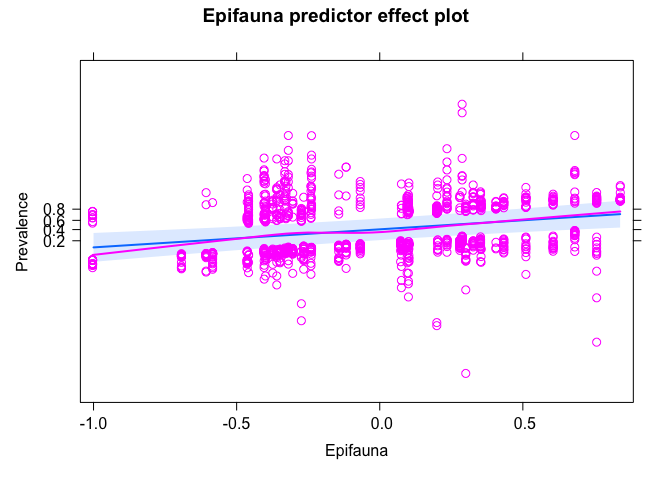
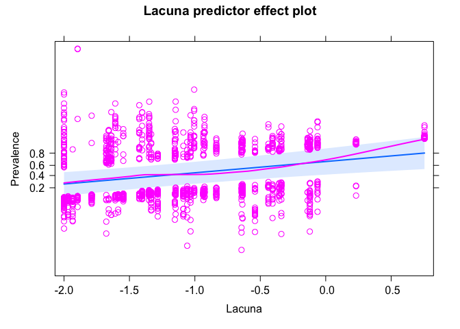
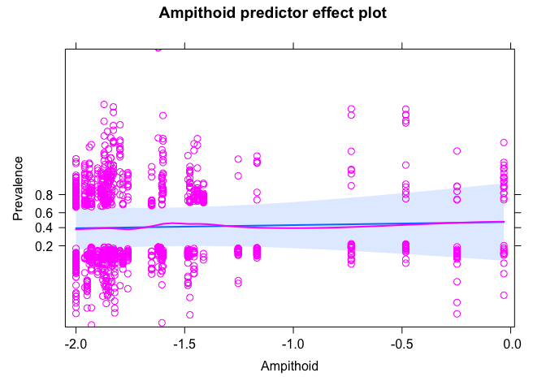
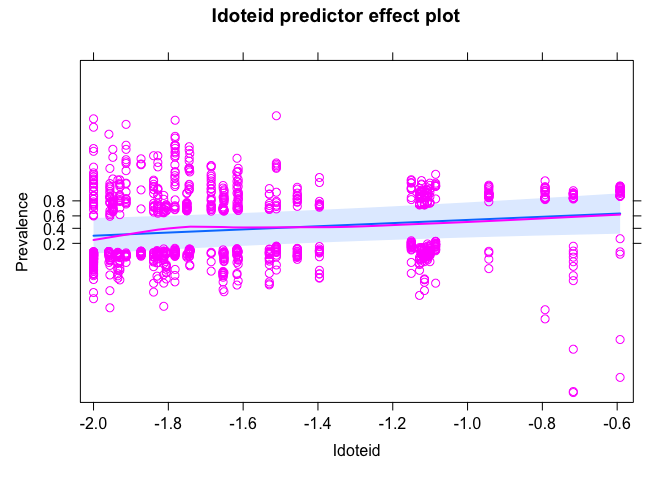
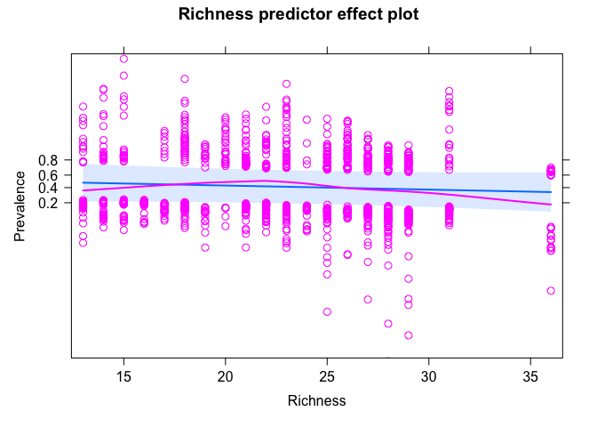
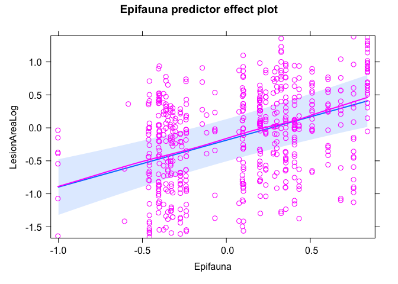
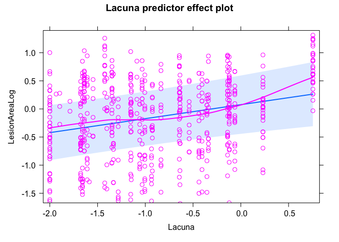
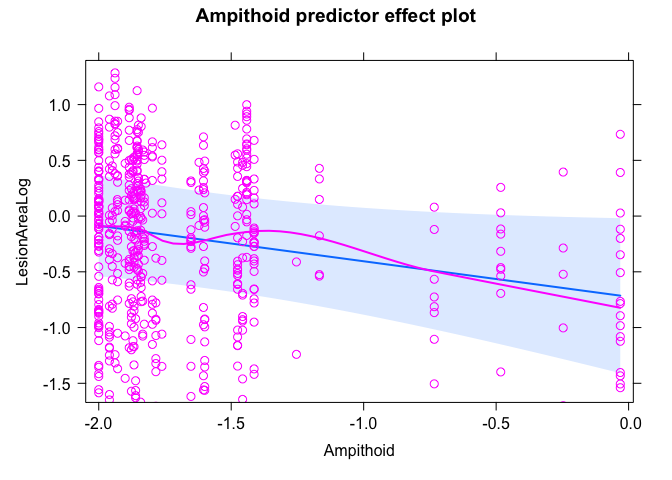
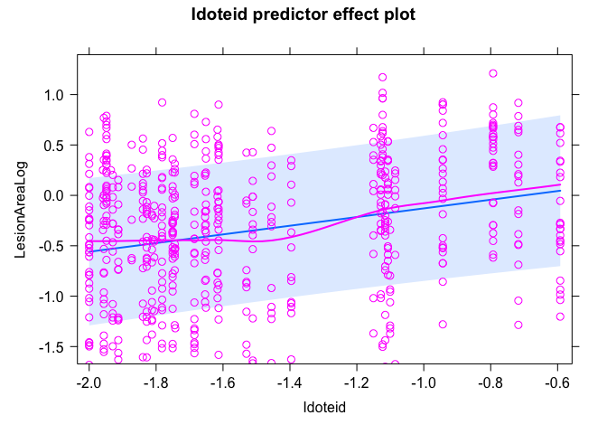
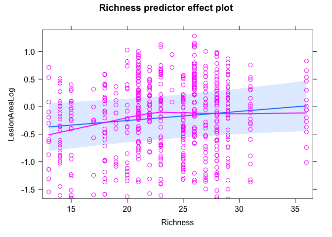

Community Interaction SEM results
================

# SEMs comparing epifauna vs lacuna vs ampithoid vs iodteid vs richness

Taking the SEM comparison with epifauna, epiphytes, and now including
leaf-level grazing scars as well. This was excluded before but the
grazing scar data were wrong! Not correctly converted to
presence/absence. Now updated.

A few notes:  
- Large epifauna only (except at BB).  
- Epiphyte blades only. A handful are missing due to no epiphytes (wrong
leaf etc)  
- Zeros are included (not NAs), all sites for all models.  
- Taxa abundances are log-transformed.

``` r
# data ###
dis <- read_csv("data/epiphyte_SEM_data_all_large.csv")
```

    ## Rows: 1350 Columns: 49
    ## ── Column specification ────────────────────────────────────────────────────────
    ## Delimiter: ","
    ## chr   (8): Meter, SampleId, Region, SiteCode, TidalHeight, BrokenTip, Notes,...
    ## dbl  (40): Transect, Blade, LongestBladeLength, LongestBladeWidth, SheathLen...
    ## date  (1): SampleDate
    ## 
    ## ℹ Use `spec()` to retrieve the full column specification for this data.
    ## ℹ Specify the column types or set `show_col_types = FALSE` to quiet this message.

``` r
# updating the SEM to compare the effects of using large vs all animals
dis$BladeAreaLog <- log10(dis$BladeArea)
dis$EpiphyteLog <- log10(dis$EpiphytePerAreamgcm2+0.01)
# use the full data set without subsetting because the SEM no longer includes epiphytes or grazing
# dis1 <- select(dis, c(Epifauna = Epifauna_all, TempAnomWarm_June, MonthlyMeanTemp_June, CanopyHeight, 
#                       DensityLog, YearBinary, Year, Meadow, Region,BladeAreaLog, TidalHeightBinary, 
#                       Prevalence, LesionArea, EpiphytePerAreamgcm2, EpiphyteLog, GrazingScars,
#                       Lacuna = Lacuna_all, 
#                       Ampithoid = Ampithoid_all, Idoteid = Idoteid_all, Richness = Richness_all))

dis1_large <- select(dis, c(Epifauna = Epifauna_large, TempAnomWarm_June, MonthlyMeanTemp_June, CanopyHeight, 
                      DensityLog, YearBinary, Year, Meadow, Region, Transect, Blade, BladeAreaLog, TidalHeightBinary, GrazingScars,
                      Prevalence, LesionArea, EpiphyteLog, Lacuna = Lacuna_large, 
                      Ampithoid = Ampithoid_large, Idoteid = Idoteid_large, Richness = Richness_large))
dis_large <- na.omit(dis1_large)
dis_large$Meadow_Year <- paste(dis_large$Meadow, dis_large$Year, sep = "_")
site_large <- distinct(dis_large, Meadow_Year, .keep_all = T)
site_large <- select(site_large, -c(Prevalence, LesionArea, EpiphyteLog, TidalHeightBinary, BladeAreaLog))
# site <- read_csv("data/epifauna_site_for_plotting.csv")
# site <- select(site, c())
```

## Prevalence + Epifauna

``` r
sem_prev_epi <- psem(
  lmer(Epifauna ~ TempAnomWarm_June + MonthlyMeanTemp_June + 
         CanopyHeight + DensityLog +
         YearBinary +
         (1|Meadow) + (1|Region),
       data=site_large),
  lmer(CanopyHeight ~ TempAnomWarm_June + MonthlyMeanTemp_June + 
         YearBinary + 
         (1|Meadow) + (1|Region),
       data=site_large),
  lmer(DensityLog ~ TempAnomWarm_June + MonthlyMeanTemp_June +
         YearBinary + 
         (1|Meadow) + (1|Region),
       data=site_large),
    lmer(BladeAreaLog ~ Epifauna + CanopyHeight + DensityLog + 
         TempAnomWarm_June + MonthlyMeanTemp_June +
         TidalHeightBinary + YearBinary +
         (1|Region) + (1|Meadow),
       data=dis_large),
  lmer(EpiphyteLog ~ BladeAreaLog + Epifauna + CanopyHeight + DensityLog + 
         TempAnomWarm_June + MonthlyMeanTemp_June +
         TidalHeightBinary + YearBinary +
         (1|Region) + (1|Meadow),
       data=dis_large),
  glmer(GrazingScars ~ BladeAreaLog + Epifauna + CanopyHeight + DensityLog + 
          TempAnomWarm_June + MonthlyMeanTemp_June + 
          TidalHeightBinary + YearBinary + 
          (1|Region) + (1|Meadow),
        data=dis_large,
        family = "binomial"),
  glmer(Prevalence ~ BladeAreaLog + EpiphyteLog + GrazingScars +
          Epifauna + CanopyHeight + DensityLog + 
          TempAnomWarm_June + MonthlyMeanTemp_June + 
          TidalHeightBinary + YearBinary + 
          (1|Region) + (1|Meadow),
        data=dis_large,
        family = "binomial"),
  DensityLog%~~%CanopyHeight
)
```

    ## Warning in checkConv(attr(opt, "derivs"), opt$par, ctrl = control$checkConv, :
    ## Model failed to converge with max|grad| = 0.00844301 (tol = 0.002, component 1)

    ## Warning in checkConv(attr(opt, "derivs"), opt$par, ctrl = control$checkConv, :
    ## Model failed to converge with max|grad| = 0.0648329 (tol = 0.002, component 1)

``` r
summary(sem_prev_epi)
```

    ##   |                                                                              |                                                                      |   0%  |                                                                              |==================                                                    |  25%  |                                                                              |===================================                                   |  50%  |                                                                              |====================================================                  |  75%  |                                                                              |======================================================================| 100%

    ## 
    ## Structural Equation Model of sem_prev_epi 
    ## 
    ## Call:
    ##   Epifauna ~ TempAnomWarm_June + MonthlyMeanTemp_June + CanopyHeight + DensityLog + YearBinary
    ##   CanopyHeight ~ TempAnomWarm_June + MonthlyMeanTemp_June + YearBinary
    ##   DensityLog ~ TempAnomWarm_June + MonthlyMeanTemp_June + YearBinary
    ##   BladeAreaLog ~ Epifauna + CanopyHeight + DensityLog + TempAnomWarm_June + MonthlyMeanTemp_June + TidalHeightBinary + YearBinary
    ##   EpiphyteLog ~ BladeAreaLog + Epifauna + CanopyHeight + DensityLog + TempAnomWarm_June + MonthlyMeanTemp_June + TidalHeightBinary + YearBinary
    ##   GrazingScars ~ BladeAreaLog + Epifauna + CanopyHeight + DensityLog + TempAnomWarm_June + MonthlyMeanTemp_June + TidalHeightBinary + YearBinary
    ##   Prevalence ~ BladeAreaLog + EpiphyteLog + GrazingScars + Epifauna + CanopyHeight + DensityLog + TempAnomWarm_June + MonthlyMeanTemp_June + TidalHeightBinary + YearBinary
    ##   DensityLog ~~ CanopyHeight
    ## 
    ##     AIC      BIC
    ##  142.393   267.286
    ## 
    ## ---
    ## Tests of directed separation:
    ## 
    ##                           Independ.Claim Test.Type       DF Crit.Value P.Value 
    ##   CanopyHeight ~ TidalHeightBinary + ...      coef 1277.005     0.0028  0.9581 
    ##     DensityLog ~ TidalHeightBinary + ...      coef 1277.001     0.0194  0.8893 
    ##       Epifauna ~ TidalHeightBinary + ...      coef 1275.003     0.0000  0.9946 
    ##         GrazingScars ~ EpiphyteLog + ...      coef 1307.000     0.9217  0.3567 
    ## 
    ## Global goodness-of-fit:
    ## 
    ##   Fisher's C = 2.393 with P-value = 0.967 and on 8 degrees of freedom
    ## 
    ## ---
    ## Coefficients:
    ## 
    ##       Response            Predictor Estimate Std.Error        DF Crit.Value
    ##       Epifauna    TempAnomWarm_June  -0.0170    0.0057   23.4705     8.1273
    ##       Epifauna MonthlyMeanTemp_June   0.0159    0.0455    9.1995     0.1055
    ##       Epifauna         CanopyHeight  -0.7139    0.2201   37.9728     8.6406
    ##       Epifauna           DensityLog  -0.4648    0.1844   30.0323     4.7818
    ##       Epifauna           YearBinary  -0.0819    0.0752   19.2015     1.1255
    ##   CanopyHeight    TempAnomWarm_June  -0.0054    0.0035   21.9646     2.1781
    ##   CanopyHeight MonthlyMeanTemp_June  -0.0713    0.0354   10.5811     3.5120
    ##   CanopyHeight           YearBinary  -0.1095    0.0453   16.8072     5.7362
    ##     DensityLog    TempAnomWarm_June  -0.0121    0.0045   20.7383     6.4907
    ##     DensityLog MonthlyMeanTemp_June   0.0752    0.0513   12.7863     1.7024
    ##     DensityLog           YearBinary  -0.0611    0.0512   16.5755     1.3996
    ##   BladeAreaLog             Epifauna  -0.0631    0.0433   87.7090     1.9698
    ##   BladeAreaLog         CanopyHeight   0.6850    0.0654   86.5513   102.8167
    ##   BladeAreaLog           DensityLog  -0.1433    0.0567  101.0728     5.6977
    ##   BladeAreaLog    TempAnomWarm_June  -0.0029    0.0018   67.5756     2.1719
    ##   BladeAreaLog MonthlyMeanTemp_June  -0.0068     0.018   16.0465     0.1150
    ##   BladeAreaLog    TidalHeightBinary  -0.2434    0.0135 1275.5025   326.3306
    ##   BladeAreaLog           YearBinary   0.0551    0.0181  937.9127     9.1382
    ##    EpiphyteLog         BladeAreaLog  -0.1555    0.0439 1286.8384    12.4989
    ##    EpiphyteLog             Epifauna   0.1324     0.084  234.6021     2.3786
    ##    EpiphyteLog         CanopyHeight  -0.4212    0.1296  266.0734    10.1758
    ##    EpiphyteLog           DensityLog  -0.2155    0.1115  302.5054     3.5557
    ##    EpiphyteLog    TempAnomWarm_June   0.0087    0.0037  490.7070     5.2084
    ##    EpiphyteLog MonthlyMeanTemp_June  -0.2234    0.0449  183.6358    22.2459
    ##    EpiphyteLog    TidalHeightBinary  -0.0533    0.0237 1276.8125     5.0428
    ##    EpiphyteLog           YearBinary  -0.0350    0.0298 1187.7365     1.3625
    ##   GrazingScars         BladeAreaLog   1.7280    0.3135 1307.0000     5.5120
    ##   GrazingScars             Epifauna  -0.6562    0.4419 1307.0000    -1.4849
    ##   GrazingScars         CanopyHeight   0.7791     0.738 1307.0000     1.0557
    ##   GrazingScars           DensityLog   0.6564    0.6498 1307.0000     1.0102
    ##   GrazingScars    TempAnomWarm_June   0.0086    0.0281 1307.0000     0.3073
    ##   GrazingScars MonthlyMeanTemp_June   1.7074    0.3417 1307.0000     4.9972
    ##   GrazingScars    TidalHeightBinary   0.0761    0.1542 1307.0000     0.4932
    ##   GrazingScars           YearBinary  -0.7643    0.1948 1307.0000    -3.9238
    ##     Prevalence         BladeAreaLog   1.5020    0.3029 1307.0000     4.9593
    ##     Prevalence          EpiphyteLog  -0.0402    0.1689 1307.0000    -0.2381
    ##     Prevalence         GrazingScars   1.1905    0.1631 1307.0000     7.2999
    ##     Prevalence             Epifauna   1.5860    0.4282 1307.0000     3.7038
    ##     Prevalence         CanopyHeight   1.7507    0.6858 1307.0000     2.5526
    ##     Prevalence           DensityLog   2.4944    0.5708 1307.0000     4.3697
    ##     Prevalence    TempAnomWarm_June   0.0242    0.0164 1307.0000     1.4712
    ##     Prevalence MonthlyMeanTemp_June   0.0911    0.1623 1307.0000     0.5613
    ##     Prevalence    TidalHeightBinary   0.6610    0.1481 1307.0000     4.4646
    ##     Prevalence           YearBinary   0.5324    0.1777 1307.0000     2.9966
    ##   ~~DensityLog       ~~CanopyHeight  -0.0973         -   44.0000    -0.6262
    ##   P.Value Std.Estimate    
    ##    0.0089      -0.3636  **
    ##    0.7525       0.0641    
    ##    0.0056      -0.5863  **
    ##    0.0367      -0.5477   *
    ##    0.3019      -0.0976    
    ##    0.1542      -0.1409    
    ##    0.0888      -0.3508    
    ##    0.0286       -0.159   *
    ##    0.0188      -0.2195   *
    ##    0.2150       0.2577    
    ##    0.2535      -0.0618    
    ##    0.1640      -0.0623    
    ##    0.0000       0.5552 ***
    ##    0.0188      -0.1667   *
    ##    0.1452      -0.0604    
    ##    0.7389       -0.027    
    ##    0.0000      -0.2874 ***
    ##    0.0026       0.0648  **
    ##    0.0004      -0.0645 ***
    ##    0.1244       0.0542    
    ##    0.0016      -0.1417  **
    ##    0.0603       -0.104    
    ##    0.0229       0.0759   *
    ##    0.0000      -0.3697 ***
    ##    0.0249      -0.0261   *
    ##    0.2433      -0.0171    
    ##    0.0000            - ***
    ##    0.1376            -    
    ##    0.2911            -    
    ##    0.3124            -    
    ##    0.7586            -    
    ##    0.0000            - ***
    ##    0.6219            -    
    ##    0.0001            - ***
    ##    0.0000            - ***
    ##    0.8118            -    
    ##    0.0000            - ***
    ##    0.0002            - ***
    ##    0.0107            -   *
    ##    0.0000            - ***
    ##    0.1412            -    
    ##    0.5746            -    
    ##    0.0000            - ***
    ##    0.0027            -  **
    ##    0.2673      -0.0973    
    ## 
    ##   Signif. codes:  0 '***' 0.001 '**' 0.01 '*' 0.05
    ## 
    ## ---
    ## Individual R-squared:
    ## 
    ##       Response method Marginal Conditional
    ##       Epifauna   none     0.24        0.83
    ##   CanopyHeight   none     0.17        0.89
    ##     DensityLog   none     0.09        0.93
    ##   BladeAreaLog   none     0.51        0.68
    ##    EpiphyteLog   none     0.14        0.87
    ##   GrazingScars  delta     0.29        0.81
    ##     Prevalence  delta     0.17        0.42

Passes global fit.

Epifauna abundance is significant and positive predictor of prevalence.

Coefficient table:

``` r
a <- coefs(sem_prev_epi)
kable(a, digits = 4, caption = "Coefficients from Total Epifauna-Prevalence SEM") 
```

<table>
<caption>
Coefficients from Total Epifauna-Prevalence SEM
</caption>
<thead>
<tr>
<th style="text-align:left;">
Response
</th>
<th style="text-align:left;">
Predictor
</th>
<th style="text-align:right;">
Estimate
</th>
<th style="text-align:left;">
Std.Error
</th>
<th style="text-align:right;">
DF
</th>
<th style="text-align:right;">
Crit.Value
</th>
<th style="text-align:right;">
P.Value
</th>
<th style="text-align:right;">
Std.Estimate
</th>
<th style="text-align:left;">
</th>
</tr>
</thead>
<tbody>
<tr>
<td style="text-align:left;">
Epifauna
</td>
<td style="text-align:left;">
TempAnomWarm_June
</td>
<td style="text-align:right;">
-0.0170
</td>
<td style="text-align:left;">
0.0057
</td>
<td style="text-align:right;">
23.4705
</td>
<td style="text-align:right;">
8.1273
</td>
<td style="text-align:right;">
0.0089
</td>
<td style="text-align:right;">
-0.3636
</td>
<td style="text-align:left;">
\*\*
</td>
</tr>
<tr>
<td style="text-align:left;">
Epifauna
</td>
<td style="text-align:left;">
MonthlyMeanTemp_June
</td>
<td style="text-align:right;">
0.0159
</td>
<td style="text-align:left;">
0.0455
</td>
<td style="text-align:right;">
9.1995
</td>
<td style="text-align:right;">
0.1055
</td>
<td style="text-align:right;">
0.7525
</td>
<td style="text-align:right;">
0.0641
</td>
<td style="text-align:left;">
</td>
</tr>
<tr>
<td style="text-align:left;">
Epifauna
</td>
<td style="text-align:left;">
CanopyHeight
</td>
<td style="text-align:right;">
-0.7139
</td>
<td style="text-align:left;">
0.2201
</td>
<td style="text-align:right;">
37.9728
</td>
<td style="text-align:right;">
8.6406
</td>
<td style="text-align:right;">
0.0056
</td>
<td style="text-align:right;">
-0.5863
</td>
<td style="text-align:left;">
\*\*
</td>
</tr>
<tr>
<td style="text-align:left;">
Epifauna
</td>
<td style="text-align:left;">
DensityLog
</td>
<td style="text-align:right;">
-0.4648
</td>
<td style="text-align:left;">
0.1844
</td>
<td style="text-align:right;">
30.0323
</td>
<td style="text-align:right;">
4.7818
</td>
<td style="text-align:right;">
0.0367
</td>
<td style="text-align:right;">
-0.5477
</td>
<td style="text-align:left;">

- </td>
  </tr>
  <tr>
  <td style="text-align:left;">
  Epifauna
  </td>
  <td style="text-align:left;">
  YearBinary
  </td>
  <td style="text-align:right;">
  -0.0819
  </td>
  <td style="text-align:left;">
  0.0752
  </td>
  <td style="text-align:right;">
  19.2015
  </td>
  <td style="text-align:right;">
  1.1255
  </td>
  <td style="text-align:right;">
  0.3019
  </td>
  <td style="text-align:right;">
  -0.0976
  </td>
  <td style="text-align:left;">
  </td>
  </tr>
  <tr>
  <td style="text-align:left;">
  CanopyHeight
  </td>
  <td style="text-align:left;">
  TempAnomWarm_June
  </td>
  <td style="text-align:right;">
  -0.0054
  </td>
  <td style="text-align:left;">
  0.0035
  </td>
  <td style="text-align:right;">
  21.9646
  </td>
  <td style="text-align:right;">
  2.1781
  </td>
  <td style="text-align:right;">
  0.1542
  </td>
  <td style="text-align:right;">
  -0.1409
  </td>
  <td style="text-align:left;">
  </td>
  </tr>
  <tr>
  <td style="text-align:left;">
  CanopyHeight
  </td>
  <td style="text-align:left;">
  MonthlyMeanTemp_June
  </td>
  <td style="text-align:right;">
  -0.0713
  </td>
  <td style="text-align:left;">
  0.0354
  </td>
  <td style="text-align:right;">
  10.5811
  </td>
  <td style="text-align:right;">
  3.5120
  </td>
  <td style="text-align:right;">
  0.0888
  </td>
  <td style="text-align:right;">
  -0.3508
  </td>
  <td style="text-align:left;">
  </td>
  </tr>
  <tr>
  <td style="text-align:left;">
  CanopyHeight
  </td>
  <td style="text-align:left;">
  YearBinary
  </td>
  <td style="text-align:right;">
  -0.1095
  </td>
  <td style="text-align:left;">
  0.0453
  </td>
  <td style="text-align:right;">
  16.8072
  </td>
  <td style="text-align:right;">
  5.7362
  </td>
  <td style="text-align:right;">
  0.0286
  </td>
  <td style="text-align:right;">
  -0.1590
  </td>
  <td style="text-align:left;">

  - </td>
    </tr>
    <tr>
    <td style="text-align:left;">
    DensityLog
    </td>
    <td style="text-align:left;">
    TempAnomWarm_June
    </td>
    <td style="text-align:right;">
    -0.0121
    </td>
    <td style="text-align:left;">
    0.0045
    </td>
    <td style="text-align:right;">
    20.7383
    </td>
    <td style="text-align:right;">
    6.4907
    </td>
    <td style="text-align:right;">
    0.0188
    </td>
    <td style="text-align:right;">
    -0.2195
    </td>
    <td style="text-align:left;">

    - </td>
      </tr>
      <tr>
      <td style="text-align:left;">
      DensityLog
      </td>
      <td style="text-align:left;">
      MonthlyMeanTemp_June
      </td>
      <td style="text-align:right;">
      0.0752
      </td>
      <td style="text-align:left;">
      0.0513
      </td>
      <td style="text-align:right;">
      12.7863
      </td>
      <td style="text-align:right;">
      1.7024
      </td>
      <td style="text-align:right;">
      0.2150
      </td>
      <td style="text-align:right;">
      0.2577
      </td>
      <td style="text-align:left;">
      </td>
      </tr>
      <tr>
      <td style="text-align:left;">
      DensityLog
      </td>
      <td style="text-align:left;">
      YearBinary
      </td>
      <td style="text-align:right;">
      -0.0611
      </td>
      <td style="text-align:left;">
      0.0512
      </td>
      <td style="text-align:right;">
      16.5755
      </td>
      <td style="text-align:right;">
      1.3996
      </td>
      <td style="text-align:right;">
      0.2535
      </td>
      <td style="text-align:right;">
      -0.0618
      </td>
      <td style="text-align:left;">
      </td>
      </tr>
      <tr>
      <td style="text-align:left;">
      BladeAreaLog
      </td>
      <td style="text-align:left;">
      Epifauna
      </td>
      <td style="text-align:right;">
      -0.0631
      </td>
      <td style="text-align:left;">
      0.0433
      </td>
      <td style="text-align:right;">
      87.7090
      </td>
      <td style="text-align:right;">
      1.9698
      </td>
      <td style="text-align:right;">
      0.1640
      </td>
      <td style="text-align:right;">
      -0.0623
      </td>
      <td style="text-align:left;">
      </td>
      </tr>
      <tr>
      <td style="text-align:left;">
      BladeAreaLog
      </td>
      <td style="text-align:left;">
      CanopyHeight
      </td>
      <td style="text-align:right;">
      0.6850
      </td>
      <td style="text-align:left;">
      0.0654
      </td>
      <td style="text-align:right;">
      86.5513
      </td>
      <td style="text-align:right;">
      102.8167
      </td>
      <td style="text-align:right;">
      0.0000
      </td>
      <td style="text-align:right;">
      0.5552
      </td>
      <td style="text-align:left;">
      \*\*\*
      </td>
      </tr>
      <tr>
      <td style="text-align:left;">
      BladeAreaLog
      </td>
      <td style="text-align:left;">
      DensityLog
      </td>
      <td style="text-align:right;">
      -0.1433
      </td>
      <td style="text-align:left;">
      0.0567
      </td>
      <td style="text-align:right;">
      101.0728
      </td>
      <td style="text-align:right;">
      5.6977
      </td>
      <td style="text-align:right;">
      0.0188
      </td>
      <td style="text-align:right;">
      -0.1667
      </td>
      <td style="text-align:left;">

      - </td>
        </tr>
        <tr>
        <td style="text-align:left;">
        BladeAreaLog
        </td>
        <td style="text-align:left;">
        TempAnomWarm_June
        </td>
        <td style="text-align:right;">
        -0.0029
        </td>
        <td style="text-align:left;">
        0.0018
        </td>
        <td style="text-align:right;">
        67.5756
        </td>
        <td style="text-align:right;">
        2.1719
        </td>
        <td style="text-align:right;">
        0.1452
        </td>
        <td style="text-align:right;">
        -0.0604
        </td>
        <td style="text-align:left;">
        </td>
        </tr>
        <tr>
        <td style="text-align:left;">
        BladeAreaLog
        </td>
        <td style="text-align:left;">
        MonthlyMeanTemp_June
        </td>
        <td style="text-align:right;">
        -0.0068
        </td>
        <td style="text-align:left;">
        0.018
        </td>
        <td style="text-align:right;">
        16.0465
        </td>
        <td style="text-align:right;">
        0.1150
        </td>
        <td style="text-align:right;">
        0.7389
        </td>
        <td style="text-align:right;">
        -0.0270
        </td>
        <td style="text-align:left;">
        </td>
        </tr>
        <tr>
        <td style="text-align:left;">
        BladeAreaLog
        </td>
        <td style="text-align:left;">
        TidalHeightBinary
        </td>
        <td style="text-align:right;">
        -0.2434
        </td>
        <td style="text-align:left;">
        0.0135
        </td>
        <td style="text-align:right;">
        1275.5025
        </td>
        <td style="text-align:right;">
        326.3306
        </td>
        <td style="text-align:right;">
        0.0000
        </td>
        <td style="text-align:right;">
        -0.2874
        </td>
        <td style="text-align:left;">
        \*\*\*
        </td>
        </tr>
        <tr>
        <td style="text-align:left;">
        BladeAreaLog
        </td>
        <td style="text-align:left;">
        YearBinary
        </td>
        <td style="text-align:right;">
        0.0551
        </td>
        <td style="text-align:left;">
        0.0181
        </td>
        <td style="text-align:right;">
        937.9127
        </td>
        <td style="text-align:right;">
        9.1382
        </td>
        <td style="text-align:right;">
        0.0026
        </td>
        <td style="text-align:right;">
        0.0648
        </td>
        <td style="text-align:left;">
        \*\*
        </td>
        </tr>
        <tr>
        <td style="text-align:left;">
        EpiphyteLog
        </td>
        <td style="text-align:left;">
        BladeAreaLog
        </td>
        <td style="text-align:right;">
        -0.1555
        </td>
        <td style="text-align:left;">
        0.0439
        </td>
        <td style="text-align:right;">
        1286.8384
        </td>
        <td style="text-align:right;">
        12.4989
        </td>
        <td style="text-align:right;">
        0.0004
        </td>
        <td style="text-align:right;">
        -0.0645
        </td>
        <td style="text-align:left;">
        \*\*\*
        </td>
        </tr>
        <tr>
        <td style="text-align:left;">
        EpiphyteLog
        </td>
        <td style="text-align:left;">
        Epifauna
        </td>
        <td style="text-align:right;">
        0.1324
        </td>
        <td style="text-align:left;">
        0.084
        </td>
        <td style="text-align:right;">
        234.6021
        </td>
        <td style="text-align:right;">
        2.3786
        </td>
        <td style="text-align:right;">
        0.1244
        </td>
        <td style="text-align:right;">
        0.0542
        </td>
        <td style="text-align:left;">
        </td>
        </tr>
        <tr>
        <td style="text-align:left;">
        EpiphyteLog
        </td>
        <td style="text-align:left;">
        CanopyHeight
        </td>
        <td style="text-align:right;">
        -0.4212
        </td>
        <td style="text-align:left;">
        0.1296
        </td>
        <td style="text-align:right;">
        266.0734
        </td>
        <td style="text-align:right;">
        10.1758
        </td>
        <td style="text-align:right;">
        0.0016
        </td>
        <td style="text-align:right;">
        -0.1417
        </td>
        <td style="text-align:left;">
        \*\*
        </td>
        </tr>
        <tr>
        <td style="text-align:left;">
        EpiphyteLog
        </td>
        <td style="text-align:left;">
        DensityLog
        </td>
        <td style="text-align:right;">
        -0.2155
        </td>
        <td style="text-align:left;">
        0.1115
        </td>
        <td style="text-align:right;">
        302.5054
        </td>
        <td style="text-align:right;">
        3.5557
        </td>
        <td style="text-align:right;">
        0.0603
        </td>
        <td style="text-align:right;">
        -0.1040
        </td>
        <td style="text-align:left;">
        </td>
        </tr>
        <tr>
        <td style="text-align:left;">
        EpiphyteLog
        </td>
        <td style="text-align:left;">
        TempAnomWarm_June
        </td>
        <td style="text-align:right;">
        0.0087
        </td>
        <td style="text-align:left;">
        0.0037
        </td>
        <td style="text-align:right;">
        490.7070
        </td>
        <td style="text-align:right;">
        5.2084
        </td>
        <td style="text-align:right;">
        0.0229
        </td>
        <td style="text-align:right;">
        0.0759
        </td>
        <td style="text-align:left;">

        - </td>
          </tr>
          <tr>
          <td style="text-align:left;">
          EpiphyteLog
          </td>
          <td style="text-align:left;">
          MonthlyMeanTemp_June
          </td>
          <td style="text-align:right;">
          -0.2234
          </td>
          <td style="text-align:left;">
          0.0449
          </td>
          <td style="text-align:right;">
          183.6358
          </td>
          <td style="text-align:right;">
          22.2459
          </td>
          <td style="text-align:right;">
          0.0000
          </td>
          <td style="text-align:right;">
          -0.3697
          </td>
          <td style="text-align:left;">
          \*\*\*
          </td>
          </tr>
          <tr>
          <td style="text-align:left;">
          EpiphyteLog
          </td>
          <td style="text-align:left;">
          TidalHeightBinary
          </td>
          <td style="text-align:right;">
          -0.0533
          </td>
          <td style="text-align:left;">
          0.0237
          </td>
          <td style="text-align:right;">
          1276.8125
          </td>
          <td style="text-align:right;">
          5.0428
          </td>
          <td style="text-align:right;">
          0.0249
          </td>
          <td style="text-align:right;">
          -0.0261
          </td>
          <td style="text-align:left;">

          - </td>
            </tr>
            <tr>
            <td style="text-align:left;">
            EpiphyteLog
            </td>
            <td style="text-align:left;">
            YearBinary
            </td>
            <td style="text-align:right;">
            -0.0350
            </td>
            <td style="text-align:left;">
            0.0298
            </td>
            <td style="text-align:right;">
            1187.7365
            </td>
            <td style="text-align:right;">
            1.3625
            </td>
            <td style="text-align:right;">
            0.2433
            </td>
            <td style="text-align:right;">
            -0.0171
            </td>
            <td style="text-align:left;">
            </td>
            </tr>
            <tr>
            <td style="text-align:left;">
            GrazingScars
            </td>
            <td style="text-align:left;">
            BladeAreaLog
            </td>
            <td style="text-align:right;">
            1.7280
            </td>
            <td style="text-align:left;">
            0.3135
            </td>
            <td style="text-align:right;">
            1307.0000
            </td>
            <td style="text-align:right;">
            5.5120
            </td>
            <td style="text-align:right;">
            0.0000
            </td>
            <td style="text-align:right;">
            0.3319
            </td>
            <td style="text-align:left;">
            \*\*\*
            </td>
            </tr>
            <tr>
            <td style="text-align:left;">
            GrazingScars
            </td>
            <td style="text-align:left;">
            Epifauna
            </td>
            <td style="text-align:right;">
            -0.6562
            </td>
            <td style="text-align:left;">
            0.4419
            </td>
            <td style="text-align:right;">
            1307.0000
            </td>
            <td style="text-align:right;">
            -1.4849
            </td>
            <td style="text-align:right;">
            0.1376
            </td>
            <td style="text-align:right;">
            -0.1244
            </td>
            <td style="text-align:left;">
            </td>
            </tr>
            <tr>
            <td style="text-align:left;">
            GrazingScars
            </td>
            <td style="text-align:left;">
            CanopyHeight
            </td>
            <td style="text-align:right;">
            0.7791
            </td>
            <td style="text-align:left;">
            0.738
            </td>
            <td style="text-align:right;">
            1307.0000
            </td>
            <td style="text-align:right;">
            1.0557
            </td>
            <td style="text-align:right;">
            0.2911
            </td>
            <td style="text-align:right;">
            0.1213
            </td>
            <td style="text-align:left;">
            </td>
            </tr>
            <tr>
            <td style="text-align:left;">
            GrazingScars
            </td>
            <td style="text-align:left;">
            DensityLog
            </td>
            <td style="text-align:right;">
            0.6564
            </td>
            <td style="text-align:left;">
            0.6498
            </td>
            <td style="text-align:right;">
            1307.0000
            </td>
            <td style="text-align:right;">
            1.0102
            </td>
            <td style="text-align:right;">
            0.3124
            </td>
            <td style="text-align:right;">
            0.1466
            </td>
            <td style="text-align:left;">
            </td>
            </tr>
            <tr>
            <td style="text-align:left;">
            GrazingScars
            </td>
            <td style="text-align:left;">
            TempAnomWarm_June
            </td>
            <td style="text-align:right;">
            0.0086
            </td>
            <td style="text-align:left;">
            0.0281
            </td>
            <td style="text-align:right;">
            1307.0000
            </td>
            <td style="text-align:right;">
            0.3073
            </td>
            <td style="text-align:right;">
            0.7586
            </td>
            <td style="text-align:right;">
            0.0349
            </td>
            <td style="text-align:left;">
            </td>
            </tr>
            <tr>
            <td style="text-align:left;">
            GrazingScars
            </td>
            <td style="text-align:left;">
            MonthlyMeanTemp_June
            </td>
            <td style="text-align:right;">
            1.7074
            </td>
            <td style="text-align:left;">
            0.3417
            </td>
            <td style="text-align:right;">
            1307.0000
            </td>
            <td style="text-align:right;">
            4.9972
            </td>
            <td style="text-align:right;">
            0.0000
            </td>
            <td style="text-align:right;">
            1.3078
            </td>
            <td style="text-align:left;">
            \*\*\*
            </td>
            </tr>
            <tr>
            <td style="text-align:left;">
            GrazingScars
            </td>
            <td style="text-align:left;">
            TidalHeightBinary
            </td>
            <td style="text-align:right;">
            0.0761
            </td>
            <td style="text-align:left;">
            0.1542
            </td>
            <td style="text-align:right;">
            1307.0000
            </td>
            <td style="text-align:right;">
            0.4932
            </td>
            <td style="text-align:right;">
            0.6219
            </td>
            <td style="text-align:right;">
            0.0173
            </td>
            <td style="text-align:left;">
            </td>
            </tr>
            <tr>
            <td style="text-align:left;">
            GrazingScars
            </td>
            <td style="text-align:left;">
            YearBinary
            </td>
            <td style="text-align:right;">
            -0.7643
            </td>
            <td style="text-align:left;">
            0.1948
            </td>
            <td style="text-align:right;">
            1307.0000
            </td>
            <td style="text-align:right;">
            -3.9238
            </td>
            <td style="text-align:right;">
            0.0001
            </td>
            <td style="text-align:right;">
            -0.1727
            </td>
            <td style="text-align:left;">
            \*\*\*
            </td>
            </tr>
            <tr>
            <td style="text-align:left;">
            Prevalence
            </td>
            <td style="text-align:left;">
            BladeAreaLog
            </td>
            <td style="text-align:right;">
            1.5020
            </td>
            <td style="text-align:left;">
            0.3029
            </td>
            <td style="text-align:right;">
            1307.0000
            </td>
            <td style="text-align:right;">
            4.9593
            </td>
            <td style="text-align:right;">
            0.0000
            </td>
            <td style="text-align:right;">
            0.2731
            </td>
            <td style="text-align:left;">
            \*\*\*
            </td>
            </tr>
            <tr>
            <td style="text-align:left;">
            Prevalence
            </td>
            <td style="text-align:left;">
            EpiphyteLog
            </td>
            <td style="text-align:right;">
            -0.0402
            </td>
            <td style="text-align:left;">
            0.1689
            </td>
            <td style="text-align:right;">
            1307.0000
            </td>
            <td style="text-align:right;">
            -0.2381
            </td>
            <td style="text-align:right;">
            0.8118
            </td>
            <td style="text-align:right;">
            -0.0176
            </td>
            <td style="text-align:left;">
            </td>
            </tr>
            <tr>
            <td style="text-align:left;">
            Prevalence
            </td>
            <td style="text-align:left;">
            GrazingScars
            </td>
            <td style="text-align:right;">
            1.1905
            </td>
            <td style="text-align:left;">
            0.1631
            </td>
            <td style="text-align:right;">
            1307.0000
            </td>
            <td style="text-align:right;">
            7.2999
            </td>
            <td style="text-align:right;">
            0.0000
            </td>
            <td style="text-align:right;">
            0.2325
            </td>
            <td style="text-align:left;">
            \*\*\*
            </td>
            </tr>
            <tr>
            <td style="text-align:left;">
            Prevalence
            </td>
            <td style="text-align:left;">
            Epifauna
            </td>
            <td style="text-align:right;">
            1.5860
            </td>
            <td style="text-align:left;">
            0.4282
            </td>
            <td style="text-align:right;">
            1307.0000
            </td>
            <td style="text-align:right;">
            3.7038
            </td>
            <td style="text-align:right;">
            0.0002
            </td>
            <td style="text-align:right;">
            0.2846
            </td>
            <td style="text-align:left;">
            \*\*\*
            </td>
            </tr>
            <tr>
            <td style="text-align:left;">
            Prevalence
            </td>
            <td style="text-align:left;">
            CanopyHeight
            </td>
            <td style="text-align:right;">
            1.7507
            </td>
            <td style="text-align:left;">
            0.6858
            </td>
            <td style="text-align:right;">
            1307.0000
            </td>
            <td style="text-align:right;">
            2.5526
            </td>
            <td style="text-align:right;">
            0.0107
            </td>
            <td style="text-align:right;">
            0.2579
            </td>
            <td style="text-align:left;">

            - </td>
              </tr>
              <tr>
              <td style="text-align:left;">
              Prevalence
              </td>
              <td style="text-align:left;">
              DensityLog
              </td>
              <td style="text-align:right;">
              2.4944
              </td>
              <td style="text-align:left;">
              0.5708
              </td>
              <td style="text-align:right;">
              1307.0000
              </td>
              <td style="text-align:right;">
              4.3697
              </td>
              <td style="text-align:right;">
              0.0000
              </td>
              <td style="text-align:right;">
              0.5274
              </td>
              <td style="text-align:left;">
              \*\*\*
              </td>
              </tr>
              <tr>
              <td style="text-align:left;">
              Prevalence
              </td>
              <td style="text-align:left;">
              TempAnomWarm_June
              </td>
              <td style="text-align:right;">
              0.0242
              </td>
              <td style="text-align:left;">
              0.0164
              </td>
              <td style="text-align:right;">
              1307.0000
              </td>
              <td style="text-align:right;">
              1.4712
              </td>
              <td style="text-align:right;">
              0.1412
              </td>
              <td style="text-align:right;">
              0.0927
              </td>
              <td style="text-align:left;">
              </td>
              </tr>
              <tr>
              <td style="text-align:left;">
              Prevalence
              </td>
              <td style="text-align:left;">
              MonthlyMeanTemp_June
              </td>
              <td style="text-align:right;">
              0.0911
              </td>
              <td style="text-align:left;">
              0.1623
              </td>
              <td style="text-align:right;">
              1307.0000
              </td>
              <td style="text-align:right;">
              0.5613
              </td>
              <td style="text-align:right;">
              0.5746
              </td>
              <td style="text-align:right;">
              0.0660
              </td>
              <td style="text-align:left;">
              </td>
              </tr>
              <tr>
              <td style="text-align:left;">
              Prevalence
              </td>
              <td style="text-align:left;">
              TidalHeightBinary
              </td>
              <td style="text-align:right;">
              0.6610
              </td>
              <td style="text-align:left;">
              0.1481
              </td>
              <td style="text-align:right;">
              1307.0000
              </td>
              <td style="text-align:right;">
              4.4646
              </td>
              <td style="text-align:right;">
              0.0000
              </td>
              <td style="text-align:right;">
              0.1419
              </td>
              <td style="text-align:left;">
              \*\*\*
              </td>
              </tr>
              <tr>
              <td style="text-align:left;">
              Prevalence
              </td>
              <td style="text-align:left;">
              YearBinary
              </td>
              <td style="text-align:right;">
              0.5324
              </td>
              <td style="text-align:left;">
              0.1777
              </td>
              <td style="text-align:right;">
              1307.0000
              </td>
              <td style="text-align:right;">
              2.9966
              </td>
              <td style="text-align:right;">
              0.0027
              </td>
              <td style="text-align:right;">
              0.1139
              </td>
              <td style="text-align:left;">
              \*\*
              </td>
              </tr>
              <tr>
              <td style="text-align:left;">
              \~\~DensityLog
              </td>
              <td style="text-align:left;">
              \~\~CanopyHeight
              </td>
              <td style="text-align:right;">
              -0.0973
              </td>
              <td style="text-align:left;">

              - </td>
                <td style="text-align:right;">
                44.0000
                </td>
                <td style="text-align:right;">
                -0.6262
                </td>
                <td style="text-align:right;">
                0.2673
                </td>
                <td style="text-align:right;">
                -0.0973
                </td>
                <td style="text-align:left;">
                </td>
                </tr>
                </tbody>
                </table>

``` r
# kable(dat4, booktabs = TRUE, caption = "Injuries before and after June 15, all sports-related, non-minor", linesep="") %>%
#   kable_styling(latex_options = c("HOLD_position"))
```

An alternative SEM - flip the prevalence to epifauna arrow? Not sure
this will work because of different scales

``` r
# sem_prev_epi2 <- psem(
#   lmer(Epifauna ~ Prevalence + TempAnomWarm_June + MonthlyMeanTemp_June + 
#          CanopyHeight + DensityLog +
#          YearBinary +
#          (1|Meadow) + (1|Region),
#        data=dis_large),
#   lmer(CanopyHeight ~ TempAnomWarm_June + MonthlyMeanTemp_June + 
#          YearBinary + 
#          (1|Meadow) + (1|Region),
#        data=site_large),
#   lmer(DensityLog ~ TempAnomWarm_June + MonthlyMeanTemp_June +
#          YearBinary + 
#          (1|Meadow) + (1|Region),
#        data=site_large),
#     lmer(BladeAreaLog ~ Epifauna + CanopyHeight + DensityLog + 
#          TempAnomWarm_June + MonthlyMeanTemp_June +
#          TidalHeightBinary + YearBinary +
#          (1|Region) + (1|Meadow),
#        data=dis_large),
#   lmer(EpiphyteLog ~ BladeAreaLog + Epifauna + CanopyHeight + DensityLog + 
#          TempAnomWarm_June + MonthlyMeanTemp_June +
#          TidalHeightBinary + YearBinary +
#          (1|Region) + (1|Meadow),
#        data=dis_large),
#   glmer(Prevalence ~ BladeAreaLog + EpiphyteLog + 
#           CanopyHeight + DensityLog + 
#           TempAnomWarm_June + MonthlyMeanTemp_June + 
#           TidalHeightBinary + YearBinary + 
#           (1|Region) + (1|Meadow),
#         data=dis_large,
#         family = "binomial"),
#   DensityLog%~~%CanopyHeight
# )
# summary(sem_prev_epi2)
```

This doesn’t really make sense - because the scale changes when the
arrow is reversed, which makes all the paths change.

## Prev + Amp

``` r
sem_prev_amp <- psem(
  lmer(Ampithoid ~ TempAnomWarm_June + MonthlyMeanTemp_June + 
         CanopyHeight + DensityLog +
         YearBinary +
         (1|Meadow) + (1|Region),
       data=site_large),
  lmer(CanopyHeight ~ TempAnomWarm_June + MonthlyMeanTemp_June + 
         YearBinary + 
         (1|Meadow) + (1|Region),
       data=site_large),
  lmer(DensityLog ~ TempAnomWarm_June + MonthlyMeanTemp_June +
         YearBinary + 
         (1|Meadow) + (1|Region),
       data=site_large),
    lmer(BladeAreaLog ~ Ampithoid + CanopyHeight + DensityLog + 
         TempAnomWarm_June + MonthlyMeanTemp_June +
         TidalHeightBinary + YearBinary +
         (1|Region) + (1|Meadow),
       data=dis_large),
  lmer(EpiphyteLog ~ BladeAreaLog + Ampithoid + CanopyHeight + DensityLog + 
         TempAnomWarm_June + MonthlyMeanTemp_June +
         TidalHeightBinary + YearBinary +
         (1|Region) + (1|Meadow),
       data=dis_large),
  glmer(GrazingScars ~ BladeAreaLog +  
          Ampithoid + CanopyHeight + DensityLog + 
          TempAnomWarm_June + MonthlyMeanTemp_June + 
          TidalHeightBinary + YearBinary + 
          (1|Region) + (1|Meadow),
        data=dis_large,
        family = "binomial"),
  glmer(Prevalence ~ BladeAreaLog + EpiphyteLog + GrazingScars + 
          Ampithoid + CanopyHeight + DensityLog + 
          TempAnomWarm_June + MonthlyMeanTemp_June + 
          TidalHeightBinary + YearBinary + 
          (1|Region) + (1|Meadow),
        data=dis_large,
        family = "binomial"),
  DensityLog%~~%CanopyHeight
)
```

    ## Warning in checkConv(attr(opt, "derivs"), opt$par, ctrl = control$checkConv, :
    ## Model failed to converge with max|grad| = 0.00375951 (tol = 0.002, component 1)

    ## Warning in checkConv(attr(opt, "derivs"), opt$par, ctrl = control$checkConv, :
    ## Model failed to converge with max|grad| = 0.00547465 (tol = 0.002, component 1)

``` r
summary(sem_prev_amp)
```

    ##   |                                                                              |                                                                      |   0%  |                                                                              |==================                                                    |  25%  |                                                                              |===================================                                   |  50%  |                                                                              |====================================================                  |  75%  |                                                                              |======================================================================| 100%

    ## 
    ## Structural Equation Model of sem_prev_amp 
    ## 
    ## Call:
    ##   Ampithoid ~ TempAnomWarm_June + MonthlyMeanTemp_June + CanopyHeight + DensityLog + YearBinary
    ##   CanopyHeight ~ TempAnomWarm_June + MonthlyMeanTemp_June + YearBinary
    ##   DensityLog ~ TempAnomWarm_June + MonthlyMeanTemp_June + YearBinary
    ##   BladeAreaLog ~ Ampithoid + CanopyHeight + DensityLog + TempAnomWarm_June + MonthlyMeanTemp_June + TidalHeightBinary + YearBinary
    ##   EpiphyteLog ~ BladeAreaLog + Ampithoid + CanopyHeight + DensityLog + TempAnomWarm_June + MonthlyMeanTemp_June + TidalHeightBinary + YearBinary
    ##   GrazingScars ~ BladeAreaLog + Ampithoid + CanopyHeight + DensityLog + TempAnomWarm_June + MonthlyMeanTemp_June + TidalHeightBinary + YearBinary
    ##   Prevalence ~ BladeAreaLog + EpiphyteLog + GrazingScars + Ampithoid + CanopyHeight + DensityLog + TempAnomWarm_June + MonthlyMeanTemp_June + TidalHeightBinary + YearBinary
    ##   DensityLog ~~ CanopyHeight
    ## 
    ##     AIC      BIC
    ##  142.773   267.666
    ## 
    ## ---
    ## Tests of directed separation:
    ## 
    ##                           Independ.Claim Test.Type       DF Crit.Value P.Value 
    ##   CanopyHeight ~ TidalHeightBinary + ...      coef 1277.005     0.0028  0.9581 
    ##     DensityLog ~ TidalHeightBinary + ...      coef 1277.001     0.0194  0.8893 
    ##      Ampithoid ~ TidalHeightBinary + ...      coef 1275.001     0.0403  0.8410 
    ##         GrazingScars ~ EpiphyteLog + ...      coef 1307.000     0.9369  0.3488 
    ## 
    ## Global goodness-of-fit:
    ## 
    ##   Fisher's C = 2.773 with P-value = 0.948 and on 8 degrees of freedom
    ## 
    ## ---
    ## Coefficients:
    ## 
    ##       Response            Predictor Estimate Std.Error        DF Crit.Value
    ##      Ampithoid    TempAnomWarm_June  -0.0122    0.0044   22.1624     6.9193
    ##      Ampithoid MonthlyMeanTemp_June   0.1372    0.0459   13.0463     7.2697
    ##      Ampithoid         CanopyHeight  -0.1613    0.1834   28.6611     0.6656
    ##      Ampithoid           DensityLog   0.0245    0.1571   28.8777     0.0198
    ##      Ampithoid           YearBinary  -0.1649    0.0485   16.2867    11.0998
    ##   CanopyHeight    TempAnomWarm_June  -0.0054    0.0035   21.9646     2.1781
    ##   CanopyHeight MonthlyMeanTemp_June  -0.0713    0.0354   10.5811     3.5120
    ##   CanopyHeight           YearBinary  -0.1095    0.0453   16.8072     5.7362
    ##     DensityLog    TempAnomWarm_June  -0.0121    0.0045   20.7383     6.4907
    ##     DensityLog MonthlyMeanTemp_June   0.0752    0.0513   12.7863     1.7024
    ##     DensityLog           YearBinary  -0.0611    0.0512   16.5755     1.3996
    ##   BladeAreaLog            Ampithoid   0.0415    0.0492   50.2390     0.6387
    ##   BladeAreaLog         CanopyHeight   0.7418    0.0626  137.5858   127.5286
    ##   BladeAreaLog           DensityLog  -0.1016    0.0525   84.3591     3.2363
    ##   BladeAreaLog    TempAnomWarm_June  -0.0005    0.0017   48.0815     0.0806
    ##   BladeAreaLog MonthlyMeanTemp_June  -0.0224     0.017   13.6370     1.4756
    ##   BladeAreaLog    TidalHeightBinary  -0.2434    0.0135 1275.9513   326.0438
    ##   BladeAreaLog           YearBinary   0.0657    0.0204  863.9043     9.9888
    ##    EpiphyteLog         BladeAreaLog  -0.1571    0.0438 1287.7995    12.8135
    ##    EpiphyteLog            Ampithoid  -0.2979    0.1063   60.3748     7.4934
    ##    EpiphyteLog         CanopyHeight  -0.5374    0.1201  328.5503    19.3922
    ##    EpiphyteLog           DensityLog  -0.2564    0.1063  194.2971     5.4950
    ##    EpiphyteLog    TempAnomWarm_June   0.0029    0.0038  353.5283     0.5509
    ##    EpiphyteLog MonthlyMeanTemp_June  -0.1843    0.0474  193.1633    13.6598
    ##    EpiphyteLog    TidalHeightBinary  -0.0534    0.0237 1277.3142     5.0837
    ##    EpiphyteLog           YearBinary  -0.0867    0.0338 1063.5927     6.4901
    ##   GrazingScars         BladeAreaLog   1.7391    0.3141 1307.0000     5.5377
    ##   GrazingScars            Ampithoid   0.1497    0.5486 1307.0000     0.2729
    ##   GrazingScars         CanopyHeight   1.3302    0.7817 1307.0000     1.7017
    ##   GrazingScars           DensityLog   1.1085    0.6277 1307.0000     1.7662
    ##   GrazingScars    TempAnomWarm_June   0.0266    0.0289 1307.0000     0.9203
    ##   GrazingScars MonthlyMeanTemp_June   1.6708    0.3583 1307.0000     4.6636
    ##   GrazingScars    TidalHeightBinary   0.0803    0.1544 1307.0000     0.5197
    ##   GrazingScars           YearBinary  -0.6796    0.2293 1307.0000    -2.9633
    ##     Prevalence         BladeAreaLog   1.4696    0.3035 1307.0000     4.8426
    ##     Prevalence          EpiphyteLog  -0.0202    0.1691 1307.0000    -0.1193
    ##     Prevalence         GrazingScars   1.1317    0.1612 1307.0000     7.0219
    ##     Prevalence            Ampithoid   0.1696    0.5961 1307.0000     0.2845
    ##     Prevalence         CanopyHeight   0.8453    0.6938 1307.0000     1.2184
    ##     Prevalence           DensityLog   1.8942    0.5776 1307.0000     3.2797
    ##     Prevalence    TempAnomWarm_June   0.0031    0.0179 1307.0000     0.1747
    ##     Prevalence MonthlyMeanTemp_June   0.0515    0.1959 1307.0000     0.2628
    ##     Prevalence    TidalHeightBinary   0.6501    0.1479 1307.0000     4.3957
    ##     Prevalence           YearBinary   0.4937     0.209 1307.0000     2.3624
    ##   ~~DensityLog       ~~CanopyHeight  -0.0973         -   44.0000    -0.6262
    ##   P.Value Std.Estimate    
    ##    0.0152      -0.2378   *
    ##    0.0183       0.5062   *
    ##    0.4213       -0.121    
    ##    0.8890       0.0264    
    ##    0.0041      -0.1794  **
    ##    0.1542      -0.1409    
    ##    0.0888      -0.3508    
    ##    0.0286       -0.159   *
    ##    0.0188      -0.2195   *
    ##    0.2150       0.2577    
    ##    0.2535      -0.0618    
    ##    0.4280       0.0449    
    ##    0.0000       0.6012 ***
    ##    0.0756      -0.1181    
    ##    0.7777      -0.0108    
    ##    0.2451      -0.0894    
    ##    0.0000      -0.2875 ***
    ##    0.0016       0.0772  **
    ##    0.0004      -0.0652 ***
    ##    0.0081      -0.1336  **
    ##    0.0000      -0.1807 ***
    ##    0.0201      -0.1237   *
    ##    0.4585       0.0258    
    ##    0.0003      -0.3051 ***
    ##    0.0243      -0.0262   *
    ##    0.0110      -0.0423   *
    ##    0.0000            - ***
    ##    0.7849            -    
    ##    0.0888            -    
    ##    0.0774            -    
    ##    0.3574            -    
    ##    0.0000            - ***
    ##    0.6032            -    
    ##    0.0030            -  **
    ##    0.0000            - ***
    ##    0.9050            -    
    ##    0.0000            - ***
    ##    0.7761            -    
    ##    0.2231            -    
    ##    0.0010            -  **
    ##    0.8613            -    
    ##    0.7927            -    
    ##    0.0000            - ***
    ##    0.0182            -   *
    ##    0.2673      -0.0973    
    ## 
    ##   Signif. codes:  0 '***' 0.001 '**' 0.01 '*' 0.05
    ## 
    ## ---
    ## Individual R-squared:
    ## 
    ##       Response method Marginal Conditional
    ##      Ampithoid   none     0.25        0.95
    ##   CanopyHeight   none     0.17        0.89
    ##     DensityLog   none     0.09        0.93
    ##   BladeAreaLog   none     0.54        0.66
    ##    EpiphyteLog   none     0.14        0.88
    ##   GrazingScars  delta     0.30        0.81
    ##     Prevalence  delta     0.12        0.45

Passes global fit.

Ampithoid abundance is not significant predictor of prevalence.

Coefficient table:

``` r
b <- coefs(sem_prev_amp)
knitr::kable(b, digits = 4, caption = "Coefficients from Ampithoid-Prevalence SEM") 
```

<table>
<caption>
Coefficients from Ampithoid-Prevalence SEM
</caption>
<thead>
<tr>
<th style="text-align:left;">
Response
</th>
<th style="text-align:left;">
Predictor
</th>
<th style="text-align:right;">
Estimate
</th>
<th style="text-align:left;">
Std.Error
</th>
<th style="text-align:right;">
DF
</th>
<th style="text-align:right;">
Crit.Value
</th>
<th style="text-align:right;">
P.Value
</th>
<th style="text-align:right;">
Std.Estimate
</th>
<th style="text-align:left;">
</th>
</tr>
</thead>
<tbody>
<tr>
<td style="text-align:left;">
Ampithoid
</td>
<td style="text-align:left;">
TempAnomWarm_June
</td>
<td style="text-align:right;">
-0.0122
</td>
<td style="text-align:left;">
0.0044
</td>
<td style="text-align:right;">
22.1624
</td>
<td style="text-align:right;">
6.9193
</td>
<td style="text-align:right;">
0.0152
</td>
<td style="text-align:right;">
-0.2378
</td>
<td style="text-align:left;">

- </td>
  </tr>
  <tr>
  <td style="text-align:left;">
  Ampithoid
  </td>
  <td style="text-align:left;">
  MonthlyMeanTemp_June
  </td>
  <td style="text-align:right;">
  0.1372
  </td>
  <td style="text-align:left;">
  0.0459
  </td>
  <td style="text-align:right;">
  13.0463
  </td>
  <td style="text-align:right;">
  7.2697
  </td>
  <td style="text-align:right;">
  0.0183
  </td>
  <td style="text-align:right;">
  0.5062
  </td>
  <td style="text-align:left;">

  - </td>
    </tr>
    <tr>
    <td style="text-align:left;">
    Ampithoid
    </td>
    <td style="text-align:left;">
    CanopyHeight
    </td>
    <td style="text-align:right;">
    -0.1613
    </td>
    <td style="text-align:left;">
    0.1834
    </td>
    <td style="text-align:right;">
    28.6611
    </td>
    <td style="text-align:right;">
    0.6656
    </td>
    <td style="text-align:right;">
    0.4213
    </td>
    <td style="text-align:right;">
    -0.1210
    </td>
    <td style="text-align:left;">
    </td>
    </tr>
    <tr>
    <td style="text-align:left;">
    Ampithoid
    </td>
    <td style="text-align:left;">
    DensityLog
    </td>
    <td style="text-align:right;">
    0.0245
    </td>
    <td style="text-align:left;">
    0.1571
    </td>
    <td style="text-align:right;">
    28.8777
    </td>
    <td style="text-align:right;">
    0.0198
    </td>
    <td style="text-align:right;">
    0.8890
    </td>
    <td style="text-align:right;">
    0.0264
    </td>
    <td style="text-align:left;">
    </td>
    </tr>
    <tr>
    <td style="text-align:left;">
    Ampithoid
    </td>
    <td style="text-align:left;">
    YearBinary
    </td>
    <td style="text-align:right;">
    -0.1649
    </td>
    <td style="text-align:left;">
    0.0485
    </td>
    <td style="text-align:right;">
    16.2867
    </td>
    <td style="text-align:right;">
    11.0998
    </td>
    <td style="text-align:right;">
    0.0041
    </td>
    <td style="text-align:right;">
    -0.1794
    </td>
    <td style="text-align:left;">
    \*\*
    </td>
    </tr>
    <tr>
    <td style="text-align:left;">
    CanopyHeight
    </td>
    <td style="text-align:left;">
    TempAnomWarm_June
    </td>
    <td style="text-align:right;">
    -0.0054
    </td>
    <td style="text-align:left;">
    0.0035
    </td>
    <td style="text-align:right;">
    21.9646
    </td>
    <td style="text-align:right;">
    2.1781
    </td>
    <td style="text-align:right;">
    0.1542
    </td>
    <td style="text-align:right;">
    -0.1409
    </td>
    <td style="text-align:left;">
    </td>
    </tr>
    <tr>
    <td style="text-align:left;">
    CanopyHeight
    </td>
    <td style="text-align:left;">
    MonthlyMeanTemp_June
    </td>
    <td style="text-align:right;">
    -0.0713
    </td>
    <td style="text-align:left;">
    0.0354
    </td>
    <td style="text-align:right;">
    10.5811
    </td>
    <td style="text-align:right;">
    3.5120
    </td>
    <td style="text-align:right;">
    0.0888
    </td>
    <td style="text-align:right;">
    -0.3508
    </td>
    <td style="text-align:left;">
    </td>
    </tr>
    <tr>
    <td style="text-align:left;">
    CanopyHeight
    </td>
    <td style="text-align:left;">
    YearBinary
    </td>
    <td style="text-align:right;">
    -0.1095
    </td>
    <td style="text-align:left;">
    0.0453
    </td>
    <td style="text-align:right;">
    16.8072
    </td>
    <td style="text-align:right;">
    5.7362
    </td>
    <td style="text-align:right;">
    0.0286
    </td>
    <td style="text-align:right;">
    -0.1590
    </td>
    <td style="text-align:left;">

    - </td>
      </tr>
      <tr>
      <td style="text-align:left;">
      DensityLog
      </td>
      <td style="text-align:left;">
      TempAnomWarm_June
      </td>
      <td style="text-align:right;">
      -0.0121
      </td>
      <td style="text-align:left;">
      0.0045
      </td>
      <td style="text-align:right;">
      20.7383
      </td>
      <td style="text-align:right;">
      6.4907
      </td>
      <td style="text-align:right;">
      0.0188
      </td>
      <td style="text-align:right;">
      -0.2195
      </td>
      <td style="text-align:left;">

      - </td>
        </tr>
        <tr>
        <td style="text-align:left;">
        DensityLog
        </td>
        <td style="text-align:left;">
        MonthlyMeanTemp_June
        </td>
        <td style="text-align:right;">
        0.0752
        </td>
        <td style="text-align:left;">
        0.0513
        </td>
        <td style="text-align:right;">
        12.7863
        </td>
        <td style="text-align:right;">
        1.7024
        </td>
        <td style="text-align:right;">
        0.2150
        </td>
        <td style="text-align:right;">
        0.2577
        </td>
        <td style="text-align:left;">
        </td>
        </tr>
        <tr>
        <td style="text-align:left;">
        DensityLog
        </td>
        <td style="text-align:left;">
        YearBinary
        </td>
        <td style="text-align:right;">
        -0.0611
        </td>
        <td style="text-align:left;">
        0.0512
        </td>
        <td style="text-align:right;">
        16.5755
        </td>
        <td style="text-align:right;">
        1.3996
        </td>
        <td style="text-align:right;">
        0.2535
        </td>
        <td style="text-align:right;">
        -0.0618
        </td>
        <td style="text-align:left;">
        </td>
        </tr>
        <tr>
        <td style="text-align:left;">
        BladeAreaLog
        </td>
        <td style="text-align:left;">
        Ampithoid
        </td>
        <td style="text-align:right;">
        0.0415
        </td>
        <td style="text-align:left;">
        0.0492
        </td>
        <td style="text-align:right;">
        50.2390
        </td>
        <td style="text-align:right;">
        0.6387
        </td>
        <td style="text-align:right;">
        0.4280
        </td>
        <td style="text-align:right;">
        0.0449
        </td>
        <td style="text-align:left;">
        </td>
        </tr>
        <tr>
        <td style="text-align:left;">
        BladeAreaLog
        </td>
        <td style="text-align:left;">
        CanopyHeight
        </td>
        <td style="text-align:right;">
        0.7418
        </td>
        <td style="text-align:left;">
        0.0626
        </td>
        <td style="text-align:right;">
        137.5858
        </td>
        <td style="text-align:right;">
        127.5286
        </td>
        <td style="text-align:right;">
        0.0000
        </td>
        <td style="text-align:right;">
        0.6012
        </td>
        <td style="text-align:left;">
        \*\*\*
        </td>
        </tr>
        <tr>
        <td style="text-align:left;">
        BladeAreaLog
        </td>
        <td style="text-align:left;">
        DensityLog
        </td>
        <td style="text-align:right;">
        -0.1016
        </td>
        <td style="text-align:left;">
        0.0525
        </td>
        <td style="text-align:right;">
        84.3591
        </td>
        <td style="text-align:right;">
        3.2363
        </td>
        <td style="text-align:right;">
        0.0756
        </td>
        <td style="text-align:right;">
        -0.1181
        </td>
        <td style="text-align:left;">
        </td>
        </tr>
        <tr>
        <td style="text-align:left;">
        BladeAreaLog
        </td>
        <td style="text-align:left;">
        TempAnomWarm_June
        </td>
        <td style="text-align:right;">
        -0.0005
        </td>
        <td style="text-align:left;">
        0.0017
        </td>
        <td style="text-align:right;">
        48.0815
        </td>
        <td style="text-align:right;">
        0.0806
        </td>
        <td style="text-align:right;">
        0.7777
        </td>
        <td style="text-align:right;">
        -0.0108
        </td>
        <td style="text-align:left;">
        </td>
        </tr>
        <tr>
        <td style="text-align:left;">
        BladeAreaLog
        </td>
        <td style="text-align:left;">
        MonthlyMeanTemp_June
        </td>
        <td style="text-align:right;">
        -0.0224
        </td>
        <td style="text-align:left;">
        0.017
        </td>
        <td style="text-align:right;">
        13.6370
        </td>
        <td style="text-align:right;">
        1.4756
        </td>
        <td style="text-align:right;">
        0.2451
        </td>
        <td style="text-align:right;">
        -0.0894
        </td>
        <td style="text-align:left;">
        </td>
        </tr>
        <tr>
        <td style="text-align:left;">
        BladeAreaLog
        </td>
        <td style="text-align:left;">
        TidalHeightBinary
        </td>
        <td style="text-align:right;">
        -0.2434
        </td>
        <td style="text-align:left;">
        0.0135
        </td>
        <td style="text-align:right;">
        1275.9513
        </td>
        <td style="text-align:right;">
        326.0438
        </td>
        <td style="text-align:right;">
        0.0000
        </td>
        <td style="text-align:right;">
        -0.2875
        </td>
        <td style="text-align:left;">
        \*\*\*
        </td>
        </tr>
        <tr>
        <td style="text-align:left;">
        BladeAreaLog
        </td>
        <td style="text-align:left;">
        YearBinary
        </td>
        <td style="text-align:right;">
        0.0657
        </td>
        <td style="text-align:left;">
        0.0204
        </td>
        <td style="text-align:right;">
        863.9043
        </td>
        <td style="text-align:right;">
        9.9888
        </td>
        <td style="text-align:right;">
        0.0016
        </td>
        <td style="text-align:right;">
        0.0772
        </td>
        <td style="text-align:left;">
        \*\*
        </td>
        </tr>
        <tr>
        <td style="text-align:left;">
        EpiphyteLog
        </td>
        <td style="text-align:left;">
        BladeAreaLog
        </td>
        <td style="text-align:right;">
        -0.1571
        </td>
        <td style="text-align:left;">
        0.0438
        </td>
        <td style="text-align:right;">
        1287.7995
        </td>
        <td style="text-align:right;">
        12.8135
        </td>
        <td style="text-align:right;">
        0.0004
        </td>
        <td style="text-align:right;">
        -0.0652
        </td>
        <td style="text-align:left;">
        \*\*\*
        </td>
        </tr>
        <tr>
        <td style="text-align:left;">
        EpiphyteLog
        </td>
        <td style="text-align:left;">
        Ampithoid
        </td>
        <td style="text-align:right;">
        -0.2979
        </td>
        <td style="text-align:left;">
        0.1063
        </td>
        <td style="text-align:right;">
        60.3748
        </td>
        <td style="text-align:right;">
        7.4934
        </td>
        <td style="text-align:right;">
        0.0081
        </td>
        <td style="text-align:right;">
        -0.1336
        </td>
        <td style="text-align:left;">
        \*\*
        </td>
        </tr>
        <tr>
        <td style="text-align:left;">
        EpiphyteLog
        </td>
        <td style="text-align:left;">
        CanopyHeight
        </td>
        <td style="text-align:right;">
        -0.5374
        </td>
        <td style="text-align:left;">
        0.1201
        </td>
        <td style="text-align:right;">
        328.5503
        </td>
        <td style="text-align:right;">
        19.3922
        </td>
        <td style="text-align:right;">
        0.0000
        </td>
        <td style="text-align:right;">
        -0.1807
        </td>
        <td style="text-align:left;">
        \*\*\*
        </td>
        </tr>
        <tr>
        <td style="text-align:left;">
        EpiphyteLog
        </td>
        <td style="text-align:left;">
        DensityLog
        </td>
        <td style="text-align:right;">
        -0.2564
        </td>
        <td style="text-align:left;">
        0.1063
        </td>
        <td style="text-align:right;">
        194.2971
        </td>
        <td style="text-align:right;">
        5.4950
        </td>
        <td style="text-align:right;">
        0.0201
        </td>
        <td style="text-align:right;">
        -0.1237
        </td>
        <td style="text-align:left;">

        - </td>
          </tr>
          <tr>
          <td style="text-align:left;">
          EpiphyteLog
          </td>
          <td style="text-align:left;">
          TempAnomWarm_June
          </td>
          <td style="text-align:right;">
          0.0029
          </td>
          <td style="text-align:left;">
          0.0038
          </td>
          <td style="text-align:right;">
          353.5283
          </td>
          <td style="text-align:right;">
          0.5509
          </td>
          <td style="text-align:right;">
          0.4585
          </td>
          <td style="text-align:right;">
          0.0258
          </td>
          <td style="text-align:left;">
          </td>
          </tr>
          <tr>
          <td style="text-align:left;">
          EpiphyteLog
          </td>
          <td style="text-align:left;">
          MonthlyMeanTemp_June
          </td>
          <td style="text-align:right;">
          -0.1843
          </td>
          <td style="text-align:left;">
          0.0474
          </td>
          <td style="text-align:right;">
          193.1633
          </td>
          <td style="text-align:right;">
          13.6598
          </td>
          <td style="text-align:right;">
          0.0003
          </td>
          <td style="text-align:right;">
          -0.3051
          </td>
          <td style="text-align:left;">
          \*\*\*
          </td>
          </tr>
          <tr>
          <td style="text-align:left;">
          EpiphyteLog
          </td>
          <td style="text-align:left;">
          TidalHeightBinary
          </td>
          <td style="text-align:right;">
          -0.0534
          </td>
          <td style="text-align:left;">
          0.0237
          </td>
          <td style="text-align:right;">
          1277.3142
          </td>
          <td style="text-align:right;">
          5.0837
          </td>
          <td style="text-align:right;">
          0.0243
          </td>
          <td style="text-align:right;">
          -0.0262
          </td>
          <td style="text-align:left;">

          - </td>
            </tr>
            <tr>
            <td style="text-align:left;">
            EpiphyteLog
            </td>
            <td style="text-align:left;">
            YearBinary
            </td>
            <td style="text-align:right;">
            -0.0867
            </td>
            <td style="text-align:left;">
            0.0338
            </td>
            <td style="text-align:right;">
            1063.5927
            </td>
            <td style="text-align:right;">
            6.4901
            </td>
            <td style="text-align:right;">
            0.0110
            </td>
            <td style="text-align:right;">
            -0.0423
            </td>
            <td style="text-align:left;">

            - </td>
              </tr>
              <tr>
              <td style="text-align:left;">
              GrazingScars
              </td>
              <td style="text-align:left;">
              BladeAreaLog
              </td>
              <td style="text-align:right;">
              1.7391
              </td>
              <td style="text-align:left;">
              0.3141
              </td>
              <td style="text-align:right;">
              1307.0000
              </td>
              <td style="text-align:right;">
              5.5377
              </td>
              <td style="text-align:right;">
              0.0000
              </td>
              <td style="text-align:right;">
              0.3336
              </td>
              <td style="text-align:left;">
              \*\*\*
              </td>
              </tr>
              <tr>
              <td style="text-align:left;">
              GrazingScars
              </td>
              <td style="text-align:left;">
              Ampithoid
              </td>
              <td style="text-align:right;">
              0.1497
              </td>
              <td style="text-align:left;">
              0.5486
              </td>
              <td style="text-align:right;">
              1307.0000
              </td>
              <td style="text-align:right;">
              0.2729
              </td>
              <td style="text-align:right;">
              0.7849
              </td>
              <td style="text-align:right;">
              0.0310
              </td>
              <td style="text-align:left;">
              </td>
              </tr>
              <tr>
              <td style="text-align:left;">
              GrazingScars
              </td>
              <td style="text-align:left;">
              CanopyHeight
              </td>
              <td style="text-align:right;">
              1.3302
              </td>
              <td style="text-align:left;">
              0.7817
              </td>
              <td style="text-align:right;">
              1307.0000
              </td>
              <td style="text-align:right;">
              1.7017
              </td>
              <td style="text-align:right;">
              0.0888
              </td>
              <td style="text-align:right;">
              0.2068
              </td>
              <td style="text-align:left;">
              </td>
              </tr>
              <tr>
              <td style="text-align:left;">
              GrazingScars
              </td>
              <td style="text-align:left;">
              DensityLog
              </td>
              <td style="text-align:right;">
              1.1085
              </td>
              <td style="text-align:left;">
              0.6277
              </td>
              <td style="text-align:right;">
              1307.0000
              </td>
              <td style="text-align:right;">
              1.7662
              </td>
              <td style="text-align:right;">
              0.0774
              </td>
              <td style="text-align:right;">
              0.2473
              </td>
              <td style="text-align:left;">
              </td>
              </tr>
              <tr>
              <td style="text-align:left;">
              GrazingScars
              </td>
              <td style="text-align:left;">
              TempAnomWarm_June
              </td>
              <td style="text-align:right;">
              0.0266
              </td>
              <td style="text-align:left;">
              0.0289
              </td>
              <td style="text-align:right;">
              1307.0000
              </td>
              <td style="text-align:right;">
              0.9203
              </td>
              <td style="text-align:right;">
              0.3574
              </td>
              <td style="text-align:right;">
              0.1075
              </td>
              <td style="text-align:left;">
              </td>
              </tr>
              <tr>
              <td style="text-align:left;">
              GrazingScars
              </td>
              <td style="text-align:left;">
              MonthlyMeanTemp_June
              </td>
              <td style="text-align:right;">
              1.6708
              </td>
              <td style="text-align:left;">
              0.3583
              </td>
              <td style="text-align:right;">
              1307.0000
              </td>
              <td style="text-align:right;">
              4.6636
              </td>
              <td style="text-align:right;">
              0.0000
              </td>
              <td style="text-align:right;">
              1.2779
              </td>
              <td style="text-align:left;">
              \*\*\*
              </td>
              </tr>
              <tr>
              <td style="text-align:left;">
              GrazingScars
              </td>
              <td style="text-align:left;">
              TidalHeightBinary
              </td>
              <td style="text-align:right;">
              0.0803
              </td>
              <td style="text-align:left;">
              0.1544
              </td>
              <td style="text-align:right;">
              1307.0000
              </td>
              <td style="text-align:right;">
              0.5197
              </td>
              <td style="text-align:right;">
              0.6032
              </td>
              <td style="text-align:right;">
              0.0182
              </td>
              <td style="text-align:left;">
              </td>
              </tr>
              <tr>
              <td style="text-align:left;">
              GrazingScars
              </td>
              <td style="text-align:left;">
              YearBinary
              </td>
              <td style="text-align:right;">
              -0.6796
              </td>
              <td style="text-align:left;">
              0.2293
              </td>
              <td style="text-align:right;">
              1307.0000
              </td>
              <td style="text-align:right;">
              -2.9633
              </td>
              <td style="text-align:right;">
              0.0030
              </td>
              <td style="text-align:right;">
              -0.1533
              </td>
              <td style="text-align:left;">
              \*\*
              </td>
              </tr>
              <tr>
              <td style="text-align:left;">
              Prevalence
              </td>
              <td style="text-align:left;">
              BladeAreaLog
              </td>
              <td style="text-align:right;">
              1.4696
              </td>
              <td style="text-align:left;">
              0.3035
              </td>
              <td style="text-align:right;">
              1307.0000
              </td>
              <td style="text-align:right;">
              4.8426
              </td>
              <td style="text-align:right;">
              0.0000
              </td>
              <td style="text-align:right;">
              0.2676
              </td>
              <td style="text-align:left;">
              \*\*\*
              </td>
              </tr>
              <tr>
              <td style="text-align:left;">
              Prevalence
              </td>
              <td style="text-align:left;">
              EpiphyteLog
              </td>
              <td style="text-align:right;">
              -0.0202
              </td>
              <td style="text-align:left;">
              0.1691
              </td>
              <td style="text-align:right;">
              1307.0000
              </td>
              <td style="text-align:right;">
              -0.1193
              </td>
              <td style="text-align:right;">
              0.9050
              </td>
              <td style="text-align:right;">
              -0.0089
              </td>
              <td style="text-align:left;">
              </td>
              </tr>
              <tr>
              <td style="text-align:left;">
              Prevalence
              </td>
              <td style="text-align:left;">
              GrazingScars
              </td>
              <td style="text-align:right;">
              1.1317
              </td>
              <td style="text-align:left;">
              0.1612
              </td>
              <td style="text-align:right;">
              1307.0000
              </td>
              <td style="text-align:right;">
              7.0219
              </td>
              <td style="text-align:right;">
              0.0000
              </td>
              <td style="text-align:right;">
              0.2214
              </td>
              <td style="text-align:left;">
              \*\*\*
              </td>
              </tr>
              <tr>
              <td style="text-align:left;">
              Prevalence
              </td>
              <td style="text-align:left;">
              Ampithoid
              </td>
              <td style="text-align:right;">
              0.1696
              </td>
              <td style="text-align:left;">
              0.5961
              </td>
              <td style="text-align:right;">
              1307.0000
              </td>
              <td style="text-align:right;">
              0.2845
              </td>
              <td style="text-align:right;">
              0.7761
              </td>
              <td style="text-align:right;">
              0.0334
              </td>
              <td style="text-align:left;">
              </td>
              </tr>
              <tr>
              <td style="text-align:left;">
              Prevalence
              </td>
              <td style="text-align:left;">
              CanopyHeight
              </td>
              <td style="text-align:right;">
              0.8453
              </td>
              <td style="text-align:left;">
              0.6938
              </td>
              <td style="text-align:right;">
              1307.0000
              </td>
              <td style="text-align:right;">
              1.2184
              </td>
              <td style="text-align:right;">
              0.2231
              </td>
              <td style="text-align:right;">
              0.1248
              </td>
              <td style="text-align:left;">
              </td>
              </tr>
              <tr>
              <td style="text-align:left;">
              Prevalence
              </td>
              <td style="text-align:left;">
              DensityLog
              </td>
              <td style="text-align:right;">
              1.8942
              </td>
              <td style="text-align:left;">
              0.5776
              </td>
              <td style="text-align:right;">
              1307.0000
              </td>
              <td style="text-align:right;">
              3.2797
              </td>
              <td style="text-align:right;">
              0.0010
              </td>
              <td style="text-align:right;">
              0.4011
              </td>
              <td style="text-align:left;">
              \*\*
              </td>
              </tr>
              <tr>
              <td style="text-align:left;">
              Prevalence
              </td>
              <td style="text-align:left;">
              TempAnomWarm_June
              </td>
              <td style="text-align:right;">
              0.0031
              </td>
              <td style="text-align:left;">
              0.0179
              </td>
              <td style="text-align:right;">
              1307.0000
              </td>
              <td style="text-align:right;">
              0.1747
              </td>
              <td style="text-align:right;">
              0.8613
              </td>
              <td style="text-align:right;">
              0.0120
              </td>
              <td style="text-align:left;">
              </td>
              </tr>
              <tr>
              <td style="text-align:left;">
              Prevalence
              </td>
              <td style="text-align:left;">
              MonthlyMeanTemp_June
              </td>
              <td style="text-align:right;">
              0.0515
              </td>
              <td style="text-align:left;">
              0.1959
              </td>
              <td style="text-align:right;">
              1307.0000
              </td>
              <td style="text-align:right;">
              0.2628
              </td>
              <td style="text-align:right;">
              0.7927
              </td>
              <td style="text-align:right;">
              0.0374
              </td>
              <td style="text-align:left;">
              </td>
              </tr>
              <tr>
              <td style="text-align:left;">
              Prevalence
              </td>
              <td style="text-align:left;">
              TidalHeightBinary
              </td>
              <td style="text-align:right;">
              0.6501
              </td>
              <td style="text-align:left;">
              0.1479
              </td>
              <td style="text-align:right;">
              1307.0000
              </td>
              <td style="text-align:right;">
              4.3957
              </td>
              <td style="text-align:right;">
              0.0000
              </td>
              <td style="text-align:right;">
              0.1398
              </td>
              <td style="text-align:left;">
              \*\*\*
              </td>
              </tr>
              <tr>
              <td style="text-align:left;">
              Prevalence
              </td>
              <td style="text-align:left;">
              YearBinary
              </td>
              <td style="text-align:right;">
              0.4937
              </td>
              <td style="text-align:left;">
              0.209
              </td>
              <td style="text-align:right;">
              1307.0000
              </td>
              <td style="text-align:right;">
              2.3624
              </td>
              <td style="text-align:right;">
              0.0182
              </td>
              <td style="text-align:right;">
              0.1058
              </td>
              <td style="text-align:left;">

              - </td>
                </tr>
                <tr>
                <td style="text-align:left;">
                \~\~DensityLog
                </td>
                <td style="text-align:left;">
                \~\~CanopyHeight
                </td>
                <td style="text-align:right;">
                -0.0973
                </td>
                <td style="text-align:left;">

                - </td>
                  <td style="text-align:right;">
                  44.0000
                  </td>
                  <td style="text-align:right;">
                  -0.6262
                  </td>
                  <td style="text-align:right;">
                  0.2673
                  </td>
                  <td style="text-align:right;">
                  -0.0973
                  </td>
                  <td style="text-align:left;">
                  </td>
                  </tr>
                  </tbody>
                  </table>

## Prev + Lac

``` r
sem_prev_lac <- psem(
  lmer(Lacuna ~ TempAnomWarm_June + MonthlyMeanTemp_June + 
         CanopyHeight + DensityLog +
         YearBinary +
         (1|Meadow) + (1|Region),
       data=site_large),
  lmer(CanopyHeight ~ TempAnomWarm_June + MonthlyMeanTemp_June + 
         YearBinary + 
         (1|Meadow) + (1|Region),
       data=site_large),
  lmer(DensityLog ~ TempAnomWarm_June + MonthlyMeanTemp_June +
         YearBinary + 
         (1|Meadow) + (1|Region),
       data=site_large),
    lmer(BladeAreaLog ~ Lacuna + CanopyHeight + DensityLog + 
         TempAnomWarm_June + MonthlyMeanTemp_June +
         TidalHeightBinary + YearBinary +
         (1|Region) + (1|Meadow),
       data=dis_large),
  lmer(EpiphyteLog ~ BladeAreaLog + Lacuna + CanopyHeight + DensityLog + 
         TempAnomWarm_June + MonthlyMeanTemp_June +
         TidalHeightBinary + YearBinary +
         (1|Region) + (1|Meadow),
       data=dis_large),
  glmer(GrazingScars ~ BladeAreaLog + 
          Lacuna + CanopyHeight + DensityLog + 
          TempAnomWarm_June + MonthlyMeanTemp_June + 
          TidalHeightBinary + YearBinary + 
          (1|Region) + (1|Meadow),
        data=dis_large,
        family = "binomial"),
  glmer(Prevalence ~ BladeAreaLog + EpiphyteLog + GrazingScars + 
          Lacuna + CanopyHeight + DensityLog + 
          TempAnomWarm_June + MonthlyMeanTemp_June + 
          TidalHeightBinary + YearBinary + 
          (1|Region) + (1|Meadow),
        data=dis_large,
        family = "binomial"),
  DensityLog%~~%CanopyHeight
)
```

    ## Warning in checkConv(attr(opt, "derivs"), opt$par, ctrl = control$checkConv, :
    ## Model failed to converge with max|grad| = 0.0370207 (tol = 0.002, component 1)

    ## Warning in checkConv(attr(opt, "derivs"), opt$par, ctrl = control$checkConv, :
    ## Model failed to converge with max|grad| = 0.003886 (tol = 0.002, component 1)

``` r
summary(sem_prev_lac)
```

    ##   |                                                                              |                                                                      |   0%  |                                                                              |==================                                                    |  25%  |                                                                              |===================================                                   |  50%  |                                                                              |====================================================                  |  75%  |                                                                              |======================================================================| 100%

    ## 
    ## Structural Equation Model of sem_prev_lac 
    ## 
    ## Call:
    ##   Lacuna ~ TempAnomWarm_June + MonthlyMeanTemp_June + CanopyHeight + DensityLog + YearBinary
    ##   CanopyHeight ~ TempAnomWarm_June + MonthlyMeanTemp_June + YearBinary
    ##   DensityLog ~ TempAnomWarm_June + MonthlyMeanTemp_June + YearBinary
    ##   BladeAreaLog ~ Lacuna + CanopyHeight + DensityLog + TempAnomWarm_June + MonthlyMeanTemp_June + TidalHeightBinary + YearBinary
    ##   EpiphyteLog ~ BladeAreaLog + Lacuna + CanopyHeight + DensityLog + TempAnomWarm_June + MonthlyMeanTemp_June + TidalHeightBinary + YearBinary
    ##   GrazingScars ~ BladeAreaLog + Lacuna + CanopyHeight + DensityLog + TempAnomWarm_June + MonthlyMeanTemp_June + TidalHeightBinary + YearBinary
    ##   Prevalence ~ BladeAreaLog + EpiphyteLog + GrazingScars + Lacuna + CanopyHeight + DensityLog + TempAnomWarm_June + MonthlyMeanTemp_June + TidalHeightBinary + YearBinary
    ##   DensityLog ~~ CanopyHeight
    ## 
    ##     AIC      BIC
    ##  143.210   268.103
    ## 
    ## ---
    ## Tests of directed separation:
    ## 
    ##                           Independ.Claim Test.Type       DF Crit.Value P.Value 
    ##   CanopyHeight ~ TidalHeightBinary + ...      coef 1277.005     0.0028  0.9581 
    ##     DensityLog ~ TidalHeightBinary + ...      coef 1277.001     0.0194  0.8893 
    ##         Lacuna ~ TidalHeightBinary + ...      coef 1275.007     0.0334  0.8550 
    ##         GrazingScars ~ EpiphyteLog + ...      coef 1307.000     1.0900  0.2757 
    ## 
    ## Global goodness-of-fit:
    ## 
    ##   Fisher's C = 3.21 with P-value = 0.92 and on 8 degrees of freedom
    ## 
    ## ---
    ## Coefficients:
    ## 
    ##       Response            Predictor Estimate Std.Error        DF Crit.Value
    ##         Lacuna    TempAnomWarm_June   0.0178    0.0106   23.2173     2.5375
    ##         Lacuna MonthlyMeanTemp_June   0.0126     0.092    9.3113     0.0159
    ##         Lacuna         CanopyHeight   0.0353    0.3936   37.1770     0.0069
    ##         Lacuna           DensityLog   0.0963    0.3398   36.1473     0.0634
    ##         Lacuna           YearBinary  -0.2625    0.1351   19.0199     3.6145
    ##   CanopyHeight    TempAnomWarm_June  -0.0054    0.0035   21.9646     2.1781
    ##   CanopyHeight MonthlyMeanTemp_June  -0.0713    0.0354   10.5811     3.5120
    ##   CanopyHeight           YearBinary  -0.1095    0.0453   16.8072     5.7362
    ##     DensityLog    TempAnomWarm_June  -0.0121    0.0045   20.7383     6.4907
    ##     DensityLog MonthlyMeanTemp_June   0.0752    0.0513   12.7863     1.7024
    ##     DensityLog           YearBinary  -0.0611    0.0512   16.5755     1.3996
    ##   BladeAreaLog               Lacuna  -0.0003    0.0248   96.3511     0.0002
    ##   BladeAreaLog         CanopyHeight   0.7261    0.0601   72.9010   134.7712
    ##   BladeAreaLog           DensityLog  -0.1077    0.0533   81.7638     3.5775
    ##   BladeAreaLog    TempAnomWarm_June  -0.0015    0.0017   60.5730     0.6673
    ##   BladeAreaLog MonthlyMeanTemp_June  -0.0117    0.0172   13.0443     0.3798
    ##   BladeAreaLog    TidalHeightBinary  -0.2434    0.0135 1275.5227   325.9887
    ##   BladeAreaLog           YearBinary   0.0583    0.0187  972.1811     9.5286
    ##    EpiphyteLog         BladeAreaLog  -0.1577    0.0439 1286.6952    12.8919
    ##    EpiphyteLog               Lacuna  -0.1000    0.0482  318.6952     4.1455
    ##    EpiphyteLog         CanopyHeight  -0.4509     0.124  206.5922    12.6701
    ##    EpiphyteLog           DensityLog  -0.2317    0.1091  222.5219     4.2565
    ##    EpiphyteLog    TempAnomWarm_June   0.0088    0.0036  326.7922     5.3498
    ##    EpiphyteLog MonthlyMeanTemp_June  -0.2246    0.0449  224.2514    22.5173
    ##    EpiphyteLog    TidalHeightBinary  -0.0536    0.0237 1276.7450     5.1089
    ##    EpiphyteLog           YearBinary  -0.0587    0.0306 1225.5478     3.6426
    ##   GrazingScars         BladeAreaLog   1.8232    0.3128 1307.0000     5.8286
    ##   GrazingScars               Lacuna   0.7548    0.2877 1307.0000     2.6238
    ##   GrazingScars         CanopyHeight   0.6816     0.753 1307.0000     0.9051
    ##   GrazingScars           DensityLog   1.0743    0.5399 1307.0000     1.9898
    ##   GrazingScars    TempAnomWarm_June   0.0662    0.0167 1307.0000     3.9557
    ##   GrazingScars MonthlyMeanTemp_June   0.7656    0.2565 1307.0000     2.9848
    ##   GrazingScars    TidalHeightBinary   0.1051    0.1535 1307.0000     0.6850
    ##   GrazingScars           YearBinary  -0.6774    0.1984 1307.0000    -3.4153
    ##     Prevalence         BladeAreaLog   1.4850    0.3013 1307.0000     4.9286
    ##     Prevalence          EpiphyteLog   0.0047    0.1638 1307.0000     0.0289
    ##     Prevalence         GrazingScars   1.0891    0.1595 1307.0000     6.8294
    ##     Prevalence               Lacuna   0.8987    0.2428 1307.0000     3.7012
    ##     Prevalence         CanopyHeight   0.4267    0.5837 1307.0000     0.7311
    ##     Prevalence           DensityLog   1.5274    0.4835 1307.0000     3.1590
    ##     Prevalence    TempAnomWarm_June  -0.0196    0.0151 1307.0000    -1.3012
    ##     Prevalence MonthlyMeanTemp_June   0.0958    0.1439 1307.0000     0.6658
    ##     Prevalence    TidalHeightBinary   0.6523    0.1477 1307.0000     4.4164
    ##     Prevalence           YearBinary   0.6224    0.1806 1307.0000     3.4474
    ##   ~~DensityLog       ~~CanopyHeight  -0.0973         -   44.0000    -0.6262
    ##   P.Value Std.Estimate    
    ##    0.1247       0.2356    
    ##    0.9024       0.0316    
    ##    0.9344        0.018    
    ##    0.8026       0.0703    
    ##    0.0725      -0.1939    
    ##    0.1542      -0.1409    
    ##    0.0888      -0.3508    
    ##    0.0286       -0.159   *
    ##    0.0188      -0.2195   *
    ##    0.2150       0.2577    
    ##    0.2535      -0.0618    
    ##    0.9900       -5e-04    
    ##    0.0000       0.5884 ***
    ##    0.0621      -0.1252    
    ##    0.4172      -0.0306    
    ##    0.5483      -0.0466    
    ##    0.0000      -0.2875 ***
    ##    0.0021       0.0685  **
    ##    0.0003      -0.0654 ***
    ##    0.0426      -0.0661   *
    ##    0.0005      -0.1517 ***
    ##    0.0403      -0.1118   *
    ##    0.0213       0.0766   *
    ##    0.0000      -0.3716 ***
    ##    0.0240      -0.0263   *
    ##    0.0566      -0.0287    
    ##    0.0000            - ***
    ##    0.0087            -  **
    ##    0.3654            -    
    ##    0.0466            -   *
    ##    0.0001            - ***
    ##    0.0028            -  **
    ##    0.4933            -    
    ##    0.0006            - ***
    ##    0.0000            - ***
    ##    0.9770            -    
    ##    0.0000            - ***
    ##    0.0002            - ***
    ##    0.4647            -    
    ##    0.0016            -  **
    ##    0.1932            -    
    ##    0.5056            -    
    ##    0.0000            - ***
    ##    0.0006            - ***
    ##    0.2673      -0.0973    
    ## 
    ##   Signif. codes:  0 '***' 0.001 '**' 0.01 '*' 0.05
    ## 
    ## ---
    ## Individual R-squared:
    ## 
    ##       Response method Marginal Conditional
    ##         Lacuna   none     0.05        0.83
    ##   CanopyHeight   none     0.17        0.89
    ##     DensityLog   none     0.09        0.93
    ##   BladeAreaLog   none     0.52        0.67
    ##    EpiphyteLog   none     0.12        0.87
    ##   GrazingScars  delta     0.24        0.38
    ##     Prevalence  delta     0.14        0.36

Passes global fit.

Lacuna abundance is significant and positive predictor of prevalence.

Coefficient table:

``` r
c <- coefs(sem_prev_lac)
knitr::kable(c, digits = 4, caption = "Coefficients from Lacuna-Prevalence SEM") 
```

<table>
<caption>
Coefficients from Lacuna-Prevalence SEM
</caption>
<thead>
<tr>
<th style="text-align:left;">
Response
</th>
<th style="text-align:left;">
Predictor
</th>
<th style="text-align:right;">
Estimate
</th>
<th style="text-align:left;">
Std.Error
</th>
<th style="text-align:right;">
DF
</th>
<th style="text-align:right;">
Crit.Value
</th>
<th style="text-align:right;">
P.Value
</th>
<th style="text-align:right;">
Std.Estimate
</th>
<th style="text-align:left;">
</th>
</tr>
</thead>
<tbody>
<tr>
<td style="text-align:left;">
Lacuna
</td>
<td style="text-align:left;">
TempAnomWarm_June
</td>
<td style="text-align:right;">
0.0178
</td>
<td style="text-align:left;">
0.0106
</td>
<td style="text-align:right;">
23.2173
</td>
<td style="text-align:right;">
2.5375
</td>
<td style="text-align:right;">
0.1247
</td>
<td style="text-align:right;">
0.2356
</td>
<td style="text-align:left;">
</td>
</tr>
<tr>
<td style="text-align:left;">
Lacuna
</td>
<td style="text-align:left;">
MonthlyMeanTemp_June
</td>
<td style="text-align:right;">
0.0126
</td>
<td style="text-align:left;">
0.092
</td>
<td style="text-align:right;">
9.3113
</td>
<td style="text-align:right;">
0.0159
</td>
<td style="text-align:right;">
0.9024
</td>
<td style="text-align:right;">
0.0316
</td>
<td style="text-align:left;">
</td>
</tr>
<tr>
<td style="text-align:left;">
Lacuna
</td>
<td style="text-align:left;">
CanopyHeight
</td>
<td style="text-align:right;">
0.0353
</td>
<td style="text-align:left;">
0.3936
</td>
<td style="text-align:right;">
37.1770
</td>
<td style="text-align:right;">
0.0069
</td>
<td style="text-align:right;">
0.9344
</td>
<td style="text-align:right;">
0.0180
</td>
<td style="text-align:left;">
</td>
</tr>
<tr>
<td style="text-align:left;">
Lacuna
</td>
<td style="text-align:left;">
DensityLog
</td>
<td style="text-align:right;">
0.0963
</td>
<td style="text-align:left;">
0.3398
</td>
<td style="text-align:right;">
36.1473
</td>
<td style="text-align:right;">
0.0634
</td>
<td style="text-align:right;">
0.8026
</td>
<td style="text-align:right;">
0.0703
</td>
<td style="text-align:left;">
</td>
</tr>
<tr>
<td style="text-align:left;">
Lacuna
</td>
<td style="text-align:left;">
YearBinary
</td>
<td style="text-align:right;">
-0.2625
</td>
<td style="text-align:left;">
0.1351
</td>
<td style="text-align:right;">
19.0199
</td>
<td style="text-align:right;">
3.6145
</td>
<td style="text-align:right;">
0.0725
</td>
<td style="text-align:right;">
-0.1939
</td>
<td style="text-align:left;">
</td>
</tr>
<tr>
<td style="text-align:left;">
CanopyHeight
</td>
<td style="text-align:left;">
TempAnomWarm_June
</td>
<td style="text-align:right;">
-0.0054
</td>
<td style="text-align:left;">
0.0035
</td>
<td style="text-align:right;">
21.9646
</td>
<td style="text-align:right;">
2.1781
</td>
<td style="text-align:right;">
0.1542
</td>
<td style="text-align:right;">
-0.1409
</td>
<td style="text-align:left;">
</td>
</tr>
<tr>
<td style="text-align:left;">
CanopyHeight
</td>
<td style="text-align:left;">
MonthlyMeanTemp_June
</td>
<td style="text-align:right;">
-0.0713
</td>
<td style="text-align:left;">
0.0354
</td>
<td style="text-align:right;">
10.5811
</td>
<td style="text-align:right;">
3.5120
</td>
<td style="text-align:right;">
0.0888
</td>
<td style="text-align:right;">
-0.3508
</td>
<td style="text-align:left;">
</td>
</tr>
<tr>
<td style="text-align:left;">
CanopyHeight
</td>
<td style="text-align:left;">
YearBinary
</td>
<td style="text-align:right;">
-0.1095
</td>
<td style="text-align:left;">
0.0453
</td>
<td style="text-align:right;">
16.8072
</td>
<td style="text-align:right;">
5.7362
</td>
<td style="text-align:right;">
0.0286
</td>
<td style="text-align:right;">
-0.1590
</td>
<td style="text-align:left;">

- </td>
  </tr>
  <tr>
  <td style="text-align:left;">
  DensityLog
  </td>
  <td style="text-align:left;">
  TempAnomWarm_June
  </td>
  <td style="text-align:right;">
  -0.0121
  </td>
  <td style="text-align:left;">
  0.0045
  </td>
  <td style="text-align:right;">
  20.7383
  </td>
  <td style="text-align:right;">
  6.4907
  </td>
  <td style="text-align:right;">
  0.0188
  </td>
  <td style="text-align:right;">
  -0.2195
  </td>
  <td style="text-align:left;">

  - </td>
    </tr>
    <tr>
    <td style="text-align:left;">
    DensityLog
    </td>
    <td style="text-align:left;">
    MonthlyMeanTemp_June
    </td>
    <td style="text-align:right;">
    0.0752
    </td>
    <td style="text-align:left;">
    0.0513
    </td>
    <td style="text-align:right;">
    12.7863
    </td>
    <td style="text-align:right;">
    1.7024
    </td>
    <td style="text-align:right;">
    0.2150
    </td>
    <td style="text-align:right;">
    0.2577
    </td>
    <td style="text-align:left;">
    </td>
    </tr>
    <tr>
    <td style="text-align:left;">
    DensityLog
    </td>
    <td style="text-align:left;">
    YearBinary
    </td>
    <td style="text-align:right;">
    -0.0611
    </td>
    <td style="text-align:left;">
    0.0512
    </td>
    <td style="text-align:right;">
    16.5755
    </td>
    <td style="text-align:right;">
    1.3996
    </td>
    <td style="text-align:right;">
    0.2535
    </td>
    <td style="text-align:right;">
    -0.0618
    </td>
    <td style="text-align:left;">
    </td>
    </tr>
    <tr>
    <td style="text-align:left;">
    BladeAreaLog
    </td>
    <td style="text-align:left;">
    Lacuna
    </td>
    <td style="text-align:right;">
    -0.0003
    </td>
    <td style="text-align:left;">
    0.0248
    </td>
    <td style="text-align:right;">
    96.3511
    </td>
    <td style="text-align:right;">
    0.0002
    </td>
    <td style="text-align:right;">
    0.9900
    </td>
    <td style="text-align:right;">
    -0.0005
    </td>
    <td style="text-align:left;">
    </td>
    </tr>
    <tr>
    <td style="text-align:left;">
    BladeAreaLog
    </td>
    <td style="text-align:left;">
    CanopyHeight
    </td>
    <td style="text-align:right;">
    0.7261
    </td>
    <td style="text-align:left;">
    0.0601
    </td>
    <td style="text-align:right;">
    72.9010
    </td>
    <td style="text-align:right;">
    134.7712
    </td>
    <td style="text-align:right;">
    0.0000
    </td>
    <td style="text-align:right;">
    0.5884
    </td>
    <td style="text-align:left;">
    \*\*\*
    </td>
    </tr>
    <tr>
    <td style="text-align:left;">
    BladeAreaLog
    </td>
    <td style="text-align:left;">
    DensityLog
    </td>
    <td style="text-align:right;">
    -0.1077
    </td>
    <td style="text-align:left;">
    0.0533
    </td>
    <td style="text-align:right;">
    81.7638
    </td>
    <td style="text-align:right;">
    3.5775
    </td>
    <td style="text-align:right;">
    0.0621
    </td>
    <td style="text-align:right;">
    -0.1252
    </td>
    <td style="text-align:left;">
    </td>
    </tr>
    <tr>
    <td style="text-align:left;">
    BladeAreaLog
    </td>
    <td style="text-align:left;">
    TempAnomWarm_June
    </td>
    <td style="text-align:right;">
    -0.0015
    </td>
    <td style="text-align:left;">
    0.0017
    </td>
    <td style="text-align:right;">
    60.5730
    </td>
    <td style="text-align:right;">
    0.6673
    </td>
    <td style="text-align:right;">
    0.4172
    </td>
    <td style="text-align:right;">
    -0.0306
    </td>
    <td style="text-align:left;">
    </td>
    </tr>
    <tr>
    <td style="text-align:left;">
    BladeAreaLog
    </td>
    <td style="text-align:left;">
    MonthlyMeanTemp_June
    </td>
    <td style="text-align:right;">
    -0.0117
    </td>
    <td style="text-align:left;">
    0.0172
    </td>
    <td style="text-align:right;">
    13.0443
    </td>
    <td style="text-align:right;">
    0.3798
    </td>
    <td style="text-align:right;">
    0.5483
    </td>
    <td style="text-align:right;">
    -0.0466
    </td>
    <td style="text-align:left;">
    </td>
    </tr>
    <tr>
    <td style="text-align:left;">
    BladeAreaLog
    </td>
    <td style="text-align:left;">
    TidalHeightBinary
    </td>
    <td style="text-align:right;">
    -0.2434
    </td>
    <td style="text-align:left;">
    0.0135
    </td>
    <td style="text-align:right;">
    1275.5227
    </td>
    <td style="text-align:right;">
    325.9887
    </td>
    <td style="text-align:right;">
    0.0000
    </td>
    <td style="text-align:right;">
    -0.2875
    </td>
    <td style="text-align:left;">
    \*\*\*
    </td>
    </tr>
    <tr>
    <td style="text-align:left;">
    BladeAreaLog
    </td>
    <td style="text-align:left;">
    YearBinary
    </td>
    <td style="text-align:right;">
    0.0583
    </td>
    <td style="text-align:left;">
    0.0187
    </td>
    <td style="text-align:right;">
    972.1811
    </td>
    <td style="text-align:right;">
    9.5286
    </td>
    <td style="text-align:right;">
    0.0021
    </td>
    <td style="text-align:right;">
    0.0685
    </td>
    <td style="text-align:left;">
    \*\*
    </td>
    </tr>
    <tr>
    <td style="text-align:left;">
    EpiphyteLog
    </td>
    <td style="text-align:left;">
    BladeAreaLog
    </td>
    <td style="text-align:right;">
    -0.1577
    </td>
    <td style="text-align:left;">
    0.0439
    </td>
    <td style="text-align:right;">
    1286.6952
    </td>
    <td style="text-align:right;">
    12.8919
    </td>
    <td style="text-align:right;">
    0.0003
    </td>
    <td style="text-align:right;">
    -0.0654
    </td>
    <td style="text-align:left;">
    \*\*\*
    </td>
    </tr>
    <tr>
    <td style="text-align:left;">
    EpiphyteLog
    </td>
    <td style="text-align:left;">
    Lacuna
    </td>
    <td style="text-align:right;">
    -0.1000
    </td>
    <td style="text-align:left;">
    0.0482
    </td>
    <td style="text-align:right;">
    318.6952
    </td>
    <td style="text-align:right;">
    4.1455
    </td>
    <td style="text-align:right;">
    0.0426
    </td>
    <td style="text-align:right;">
    -0.0661
    </td>
    <td style="text-align:left;">

    - </td>
      </tr>
      <tr>
      <td style="text-align:left;">
      EpiphyteLog
      </td>
      <td style="text-align:left;">
      CanopyHeight
      </td>
      <td style="text-align:right;">
      -0.4509
      </td>
      <td style="text-align:left;">
      0.124
      </td>
      <td style="text-align:right;">
      206.5922
      </td>
      <td style="text-align:right;">
      12.6701
      </td>
      <td style="text-align:right;">
      0.0005
      </td>
      <td style="text-align:right;">
      -0.1517
      </td>
      <td style="text-align:left;">
      \*\*\*
      </td>
      </tr>
      <tr>
      <td style="text-align:left;">
      EpiphyteLog
      </td>
      <td style="text-align:left;">
      DensityLog
      </td>
      <td style="text-align:right;">
      -0.2317
      </td>
      <td style="text-align:left;">
      0.1091
      </td>
      <td style="text-align:right;">
      222.5219
      </td>
      <td style="text-align:right;">
      4.2565
      </td>
      <td style="text-align:right;">
      0.0403
      </td>
      <td style="text-align:right;">
      -0.1118
      </td>
      <td style="text-align:left;">

      - </td>
        </tr>
        <tr>
        <td style="text-align:left;">
        EpiphyteLog
        </td>
        <td style="text-align:left;">
        TempAnomWarm_June
        </td>
        <td style="text-align:right;">
        0.0088
        </td>
        <td style="text-align:left;">
        0.0036
        </td>
        <td style="text-align:right;">
        326.7922
        </td>
        <td style="text-align:right;">
        5.3498
        </td>
        <td style="text-align:right;">
        0.0213
        </td>
        <td style="text-align:right;">
        0.0766
        </td>
        <td style="text-align:left;">

        - </td>
          </tr>
          <tr>
          <td style="text-align:left;">
          EpiphyteLog
          </td>
          <td style="text-align:left;">
          MonthlyMeanTemp_June
          </td>
          <td style="text-align:right;">
          -0.2246
          </td>
          <td style="text-align:left;">
          0.0449
          </td>
          <td style="text-align:right;">
          224.2514
          </td>
          <td style="text-align:right;">
          22.5173
          </td>
          <td style="text-align:right;">
          0.0000
          </td>
          <td style="text-align:right;">
          -0.3716
          </td>
          <td style="text-align:left;">
          \*\*\*
          </td>
          </tr>
          <tr>
          <td style="text-align:left;">
          EpiphyteLog
          </td>
          <td style="text-align:left;">
          TidalHeightBinary
          </td>
          <td style="text-align:right;">
          -0.0536
          </td>
          <td style="text-align:left;">
          0.0237
          </td>
          <td style="text-align:right;">
          1276.7450
          </td>
          <td style="text-align:right;">
          5.1089
          </td>
          <td style="text-align:right;">
          0.0240
          </td>
          <td style="text-align:right;">
          -0.0263
          </td>
          <td style="text-align:left;">

          - </td>
            </tr>
            <tr>
            <td style="text-align:left;">
            EpiphyteLog
            </td>
            <td style="text-align:left;">
            YearBinary
            </td>
            <td style="text-align:right;">
            -0.0587
            </td>
            <td style="text-align:left;">
            0.0306
            </td>
            <td style="text-align:right;">
            1225.5478
            </td>
            <td style="text-align:right;">
            3.6426
            </td>
            <td style="text-align:right;">
            0.0566
            </td>
            <td style="text-align:right;">
            -0.0287
            </td>
            <td style="text-align:left;">
            </td>
            </tr>
            <tr>
            <td style="text-align:left;">
            GrazingScars
            </td>
            <td style="text-align:left;">
            BladeAreaLog
            </td>
            <td style="text-align:right;">
            1.8232
            </td>
            <td style="text-align:left;">
            0.3128
            </td>
            <td style="text-align:right;">
            1307.0000
            </td>
            <td style="text-align:right;">
            5.8286
            </td>
            <td style="text-align:right;">
            0.0000
            </td>
            <td style="text-align:right;">
            0.3542
            </td>
            <td style="text-align:left;">
            \*\*\*
            </td>
            </tr>
            <tr>
            <td style="text-align:left;">
            GrazingScars
            </td>
            <td style="text-align:left;">
            Lacuna
            </td>
            <td style="text-align:right;">
            0.7548
            </td>
            <td style="text-align:left;">
            0.2877
            </td>
            <td style="text-align:right;">
            1307.0000
            </td>
            <td style="text-align:right;">
            2.6238
            </td>
            <td style="text-align:right;">
            0.0087
            </td>
            <td style="text-align:right;">
            0.2336
            </td>
            <td style="text-align:left;">
            \*\*
            </td>
            </tr>
            <tr>
            <td style="text-align:left;">
            GrazingScars
            </td>
            <td style="text-align:left;">
            CanopyHeight
            </td>
            <td style="text-align:right;">
            0.6816
            </td>
            <td style="text-align:left;">
            0.753
            </td>
            <td style="text-align:right;">
            1307.0000
            </td>
            <td style="text-align:right;">
            0.9051
            </td>
            <td style="text-align:right;">
            0.3654
            </td>
            <td style="text-align:right;">
            0.1073
            </td>
            <td style="text-align:left;">
            </td>
            </tr>
            <tr>
            <td style="text-align:left;">
            GrazingScars
            </td>
            <td style="text-align:left;">
            DensityLog
            </td>
            <td style="text-align:right;">
            1.0743
            </td>
            <td style="text-align:left;">
            0.5399
            </td>
            <td style="text-align:right;">
            1307.0000
            </td>
            <td style="text-align:right;">
            1.9898
            </td>
            <td style="text-align:right;">
            0.0466
            </td>
            <td style="text-align:right;">
            0.2427
            </td>
            <td style="text-align:left;">

            - </td>
              </tr>
              <tr>
              <td style="text-align:left;">
              GrazingScars
              </td>
              <td style="text-align:left;">
              TempAnomWarm_June
              </td>
              <td style="text-align:right;">
              0.0662
              </td>
              <td style="text-align:left;">
              0.0167
              </td>
              <td style="text-align:right;">
              1307.0000
              </td>
              <td style="text-align:right;">
              3.9557
              </td>
              <td style="text-align:right;">
              0.0001
              </td>
              <td style="text-align:right;">
              0.2711
              </td>
              <td style="text-align:left;">
              \*\*\*
              </td>
              </tr>
              <tr>
              <td style="text-align:left;">
              GrazingScars
              </td>
              <td style="text-align:left;">
              MonthlyMeanTemp_June
              </td>
              <td style="text-align:right;">
              0.7656
              </td>
              <td style="text-align:left;">
              0.2565
              </td>
              <td style="text-align:right;">
              1307.0000
              </td>
              <td style="text-align:right;">
              2.9848
              </td>
              <td style="text-align:right;">
              0.0028
              </td>
              <td style="text-align:right;">
              0.5931
              </td>
              <td style="text-align:left;">
              \*\*
              </td>
              </tr>
              <tr>
              <td style="text-align:left;">
              GrazingScars
              </td>
              <td style="text-align:left;">
              TidalHeightBinary
              </td>
              <td style="text-align:right;">
              0.1051
              </td>
              <td style="text-align:left;">
              0.1535
              </td>
              <td style="text-align:right;">
              1307.0000
              </td>
              <td style="text-align:right;">
              0.6850
              </td>
              <td style="text-align:right;">
              0.4933
              </td>
              <td style="text-align:right;">
              0.0241
              </td>
              <td style="text-align:left;">
              </td>
              </tr>
              <tr>
              <td style="text-align:left;">
              GrazingScars
              </td>
              <td style="text-align:left;">
              YearBinary
              </td>
              <td style="text-align:right;">
              -0.6774
              </td>
              <td style="text-align:left;">
              0.1984
              </td>
              <td style="text-align:right;">
              1307.0000
              </td>
              <td style="text-align:right;">
              -3.4153
              </td>
              <td style="text-align:right;">
              0.0006
              </td>
              <td style="text-align:right;">
              -0.1548
              </td>
              <td style="text-align:left;">
              \*\*\*
              </td>
              </tr>
              <tr>
              <td style="text-align:left;">
              Prevalence
              </td>
              <td style="text-align:left;">
              BladeAreaLog
              </td>
              <td style="text-align:right;">
              1.4850
              </td>
              <td style="text-align:left;">
              0.3013
              </td>
              <td style="text-align:right;">
              1307.0000
              </td>
              <td style="text-align:right;">
              4.9286
              </td>
              <td style="text-align:right;">
              0.0000
              </td>
              <td style="text-align:right;">
              0.2736
              </td>
              <td style="text-align:left;">
              \*\*\*
              </td>
              </tr>
              <tr>
              <td style="text-align:left;">
              Prevalence
              </td>
              <td style="text-align:left;">
              EpiphyteLog
              </td>
              <td style="text-align:right;">
              0.0047
              </td>
              <td style="text-align:left;">
              0.1638
              </td>
              <td style="text-align:right;">
              1307.0000
              </td>
              <td style="text-align:right;">
              0.0289
              </td>
              <td style="text-align:right;">
              0.9770
              </td>
              <td style="text-align:right;">
              0.0021
              </td>
              <td style="text-align:left;">
              </td>
              </tr>
              <tr>
              <td style="text-align:left;">
              Prevalence
              </td>
              <td style="text-align:left;">
              GrazingScars
              </td>
              <td style="text-align:right;">
              1.0891
              </td>
              <td style="text-align:left;">
              0.1595
              </td>
              <td style="text-align:right;">
              1307.0000
              </td>
              <td style="text-align:right;">
              6.8294
              </td>
              <td style="text-align:right;">
              0.0000
              </td>
              <td style="text-align:right;">
              0.2156
              </td>
              <td style="text-align:left;">
              \*\*\*
              </td>
              </tr>
              <tr>
              <td style="text-align:left;">
              Prevalence
              </td>
              <td style="text-align:left;">
              Lacuna
              </td>
              <td style="text-align:right;">
              0.8987
              </td>
              <td style="text-align:left;">
              0.2428
              </td>
              <td style="text-align:right;">
              1307.0000
              </td>
              <td style="text-align:right;">
              3.7012
              </td>
              <td style="text-align:right;">
              0.0002
              </td>
              <td style="text-align:right;">
              0.2638
              </td>
              <td style="text-align:left;">
              \*\*\*
              </td>
              </tr>
              <tr>
              <td style="text-align:left;">
              Prevalence
              </td>
              <td style="text-align:left;">
              CanopyHeight
              </td>
              <td style="text-align:right;">
              0.4267
              </td>
              <td style="text-align:left;">
              0.5837
              </td>
              <td style="text-align:right;">
              1307.0000
              </td>
              <td style="text-align:right;">
              0.7311
              </td>
              <td style="text-align:right;">
              0.4647
              </td>
              <td style="text-align:right;">
              0.0637
              </td>
              <td style="text-align:left;">
              </td>
              </tr>
              <tr>
              <td style="text-align:left;">
              Prevalence
              </td>
              <td style="text-align:left;">
              DensityLog
              </td>
              <td style="text-align:right;">
              1.5274
              </td>
              <td style="text-align:left;">
              0.4835
              </td>
              <td style="text-align:right;">
              1307.0000
              </td>
              <td style="text-align:right;">
              3.1590
              </td>
              <td style="text-align:right;">
              0.0016
              </td>
              <td style="text-align:right;">
              0.3273
              </td>
              <td style="text-align:left;">
              \*\*
              </td>
              </tr>
              <tr>
              <td style="text-align:left;">
              Prevalence
              </td>
              <td style="text-align:left;">
              TempAnomWarm_June
              </td>
              <td style="text-align:right;">
              -0.0196
              </td>
              <td style="text-align:left;">
              0.0151
              </td>
              <td style="text-align:right;">
              1307.0000
              </td>
              <td style="text-align:right;">
              -1.3012
              </td>
              <td style="text-align:right;">
              0.1932
              </td>
              <td style="text-align:right;">
              -0.0763
              </td>
              <td style="text-align:left;">
              </td>
              </tr>
              <tr>
              <td style="text-align:left;">
              Prevalence
              </td>
              <td style="text-align:left;">
              MonthlyMeanTemp_June
              </td>
              <td style="text-align:right;">
              0.0958
              </td>
              <td style="text-align:left;">
              0.1439
              </td>
              <td style="text-align:right;">
              1307.0000
              </td>
              <td style="text-align:right;">
              0.6658
              </td>
              <td style="text-align:right;">
              0.5056
              </td>
              <td style="text-align:right;">
              0.0704
              </td>
              <td style="text-align:left;">
              </td>
              </tr>
              <tr>
              <td style="text-align:left;">
              Prevalence
              </td>
              <td style="text-align:left;">
              TidalHeightBinary
              </td>
              <td style="text-align:right;">
              0.6523
              </td>
              <td style="text-align:left;">
              0.1477
              </td>
              <td style="text-align:right;">
              1307.0000
              </td>
              <td style="text-align:right;">
              4.4164
              </td>
              <td style="text-align:right;">
              0.0000
              </td>
              <td style="text-align:right;">
              0.1420
              </td>
              <td style="text-align:left;">
              \*\*\*
              </td>
              </tr>
              <tr>
              <td style="text-align:left;">
              Prevalence
              </td>
              <td style="text-align:left;">
              YearBinary
              </td>
              <td style="text-align:right;">
              0.6224
              </td>
              <td style="text-align:left;">
              0.1806
              </td>
              <td style="text-align:right;">
              1307.0000
              </td>
              <td style="text-align:right;">
              3.4474
              </td>
              <td style="text-align:right;">
              0.0006
              </td>
              <td style="text-align:right;">
              0.1349
              </td>
              <td style="text-align:left;">
              \*\*\*
              </td>
              </tr>
              <tr>
              <td style="text-align:left;">
              \~\~DensityLog
              </td>
              <td style="text-align:left;">
              \~\~CanopyHeight
              </td>
              <td style="text-align:right;">
              -0.0973
              </td>
              <td style="text-align:left;">

              - </td>
                <td style="text-align:right;">
                44.0000
                </td>
                <td style="text-align:right;">
                -0.6262
                </td>
                <td style="text-align:right;">
                0.2673
                </td>
                <td style="text-align:right;">
                -0.0973
                </td>
                <td style="text-align:left;">
                </td>
                </tr>
                </tbody>
                </table>

## Prev + Ido

``` r
sem_prev_ido <- psem(
  lmer(Idoteid ~ TempAnomWarm_June + MonthlyMeanTemp_June + 
         CanopyHeight + DensityLog +
         YearBinary +
         (1|Meadow) + (1|Region),
       data=site_large),
  lmer(CanopyHeight ~ TempAnomWarm_June + MonthlyMeanTemp_June + 
         YearBinary + 
         (1|Meadow) + (1|Region),
       data=site_large),
  lmer(DensityLog ~ TempAnomWarm_June + MonthlyMeanTemp_June +
         YearBinary + 
         (1|Meadow) + (1|Region),
       data=site_large),
    lmer(BladeAreaLog ~ Idoteid + CanopyHeight + DensityLog + 
         TempAnomWarm_June + MonthlyMeanTemp_June +
         TidalHeightBinary + YearBinary +
         (1|Region) + (1|Meadow),
       data=dis_large),
  lmer(EpiphyteLog ~ BladeAreaLog + Idoteid + CanopyHeight + DensityLog + 
         TempAnomWarm_June + MonthlyMeanTemp_June +
         TidalHeightBinary + YearBinary +
         (1|Region) + (1|Meadow),
       data=dis_large),
  glmer(GrazingScars ~ BladeAreaLog + 
          Idoteid + CanopyHeight + DensityLog + 
          TempAnomWarm_June + MonthlyMeanTemp_June + 
          TidalHeightBinary + YearBinary + 
          (1|Region) + (1|Meadow),
        data=dis_large,
        family = "binomial"),
  glmer(Prevalence ~ BladeAreaLog + EpiphyteLog + GrazingScars + 
          Idoteid + CanopyHeight + DensityLog + 
          TempAnomWarm_June + MonthlyMeanTemp_June + 
          TidalHeightBinary + YearBinary + 
          (1|Region) + (1|Meadow),
        data=dis_large,
        family = "binomial"),
  DensityLog%~~%CanopyHeight
)
```

    ## Warning in checkConv(attr(opt, "derivs"), opt$par, ctrl = control$checkConv, :
    ## Model failed to converge with max|grad| = 0.0113081 (tol = 0.002, component 1)

    ## Warning in checkConv(attr(opt, "derivs"), opt$par, ctrl = control$checkConv, :
    ## Model failed to converge with max|grad| = 0.00563851 (tol = 0.002, component 1)

``` r
summary(sem_prev_ido)
```

    ##   |                                                                              |                                                                      |   0%  |                                                                              |==================                                                    |  25%  |                                                                              |===================================                                   |  50%  |                                                                              |====================================================                  |  75%  |                                                                              |======================================================================| 100%

    ## 
    ## Structural Equation Model of sem_prev_ido 
    ## 
    ## Call:
    ##   Idoteid ~ TempAnomWarm_June + MonthlyMeanTemp_June + CanopyHeight + DensityLog + YearBinary
    ##   CanopyHeight ~ TempAnomWarm_June + MonthlyMeanTemp_June + YearBinary
    ##   DensityLog ~ TempAnomWarm_June + MonthlyMeanTemp_June + YearBinary
    ##   BladeAreaLog ~ Idoteid + CanopyHeight + DensityLog + TempAnomWarm_June + MonthlyMeanTemp_June + TidalHeightBinary + YearBinary
    ##   EpiphyteLog ~ BladeAreaLog + Idoteid + CanopyHeight + DensityLog + TempAnomWarm_June + MonthlyMeanTemp_June + TidalHeightBinary + YearBinary
    ##   GrazingScars ~ BladeAreaLog + Idoteid + CanopyHeight + DensityLog + TempAnomWarm_June + MonthlyMeanTemp_June + TidalHeightBinary + YearBinary
    ##   Prevalence ~ BladeAreaLog + EpiphyteLog + GrazingScars + Idoteid + CanopyHeight + DensityLog + TempAnomWarm_June + MonthlyMeanTemp_June + TidalHeightBinary + YearBinary
    ##   DensityLog ~~ CanopyHeight
    ## 
    ##     AIC      BIC
    ##  142.612   267.505
    ## 
    ## ---
    ## Tests of directed separation:
    ## 
    ##                           Independ.Claim Test.Type       DF Crit.Value P.Value 
    ##   CanopyHeight ~ TidalHeightBinary + ...      coef 1277.005     0.0028  0.9581 
    ##     DensityLog ~ TidalHeightBinary + ...      coef 1277.001     0.0194  0.8893 
    ##        Idoteid ~ TidalHeightBinary + ...      coef 1275.001     0.0068  0.9342 
    ##         GrazingScars ~ EpiphyteLog + ...      coef 1307.000     0.9534  0.3404 
    ## 
    ## Global goodness-of-fit:
    ## 
    ##   Fisher's C = 2.612 with P-value = 0.956 and on 8 degrees of freedom
    ## 
    ## ---
    ## Coefficients:
    ## 
    ##       Response            Predictor Estimate Std.Error        DF Crit.Value
    ##        Idoteid    TempAnomWarm_June   0.0008    0.0055   23.3313     0.0208
    ##        Idoteid MonthlyMeanTemp_June  -0.0562    0.0458    9.9350     1.2960
    ##        Idoteid         CanopyHeight   0.3937    0.2294   36.8384     2.3607
    ##        Idoteid           DensityLog   0.1842    0.1883   25.9619     0.7090
    ##        Idoteid           YearBinary  -0.0157    0.0713   18.5431     0.0460
    ##   CanopyHeight    TempAnomWarm_June  -0.0054    0.0035   21.9646     2.1781
    ##   CanopyHeight MonthlyMeanTemp_June  -0.0713    0.0354   10.5811     3.5120
    ##   CanopyHeight           YearBinary  -0.1095    0.0453   16.8072     5.7362
    ##     DensityLog    TempAnomWarm_June  -0.0121    0.0045   20.7383     6.4907
    ##     DensityLog MonthlyMeanTemp_June   0.0752    0.0513   12.7863     1.7024
    ##     DensityLog           YearBinary  -0.0611    0.0512   16.5755     1.3996
    ##   BladeAreaLog              Idoteid  -0.0433    0.0427   54.2049     0.9459
    ##   BladeAreaLog         CanopyHeight   0.7459     0.063   96.0298   128.1711
    ##   BladeAreaLog           DensityLog  -0.0961    0.0538   87.2989     2.7936
    ##   BladeAreaLog    TempAnomWarm_June  -0.0011    0.0016   38.4377     0.3907
    ##   BladeAreaLog MonthlyMeanTemp_June  -0.0186    0.0174   10.8107     0.9543
    ##   BladeAreaLog    TidalHeightBinary  -0.2434    0.0135 1275.8121   326.2036
    ##   BladeAreaLog           YearBinary   0.0573    0.0179  857.7546    10.0230
    ##    EpiphyteLog         BladeAreaLog  -0.1576     0.044 1287.6666    12.8264
    ##    EpiphyteLog              Idoteid   0.0751    0.0979   62.0498     0.5343
    ##    EpiphyteLog         CanopyHeight  -0.5216     0.126  261.5740    16.3414
    ##    EpiphyteLog           DensityLog  -0.2879    0.1111  169.4830     6.2464
    ##    EpiphyteLog    TempAnomWarm_June   0.0056     0.004  120.2693     1.7646
    ##    EpiphyteLog MonthlyMeanTemp_June  -0.2072    0.0547   64.8628    12.2501
    ##    EpiphyteLog    TidalHeightBinary  -0.0538    0.0238 1277.2747     5.1216
    ##    EpiphyteLog           YearBinary  -0.0364      0.03  938.8752     1.4483
    ##   GrazingScars         BladeAreaLog   1.7369    0.3133 1307.0000     5.5433
    ##   GrazingScars              Idoteid  -0.4789    0.4618 1307.0000    -1.0370
    ##   GrazingScars         CanopyHeight   1.4964     0.738 1307.0000     2.0277
    ##   GrazingScars           DensityLog   1.2710    0.6322 1307.0000     2.0103
    ##   GrazingScars    TempAnomWarm_June   0.0353    0.0296 1307.0000     1.1926
    ##   GrazingScars MonthlyMeanTemp_June   1.5103    0.3974 1307.0000     3.8003
    ##   GrazingScars    TidalHeightBinary   0.0794    0.1542 1307.0000     0.5152
    ##   GrazingScars           YearBinary  -0.7351    0.1954 1307.0000    -3.7617
    ##     Prevalence         BladeAreaLog   1.4860    0.3041 1307.0000     4.8873
    ##     Prevalence          EpiphyteLog  -0.0411    0.1691 1307.0000    -0.2429
    ##     Prevalence         GrazingScars   1.1654    0.1628 1307.0000     7.1592
    ##     Prevalence              Idoteid   1.0295    0.4452 1307.0000     2.3126
    ##     Prevalence         CanopyHeight   0.3805    0.6834 1307.0000     0.5568
    ##     Prevalence           DensityLog   1.6301    0.5654 1307.0000     2.8831
    ##     Prevalence    TempAnomWarm_June  -0.0050    0.0167 1307.0000    -0.2984
    ##     Prevalence MonthlyMeanTemp_June   0.2058       0.2 1307.0000     1.0290
    ##     Prevalence    TidalHeightBinary   0.6513    0.1478 1307.0000     4.4052
    ##     Prevalence           YearBinary   0.4944    0.1791 1307.0000     2.7605
    ##   ~~DensityLog       ~~CanopyHeight  -0.0973         -   44.0000    -0.6262
    ##   P.Value Std.Estimate    
    ##    0.8865       0.0188    
    ##    0.2817      -0.2403    
    ##    0.1330       0.3421    
    ##    0.4075       0.2297    
    ##    0.8325      -0.0199    
    ##    0.1542      -0.1409    
    ##    0.0888      -0.3508    
    ##    0.0286       -0.159   *
    ##    0.0188      -0.2195   *
    ##    0.2150       0.2577    
    ##    0.2535      -0.0618    
    ##    0.3351      -0.0404    
    ##    0.0000       0.6045 ***
    ##    0.0982      -0.1117    
    ##    0.5356      -0.0225    
    ##    0.3500      -0.0742    
    ##    0.0000      -0.2875 ***
    ##    0.0016       0.0674  **
    ##    0.0004      -0.0654 ***
    ##    0.4675        0.029    
    ##    0.0001      -0.1755 ***
    ##    0.0134      -0.1389   *
    ##    0.1866       0.0494    
    ##    0.0008      -0.3428 ***
    ##    0.0238      -0.0264   *
    ##    0.2291      -0.0178    
    ##    0.0000            - ***
    ##    0.2997            -    
    ##    0.0426            -   *
    ##    0.0444            -   *
    ##    0.2330            -    
    ##    0.0001            - ***
    ##    0.6064            -    
    ##    0.0002            - ***
    ##    0.0000            - ***
    ##    0.8081            -    
    ##    0.0000            - ***
    ##    0.0207            -   *
    ##    0.5777            -    
    ##    0.0039            -  **
    ##    0.7654            -    
    ##    0.3035            -    
    ##    0.0000            - ***
    ##    0.0058            -  **
    ##    0.2673      -0.0973    
    ## 
    ##   Signif. codes:  0 '***' 0.001 '**' 0.01 '*' 0.05
    ## 
    ## ---
    ## Individual R-squared:
    ## 
    ##       Response method Marginal Conditional
    ##        Idoteid   none     0.14        0.85
    ##   CanopyHeight   none     0.17        0.89
    ##     DensityLog   none     0.09        0.93
    ##   BladeAreaLog   none     0.53        0.67
    ##    EpiphyteLog   none     0.12        0.86
    ##   GrazingScars  delta     0.30        0.77
    ##     Prevalence  delta     0.15        0.45

Passes global fit.

Idoteid abundance is not significant predictor of prevalence.

Coefficient table:

``` r
d <- coefs(sem_prev_ido)
knitr::kable(d, digits = 4, caption = "Coefficients from Idoteid-Prevalence SEM")
```

<table>
<caption>
Coefficients from Idoteid-Prevalence SEM
</caption>
<thead>
<tr>
<th style="text-align:left;">
Response
</th>
<th style="text-align:left;">
Predictor
</th>
<th style="text-align:right;">
Estimate
</th>
<th style="text-align:left;">
Std.Error
</th>
<th style="text-align:right;">
DF
</th>
<th style="text-align:right;">
Crit.Value
</th>
<th style="text-align:right;">
P.Value
</th>
<th style="text-align:right;">
Std.Estimate
</th>
<th style="text-align:left;">
</th>
</tr>
</thead>
<tbody>
<tr>
<td style="text-align:left;">
Idoteid
</td>
<td style="text-align:left;">
TempAnomWarm_June
</td>
<td style="text-align:right;">
0.0008
</td>
<td style="text-align:left;">
0.0055
</td>
<td style="text-align:right;">
23.3313
</td>
<td style="text-align:right;">
0.0208
</td>
<td style="text-align:right;">
0.8865
</td>
<td style="text-align:right;">
0.0188
</td>
<td style="text-align:left;">
</td>
</tr>
<tr>
<td style="text-align:left;">
Idoteid
</td>
<td style="text-align:left;">
MonthlyMeanTemp_June
</td>
<td style="text-align:right;">
-0.0562
</td>
<td style="text-align:left;">
0.0458
</td>
<td style="text-align:right;">
9.9350
</td>
<td style="text-align:right;">
1.2960
</td>
<td style="text-align:right;">
0.2817
</td>
<td style="text-align:right;">
-0.2403
</td>
<td style="text-align:left;">
</td>
</tr>
<tr>
<td style="text-align:left;">
Idoteid
</td>
<td style="text-align:left;">
CanopyHeight
</td>
<td style="text-align:right;">
0.3937
</td>
<td style="text-align:left;">
0.2294
</td>
<td style="text-align:right;">
36.8384
</td>
<td style="text-align:right;">
2.3607
</td>
<td style="text-align:right;">
0.1330
</td>
<td style="text-align:right;">
0.3421
</td>
<td style="text-align:left;">
</td>
</tr>
<tr>
<td style="text-align:left;">
Idoteid
</td>
<td style="text-align:left;">
DensityLog
</td>
<td style="text-align:right;">
0.1842
</td>
<td style="text-align:left;">
0.1883
</td>
<td style="text-align:right;">
25.9619
</td>
<td style="text-align:right;">
0.7090
</td>
<td style="text-align:right;">
0.4075
</td>
<td style="text-align:right;">
0.2297
</td>
<td style="text-align:left;">
</td>
</tr>
<tr>
<td style="text-align:left;">
Idoteid
</td>
<td style="text-align:left;">
YearBinary
</td>
<td style="text-align:right;">
-0.0157
</td>
<td style="text-align:left;">
0.0713
</td>
<td style="text-align:right;">
18.5431
</td>
<td style="text-align:right;">
0.0460
</td>
<td style="text-align:right;">
0.8325
</td>
<td style="text-align:right;">
-0.0199
</td>
<td style="text-align:left;">
</td>
</tr>
<tr>
<td style="text-align:left;">
CanopyHeight
</td>
<td style="text-align:left;">
TempAnomWarm_June
</td>
<td style="text-align:right;">
-0.0054
</td>
<td style="text-align:left;">
0.0035
</td>
<td style="text-align:right;">
21.9646
</td>
<td style="text-align:right;">
2.1781
</td>
<td style="text-align:right;">
0.1542
</td>
<td style="text-align:right;">
-0.1409
</td>
<td style="text-align:left;">
</td>
</tr>
<tr>
<td style="text-align:left;">
CanopyHeight
</td>
<td style="text-align:left;">
MonthlyMeanTemp_June
</td>
<td style="text-align:right;">
-0.0713
</td>
<td style="text-align:left;">
0.0354
</td>
<td style="text-align:right;">
10.5811
</td>
<td style="text-align:right;">
3.5120
</td>
<td style="text-align:right;">
0.0888
</td>
<td style="text-align:right;">
-0.3508
</td>
<td style="text-align:left;">
</td>
</tr>
<tr>
<td style="text-align:left;">
CanopyHeight
</td>
<td style="text-align:left;">
YearBinary
</td>
<td style="text-align:right;">
-0.1095
</td>
<td style="text-align:left;">
0.0453
</td>
<td style="text-align:right;">
16.8072
</td>
<td style="text-align:right;">
5.7362
</td>
<td style="text-align:right;">
0.0286
</td>
<td style="text-align:right;">
-0.1590
</td>
<td style="text-align:left;">

- </td>
  </tr>
  <tr>
  <td style="text-align:left;">
  DensityLog
  </td>
  <td style="text-align:left;">
  TempAnomWarm_June
  </td>
  <td style="text-align:right;">
  -0.0121
  </td>
  <td style="text-align:left;">
  0.0045
  </td>
  <td style="text-align:right;">
  20.7383
  </td>
  <td style="text-align:right;">
  6.4907
  </td>
  <td style="text-align:right;">
  0.0188
  </td>
  <td style="text-align:right;">
  -0.2195
  </td>
  <td style="text-align:left;">

  - </td>
    </tr>
    <tr>
    <td style="text-align:left;">
    DensityLog
    </td>
    <td style="text-align:left;">
    MonthlyMeanTemp_June
    </td>
    <td style="text-align:right;">
    0.0752
    </td>
    <td style="text-align:left;">
    0.0513
    </td>
    <td style="text-align:right;">
    12.7863
    </td>
    <td style="text-align:right;">
    1.7024
    </td>
    <td style="text-align:right;">
    0.2150
    </td>
    <td style="text-align:right;">
    0.2577
    </td>
    <td style="text-align:left;">
    </td>
    </tr>
    <tr>
    <td style="text-align:left;">
    DensityLog
    </td>
    <td style="text-align:left;">
    YearBinary
    </td>
    <td style="text-align:right;">
    -0.0611
    </td>
    <td style="text-align:left;">
    0.0512
    </td>
    <td style="text-align:right;">
    16.5755
    </td>
    <td style="text-align:right;">
    1.3996
    </td>
    <td style="text-align:right;">
    0.2535
    </td>
    <td style="text-align:right;">
    -0.0618
    </td>
    <td style="text-align:left;">
    </td>
    </tr>
    <tr>
    <td style="text-align:left;">
    BladeAreaLog
    </td>
    <td style="text-align:left;">
    Idoteid
    </td>
    <td style="text-align:right;">
    -0.0433
    </td>
    <td style="text-align:left;">
    0.0427
    </td>
    <td style="text-align:right;">
    54.2049
    </td>
    <td style="text-align:right;">
    0.9459
    </td>
    <td style="text-align:right;">
    0.3351
    </td>
    <td style="text-align:right;">
    -0.0404
    </td>
    <td style="text-align:left;">
    </td>
    </tr>
    <tr>
    <td style="text-align:left;">
    BladeAreaLog
    </td>
    <td style="text-align:left;">
    CanopyHeight
    </td>
    <td style="text-align:right;">
    0.7459
    </td>
    <td style="text-align:left;">
    0.063
    </td>
    <td style="text-align:right;">
    96.0298
    </td>
    <td style="text-align:right;">
    128.1711
    </td>
    <td style="text-align:right;">
    0.0000
    </td>
    <td style="text-align:right;">
    0.6045
    </td>
    <td style="text-align:left;">
    \*\*\*
    </td>
    </tr>
    <tr>
    <td style="text-align:left;">
    BladeAreaLog
    </td>
    <td style="text-align:left;">
    DensityLog
    </td>
    <td style="text-align:right;">
    -0.0961
    </td>
    <td style="text-align:left;">
    0.0538
    </td>
    <td style="text-align:right;">
    87.2989
    </td>
    <td style="text-align:right;">
    2.7936
    </td>
    <td style="text-align:right;">
    0.0982
    </td>
    <td style="text-align:right;">
    -0.1117
    </td>
    <td style="text-align:left;">
    </td>
    </tr>
    <tr>
    <td style="text-align:left;">
    BladeAreaLog
    </td>
    <td style="text-align:left;">
    TempAnomWarm_June
    </td>
    <td style="text-align:right;">
    -0.0011
    </td>
    <td style="text-align:left;">
    0.0016
    </td>
    <td style="text-align:right;">
    38.4377
    </td>
    <td style="text-align:right;">
    0.3907
    </td>
    <td style="text-align:right;">
    0.5356
    </td>
    <td style="text-align:right;">
    -0.0225
    </td>
    <td style="text-align:left;">
    </td>
    </tr>
    <tr>
    <td style="text-align:left;">
    BladeAreaLog
    </td>
    <td style="text-align:left;">
    MonthlyMeanTemp_June
    </td>
    <td style="text-align:right;">
    -0.0186
    </td>
    <td style="text-align:left;">
    0.0174
    </td>
    <td style="text-align:right;">
    10.8107
    </td>
    <td style="text-align:right;">
    0.9543
    </td>
    <td style="text-align:right;">
    0.3500
    </td>
    <td style="text-align:right;">
    -0.0742
    </td>
    <td style="text-align:left;">
    </td>
    </tr>
    <tr>
    <td style="text-align:left;">
    BladeAreaLog
    </td>
    <td style="text-align:left;">
    TidalHeightBinary
    </td>
    <td style="text-align:right;">
    -0.2434
    </td>
    <td style="text-align:left;">
    0.0135
    </td>
    <td style="text-align:right;">
    1275.8121
    </td>
    <td style="text-align:right;">
    326.2036
    </td>
    <td style="text-align:right;">
    0.0000
    </td>
    <td style="text-align:right;">
    -0.2875
    </td>
    <td style="text-align:left;">
    \*\*\*
    </td>
    </tr>
    <tr>
    <td style="text-align:left;">
    BladeAreaLog
    </td>
    <td style="text-align:left;">
    YearBinary
    </td>
    <td style="text-align:right;">
    0.0573
    </td>
    <td style="text-align:left;">
    0.0179
    </td>
    <td style="text-align:right;">
    857.7546
    </td>
    <td style="text-align:right;">
    10.0230
    </td>
    <td style="text-align:right;">
    0.0016
    </td>
    <td style="text-align:right;">
    0.0674
    </td>
    <td style="text-align:left;">
    \*\*
    </td>
    </tr>
    <tr>
    <td style="text-align:left;">
    EpiphyteLog
    </td>
    <td style="text-align:left;">
    BladeAreaLog
    </td>
    <td style="text-align:right;">
    -0.1576
    </td>
    <td style="text-align:left;">
    0.044
    </td>
    <td style="text-align:right;">
    1287.6666
    </td>
    <td style="text-align:right;">
    12.8264
    </td>
    <td style="text-align:right;">
    0.0004
    </td>
    <td style="text-align:right;">
    -0.0654
    </td>
    <td style="text-align:left;">
    \*\*\*
    </td>
    </tr>
    <tr>
    <td style="text-align:left;">
    EpiphyteLog
    </td>
    <td style="text-align:left;">
    Idoteid
    </td>
    <td style="text-align:right;">
    0.0751
    </td>
    <td style="text-align:left;">
    0.0979
    </td>
    <td style="text-align:right;">
    62.0498
    </td>
    <td style="text-align:right;">
    0.5343
    </td>
    <td style="text-align:right;">
    0.4675
    </td>
    <td style="text-align:right;">
    0.0290
    </td>
    <td style="text-align:left;">
    </td>
    </tr>
    <tr>
    <td style="text-align:left;">
    EpiphyteLog
    </td>
    <td style="text-align:left;">
    CanopyHeight
    </td>
    <td style="text-align:right;">
    -0.5216
    </td>
    <td style="text-align:left;">
    0.126
    </td>
    <td style="text-align:right;">
    261.5740
    </td>
    <td style="text-align:right;">
    16.3414
    </td>
    <td style="text-align:right;">
    0.0001
    </td>
    <td style="text-align:right;">
    -0.1755
    </td>
    <td style="text-align:left;">
    \*\*\*
    </td>
    </tr>
    <tr>
    <td style="text-align:left;">
    EpiphyteLog
    </td>
    <td style="text-align:left;">
    DensityLog
    </td>
    <td style="text-align:right;">
    -0.2879
    </td>
    <td style="text-align:left;">
    0.1111
    </td>
    <td style="text-align:right;">
    169.4830
    </td>
    <td style="text-align:right;">
    6.2464
    </td>
    <td style="text-align:right;">
    0.0134
    </td>
    <td style="text-align:right;">
    -0.1389
    </td>
    <td style="text-align:left;">

    - </td>
      </tr>
      <tr>
      <td style="text-align:left;">
      EpiphyteLog
      </td>
      <td style="text-align:left;">
      TempAnomWarm_June
      </td>
      <td style="text-align:right;">
      0.0056
      </td>
      <td style="text-align:left;">
      0.004
      </td>
      <td style="text-align:right;">
      120.2693
      </td>
      <td style="text-align:right;">
      1.7646
      </td>
      <td style="text-align:right;">
      0.1866
      </td>
      <td style="text-align:right;">
      0.0494
      </td>
      <td style="text-align:left;">
      </td>
      </tr>
      <tr>
      <td style="text-align:left;">
      EpiphyteLog
      </td>
      <td style="text-align:left;">
      MonthlyMeanTemp_June
      </td>
      <td style="text-align:right;">
      -0.2072
      </td>
      <td style="text-align:left;">
      0.0547
      </td>
      <td style="text-align:right;">
      64.8628
      </td>
      <td style="text-align:right;">
      12.2501
      </td>
      <td style="text-align:right;">
      0.0008
      </td>
      <td style="text-align:right;">
      -0.3428
      </td>
      <td style="text-align:left;">
      \*\*\*
      </td>
      </tr>
      <tr>
      <td style="text-align:left;">
      EpiphyteLog
      </td>
      <td style="text-align:left;">
      TidalHeightBinary
      </td>
      <td style="text-align:right;">
      -0.0538
      </td>
      <td style="text-align:left;">
      0.0238
      </td>
      <td style="text-align:right;">
      1277.2747
      </td>
      <td style="text-align:right;">
      5.1216
      </td>
      <td style="text-align:right;">
      0.0238
      </td>
      <td style="text-align:right;">
      -0.0264
      </td>
      <td style="text-align:left;">

      - </td>
        </tr>
        <tr>
        <td style="text-align:left;">
        EpiphyteLog
        </td>
        <td style="text-align:left;">
        YearBinary
        </td>
        <td style="text-align:right;">
        -0.0364
        </td>
        <td style="text-align:left;">
        0.03
        </td>
        <td style="text-align:right;">
        938.8752
        </td>
        <td style="text-align:right;">
        1.4483
        </td>
        <td style="text-align:right;">
        0.2291
        </td>
        <td style="text-align:right;">
        -0.0178
        </td>
        <td style="text-align:left;">
        </td>
        </tr>
        <tr>
        <td style="text-align:left;">
        GrazingScars
        </td>
        <td style="text-align:left;">
        BladeAreaLog
        </td>
        <td style="text-align:right;">
        1.7369
        </td>
        <td style="text-align:left;">
        0.3133
        </td>
        <td style="text-align:right;">
        1307.0000
        </td>
        <td style="text-align:right;">
        5.5433
        </td>
        <td style="text-align:right;">
        0.0000
        </td>
        <td style="text-align:right;">
        0.3337
        </td>
        <td style="text-align:left;">
        \*\*\*
        </td>
        </tr>
        <tr>
        <td style="text-align:left;">
        GrazingScars
        </td>
        <td style="text-align:left;">
        Idoteid
        </td>
        <td style="text-align:right;">
        -0.4789
        </td>
        <td style="text-align:left;">
        0.4618
        </td>
        <td style="text-align:right;">
        1307.0000
        </td>
        <td style="text-align:right;">
        -1.0370
        </td>
        <td style="text-align:right;">
        0.2997
        </td>
        <td style="text-align:right;">
        -0.0858
        </td>
        <td style="text-align:left;">
        </td>
        </tr>
        <tr>
        <td style="text-align:left;">
        GrazingScars
        </td>
        <td style="text-align:left;">
        CanopyHeight
        </td>
        <td style="text-align:right;">
        1.4964
        </td>
        <td style="text-align:left;">
        0.738
        </td>
        <td style="text-align:right;">
        1307.0000
        </td>
        <td style="text-align:right;">
        2.0277
        </td>
        <td style="text-align:right;">
        0.0426
        </td>
        <td style="text-align:right;">
        0.2330
        </td>
        <td style="text-align:left;">

        - </td>
          </tr>
          <tr>
          <td style="text-align:left;">
          GrazingScars
          </td>
          <td style="text-align:left;">
          DensityLog
          </td>
          <td style="text-align:right;">
          1.2710
          </td>
          <td style="text-align:left;">
          0.6322
          </td>
          <td style="text-align:right;">
          1307.0000
          </td>
          <td style="text-align:right;">
          2.0103
          </td>
          <td style="text-align:right;">
          0.0444
          </td>
          <td style="text-align:right;">
          0.2839
          </td>
          <td style="text-align:left;">

          - </td>
            </tr>
            <tr>
            <td style="text-align:left;">
            GrazingScars
            </td>
            <td style="text-align:left;">
            TempAnomWarm_June
            </td>
            <td style="text-align:right;">
            0.0353
            </td>
            <td style="text-align:left;">
            0.0296
            </td>
            <td style="text-align:right;">
            1307.0000
            </td>
            <td style="text-align:right;">
            1.1926
            </td>
            <td style="text-align:right;">
            0.2330
            </td>
            <td style="text-align:right;">
            0.1429
            </td>
            <td style="text-align:left;">
            </td>
            </tr>
            <tr>
            <td style="text-align:left;">
            GrazingScars
            </td>
            <td style="text-align:left;">
            MonthlyMeanTemp_June
            </td>
            <td style="text-align:right;">
            1.5103
            </td>
            <td style="text-align:left;">
            0.3974
            </td>
            <td style="text-align:right;">
            1307.0000
            </td>
            <td style="text-align:right;">
            3.8003
            </td>
            <td style="text-align:right;">
            0.0001
            </td>
            <td style="text-align:right;">
            1.1569
            </td>
            <td style="text-align:left;">
            \*\*\*
            </td>
            </tr>
            <tr>
            <td style="text-align:left;">
            GrazingScars
            </td>
            <td style="text-align:left;">
            TidalHeightBinary
            </td>
            <td style="text-align:right;">
            0.0794
            </td>
            <td style="text-align:left;">
            0.1542
            </td>
            <td style="text-align:right;">
            1307.0000
            </td>
            <td style="text-align:right;">
            0.5152
            </td>
            <td style="text-align:right;">
            0.6064
            </td>
            <td style="text-align:right;">
            0.0180
            </td>
            <td style="text-align:left;">
            </td>
            </tr>
            <tr>
            <td style="text-align:left;">
            GrazingScars
            </td>
            <td style="text-align:left;">
            YearBinary
            </td>
            <td style="text-align:right;">
            -0.7351
            </td>
            <td style="text-align:left;">
            0.1954
            </td>
            <td style="text-align:right;">
            1307.0000
            </td>
            <td style="text-align:right;">
            -3.7617
            </td>
            <td style="text-align:right;">
            0.0002
            </td>
            <td style="text-align:right;">
            -0.1661
            </td>
            <td style="text-align:left;">
            \*\*\*
            </td>
            </tr>
            <tr>
            <td style="text-align:left;">
            Prevalence
            </td>
            <td style="text-align:left;">
            BladeAreaLog
            </td>
            <td style="text-align:right;">
            1.4860
            </td>
            <td style="text-align:left;">
            0.3041
            </td>
            <td style="text-align:right;">
            1307.0000
            </td>
            <td style="text-align:right;">
            4.8873
            </td>
            <td style="text-align:right;">
            0.0000
            </td>
            <td style="text-align:right;">
            0.2705
            </td>
            <td style="text-align:left;">
            \*\*\*
            </td>
            </tr>
            <tr>
            <td style="text-align:left;">
            Prevalence
            </td>
            <td style="text-align:left;">
            EpiphyteLog
            </td>
            <td style="text-align:right;">
            -0.0411
            </td>
            <td style="text-align:left;">
            0.1691
            </td>
            <td style="text-align:right;">
            1307.0000
            </td>
            <td style="text-align:right;">
            -0.2429
            </td>
            <td style="text-align:right;">
            0.8081
            </td>
            <td style="text-align:right;">
            -0.0180
            </td>
            <td style="text-align:left;">
            </td>
            </tr>
            <tr>
            <td style="text-align:left;">
            Prevalence
            </td>
            <td style="text-align:left;">
            GrazingScars
            </td>
            <td style="text-align:right;">
            1.1654
            </td>
            <td style="text-align:left;">
            0.1628
            </td>
            <td style="text-align:right;">
            1307.0000
            </td>
            <td style="text-align:right;">
            7.1592
            </td>
            <td style="text-align:right;">
            0.0000
            </td>
            <td style="text-align:right;">
            0.2279
            </td>
            <td style="text-align:left;">
            \*\*\*
            </td>
            </tr>
            <tr>
            <td style="text-align:left;">
            Prevalence
            </td>
            <td style="text-align:left;">
            Idoteid
            </td>
            <td style="text-align:right;">
            1.0295
            </td>
            <td style="text-align:left;">
            0.4452
            </td>
            <td style="text-align:right;">
            1307.0000
            </td>
            <td style="text-align:right;">
            2.3126
            </td>
            <td style="text-align:right;">
            0.0207
            </td>
            <td style="text-align:right;">
            0.1747
            </td>
            <td style="text-align:left;">

            - </td>
              </tr>
              <tr>
              <td style="text-align:left;">
              Prevalence
              </td>
              <td style="text-align:left;">
              CanopyHeight
              </td>
              <td style="text-align:right;">
              0.3805
              </td>
              <td style="text-align:left;">
              0.6834
              </td>
              <td style="text-align:right;">
              1307.0000
              </td>
              <td style="text-align:right;">
              0.5568
              </td>
              <td style="text-align:right;">
              0.5777
              </td>
              <td style="text-align:right;">
              0.0561
              </td>
              <td style="text-align:left;">
              </td>
              </tr>
              <tr>
              <td style="text-align:left;">
              Prevalence
              </td>
              <td style="text-align:left;">
              DensityLog
              </td>
              <td style="text-align:right;">
              1.6301
              </td>
              <td style="text-align:left;">
              0.5654
              </td>
              <td style="text-align:right;">
              1307.0000
              </td>
              <td style="text-align:right;">
              2.8831
              </td>
              <td style="text-align:right;">
              0.0039
              </td>
              <td style="text-align:right;">
              0.3450
              </td>
              <td style="text-align:left;">
              \*\*
              </td>
              </tr>
              <tr>
              <td style="text-align:left;">
              Prevalence
              </td>
              <td style="text-align:left;">
              TempAnomWarm_June
              </td>
              <td style="text-align:right;">
              -0.0050
              </td>
              <td style="text-align:left;">
              0.0167
              </td>
              <td style="text-align:right;">
              1307.0000
              </td>
              <td style="text-align:right;">
              -0.2984
              </td>
              <td style="text-align:right;">
              0.7654
              </td>
              <td style="text-align:right;">
              -0.0191
              </td>
              <td style="text-align:left;">
              </td>
              </tr>
              <tr>
              <td style="text-align:left;">
              Prevalence
              </td>
              <td style="text-align:left;">
              MonthlyMeanTemp_June
              </td>
              <td style="text-align:right;">
              0.2058
              </td>
              <td style="text-align:left;">
              0.2
              </td>
              <td style="text-align:right;">
              1307.0000
              </td>
              <td style="text-align:right;">
              1.0290
              </td>
              <td style="text-align:right;">
              0.3035
              </td>
              <td style="text-align:right;">
              0.1494
              </td>
              <td style="text-align:left;">
              </td>
              </tr>
              <tr>
              <td style="text-align:left;">
              Prevalence
              </td>
              <td style="text-align:left;">
              TidalHeightBinary
              </td>
              <td style="text-align:right;">
              0.6513
              </td>
              <td style="text-align:left;">
              0.1478
              </td>
              <td style="text-align:right;">
              1307.0000
              </td>
              <td style="text-align:right;">
              4.4052
              </td>
              <td style="text-align:right;">
              0.0000
              </td>
              <td style="text-align:right;">
              0.1400
              </td>
              <td style="text-align:left;">
              \*\*\*
              </td>
              </tr>
              <tr>
              <td style="text-align:left;">
              Prevalence
              </td>
              <td style="text-align:left;">
              YearBinary
              </td>
              <td style="text-align:right;">
              0.4944
              </td>
              <td style="text-align:left;">
              0.1791
              </td>
              <td style="text-align:right;">
              1307.0000
              </td>
              <td style="text-align:right;">
              2.7605
              </td>
              <td style="text-align:right;">
              0.0058
              </td>
              <td style="text-align:right;">
              0.1059
              </td>
              <td style="text-align:left;">
              \*\*
              </td>
              </tr>
              <tr>
              <td style="text-align:left;">
              \~\~DensityLog
              </td>
              <td style="text-align:left;">
              \~\~CanopyHeight
              </td>
              <td style="text-align:right;">
              -0.0973
              </td>
              <td style="text-align:left;">

              - </td>
                <td style="text-align:right;">
                44.0000
                </td>
                <td style="text-align:right;">
                -0.6262
                </td>
                <td style="text-align:right;">
                0.2673
                </td>
                <td style="text-align:right;">
                -0.0973
                </td>
                <td style="text-align:left;">
                </td>
                </tr>
                </tbody>
                </table>

## Prev + Rich

``` r
sem_prev_rich <- psem(
  lmer(Richness ~ TempAnomWarm_June + MonthlyMeanTemp_June + 
         CanopyHeight + DensityLog +
         YearBinary +
         (1|Meadow) + (1|Region),
       data=site_large),
  lmer(CanopyHeight ~ TempAnomWarm_June + MonthlyMeanTemp_June + 
         YearBinary + 
         (1|Meadow) + (1|Region),
       data=site_large),
  lmer(DensityLog ~ TempAnomWarm_June + MonthlyMeanTemp_June +
         YearBinary + 
         (1|Meadow) + (1|Region),
       data=site_large),
    lmer(BladeAreaLog ~ Richness + CanopyHeight + DensityLog + 
         TempAnomWarm_June + MonthlyMeanTemp_June +
         TidalHeightBinary + YearBinary +
         (1|Region) + (1|Meadow),
       data=dis_large),
  lmer(EpiphyteLog ~ BladeAreaLog + Richness + CanopyHeight + DensityLog + 
         TempAnomWarm_June + MonthlyMeanTemp_June +
         TidalHeightBinary + YearBinary +
         (1|Region) + (1|Meadow),
       data=dis_large),
  glmer(GrazingScars ~ BladeAreaLog + 
          Richness + CanopyHeight + DensityLog + 
          TempAnomWarm_June + MonthlyMeanTemp_June + 
          TidalHeightBinary + YearBinary + 
          (1|Region) + (1|Meadow),
        data=dis_large,
        family = "binomial"),
  glmer(Prevalence ~ BladeAreaLog + EpiphyteLog + GrazingScars + 
          Richness + CanopyHeight + DensityLog + 
          TempAnomWarm_June + MonthlyMeanTemp_June + 
          TidalHeightBinary + YearBinary + 
          (1|Region) + (1|Meadow),
        data=dis_large,
        family = "binomial"),
  DensityLog%~~%CanopyHeight
)
```

    ## Warning in checkConv(attr(opt, "derivs"), opt$par, ctrl = control$checkConv, :
    ## Model failed to converge with max|grad| = 0.00233038 (tol = 0.002, component 1)

    ## Warning in checkConv(attr(opt, "derivs"), opt$par, ctrl = control$checkConv, :
    ## Model failed to converge with max|grad| = 0.00875288 (tol = 0.002, component 1)

``` r
summary(sem_prev_rich)
```

    ##   |                                                                              |                                                                      |   0%  |                                                                              |==================                                                    |  25%  |                                                                              |===================================                                   |  50%  |                                                                              |====================================================                  |  75%  |                                                                              |======================================================================| 100%

    ## 
    ## Structural Equation Model of sem_prev_rich 
    ## 
    ## Call:
    ##   Richness ~ TempAnomWarm_June + MonthlyMeanTemp_June + CanopyHeight + DensityLog + YearBinary
    ##   CanopyHeight ~ TempAnomWarm_June + MonthlyMeanTemp_June + YearBinary
    ##   DensityLog ~ TempAnomWarm_June + MonthlyMeanTemp_June + YearBinary
    ##   BladeAreaLog ~ Richness + CanopyHeight + DensityLog + TempAnomWarm_June + MonthlyMeanTemp_June + TidalHeightBinary + YearBinary
    ##   EpiphyteLog ~ BladeAreaLog + Richness + CanopyHeight + DensityLog + TempAnomWarm_June + MonthlyMeanTemp_June + TidalHeightBinary + YearBinary
    ##   GrazingScars ~ BladeAreaLog + Richness + CanopyHeight + DensityLog + TempAnomWarm_June + MonthlyMeanTemp_June + TidalHeightBinary + YearBinary
    ##   Prevalence ~ BladeAreaLog + EpiphyteLog + GrazingScars + Richness + CanopyHeight + DensityLog + TempAnomWarm_June + MonthlyMeanTemp_June + TidalHeightBinary + YearBinary
    ##   DensityLog ~~ CanopyHeight
    ## 
    ##     AIC      BIC
    ##  142.422   267.315
    ## 
    ## ---
    ## Tests of directed separation:
    ## 
    ##                           Independ.Claim Test.Type       DF Crit.Value P.Value 
    ##   CanopyHeight ~ TidalHeightBinary + ...      coef 1277.005     0.0028  0.9581 
    ##     DensityLog ~ TidalHeightBinary + ...      coef 1277.001     0.0194  0.8893 
    ##       Richness ~ TidalHeightBinary + ...      coef 1275.003     0.0002  0.9875 
    ##         GrazingScars ~ EpiphyteLog + ...      coef 1307.000     0.9268  0.3540 
    ## 
    ## Global goodness-of-fit:
    ## 
    ##   Fisher's C = 2.422 with P-value = 0.965 and on 8 degrees of freedom
    ## 
    ## ---
    ## Coefficients:
    ## 
    ##       Response            Predictor Estimate Std.Error        DF Crit.Value
    ##       Richness    TempAnomWarm_June  -0.3273    0.0897    8.1797     7.1632
    ##       Richness MonthlyMeanTemp_June   0.4248    0.4561    5.7628     0.5815
    ##       Richness         CanopyHeight  -1.6496    2.8024    5.6386     0.1733
    ##       Richness           DensityLog   0.8823    1.9591    2.7649     0.1070
    ##       Richness           YearBinary  -0.1680    1.5717   21.9546     0.0096
    ##   CanopyHeight    TempAnomWarm_June  -0.0054    0.0035   21.9646     2.1781
    ##   CanopyHeight MonthlyMeanTemp_June  -0.0713    0.0354   10.5811     3.5120
    ##   CanopyHeight           YearBinary  -0.1095    0.0453   16.8072     5.7362
    ##     DensityLog    TempAnomWarm_June  -0.0121    0.0045   20.7383     6.4907
    ##     DensityLog MonthlyMeanTemp_June   0.0752    0.0513   12.7863     1.7024
    ##     DensityLog           YearBinary  -0.0611    0.0512   16.5755     1.3996
    ##   BladeAreaLog             Richness   0.0006    0.0024  197.5233     0.0589
    ##   BladeAreaLog         CanopyHeight   0.7230     0.061   73.0714   129.8022
    ##   BladeAreaLog           DensityLog  -0.1067    0.0533   85.5626     3.5367
    ##   BladeAreaLog    TempAnomWarm_June  -0.0013    0.0017   85.2464     0.5315
    ##   BladeAreaLog MonthlyMeanTemp_June  -0.0112    0.0173   13.9461     0.3439
    ##   BladeAreaLog    TidalHeightBinary  -0.2434    0.0135 1275.4487   326.0751
    ##   BladeAreaLog           YearBinary   0.0585    0.0179  917.0343    10.4569
    ##    EpiphyteLog         BladeAreaLog  -0.1621    0.0439 1288.9765    13.6373
    ##    EpiphyteLog             Richness   0.0117    0.0044  368.9439     6.9387
    ##    EpiphyteLog         CanopyHeight  -0.5904    0.1246  181.1752    21.4473
    ##    EpiphyteLog           DensityLog  -0.2488     0.107  210.6553     5.1129
    ##    EpiphyteLog    TempAnomWarm_June   0.0082    0.0036  436.1499     4.9112
    ##    EpiphyteLog MonthlyMeanTemp_June  -0.2036    0.0459  187.8628    17.6342
    ##    EpiphyteLog    TidalHeightBinary  -0.0549    0.0237 1277.3760     5.3626
    ##    EpiphyteLog           YearBinary  -0.0395    0.0295 1176.3597     1.7699
    ##   GrazingScars         BladeAreaLog   1.7431    0.3138 1307.0000     5.5547
    ##   GrazingScars             Richness  -0.0033    0.0258 1307.0000    -0.1276
    ##   GrazingScars         CanopyHeight   1.2429     0.701 1307.0000     1.7730
    ##   GrazingScars           DensityLog   1.0615    0.6055 1307.0000     1.7532
    ##   GrazingScars    TempAnomWarm_June   0.0233    0.0266 1307.0000     0.8770
    ##   GrazingScars MonthlyMeanTemp_June   1.6742    0.3669 1307.0000     4.5629
    ##   GrazingScars    TidalHeightBinary   0.0810    0.1543 1307.0000     0.5251
    ##   GrazingScars           YearBinary  -0.7159    0.1946 1307.0000    -3.6781
    ##     Prevalence         BladeAreaLog   1.4850    0.3047 1307.0000     4.8739
    ##     Prevalence          EpiphyteLog  -0.0164    0.1693 1307.0000    -0.0970
    ##     Prevalence         GrazingScars   1.1256    0.1615 1307.0000     6.9697
    ##     Prevalence             Richness  -0.0264    0.0276 1307.0000    -0.9551
    ##     Prevalence         CanopyHeight   0.9750     0.723 1307.0000     1.3487
    ##     Prevalence           DensityLog   1.9069    0.5886 1307.0000     3.2396
    ##     Prevalence    TempAnomWarm_June  -0.0057    0.0174 1307.0000    -0.3291
    ##     Prevalence MonthlyMeanTemp_June   0.0651    0.1749 1307.0000     0.3723
    ##     Prevalence    TidalHeightBinary   0.6524    0.1481 1307.0000     4.4063
    ##     Prevalence           YearBinary   0.4648    0.1793 1307.0000     2.5930
    ##   ~~DensityLog       ~~CanopyHeight  -0.0973         -   44.0000    -0.6262
    ##   P.Value Std.Estimate    
    ##    0.0275      -0.5238   *
    ##    0.4758       0.1285    
    ##    0.6926      -0.1015    
    ##    0.7668       0.0779    
    ##    0.9226       -0.015    
    ##    0.1542      -0.1409    
    ##    0.0888      -0.3508    
    ##    0.0286       -0.159   *
    ##    0.0188      -0.2195   *
    ##    0.2150       0.2577    
    ##    0.2535      -0.0618    
    ##    0.8085       0.0078    
    ##    0.0000       0.5859 ***
    ##    0.0634       -0.124    
    ##    0.4680      -0.0281    
    ##    0.5669      -0.0446    
    ##    0.0000      -0.2875 ***
    ##    0.0013       0.0688  **
    ##    0.0002      -0.0673 ***
    ##    0.0088       0.0642  **
    ##    0.0000      -0.1986 ***
    ##    0.0248      -0.1201   *
    ##    0.0272       0.0715   *
    ##    0.0000      -0.3369 ***
    ##    0.0207      -0.0269   *
    ##    0.1837      -0.0193    
    ##    0.0000            - ***
    ##    0.8985            -    
    ##    0.0762            -    
    ##    0.0796            -    
    ##    0.3805            -    
    ##    0.0000            - ***
    ##    0.5995            -    
    ##    0.0002            - ***
    ##    0.0000            - ***
    ##    0.9227            -    
    ##    0.0000            - ***
    ##    0.3395            -    
    ##    0.1774            -    
    ##    0.0012            -  **
    ##    0.7421            -    
    ##    0.7097            -    
    ##    0.0000            - ***
    ##    0.0095            -  **
    ##    0.2673      -0.0973    
    ## 
    ##   Signif. codes:  0 '***' 0.001 '**' 0.01 '*' 0.05
    ## 
    ## ---
    ## Individual R-squared:
    ## 
    ##       Response method Marginal Conditional
    ##       Richness   none     0.31        0.39
    ##   CanopyHeight   none     0.17        0.89
    ##     DensityLog   none     0.09        0.93
    ##   BladeAreaLog   none     0.51        0.66
    ##    EpiphyteLog   none     0.11        0.88
    ##   GrazingScars  delta     0.29        0.81
    ##     Prevalence  delta     0.12        0.47

Passes global fit.

Epifauna richness is not significant predictor of prevalence.

Coefficient table:

``` r
e <- coefs(sem_prev_rich)
knitr::kable(e, digits = 4, caption = "Coefficients from Richness-Prevalence SEM")
```

<table>
<caption>
Coefficients from Richness-Prevalence SEM
</caption>
<thead>
<tr>
<th style="text-align:left;">
Response
</th>
<th style="text-align:left;">
Predictor
</th>
<th style="text-align:right;">
Estimate
</th>
<th style="text-align:left;">
Std.Error
</th>
<th style="text-align:right;">
DF
</th>
<th style="text-align:right;">
Crit.Value
</th>
<th style="text-align:right;">
P.Value
</th>
<th style="text-align:right;">
Std.Estimate
</th>
<th style="text-align:left;">
</th>
</tr>
</thead>
<tbody>
<tr>
<td style="text-align:left;">
Richness
</td>
<td style="text-align:left;">
TempAnomWarm_June
</td>
<td style="text-align:right;">
-0.3273
</td>
<td style="text-align:left;">
0.0897
</td>
<td style="text-align:right;">
8.1797
</td>
<td style="text-align:right;">
7.1632
</td>
<td style="text-align:right;">
0.0275
</td>
<td style="text-align:right;">
-0.5238
</td>
<td style="text-align:left;">

- </td>
  </tr>
  <tr>
  <td style="text-align:left;">
  Richness
  </td>
  <td style="text-align:left;">
  MonthlyMeanTemp_June
  </td>
  <td style="text-align:right;">
  0.4248
  </td>
  <td style="text-align:left;">
  0.4561
  </td>
  <td style="text-align:right;">
  5.7628
  </td>
  <td style="text-align:right;">
  0.5815
  </td>
  <td style="text-align:right;">
  0.4758
  </td>
  <td style="text-align:right;">
  0.1285
  </td>
  <td style="text-align:left;">
  </td>
  </tr>
  <tr>
  <td style="text-align:left;">
  Richness
  </td>
  <td style="text-align:left;">
  CanopyHeight
  </td>
  <td style="text-align:right;">
  -1.6496
  </td>
  <td style="text-align:left;">
  2.8024
  </td>
  <td style="text-align:right;">
  5.6386
  </td>
  <td style="text-align:right;">
  0.1733
  </td>
  <td style="text-align:right;">
  0.6926
  </td>
  <td style="text-align:right;">
  -0.1015
  </td>
  <td style="text-align:left;">
  </td>
  </tr>
  <tr>
  <td style="text-align:left;">
  Richness
  </td>
  <td style="text-align:left;">
  DensityLog
  </td>
  <td style="text-align:right;">
  0.8823
  </td>
  <td style="text-align:left;">
  1.9591
  </td>
  <td style="text-align:right;">
  2.7649
  </td>
  <td style="text-align:right;">
  0.1070
  </td>
  <td style="text-align:right;">
  0.7668
  </td>
  <td style="text-align:right;">
  0.0779
  </td>
  <td style="text-align:left;">
  </td>
  </tr>
  <tr>
  <td style="text-align:left;">
  Richness
  </td>
  <td style="text-align:left;">
  YearBinary
  </td>
  <td style="text-align:right;">
  -0.1680
  </td>
  <td style="text-align:left;">
  1.5717
  </td>
  <td style="text-align:right;">
  21.9546
  </td>
  <td style="text-align:right;">
  0.0096
  </td>
  <td style="text-align:right;">
  0.9226
  </td>
  <td style="text-align:right;">
  -0.0150
  </td>
  <td style="text-align:left;">
  </td>
  </tr>
  <tr>
  <td style="text-align:left;">
  CanopyHeight
  </td>
  <td style="text-align:left;">
  TempAnomWarm_June
  </td>
  <td style="text-align:right;">
  -0.0054
  </td>
  <td style="text-align:left;">
  0.0035
  </td>
  <td style="text-align:right;">
  21.9646
  </td>
  <td style="text-align:right;">
  2.1781
  </td>
  <td style="text-align:right;">
  0.1542
  </td>
  <td style="text-align:right;">
  -0.1409
  </td>
  <td style="text-align:left;">
  </td>
  </tr>
  <tr>
  <td style="text-align:left;">
  CanopyHeight
  </td>
  <td style="text-align:left;">
  MonthlyMeanTemp_June
  </td>
  <td style="text-align:right;">
  -0.0713
  </td>
  <td style="text-align:left;">
  0.0354
  </td>
  <td style="text-align:right;">
  10.5811
  </td>
  <td style="text-align:right;">
  3.5120
  </td>
  <td style="text-align:right;">
  0.0888
  </td>
  <td style="text-align:right;">
  -0.3508
  </td>
  <td style="text-align:left;">
  </td>
  </tr>
  <tr>
  <td style="text-align:left;">
  CanopyHeight
  </td>
  <td style="text-align:left;">
  YearBinary
  </td>
  <td style="text-align:right;">
  -0.1095
  </td>
  <td style="text-align:left;">
  0.0453
  </td>
  <td style="text-align:right;">
  16.8072
  </td>
  <td style="text-align:right;">
  5.7362
  </td>
  <td style="text-align:right;">
  0.0286
  </td>
  <td style="text-align:right;">
  -0.1590
  </td>
  <td style="text-align:left;">

  - </td>
    </tr>
    <tr>
    <td style="text-align:left;">
    DensityLog
    </td>
    <td style="text-align:left;">
    TempAnomWarm_June
    </td>
    <td style="text-align:right;">
    -0.0121
    </td>
    <td style="text-align:left;">
    0.0045
    </td>
    <td style="text-align:right;">
    20.7383
    </td>
    <td style="text-align:right;">
    6.4907
    </td>
    <td style="text-align:right;">
    0.0188
    </td>
    <td style="text-align:right;">
    -0.2195
    </td>
    <td style="text-align:left;">

    - </td>
      </tr>
      <tr>
      <td style="text-align:left;">
      DensityLog
      </td>
      <td style="text-align:left;">
      MonthlyMeanTemp_June
      </td>
      <td style="text-align:right;">
      0.0752
      </td>
      <td style="text-align:left;">
      0.0513
      </td>
      <td style="text-align:right;">
      12.7863
      </td>
      <td style="text-align:right;">
      1.7024
      </td>
      <td style="text-align:right;">
      0.2150
      </td>
      <td style="text-align:right;">
      0.2577
      </td>
      <td style="text-align:left;">
      </td>
      </tr>
      <tr>
      <td style="text-align:left;">
      DensityLog
      </td>
      <td style="text-align:left;">
      YearBinary
      </td>
      <td style="text-align:right;">
      -0.0611
      </td>
      <td style="text-align:left;">
      0.0512
      </td>
      <td style="text-align:right;">
      16.5755
      </td>
      <td style="text-align:right;">
      1.3996
      </td>
      <td style="text-align:right;">
      0.2535
      </td>
      <td style="text-align:right;">
      -0.0618
      </td>
      <td style="text-align:left;">
      </td>
      </tr>
      <tr>
      <td style="text-align:left;">
      BladeAreaLog
      </td>
      <td style="text-align:left;">
      Richness
      </td>
      <td style="text-align:right;">
      0.0006
      </td>
      <td style="text-align:left;">
      0.0024
      </td>
      <td style="text-align:right;">
      197.5233
      </td>
      <td style="text-align:right;">
      0.0589
      </td>
      <td style="text-align:right;">
      0.8085
      </td>
      <td style="text-align:right;">
      0.0078
      </td>
      <td style="text-align:left;">
      </td>
      </tr>
      <tr>
      <td style="text-align:left;">
      BladeAreaLog
      </td>
      <td style="text-align:left;">
      CanopyHeight
      </td>
      <td style="text-align:right;">
      0.7230
      </td>
      <td style="text-align:left;">
      0.061
      </td>
      <td style="text-align:right;">
      73.0714
      </td>
      <td style="text-align:right;">
      129.8022
      </td>
      <td style="text-align:right;">
      0.0000
      </td>
      <td style="text-align:right;">
      0.5859
      </td>
      <td style="text-align:left;">
      \*\*\*
      </td>
      </tr>
      <tr>
      <td style="text-align:left;">
      BladeAreaLog
      </td>
      <td style="text-align:left;">
      DensityLog
      </td>
      <td style="text-align:right;">
      -0.1067
      </td>
      <td style="text-align:left;">
      0.0533
      </td>
      <td style="text-align:right;">
      85.5626
      </td>
      <td style="text-align:right;">
      3.5367
      </td>
      <td style="text-align:right;">
      0.0634
      </td>
      <td style="text-align:right;">
      -0.1240
      </td>
      <td style="text-align:left;">
      </td>
      </tr>
      <tr>
      <td style="text-align:left;">
      BladeAreaLog
      </td>
      <td style="text-align:left;">
      TempAnomWarm_June
      </td>
      <td style="text-align:right;">
      -0.0013
      </td>
      <td style="text-align:left;">
      0.0017
      </td>
      <td style="text-align:right;">
      85.2464
      </td>
      <td style="text-align:right;">
      0.5315
      </td>
      <td style="text-align:right;">
      0.4680
      </td>
      <td style="text-align:right;">
      -0.0281
      </td>
      <td style="text-align:left;">
      </td>
      </tr>
      <tr>
      <td style="text-align:left;">
      BladeAreaLog
      </td>
      <td style="text-align:left;">
      MonthlyMeanTemp_June
      </td>
      <td style="text-align:right;">
      -0.0112
      </td>
      <td style="text-align:left;">
      0.0173
      </td>
      <td style="text-align:right;">
      13.9461
      </td>
      <td style="text-align:right;">
      0.3439
      </td>
      <td style="text-align:right;">
      0.5669
      </td>
      <td style="text-align:right;">
      -0.0446
      </td>
      <td style="text-align:left;">
      </td>
      </tr>
      <tr>
      <td style="text-align:left;">
      BladeAreaLog
      </td>
      <td style="text-align:left;">
      TidalHeightBinary
      </td>
      <td style="text-align:right;">
      -0.2434
      </td>
      <td style="text-align:left;">
      0.0135
      </td>
      <td style="text-align:right;">
      1275.4487
      </td>
      <td style="text-align:right;">
      326.0751
      </td>
      <td style="text-align:right;">
      0.0000
      </td>
      <td style="text-align:right;">
      -0.2875
      </td>
      <td style="text-align:left;">
      \*\*\*
      </td>
      </tr>
      <tr>
      <td style="text-align:left;">
      BladeAreaLog
      </td>
      <td style="text-align:left;">
      YearBinary
      </td>
      <td style="text-align:right;">
      0.0585
      </td>
      <td style="text-align:left;">
      0.0179
      </td>
      <td style="text-align:right;">
      917.0343
      </td>
      <td style="text-align:right;">
      10.4569
      </td>
      <td style="text-align:right;">
      0.0013
      </td>
      <td style="text-align:right;">
      0.0688
      </td>
      <td style="text-align:left;">
      \*\*
      </td>
      </tr>
      <tr>
      <td style="text-align:left;">
      EpiphyteLog
      </td>
      <td style="text-align:left;">
      BladeAreaLog
      </td>
      <td style="text-align:right;">
      -0.1621
      </td>
      <td style="text-align:left;">
      0.0439
      </td>
      <td style="text-align:right;">
      1288.9765
      </td>
      <td style="text-align:right;">
      13.6373
      </td>
      <td style="text-align:right;">
      0.0002
      </td>
      <td style="text-align:right;">
      -0.0673
      </td>
      <td style="text-align:left;">
      \*\*\*
      </td>
      </tr>
      <tr>
      <td style="text-align:left;">
      EpiphyteLog
      </td>
      <td style="text-align:left;">
      Richness
      </td>
      <td style="text-align:right;">
      0.0117
      </td>
      <td style="text-align:left;">
      0.0044
      </td>
      <td style="text-align:right;">
      368.9439
      </td>
      <td style="text-align:right;">
      6.9387
      </td>
      <td style="text-align:right;">
      0.0088
      </td>
      <td style="text-align:right;">
      0.0642
      </td>
      <td style="text-align:left;">
      \*\*
      </td>
      </tr>
      <tr>
      <td style="text-align:left;">
      EpiphyteLog
      </td>
      <td style="text-align:left;">
      CanopyHeight
      </td>
      <td style="text-align:right;">
      -0.5904
      </td>
      <td style="text-align:left;">
      0.1246
      </td>
      <td style="text-align:right;">
      181.1752
      </td>
      <td style="text-align:right;">
      21.4473
      </td>
      <td style="text-align:right;">
      0.0000
      </td>
      <td style="text-align:right;">
      -0.1986
      </td>
      <td style="text-align:left;">
      \*\*\*
      </td>
      </tr>
      <tr>
      <td style="text-align:left;">
      EpiphyteLog
      </td>
      <td style="text-align:left;">
      DensityLog
      </td>
      <td style="text-align:right;">
      -0.2488
      </td>
      <td style="text-align:left;">
      0.107
      </td>
      <td style="text-align:right;">
      210.6553
      </td>
      <td style="text-align:right;">
      5.1129
      </td>
      <td style="text-align:right;">
      0.0248
      </td>
      <td style="text-align:right;">
      -0.1201
      </td>
      <td style="text-align:left;">

      - </td>
        </tr>
        <tr>
        <td style="text-align:left;">
        EpiphyteLog
        </td>
        <td style="text-align:left;">
        TempAnomWarm_June
        </td>
        <td style="text-align:right;">
        0.0082
        </td>
        <td style="text-align:left;">
        0.0036
        </td>
        <td style="text-align:right;">
        436.1499
        </td>
        <td style="text-align:right;">
        4.9112
        </td>
        <td style="text-align:right;">
        0.0272
        </td>
        <td style="text-align:right;">
        0.0715
        </td>
        <td style="text-align:left;">

        - </td>
          </tr>
          <tr>
          <td style="text-align:left;">
          EpiphyteLog
          </td>
          <td style="text-align:left;">
          MonthlyMeanTemp_June
          </td>
          <td style="text-align:right;">
          -0.2036
          </td>
          <td style="text-align:left;">
          0.0459
          </td>
          <td style="text-align:right;">
          187.8628
          </td>
          <td style="text-align:right;">
          17.6342
          </td>
          <td style="text-align:right;">
          0.0000
          </td>
          <td style="text-align:right;">
          -0.3369
          </td>
          <td style="text-align:left;">
          \*\*\*
          </td>
          </tr>
          <tr>
          <td style="text-align:left;">
          EpiphyteLog
          </td>
          <td style="text-align:left;">
          TidalHeightBinary
          </td>
          <td style="text-align:right;">
          -0.0549
          </td>
          <td style="text-align:left;">
          0.0237
          </td>
          <td style="text-align:right;">
          1277.3760
          </td>
          <td style="text-align:right;">
          5.3626
          </td>
          <td style="text-align:right;">
          0.0207
          </td>
          <td style="text-align:right;">
          -0.0269
          </td>
          <td style="text-align:left;">

          - </td>
            </tr>
            <tr>
            <td style="text-align:left;">
            EpiphyteLog
            </td>
            <td style="text-align:left;">
            YearBinary
            </td>
            <td style="text-align:right;">
            -0.0395
            </td>
            <td style="text-align:left;">
            0.0295
            </td>
            <td style="text-align:right;">
            1176.3597
            </td>
            <td style="text-align:right;">
            1.7699
            </td>
            <td style="text-align:right;">
            0.1837
            </td>
            <td style="text-align:right;">
            -0.0193
            </td>
            <td style="text-align:left;">
            </td>
            </tr>
            <tr>
            <td style="text-align:left;">
            GrazingScars
            </td>
            <td style="text-align:left;">
            BladeAreaLog
            </td>
            <td style="text-align:right;">
            1.7431
            </td>
            <td style="text-align:left;">
            0.3138
            </td>
            <td style="text-align:right;">
            1307.0000
            </td>
            <td style="text-align:right;">
            5.5547
            </td>
            <td style="text-align:right;">
            0.0000
            </td>
            <td style="text-align:right;">
            0.3348
            </td>
            <td style="text-align:left;">
            \*\*\*
            </td>
            </tr>
            <tr>
            <td style="text-align:left;">
            GrazingScars
            </td>
            <td style="text-align:left;">
            Richness
            </td>
            <td style="text-align:right;">
            -0.0033
            </td>
            <td style="text-align:left;">
            0.0258
            </td>
            <td style="text-align:right;">
            1307.0000
            </td>
            <td style="text-align:right;">
            -0.1276
            </td>
            <td style="text-align:right;">
            0.8985
            </td>
            <td style="text-align:right;">
            -0.0083
            </td>
            <td style="text-align:left;">
            </td>
            </tr>
            <tr>
            <td style="text-align:left;">
            GrazingScars
            </td>
            <td style="text-align:left;">
            CanopyHeight
            </td>
            <td style="text-align:right;">
            1.2429
            </td>
            <td style="text-align:left;">
            0.701
            </td>
            <td style="text-align:right;">
            1307.0000
            </td>
            <td style="text-align:right;">
            1.7730
            </td>
            <td style="text-align:right;">
            0.0762
            </td>
            <td style="text-align:right;">
            0.1935
            </td>
            <td style="text-align:left;">
            </td>
            </tr>
            <tr>
            <td style="text-align:left;">
            GrazingScars
            </td>
            <td style="text-align:left;">
            DensityLog
            </td>
            <td style="text-align:right;">
            1.0615
            </td>
            <td style="text-align:left;">
            0.6055
            </td>
            <td style="text-align:right;">
            1307.0000
            </td>
            <td style="text-align:right;">
            1.7532
            </td>
            <td style="text-align:right;">
            0.0796
            </td>
            <td style="text-align:right;">
            0.2371
            </td>
            <td style="text-align:left;">
            </td>
            </tr>
            <tr>
            <td style="text-align:left;">
            GrazingScars
            </td>
            <td style="text-align:left;">
            TempAnomWarm_June
            </td>
            <td style="text-align:right;">
            0.0233
            </td>
            <td style="text-align:left;">
            0.0266
            </td>
            <td style="text-align:right;">
            1307.0000
            </td>
            <td style="text-align:right;">
            0.8770
            </td>
            <td style="text-align:right;">
            0.3805
            </td>
            <td style="text-align:right;">
            0.0944
            </td>
            <td style="text-align:left;">
            </td>
            </tr>
            <tr>
            <td style="text-align:left;">
            GrazingScars
            </td>
            <td style="text-align:left;">
            MonthlyMeanTemp_June
            </td>
            <td style="text-align:right;">
            1.6742
            </td>
            <td style="text-align:left;">
            0.3669
            </td>
            <td style="text-align:right;">
            1307.0000
            </td>
            <td style="text-align:right;">
            4.5629
            </td>
            <td style="text-align:right;">
            0.0000
            </td>
            <td style="text-align:right;">
            1.2821
            </td>
            <td style="text-align:left;">
            \*\*\*
            </td>
            </tr>
            <tr>
            <td style="text-align:left;">
            GrazingScars
            </td>
            <td style="text-align:left;">
            TidalHeightBinary
            </td>
            <td style="text-align:right;">
            0.0810
            </td>
            <td style="text-align:left;">
            0.1543
            </td>
            <td style="text-align:right;">
            1307.0000
            </td>
            <td style="text-align:right;">
            0.5251
            </td>
            <td style="text-align:right;">
            0.5995
            </td>
            <td style="text-align:right;">
            0.0184
            </td>
            <td style="text-align:left;">
            </td>
            </tr>
            <tr>
            <td style="text-align:left;">
            GrazingScars
            </td>
            <td style="text-align:left;">
            YearBinary
            </td>
            <td style="text-align:right;">
            -0.7159
            </td>
            <td style="text-align:left;">
            0.1946
            </td>
            <td style="text-align:right;">
            1307.0000
            </td>
            <td style="text-align:right;">
            -3.6781
            </td>
            <td style="text-align:right;">
            0.0002
            </td>
            <td style="text-align:right;">
            -0.1617
            </td>
            <td style="text-align:left;">
            \*\*\*
            </td>
            </tr>
            <tr>
            <td style="text-align:left;">
            Prevalence
            </td>
            <td style="text-align:left;">
            BladeAreaLog
            </td>
            <td style="text-align:right;">
            1.4850
            </td>
            <td style="text-align:left;">
            0.3047
            </td>
            <td style="text-align:right;">
            1307.0000
            </td>
            <td style="text-align:right;">
            4.8739
            </td>
            <td style="text-align:right;">
            0.0000
            </td>
            <td style="text-align:right;">
            0.2693
            </td>
            <td style="text-align:left;">
            \*\*\*
            </td>
            </tr>
            <tr>
            <td style="text-align:left;">
            Prevalence
            </td>
            <td style="text-align:left;">
            EpiphyteLog
            </td>
            <td style="text-align:right;">
            -0.0164
            </td>
            <td style="text-align:left;">
            0.1693
            </td>
            <td style="text-align:right;">
            1307.0000
            </td>
            <td style="text-align:right;">
            -0.0970
            </td>
            <td style="text-align:right;">
            0.9227
            </td>
            <td style="text-align:right;">
            -0.0072
            </td>
            <td style="text-align:left;">
            </td>
            </tr>
            <tr>
            <td style="text-align:left;">
            Prevalence
            </td>
            <td style="text-align:left;">
            GrazingScars
            </td>
            <td style="text-align:right;">
            1.1256
            </td>
            <td style="text-align:left;">
            0.1615
            </td>
            <td style="text-align:right;">
            1307.0000
            </td>
            <td style="text-align:right;">
            6.9697
            </td>
            <td style="text-align:right;">
            0.0000
            </td>
            <td style="text-align:right;">
            0.2193
            </td>
            <td style="text-align:left;">
            \*\*\*
            </td>
            </tr>
            <tr>
            <td style="text-align:left;">
            Prevalence
            </td>
            <td style="text-align:left;">
            Richness
            </td>
            <td style="text-align:right;">
            -0.0264
            </td>
            <td style="text-align:left;">
            0.0276
            </td>
            <td style="text-align:right;">
            1307.0000
            </td>
            <td style="text-align:right;">
            -0.9551
            </td>
            <td style="text-align:right;">
            0.3395
            </td>
            <td style="text-align:right;">
            -0.0631
            </td>
            <td style="text-align:left;">
            </td>
            </tr>
            <tr>
            <td style="text-align:left;">
            Prevalence
            </td>
            <td style="text-align:left;">
            CanopyHeight
            </td>
            <td style="text-align:right;">
            0.9750
            </td>
            <td style="text-align:left;">
            0.723
            </td>
            <td style="text-align:right;">
            1307.0000
            </td>
            <td style="text-align:right;">
            1.3487
            </td>
            <td style="text-align:right;">
            0.1774
            </td>
            <td style="text-align:right;">
            0.1433
            </td>
            <td style="text-align:left;">
            </td>
            </tr>
            <tr>
            <td style="text-align:left;">
            Prevalence
            </td>
            <td style="text-align:left;">
            DensityLog
            </td>
            <td style="text-align:right;">
            1.9069
            </td>
            <td style="text-align:left;">
            0.5886
            </td>
            <td style="text-align:right;">
            1307.0000
            </td>
            <td style="text-align:right;">
            3.2396
            </td>
            <td style="text-align:right;">
            0.0012
            </td>
            <td style="text-align:right;">
            0.4022
            </td>
            <td style="text-align:left;">
            \*\*
            </td>
            </tr>
            <tr>
            <td style="text-align:left;">
            Prevalence
            </td>
            <td style="text-align:left;">
            TempAnomWarm_June
            </td>
            <td style="text-align:right;">
            -0.0057
            </td>
            <td style="text-align:left;">
            0.0174
            </td>
            <td style="text-align:right;">
            1307.0000
            </td>
            <td style="text-align:right;">
            -0.3291
            </td>
            <td style="text-align:right;">
            0.7421
            </td>
            <td style="text-align:right;">
            -0.0218
            </td>
            <td style="text-align:left;">
            </td>
            </tr>
            <tr>
            <td style="text-align:left;">
            Prevalence
            </td>
            <td style="text-align:left;">
            MonthlyMeanTemp_June
            </td>
            <td style="text-align:right;">
            0.0651
            </td>
            <td style="text-align:left;">
            0.1749
            </td>
            <td style="text-align:right;">
            1307.0000
            </td>
            <td style="text-align:right;">
            0.3723
            </td>
            <td style="text-align:right;">
            0.7097
            </td>
            <td style="text-align:right;">
            0.0471
            </td>
            <td style="text-align:left;">
            </td>
            </tr>
            <tr>
            <td style="text-align:left;">
            Prevalence
            </td>
            <td style="text-align:left;">
            TidalHeightBinary
            </td>
            <td style="text-align:right;">
            0.6524
            </td>
            <td style="text-align:left;">
            0.1481
            </td>
            <td style="text-align:right;">
            1307.0000
            </td>
            <td style="text-align:right;">
            4.4063
            </td>
            <td style="text-align:right;">
            0.0000
            </td>
            <td style="text-align:right;">
            0.1397
            </td>
            <td style="text-align:left;">
            \*\*\*
            </td>
            </tr>
            <tr>
            <td style="text-align:left;">
            Prevalence
            </td>
            <td style="text-align:left;">
            YearBinary
            </td>
            <td style="text-align:right;">
            0.4648
            </td>
            <td style="text-align:left;">
            0.1793
            </td>
            <td style="text-align:right;">
            1307.0000
            </td>
            <td style="text-align:right;">
            2.5930
            </td>
            <td style="text-align:right;">
            0.0095
            </td>
            <td style="text-align:right;">
            0.0992
            </td>
            <td style="text-align:left;">
            \*\*
            </td>
            </tr>
            <tr>
            <td style="text-align:left;">
            \~\~DensityLog
            </td>
            <td style="text-align:left;">
            \~\~CanopyHeight
            </td>
            <td style="text-align:right;">
            -0.0973
            </td>
            <td style="text-align:left;">

            - </td>
              <td style="text-align:right;">
              44.0000
              </td>
              <td style="text-align:right;">
              -0.6262
              </td>
              <td style="text-align:right;">
              0.2673
              </td>
              <td style="text-align:right;">
              -0.0973
              </td>
              <td style="text-align:left;">
              </td>
              </tr>
              </tbody>
              </table>

## Lesion + Epifauna

``` r
les_large <- subset(dis_large, LesionArea>0)
les_large$LesionAreaLog <- log10(les_large$LesionArea)
les_large <- na.omit(les_large)

site_les <- distinct(les_large, Meadow_Year, .keep_all = T)
```

``` r
sem_les_epi <- psem(
  lmer(Epifauna ~ TempAnomWarm_June + MonthlyMeanTemp_June + 
         CanopyHeight + DensityLog +
         YearBinary +
         (1|Meadow) + (1|Region),
       data=site_les),
  lmer(CanopyHeight ~ TempAnomWarm_June + MonthlyMeanTemp_June + 
         YearBinary + 
         (1|Meadow) + (1|Region),
       data=site_les),
  lmer(DensityLog ~ TempAnomWarm_June + MonthlyMeanTemp_June +
         YearBinary + 
         (1|Meadow) + (1|Region),
       data=site_les),
    lmer(BladeAreaLog ~ Epifauna + CanopyHeight + DensityLog + 
         TempAnomWarm_June + MonthlyMeanTemp_June +
         TidalHeightBinary + YearBinary +
         (1|Region) + (1|Meadow),
       data=les_large),
  lmer(EpiphyteLog ~ BladeAreaLog + Epifauna + CanopyHeight + DensityLog + 
          TempAnomWarm_June + MonthlyMeanTemp_June + 
          TidalHeightBinary + YearBinary + 
          (1|Region) + (1|Meadow),
        data=les_large),
  glmer(GrazingScars ~ BladeAreaLog + 
          Epifauna + CanopyHeight + DensityLog + 
          TempAnomWarm_June + MonthlyMeanTemp_June + 
          TidalHeightBinary + YearBinary + 
          (1|Region) + (1|Meadow),
        data=les_large,
        family = "binomial"),
  lmer(LesionAreaLog ~ BladeAreaLog + EpiphyteLog + GrazingScars + Epifauna + CanopyHeight + DensityLog + 
          TempAnomWarm_June + MonthlyMeanTemp_June + 
          TidalHeightBinary + YearBinary + 
          (1|Region) + (1|Meadow),
        data=les_large),
  DensityLog%~~%CanopyHeight
)
```

    ## Warning in checkConv(attr(opt, "derivs"), opt$par, ctrl = control$checkConv, :
    ## Model failed to converge with max|grad| = 0.0390499 (tol = 0.002, component 1)

``` r
summary(sem_les_epi)
```

    ##   |                                                                              |                                                                      |   0%  |                                                                              |==================                                                    |  25%  |                                                                              |===================================                                   |  50%  |                                                                              |====================================================                  |  75%  |                                                                              |======================================================================| 100%

    ## 
    ## Structural Equation Model of sem_les_epi 
    ## 
    ## Call:
    ##   Epifauna ~ TempAnomWarm_June + MonthlyMeanTemp_June + CanopyHeight + DensityLog + YearBinary
    ##   CanopyHeight ~ TempAnomWarm_June + MonthlyMeanTemp_June + YearBinary
    ##   DensityLog ~ TempAnomWarm_June + MonthlyMeanTemp_June + YearBinary
    ##   BladeAreaLog ~ Epifauna + CanopyHeight + DensityLog + TempAnomWarm_June + MonthlyMeanTemp_June + TidalHeightBinary + YearBinary
    ##   EpiphyteLog ~ BladeAreaLog + Epifauna + CanopyHeight + DensityLog + TempAnomWarm_June + MonthlyMeanTemp_June + TidalHeightBinary + YearBinary
    ##   GrazingScars ~ BladeAreaLog + Epifauna + CanopyHeight + DensityLog + TempAnomWarm_June + MonthlyMeanTemp_June + TidalHeightBinary + YearBinary
    ##   LesionAreaLog ~ BladeAreaLog + EpiphyteLog + GrazingScars + Epifauna + CanopyHeight + DensityLog + TempAnomWarm_June + MonthlyMeanTemp_June + TidalHeightBinary + YearBinary
    ##   DensityLog ~~ CanopyHeight
    ## 
    ##     AIC      BIC
    ##  147.700   271.075
    ## 
    ## ---
    ## Tests of directed separation:
    ## 
    ##                           Independ.Claim Test.Type       DF Crit.Value P.Value 
    ##   CanopyHeight ~ TidalHeightBinary + ...      coef 542.3982     0.8516  0.3565 
    ##     DensityLog ~ TidalHeightBinary + ...      coef 542.4390     1.5162  0.2187 
    ##       Epifauna ~ TidalHeightBinary + ...      coef 540.3801     0.1058  0.7451 
    ##         GrazingScars ~ EpiphyteLog + ...      coef 572.0000    -0.0054  0.9957 
    ## 
    ## Global goodness-of-fit:
    ## 
    ##   Fisher's C = 5.7 with P-value = 0.681 and on 8 degrees of freedom
    ## 
    ## ---
    ## Coefficients:
    ## 
    ##        Response            Predictor Estimate Std.Error       DF Crit.Value
    ##        Epifauna    TempAnomWarm_June  -0.0165    0.0061  22.3156     6.5692
    ##        Epifauna MonthlyMeanTemp_June   0.0175    0.0461   8.8104     0.1254
    ##        Epifauna         CanopyHeight  -0.7108    0.2269  35.9355     8.0019
    ##        Epifauna           DensityLog  -0.4587    0.1905  28.0941     4.3249
    ##        Epifauna           YearBinary  -0.0804    0.0822  17.3852     0.9084
    ##    CanopyHeight    TempAnomWarm_June  -0.0063    0.0037  20.5801     2.6351
    ##    CanopyHeight MonthlyMeanTemp_June  -0.0670    0.0359  10.2887     3.0168
    ##    CanopyHeight           YearBinary  -0.1187    0.0467  14.6359     6.3422
    ##      DensityLog    TempAnomWarm_June  -0.0108    0.0046  19.4228     4.8131
    ##      DensityLog MonthlyMeanTemp_June   0.0724    0.0519  12.4575     1.5285
    ##      DensityLog           YearBinary  -0.0550    0.0508  14.2992     1.1584
    ##    BladeAreaLog             Epifauna  -0.0456    0.0526  64.4805     0.6559
    ##    BladeAreaLog         CanopyHeight   0.7137    0.0856  75.5489    60.9300
    ##    BladeAreaLog           DensityLog  -0.1607    0.0651  42.9912     4.8270
    ##    BladeAreaLog    TempAnomWarm_June   0.0022    0.0021  60.8195     0.9746
    ##    BladeAreaLog MonthlyMeanTemp_June  -0.0316    0.0162   8.7089     3.3467
    ##    BladeAreaLog    TidalHeightBinary  -0.2119    0.0176 550.7592   144.5725
    ##    BladeAreaLog           YearBinary   0.0642    0.0227 446.9029     7.8114
    ##     EpiphyteLog         BladeAreaLog  -0.2407    0.0808 554.2437     8.8327
    ##     EpiphyteLog             Epifauna   0.0410    0.1247 133.4726     0.1023
    ##     EpiphyteLog         CanopyHeight  -0.3354    0.2093 141.4390     2.4485
    ##     EpiphyteLog           DensityLog  -0.3193    0.1664 160.5929     3.4290
    ##     EpiphyteLog    TempAnomWarm_June   0.0118    0.0057 126.7124     3.8673
    ##     EpiphyteLog MonthlyMeanTemp_June  -0.2777    0.0649  48.0136    15.2675
    ##     EpiphyteLog    TidalHeightBinary  -0.0514    0.0376 546.4178     1.8628
    ##     EpiphyteLog           YearBinary   0.0287    0.0457 474.2336     0.3877
    ##    GrazingScars         BladeAreaLog   1.5504    0.4896 572.0000     3.1667
    ##    GrazingScars             Epifauna  -0.7739    0.4999 572.0000    -1.5482
    ##    GrazingScars         CanopyHeight  -0.3106     0.963 572.0000    -0.3225
    ##    GrazingScars           DensityLog  -0.3266    0.6831 572.0000    -0.4781
    ##    GrazingScars    TempAnomWarm_June   0.0479    0.0226 572.0000     2.1169
    ##    GrazingScars MonthlyMeanTemp_June   0.6964    0.2296 572.0000     3.0329
    ##    GrazingScars    TidalHeightBinary   0.0649    0.2235 572.0000     0.2903
    ##    GrazingScars           YearBinary  -1.4602    0.2672 572.0000    -5.4644
    ##   LesionAreaLog         BladeAreaLog   0.4585    0.1267 556.6544    12.8696
    ##   LesionAreaLog          EpiphyteLog   0.0154    0.0617 289.2055     0.0573
    ##   LesionAreaLog         GrazingScars   0.1884    0.0598 560.2371     9.7972
    ##   LesionAreaLog             Epifauna   0.7095    0.1394  45.6313    23.2521
    ##   LesionAreaLog         CanopyHeight   0.8900    0.2461  76.2095    11.9964
    ##   LesionAreaLog           DensityLog   0.2171    0.1825  47.5137     1.1875
    ##   LesionAreaLog    TempAnomWarm_June   0.0106    0.0063  53.6274     2.5462
    ##   LesionAreaLog MonthlyMeanTemp_June   0.0483    0.0531   9.3991     0.7021
    ##   LesionAreaLog    TidalHeightBinary  -0.0100    0.0589 558.2271     0.0284
    ##   LesionAreaLog           YearBinary   0.0958    0.0684 441.7502     1.9281
    ##    ~~DensityLog       ~~CanopyHeight  -0.0157         -  42.0000    -0.0978
    ##   P.Value Std.Estimate    
    ##    0.0176      -0.3307   *
    ##    0.7316       0.0643    
    ##    0.0076      -0.5277  **
    ##    0.0468      -0.5232   *
    ##    0.3536      -0.0938    
    ##    0.1197      -0.1693    
    ##    0.1122      -0.3315    
    ##    0.0240      -0.1866   *
    ##    0.0406      -0.1901   *
    ##    0.2391       0.2331    
    ##    0.2996      -0.0563    
    ##    0.4210      -0.0505    
    ##    0.0000       0.5869 ***
    ##    0.0335      -0.2031   *
    ##    0.3275       0.0483    
    ##    0.1017      -0.1286    
    ##    0.0000      -0.2767 ***
    ##    0.0054        0.083  **
    ##    0.0031      -0.1041  **
    ##    0.7496       0.0196    
    ##    0.1199      -0.1193    
    ##    0.0659      -0.1745    
    ##    0.0514       0.1135    
    ##    0.0003      -0.4886 ***
    ##    0.1729       -0.029    
    ##    0.5338        0.016    
    ##    0.0015            -  **
    ##    0.1216            -    
    ##    0.7471            -    
    ##    0.6326            -    
    ##    0.0343            -   *
    ##    0.0024            -  **
    ##    0.7716            -    
    ##    0.0000            - ***
    ##    0.0004       0.2477 ***
    ##    0.8110       0.0193    
    ##    0.0018       0.1318  **
    ##    0.0000       0.4247 ***
    ##    0.0009       0.3955 ***
    ##    0.2813       0.1482    
    ##    0.1164       0.1268    
    ##    0.4229       0.1061    
    ##    0.8662       -0.007    
    ##    0.1657       0.0669    
    ##    0.4613      -0.0157    
    ## 
    ##   Signif. codes:  0 '***' 0.001 '**' 0.01 '*' 0.05
    ## 
    ## ---
    ## Individual R-squared:
    ## 
    ##        Response method Marginal Conditional
    ##        Epifauna   none     0.24        0.80
    ##    CanopyHeight   none     0.17        0.89
    ##      DensityLog   none     0.08        0.94
    ##    BladeAreaLog   none     0.60        0.72
    ##     EpiphyteLog   none     0.18        0.86
    ##    GrazingScars  delta     0.30        0.46
    ##   LesionAreaLog   none     0.24        0.47

Passes global fit.

Epifauna abundance is significant and positive predictor of lesion area

Coefficient table:

``` r
f <- coefs(sem_les_epi)
knitr::kable(f, digits = 4, caption = "Coefficients from Total Epifauna-Lesion Area SEM")
```

<table>
<caption>
Coefficients from Total Epifauna-Lesion Area SEM
</caption>
<thead>
<tr>
<th style="text-align:left;">
Response
</th>
<th style="text-align:left;">
Predictor
</th>
<th style="text-align:right;">
Estimate
</th>
<th style="text-align:left;">
Std.Error
</th>
<th style="text-align:right;">
DF
</th>
<th style="text-align:right;">
Crit.Value
</th>
<th style="text-align:right;">
P.Value
</th>
<th style="text-align:right;">
Std.Estimate
</th>
<th style="text-align:left;">
</th>
</tr>
</thead>
<tbody>
<tr>
<td style="text-align:left;">
Epifauna
</td>
<td style="text-align:left;">
TempAnomWarm_June
</td>
<td style="text-align:right;">
-0.0165
</td>
<td style="text-align:left;">
0.0061
</td>
<td style="text-align:right;">
22.3156
</td>
<td style="text-align:right;">
6.5692
</td>
<td style="text-align:right;">
0.0176
</td>
<td style="text-align:right;">
-0.3307
</td>
<td style="text-align:left;">

- </td>
  </tr>
  <tr>
  <td style="text-align:left;">
  Epifauna
  </td>
  <td style="text-align:left;">
  MonthlyMeanTemp_June
  </td>
  <td style="text-align:right;">
  0.0175
  </td>
  <td style="text-align:left;">
  0.0461
  </td>
  <td style="text-align:right;">
  8.8104
  </td>
  <td style="text-align:right;">
  0.1254
  </td>
  <td style="text-align:right;">
  0.7316
  </td>
  <td style="text-align:right;">
  0.0643
  </td>
  <td style="text-align:left;">
  </td>
  </tr>
  <tr>
  <td style="text-align:left;">
  Epifauna
  </td>
  <td style="text-align:left;">
  CanopyHeight
  </td>
  <td style="text-align:right;">
  -0.7108
  </td>
  <td style="text-align:left;">
  0.2269
  </td>
  <td style="text-align:right;">
  35.9355
  </td>
  <td style="text-align:right;">
  8.0019
  </td>
  <td style="text-align:right;">
  0.0076
  </td>
  <td style="text-align:right;">
  -0.5277
  </td>
  <td style="text-align:left;">
  \*\*
  </td>
  </tr>
  <tr>
  <td style="text-align:left;">
  Epifauna
  </td>
  <td style="text-align:left;">
  DensityLog
  </td>
  <td style="text-align:right;">
  -0.4587
  </td>
  <td style="text-align:left;">
  0.1905
  </td>
  <td style="text-align:right;">
  28.0941
  </td>
  <td style="text-align:right;">
  4.3249
  </td>
  <td style="text-align:right;">
  0.0468
  </td>
  <td style="text-align:right;">
  -0.5232
  </td>
  <td style="text-align:left;">

  - </td>
    </tr>
    <tr>
    <td style="text-align:left;">
    Epifauna
    </td>
    <td style="text-align:left;">
    YearBinary
    </td>
    <td style="text-align:right;">
    -0.0804
    </td>
    <td style="text-align:left;">
    0.0822
    </td>
    <td style="text-align:right;">
    17.3852
    </td>
    <td style="text-align:right;">
    0.9084
    </td>
    <td style="text-align:right;">
    0.3536
    </td>
    <td style="text-align:right;">
    -0.0938
    </td>
    <td style="text-align:left;">
    </td>
    </tr>
    <tr>
    <td style="text-align:left;">
    CanopyHeight
    </td>
    <td style="text-align:left;">
    TempAnomWarm_June
    </td>
    <td style="text-align:right;">
    -0.0063
    </td>
    <td style="text-align:left;">
    0.0037
    </td>
    <td style="text-align:right;">
    20.5801
    </td>
    <td style="text-align:right;">
    2.6351
    </td>
    <td style="text-align:right;">
    0.1197
    </td>
    <td style="text-align:right;">
    -0.1693
    </td>
    <td style="text-align:left;">
    </td>
    </tr>
    <tr>
    <td style="text-align:left;">
    CanopyHeight
    </td>
    <td style="text-align:left;">
    MonthlyMeanTemp_June
    </td>
    <td style="text-align:right;">
    -0.0670
    </td>
    <td style="text-align:left;">
    0.0359
    </td>
    <td style="text-align:right;">
    10.2887
    </td>
    <td style="text-align:right;">
    3.0168
    </td>
    <td style="text-align:right;">
    0.1122
    </td>
    <td style="text-align:right;">
    -0.3315
    </td>
    <td style="text-align:left;">
    </td>
    </tr>
    <tr>
    <td style="text-align:left;">
    CanopyHeight
    </td>
    <td style="text-align:left;">
    YearBinary
    </td>
    <td style="text-align:right;">
    -0.1187
    </td>
    <td style="text-align:left;">
    0.0467
    </td>
    <td style="text-align:right;">
    14.6359
    </td>
    <td style="text-align:right;">
    6.3422
    </td>
    <td style="text-align:right;">
    0.0240
    </td>
    <td style="text-align:right;">
    -0.1866
    </td>
    <td style="text-align:left;">

    - </td>
      </tr>
      <tr>
      <td style="text-align:left;">
      DensityLog
      </td>
      <td style="text-align:left;">
      TempAnomWarm_June
      </td>
      <td style="text-align:right;">
      -0.0108
      </td>
      <td style="text-align:left;">
      0.0046
      </td>
      <td style="text-align:right;">
      19.4228
      </td>
      <td style="text-align:right;">
      4.8131
      </td>
      <td style="text-align:right;">
      0.0406
      </td>
      <td style="text-align:right;">
      -0.1901
      </td>
      <td style="text-align:left;">

      - </td>
        </tr>
        <tr>
        <td style="text-align:left;">
        DensityLog
        </td>
        <td style="text-align:left;">
        MonthlyMeanTemp_June
        </td>
        <td style="text-align:right;">
        0.0724
        </td>
        <td style="text-align:left;">
        0.0519
        </td>
        <td style="text-align:right;">
        12.4575
        </td>
        <td style="text-align:right;">
        1.5285
        </td>
        <td style="text-align:right;">
        0.2391
        </td>
        <td style="text-align:right;">
        0.2331
        </td>
        <td style="text-align:left;">
        </td>
        </tr>
        <tr>
        <td style="text-align:left;">
        DensityLog
        </td>
        <td style="text-align:left;">
        YearBinary
        </td>
        <td style="text-align:right;">
        -0.0550
        </td>
        <td style="text-align:left;">
        0.0508
        </td>
        <td style="text-align:right;">
        14.2992
        </td>
        <td style="text-align:right;">
        1.1584
        </td>
        <td style="text-align:right;">
        0.2996
        </td>
        <td style="text-align:right;">
        -0.0563
        </td>
        <td style="text-align:left;">
        </td>
        </tr>
        <tr>
        <td style="text-align:left;">
        BladeAreaLog
        </td>
        <td style="text-align:left;">
        Epifauna
        </td>
        <td style="text-align:right;">
        -0.0456
        </td>
        <td style="text-align:left;">
        0.0526
        </td>
        <td style="text-align:right;">
        64.4805
        </td>
        <td style="text-align:right;">
        0.6559
        </td>
        <td style="text-align:right;">
        0.4210
        </td>
        <td style="text-align:right;">
        -0.0505
        </td>
        <td style="text-align:left;">
        </td>
        </tr>
        <tr>
        <td style="text-align:left;">
        BladeAreaLog
        </td>
        <td style="text-align:left;">
        CanopyHeight
        </td>
        <td style="text-align:right;">
        0.7137
        </td>
        <td style="text-align:left;">
        0.0856
        </td>
        <td style="text-align:right;">
        75.5489
        </td>
        <td style="text-align:right;">
        60.9300
        </td>
        <td style="text-align:right;">
        0.0000
        </td>
        <td style="text-align:right;">
        0.5869
        </td>
        <td style="text-align:left;">
        \*\*\*
        </td>
        </tr>
        <tr>
        <td style="text-align:left;">
        BladeAreaLog
        </td>
        <td style="text-align:left;">
        DensityLog
        </td>
        <td style="text-align:right;">
        -0.1607
        </td>
        <td style="text-align:left;">
        0.0651
        </td>
        <td style="text-align:right;">
        42.9912
        </td>
        <td style="text-align:right;">
        4.8270
        </td>
        <td style="text-align:right;">
        0.0335
        </td>
        <td style="text-align:right;">
        -0.2031
        </td>
        <td style="text-align:left;">

        - </td>
          </tr>
          <tr>
          <td style="text-align:left;">
          BladeAreaLog
          </td>
          <td style="text-align:left;">
          TempAnomWarm_June
          </td>
          <td style="text-align:right;">
          0.0022
          </td>
          <td style="text-align:left;">
          0.0021
          </td>
          <td style="text-align:right;">
          60.8195
          </td>
          <td style="text-align:right;">
          0.9746
          </td>
          <td style="text-align:right;">
          0.3275
          </td>
          <td style="text-align:right;">
          0.0483
          </td>
          <td style="text-align:left;">
          </td>
          </tr>
          <tr>
          <td style="text-align:left;">
          BladeAreaLog
          </td>
          <td style="text-align:left;">
          MonthlyMeanTemp_June
          </td>
          <td style="text-align:right;">
          -0.0316
          </td>
          <td style="text-align:left;">
          0.0162
          </td>
          <td style="text-align:right;">
          8.7089
          </td>
          <td style="text-align:right;">
          3.3467
          </td>
          <td style="text-align:right;">
          0.1017
          </td>
          <td style="text-align:right;">
          -0.1286
          </td>
          <td style="text-align:left;">
          </td>
          </tr>
          <tr>
          <td style="text-align:left;">
          BladeAreaLog
          </td>
          <td style="text-align:left;">
          TidalHeightBinary
          </td>
          <td style="text-align:right;">
          -0.2119
          </td>
          <td style="text-align:left;">
          0.0176
          </td>
          <td style="text-align:right;">
          550.7592
          </td>
          <td style="text-align:right;">
          144.5725
          </td>
          <td style="text-align:right;">
          0.0000
          </td>
          <td style="text-align:right;">
          -0.2767
          </td>
          <td style="text-align:left;">
          \*\*\*
          </td>
          </tr>
          <tr>
          <td style="text-align:left;">
          BladeAreaLog
          </td>
          <td style="text-align:left;">
          YearBinary
          </td>
          <td style="text-align:right;">
          0.0642
          </td>
          <td style="text-align:left;">
          0.0227
          </td>
          <td style="text-align:right;">
          446.9029
          </td>
          <td style="text-align:right;">
          7.8114
          </td>
          <td style="text-align:right;">
          0.0054
          </td>
          <td style="text-align:right;">
          0.0830
          </td>
          <td style="text-align:left;">
          \*\*
          </td>
          </tr>
          <tr>
          <td style="text-align:left;">
          EpiphyteLog
          </td>
          <td style="text-align:left;">
          BladeAreaLog
          </td>
          <td style="text-align:right;">
          -0.2407
          </td>
          <td style="text-align:left;">
          0.0808
          </td>
          <td style="text-align:right;">
          554.2437
          </td>
          <td style="text-align:right;">
          8.8327
          </td>
          <td style="text-align:right;">
          0.0031
          </td>
          <td style="text-align:right;">
          -0.1041
          </td>
          <td style="text-align:left;">
          \*\*
          </td>
          </tr>
          <tr>
          <td style="text-align:left;">
          EpiphyteLog
          </td>
          <td style="text-align:left;">
          Epifauna
          </td>
          <td style="text-align:right;">
          0.0410
          </td>
          <td style="text-align:left;">
          0.1247
          </td>
          <td style="text-align:right;">
          133.4726
          </td>
          <td style="text-align:right;">
          0.1023
          </td>
          <td style="text-align:right;">
          0.7496
          </td>
          <td style="text-align:right;">
          0.0196
          </td>
          <td style="text-align:left;">
          </td>
          </tr>
          <tr>
          <td style="text-align:left;">
          EpiphyteLog
          </td>
          <td style="text-align:left;">
          CanopyHeight
          </td>
          <td style="text-align:right;">
          -0.3354
          </td>
          <td style="text-align:left;">
          0.2093
          </td>
          <td style="text-align:right;">
          141.4390
          </td>
          <td style="text-align:right;">
          2.4485
          </td>
          <td style="text-align:right;">
          0.1199
          </td>
          <td style="text-align:right;">
          -0.1193
          </td>
          <td style="text-align:left;">
          </td>
          </tr>
          <tr>
          <td style="text-align:left;">
          EpiphyteLog
          </td>
          <td style="text-align:left;">
          DensityLog
          </td>
          <td style="text-align:right;">
          -0.3193
          </td>
          <td style="text-align:left;">
          0.1664
          </td>
          <td style="text-align:right;">
          160.5929
          </td>
          <td style="text-align:right;">
          3.4290
          </td>
          <td style="text-align:right;">
          0.0659
          </td>
          <td style="text-align:right;">
          -0.1745
          </td>
          <td style="text-align:left;">
          </td>
          </tr>
          <tr>
          <td style="text-align:left;">
          EpiphyteLog
          </td>
          <td style="text-align:left;">
          TempAnomWarm_June
          </td>
          <td style="text-align:right;">
          0.0118
          </td>
          <td style="text-align:left;">
          0.0057
          </td>
          <td style="text-align:right;">
          126.7124
          </td>
          <td style="text-align:right;">
          3.8673
          </td>
          <td style="text-align:right;">
          0.0514
          </td>
          <td style="text-align:right;">
          0.1135
          </td>
          <td style="text-align:left;">
          </td>
          </tr>
          <tr>
          <td style="text-align:left;">
          EpiphyteLog
          </td>
          <td style="text-align:left;">
          MonthlyMeanTemp_June
          </td>
          <td style="text-align:right;">
          -0.2777
          </td>
          <td style="text-align:left;">
          0.0649
          </td>
          <td style="text-align:right;">
          48.0136
          </td>
          <td style="text-align:right;">
          15.2675
          </td>
          <td style="text-align:right;">
          0.0003
          </td>
          <td style="text-align:right;">
          -0.4886
          </td>
          <td style="text-align:left;">
          \*\*\*
          </td>
          </tr>
          <tr>
          <td style="text-align:left;">
          EpiphyteLog
          </td>
          <td style="text-align:left;">
          TidalHeightBinary
          </td>
          <td style="text-align:right;">
          -0.0514
          </td>
          <td style="text-align:left;">
          0.0376
          </td>
          <td style="text-align:right;">
          546.4178
          </td>
          <td style="text-align:right;">
          1.8628
          </td>
          <td style="text-align:right;">
          0.1729
          </td>
          <td style="text-align:right;">
          -0.0290
          </td>
          <td style="text-align:left;">
          </td>
          </tr>
          <tr>
          <td style="text-align:left;">
          EpiphyteLog
          </td>
          <td style="text-align:left;">
          YearBinary
          </td>
          <td style="text-align:right;">
          0.0287
          </td>
          <td style="text-align:left;">
          0.0457
          </td>
          <td style="text-align:right;">
          474.2336
          </td>
          <td style="text-align:right;">
          0.3877
          </td>
          <td style="text-align:right;">
          0.5338
          </td>
          <td style="text-align:right;">
          0.0160
          </td>
          <td style="text-align:left;">
          </td>
          </tr>
          <tr>
          <td style="text-align:left;">
          GrazingScars
          </td>
          <td style="text-align:left;">
          BladeAreaLog
          </td>
          <td style="text-align:right;">
          1.5504
          </td>
          <td style="text-align:left;">
          0.4896
          </td>
          <td style="text-align:right;">
          572.0000
          </td>
          <td style="text-align:right;">
          3.1667
          </td>
          <td style="text-align:right;">
          0.0015
          </td>
          <td style="text-align:right;">
          0.2687
          </td>
          <td style="text-align:left;">
          \*\*
          </td>
          </tr>
          <tr>
          <td style="text-align:left;">
          GrazingScars
          </td>
          <td style="text-align:left;">
          Epifauna
          </td>
          <td style="text-align:right;">
          -0.7739
          </td>
          <td style="text-align:left;">
          0.4999
          </td>
          <td style="text-align:right;">
          572.0000
          </td>
          <td style="text-align:right;">
          -1.5482
          </td>
          <td style="text-align:right;">
          0.1216
          </td>
          <td style="text-align:right;">
          -0.1486
          </td>
          <td style="text-align:left;">
          </td>
          </tr>
          <tr>
          <td style="text-align:left;">
          GrazingScars
          </td>
          <td style="text-align:left;">
          CanopyHeight
          </td>
          <td style="text-align:right;">
          -0.3106
          </td>
          <td style="text-align:left;">
          0.963
          </td>
          <td style="text-align:right;">
          572.0000
          </td>
          <td style="text-align:right;">
          -0.3225
          </td>
          <td style="text-align:right;">
          0.7471
          </td>
          <td style="text-align:right;">
          -0.0443
          </td>
          <td style="text-align:left;">
          </td>
          </tr>
          <tr>
          <td style="text-align:left;">
          GrazingScars
          </td>
          <td style="text-align:left;">
          DensityLog
          </td>
          <td style="text-align:right;">
          -0.3266
          </td>
          <td style="text-align:left;">
          0.6831
          </td>
          <td style="text-align:right;">
          572.0000
          </td>
          <td style="text-align:right;">
          -0.4781
          </td>
          <td style="text-align:right;">
          0.6326
          </td>
          <td style="text-align:right;">
          -0.0715
          </td>
          <td style="text-align:left;">
          </td>
          </tr>
          <tr>
          <td style="text-align:left;">
          GrazingScars
          </td>
          <td style="text-align:left;">
          TempAnomWarm_June
          </td>
          <td style="text-align:right;">
          0.0479
          </td>
          <td style="text-align:left;">
          0.0226
          </td>
          <td style="text-align:right;">
          572.0000
          </td>
          <td style="text-align:right;">
          2.1169
          </td>
          <td style="text-align:right;">
          0.0343
          </td>
          <td style="text-align:right;">
          0.1838
          </td>
          <td style="text-align:left;">

          - </td>
            </tr>
            <tr>
            <td style="text-align:left;">
            GrazingScars
            </td>
            <td style="text-align:left;">
            MonthlyMeanTemp_June
            </td>
            <td style="text-align:right;">
            0.6964
            </td>
            <td style="text-align:left;">
            0.2296
            </td>
            <td style="text-align:right;">
            572.0000
            </td>
            <td style="text-align:right;">
            3.0329
            </td>
            <td style="text-align:right;">
            0.0024
            </td>
            <td style="text-align:right;">
            0.4910
            </td>
            <td style="text-align:left;">
            \*\*
            </td>
            </tr>
            <tr>
            <td style="text-align:left;">
            GrazingScars
            </td>
            <td style="text-align:left;">
            TidalHeightBinary
            </td>
            <td style="text-align:right;">
            0.0649
            </td>
            <td style="text-align:left;">
            0.2235
            </td>
            <td style="text-align:right;">
            572.0000
            </td>
            <td style="text-align:right;">
            0.2903
            </td>
            <td style="text-align:right;">
            0.7716
            </td>
            <td style="text-align:right;">
            0.0147
            </td>
            <td style="text-align:left;">
            </td>
            </tr>
            <tr>
            <td style="text-align:left;">
            GrazingScars
            </td>
            <td style="text-align:left;">
            YearBinary
            </td>
            <td style="text-align:right;">
            -1.4602
            </td>
            <td style="text-align:left;">
            0.2672
            </td>
            <td style="text-align:right;">
            572.0000
            </td>
            <td style="text-align:right;">
            -5.4644
            </td>
            <td style="text-align:right;">
            0.0000
            </td>
            <td style="text-align:right;">
            -0.3273
            </td>
            <td style="text-align:left;">
            \*\*\*
            </td>
            </tr>
            <tr>
            <td style="text-align:left;">
            LesionAreaLog
            </td>
            <td style="text-align:left;">
            BladeAreaLog
            </td>
            <td style="text-align:right;">
            0.4585
            </td>
            <td style="text-align:left;">
            0.1267
            </td>
            <td style="text-align:right;">
            556.6544
            </td>
            <td style="text-align:right;">
            12.8696
            </td>
            <td style="text-align:right;">
            0.0004
            </td>
            <td style="text-align:right;">
            0.2477
            </td>
            <td style="text-align:left;">
            \*\*\*
            </td>
            </tr>
            <tr>
            <td style="text-align:left;">
            LesionAreaLog
            </td>
            <td style="text-align:left;">
            EpiphyteLog
            </td>
            <td style="text-align:right;">
            0.0154
            </td>
            <td style="text-align:left;">
            0.0617
            </td>
            <td style="text-align:right;">
            289.2055
            </td>
            <td style="text-align:right;">
            0.0573
            </td>
            <td style="text-align:right;">
            0.8110
            </td>
            <td style="text-align:right;">
            0.0193
            </td>
            <td style="text-align:left;">
            </td>
            </tr>
            <tr>
            <td style="text-align:left;">
            LesionAreaLog
            </td>
            <td style="text-align:left;">
            GrazingScars
            </td>
            <td style="text-align:right;">
            0.1884
            </td>
            <td style="text-align:left;">
            0.0598
            </td>
            <td style="text-align:right;">
            560.2371
            </td>
            <td style="text-align:right;">
            9.7972
            </td>
            <td style="text-align:right;">
            0.0018
            </td>
            <td style="text-align:right;">
            0.1318
            </td>
            <td style="text-align:left;">
            \*\*
            </td>
            </tr>
            <tr>
            <td style="text-align:left;">
            LesionAreaLog
            </td>
            <td style="text-align:left;">
            Epifauna
            </td>
            <td style="text-align:right;">
            0.7095
            </td>
            <td style="text-align:left;">
            0.1394
            </td>
            <td style="text-align:right;">
            45.6313
            </td>
            <td style="text-align:right;">
            23.2521
            </td>
            <td style="text-align:right;">
            0.0000
            </td>
            <td style="text-align:right;">
            0.4247
            </td>
            <td style="text-align:left;">
            \*\*\*
            </td>
            </tr>
            <tr>
            <td style="text-align:left;">
            LesionAreaLog
            </td>
            <td style="text-align:left;">
            CanopyHeight
            </td>
            <td style="text-align:right;">
            0.8900
            </td>
            <td style="text-align:left;">
            0.2461
            </td>
            <td style="text-align:right;">
            76.2095
            </td>
            <td style="text-align:right;">
            11.9964
            </td>
            <td style="text-align:right;">
            0.0009
            </td>
            <td style="text-align:right;">
            0.3955
            </td>
            <td style="text-align:left;">
            \*\*\*
            </td>
            </tr>
            <tr>
            <td style="text-align:left;">
            LesionAreaLog
            </td>
            <td style="text-align:left;">
            DensityLog
            </td>
            <td style="text-align:right;">
            0.2171
            </td>
            <td style="text-align:left;">
            0.1825
            </td>
            <td style="text-align:right;">
            47.5137
            </td>
            <td style="text-align:right;">
            1.1875
            </td>
            <td style="text-align:right;">
            0.2813
            </td>
            <td style="text-align:right;">
            0.1482
            </td>
            <td style="text-align:left;">
            </td>
            </tr>
            <tr>
            <td style="text-align:left;">
            LesionAreaLog
            </td>
            <td style="text-align:left;">
            TempAnomWarm_June
            </td>
            <td style="text-align:right;">
            0.0106
            </td>
            <td style="text-align:left;">
            0.0063
            </td>
            <td style="text-align:right;">
            53.6274
            </td>
            <td style="text-align:right;">
            2.5462
            </td>
            <td style="text-align:right;">
            0.1164
            </td>
            <td style="text-align:right;">
            0.1268
            </td>
            <td style="text-align:left;">
            </td>
            </tr>
            <tr>
            <td style="text-align:left;">
            LesionAreaLog
            </td>
            <td style="text-align:left;">
            MonthlyMeanTemp_June
            </td>
            <td style="text-align:right;">
            0.0483
            </td>
            <td style="text-align:left;">
            0.0531
            </td>
            <td style="text-align:right;">
            9.3991
            </td>
            <td style="text-align:right;">
            0.7021
            </td>
            <td style="text-align:right;">
            0.4229
            </td>
            <td style="text-align:right;">
            0.1061
            </td>
            <td style="text-align:left;">
            </td>
            </tr>
            <tr>
            <td style="text-align:left;">
            LesionAreaLog
            </td>
            <td style="text-align:left;">
            TidalHeightBinary
            </td>
            <td style="text-align:right;">
            -0.0100
            </td>
            <td style="text-align:left;">
            0.0589
            </td>
            <td style="text-align:right;">
            558.2271
            </td>
            <td style="text-align:right;">
            0.0284
            </td>
            <td style="text-align:right;">
            0.8662
            </td>
            <td style="text-align:right;">
            -0.0070
            </td>
            <td style="text-align:left;">
            </td>
            </tr>
            <tr>
            <td style="text-align:left;">
            LesionAreaLog
            </td>
            <td style="text-align:left;">
            YearBinary
            </td>
            <td style="text-align:right;">
            0.0958
            </td>
            <td style="text-align:left;">
            0.0684
            </td>
            <td style="text-align:right;">
            441.7502
            </td>
            <td style="text-align:right;">
            1.9281
            </td>
            <td style="text-align:right;">
            0.1657
            </td>
            <td style="text-align:right;">
            0.0669
            </td>
            <td style="text-align:left;">
            </td>
            </tr>
            <tr>
            <td style="text-align:left;">
            \~\~DensityLog
            </td>
            <td style="text-align:left;">
            \~\~CanopyHeight
            </td>
            <td style="text-align:right;">
            -0.0157
            </td>
            <td style="text-align:left;">

            - </td>
              <td style="text-align:right;">
              42.0000
              </td>
              <td style="text-align:right;">
              -0.0978
              </td>
              <td style="text-align:right;">
              0.4613
              </td>
              <td style="text-align:right;">
              -0.0157
              </td>
              <td style="text-align:left;">
              </td>
              </tr>
              </tbody>
              </table>

## Lesion + Amp

``` r
sem_les_amp <- psem(
  lmer(Ampithoid ~ TempAnomWarm_June + MonthlyMeanTemp_June + 
         CanopyHeight + DensityLog +
         YearBinary +
         (1|Meadow) + (1|Region),
       data=site_les),
  lmer(CanopyHeight ~ TempAnomWarm_June + MonthlyMeanTemp_June + 
         YearBinary + 
         (1|Meadow) + (1|Region),
       data=site_les),
  lmer(DensityLog ~ TempAnomWarm_June + MonthlyMeanTemp_June +
         YearBinary + 
         (1|Meadow) + (1|Region),
       data=site_les),
    lmer(BladeAreaLog ~ Ampithoid + CanopyHeight + DensityLog + 
         TempAnomWarm_June + MonthlyMeanTemp_June +
         TidalHeightBinary + YearBinary +
         (1|Region) + (1|Meadow),
       data=les_large),
  lmer(EpiphyteLog ~ BladeAreaLog + Ampithoid + CanopyHeight + DensityLog +
          TempAnomWarm_June + MonthlyMeanTemp_June +
          TidalHeightBinary + YearBinary +
          (1|Region) + (1|Meadow),
        data=les_large),
  glmer(GrazingScars ~ BladeAreaLog + 
          Ampithoid + CanopyHeight + DensityLog + 
          TempAnomWarm_June + MonthlyMeanTemp_June + 
          TidalHeightBinary + YearBinary + 
          (1|Region) + (1|Meadow),
        data=les_large,
        family = "binomial"),
  lmer(LesionAreaLog ~ BladeAreaLog + GrazingScars + #EpiphyteLog + 
         Ampithoid + CanopyHeight + DensityLog + 
          TempAnomWarm_June + MonthlyMeanTemp_June + 
          TidalHeightBinary + YearBinary + 
          (1|Region) + (1|Meadow),
        data=les_large),
  DensityLog%~~%CanopyHeight
)
```

    ## Warning in checkConv(attr(opt, "derivs"), opt$par, ctrl = control$checkConv, :
    ## Model failed to converge with max|grad| = 0.0301368 (tol = 0.002, component 1)

``` r
summary(sem_les_amp)
```

    ##   |                                                                              |                                                                      |   0%  |                                                                              |==============                                                        |  20%  |                                                                              |============================                                          |  40%  |                                                                              |==========================================                            |  60%  |                                                                              |========================================================              |  80%  |                                                                              |======================================================================| 100%

    ## 
    ## Structural Equation Model of sem_les_amp 
    ## 
    ## Call:
    ##   Ampithoid ~ TempAnomWarm_June + MonthlyMeanTemp_June + CanopyHeight + DensityLog + YearBinary
    ##   CanopyHeight ~ TempAnomWarm_June + MonthlyMeanTemp_June + YearBinary
    ##   DensityLog ~ TempAnomWarm_June + MonthlyMeanTemp_June + YearBinary
    ##   BladeAreaLog ~ Ampithoid + CanopyHeight + DensityLog + TempAnomWarm_June + MonthlyMeanTemp_June + TidalHeightBinary + YearBinary
    ##   EpiphyteLog ~ BladeAreaLog + Ampithoid + CanopyHeight + DensityLog + TempAnomWarm_June + MonthlyMeanTemp_June + TidalHeightBinary + YearBinary
    ##   GrazingScars ~ BladeAreaLog + Ampithoid + CanopyHeight + DensityLog + TempAnomWarm_June + MonthlyMeanTemp_June + TidalHeightBinary + YearBinary
    ##   LesionAreaLog ~ BladeAreaLog + GrazingScars + Ampithoid + CanopyHeight + DensityLog + TempAnomWarm_June + MonthlyMeanTemp_June + TidalHeightBinary + YearBinary
    ##   DensityLog ~~ CanopyHeight
    ## 
    ##     AIC      BIC
    ##  147.488   269.125
    ## 
    ## ---
    ## Tests of directed separation:
    ## 
    ##                           Independ.Claim Test.Type       DF Crit.Value P.Value 
    ##   CanopyHeight ~ TidalHeightBinary + ...      coef 542.3982     0.8516  0.3565 
    ##     DensityLog ~ TidalHeightBinary + ...      coef 542.4390     1.5162  0.2187 
    ##      Ampithoid ~ TidalHeightBinary + ...      coef 540.1367     0.3778  0.5390 
    ##         GrazingScars ~ EpiphyteLog + ...      coef 572.0000    -0.0753  0.9400 
    ##        LesionAreaLog ~ EpiphyteLog + ...      coef 416.1620     0.2771  0.5989 
    ## 
    ## Global goodness-of-fit:
    ## 
    ##   Fisher's C = 7.488 with P-value = 0.679 and on 10 degrees of freedom
    ## 
    ## ---
    ## Coefficients:
    ## 
    ##        Response            Predictor Estimate Std.Error       DF Crit.Value
    ##       Ampithoid    TempAnomWarm_June  -0.0132    0.0044  20.2435     7.8894
    ##       Ampithoid MonthlyMeanTemp_June   0.1458    0.0458  13.1737     8.1580
    ##       Ampithoid         CanopyHeight  -0.1717    0.1821  25.8534     0.7606
    ##       Ampithoid           DensityLog   0.0020    0.1588  26.9948     0.0001
    ##       Ampithoid           YearBinary  -0.1743    0.0478  14.0892    12.8025
    ##    CanopyHeight    TempAnomWarm_June  -0.0063    0.0037  20.5801     2.6351
    ##    CanopyHeight MonthlyMeanTemp_June  -0.0670    0.0359  10.2887     3.0168
    ##    CanopyHeight           YearBinary  -0.1187    0.0467  14.6359     6.3422
    ##      DensityLog    TempAnomWarm_June  -0.0108    0.0046  19.4228     4.8131
    ##      DensityLog MonthlyMeanTemp_June   0.0724    0.0519  12.4575     1.5285
    ##      DensityLog           YearBinary  -0.0550    0.0508  14.2992     1.1584
    ##    BladeAreaLog            Ampithoid   0.1209    0.0535  35.6584     4.0335
    ##    BladeAreaLog         CanopyHeight   0.8169    0.0758  49.8129    91.2931
    ##    BladeAreaLog           DensityLog  -0.1331     0.056  26.1104     4.2060
    ##    BladeAreaLog    TempAnomWarm_June   0.0049     0.002  42.9868     5.2895
    ##    BladeAreaLog MonthlyMeanTemp_June  -0.0481    0.0151  10.5125     9.0254
    ##    BladeAreaLog    TidalHeightBinary  -0.2115    0.0176 552.4597   143.8628
    ##    BladeAreaLog           YearBinary   0.0963    0.0254 315.1252    13.1654
    ##     EpiphyteLog         BladeAreaLog  -0.2346    0.0805 553.0610     8.4658
    ##     EpiphyteLog            Ampithoid  -0.3166    0.1559  55.7095     3.8954
    ##     EpiphyteLog         CanopyHeight  -0.4745    0.2013 204.6154     5.3256
    ##     EpiphyteLog           DensityLog  -0.3327    0.1603 130.8219     4.0057
    ##     EpiphyteLog    TempAnomWarm_June   0.0057    0.0061 105.5922     0.7666
    ##     EpiphyteLog MonthlyMeanTemp_June  -0.2237    0.0715  54.8322     8.2122
    ##     EpiphyteLog    TidalHeightBinary  -0.0504    0.0374 546.0731     1.8100
    ##     EpiphyteLog           YearBinary  -0.0331    0.0538 466.1423     0.3693
    ##    GrazingScars         BladeAreaLog   1.6166    0.4928 572.0000     3.2807
    ##    GrazingScars            Ampithoid  -0.4613    0.6026 572.0000    -0.7654
    ##    GrazingScars         CanopyHeight  -0.1843    1.0821 572.0000    -0.1704
    ##    GrazingScars           DensityLog  -0.0957    0.6496 572.0000    -0.1473
    ##    GrazingScars    TempAnomWarm_June   0.0526    0.0229 572.0000     2.3009
    ##    GrazingScars MonthlyMeanTemp_June   0.6819    0.1949 572.0000     3.4986
    ##    GrazingScars    TidalHeightBinary   0.0825    0.2235 572.0000     0.3692
    ##    GrazingScars           YearBinary  -1.4935    0.3128 572.0000    -4.7747
    ##   LesionAreaLog         BladeAreaLog   0.4658    0.1286 559.6492    13.0093
    ##   LesionAreaLog         GrazingScars   0.1633    0.0607 560.0627     7.1746
    ##   LesionAreaLog            Ampithoid  -0.3161    0.1761  49.2638     2.8759
    ##   LesionAreaLog         CanopyHeight   0.1496     0.269 156.5537     0.2803
    ##   LesionAreaLog           DensityLog  -0.1313    0.1916  57.9855     0.3955
    ##   LesionAreaLog    TempAnomWarm_June  -0.0082    0.0069  47.1831     1.2414
    ##   LesionAreaLog MonthlyMeanTemp_June   0.1216     0.064  10.8475     3.0732
    ##   LesionAreaLog    TidalHeightBinary  -0.0070    0.0597 554.3627     0.0137
    ##   LesionAreaLog           YearBinary  -0.0390    0.0811 404.5175     0.2213
    ##    ~~DensityLog       ~~CanopyHeight  -0.0157         -  42.0000    -0.0978
    ##   P.Value Std.Estimate    
    ##    0.0108      -0.2509   *
    ##    0.0133        0.509   *
    ##    0.3912      -0.1211    
    ##    0.9909       0.0022    
    ##    0.0030      -0.1934  **
    ##    0.1197      -0.1693    
    ##    0.1122      -0.3315    
    ##    0.0240      -0.1866   *
    ##    0.0406      -0.1901   *
    ##    0.2391       0.2331    
    ##    0.2996      -0.0563    
    ##    0.0522       0.1409    
    ##    0.0000       0.6718 ***
    ##    0.0504      -0.1681    
    ##    0.0264       0.1078   *
    ##    0.0126      -0.1955   *
    ##    0.0000      -0.2761 ***
    ##    0.0003       0.1245 ***
    ##    0.0038      -0.1015  **
    ##    0.0534      -0.1596    
    ##    0.0220      -0.1688   *
    ##    0.0474      -0.1818   *
    ##    0.3832       0.0549    
    ##    0.0059      -0.3936  **
    ##    0.1791      -0.0285    
    ##    0.5437      -0.0185    
    ##    0.0010            -  **
    ##    0.4440            -    
    ##    0.8647            -    
    ##    0.8829            -    
    ##    0.0214            -   *
    ##    0.0005            - ***
    ##    0.7120            -    
    ##    0.0000            - ***
    ##    0.0003       0.2516 ***
    ##    0.0076       0.1143  **
    ##    0.0962       -0.199    
    ##    0.5972       0.0665    
    ##    0.5319      -0.0896    
    ##    0.2708      -0.0978    
    ##    0.1078       0.2672    
    ##    0.9068      -0.0049    
    ##    0.6383      -0.0272    
    ##    0.4613      -0.0157    
    ## 
    ##   Signif. codes:  0 '***' 0.001 '**' 0.01 '*' 0.05
    ## 
    ## ---
    ## Individual R-squared:
    ## 
    ##        Response method Marginal Conditional
    ##       Ampithoid   none     0.28        0.96
    ##    CanopyHeight   none     0.17        0.89
    ##      DensityLog   none     0.08        0.94
    ##    BladeAreaLog   none     0.65        0.72
    ##     EpiphyteLog   none     0.17        0.87
    ##    GrazingScars  delta     0.28        0.41
    ##   LesionAreaLog   none     0.13        0.46

Passes global fit.

Ampithoid abundance is not significant predictor of lesion area (but
negative pattern).

Coefficient table:

``` r
g <- coefs(sem_les_amp)
knitr::kable(g, digits = 4, caption = "Coefficients from Ampithoid-Lesion Area SEM") 
```

<table>
<caption>
Coefficients from Ampithoid-Lesion Area SEM
</caption>
<thead>
<tr>
<th style="text-align:left;">
Response
</th>
<th style="text-align:left;">
Predictor
</th>
<th style="text-align:right;">
Estimate
</th>
<th style="text-align:left;">
Std.Error
</th>
<th style="text-align:right;">
DF
</th>
<th style="text-align:right;">
Crit.Value
</th>
<th style="text-align:right;">
P.Value
</th>
<th style="text-align:right;">
Std.Estimate
</th>
<th style="text-align:left;">
</th>
</tr>
</thead>
<tbody>
<tr>
<td style="text-align:left;">
Ampithoid
</td>
<td style="text-align:left;">
TempAnomWarm_June
</td>
<td style="text-align:right;">
-0.0132
</td>
<td style="text-align:left;">
0.0044
</td>
<td style="text-align:right;">
20.2435
</td>
<td style="text-align:right;">
7.8894
</td>
<td style="text-align:right;">
0.0108
</td>
<td style="text-align:right;">
-0.2509
</td>
<td style="text-align:left;">

- </td>
  </tr>
  <tr>
  <td style="text-align:left;">
  Ampithoid
  </td>
  <td style="text-align:left;">
  MonthlyMeanTemp_June
  </td>
  <td style="text-align:right;">
  0.1458
  </td>
  <td style="text-align:left;">
  0.0458
  </td>
  <td style="text-align:right;">
  13.1737
  </td>
  <td style="text-align:right;">
  8.1580
  </td>
  <td style="text-align:right;">
  0.0133
  </td>
  <td style="text-align:right;">
  0.5090
  </td>
  <td style="text-align:left;">

  - </td>
    </tr>
    <tr>
    <td style="text-align:left;">
    Ampithoid
    </td>
    <td style="text-align:left;">
    CanopyHeight
    </td>
    <td style="text-align:right;">
    -0.1717
    </td>
    <td style="text-align:left;">
    0.1821
    </td>
    <td style="text-align:right;">
    25.8534
    </td>
    <td style="text-align:right;">
    0.7606
    </td>
    <td style="text-align:right;">
    0.3912
    </td>
    <td style="text-align:right;">
    -0.1211
    </td>
    <td style="text-align:left;">
    </td>
    </tr>
    <tr>
    <td style="text-align:left;">
    Ampithoid
    </td>
    <td style="text-align:left;">
    DensityLog
    </td>
    <td style="text-align:right;">
    0.0020
    </td>
    <td style="text-align:left;">
    0.1588
    </td>
    <td style="text-align:right;">
    26.9948
    </td>
    <td style="text-align:right;">
    0.0001
    </td>
    <td style="text-align:right;">
    0.9909
    </td>
    <td style="text-align:right;">
    0.0022
    </td>
    <td style="text-align:left;">
    </td>
    </tr>
    <tr>
    <td style="text-align:left;">
    Ampithoid
    </td>
    <td style="text-align:left;">
    YearBinary
    </td>
    <td style="text-align:right;">
    -0.1743
    </td>
    <td style="text-align:left;">
    0.0478
    </td>
    <td style="text-align:right;">
    14.0892
    </td>
    <td style="text-align:right;">
    12.8025
    </td>
    <td style="text-align:right;">
    0.0030
    </td>
    <td style="text-align:right;">
    -0.1934
    </td>
    <td style="text-align:left;">
    \*\*
    </td>
    </tr>
    <tr>
    <td style="text-align:left;">
    CanopyHeight
    </td>
    <td style="text-align:left;">
    TempAnomWarm_June
    </td>
    <td style="text-align:right;">
    -0.0063
    </td>
    <td style="text-align:left;">
    0.0037
    </td>
    <td style="text-align:right;">
    20.5801
    </td>
    <td style="text-align:right;">
    2.6351
    </td>
    <td style="text-align:right;">
    0.1197
    </td>
    <td style="text-align:right;">
    -0.1693
    </td>
    <td style="text-align:left;">
    </td>
    </tr>
    <tr>
    <td style="text-align:left;">
    CanopyHeight
    </td>
    <td style="text-align:left;">
    MonthlyMeanTemp_June
    </td>
    <td style="text-align:right;">
    -0.0670
    </td>
    <td style="text-align:left;">
    0.0359
    </td>
    <td style="text-align:right;">
    10.2887
    </td>
    <td style="text-align:right;">
    3.0168
    </td>
    <td style="text-align:right;">
    0.1122
    </td>
    <td style="text-align:right;">
    -0.3315
    </td>
    <td style="text-align:left;">
    </td>
    </tr>
    <tr>
    <td style="text-align:left;">
    CanopyHeight
    </td>
    <td style="text-align:left;">
    YearBinary
    </td>
    <td style="text-align:right;">
    -0.1187
    </td>
    <td style="text-align:left;">
    0.0467
    </td>
    <td style="text-align:right;">
    14.6359
    </td>
    <td style="text-align:right;">
    6.3422
    </td>
    <td style="text-align:right;">
    0.0240
    </td>
    <td style="text-align:right;">
    -0.1866
    </td>
    <td style="text-align:left;">

    - </td>
      </tr>
      <tr>
      <td style="text-align:left;">
      DensityLog
      </td>
      <td style="text-align:left;">
      TempAnomWarm_June
      </td>
      <td style="text-align:right;">
      -0.0108
      </td>
      <td style="text-align:left;">
      0.0046
      </td>
      <td style="text-align:right;">
      19.4228
      </td>
      <td style="text-align:right;">
      4.8131
      </td>
      <td style="text-align:right;">
      0.0406
      </td>
      <td style="text-align:right;">
      -0.1901
      </td>
      <td style="text-align:left;">

      - </td>
        </tr>
        <tr>
        <td style="text-align:left;">
        DensityLog
        </td>
        <td style="text-align:left;">
        MonthlyMeanTemp_June
        </td>
        <td style="text-align:right;">
        0.0724
        </td>
        <td style="text-align:left;">
        0.0519
        </td>
        <td style="text-align:right;">
        12.4575
        </td>
        <td style="text-align:right;">
        1.5285
        </td>
        <td style="text-align:right;">
        0.2391
        </td>
        <td style="text-align:right;">
        0.2331
        </td>
        <td style="text-align:left;">
        </td>
        </tr>
        <tr>
        <td style="text-align:left;">
        DensityLog
        </td>
        <td style="text-align:left;">
        YearBinary
        </td>
        <td style="text-align:right;">
        -0.0550
        </td>
        <td style="text-align:left;">
        0.0508
        </td>
        <td style="text-align:right;">
        14.2992
        </td>
        <td style="text-align:right;">
        1.1584
        </td>
        <td style="text-align:right;">
        0.2996
        </td>
        <td style="text-align:right;">
        -0.0563
        </td>
        <td style="text-align:left;">
        </td>
        </tr>
        <tr>
        <td style="text-align:left;">
        BladeAreaLog
        </td>
        <td style="text-align:left;">
        Ampithoid
        </td>
        <td style="text-align:right;">
        0.1209
        </td>
        <td style="text-align:left;">
        0.0535
        </td>
        <td style="text-align:right;">
        35.6584
        </td>
        <td style="text-align:right;">
        4.0335
        </td>
        <td style="text-align:right;">
        0.0522
        </td>
        <td style="text-align:right;">
        0.1409
        </td>
        <td style="text-align:left;">
        </td>
        </tr>
        <tr>
        <td style="text-align:left;">
        BladeAreaLog
        </td>
        <td style="text-align:left;">
        CanopyHeight
        </td>
        <td style="text-align:right;">
        0.8169
        </td>
        <td style="text-align:left;">
        0.0758
        </td>
        <td style="text-align:right;">
        49.8129
        </td>
        <td style="text-align:right;">
        91.2931
        </td>
        <td style="text-align:right;">
        0.0000
        </td>
        <td style="text-align:right;">
        0.6718
        </td>
        <td style="text-align:left;">
        \*\*\*
        </td>
        </tr>
        <tr>
        <td style="text-align:left;">
        BladeAreaLog
        </td>
        <td style="text-align:left;">
        DensityLog
        </td>
        <td style="text-align:right;">
        -0.1331
        </td>
        <td style="text-align:left;">
        0.056
        </td>
        <td style="text-align:right;">
        26.1104
        </td>
        <td style="text-align:right;">
        4.2060
        </td>
        <td style="text-align:right;">
        0.0504
        </td>
        <td style="text-align:right;">
        -0.1681
        </td>
        <td style="text-align:left;">
        </td>
        </tr>
        <tr>
        <td style="text-align:left;">
        BladeAreaLog
        </td>
        <td style="text-align:left;">
        TempAnomWarm_June
        </td>
        <td style="text-align:right;">
        0.0049
        </td>
        <td style="text-align:left;">
        0.002
        </td>
        <td style="text-align:right;">
        42.9868
        </td>
        <td style="text-align:right;">
        5.2895
        </td>
        <td style="text-align:right;">
        0.0264
        </td>
        <td style="text-align:right;">
        0.1078
        </td>
        <td style="text-align:left;">

        - </td>
          </tr>
          <tr>
          <td style="text-align:left;">
          BladeAreaLog
          </td>
          <td style="text-align:left;">
          MonthlyMeanTemp_June
          </td>
          <td style="text-align:right;">
          -0.0481
          </td>
          <td style="text-align:left;">
          0.0151
          </td>
          <td style="text-align:right;">
          10.5125
          </td>
          <td style="text-align:right;">
          9.0254
          </td>
          <td style="text-align:right;">
          0.0126
          </td>
          <td style="text-align:right;">
          -0.1955
          </td>
          <td style="text-align:left;">

          - </td>
            </tr>
            <tr>
            <td style="text-align:left;">
            BladeAreaLog
            </td>
            <td style="text-align:left;">
            TidalHeightBinary
            </td>
            <td style="text-align:right;">
            -0.2115
            </td>
            <td style="text-align:left;">
            0.0176
            </td>
            <td style="text-align:right;">
            552.4597
            </td>
            <td style="text-align:right;">
            143.8628
            </td>
            <td style="text-align:right;">
            0.0000
            </td>
            <td style="text-align:right;">
            -0.2761
            </td>
            <td style="text-align:left;">
            \*\*\*
            </td>
            </tr>
            <tr>
            <td style="text-align:left;">
            BladeAreaLog
            </td>
            <td style="text-align:left;">
            YearBinary
            </td>
            <td style="text-align:right;">
            0.0963
            </td>
            <td style="text-align:left;">
            0.0254
            </td>
            <td style="text-align:right;">
            315.1252
            </td>
            <td style="text-align:right;">
            13.1654
            </td>
            <td style="text-align:right;">
            0.0003
            </td>
            <td style="text-align:right;">
            0.1245
            </td>
            <td style="text-align:left;">
            \*\*\*
            </td>
            </tr>
            <tr>
            <td style="text-align:left;">
            EpiphyteLog
            </td>
            <td style="text-align:left;">
            BladeAreaLog
            </td>
            <td style="text-align:right;">
            -0.2346
            </td>
            <td style="text-align:left;">
            0.0805
            </td>
            <td style="text-align:right;">
            553.0610
            </td>
            <td style="text-align:right;">
            8.4658
            </td>
            <td style="text-align:right;">
            0.0038
            </td>
            <td style="text-align:right;">
            -0.1015
            </td>
            <td style="text-align:left;">
            \*\*
            </td>
            </tr>
            <tr>
            <td style="text-align:left;">
            EpiphyteLog
            </td>
            <td style="text-align:left;">
            Ampithoid
            </td>
            <td style="text-align:right;">
            -0.3166
            </td>
            <td style="text-align:left;">
            0.1559
            </td>
            <td style="text-align:right;">
            55.7095
            </td>
            <td style="text-align:right;">
            3.8954
            </td>
            <td style="text-align:right;">
            0.0534
            </td>
            <td style="text-align:right;">
            -0.1596
            </td>
            <td style="text-align:left;">
            </td>
            </tr>
            <tr>
            <td style="text-align:left;">
            EpiphyteLog
            </td>
            <td style="text-align:left;">
            CanopyHeight
            </td>
            <td style="text-align:right;">
            -0.4745
            </td>
            <td style="text-align:left;">
            0.2013
            </td>
            <td style="text-align:right;">
            204.6154
            </td>
            <td style="text-align:right;">
            5.3256
            </td>
            <td style="text-align:right;">
            0.0220
            </td>
            <td style="text-align:right;">
            -0.1688
            </td>
            <td style="text-align:left;">

            - </td>
              </tr>
              <tr>
              <td style="text-align:left;">
              EpiphyteLog
              </td>
              <td style="text-align:left;">
              DensityLog
              </td>
              <td style="text-align:right;">
              -0.3327
              </td>
              <td style="text-align:left;">
              0.1603
              </td>
              <td style="text-align:right;">
              130.8219
              </td>
              <td style="text-align:right;">
              4.0057
              </td>
              <td style="text-align:right;">
              0.0474
              </td>
              <td style="text-align:right;">
              -0.1818
              </td>
              <td style="text-align:left;">

              - </td>
                </tr>
                <tr>
                <td style="text-align:left;">
                EpiphyteLog
                </td>
                <td style="text-align:left;">
                TempAnomWarm_June
                </td>
                <td style="text-align:right;">
                0.0057
                </td>
                <td style="text-align:left;">
                0.0061
                </td>
                <td style="text-align:right;">
                105.5922
                </td>
                <td style="text-align:right;">
                0.7666
                </td>
                <td style="text-align:right;">
                0.3832
                </td>
                <td style="text-align:right;">
                0.0549
                </td>
                <td style="text-align:left;">
                </td>
                </tr>
                <tr>
                <td style="text-align:left;">
                EpiphyteLog
                </td>
                <td style="text-align:left;">
                MonthlyMeanTemp_June
                </td>
                <td style="text-align:right;">
                -0.2237
                </td>
                <td style="text-align:left;">
                0.0715
                </td>
                <td style="text-align:right;">
                54.8322
                </td>
                <td style="text-align:right;">
                8.2122
                </td>
                <td style="text-align:right;">
                0.0059
                </td>
                <td style="text-align:right;">
                -0.3936
                </td>
                <td style="text-align:left;">
                \*\*
                </td>
                </tr>
                <tr>
                <td style="text-align:left;">
                EpiphyteLog
                </td>
                <td style="text-align:left;">
                TidalHeightBinary
                </td>
                <td style="text-align:right;">
                -0.0504
                </td>
                <td style="text-align:left;">
                0.0374
                </td>
                <td style="text-align:right;">
                546.0731
                </td>
                <td style="text-align:right;">
                1.8100
                </td>
                <td style="text-align:right;">
                0.1791
                </td>
                <td style="text-align:right;">
                -0.0285
                </td>
                <td style="text-align:left;">
                </td>
                </tr>
                <tr>
                <td style="text-align:left;">
                EpiphyteLog
                </td>
                <td style="text-align:left;">
                YearBinary
                </td>
                <td style="text-align:right;">
                -0.0331
                </td>
                <td style="text-align:left;">
                0.0538
                </td>
                <td style="text-align:right;">
                466.1423
                </td>
                <td style="text-align:right;">
                0.3693
                </td>
                <td style="text-align:right;">
                0.5437
                </td>
                <td style="text-align:right;">
                -0.0185
                </td>
                <td style="text-align:left;">
                </td>
                </tr>
                <tr>
                <td style="text-align:left;">
                GrazingScars
                </td>
                <td style="text-align:left;">
                BladeAreaLog
                </td>
                <td style="text-align:right;">
                1.6166
                </td>
                <td style="text-align:left;">
                0.4928
                </td>
                <td style="text-align:right;">
                572.0000
                </td>
                <td style="text-align:right;">
                3.2807
                </td>
                <td style="text-align:right;">
                0.0010
                </td>
                <td style="text-align:right;">
                0.2820
                </td>
                <td style="text-align:left;">
                \*\*
                </td>
                </tr>
                <tr>
                <td style="text-align:left;">
                GrazingScars
                </td>
                <td style="text-align:left;">
                Ampithoid
                </td>
                <td style="text-align:right;">
                -0.4613
                </td>
                <td style="text-align:left;">
                0.6026
                </td>
                <td style="text-align:right;">
                572.0000
                </td>
                <td style="text-align:right;">
                -0.7654
                </td>
                <td style="text-align:right;">
                0.4440
                </td>
                <td style="text-align:right;">
                -0.0938
                </td>
                <td style="text-align:left;">
                </td>
                </tr>
                <tr>
                <td style="text-align:left;">
                GrazingScars
                </td>
                <td style="text-align:left;">
                CanopyHeight
                </td>
                <td style="text-align:right;">
                -0.1843
                </td>
                <td style="text-align:left;">
                1.0821
                </td>
                <td style="text-align:right;">
                572.0000
                </td>
                <td style="text-align:right;">
                -0.1704
                </td>
                <td style="text-align:right;">
                0.8647
                </td>
                <td style="text-align:right;">
                -0.0264
                </td>
                <td style="text-align:left;">
                </td>
                </tr>
                <tr>
                <td style="text-align:left;">
                GrazingScars
                </td>
                <td style="text-align:left;">
                DensityLog
                </td>
                <td style="text-align:right;">
                -0.0957
                </td>
                <td style="text-align:left;">
                0.6496
                </td>
                <td style="text-align:right;">
                572.0000
                </td>
                <td style="text-align:right;">
                -0.1473
                </td>
                <td style="text-align:right;">
                0.8829
                </td>
                <td style="text-align:right;">
                -0.0211
                </td>
                <td style="text-align:left;">
                </td>
                </tr>
                <tr>
                <td style="text-align:left;">
                GrazingScars
                </td>
                <td style="text-align:left;">
                TempAnomWarm_June
                </td>
                <td style="text-align:right;">
                0.0526
                </td>
                <td style="text-align:left;">
                0.0229
                </td>
                <td style="text-align:right;">
                572.0000
                </td>
                <td style="text-align:right;">
                2.3009
                </td>
                <td style="text-align:right;">
                0.0214
                </td>
                <td style="text-align:right;">
                0.2035
                </td>
                <td style="text-align:left;">

                - </td>
                  </tr>
                  <tr>
                  <td style="text-align:left;">
                  GrazingScars
                  </td>
                  <td style="text-align:left;">
                  MonthlyMeanTemp_June
                  </td>
                  <td style="text-align:right;">
                  0.6819
                  </td>
                  <td style="text-align:left;">
                  0.1949
                  </td>
                  <td style="text-align:right;">
                  572.0000
                  </td>
                  <td style="text-align:right;">
                  3.4986
                  </td>
                  <td style="text-align:right;">
                  0.0005
                  </td>
                  <td style="text-align:right;">
                  0.4840
                  </td>
                  <td style="text-align:left;">
                  \*\*\*
                  </td>
                  </tr>
                  <tr>
                  <td style="text-align:left;">
                  GrazingScars
                  </td>
                  <td style="text-align:left;">
                  TidalHeightBinary
                  </td>
                  <td style="text-align:right;">
                  0.0825
                  </td>
                  <td style="text-align:left;">
                  0.2235
                  </td>
                  <td style="text-align:right;">
                  572.0000
                  </td>
                  <td style="text-align:right;">
                  0.3692
                  </td>
                  <td style="text-align:right;">
                  0.7120
                  </td>
                  <td style="text-align:right;">
                  0.0188
                  </td>
                  <td style="text-align:left;">
                  </td>
                  </tr>
                  <tr>
                  <td style="text-align:left;">
                  GrazingScars
                  </td>
                  <td style="text-align:left;">
                  YearBinary
                  </td>
                  <td style="text-align:right;">
                  -1.4935
                  </td>
                  <td style="text-align:left;">
                  0.3128
                  </td>
                  <td style="text-align:right;">
                  572.0000
                  </td>
                  <td style="text-align:right;">
                  -4.7747
                  </td>
                  <td style="text-align:right;">
                  0.0000
                  </td>
                  <td style="text-align:right;">
                  -0.3370
                  </td>
                  <td style="text-align:left;">
                  \*\*\*
                  </td>
                  </tr>
                  <tr>
                  <td style="text-align:left;">
                  LesionAreaLog
                  </td>
                  <td style="text-align:left;">
                  BladeAreaLog
                  </td>
                  <td style="text-align:right;">
                  0.4658
                  </td>
                  <td style="text-align:left;">
                  0.1286
                  </td>
                  <td style="text-align:right;">
                  559.6492
                  </td>
                  <td style="text-align:right;">
                  13.0093
                  </td>
                  <td style="text-align:right;">
                  0.0003
                  </td>
                  <td style="text-align:right;">
                  0.2516
                  </td>
                  <td style="text-align:left;">
                  \*\*\*
                  </td>
                  </tr>
                  <tr>
                  <td style="text-align:left;">
                  LesionAreaLog
                  </td>
                  <td style="text-align:left;">
                  GrazingScars
                  </td>
                  <td style="text-align:right;">
                  0.1633
                  </td>
                  <td style="text-align:left;">
                  0.0607
                  </td>
                  <td style="text-align:right;">
                  560.0627
                  </td>
                  <td style="text-align:right;">
                  7.1746
                  </td>
                  <td style="text-align:right;">
                  0.0076
                  </td>
                  <td style="text-align:right;">
                  0.1143
                  </td>
                  <td style="text-align:left;">
                  \*\*
                  </td>
                  </tr>
                  <tr>
                  <td style="text-align:left;">
                  LesionAreaLog
                  </td>
                  <td style="text-align:left;">
                  Ampithoid
                  </td>
                  <td style="text-align:right;">
                  -0.3161
                  </td>
                  <td style="text-align:left;">
                  0.1761
                  </td>
                  <td style="text-align:right;">
                  49.2638
                  </td>
                  <td style="text-align:right;">
                  2.8759
                  </td>
                  <td style="text-align:right;">
                  0.0962
                  </td>
                  <td style="text-align:right;">
                  -0.1990
                  </td>
                  <td style="text-align:left;">
                  </td>
                  </tr>
                  <tr>
                  <td style="text-align:left;">
                  LesionAreaLog
                  </td>
                  <td style="text-align:left;">
                  CanopyHeight
                  </td>
                  <td style="text-align:right;">
                  0.1496
                  </td>
                  <td style="text-align:left;">
                  0.269
                  </td>
                  <td style="text-align:right;">
                  156.5537
                  </td>
                  <td style="text-align:right;">
                  0.2803
                  </td>
                  <td style="text-align:right;">
                  0.5972
                  </td>
                  <td style="text-align:right;">
                  0.0665
                  </td>
                  <td style="text-align:left;">
                  </td>
                  </tr>
                  <tr>
                  <td style="text-align:left;">
                  LesionAreaLog
                  </td>
                  <td style="text-align:left;">
                  DensityLog
                  </td>
                  <td style="text-align:right;">
                  -0.1313
                  </td>
                  <td style="text-align:left;">
                  0.1916
                  </td>
                  <td style="text-align:right;">
                  57.9855
                  </td>
                  <td style="text-align:right;">
                  0.3955
                  </td>
                  <td style="text-align:right;">
                  0.5319
                  </td>
                  <td style="text-align:right;">
                  -0.0896
                  </td>
                  <td style="text-align:left;">
                  </td>
                  </tr>
                  <tr>
                  <td style="text-align:left;">
                  LesionAreaLog
                  </td>
                  <td style="text-align:left;">
                  TempAnomWarm_June
                  </td>
                  <td style="text-align:right;">
                  -0.0082
                  </td>
                  <td style="text-align:left;">
                  0.0069
                  </td>
                  <td style="text-align:right;">
                  47.1831
                  </td>
                  <td style="text-align:right;">
                  1.2414
                  </td>
                  <td style="text-align:right;">
                  0.2708
                  </td>
                  <td style="text-align:right;">
                  -0.0978
                  </td>
                  <td style="text-align:left;">
                  </td>
                  </tr>
                  <tr>
                  <td style="text-align:left;">
                  LesionAreaLog
                  </td>
                  <td style="text-align:left;">
                  MonthlyMeanTemp_June
                  </td>
                  <td style="text-align:right;">
                  0.1216
                  </td>
                  <td style="text-align:left;">
                  0.064
                  </td>
                  <td style="text-align:right;">
                  10.8475
                  </td>
                  <td style="text-align:right;">
                  3.0732
                  </td>
                  <td style="text-align:right;">
                  0.1078
                  </td>
                  <td style="text-align:right;">
                  0.2672
                  </td>
                  <td style="text-align:left;">
                  </td>
                  </tr>
                  <tr>
                  <td style="text-align:left;">
                  LesionAreaLog
                  </td>
                  <td style="text-align:left;">
                  TidalHeightBinary
                  </td>
                  <td style="text-align:right;">
                  -0.0070
                  </td>
                  <td style="text-align:left;">
                  0.0597
                  </td>
                  <td style="text-align:right;">
                  554.3627
                  </td>
                  <td style="text-align:right;">
                  0.0137
                  </td>
                  <td style="text-align:right;">
                  0.9068
                  </td>
                  <td style="text-align:right;">
                  -0.0049
                  </td>
                  <td style="text-align:left;">
                  </td>
                  </tr>
                  <tr>
                  <td style="text-align:left;">
                  LesionAreaLog
                  </td>
                  <td style="text-align:left;">
                  YearBinary
                  </td>
                  <td style="text-align:right;">
                  -0.0390
                  </td>
                  <td style="text-align:left;">
                  0.0811
                  </td>
                  <td style="text-align:right;">
                  404.5175
                  </td>
                  <td style="text-align:right;">
                  0.2213
                  </td>
                  <td style="text-align:right;">
                  0.6383
                  </td>
                  <td style="text-align:right;">
                  -0.0272
                  </td>
                  <td style="text-align:left;">
                  </td>
                  </tr>
                  <tr>
                  <td style="text-align:left;">
                  \~\~DensityLog
                  </td>
                  <td style="text-align:left;">
                  \~\~CanopyHeight
                  </td>
                  <td style="text-align:right;">
                  -0.0157
                  </td>
                  <td style="text-align:left;">

                  - </td>
                    <td style="text-align:right;">
                    42.0000
                    </td>
                    <td style="text-align:right;">
                    -0.0978
                    </td>
                    <td style="text-align:right;">
                    0.4613
                    </td>
                    <td style="text-align:right;">
                    -0.0157
                    </td>
                    <td style="text-align:left;">
                    </td>
                    </tr>
                    </tbody>
                    </table>

## Lesion + Lac

``` r
sem_les_lac <- psem(
  lmer(Lacuna ~ TempAnomWarm_June + MonthlyMeanTemp_June + 
         CanopyHeight + DensityLog +
         YearBinary +
         (1|Meadow) + (1|Region),
       data=site_les),
  lmer(CanopyHeight ~ TempAnomWarm_June + MonthlyMeanTemp_June + 
         YearBinary + 
         (1|Meadow) + (1|Region),
       data=site_les),
  lmer(DensityLog ~ TempAnomWarm_June + MonthlyMeanTemp_June +
         YearBinary + 
         (1|Meadow) + (1|Region),
       data=site_les),
    lmer(BladeAreaLog ~ Lacuna + CanopyHeight + DensityLog + 
         TempAnomWarm_June + MonthlyMeanTemp_June +
         TidalHeightBinary + YearBinary +
         (1|Region) + (1|Meadow),
       data=les_large),
  lmer(EpiphyteLog ~ BladeAreaLog + Lacuna + CanopyHeight + DensityLog + 
          TempAnomWarm_June + MonthlyMeanTemp_June + 
          TidalHeightBinary + YearBinary + 
          (1|Region) + (1|Meadow),
        data=les_large),
  glmer(GrazingScars ~ BladeAreaLog + 
          Lacuna + CanopyHeight + DensityLog + 
          TempAnomWarm_June + MonthlyMeanTemp_June + 
          TidalHeightBinary + YearBinary + 
          (1|Region) + (1|Meadow),
        data=les_large,
        family = "binomial"),
  lmer(LesionAreaLog ~ BladeAreaLog + GrazingScars + EpiphyteLog + Lacuna + CanopyHeight + DensityLog + 
          TempAnomWarm_June + MonthlyMeanTemp_June + 
          TidalHeightBinary + YearBinary + 
          (1|Region) + (1|Meadow),
        data=les_large),
  DensityLog%~~%CanopyHeight
)
```

    ## Warning in checkConv(attr(opt, "derivs"), opt$par, ctrl = control$checkConv, :
    ## Model failed to converge with max|grad| = 0.0173861 (tol = 0.002, component 1)

``` r
summary(sem_les_lac)
```

    ##   |                                                                              |                                                                      |   0%  |                                                                              |==================                                                    |  25%  |                                                                              |===================================                                   |  50%  |                                                                              |====================================================                  |  75%  |                                                                              |======================================================================| 100%

    ## 
    ## Structural Equation Model of sem_les_lac 
    ## 
    ## Call:
    ##   Lacuna ~ TempAnomWarm_June + MonthlyMeanTemp_June + CanopyHeight + DensityLog + YearBinary
    ##   CanopyHeight ~ TempAnomWarm_June + MonthlyMeanTemp_June + YearBinary
    ##   DensityLog ~ TempAnomWarm_June + MonthlyMeanTemp_June + YearBinary
    ##   BladeAreaLog ~ Lacuna + CanopyHeight + DensityLog + TempAnomWarm_June + MonthlyMeanTemp_June + TidalHeightBinary + YearBinary
    ##   EpiphyteLog ~ BladeAreaLog + Lacuna + CanopyHeight + DensityLog + TempAnomWarm_June + MonthlyMeanTemp_June + TidalHeightBinary + YearBinary
    ##   GrazingScars ~ BladeAreaLog + Lacuna + CanopyHeight + DensityLog + TempAnomWarm_June + MonthlyMeanTemp_June + TidalHeightBinary + YearBinary
    ##   LesionAreaLog ~ BladeAreaLog + GrazingScars + EpiphyteLog + Lacuna + CanopyHeight + DensityLog + TempAnomWarm_June + MonthlyMeanTemp_June + TidalHeightBinary + YearBinary
    ##   DensityLog ~~ CanopyHeight
    ## 
    ##     AIC      BIC
    ##  148.654   272.029
    ## 
    ## ---
    ## Tests of directed separation:
    ## 
    ##                           Independ.Claim Test.Type       DF Crit.Value P.Value 
    ##   CanopyHeight ~ TidalHeightBinary + ...      coef 542.3982     0.8516  0.3565 
    ##     DensityLog ~ TidalHeightBinary + ...      coef 542.4390     1.5162  0.2187 
    ##         Lacuna ~ TidalHeightBinary + ...      coef 540.6983     0.3740  0.5411 
    ##         GrazingScars ~ EpiphyteLog + ...      coef 572.0000    -0.1880  0.8508 
    ## 
    ## Global goodness-of-fit:
    ## 
    ##   Fisher's C = 6.654 with P-value = 0.574 and on 8 degrees of freedom
    ## 
    ## ---
    ## Coefficients:
    ## 
    ##        Response            Predictor Estimate Std.Error       DF Crit.Value
    ##          Lacuna    TempAnomWarm_June   0.0176    0.0113  21.9452     2.1606
    ##          Lacuna MonthlyMeanTemp_June   0.0124    0.0941   8.8725     0.0146
    ##          Lacuna         CanopyHeight   0.0280    0.4048  35.1281     0.0041
    ##          Lacuna           DensityLog   0.1156    0.3512  34.3413     0.0851
    ##          Lacuna           YearBinary  -0.2634    0.1452  17.1347     3.1472
    ##    CanopyHeight    TempAnomWarm_June  -0.0063    0.0037  20.5801     2.6351
    ##    CanopyHeight MonthlyMeanTemp_June  -0.0670    0.0359  10.2887     3.0168
    ##    CanopyHeight           YearBinary  -0.1187    0.0467  14.6359     6.3422
    ##      DensityLog    TempAnomWarm_June  -0.0108    0.0046  19.4228     4.8131
    ##      DensityLog MonthlyMeanTemp_June   0.0724    0.0519  12.4575     1.5285
    ##      DensityLog           YearBinary  -0.0550    0.0508  14.2992     1.1584
    ##    BladeAreaLog               Lacuna  -0.0261    0.0268  62.5091     0.8135
    ##    BladeAreaLog         CanopyHeight   0.7523    0.0728  54.8213    90.7282
    ##    BladeAreaLog           DensityLog  -0.1421    0.0589  31.7407     4.5125
    ##    BladeAreaLog    TempAnomWarm_June   0.0034    0.0019  69.9662     2.9198
    ##    BladeAreaLog MonthlyMeanTemp_June  -0.0329     0.015   8.6068     4.2665
    ##    BladeAreaLog    TidalHeightBinary  -0.2117    0.0176 551.5419   143.7782
    ##    BladeAreaLog           YearBinary   0.0615     0.023 444.2588     6.9021
    ##     EpiphyteLog         BladeAreaLog  -0.2438    0.0806 553.3174     9.1165
    ##     EpiphyteLog               Lacuna  -0.0852    0.0674 225.3963     1.5032
    ##     EpiphyteLog         CanopyHeight  -0.3394     0.197 111.5953     2.8115
    ##     EpiphyteLog           DensityLog  -0.2876     0.166 121.1313     2.7714
    ##     EpiphyteLog    TempAnomWarm_June   0.0123    0.0055 106.2506     4.3735
    ##     EpiphyteLog MonthlyMeanTemp_June  -0.2694     0.066  46.8934    13.8893
    ##     EpiphyteLog    TidalHeightBinary  -0.0511    0.0375 546.1449     1.8541
    ##     EpiphyteLog           YearBinary   0.0116    0.0467 489.1677     0.0611
    ##    GrazingScars         BladeAreaLog   1.6290    0.4864 572.0000     3.3494
    ##    GrazingScars               Lacuna   0.7129    0.3048 572.0000     2.3388
    ##    GrazingScars         CanopyHeight  -0.1383     0.967 572.0000    -0.1430
    ##    GrazingScars           DensityLog   0.0596    0.5578 572.0000     0.1068
    ##    GrazingScars    TempAnomWarm_June   0.0463     0.021 572.0000     2.2079
    ##    GrazingScars MonthlyMeanTemp_June   0.5755    0.1557 572.0000     3.6972
    ##    GrazingScars    TidalHeightBinary   0.0827    0.2236 572.0000     0.3699
    ##    GrazingScars           YearBinary  -1.1537    0.2626 572.0000    -4.3939
    ##   LesionAreaLog         BladeAreaLog   0.4694    0.1285 555.5062    13.1939
    ##   LesionAreaLog         GrazingScars   0.1507    0.0608 560.3319     6.0892
    ##   LesionAreaLog          EpiphyteLog   0.0523    0.0634 411.4560     0.6423
    ##   LesionAreaLog               Lacuna   0.2487    0.0753  44.7667     9.8219
    ##   LesionAreaLog         CanopyHeight   0.3442    0.2175  61.2217     2.3607
    ##   LesionAreaLog           DensityLog  -0.2710    0.1715  34.6455     2.2033
    ##   LesionAreaLog    TempAnomWarm_June  -0.0089    0.0064  63.1207     1.7874
    ##   LesionAreaLog MonthlyMeanTemp_June   0.1021    0.0668  12.1167     1.8979
    ##   LesionAreaLog    TidalHeightBinary  -0.0100    0.0597 557.2745     0.0278
    ##   LesionAreaLog           YearBinary   0.0788    0.0696 427.5153     1.2552
    ##    ~~DensityLog       ~~CanopyHeight  -0.0157         -  42.0000    -0.0978
    ##   P.Value Std.Estimate    
    ##    0.1558       0.2016    
    ##    0.9065        0.026    
    ##    0.9495       0.0119    
    ##    0.7722       0.0756    
    ##    0.0938      -0.1762    
    ##    0.1197      -0.1693    
    ##    0.1122      -0.3315    
    ##    0.0240      -0.1866   *
    ##    0.0406      -0.1901   *
    ##    0.2391       0.2331    
    ##    0.2996      -0.0563    
    ##    0.3706      -0.0505    
    ##    0.0000       0.6187 ***
    ##    0.0415      -0.1795   *
    ##    0.0919       0.0757    
    ##    0.0703      -0.1337    
    ##    0.0000      -0.2764 ***
    ##    0.0089       0.0796  **
    ##    0.0026      -0.1054  **
    ##    0.2215      -0.0712    
    ##    0.0964      -0.1207    
    ##    0.0985      -0.1572    
    ##    0.0389       0.1174   *
    ##    0.0005       -0.474 ***
    ##    0.1739      -0.0289    
    ##    0.8049       0.0065    
    ##    0.0008            - ***
    ##    0.0193            -   *
    ##    0.8863            -    
    ##    0.9149            -    
    ##    0.0272            -   *
    ##    0.0002            - ***
    ##    0.7114            -    
    ##    0.0000            - ***
    ##    0.0003       0.2536 ***
    ##    0.0139       0.1055   *
    ##    0.4233       0.0654    
    ##    0.0030       0.2596  **
    ##    0.1296        0.153    
    ##    0.1468       -0.185    
    ##    0.1860      -0.1071    
    ##    0.1932       0.2245    
    ##    0.8676       -0.007    
    ##    0.2632       0.0551    
    ##    0.4613      -0.0157    
    ## 
    ##   Signif. codes:  0 '***' 0.001 '**' 0.01 '*' 0.05
    ## 
    ## ---
    ## Individual R-squared:
    ## 
    ##        Response method Marginal Conditional
    ##          Lacuna   none     0.05        0.81
    ##    CanopyHeight   none     0.17        0.89
    ##      DensityLog   none     0.08        0.94
    ##    BladeAreaLog   none     0.62        0.71
    ##     EpiphyteLog   none     0.15        0.86
    ##    GrazingScars  delta     0.28        0.38
    ##   LesionAreaLog   none     0.20        0.57

Passes global fit.

Lacuna abundance is significant and positive predictor of leison area.

Coefficient table:

``` r
h <- coefs(sem_les_lac)
knitr::kable(h, digits = 4, caption = "Coefficients from Lacuna-Lesion Area SEM")
```

<table>
<caption>
Coefficients from Lacuna-Lesion Area SEM
</caption>
<thead>
<tr>
<th style="text-align:left;">
Response
</th>
<th style="text-align:left;">
Predictor
</th>
<th style="text-align:right;">
Estimate
</th>
<th style="text-align:left;">
Std.Error
</th>
<th style="text-align:right;">
DF
</th>
<th style="text-align:right;">
Crit.Value
</th>
<th style="text-align:right;">
P.Value
</th>
<th style="text-align:right;">
Std.Estimate
</th>
<th style="text-align:left;">
</th>
</tr>
</thead>
<tbody>
<tr>
<td style="text-align:left;">
Lacuna
</td>
<td style="text-align:left;">
TempAnomWarm_June
</td>
<td style="text-align:right;">
0.0176
</td>
<td style="text-align:left;">
0.0113
</td>
<td style="text-align:right;">
21.9452
</td>
<td style="text-align:right;">
2.1606
</td>
<td style="text-align:right;">
0.1558
</td>
<td style="text-align:right;">
0.2016
</td>
<td style="text-align:left;">
</td>
</tr>
<tr>
<td style="text-align:left;">
Lacuna
</td>
<td style="text-align:left;">
MonthlyMeanTemp_June
</td>
<td style="text-align:right;">
0.0124
</td>
<td style="text-align:left;">
0.0941
</td>
<td style="text-align:right;">
8.8725
</td>
<td style="text-align:right;">
0.0146
</td>
<td style="text-align:right;">
0.9065
</td>
<td style="text-align:right;">
0.0260
</td>
<td style="text-align:left;">
</td>
</tr>
<tr>
<td style="text-align:left;">
Lacuna
</td>
<td style="text-align:left;">
CanopyHeight
</td>
<td style="text-align:right;">
0.0280
</td>
<td style="text-align:left;">
0.4048
</td>
<td style="text-align:right;">
35.1281
</td>
<td style="text-align:right;">
0.0041
</td>
<td style="text-align:right;">
0.9495
</td>
<td style="text-align:right;">
0.0119
</td>
<td style="text-align:left;">
</td>
</tr>
<tr>
<td style="text-align:left;">
Lacuna
</td>
<td style="text-align:left;">
DensityLog
</td>
<td style="text-align:right;">
0.1156
</td>
<td style="text-align:left;">
0.3512
</td>
<td style="text-align:right;">
34.3413
</td>
<td style="text-align:right;">
0.0851
</td>
<td style="text-align:right;">
0.7722
</td>
<td style="text-align:right;">
0.0756
</td>
<td style="text-align:left;">
</td>
</tr>
<tr>
<td style="text-align:left;">
Lacuna
</td>
<td style="text-align:left;">
YearBinary
</td>
<td style="text-align:right;">
-0.2634
</td>
<td style="text-align:left;">
0.1452
</td>
<td style="text-align:right;">
17.1347
</td>
<td style="text-align:right;">
3.1472
</td>
<td style="text-align:right;">
0.0938
</td>
<td style="text-align:right;">
-0.1762
</td>
<td style="text-align:left;">
</td>
</tr>
<tr>
<td style="text-align:left;">
CanopyHeight
</td>
<td style="text-align:left;">
TempAnomWarm_June
</td>
<td style="text-align:right;">
-0.0063
</td>
<td style="text-align:left;">
0.0037
</td>
<td style="text-align:right;">
20.5801
</td>
<td style="text-align:right;">
2.6351
</td>
<td style="text-align:right;">
0.1197
</td>
<td style="text-align:right;">
-0.1693
</td>
<td style="text-align:left;">
</td>
</tr>
<tr>
<td style="text-align:left;">
CanopyHeight
</td>
<td style="text-align:left;">
MonthlyMeanTemp_June
</td>
<td style="text-align:right;">
-0.0670
</td>
<td style="text-align:left;">
0.0359
</td>
<td style="text-align:right;">
10.2887
</td>
<td style="text-align:right;">
3.0168
</td>
<td style="text-align:right;">
0.1122
</td>
<td style="text-align:right;">
-0.3315
</td>
<td style="text-align:left;">
</td>
</tr>
<tr>
<td style="text-align:left;">
CanopyHeight
</td>
<td style="text-align:left;">
YearBinary
</td>
<td style="text-align:right;">
-0.1187
</td>
<td style="text-align:left;">
0.0467
</td>
<td style="text-align:right;">
14.6359
</td>
<td style="text-align:right;">
6.3422
</td>
<td style="text-align:right;">
0.0240
</td>
<td style="text-align:right;">
-0.1866
</td>
<td style="text-align:left;">

- </td>
  </tr>
  <tr>
  <td style="text-align:left;">
  DensityLog
  </td>
  <td style="text-align:left;">
  TempAnomWarm_June
  </td>
  <td style="text-align:right;">
  -0.0108
  </td>
  <td style="text-align:left;">
  0.0046
  </td>
  <td style="text-align:right;">
  19.4228
  </td>
  <td style="text-align:right;">
  4.8131
  </td>
  <td style="text-align:right;">
  0.0406
  </td>
  <td style="text-align:right;">
  -0.1901
  </td>
  <td style="text-align:left;">

  - </td>
    </tr>
    <tr>
    <td style="text-align:left;">
    DensityLog
    </td>
    <td style="text-align:left;">
    MonthlyMeanTemp_June
    </td>
    <td style="text-align:right;">
    0.0724
    </td>
    <td style="text-align:left;">
    0.0519
    </td>
    <td style="text-align:right;">
    12.4575
    </td>
    <td style="text-align:right;">
    1.5285
    </td>
    <td style="text-align:right;">
    0.2391
    </td>
    <td style="text-align:right;">
    0.2331
    </td>
    <td style="text-align:left;">
    </td>
    </tr>
    <tr>
    <td style="text-align:left;">
    DensityLog
    </td>
    <td style="text-align:left;">
    YearBinary
    </td>
    <td style="text-align:right;">
    -0.0550
    </td>
    <td style="text-align:left;">
    0.0508
    </td>
    <td style="text-align:right;">
    14.2992
    </td>
    <td style="text-align:right;">
    1.1584
    </td>
    <td style="text-align:right;">
    0.2996
    </td>
    <td style="text-align:right;">
    -0.0563
    </td>
    <td style="text-align:left;">
    </td>
    </tr>
    <tr>
    <td style="text-align:left;">
    BladeAreaLog
    </td>
    <td style="text-align:left;">
    Lacuna
    </td>
    <td style="text-align:right;">
    -0.0261
    </td>
    <td style="text-align:left;">
    0.0268
    </td>
    <td style="text-align:right;">
    62.5091
    </td>
    <td style="text-align:right;">
    0.8135
    </td>
    <td style="text-align:right;">
    0.3706
    </td>
    <td style="text-align:right;">
    -0.0505
    </td>
    <td style="text-align:left;">
    </td>
    </tr>
    <tr>
    <td style="text-align:left;">
    BladeAreaLog
    </td>
    <td style="text-align:left;">
    CanopyHeight
    </td>
    <td style="text-align:right;">
    0.7523
    </td>
    <td style="text-align:left;">
    0.0728
    </td>
    <td style="text-align:right;">
    54.8213
    </td>
    <td style="text-align:right;">
    90.7282
    </td>
    <td style="text-align:right;">
    0.0000
    </td>
    <td style="text-align:right;">
    0.6187
    </td>
    <td style="text-align:left;">
    \*\*\*
    </td>
    </tr>
    <tr>
    <td style="text-align:left;">
    BladeAreaLog
    </td>
    <td style="text-align:left;">
    DensityLog
    </td>
    <td style="text-align:right;">
    -0.1421
    </td>
    <td style="text-align:left;">
    0.0589
    </td>
    <td style="text-align:right;">
    31.7407
    </td>
    <td style="text-align:right;">
    4.5125
    </td>
    <td style="text-align:right;">
    0.0415
    </td>
    <td style="text-align:right;">
    -0.1795
    </td>
    <td style="text-align:left;">

    - </td>
      </tr>
      <tr>
      <td style="text-align:left;">
      BladeAreaLog
      </td>
      <td style="text-align:left;">
      TempAnomWarm_June
      </td>
      <td style="text-align:right;">
      0.0034
      </td>
      <td style="text-align:left;">
      0.0019
      </td>
      <td style="text-align:right;">
      69.9662
      </td>
      <td style="text-align:right;">
      2.9198
      </td>
      <td style="text-align:right;">
      0.0919
      </td>
      <td style="text-align:right;">
      0.0757
      </td>
      <td style="text-align:left;">
      </td>
      </tr>
      <tr>
      <td style="text-align:left;">
      BladeAreaLog
      </td>
      <td style="text-align:left;">
      MonthlyMeanTemp_June
      </td>
      <td style="text-align:right;">
      -0.0329
      </td>
      <td style="text-align:left;">
      0.015
      </td>
      <td style="text-align:right;">
      8.6068
      </td>
      <td style="text-align:right;">
      4.2665
      </td>
      <td style="text-align:right;">
      0.0703
      </td>
      <td style="text-align:right;">
      -0.1337
      </td>
      <td style="text-align:left;">
      </td>
      </tr>
      <tr>
      <td style="text-align:left;">
      BladeAreaLog
      </td>
      <td style="text-align:left;">
      TidalHeightBinary
      </td>
      <td style="text-align:right;">
      -0.2117
      </td>
      <td style="text-align:left;">
      0.0176
      </td>
      <td style="text-align:right;">
      551.5419
      </td>
      <td style="text-align:right;">
      143.7782
      </td>
      <td style="text-align:right;">
      0.0000
      </td>
      <td style="text-align:right;">
      -0.2764
      </td>
      <td style="text-align:left;">
      \*\*\*
      </td>
      </tr>
      <tr>
      <td style="text-align:left;">
      BladeAreaLog
      </td>
      <td style="text-align:left;">
      YearBinary
      </td>
      <td style="text-align:right;">
      0.0615
      </td>
      <td style="text-align:left;">
      0.023
      </td>
      <td style="text-align:right;">
      444.2588
      </td>
      <td style="text-align:right;">
      6.9021
      </td>
      <td style="text-align:right;">
      0.0089
      </td>
      <td style="text-align:right;">
      0.0796
      </td>
      <td style="text-align:left;">
      \*\*
      </td>
      </tr>
      <tr>
      <td style="text-align:left;">
      EpiphyteLog
      </td>
      <td style="text-align:left;">
      BladeAreaLog
      </td>
      <td style="text-align:right;">
      -0.2438
      </td>
      <td style="text-align:left;">
      0.0806
      </td>
      <td style="text-align:right;">
      553.3174
      </td>
      <td style="text-align:right;">
      9.1165
      </td>
      <td style="text-align:right;">
      0.0026
      </td>
      <td style="text-align:right;">
      -0.1054
      </td>
      <td style="text-align:left;">
      \*\*
      </td>
      </tr>
      <tr>
      <td style="text-align:left;">
      EpiphyteLog
      </td>
      <td style="text-align:left;">
      Lacuna
      </td>
      <td style="text-align:right;">
      -0.0852
      </td>
      <td style="text-align:left;">
      0.0674
      </td>
      <td style="text-align:right;">
      225.3963
      </td>
      <td style="text-align:right;">
      1.5032
      </td>
      <td style="text-align:right;">
      0.2215
      </td>
      <td style="text-align:right;">
      -0.0712
      </td>
      <td style="text-align:left;">
      </td>
      </tr>
      <tr>
      <td style="text-align:left;">
      EpiphyteLog
      </td>
      <td style="text-align:left;">
      CanopyHeight
      </td>
      <td style="text-align:right;">
      -0.3394
      </td>
      <td style="text-align:left;">
      0.197
      </td>
      <td style="text-align:right;">
      111.5953
      </td>
      <td style="text-align:right;">
      2.8115
      </td>
      <td style="text-align:right;">
      0.0964
      </td>
      <td style="text-align:right;">
      -0.1207
      </td>
      <td style="text-align:left;">
      </td>
      </tr>
      <tr>
      <td style="text-align:left;">
      EpiphyteLog
      </td>
      <td style="text-align:left;">
      DensityLog
      </td>
      <td style="text-align:right;">
      -0.2876
      </td>
      <td style="text-align:left;">
      0.166
      </td>
      <td style="text-align:right;">
      121.1313
      </td>
      <td style="text-align:right;">
      2.7714
      </td>
      <td style="text-align:right;">
      0.0985
      </td>
      <td style="text-align:right;">
      -0.1572
      </td>
      <td style="text-align:left;">
      </td>
      </tr>
      <tr>
      <td style="text-align:left;">
      EpiphyteLog
      </td>
      <td style="text-align:left;">
      TempAnomWarm_June
      </td>
      <td style="text-align:right;">
      0.0123
      </td>
      <td style="text-align:left;">
      0.0055
      </td>
      <td style="text-align:right;">
      106.2506
      </td>
      <td style="text-align:right;">
      4.3735
      </td>
      <td style="text-align:right;">
      0.0389
      </td>
      <td style="text-align:right;">
      0.1174
      </td>
      <td style="text-align:left;">

      - </td>
        </tr>
        <tr>
        <td style="text-align:left;">
        EpiphyteLog
        </td>
        <td style="text-align:left;">
        MonthlyMeanTemp_June
        </td>
        <td style="text-align:right;">
        -0.2694
        </td>
        <td style="text-align:left;">
        0.066
        </td>
        <td style="text-align:right;">
        46.8934
        </td>
        <td style="text-align:right;">
        13.8893
        </td>
        <td style="text-align:right;">
        0.0005
        </td>
        <td style="text-align:right;">
        -0.4740
        </td>
        <td style="text-align:left;">
        \*\*\*
        </td>
        </tr>
        <tr>
        <td style="text-align:left;">
        EpiphyteLog
        </td>
        <td style="text-align:left;">
        TidalHeightBinary
        </td>
        <td style="text-align:right;">
        -0.0511
        </td>
        <td style="text-align:left;">
        0.0375
        </td>
        <td style="text-align:right;">
        546.1449
        </td>
        <td style="text-align:right;">
        1.8541
        </td>
        <td style="text-align:right;">
        0.1739
        </td>
        <td style="text-align:right;">
        -0.0289
        </td>
        <td style="text-align:left;">
        </td>
        </tr>
        <tr>
        <td style="text-align:left;">
        EpiphyteLog
        </td>
        <td style="text-align:left;">
        YearBinary
        </td>
        <td style="text-align:right;">
        0.0116
        </td>
        <td style="text-align:left;">
        0.0467
        </td>
        <td style="text-align:right;">
        489.1677
        </td>
        <td style="text-align:right;">
        0.0611
        </td>
        <td style="text-align:right;">
        0.8049
        </td>
        <td style="text-align:right;">
        0.0065
        </td>
        <td style="text-align:left;">
        </td>
        </tr>
        <tr>
        <td style="text-align:left;">
        GrazingScars
        </td>
        <td style="text-align:left;">
        BladeAreaLog
        </td>
        <td style="text-align:right;">
        1.6290
        </td>
        <td style="text-align:left;">
        0.4864
        </td>
        <td style="text-align:right;">
        572.0000
        </td>
        <td style="text-align:right;">
        3.3494
        </td>
        <td style="text-align:right;">
        0.0008
        </td>
        <td style="text-align:right;">
        0.2847
        </td>
        <td style="text-align:left;">
        \*\*\*
        </td>
        </tr>
        <tr>
        <td style="text-align:left;">
        GrazingScars
        </td>
        <td style="text-align:left;">
        Lacuna
        </td>
        <td style="text-align:right;">
        0.7129
        </td>
        <td style="text-align:left;">
        0.3048
        </td>
        <td style="text-align:right;">
        572.0000
        </td>
        <td style="text-align:right;">
        2.3388
        </td>
        <td style="text-align:right;">
        0.0193
        </td>
        <td style="text-align:right;">
        0.2408
        </td>
        <td style="text-align:left;">

        - </td>
          </tr>
          <tr>
          <td style="text-align:left;">
          GrazingScars
          </td>
          <td style="text-align:left;">
          CanopyHeight
          </td>
          <td style="text-align:right;">
          -0.1383
          </td>
          <td style="text-align:left;">
          0.967
          </td>
          <td style="text-align:right;">
          572.0000
          </td>
          <td style="text-align:right;">
          -0.1430
          </td>
          <td style="text-align:right;">
          0.8863
          </td>
          <td style="text-align:right;">
          -0.0199
          </td>
          <td style="text-align:left;">
          </td>
          </tr>
          <tr>
          <td style="text-align:left;">
          GrazingScars
          </td>
          <td style="text-align:left;">
          DensityLog
          </td>
          <td style="text-align:right;">
          0.0596
          </td>
          <td style="text-align:left;">
          0.5578
          </td>
          <td style="text-align:right;">
          572.0000
          </td>
          <td style="text-align:right;">
          0.1068
          </td>
          <td style="text-align:right;">
          0.9149
          </td>
          <td style="text-align:right;">
          0.0132
          </td>
          <td style="text-align:left;">
          </td>
          </tr>
          <tr>
          <td style="text-align:left;">
          GrazingScars
          </td>
          <td style="text-align:left;">
          TempAnomWarm_June
          </td>
          <td style="text-align:right;">
          0.0463
          </td>
          <td style="text-align:left;">
          0.021
          </td>
          <td style="text-align:right;">
          572.0000
          </td>
          <td style="text-align:right;">
          2.2079
          </td>
          <td style="text-align:right;">
          0.0272
          </td>
          <td style="text-align:right;">
          0.1793
          </td>
          <td style="text-align:left;">

          - </td>
            </tr>
            <tr>
            <td style="text-align:left;">
            GrazingScars
            </td>
            <td style="text-align:left;">
            MonthlyMeanTemp_June
            </td>
            <td style="text-align:right;">
            0.5755
            </td>
            <td style="text-align:left;">
            0.1557
            </td>
            <td style="text-align:right;">
            572.0000
            </td>
            <td style="text-align:right;">
            3.6972
            </td>
            <td style="text-align:right;">
            0.0002
            </td>
            <td style="text-align:right;">
            0.4091
            </td>
            <td style="text-align:left;">
            \*\*\*
            </td>
            </tr>
            <tr>
            <td style="text-align:left;">
            GrazingScars
            </td>
            <td style="text-align:left;">
            TidalHeightBinary
            </td>
            <td style="text-align:right;">
            0.0827
            </td>
            <td style="text-align:left;">
            0.2236
            </td>
            <td style="text-align:right;">
            572.0000
            </td>
            <td style="text-align:right;">
            0.3699
            </td>
            <td style="text-align:right;">
            0.7114
            </td>
            <td style="text-align:right;">
            0.0189
            </td>
            <td style="text-align:left;">
            </td>
            </tr>
            <tr>
            <td style="text-align:left;">
            GrazingScars
            </td>
            <td style="text-align:left;">
            YearBinary
            </td>
            <td style="text-align:right;">
            -1.1537
            </td>
            <td style="text-align:left;">
            0.2626
            </td>
            <td style="text-align:right;">
            572.0000
            </td>
            <td style="text-align:right;">
            -4.3939
            </td>
            <td style="text-align:right;">
            0.0000
            </td>
            <td style="text-align:right;">
            -0.2607
            </td>
            <td style="text-align:left;">
            \*\*\*
            </td>
            </tr>
            <tr>
            <td style="text-align:left;">
            LesionAreaLog
            </td>
            <td style="text-align:left;">
            BladeAreaLog
            </td>
            <td style="text-align:right;">
            0.4694
            </td>
            <td style="text-align:left;">
            0.1285
            </td>
            <td style="text-align:right;">
            555.5062
            </td>
            <td style="text-align:right;">
            13.1939
            </td>
            <td style="text-align:right;">
            0.0003
            </td>
            <td style="text-align:right;">
            0.2536
            </td>
            <td style="text-align:left;">
            \*\*\*
            </td>
            </tr>
            <tr>
            <td style="text-align:left;">
            LesionAreaLog
            </td>
            <td style="text-align:left;">
            GrazingScars
            </td>
            <td style="text-align:right;">
            0.1507
            </td>
            <td style="text-align:left;">
            0.0608
            </td>
            <td style="text-align:right;">
            560.3319
            </td>
            <td style="text-align:right;">
            6.0892
            </td>
            <td style="text-align:right;">
            0.0139
            </td>
            <td style="text-align:right;">
            0.1055
            </td>
            <td style="text-align:left;">

            - </td>
              </tr>
              <tr>
              <td style="text-align:left;">
              LesionAreaLog
              </td>
              <td style="text-align:left;">
              EpiphyteLog
              </td>
              <td style="text-align:right;">
              0.0523
              </td>
              <td style="text-align:left;">
              0.0634
              </td>
              <td style="text-align:right;">
              411.4560
              </td>
              <td style="text-align:right;">
              0.6423
              </td>
              <td style="text-align:right;">
              0.4233
              </td>
              <td style="text-align:right;">
              0.0654
              </td>
              <td style="text-align:left;">
              </td>
              </tr>
              <tr>
              <td style="text-align:left;">
              LesionAreaLog
              </td>
              <td style="text-align:left;">
              Lacuna
              </td>
              <td style="text-align:right;">
              0.2487
              </td>
              <td style="text-align:left;">
              0.0753
              </td>
              <td style="text-align:right;">
              44.7667
              </td>
              <td style="text-align:right;">
              9.8219
              </td>
              <td style="text-align:right;">
              0.0030
              </td>
              <td style="text-align:right;">
              0.2596
              </td>
              <td style="text-align:left;">
              \*\*
              </td>
              </tr>
              <tr>
              <td style="text-align:left;">
              LesionAreaLog
              </td>
              <td style="text-align:left;">
              CanopyHeight
              </td>
              <td style="text-align:right;">
              0.3442
              </td>
              <td style="text-align:left;">
              0.2175
              </td>
              <td style="text-align:right;">
              61.2217
              </td>
              <td style="text-align:right;">
              2.3607
              </td>
              <td style="text-align:right;">
              0.1296
              </td>
              <td style="text-align:right;">
              0.1530
              </td>
              <td style="text-align:left;">
              </td>
              </tr>
              <tr>
              <td style="text-align:left;">
              LesionAreaLog
              </td>
              <td style="text-align:left;">
              DensityLog
              </td>
              <td style="text-align:right;">
              -0.2710
              </td>
              <td style="text-align:left;">
              0.1715
              </td>
              <td style="text-align:right;">
              34.6455
              </td>
              <td style="text-align:right;">
              2.2033
              </td>
              <td style="text-align:right;">
              0.1468
              </td>
              <td style="text-align:right;">
              -0.1850
              </td>
              <td style="text-align:left;">
              </td>
              </tr>
              <tr>
              <td style="text-align:left;">
              LesionAreaLog
              </td>
              <td style="text-align:left;">
              TempAnomWarm_June
              </td>
              <td style="text-align:right;">
              -0.0089
              </td>
              <td style="text-align:left;">
              0.0064
              </td>
              <td style="text-align:right;">
              63.1207
              </td>
              <td style="text-align:right;">
              1.7874
              </td>
              <td style="text-align:right;">
              0.1860
              </td>
              <td style="text-align:right;">
              -0.1071
              </td>
              <td style="text-align:left;">
              </td>
              </tr>
              <tr>
              <td style="text-align:left;">
              LesionAreaLog
              </td>
              <td style="text-align:left;">
              MonthlyMeanTemp_June
              </td>
              <td style="text-align:right;">
              0.1021
              </td>
              <td style="text-align:left;">
              0.0668
              </td>
              <td style="text-align:right;">
              12.1167
              </td>
              <td style="text-align:right;">
              1.8979
              </td>
              <td style="text-align:right;">
              0.1932
              </td>
              <td style="text-align:right;">
              0.2245
              </td>
              <td style="text-align:left;">
              </td>
              </tr>
              <tr>
              <td style="text-align:left;">
              LesionAreaLog
              </td>
              <td style="text-align:left;">
              TidalHeightBinary
              </td>
              <td style="text-align:right;">
              -0.0100
              </td>
              <td style="text-align:left;">
              0.0597
              </td>
              <td style="text-align:right;">
              557.2745
              </td>
              <td style="text-align:right;">
              0.0278
              </td>
              <td style="text-align:right;">
              0.8676
              </td>
              <td style="text-align:right;">
              -0.0070
              </td>
              <td style="text-align:left;">
              </td>
              </tr>
              <tr>
              <td style="text-align:left;">
              LesionAreaLog
              </td>
              <td style="text-align:left;">
              YearBinary
              </td>
              <td style="text-align:right;">
              0.0788
              </td>
              <td style="text-align:left;">
              0.0696
              </td>
              <td style="text-align:right;">
              427.5153
              </td>
              <td style="text-align:right;">
              1.2552
              </td>
              <td style="text-align:right;">
              0.2632
              </td>
              <td style="text-align:right;">
              0.0551
              </td>
              <td style="text-align:left;">
              </td>
              </tr>
              <tr>
              <td style="text-align:left;">
              \~\~DensityLog
              </td>
              <td style="text-align:left;">
              \~\~CanopyHeight
              </td>
              <td style="text-align:right;">
              -0.0157
              </td>
              <td style="text-align:left;">

              - </td>
                <td style="text-align:right;">
                42.0000
                </td>
                <td style="text-align:right;">
                -0.0978
                </td>
                <td style="text-align:right;">
                0.4613
                </td>
                <td style="text-align:right;">
                -0.0157
                </td>
                <td style="text-align:left;">
                </td>
                </tr>
                </tbody>
                </table>

## Lesion + Ido

``` r
sem_les_ido <- psem(
  lmer(Idoteid ~ TempAnomWarm_June + MonthlyMeanTemp_June + 
         CanopyHeight + DensityLog +
         YearBinary +
         (1|Meadow) + (1|Region),
       data=site_les),
  lmer(CanopyHeight ~ TempAnomWarm_June + MonthlyMeanTemp_June + 
         YearBinary + 
         (1|Meadow) + (1|Region),
       data=site_les),
  lmer(DensityLog ~ TempAnomWarm_June + MonthlyMeanTemp_June +
         YearBinary + 
         (1|Meadow) + (1|Region),
       data=site_les),
    lmer(BladeAreaLog ~ Idoteid + CanopyHeight + DensityLog + 
         TempAnomWarm_June + MonthlyMeanTemp_June +
         TidalHeightBinary + YearBinary +
         (1|Region) + (1|Meadow),
       data=les_large),
  lmer(EpiphyteLog ~ BladeAreaLog + Idoteid + CanopyHeight + DensityLog + 
          TempAnomWarm_June + MonthlyMeanTemp_June + 
          TidalHeightBinary + YearBinary + 
          (1|Region) + (1|Meadow),
        data=les_large),
  glmer(GrazingScars ~ BladeAreaLog + 
          Idoteid + CanopyHeight + DensityLog + 
          TempAnomWarm_June + MonthlyMeanTemp_June + 
          TidalHeightBinary + YearBinary + 
          (1|Region) + (1|Meadow),
        data=les_large,
        family = "binomial"),
  lmer(LesionAreaLog ~ BladeAreaLog + GrazingScars + EpiphyteLog + Idoteid + CanopyHeight + DensityLog + 
          TempAnomWarm_June + MonthlyMeanTemp_June + 
          TidalHeightBinary + YearBinary + 
          (1|Region) + (1|Meadow),
        data=les_large),
  DensityLog%~~%CanopyHeight
)
```

    ## Warning in checkConv(attr(opt, "derivs"), opt$par, ctrl = control$checkConv, :
    ## Model failed to converge with max|grad| = 0.0471606 (tol = 0.002, component 1)

``` r
summary(sem_les_ido)
```

    ##   |                                                                              |                                                                      |   0%  |                                                                              |==================                                                    |  25%  |                                                                              |===================================                                   |  50%  |                                                                              |====================================================                  |  75%  |                                                                              |======================================================================| 100%

    ## 
    ## Structural Equation Model of sem_les_ido 
    ## 
    ## Call:
    ##   Idoteid ~ TempAnomWarm_June + MonthlyMeanTemp_June + CanopyHeight + DensityLog + YearBinary
    ##   CanopyHeight ~ TempAnomWarm_June + MonthlyMeanTemp_June + YearBinary
    ##   DensityLog ~ TempAnomWarm_June + MonthlyMeanTemp_June + YearBinary
    ##   BladeAreaLog ~ Idoteid + CanopyHeight + DensityLog + TempAnomWarm_June + MonthlyMeanTemp_June + TidalHeightBinary + YearBinary
    ##   EpiphyteLog ~ BladeAreaLog + Idoteid + CanopyHeight + DensityLog + TempAnomWarm_June + MonthlyMeanTemp_June + TidalHeightBinary + YearBinary
    ##   GrazingScars ~ BladeAreaLog + Idoteid + CanopyHeight + DensityLog + TempAnomWarm_June + MonthlyMeanTemp_June + TidalHeightBinary + YearBinary
    ##   LesionAreaLog ~ BladeAreaLog + GrazingScars + EpiphyteLog + Idoteid + CanopyHeight + DensityLog + TempAnomWarm_June + MonthlyMeanTemp_June + TidalHeightBinary + YearBinary
    ##   DensityLog ~~ CanopyHeight
    ## 
    ##     AIC      BIC
    ##  150.495   273.87
    ## 
    ## ---
    ## Tests of directed separation:
    ## 
    ##                           Independ.Claim Test.Type       DF Crit.Value P.Value 
    ##   CanopyHeight ~ TidalHeightBinary + ...      coef 542.3982     0.8516  0.3565 
    ##     DensityLog ~ TidalHeightBinary + ...      coef 542.4390     1.5162  0.2187 
    ##        Idoteid ~ TidalHeightBinary + ...      coef 540.1107     1.6246  0.2030 
    ##         GrazingScars ~ EpiphyteLog + ...      coef 572.0000     0.1216  0.9032 
    ## 
    ## Global goodness-of-fit:
    ## 
    ##   Fisher's C = 8.495 with P-value = 0.387 and on 8 degrees of freedom
    ## 
    ## ---
    ## Coefficients:
    ## 
    ##        Response            Predictor Estimate Std.Error       DF Crit.Value
    ##         Idoteid    TempAnomWarm_June   0.0001    0.0058  21.8281     0.0001
    ##         Idoteid MonthlyMeanTemp_June  -0.0515    0.0465   9.4697     1.0565
    ##         Idoteid         CanopyHeight   0.4099    0.2363  35.1863     2.4004
    ##         Idoteid           DensityLog   0.2176    0.1949  24.3167     0.9153
    ##         Idoteid           YearBinary  -0.0156    0.0768  16.6371     0.0392
    ##    CanopyHeight    TempAnomWarm_June  -0.0063    0.0037  20.5801     2.6351
    ##    CanopyHeight MonthlyMeanTemp_June  -0.0670    0.0359  10.2887     3.0168
    ##    CanopyHeight           YearBinary  -0.1187    0.0467  14.6359     6.3422
    ##      DensityLog    TempAnomWarm_June  -0.0108    0.0046  19.4228     4.8131
    ##      DensityLog MonthlyMeanTemp_June   0.0724    0.0519  12.4575     1.5285
    ##      DensityLog           YearBinary  -0.0550    0.0508  14.2992     1.1584
    ##    BladeAreaLog              Idoteid  -0.0375     0.051  44.5900     0.4821
    ##    BladeAreaLog         CanopyHeight   0.7662    0.0793  73.0006    80.0683
    ##    BladeAreaLog           DensityLog  -0.1312    0.0635  42.0463     3.3899
    ##    BladeAreaLog    TempAnomWarm_June   0.0030    0.0019  57.1632     2.3713
    ##    BladeAreaLog MonthlyMeanTemp_June  -0.0342    0.0165   8.3703     3.7993
    ##    BladeAreaLog    TidalHeightBinary  -0.2123    0.0176 550.7624   145.0190
    ##    BladeAreaLog           YearBinary   0.0668    0.0223 382.0511     8.6981
    ##     EpiphyteLog         BladeAreaLog  -0.2371    0.0808 555.2687     8.5752
    ##     EpiphyteLog              Idoteid   0.1748    0.1327  52.8772     1.5711
    ##     EpiphyteLog         CanopyHeight  -0.4282    0.1989 131.6977     4.3569
    ##     EpiphyteLog           DensityLog  -0.3893    0.1635 109.4261     5.2000
    ##     EpiphyteLog    TempAnomWarm_June   0.0086    0.0057  54.0873     1.9500
    ##     EpiphyteLog MonthlyMeanTemp_June  -0.2311    0.0717  27.5546     8.3695
    ##     EpiphyteLog    TidalHeightBinary  -0.0490    0.0376 548.0624     1.6915
    ##     EpiphyteLog           YearBinary   0.0364    0.0455 386.8063     0.6285
    ##    GrazingScars         BladeAreaLog   1.5453    0.4892 572.0000     3.1588
    ##    GrazingScars              Idoteid  -0.7133     0.461 572.0000    -1.5473
    ##    GrazingScars         CanopyHeight   0.8515    0.9139 572.0000     0.9317
    ##    GrazingScars           DensityLog   0.3028    0.6779 572.0000     0.4466
    ##    GrazingScars    TempAnomWarm_June   0.0617    0.0216 572.0000     2.8619
    ##    GrazingScars MonthlyMeanTemp_June   0.6977    0.2171 572.0000     3.2137
    ##    GrazingScars    TidalHeightBinary   0.0576    0.2237 572.0000     0.2575
    ##    GrazingScars           YearBinary  -1.3628    0.2579 572.0000    -5.2850
    ##   LesionAreaLog         BladeAreaLog   0.4657    0.1283 555.8595    13.0520
    ##   LesionAreaLog         GrazingScars   0.1684    0.0607 560.4345     7.6292
    ##   LesionAreaLog          EpiphyteLog   0.0400    0.0649 524.4755     0.3682
    ##   LesionAreaLog              Idoteid   0.4302    0.1475  29.8003     7.8328
    ##   LesionAreaLog         CanopyHeight   0.1131    0.2549  77.3966     0.1843
    ##   LesionAreaLog           DensityLog  -0.3471    0.2008  48.1822     2.6987
    ##   LesionAreaLog    TempAnomWarm_June  -0.0133    0.0073  53.2071     2.8461
    ##   LesionAreaLog MonthlyMeanTemp_June   0.2319    0.0849  20.1208     5.9154
    ##   LesionAreaLog    TidalHeightBinary  -0.0028    0.0594 554.4992     0.0022
    ##   LesionAreaLog           YearBinary   0.0454    0.0685 388.5011     0.4326
    ##    ~~DensityLog       ~~CanopyHeight  -0.0157         -  42.0000    -0.0978
    ##   P.Value Std.Estimate    
    ##    0.9935        0.001    
    ##    0.3296      -0.1873    
    ##    0.1302       0.3014    
    ##    0.3481       0.2458    
    ##    0.8454      -0.0181    
    ##    0.1197      -0.1693    
    ##    0.1122      -0.3315    
    ##    0.0240      -0.1866   *
    ##    0.0406      -0.1901   *
    ##    0.2391       0.2331    
    ##    0.2996      -0.0563    
    ##    0.4911      -0.0419    
    ##    0.0000       0.6301 ***
    ##    0.0727      -0.1658    
    ##    0.1291       0.0675    
    ##    0.0855      -0.1391    
    ##    0.0000      -0.2771 ***
    ##    0.0034       0.0864  **
    ##    0.0035      -0.1025  **
    ##    0.2156       0.0845    
    ##    0.0388      -0.1523   *
    ##    0.0245      -0.2127   *
    ##    0.1683       0.0827    
    ##    0.0074      -0.4066  **
    ##    0.1939      -0.0277    
    ##    0.4284       0.0204    
    ##    0.0016            -  **
    ##    0.1218            -    
    ##    0.3515            -    
    ##    0.6552            -    
    ##    0.0042            -  **
    ##    0.0013            -  **
    ##    0.7968            -    
    ##    0.0000            - ***
    ##    0.0003       0.2516 ***
    ##    0.0059       0.1178  **
    ##    0.5442         0.05    
    ##    0.0089         0.26  **
    ##    0.6689       0.0503    
    ##    0.1069       -0.237    
    ##    0.0974      -0.1594    
    ##    0.0245       0.5098   *
    ##    0.9624       -0.002    
    ##    0.5111       0.0318    
    ##    0.4613      -0.0157    
    ## 
    ##   Signif. codes:  0 '***' 0.001 '**' 0.01 '*' 0.05
    ## 
    ## ---
    ## Individual R-squared:
    ## 
    ##        Response method Marginal Conditional
    ##         Idoteid   none     0.14        0.84
    ##    CanopyHeight   none     0.17        0.89
    ##      DensityLog   none     0.08        0.94
    ##    BladeAreaLog   none     0.60        0.72
    ##     EpiphyteLog   none     0.15        0.85
    ##    GrazingScars  delta     0.33        0.50
    ##   LesionAreaLog   none     0.17        0.72

Passes global fit.

Idoteid abundance is significant and positive predictor of lesion area.

Coefficient table:

``` r
i <- coefs(sem_les_ido)
knitr::kable(i, digits = 4, caption = "Coefficients from Idoteid-Lesion Area SEM")
```

<table>
<caption>
Coefficients from Idoteid-Lesion Area SEM
</caption>
<thead>
<tr>
<th style="text-align:left;">
Response
</th>
<th style="text-align:left;">
Predictor
</th>
<th style="text-align:right;">
Estimate
</th>
<th style="text-align:left;">
Std.Error
</th>
<th style="text-align:right;">
DF
</th>
<th style="text-align:right;">
Crit.Value
</th>
<th style="text-align:right;">
P.Value
</th>
<th style="text-align:right;">
Std.Estimate
</th>
<th style="text-align:left;">
</th>
</tr>
</thead>
<tbody>
<tr>
<td style="text-align:left;">
Idoteid
</td>
<td style="text-align:left;">
TempAnomWarm_June
</td>
<td style="text-align:right;">
0.0001
</td>
<td style="text-align:left;">
0.0058
</td>
<td style="text-align:right;">
21.8281
</td>
<td style="text-align:right;">
0.0001
</td>
<td style="text-align:right;">
0.9935
</td>
<td style="text-align:right;">
0.0010
</td>
<td style="text-align:left;">
</td>
</tr>
<tr>
<td style="text-align:left;">
Idoteid
</td>
<td style="text-align:left;">
MonthlyMeanTemp_June
</td>
<td style="text-align:right;">
-0.0515
</td>
<td style="text-align:left;">
0.0465
</td>
<td style="text-align:right;">
9.4697
</td>
<td style="text-align:right;">
1.0565
</td>
<td style="text-align:right;">
0.3296
</td>
<td style="text-align:right;">
-0.1873
</td>
<td style="text-align:left;">
</td>
</tr>
<tr>
<td style="text-align:left;">
Idoteid
</td>
<td style="text-align:left;">
CanopyHeight
</td>
<td style="text-align:right;">
0.4099
</td>
<td style="text-align:left;">
0.2363
</td>
<td style="text-align:right;">
35.1863
</td>
<td style="text-align:right;">
2.4004
</td>
<td style="text-align:right;">
0.1302
</td>
<td style="text-align:right;">
0.3014
</td>
<td style="text-align:left;">
</td>
</tr>
<tr>
<td style="text-align:left;">
Idoteid
</td>
<td style="text-align:left;">
DensityLog
</td>
<td style="text-align:right;">
0.2176
</td>
<td style="text-align:left;">
0.1949
</td>
<td style="text-align:right;">
24.3167
</td>
<td style="text-align:right;">
0.9153
</td>
<td style="text-align:right;">
0.3481
</td>
<td style="text-align:right;">
0.2458
</td>
<td style="text-align:left;">
</td>
</tr>
<tr>
<td style="text-align:left;">
Idoteid
</td>
<td style="text-align:left;">
YearBinary
</td>
<td style="text-align:right;">
-0.0156
</td>
<td style="text-align:left;">
0.0768
</td>
<td style="text-align:right;">
16.6371
</td>
<td style="text-align:right;">
0.0392
</td>
<td style="text-align:right;">
0.8454
</td>
<td style="text-align:right;">
-0.0181
</td>
<td style="text-align:left;">
</td>
</tr>
<tr>
<td style="text-align:left;">
CanopyHeight
</td>
<td style="text-align:left;">
TempAnomWarm_June
</td>
<td style="text-align:right;">
-0.0063
</td>
<td style="text-align:left;">
0.0037
</td>
<td style="text-align:right;">
20.5801
</td>
<td style="text-align:right;">
2.6351
</td>
<td style="text-align:right;">
0.1197
</td>
<td style="text-align:right;">
-0.1693
</td>
<td style="text-align:left;">
</td>
</tr>
<tr>
<td style="text-align:left;">
CanopyHeight
</td>
<td style="text-align:left;">
MonthlyMeanTemp_June
</td>
<td style="text-align:right;">
-0.0670
</td>
<td style="text-align:left;">
0.0359
</td>
<td style="text-align:right;">
10.2887
</td>
<td style="text-align:right;">
3.0168
</td>
<td style="text-align:right;">
0.1122
</td>
<td style="text-align:right;">
-0.3315
</td>
<td style="text-align:left;">
</td>
</tr>
<tr>
<td style="text-align:left;">
CanopyHeight
</td>
<td style="text-align:left;">
YearBinary
</td>
<td style="text-align:right;">
-0.1187
</td>
<td style="text-align:left;">
0.0467
</td>
<td style="text-align:right;">
14.6359
</td>
<td style="text-align:right;">
6.3422
</td>
<td style="text-align:right;">
0.0240
</td>
<td style="text-align:right;">
-0.1866
</td>
<td style="text-align:left;">

- </td>
  </tr>
  <tr>
  <td style="text-align:left;">
  DensityLog
  </td>
  <td style="text-align:left;">
  TempAnomWarm_June
  </td>
  <td style="text-align:right;">
  -0.0108
  </td>
  <td style="text-align:left;">
  0.0046
  </td>
  <td style="text-align:right;">
  19.4228
  </td>
  <td style="text-align:right;">
  4.8131
  </td>
  <td style="text-align:right;">
  0.0406
  </td>
  <td style="text-align:right;">
  -0.1901
  </td>
  <td style="text-align:left;">

  - </td>
    </tr>
    <tr>
    <td style="text-align:left;">
    DensityLog
    </td>
    <td style="text-align:left;">
    MonthlyMeanTemp_June
    </td>
    <td style="text-align:right;">
    0.0724
    </td>
    <td style="text-align:left;">
    0.0519
    </td>
    <td style="text-align:right;">
    12.4575
    </td>
    <td style="text-align:right;">
    1.5285
    </td>
    <td style="text-align:right;">
    0.2391
    </td>
    <td style="text-align:right;">
    0.2331
    </td>
    <td style="text-align:left;">
    </td>
    </tr>
    <tr>
    <td style="text-align:left;">
    DensityLog
    </td>
    <td style="text-align:left;">
    YearBinary
    </td>
    <td style="text-align:right;">
    -0.0550
    </td>
    <td style="text-align:left;">
    0.0508
    </td>
    <td style="text-align:right;">
    14.2992
    </td>
    <td style="text-align:right;">
    1.1584
    </td>
    <td style="text-align:right;">
    0.2996
    </td>
    <td style="text-align:right;">
    -0.0563
    </td>
    <td style="text-align:left;">
    </td>
    </tr>
    <tr>
    <td style="text-align:left;">
    BladeAreaLog
    </td>
    <td style="text-align:left;">
    Idoteid
    </td>
    <td style="text-align:right;">
    -0.0375
    </td>
    <td style="text-align:left;">
    0.051
    </td>
    <td style="text-align:right;">
    44.5900
    </td>
    <td style="text-align:right;">
    0.4821
    </td>
    <td style="text-align:right;">
    0.4911
    </td>
    <td style="text-align:right;">
    -0.0419
    </td>
    <td style="text-align:left;">
    </td>
    </tr>
    <tr>
    <td style="text-align:left;">
    BladeAreaLog
    </td>
    <td style="text-align:left;">
    CanopyHeight
    </td>
    <td style="text-align:right;">
    0.7662
    </td>
    <td style="text-align:left;">
    0.0793
    </td>
    <td style="text-align:right;">
    73.0006
    </td>
    <td style="text-align:right;">
    80.0683
    </td>
    <td style="text-align:right;">
    0.0000
    </td>
    <td style="text-align:right;">
    0.6301
    </td>
    <td style="text-align:left;">
    \*\*\*
    </td>
    </tr>
    <tr>
    <td style="text-align:left;">
    BladeAreaLog
    </td>
    <td style="text-align:left;">
    DensityLog
    </td>
    <td style="text-align:right;">
    -0.1312
    </td>
    <td style="text-align:left;">
    0.0635
    </td>
    <td style="text-align:right;">
    42.0463
    </td>
    <td style="text-align:right;">
    3.3899
    </td>
    <td style="text-align:right;">
    0.0727
    </td>
    <td style="text-align:right;">
    -0.1658
    </td>
    <td style="text-align:left;">
    </td>
    </tr>
    <tr>
    <td style="text-align:left;">
    BladeAreaLog
    </td>
    <td style="text-align:left;">
    TempAnomWarm_June
    </td>
    <td style="text-align:right;">
    0.0030
    </td>
    <td style="text-align:left;">
    0.0019
    </td>
    <td style="text-align:right;">
    57.1632
    </td>
    <td style="text-align:right;">
    2.3713
    </td>
    <td style="text-align:right;">
    0.1291
    </td>
    <td style="text-align:right;">
    0.0675
    </td>
    <td style="text-align:left;">
    </td>
    </tr>
    <tr>
    <td style="text-align:left;">
    BladeAreaLog
    </td>
    <td style="text-align:left;">
    MonthlyMeanTemp_June
    </td>
    <td style="text-align:right;">
    -0.0342
    </td>
    <td style="text-align:left;">
    0.0165
    </td>
    <td style="text-align:right;">
    8.3703
    </td>
    <td style="text-align:right;">
    3.7993
    </td>
    <td style="text-align:right;">
    0.0855
    </td>
    <td style="text-align:right;">
    -0.1391
    </td>
    <td style="text-align:left;">
    </td>
    </tr>
    <tr>
    <td style="text-align:left;">
    BladeAreaLog
    </td>
    <td style="text-align:left;">
    TidalHeightBinary
    </td>
    <td style="text-align:right;">
    -0.2123
    </td>
    <td style="text-align:left;">
    0.0176
    </td>
    <td style="text-align:right;">
    550.7624
    </td>
    <td style="text-align:right;">
    145.0190
    </td>
    <td style="text-align:right;">
    0.0000
    </td>
    <td style="text-align:right;">
    -0.2771
    </td>
    <td style="text-align:left;">
    \*\*\*
    </td>
    </tr>
    <tr>
    <td style="text-align:left;">
    BladeAreaLog
    </td>
    <td style="text-align:left;">
    YearBinary
    </td>
    <td style="text-align:right;">
    0.0668
    </td>
    <td style="text-align:left;">
    0.0223
    </td>
    <td style="text-align:right;">
    382.0511
    </td>
    <td style="text-align:right;">
    8.6981
    </td>
    <td style="text-align:right;">
    0.0034
    </td>
    <td style="text-align:right;">
    0.0864
    </td>
    <td style="text-align:left;">
    \*\*
    </td>
    </tr>
    <tr>
    <td style="text-align:left;">
    EpiphyteLog
    </td>
    <td style="text-align:left;">
    BladeAreaLog
    </td>
    <td style="text-align:right;">
    -0.2371
    </td>
    <td style="text-align:left;">
    0.0808
    </td>
    <td style="text-align:right;">
    555.2687
    </td>
    <td style="text-align:right;">
    8.5752
    </td>
    <td style="text-align:right;">
    0.0035
    </td>
    <td style="text-align:right;">
    -0.1025
    </td>
    <td style="text-align:left;">
    \*\*
    </td>
    </tr>
    <tr>
    <td style="text-align:left;">
    EpiphyteLog
    </td>
    <td style="text-align:left;">
    Idoteid
    </td>
    <td style="text-align:right;">
    0.1748
    </td>
    <td style="text-align:left;">
    0.1327
    </td>
    <td style="text-align:right;">
    52.8772
    </td>
    <td style="text-align:right;">
    1.5711
    </td>
    <td style="text-align:right;">
    0.2156
    </td>
    <td style="text-align:right;">
    0.0845
    </td>
    <td style="text-align:left;">
    </td>
    </tr>
    <tr>
    <td style="text-align:left;">
    EpiphyteLog
    </td>
    <td style="text-align:left;">
    CanopyHeight
    </td>
    <td style="text-align:right;">
    -0.4282
    </td>
    <td style="text-align:left;">
    0.1989
    </td>
    <td style="text-align:right;">
    131.6977
    </td>
    <td style="text-align:right;">
    4.3569
    </td>
    <td style="text-align:right;">
    0.0388
    </td>
    <td style="text-align:right;">
    -0.1523
    </td>
    <td style="text-align:left;">

    - </td>
      </tr>
      <tr>
      <td style="text-align:left;">
      EpiphyteLog
      </td>
      <td style="text-align:left;">
      DensityLog
      </td>
      <td style="text-align:right;">
      -0.3893
      </td>
      <td style="text-align:left;">
      0.1635
      </td>
      <td style="text-align:right;">
      109.4261
      </td>
      <td style="text-align:right;">
      5.2000
      </td>
      <td style="text-align:right;">
      0.0245
      </td>
      <td style="text-align:right;">
      -0.2127
      </td>
      <td style="text-align:left;">

      - </td>
        </tr>
        <tr>
        <td style="text-align:left;">
        EpiphyteLog
        </td>
        <td style="text-align:left;">
        TempAnomWarm_June
        </td>
        <td style="text-align:right;">
        0.0086
        </td>
        <td style="text-align:left;">
        0.0057
        </td>
        <td style="text-align:right;">
        54.0873
        </td>
        <td style="text-align:right;">
        1.9500
        </td>
        <td style="text-align:right;">
        0.1683
        </td>
        <td style="text-align:right;">
        0.0827
        </td>
        <td style="text-align:left;">
        </td>
        </tr>
        <tr>
        <td style="text-align:left;">
        EpiphyteLog
        </td>
        <td style="text-align:left;">
        MonthlyMeanTemp_June
        </td>
        <td style="text-align:right;">
        -0.2311
        </td>
        <td style="text-align:left;">
        0.0717
        </td>
        <td style="text-align:right;">
        27.5546
        </td>
        <td style="text-align:right;">
        8.3695
        </td>
        <td style="text-align:right;">
        0.0074
        </td>
        <td style="text-align:right;">
        -0.4066
        </td>
        <td style="text-align:left;">
        \*\*
        </td>
        </tr>
        <tr>
        <td style="text-align:left;">
        EpiphyteLog
        </td>
        <td style="text-align:left;">
        TidalHeightBinary
        </td>
        <td style="text-align:right;">
        -0.0490
        </td>
        <td style="text-align:left;">
        0.0376
        </td>
        <td style="text-align:right;">
        548.0624
        </td>
        <td style="text-align:right;">
        1.6915
        </td>
        <td style="text-align:right;">
        0.1939
        </td>
        <td style="text-align:right;">
        -0.0277
        </td>
        <td style="text-align:left;">
        </td>
        </tr>
        <tr>
        <td style="text-align:left;">
        EpiphyteLog
        </td>
        <td style="text-align:left;">
        YearBinary
        </td>
        <td style="text-align:right;">
        0.0364
        </td>
        <td style="text-align:left;">
        0.0455
        </td>
        <td style="text-align:right;">
        386.8063
        </td>
        <td style="text-align:right;">
        0.6285
        </td>
        <td style="text-align:right;">
        0.4284
        </td>
        <td style="text-align:right;">
        0.0204
        </td>
        <td style="text-align:left;">
        </td>
        </tr>
        <tr>
        <td style="text-align:left;">
        GrazingScars
        </td>
        <td style="text-align:left;">
        BladeAreaLog
        </td>
        <td style="text-align:right;">
        1.5453
        </td>
        <td style="text-align:left;">
        0.4892
        </td>
        <td style="text-align:right;">
        572.0000
        </td>
        <td style="text-align:right;">
        3.1588
        </td>
        <td style="text-align:right;">
        0.0016
        </td>
        <td style="text-align:right;">
        0.2682
        </td>
        <td style="text-align:left;">
        \*\*
        </td>
        </tr>
        <tr>
        <td style="text-align:left;">
        GrazingScars
        </td>
        <td style="text-align:left;">
        Idoteid
        </td>
        <td style="text-align:right;">
        -0.7133
        </td>
        <td style="text-align:left;">
        0.461
        </td>
        <td style="text-align:right;">
        572.0000
        </td>
        <td style="text-align:right;">
        -1.5473
        </td>
        <td style="text-align:right;">
        0.1218
        </td>
        <td style="text-align:right;">
        -0.1385
        </td>
        <td style="text-align:left;">
        </td>
        </tr>
        <tr>
        <td style="text-align:left;">
        GrazingScars
        </td>
        <td style="text-align:left;">
        CanopyHeight
        </td>
        <td style="text-align:right;">
        0.8515
        </td>
        <td style="text-align:left;">
        0.9139
        </td>
        <td style="text-align:right;">
        572.0000
        </td>
        <td style="text-align:right;">
        0.9317
        </td>
        <td style="text-align:right;">
        0.3515
        </td>
        <td style="text-align:right;">
        0.1216
        </td>
        <td style="text-align:left;">
        </td>
        </tr>
        <tr>
        <td style="text-align:left;">
        GrazingScars
        </td>
        <td style="text-align:left;">
        DensityLog
        </td>
        <td style="text-align:right;">
        0.3028
        </td>
        <td style="text-align:left;">
        0.6779
        </td>
        <td style="text-align:right;">
        572.0000
        </td>
        <td style="text-align:right;">
        0.4466
        </td>
        <td style="text-align:right;">
        0.6552
        </td>
        <td style="text-align:right;">
        0.0664
        </td>
        <td style="text-align:left;">
        </td>
        </tr>
        <tr>
        <td style="text-align:left;">
        GrazingScars
        </td>
        <td style="text-align:left;">
        TempAnomWarm_June
        </td>
        <td style="text-align:right;">
        0.0617
        </td>
        <td style="text-align:left;">
        0.0216
        </td>
        <td style="text-align:right;">
        572.0000
        </td>
        <td style="text-align:right;">
        2.8619
        </td>
        <td style="text-align:right;">
        0.0042
        </td>
        <td style="text-align:right;">
        0.2374
        </td>
        <td style="text-align:left;">
        \*\*
        </td>
        </tr>
        <tr>
        <td style="text-align:left;">
        GrazingScars
        </td>
        <td style="text-align:left;">
        MonthlyMeanTemp_June
        </td>
        <td style="text-align:right;">
        0.6977
        </td>
        <td style="text-align:left;">
        0.2171
        </td>
        <td style="text-align:right;">
        572.0000
        </td>
        <td style="text-align:right;">
        3.2137
        </td>
        <td style="text-align:right;">
        0.0013
        </td>
        <td style="text-align:right;">
        0.4927
        </td>
        <td style="text-align:left;">
        \*\*
        </td>
        </tr>
        <tr>
        <td style="text-align:left;">
        GrazingScars
        </td>
        <td style="text-align:left;">
        TidalHeightBinary
        </td>
        <td style="text-align:right;">
        0.0576
        </td>
        <td style="text-align:left;">
        0.2237
        </td>
        <td style="text-align:right;">
        572.0000
        </td>
        <td style="text-align:right;">
        0.2575
        </td>
        <td style="text-align:right;">
        0.7968
        </td>
        <td style="text-align:right;">
        0.0131
        </td>
        <td style="text-align:left;">
        </td>
        </tr>
        <tr>
        <td style="text-align:left;">
        GrazingScars
        </td>
        <td style="text-align:left;">
        YearBinary
        </td>
        <td style="text-align:right;">
        -1.3628
        </td>
        <td style="text-align:left;">
        0.2579
        </td>
        <td style="text-align:right;">
        572.0000
        </td>
        <td style="text-align:right;">
        -5.2850
        </td>
        <td style="text-align:right;">
        0.0000
        </td>
        <td style="text-align:right;">
        -0.3059
        </td>
        <td style="text-align:left;">
        \*\*\*
        </td>
        </tr>
        <tr>
        <td style="text-align:left;">
        LesionAreaLog
        </td>
        <td style="text-align:left;">
        BladeAreaLog
        </td>
        <td style="text-align:right;">
        0.4657
        </td>
        <td style="text-align:left;">
        0.1283
        </td>
        <td style="text-align:right;">
        555.8595
        </td>
        <td style="text-align:right;">
        13.0520
        </td>
        <td style="text-align:right;">
        0.0003
        </td>
        <td style="text-align:right;">
        0.2516
        </td>
        <td style="text-align:left;">
        \*\*\*
        </td>
        </tr>
        <tr>
        <td style="text-align:left;">
        LesionAreaLog
        </td>
        <td style="text-align:left;">
        GrazingScars
        </td>
        <td style="text-align:right;">
        0.1684
        </td>
        <td style="text-align:left;">
        0.0607
        </td>
        <td style="text-align:right;">
        560.4345
        </td>
        <td style="text-align:right;">
        7.6292
        </td>
        <td style="text-align:right;">
        0.0059
        </td>
        <td style="text-align:right;">
        0.1178
        </td>
        <td style="text-align:left;">
        \*\*
        </td>
        </tr>
        <tr>
        <td style="text-align:left;">
        LesionAreaLog
        </td>
        <td style="text-align:left;">
        EpiphyteLog
        </td>
        <td style="text-align:right;">
        0.0400
        </td>
        <td style="text-align:left;">
        0.0649
        </td>
        <td style="text-align:right;">
        524.4755
        </td>
        <td style="text-align:right;">
        0.3682
        </td>
        <td style="text-align:right;">
        0.5442
        </td>
        <td style="text-align:right;">
        0.0500
        </td>
        <td style="text-align:left;">
        </td>
        </tr>
        <tr>
        <td style="text-align:left;">
        LesionAreaLog
        </td>
        <td style="text-align:left;">
        Idoteid
        </td>
        <td style="text-align:right;">
        0.4302
        </td>
        <td style="text-align:left;">
        0.1475
        </td>
        <td style="text-align:right;">
        29.8003
        </td>
        <td style="text-align:right;">
        7.8328
        </td>
        <td style="text-align:right;">
        0.0089
        </td>
        <td style="text-align:right;">
        0.2600
        </td>
        <td style="text-align:left;">
        \*\*
        </td>
        </tr>
        <tr>
        <td style="text-align:left;">
        LesionAreaLog
        </td>
        <td style="text-align:left;">
        CanopyHeight
        </td>
        <td style="text-align:right;">
        0.1131
        </td>
        <td style="text-align:left;">
        0.2549
        </td>
        <td style="text-align:right;">
        77.3966
        </td>
        <td style="text-align:right;">
        0.1843
        </td>
        <td style="text-align:right;">
        0.6689
        </td>
        <td style="text-align:right;">
        0.0503
        </td>
        <td style="text-align:left;">
        </td>
        </tr>
        <tr>
        <td style="text-align:left;">
        LesionAreaLog
        </td>
        <td style="text-align:left;">
        DensityLog
        </td>
        <td style="text-align:right;">
        -0.3471
        </td>
        <td style="text-align:left;">
        0.2008
        </td>
        <td style="text-align:right;">
        48.1822
        </td>
        <td style="text-align:right;">
        2.6987
        </td>
        <td style="text-align:right;">
        0.1069
        </td>
        <td style="text-align:right;">
        -0.2370
        </td>
        <td style="text-align:left;">
        </td>
        </tr>
        <tr>
        <td style="text-align:left;">
        LesionAreaLog
        </td>
        <td style="text-align:left;">
        TempAnomWarm_June
        </td>
        <td style="text-align:right;">
        -0.0133
        </td>
        <td style="text-align:left;">
        0.0073
        </td>
        <td style="text-align:right;">
        53.2071
        </td>
        <td style="text-align:right;">
        2.8461
        </td>
        <td style="text-align:right;">
        0.0974
        </td>
        <td style="text-align:right;">
        -0.1594
        </td>
        <td style="text-align:left;">
        </td>
        </tr>
        <tr>
        <td style="text-align:left;">
        LesionAreaLog
        </td>
        <td style="text-align:left;">
        MonthlyMeanTemp_June
        </td>
        <td style="text-align:right;">
        0.2319
        </td>
        <td style="text-align:left;">
        0.0849
        </td>
        <td style="text-align:right;">
        20.1208
        </td>
        <td style="text-align:right;">
        5.9154
        </td>
        <td style="text-align:right;">
        0.0245
        </td>
        <td style="text-align:right;">
        0.5098
        </td>
        <td style="text-align:left;">

        - </td>
          </tr>
          <tr>
          <td style="text-align:left;">
          LesionAreaLog
          </td>
          <td style="text-align:left;">
          TidalHeightBinary
          </td>
          <td style="text-align:right;">
          -0.0028
          </td>
          <td style="text-align:left;">
          0.0594
          </td>
          <td style="text-align:right;">
          554.4992
          </td>
          <td style="text-align:right;">
          0.0022
          </td>
          <td style="text-align:right;">
          0.9624
          </td>
          <td style="text-align:right;">
          -0.0020
          </td>
          <td style="text-align:left;">
          </td>
          </tr>
          <tr>
          <td style="text-align:left;">
          LesionAreaLog
          </td>
          <td style="text-align:left;">
          YearBinary
          </td>
          <td style="text-align:right;">
          0.0454
          </td>
          <td style="text-align:left;">
          0.0685
          </td>
          <td style="text-align:right;">
          388.5011
          </td>
          <td style="text-align:right;">
          0.4326
          </td>
          <td style="text-align:right;">
          0.5111
          </td>
          <td style="text-align:right;">
          0.0318
          </td>
          <td style="text-align:left;">
          </td>
          </tr>
          <tr>
          <td style="text-align:left;">
          \~\~DensityLog
          </td>
          <td style="text-align:left;">
          \~\~CanopyHeight
          </td>
          <td style="text-align:right;">
          -0.0157
          </td>
          <td style="text-align:left;">

          - </td>
            <td style="text-align:right;">
            42.0000
            </td>
            <td style="text-align:right;">
            -0.0978
            </td>
            <td style="text-align:right;">
            0.4613
            </td>
            <td style="text-align:right;">
            -0.0157
            </td>
            <td style="text-align:left;">
            </td>
            </tr>
            </tbody>
            </table>

## Lesion + Rich

``` r
sem_les_rich <- psem(
  lmer(Richness ~ TempAnomWarm_June + MonthlyMeanTemp_June + 
         CanopyHeight + DensityLog +
         YearBinary +
         (1|Meadow) + (1|Region),
       data=site_les),
  lmer(CanopyHeight ~ TempAnomWarm_June + MonthlyMeanTemp_June + 
         YearBinary + 
         (1|Meadow) + (1|Region),
       data=site_les),
  lmer(DensityLog ~ TempAnomWarm_June + MonthlyMeanTemp_June +
         YearBinary + 
         (1|Meadow) + (1|Region),
       data=site_les),
    lmer(BladeAreaLog ~ Richness + CanopyHeight + DensityLog + 
         TempAnomWarm_June + MonthlyMeanTemp_June +
         TidalHeightBinary + YearBinary +
         (1|Region) + (1|Meadow),
       data=les_large),
  lmer(EpiphyteLog ~ BladeAreaLog + Richness + CanopyHeight + DensityLog + 
          TempAnomWarm_June + MonthlyMeanTemp_June + 
          TidalHeightBinary + YearBinary + 
          (1|Region) + (1|Meadow),
        data=les_large),
  glmer(GrazingScars ~ BladeAreaLog + 
          Richness + CanopyHeight + DensityLog + 
          TempAnomWarm_June + MonthlyMeanTemp_June + 
          TidalHeightBinary + YearBinary + 
          (1|Region) + (1|Meadow),
        data=les_large,
        family = "binomial"),
  lmer(LesionAreaLog ~ BladeAreaLog + GrazingScars + EpiphyteLog + Richness + CanopyHeight + DensityLog + 
          TempAnomWarm_June + MonthlyMeanTemp_June + 
          TidalHeightBinary + YearBinary + 
          (1|Region) + (1|Meadow),
        data=les_large),
  DensityLog%~~%CanopyHeight
)
```

    ## boundary (singular) fit: see help('isSingular')

    ## Warning in checkConv(attr(opt, "derivs"), opt$par, ctrl = control$checkConv, :
    ## Model failed to converge with max|grad| = 0.00998778 (tol = 0.002, component 1)

``` r
summary(sem_les_rich)
```

    ##   |                                                                              |                                                                      |   0%  |                                                                              |==================                                                    |  25%  |                                                                              |===================================                                   |  50%  |                                                                              |====================================================                  |  75%  |                                                                              |======================================================================| 100%

    ## 
    ## Structural Equation Model of sem_les_rich 
    ## 
    ## Call:
    ##   Richness ~ TempAnomWarm_June + MonthlyMeanTemp_June + CanopyHeight + DensityLog + YearBinary
    ##   CanopyHeight ~ TempAnomWarm_June + MonthlyMeanTemp_June + YearBinary
    ##   DensityLog ~ TempAnomWarm_June + MonthlyMeanTemp_June + YearBinary
    ##   BladeAreaLog ~ Richness + CanopyHeight + DensityLog + TempAnomWarm_June + MonthlyMeanTemp_June + TidalHeightBinary + YearBinary
    ##   EpiphyteLog ~ BladeAreaLog + Richness + CanopyHeight + DensityLog + TempAnomWarm_June + MonthlyMeanTemp_June + TidalHeightBinary + YearBinary
    ##   GrazingScars ~ BladeAreaLog + Richness + CanopyHeight + DensityLog + TempAnomWarm_June + MonthlyMeanTemp_June + TidalHeightBinary + YearBinary
    ##   LesionAreaLog ~ BladeAreaLog + GrazingScars + EpiphyteLog + Richness + CanopyHeight + DensityLog + TempAnomWarm_June + MonthlyMeanTemp_June + TidalHeightBinary + YearBinary
    ##   DensityLog ~~ CanopyHeight
    ## 
    ##     AIC      BIC
    ##  149.368   272.743
    ## 
    ## ---
    ## Tests of directed separation:
    ## 
    ##                           Independ.Claim Test.Type       DF Crit.Value P.Value 
    ##   CanopyHeight ~ TidalHeightBinary + ...      coef 542.3982     0.8516  0.3565 
    ##     DensityLog ~ TidalHeightBinary + ...      coef 542.4390     1.5162  0.2187 
    ##       Richness ~ TidalHeightBinary + ...      coef 540.3917     0.9090  0.3408 
    ##         GrazingScars ~ EpiphyteLog + ...      coef 572.0000     0.0688  0.9451 
    ## 
    ## Global goodness-of-fit:
    ## 
    ##   Fisher's C = 7.368 with P-value = 0.497 and on 8 degrees of freedom
    ## 
    ## ---
    ## Coefficients:
    ## 
    ##        Response            Predictor Estimate Std.Error       DF Crit.Value
    ##        Richness    TempAnomWarm_June  -0.3095    0.0958   9.0102     5.6151
    ##        Richness MonthlyMeanTemp_June   0.4192    0.4545   5.1401     0.5534
    ##        Richness         CanopyHeight  -1.2618    2.7925   5.3233     0.1024
    ##        Richness           DensityLog   1.4950     2.034   3.4468     0.3005
    ##        Richness           YearBinary   0.2365    1.7043  21.8825     0.0164
    ##    CanopyHeight    TempAnomWarm_June  -0.0063    0.0037  20.5801     2.6351
    ##    CanopyHeight MonthlyMeanTemp_June  -0.0670    0.0359  10.2887     3.0168
    ##    CanopyHeight           YearBinary  -0.1187    0.0467  14.6359     6.3422
    ##      DensityLog    TempAnomWarm_June  -0.0108    0.0046  19.4228     4.8131
    ##      DensityLog MonthlyMeanTemp_June   0.0724    0.0519  12.4575     1.5285
    ##      DensityLog           YearBinary  -0.0550    0.0508  14.2992     1.1584
    ##    BladeAreaLog             Richness   0.0032    0.0032 248.4129     0.9319
    ##    BladeAreaLog         CanopyHeight   0.7417    0.0771  59.9991    78.9786
    ##    BladeAreaLog           DensityLog  -0.1392     0.062  38.5463     3.9605
    ##    BladeAreaLog    TempAnomWarm_June   0.0040    0.0022 138.1484     3.2833
    ##    BladeAreaLog MonthlyMeanTemp_June  -0.0336    0.0158   9.3325     3.9809
    ##    BladeAreaLog    TidalHeightBinary  -0.2125    0.0176 550.4194   145.6493
    ##    BladeAreaLog           YearBinary   0.0689    0.0224 431.7744     9.1358
    ##     EpiphyteLog         BladeAreaLog  -0.2498    0.0809 557.0718     9.4926
    ##     EpiphyteLog             Richness   0.0095    0.0068 268.0811     1.8532
    ##     EpiphyteLog         CanopyHeight  -0.4039    0.1945  95.1238     4.0715
    ##     EpiphyteLog           DensityLog  -0.3362    0.1584 123.8602     4.1756
    ##     EpiphyteLog    TempAnomWarm_June   0.0127    0.0055 136.8733     4.7698
    ##     EpiphyteLog MonthlyMeanTemp_June  -0.2600    0.0659  44.1202    12.8736
    ##     EpiphyteLog    TidalHeightBinary  -0.0543    0.0376 548.7600     2.0820
    ##     EpiphyteLog           YearBinary   0.0294    0.0452 460.5011     0.4179
    ##    GrazingScars         BladeAreaLog   1.5484    0.4883 572.0000     3.1711
    ##    GrazingScars             Richness  -0.0398    0.0345 572.0000    -1.1545
    ##    GrazingScars         CanopyHeight   0.3252    0.8525 572.0000     0.3814
    ##    GrazingScars           DensityLog   0.0719     0.643 572.0000     0.1118
    ##    GrazingScars    TempAnomWarm_June   0.0454    0.0248 572.0000     1.8313
    ##    GrazingScars MonthlyMeanTemp_June   0.6967    0.2105 572.0000     3.3096
    ##    GrazingScars    TidalHeightBinary   0.0704    0.2235 572.0000     0.3151
    ##    GrazingScars           YearBinary  -1.4032    0.2598 572.0000    -5.4018
    ##   LesionAreaLog         BladeAreaLog   0.4458    0.1292 559.5833    11.7428
    ##   LesionAreaLog         GrazingScars   0.1679    0.0608 558.7798     7.5590
    ##   LesionAreaLog          EpiphyteLog   0.0290    0.0641 398.6468     0.1915
    ##   LesionAreaLog             Richness   0.0166    0.0095 189.8383     2.8862
    ##   LesionAreaLog         CanopyHeight   0.3385    0.2452  72.8126     1.7505
    ##   LesionAreaLog           DensityLog  -0.0975    0.1944  57.3930     0.2161
    ##   LesionAreaLog    TempAnomWarm_June   0.0023    0.0069 101.3669     0.1070
    ##   LesionAreaLog MonthlyMeanTemp_June   0.0846    0.0618  10.8865     1.5772
    ##   LesionAreaLog    TidalHeightBinary  -0.0134    0.0598 555.8542     0.0500
    ##   LesionAreaLog           YearBinary   0.0471    0.0696 432.7414     0.4497
    ##    ~~DensityLog       ~~CanopyHeight  -0.0157         -  42.0000    -0.0978
    ##   P.Value Std.Estimate    
    ##    0.0419      -0.5175   *
    ##    0.4895       0.1287    
    ##    0.7611      -0.0783    
    ##    0.6171       0.1425    
    ##    0.8992       0.0231    
    ##    0.1197      -0.1693    
    ##    0.1122      -0.3315    
    ##    0.0240      -0.1866   *
    ##    0.0406      -0.1901   *
    ##    0.2391       0.2331    
    ##    0.2996      -0.0563    
    ##    0.3353       0.0422    
    ##    0.0000         0.61 ***
    ##    0.0537      -0.1759    
    ##    0.0722       0.0891    
    ##    0.0760      -0.1369    
    ##    0.0000      -0.2774 ***
    ##    0.0027       0.0891  **
    ##    0.0022       -0.108  **
    ##    0.1746       0.0546    
    ##    0.0464      -0.1437   *
    ##    0.0431      -0.1837   *
    ##    0.0307        0.122   *
    ##    0.0008      -0.4575 ***
    ##    0.1496      -0.0307    
    ##    0.5183       0.0165    
    ##    0.0015            -  **
    ##    0.2483            -    
    ##    0.7029            -    
    ##    0.9110            -    
    ##    0.0671            -    
    ##    0.0009            - ***
    ##    0.7527            -    
    ##    0.0000            - ***
    ##    0.0007       0.2408 ***
    ##    0.0062       0.1175  **
    ##    0.6619       0.0362    
    ##    0.0910       0.1192    
    ##    0.1900       0.1504    
    ##    0.6438      -0.0665    
    ##    0.7442        0.028    
    ##    0.2355        0.186    
    ##    0.8232      -0.0095    
    ##    0.5028       0.0329    
    ##    0.4613      -0.0157    
    ## 
    ##   Signif. codes:  0 '***' 0.001 '**' 0.01 '*' 0.05
    ## 
    ## ---
    ## Individual R-squared:
    ## 
    ##        Response method Marginal Conditional
    ##        Richness   none     0.31        0.31
    ##    CanopyHeight   none     0.17        0.89
    ##      DensityLog   none     0.08        0.94
    ##    BladeAreaLog   none     0.59        0.71
    ##     EpiphyteLog   none     0.16        0.86
    ##    GrazingScars  delta     0.31        0.47
    ##   LesionAreaLog   none     0.14        0.48

Passes global fit.

Epifauna richness is not significant predictor of lesion area.

Coefficient table:

``` r
j <- coefs(sem_les_rich)
knitr::kable(j, digits = 4, caption = "Coeffiecients from Richness-Lesion Area SEM")
```

<table>
<caption>
Coeffiecients from Richness-Lesion Area SEM
</caption>
<thead>
<tr>
<th style="text-align:left;">
Response
</th>
<th style="text-align:left;">
Predictor
</th>
<th style="text-align:right;">
Estimate
</th>
<th style="text-align:left;">
Std.Error
</th>
<th style="text-align:right;">
DF
</th>
<th style="text-align:right;">
Crit.Value
</th>
<th style="text-align:right;">
P.Value
</th>
<th style="text-align:right;">
Std.Estimate
</th>
<th style="text-align:left;">
</th>
</tr>
</thead>
<tbody>
<tr>
<td style="text-align:left;">
Richness
</td>
<td style="text-align:left;">
TempAnomWarm_June
</td>
<td style="text-align:right;">
-0.3095
</td>
<td style="text-align:left;">
0.0958
</td>
<td style="text-align:right;">
9.0102
</td>
<td style="text-align:right;">
5.6151
</td>
<td style="text-align:right;">
0.0419
</td>
<td style="text-align:right;">
-0.5175
</td>
<td style="text-align:left;">

- </td>
  </tr>
  <tr>
  <td style="text-align:left;">
  Richness
  </td>
  <td style="text-align:left;">
  MonthlyMeanTemp_June
  </td>
  <td style="text-align:right;">
  0.4192
  </td>
  <td style="text-align:left;">
  0.4545
  </td>
  <td style="text-align:right;">
  5.1401
  </td>
  <td style="text-align:right;">
  0.5534
  </td>
  <td style="text-align:right;">
  0.4895
  </td>
  <td style="text-align:right;">
  0.1287
  </td>
  <td style="text-align:left;">
  </td>
  </tr>
  <tr>
  <td style="text-align:left;">
  Richness
  </td>
  <td style="text-align:left;">
  CanopyHeight
  </td>
  <td style="text-align:right;">
  -1.2618
  </td>
  <td style="text-align:left;">
  2.7925
  </td>
  <td style="text-align:right;">
  5.3233
  </td>
  <td style="text-align:right;">
  0.1024
  </td>
  <td style="text-align:right;">
  0.7611
  </td>
  <td style="text-align:right;">
  -0.0783
  </td>
  <td style="text-align:left;">
  </td>
  </tr>
  <tr>
  <td style="text-align:left;">
  Richness
  </td>
  <td style="text-align:left;">
  DensityLog
  </td>
  <td style="text-align:right;">
  1.4950
  </td>
  <td style="text-align:left;">
  2.034
  </td>
  <td style="text-align:right;">
  3.4468
  </td>
  <td style="text-align:right;">
  0.3005
  </td>
  <td style="text-align:right;">
  0.6171
  </td>
  <td style="text-align:right;">
  0.1425
  </td>
  <td style="text-align:left;">
  </td>
  </tr>
  <tr>
  <td style="text-align:left;">
  Richness
  </td>
  <td style="text-align:left;">
  YearBinary
  </td>
  <td style="text-align:right;">
  0.2365
  </td>
  <td style="text-align:left;">
  1.7043
  </td>
  <td style="text-align:right;">
  21.8825
  </td>
  <td style="text-align:right;">
  0.0164
  </td>
  <td style="text-align:right;">
  0.8992
  </td>
  <td style="text-align:right;">
  0.0231
  </td>
  <td style="text-align:left;">
  </td>
  </tr>
  <tr>
  <td style="text-align:left;">
  CanopyHeight
  </td>
  <td style="text-align:left;">
  TempAnomWarm_June
  </td>
  <td style="text-align:right;">
  -0.0063
  </td>
  <td style="text-align:left;">
  0.0037
  </td>
  <td style="text-align:right;">
  20.5801
  </td>
  <td style="text-align:right;">
  2.6351
  </td>
  <td style="text-align:right;">
  0.1197
  </td>
  <td style="text-align:right;">
  -0.1693
  </td>
  <td style="text-align:left;">
  </td>
  </tr>
  <tr>
  <td style="text-align:left;">
  CanopyHeight
  </td>
  <td style="text-align:left;">
  MonthlyMeanTemp_June
  </td>
  <td style="text-align:right;">
  -0.0670
  </td>
  <td style="text-align:left;">
  0.0359
  </td>
  <td style="text-align:right;">
  10.2887
  </td>
  <td style="text-align:right;">
  3.0168
  </td>
  <td style="text-align:right;">
  0.1122
  </td>
  <td style="text-align:right;">
  -0.3315
  </td>
  <td style="text-align:left;">
  </td>
  </tr>
  <tr>
  <td style="text-align:left;">
  CanopyHeight
  </td>
  <td style="text-align:left;">
  YearBinary
  </td>
  <td style="text-align:right;">
  -0.1187
  </td>
  <td style="text-align:left;">
  0.0467
  </td>
  <td style="text-align:right;">
  14.6359
  </td>
  <td style="text-align:right;">
  6.3422
  </td>
  <td style="text-align:right;">
  0.0240
  </td>
  <td style="text-align:right;">
  -0.1866
  </td>
  <td style="text-align:left;">

  - </td>
    </tr>
    <tr>
    <td style="text-align:left;">
    DensityLog
    </td>
    <td style="text-align:left;">
    TempAnomWarm_June
    </td>
    <td style="text-align:right;">
    -0.0108
    </td>
    <td style="text-align:left;">
    0.0046
    </td>
    <td style="text-align:right;">
    19.4228
    </td>
    <td style="text-align:right;">
    4.8131
    </td>
    <td style="text-align:right;">
    0.0406
    </td>
    <td style="text-align:right;">
    -0.1901
    </td>
    <td style="text-align:left;">

    - </td>
      </tr>
      <tr>
      <td style="text-align:left;">
      DensityLog
      </td>
      <td style="text-align:left;">
      MonthlyMeanTemp_June
      </td>
      <td style="text-align:right;">
      0.0724
      </td>
      <td style="text-align:left;">
      0.0519
      </td>
      <td style="text-align:right;">
      12.4575
      </td>
      <td style="text-align:right;">
      1.5285
      </td>
      <td style="text-align:right;">
      0.2391
      </td>
      <td style="text-align:right;">
      0.2331
      </td>
      <td style="text-align:left;">
      </td>
      </tr>
      <tr>
      <td style="text-align:left;">
      DensityLog
      </td>
      <td style="text-align:left;">
      YearBinary
      </td>
      <td style="text-align:right;">
      -0.0550
      </td>
      <td style="text-align:left;">
      0.0508
      </td>
      <td style="text-align:right;">
      14.2992
      </td>
      <td style="text-align:right;">
      1.1584
      </td>
      <td style="text-align:right;">
      0.2996
      </td>
      <td style="text-align:right;">
      -0.0563
      </td>
      <td style="text-align:left;">
      </td>
      </tr>
      <tr>
      <td style="text-align:left;">
      BladeAreaLog
      </td>
      <td style="text-align:left;">
      Richness
      </td>
      <td style="text-align:right;">
      0.0032
      </td>
      <td style="text-align:left;">
      0.0032
      </td>
      <td style="text-align:right;">
      248.4129
      </td>
      <td style="text-align:right;">
      0.9319
      </td>
      <td style="text-align:right;">
      0.3353
      </td>
      <td style="text-align:right;">
      0.0422
      </td>
      <td style="text-align:left;">
      </td>
      </tr>
      <tr>
      <td style="text-align:left;">
      BladeAreaLog
      </td>
      <td style="text-align:left;">
      CanopyHeight
      </td>
      <td style="text-align:right;">
      0.7417
      </td>
      <td style="text-align:left;">
      0.0771
      </td>
      <td style="text-align:right;">
      59.9991
      </td>
      <td style="text-align:right;">
      78.9786
      </td>
      <td style="text-align:right;">
      0.0000
      </td>
      <td style="text-align:right;">
      0.6100
      </td>
      <td style="text-align:left;">
      \*\*\*
      </td>
      </tr>
      <tr>
      <td style="text-align:left;">
      BladeAreaLog
      </td>
      <td style="text-align:left;">
      DensityLog
      </td>
      <td style="text-align:right;">
      -0.1392
      </td>
      <td style="text-align:left;">
      0.062
      </td>
      <td style="text-align:right;">
      38.5463
      </td>
      <td style="text-align:right;">
      3.9605
      </td>
      <td style="text-align:right;">
      0.0537
      </td>
      <td style="text-align:right;">
      -0.1759
      </td>
      <td style="text-align:left;">
      </td>
      </tr>
      <tr>
      <td style="text-align:left;">
      BladeAreaLog
      </td>
      <td style="text-align:left;">
      TempAnomWarm_June
      </td>
      <td style="text-align:right;">
      0.0040
      </td>
      <td style="text-align:left;">
      0.0022
      </td>
      <td style="text-align:right;">
      138.1484
      </td>
      <td style="text-align:right;">
      3.2833
      </td>
      <td style="text-align:right;">
      0.0722
      </td>
      <td style="text-align:right;">
      0.0891
      </td>
      <td style="text-align:left;">
      </td>
      </tr>
      <tr>
      <td style="text-align:left;">
      BladeAreaLog
      </td>
      <td style="text-align:left;">
      MonthlyMeanTemp_June
      </td>
      <td style="text-align:right;">
      -0.0336
      </td>
      <td style="text-align:left;">
      0.0158
      </td>
      <td style="text-align:right;">
      9.3325
      </td>
      <td style="text-align:right;">
      3.9809
      </td>
      <td style="text-align:right;">
      0.0760
      </td>
      <td style="text-align:right;">
      -0.1369
      </td>
      <td style="text-align:left;">
      </td>
      </tr>
      <tr>
      <td style="text-align:left;">
      BladeAreaLog
      </td>
      <td style="text-align:left;">
      TidalHeightBinary
      </td>
      <td style="text-align:right;">
      -0.2125
      </td>
      <td style="text-align:left;">
      0.0176
      </td>
      <td style="text-align:right;">
      550.4194
      </td>
      <td style="text-align:right;">
      145.6493
      </td>
      <td style="text-align:right;">
      0.0000
      </td>
      <td style="text-align:right;">
      -0.2774
      </td>
      <td style="text-align:left;">
      \*\*\*
      </td>
      </tr>
      <tr>
      <td style="text-align:left;">
      BladeAreaLog
      </td>
      <td style="text-align:left;">
      YearBinary
      </td>
      <td style="text-align:right;">
      0.0689
      </td>
      <td style="text-align:left;">
      0.0224
      </td>
      <td style="text-align:right;">
      431.7744
      </td>
      <td style="text-align:right;">
      9.1358
      </td>
      <td style="text-align:right;">
      0.0027
      </td>
      <td style="text-align:right;">
      0.0891
      </td>
      <td style="text-align:left;">
      \*\*
      </td>
      </tr>
      <tr>
      <td style="text-align:left;">
      EpiphyteLog
      </td>
      <td style="text-align:left;">
      BladeAreaLog
      </td>
      <td style="text-align:right;">
      -0.2498
      </td>
      <td style="text-align:left;">
      0.0809
      </td>
      <td style="text-align:right;">
      557.0718
      </td>
      <td style="text-align:right;">
      9.4926
      </td>
      <td style="text-align:right;">
      0.0022
      </td>
      <td style="text-align:right;">
      -0.1080
      </td>
      <td style="text-align:left;">
      \*\*
      </td>
      </tr>
      <tr>
      <td style="text-align:left;">
      EpiphyteLog
      </td>
      <td style="text-align:left;">
      Richness
      </td>
      <td style="text-align:right;">
      0.0095
      </td>
      <td style="text-align:left;">
      0.0068
      </td>
      <td style="text-align:right;">
      268.0811
      </td>
      <td style="text-align:right;">
      1.8532
      </td>
      <td style="text-align:right;">
      0.1746
      </td>
      <td style="text-align:right;">
      0.0546
      </td>
      <td style="text-align:left;">
      </td>
      </tr>
      <tr>
      <td style="text-align:left;">
      EpiphyteLog
      </td>
      <td style="text-align:left;">
      CanopyHeight
      </td>
      <td style="text-align:right;">
      -0.4039
      </td>
      <td style="text-align:left;">
      0.1945
      </td>
      <td style="text-align:right;">
      95.1238
      </td>
      <td style="text-align:right;">
      4.0715
      </td>
      <td style="text-align:right;">
      0.0464
      </td>
      <td style="text-align:right;">
      -0.1437
      </td>
      <td style="text-align:left;">

      - </td>
        </tr>
        <tr>
        <td style="text-align:left;">
        EpiphyteLog
        </td>
        <td style="text-align:left;">
        DensityLog
        </td>
        <td style="text-align:right;">
        -0.3362
        </td>
        <td style="text-align:left;">
        0.1584
        </td>
        <td style="text-align:right;">
        123.8602
        </td>
        <td style="text-align:right;">
        4.1756
        </td>
        <td style="text-align:right;">
        0.0431
        </td>
        <td style="text-align:right;">
        -0.1837
        </td>
        <td style="text-align:left;">

        - </td>
          </tr>
          <tr>
          <td style="text-align:left;">
          EpiphyteLog
          </td>
          <td style="text-align:left;">
          TempAnomWarm_June
          </td>
          <td style="text-align:right;">
          0.0127
          </td>
          <td style="text-align:left;">
          0.0055
          </td>
          <td style="text-align:right;">
          136.8733
          </td>
          <td style="text-align:right;">
          4.7698
          </td>
          <td style="text-align:right;">
          0.0307
          </td>
          <td style="text-align:right;">
          0.1220
          </td>
          <td style="text-align:left;">

          - </td>
            </tr>
            <tr>
            <td style="text-align:left;">
            EpiphyteLog
            </td>
            <td style="text-align:left;">
            MonthlyMeanTemp_June
            </td>
            <td style="text-align:right;">
            -0.2600
            </td>
            <td style="text-align:left;">
            0.0659
            </td>
            <td style="text-align:right;">
            44.1202
            </td>
            <td style="text-align:right;">
            12.8736
            </td>
            <td style="text-align:right;">
            0.0008
            </td>
            <td style="text-align:right;">
            -0.4575
            </td>
            <td style="text-align:left;">
            \*\*\*
            </td>
            </tr>
            <tr>
            <td style="text-align:left;">
            EpiphyteLog
            </td>
            <td style="text-align:left;">
            TidalHeightBinary
            </td>
            <td style="text-align:right;">
            -0.0543
            </td>
            <td style="text-align:left;">
            0.0376
            </td>
            <td style="text-align:right;">
            548.7600
            </td>
            <td style="text-align:right;">
            2.0820
            </td>
            <td style="text-align:right;">
            0.1496
            </td>
            <td style="text-align:right;">
            -0.0307
            </td>
            <td style="text-align:left;">
            </td>
            </tr>
            <tr>
            <td style="text-align:left;">
            EpiphyteLog
            </td>
            <td style="text-align:left;">
            YearBinary
            </td>
            <td style="text-align:right;">
            0.0294
            </td>
            <td style="text-align:left;">
            0.0452
            </td>
            <td style="text-align:right;">
            460.5011
            </td>
            <td style="text-align:right;">
            0.4179
            </td>
            <td style="text-align:right;">
            0.5183
            </td>
            <td style="text-align:right;">
            0.0165
            </td>
            <td style="text-align:left;">
            </td>
            </tr>
            <tr>
            <td style="text-align:left;">
            GrazingScars
            </td>
            <td style="text-align:left;">
            BladeAreaLog
            </td>
            <td style="text-align:right;">
            1.5484
            </td>
            <td style="text-align:left;">
            0.4883
            </td>
            <td style="text-align:right;">
            572.0000
            </td>
            <td style="text-align:right;">
            3.1711
            </td>
            <td style="text-align:right;">
            0.0015
            </td>
            <td style="text-align:right;">
            0.2694
            </td>
            <td style="text-align:left;">
            \*\*
            </td>
            </tr>
            <tr>
            <td style="text-align:left;">
            GrazingScars
            </td>
            <td style="text-align:left;">
            Richness
            </td>
            <td style="text-align:right;">
            -0.0398
            </td>
            <td style="text-align:left;">
            0.0345
            </td>
            <td style="text-align:right;">
            572.0000
            </td>
            <td style="text-align:right;">
            -1.1545
            </td>
            <td style="text-align:right;">
            0.2483
            </td>
            <td style="text-align:right;">
            -0.0919
            </td>
            <td style="text-align:left;">
            </td>
            </tr>
            <tr>
            <td style="text-align:left;">
            GrazingScars
            </td>
            <td style="text-align:left;">
            CanopyHeight
            </td>
            <td style="text-align:right;">
            0.3252
            </td>
            <td style="text-align:left;">
            0.8525
            </td>
            <td style="text-align:right;">
            572.0000
            </td>
            <td style="text-align:right;">
            0.3814
            </td>
            <td style="text-align:right;">
            0.7029
            </td>
            <td style="text-align:right;">
            0.0465
            </td>
            <td style="text-align:left;">
            </td>
            </tr>
            <tr>
            <td style="text-align:left;">
            GrazingScars
            </td>
            <td style="text-align:left;">
            DensityLog
            </td>
            <td style="text-align:right;">
            0.0719
            </td>
            <td style="text-align:left;">
            0.643
            </td>
            <td style="text-align:right;">
            572.0000
            </td>
            <td style="text-align:right;">
            0.1118
            </td>
            <td style="text-align:right;">
            0.9110
            </td>
            <td style="text-align:right;">
            0.0158
            </td>
            <td style="text-align:left;">
            </td>
            </tr>
            <tr>
            <td style="text-align:left;">
            GrazingScars
            </td>
            <td style="text-align:left;">
            TempAnomWarm_June
            </td>
            <td style="text-align:right;">
            0.0454
            </td>
            <td style="text-align:left;">
            0.0248
            </td>
            <td style="text-align:right;">
            572.0000
            </td>
            <td style="text-align:right;">
            1.8313
            </td>
            <td style="text-align:right;">
            0.0671
            </td>
            <td style="text-align:right;">
            0.1752
            </td>
            <td style="text-align:left;">
            </td>
            </tr>
            <tr>
            <td style="text-align:left;">
            GrazingScars
            </td>
            <td style="text-align:left;">
            MonthlyMeanTemp_June
            </td>
            <td style="text-align:right;">
            0.6967
            </td>
            <td style="text-align:left;">
            0.2105
            </td>
            <td style="text-align:right;">
            572.0000
            </td>
            <td style="text-align:right;">
            3.3096
            </td>
            <td style="text-align:right;">
            0.0009
            </td>
            <td style="text-align:right;">
            0.4931
            </td>
            <td style="text-align:left;">
            \*\*\*
            </td>
            </tr>
            <tr>
            <td style="text-align:left;">
            GrazingScars
            </td>
            <td style="text-align:left;">
            TidalHeightBinary
            </td>
            <td style="text-align:right;">
            0.0704
            </td>
            <td style="text-align:left;">
            0.2235
            </td>
            <td style="text-align:right;">
            572.0000
            </td>
            <td style="text-align:right;">
            0.3151
            </td>
            <td style="text-align:right;">
            0.7527
            </td>
            <td style="text-align:right;">
            0.0160
            </td>
            <td style="text-align:left;">
            </td>
            </tr>
            <tr>
            <td style="text-align:left;">
            GrazingScars
            </td>
            <td style="text-align:left;">
            YearBinary
            </td>
            <td style="text-align:right;">
            -1.4032
            </td>
            <td style="text-align:left;">
            0.2598
            </td>
            <td style="text-align:right;">
            572.0000
            </td>
            <td style="text-align:right;">
            -5.4018
            </td>
            <td style="text-align:right;">
            0.0000
            </td>
            <td style="text-align:right;">
            -0.3157
            </td>
            <td style="text-align:left;">
            \*\*\*
            </td>
            </tr>
            <tr>
            <td style="text-align:left;">
            LesionAreaLog
            </td>
            <td style="text-align:left;">
            BladeAreaLog
            </td>
            <td style="text-align:right;">
            0.4458
            </td>
            <td style="text-align:left;">
            0.1292
            </td>
            <td style="text-align:right;">
            559.5833
            </td>
            <td style="text-align:right;">
            11.7428
            </td>
            <td style="text-align:right;">
            0.0007
            </td>
            <td style="text-align:right;">
            0.2408
            </td>
            <td style="text-align:left;">
            \*\*\*
            </td>
            </tr>
            <tr>
            <td style="text-align:left;">
            LesionAreaLog
            </td>
            <td style="text-align:left;">
            GrazingScars
            </td>
            <td style="text-align:right;">
            0.1679
            </td>
            <td style="text-align:left;">
            0.0608
            </td>
            <td style="text-align:right;">
            558.7798
            </td>
            <td style="text-align:right;">
            7.5590
            </td>
            <td style="text-align:right;">
            0.0062
            </td>
            <td style="text-align:right;">
            0.1175
            </td>
            <td style="text-align:left;">
            \*\*
            </td>
            </tr>
            <tr>
            <td style="text-align:left;">
            LesionAreaLog
            </td>
            <td style="text-align:left;">
            EpiphyteLog
            </td>
            <td style="text-align:right;">
            0.0290
            </td>
            <td style="text-align:left;">
            0.0641
            </td>
            <td style="text-align:right;">
            398.6468
            </td>
            <td style="text-align:right;">
            0.1915
            </td>
            <td style="text-align:right;">
            0.6619
            </td>
            <td style="text-align:right;">
            0.0362
            </td>
            <td style="text-align:left;">
            </td>
            </tr>
            <tr>
            <td style="text-align:left;">
            LesionAreaLog
            </td>
            <td style="text-align:left;">
            Richness
            </td>
            <td style="text-align:right;">
            0.0166
            </td>
            <td style="text-align:left;">
            0.0095
            </td>
            <td style="text-align:right;">
            189.8383
            </td>
            <td style="text-align:right;">
            2.8862
            </td>
            <td style="text-align:right;">
            0.0910
            </td>
            <td style="text-align:right;">
            0.1192
            </td>
            <td style="text-align:left;">
            </td>
            </tr>
            <tr>
            <td style="text-align:left;">
            LesionAreaLog
            </td>
            <td style="text-align:left;">
            CanopyHeight
            </td>
            <td style="text-align:right;">
            0.3385
            </td>
            <td style="text-align:left;">
            0.2452
            </td>
            <td style="text-align:right;">
            72.8126
            </td>
            <td style="text-align:right;">
            1.7505
            </td>
            <td style="text-align:right;">
            0.1900
            </td>
            <td style="text-align:right;">
            0.1504
            </td>
            <td style="text-align:left;">
            </td>
            </tr>
            <tr>
            <td style="text-align:left;">
            LesionAreaLog
            </td>
            <td style="text-align:left;">
            DensityLog
            </td>
            <td style="text-align:right;">
            -0.0975
            </td>
            <td style="text-align:left;">
            0.1944
            </td>
            <td style="text-align:right;">
            57.3930
            </td>
            <td style="text-align:right;">
            0.2161
            </td>
            <td style="text-align:right;">
            0.6438
            </td>
            <td style="text-align:right;">
            -0.0665
            </td>
            <td style="text-align:left;">
            </td>
            </tr>
            <tr>
            <td style="text-align:left;">
            LesionAreaLog
            </td>
            <td style="text-align:left;">
            TempAnomWarm_June
            </td>
            <td style="text-align:right;">
            0.0023
            </td>
            <td style="text-align:left;">
            0.0069
            </td>
            <td style="text-align:right;">
            101.3669
            </td>
            <td style="text-align:right;">
            0.1070
            </td>
            <td style="text-align:right;">
            0.7442
            </td>
            <td style="text-align:right;">
            0.0280
            </td>
            <td style="text-align:left;">
            </td>
            </tr>
            <tr>
            <td style="text-align:left;">
            LesionAreaLog
            </td>
            <td style="text-align:left;">
            MonthlyMeanTemp_June
            </td>
            <td style="text-align:right;">
            0.0846
            </td>
            <td style="text-align:left;">
            0.0618
            </td>
            <td style="text-align:right;">
            10.8865
            </td>
            <td style="text-align:right;">
            1.5772
            </td>
            <td style="text-align:right;">
            0.2355
            </td>
            <td style="text-align:right;">
            0.1860
            </td>
            <td style="text-align:left;">
            </td>
            </tr>
            <tr>
            <td style="text-align:left;">
            LesionAreaLog
            </td>
            <td style="text-align:left;">
            TidalHeightBinary
            </td>
            <td style="text-align:right;">
            -0.0134
            </td>
            <td style="text-align:left;">
            0.0598
            </td>
            <td style="text-align:right;">
            555.8542
            </td>
            <td style="text-align:right;">
            0.0500
            </td>
            <td style="text-align:right;">
            0.8232
            </td>
            <td style="text-align:right;">
            -0.0095
            </td>
            <td style="text-align:left;">
            </td>
            </tr>
            <tr>
            <td style="text-align:left;">
            LesionAreaLog
            </td>
            <td style="text-align:left;">
            YearBinary
            </td>
            <td style="text-align:right;">
            0.0471
            </td>
            <td style="text-align:left;">
            0.0696
            </td>
            <td style="text-align:right;">
            432.7414
            </td>
            <td style="text-align:right;">
            0.4497
            </td>
            <td style="text-align:right;">
            0.5028
            </td>
            <td style="text-align:right;">
            0.0329
            </td>
            <td style="text-align:left;">
            </td>
            </tr>
            <tr>
            <td style="text-align:left;">
            \~\~DensityLog
            </td>
            <td style="text-align:left;">
            \~\~CanopyHeight
            </td>
            <td style="text-align:right;">
            -0.0157
            </td>
            <td style="text-align:left;">

            - </td>
              <td style="text-align:right;">
              42.0000
              </td>
              <td style="text-align:right;">
              -0.0978
              </td>
              <td style="text-align:right;">
              0.4613
              </td>
              <td style="text-align:right;">
              -0.0157
              </td>
              <td style="text-align:left;">
              </td>
              </tr>
              </tbody>
              </table>

### Les + Lac + Amp + Ido

What about running all three abundance predictors in the same model? If
it converges, then it is better for comparing partials? Tells you what
happens with one taxa in the presence of the other. Nope decided not to
do this

``` r
# sem_les_taxa <- psem(
#   lmer(Lacuna ~ TempAnomWarm_June + MonthlyMeanTemp_June + 
#          CanopyHeight + DensityLog +
#          YearBinary +
#          (1|Meadow) + (1|Region),
#        data=site_les),
#   lmer(Ampithoid ~ TempAnomWarm_June + MonthlyMeanTemp_June + 
#          CanopyHeight + DensityLog +
#          YearBinary +
#          (1|Meadow) + (1|Region),
#        data=site_les),
#   lmer(Idoteid ~ TempAnomWarm_June + MonthlyMeanTemp_June + 
#          CanopyHeight + DensityLog +
#          YearBinary +
#          (1|Meadow) + (1|Region),
#        data=site_les),
#   lmer(CanopyHeight ~ TempAnomWarm_June + MonthlyMeanTemp_June + 
#          YearBinary + 
#          (1|Meadow) + (1|Region),
#        data=site_les),
#   lmer(DensityLog ~ TempAnomWarm_June + MonthlyMeanTemp_June +
#          YearBinary + 
#          (1|Meadow) + (1|Region),
#        data=site_les),
#     lmer(BladeAreaLog ~ Lacuna + Ampithoid + Idoteid + CanopyHeight + DensityLog + 
#          TempAnomWarm_June + MonthlyMeanTemp_June +
#          TidalHeightBinary + YearBinary +
#          (1|Region) + (1|Meadow),
#        data=les_large),
#   lmer(EpiphyteLog ~ BladeAreaLog + Lacuna + Ampithoid + Idoteid + CanopyHeight + DensityLog + 
#           TempAnomWarm_June + MonthlyMeanTemp_June + 
#           TidalHeightBinary + YearBinary + 
#           (1|Region) + (1|Meadow),
#         data=les_large),
#   lmer(LesionAreaLog ~ BladeAreaLog + EpiphyteLog + Lacuna + Ampithoid + Idoteid + CanopyHeight + DensityLog + 
#           TempAnomWarm_June + MonthlyMeanTemp_June + 
#           TidalHeightBinary + YearBinary + 
#           (1|Region) + (1|Meadow),
#         data=les_large),
#   DensityLog%~~%CanopyHeight,
#   Ampithoid%~~%Lacuna, 
#   Ampithoid%~~%Idoteid
# )
# summary(sem_les_taxa)
```

## Partial coefficients

### prevalence

``` r
prev_epi_1 <- glmer(Prevalence ~ BladeAreaLog + EpiphyteLog + GrazingScars + Epifauna + CanopyHeight + DensityLog + 
          TempAnomWarm_June + MonthlyMeanTemp_June + 
          TidalHeightBinary + YearBinary +
            (1|Region) +(1|Meadow), 
        data=dis_large,
        family="binomial")
```

    ## Warning in checkConv(attr(opt, "derivs"), opt$par, ctrl = control$checkConv, :
    ## Model failed to converge with max|grad| = 0.0648329 (tol = 0.002, component 1)

``` r
plot(predictorEffect("Epifauna", prev_epi_1, partial.residuals=T))
```

<!-- -->

``` r
# will want to try and get the year/site means plotted onto this plot, but can hold off for now?
prev_lac_1 <- glmer(Prevalence ~ BladeAreaLog + EpiphyteLog + GrazingScars + Lacuna + CanopyHeight + DensityLog + 
          TempAnomWarm_June + MonthlyMeanTemp_June + 
          TidalHeightBinary + YearBinary +
            (1|Region) +(1|Meadow), 
        data=dis_large,
        family="binomial")
```

    ## Warning in checkConv(attr(opt, "derivs"), opt$par, ctrl = control$checkConv, :
    ## Model failed to converge with max|grad| = 0.003886 (tol = 0.002, component 1)

``` r
plot(predictorEffect("Lacuna", prev_lac_1, partial.residuals=T))
```

<!-- -->

``` r
prev_amp_1 <- glmer(Prevalence ~ BladeAreaLog + EpiphyteLog + GrazingScars + Ampithoid + CanopyHeight + DensityLog + 
          TempAnomWarm_June + MonthlyMeanTemp_June + 
          TidalHeightBinary + YearBinary +
            (1|Region) +(1|Meadow), 
        data=dis_large,
        family="binomial")
```

    ## Warning in checkConv(attr(opt, "derivs"), opt$par, ctrl = control$checkConv, :
    ## Model failed to converge with max|grad| = 0.00547465 (tol = 0.002, component 1)

``` r
plot(predictorEffect("Ampithoid", prev_amp_1,partial.residuals=TRUE))
```

<!-- -->

``` r
prev_ido_1 <- glmer(Prevalence ~ BladeAreaLog + EpiphyteLog + GrazingScars + Idoteid + CanopyHeight + DensityLog + 
          TempAnomWarm_June + MonthlyMeanTemp_June + 
          TidalHeightBinary + YearBinary +
            (1|Region) +(1|Meadow), 
        data=dis_large,
        family="binomial")
```

    ## Warning in checkConv(attr(opt, "derivs"), opt$par, ctrl = control$checkConv, :
    ## Model failed to converge with max|grad| = 0.00563851 (tol = 0.002, component 1)

``` r
plot(predictorEffect("Idoteid", prev_ido_1,partial.residuals=T))
```

<!-- -->

``` r
prev_rich_1 <- glmer(Prevalence ~ BladeAreaLog + EpiphyteLog + GrazingScars + Richness + CanopyHeight + DensityLog + 
          TempAnomWarm_June + MonthlyMeanTemp_June + 
          TidalHeightBinary + YearBinary +
            (1|Region) +(1|Meadow), 
        data=dis_large,
        family="binomial")
```

    ## Warning in checkConv(attr(opt, "derivs"), opt$par, ctrl = control$checkConv, :
    ## Model failed to converge with max|grad| = 0.00875288 (tol = 0.002, component 1)

``` r
plot(predictorEffect("Richness", prev_rich_1,partial.residuals=TRUE, main="type='link'"))
```

<!-- -->

### lesion

``` r
les_epi_1 <- lmer(LesionAreaLog ~ BladeAreaLog + EpiphyteLog + GrazingScars + Epifauna + CanopyHeight + DensityLog + 
          TempAnomWarm_June + MonthlyMeanTemp_June + 
          TidalHeightBinary + YearBinary +
            (1|Region) +(1|Meadow), 
        data=les_large)
plot(predictorEffect("Epifauna", les_epi_1, partial.residuals=TRUE))
```

<!-- -->

``` r
les_lac_1 <- lmer(LesionAreaLog ~ BladeAreaLog + EpiphyteLog + GrazingScars + Lacuna + CanopyHeight + DensityLog + 
          TempAnomWarm_June + MonthlyMeanTemp_June + 
          TidalHeightBinary + YearBinary +
            (1|Region) +(1|Meadow), 
        data=les_large)
plot(predictorEffect("Lacuna", les_lac_1, partial.residuals=TRUE))
```

<!-- -->

``` r
les_amp_1 <- lmer(LesionAreaLog ~ BladeAreaLog + EpiphyteLog + GrazingScars + Ampithoid + CanopyHeight + DensityLog + 
          TempAnomWarm_June + MonthlyMeanTemp_June + 
          TidalHeightBinary + YearBinary +
            (1|Region) +(1|Meadow), 
        data=les_large)
plot(predictorEffect("Ampithoid", les_amp_1, partial.residuals=TRUE))
```

<!-- -->

``` r
les_ido_1 <- lmer(LesionAreaLog ~ BladeAreaLog + EpiphyteLog + GrazingScars + Idoteid + CanopyHeight + DensityLog + 
          TempAnomWarm_June + MonthlyMeanTemp_June + 
          TidalHeightBinary + YearBinary +
            (1|Region) +(1|Meadow), 
        data=les_large)
plot(predictorEffect("Idoteid", les_ido_1, partial.residuals=TRUE))
```

<!-- -->

``` r
les_rich_1 <- lmer(LesionAreaLog ~ BladeAreaLog + EpiphyteLog + GrazingScars + Richness + CanopyHeight + DensityLog + 
          TempAnomWarm_June + MonthlyMeanTemp_June + 
          TidalHeightBinary + YearBinary +
            (1|Region) +(1|Meadow), 
        data=les_large)
plot(predictorEffect("Richness", les_rich_1, partial.residuals=T, type="rescale"))
```

<!-- -->

``` r
# plot(ggpredict(les_rich_1, terms = "Richness"), rawdata = TRUE, labels = scales::log10_trans())
```
