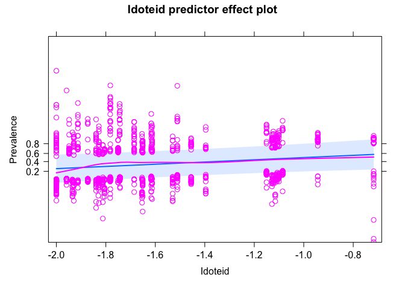

Community Interaction SEM results
================

# SEMs comparing epifauna vs lacuna vs ampithoid vs iodteid vs richness

Same as final SEM used in paper but without Bodega values - this is to
test if there is an effect of bias with the smaller animals in the BB
samples but not elsewhere. Gonna be messed up due to temperature
anyway…goal is to check that overall results hold - i.e. epifauna and
snails have positive relationship with prevalence and lesion area. And
they do! Good.

``` r
# data ###
dis <- read_csv("data/epiphyte_SEM_data_all_large.csv")
```

    ## Rows: 1350 Columns: 49
    ## ── Column specification ────────────────────────────────────────────────────────
    ## Delimiter: ","
    ## chr   (8): Meter, SampleId, Region, SiteCode, TidalHeight, BrokenTip, Notes,...
    ## dbl  (40): Transect, Blade, LongestBladeLength, LongestBladeWidth, SheathLen...
    ## date  (1): SampleDate
    ## 
    ## ℹ Use `spec()` to retrieve the full column specification for this data.
    ## ℹ Specify the column types or set `show_col_types = FALSE` to quiet this message.

``` r
dis <- subset(dis, Region!="BB")
# updating the SEM to compare the effects of using large vs all animals
dis$BladeAreaLog <- log10(dis$BladeArea)
dis$EpiphyteLog <- log10(dis$EpiphytePerAreamgcm2+0.01)
# use the full data set without subsetting because the SEM no longer includes epiphytes or grazing
# dis1 <- select(dis, c(Epifauna = Epifauna_all, TempAnomWarm_June, MonthlyMeanTemp_June, CanopyHeight, 
#                       DensityLog, YearBinary, Year, Meadow, Region,BladeAreaLog, TidalHeightBinary, 
#                       Prevalence, LesionArea, EpiphytePerAreamgcm2, EpiphyteLog, GrazingScars,
#                       Lacuna = Lacuna_all, 
#                       Ampithoid = Ampithoid_all, Idoteid = Idoteid_all, Richness = Richness_all))

dis1_large <- select(dis, c(Epifauna = Epifauna_large, TempAnomWarm_June, MonthlyMeanTemp_June, CanopyHeight, 
                      DensityLog, YearBinary, Year, Meadow, Region, Transect, Blade, BladeAreaLog, TidalHeightBinary, GrazingScars,
                      Prevalence, LesionArea, EpiphyteLog, Lacuna = Lacuna_large, 
                      Ampithoid = Ampithoid_large, Idoteid = Idoteid_large, Richness = Richness_large))
# reminder, binary variables are set to 0 and 1 and modeled as numeric for piecewise SEM!
dis1_large$Meadow_Year <- paste(dis1_large$Meadow, dis1_large$Year, sep = "_")
dis_large <- na.omit(dis1_large)
site_large <- distinct(dis_large, Meadow_Year, .keep_all = T)
site_large <- select(site_large, -c(Prevalence, LesionArea, EpiphyteLog, TidalHeightBinary, BladeAreaLog))
# site <- read_csv("data/epifauna_site_for_plotting.csv")
# site <- select(site, c())
print("meadow-year combos in prevalence SEM")
```

    ## [1] "meadow-year combos in prevalence SEM"

``` r
length(unique(dis_large$Meadow_Year))
```

    ## [1] 40

``` r
unique(dis_large$Meadow_Year)
```

    ##  [1] "AK_A_2019" "AK_B_2019" "AK_C_2019" "AK_D_2019" "AK_E_2019" "AK_F_2019"
    ##  [7] "BC_A_2019" "BC_B_2019" "BC_C_2019" "BC_D_2019" "BC_E_2019" "WA_A_2019"
    ## [13] "WA_B_2019" "WA_C_2019" "WA_D_2019" "WA_E_2019" "OR_B_2019" "OR_C_2019"
    ## [19] "OR_D_2019" "OR_E_2019" "AK_A_2021" "AK_B_2021" "AK_C_2021" "AK_D_2021"
    ## [25] "AK_E_2021" "AK_F_2021" "BC_A_2021" "BC_C_2021" "BC_E_2021" "BC_B_2021"
    ## [31] "BC_D_2021" "WA_A_2021" "WA_B_2021" "WA_D_2021" "WA_E_2021" "OR_C_2021"
    ## [37] "OR_D_2021" "OR_E_2021" "SD_A_2021" "SD_D_2021"

``` r
print("nrows of disease data (sample size)")
```

    ## [1] "nrows of disease data (sample size)"

``` r
nrow(dis_large)
```

    ## [1] 1188

``` r
# unique(dis1_large$Meadow_Year)
```

## Prevalence + Epifauna

``` r
sem_prev_epi <- psem(
  lmer(Epifauna ~ TempAnomWarm_June + MonthlyMeanTemp_June + 
         CanopyHeight + DensityLog +
         YearBinary +
         (1|Meadow),
       data=site_large),
  lmer(CanopyHeight ~ TempAnomWarm_June + MonthlyMeanTemp_June + 
         YearBinary + 
         (1|Meadow),
       data=site_large),
  lmer(DensityLog ~ TempAnomWarm_June + MonthlyMeanTemp_June +
         YearBinary + 
         (1|Meadow),
       data=site_large),
    lmer(BladeAreaLog ~ Epifauna + CanopyHeight + DensityLog + 
         TempAnomWarm_June + MonthlyMeanTemp_June +
         TidalHeightBinary + YearBinary +
         (1|Meadow),
         data=dis_large),
  lmer(EpiphyteLog ~ BladeAreaLog + Epifauna + CanopyHeight + DensityLog + 
         TempAnomWarm_June + MonthlyMeanTemp_June +
         TidalHeightBinary + YearBinary +
         (1|Meadow),
       data=dis_large),
  glmer(GrazingScars ~ BladeAreaLog + Epifauna + CanopyHeight + DensityLog + 
          TempAnomWarm_June + MonthlyMeanTemp_June + 
          TidalHeightBinary + YearBinary + 
         (1|Meadow),
        data=dis_large,
        family = "binomial"),
  glmer(Prevalence ~ BladeAreaLog + EpiphyteLog + GrazingScars +
          Epifauna + CanopyHeight + DensityLog + 
          TempAnomWarm_June + MonthlyMeanTemp_June + 
          TidalHeightBinary + YearBinary + 
         (1|Meadow),
        data=dis_large,
        family = "binomial"),
  DensityLog%~~%CanopyHeight
)
```

    ## Warning in checkConv(attr(opt, "derivs"), opt$par, ctrl = control$checkConv, :
    ## Model failed to converge with max|grad| = 0.0954317 (tol = 0.002, component 1)

    ## Warning in checkConv(attr(opt, "derivs"), opt$par, ctrl = control$checkConv, :
    ## Model failed to converge with max|grad| = 0.021761 (tol = 0.002, component 1)

``` r
summary(sem_prev_epi)
```

    ##   |                                                                              |                                                                      |   0%  |                                                                              |==================                                                    |  25%  |                                                                              |===================================                                   |  50%  |                                                                              |====================================================                  |  75%  |                                                                              |======================================================================| 100%

    ## 
    ## Structural Equation Model of sem_prev_epi 
    ## 
    ## Call:
    ##   Epifauna ~ TempAnomWarm_June + MonthlyMeanTemp_June + CanopyHeight + DensityLog + YearBinary
    ##   CanopyHeight ~ TempAnomWarm_June + MonthlyMeanTemp_June + YearBinary
    ##   DensityLog ~ TempAnomWarm_June + MonthlyMeanTemp_June + YearBinary
    ##   BladeAreaLog ~ Epifauna + CanopyHeight + DensityLog + TempAnomWarm_June + MonthlyMeanTemp_June + TidalHeightBinary + YearBinary
    ##   EpiphyteLog ~ BladeAreaLog + Epifauna + CanopyHeight + DensityLog + TempAnomWarm_June + MonthlyMeanTemp_June + TidalHeightBinary + YearBinary
    ##   GrazingScars ~ BladeAreaLog + Epifauna + CanopyHeight + DensityLog + TempAnomWarm_June + MonthlyMeanTemp_June + TidalHeightBinary + YearBinary
    ##   Prevalence ~ BladeAreaLog + EpiphyteLog + GrazingScars + Epifauna + CanopyHeight + DensityLog + TempAnomWarm_June + MonthlyMeanTemp_June + TidalHeightBinary + YearBinary
    ##   DensityLog ~~ CanopyHeight
    ## 
    ##     AIC
    ##  4135.415
    ## 
    ## ---
    ## Tests of directed separation:
    ## 
    ##                           Independ.Claim Test.Type       DF Crit.Value P.Value 
    ##       Epifauna ~ TidalHeightBinary + ...      coef 1160.007     0.0000  0.9949 
    ##   CanopyHeight ~ TidalHeightBinary + ...      coef 1162.011     0.0027  0.9585 
    ##     DensityLog ~ TidalHeightBinary + ...      coef 1162.001     0.0195  0.8891 
    ##         GrazingScars ~ EpiphyteLog + ...      coef 1188.000     1.4957  0.1347 
    ## 
    ## --
    ## Global goodness-of-fit:
    ## 
    ## Chi-Squared = 6401.714 with P-value = 0 and on 4 degrees of freedom
    ## Fisher's C = 4.339 with P-value = 0.825 and on 8 degrees of freedom
    ## 
    ## ---
    ## Coefficients:
    ## 
    ##       Response            Predictor Estimate Std.Error        DF Crit.Value
    ##       Epifauna    TempAnomWarm_June  -0.0155    0.0053   29.4051     7.9218
    ##       Epifauna MonthlyMeanTemp_June   0.0055    0.0338   26.2376     0.0261
    ##       Epifauna         CanopyHeight  -0.8873     0.231   33.1601    13.2519
    ##       Epifauna           DensityLog  -0.4779    0.1616   30.6320     7.9794
    ##       Epifauna           YearBinary  -0.1046     0.079   19.0578     1.7062
    ##   CanopyHeight    TempAnomWarm_June  -0.0050    0.0033   26.7491     2.2647
    ##   CanopyHeight MonthlyMeanTemp_June  -0.0579    0.0289   28.6947     3.8662
    ##   CanopyHeight           YearBinary  -0.1176    0.0451   16.5974     6.7616
    ##     DensityLog    TempAnomWarm_June  -0.0117     0.004   28.0736     8.1550
    ##     DensityLog MonthlyMeanTemp_June   0.0662    0.0413   30.5260     2.4174
    ##     DensityLog           YearBinary  -0.0593    0.0519   16.3353     1.2962
    ##   BladeAreaLog             Epifauna  -0.0624    0.0424   76.9728     2.0698
    ##   BladeAreaLog         CanopyHeight   0.6580    0.0678   93.4800    89.6302
    ##   BladeAreaLog           DensityLog  -0.1786    0.0456   55.1479    14.6307
    ##   BladeAreaLog    TempAnomWarm_June  -0.0020    0.0014  106.7672     1.8068
    ##   BladeAreaLog MonthlyMeanTemp_June  -0.0325    0.0089   26.5153    13.1622
    ##   BladeAreaLog    TidalHeightBinary  -0.2392    0.0143 1161.1816   278.0872
    ##   BladeAreaLog           YearBinary   0.0477    0.0184  891.6227     6.6532
    ##    EpiphyteLog         BladeAreaLog  -0.1506    0.0457 1160.8970    10.8703
    ##    EpiphyteLog             Epifauna   0.1381    0.0977 1073.6049     1.9820
    ##    EpiphyteLog         CanopyHeight  -0.5854    0.1499 1157.7814    15.1619
    ##    EpiphyteLog           DensityLog  -0.3108    0.1241  860.2853     6.1732
    ##    EpiphyteLog    TempAnomWarm_June   0.0067    0.0037  560.8772     3.1832
    ##    EpiphyteLog MonthlyMeanTemp_June  -0.2304    0.0468  203.6321    23.3055
    ##    EpiphyteLog    TidalHeightBinary  -0.0521    0.0248 1158.7249     4.4146
    ##    EpiphyteLog           YearBinary  -0.0590    0.0308 1173.3024     3.6716
    ##   GrazingScars         BladeAreaLog   1.8520    0.3266 1188.0000     5.6710
    ##   GrazingScars             Epifauna  -0.7683    0.4974 1188.0000    -1.5448
    ##   GrazingScars         CanopyHeight  -0.5370    0.9672 1188.0000    -0.5552
    ##   GrazingScars           DensityLog   0.6746    0.7105 1188.0000     0.9494
    ##   GrazingScars    TempAnomWarm_June   0.0667     0.018 1188.0000     3.6957
    ##   GrazingScars MonthlyMeanTemp_June   0.6082    0.1516 1188.0000     4.0130
    ##   GrazingScars    TidalHeightBinary   0.0718    0.1615 1188.0000     0.4448
    ##   GrazingScars           YearBinary  -1.0724    0.2152 1188.0000    -4.9830
    ##     Prevalence         BladeAreaLog   1.5758    0.3182 1188.0000     4.9518
    ##     Prevalence          EpiphyteLog   0.0821    0.1694 1188.0000     0.4845
    ##     Prevalence         GrazingScars   1.3443    0.1718 1188.0000     7.8249
    ##     Prevalence             Epifauna   1.5739    0.4766 1188.0000     3.3023
    ##     Prevalence         CanopyHeight   1.0621    0.8153 1188.0000     1.3027
    ##     Prevalence           DensityLog   1.8541     0.597 1188.0000     3.1057
    ##     Prevalence    TempAnomWarm_June   0.0176    0.0158 1188.0000     1.1144
    ##     Prevalence MonthlyMeanTemp_June  -0.0156    0.1242 1188.0000    -0.1258
    ##     Prevalence    TidalHeightBinary   0.6272    0.1535 1188.0000     4.0855
    ##     Prevalence           YearBinary   0.4269    0.1899 1188.0000     2.2477
    ##   ~~DensityLog       ~~CanopyHeight  -0.0925         -   40.0000    -0.5653
    ##   P.Value Std.Estimate    
    ##    0.0086      -0.3459  **
    ##    0.8729       0.0236    
    ##    0.0009      -0.7224 ***
    ##    0.0082      -0.5823  **
    ##    0.2070      -0.1259    
    ##    0.1441      -0.1367    
    ##    0.0590      -0.3027    
    ##    0.0189      -0.1739   *
    ##    0.0080      -0.2150  **
    ##    0.1303       0.2311    
    ##    0.2713      -0.0585    
    ##    0.1543      -0.0610    
    ##    0.0000       0.5237 ***
    ##    0.0003      -0.2127 ***
    ##    0.1817      -0.0433    
    ##    0.0012      -0.1353  **
    ##    0.0000      -0.2815 ***
    ##    0.0101       0.0561   *
    ##    0.0010      -0.0606  **
    ##    0.1595       0.0543    
    ##    0.0001      -0.1874 ***
    ##    0.0132      -0.1489   *
    ##    0.0749       0.0587    
    ##    0.0000      -0.3853 ***
    ##    0.0358      -0.0247   *
    ##    0.0556      -0.0279    
    ##    0.0000       0.3596 ***
    ##    0.1224      -0.1459    
    ##    0.5787      -0.0830    
    ##    0.3424       0.1560    
    ##    0.0002       0.2826 ***
    ##    0.0001       0.4910 ***
    ##    0.6565       0.0164    
    ##    0.0000      -0.2450 ***
    ##    0.0000       0.2885 ***
    ##    0.6280       0.0374    
    ##    0.0000       0.2618 ***
    ##    0.0010       0.2817 ***
    ##    0.1927       0.1548    
    ##    0.0019       0.4043  **
    ##    0.2651       0.0702    
    ##    0.8999      -0.0119    
    ##    0.0000       0.1351 ***
    ##    0.0246       0.0920   *
    ##    0.2876      -0.0925    
    ## 
    ##   Signif. codes:  0 '***' 0.001 '**' 0.01 '*' 0.05
    ## 
    ## ---
    ## Individual R-squared:
    ## 
    ##       Response      method Marginal Conditional
    ##       Epifauna        none     0.33        0.78
    ##   CanopyHeight        none     0.16        0.88
    ##     DensityLog        none     0.09        0.92
    ##   BladeAreaLog        none     0.61        0.65
    ##    EpiphyteLog        none     0.15        0.88
    ##   GrazingScars theoretical     0.25        0.47
    ##     Prevalence theoretical     0.14        0.41

Passes global fit.

Epifauna abundance is significant and positive predictor of prevalence.

Coefficient table:

``` r
a <- coefs(sem_prev_epi)
kable(a, digits = 4, caption = "Coefficients from Total Epifauna-Prevalence SEM") 
```

<table>
<caption>
Coefficients from Total Epifauna-Prevalence SEM
</caption>
<thead>
<tr>
<th style="text-align:left;">
Response
</th>
<th style="text-align:left;">
Predictor
</th>
<th style="text-align:right;">
Estimate
</th>
<th style="text-align:left;">
Std.Error
</th>
<th style="text-align:right;">
DF
</th>
<th style="text-align:right;">
Crit.Value
</th>
<th style="text-align:right;">
P.Value
</th>
<th style="text-align:right;">
Std.Estimate
</th>
<th style="text-align:left;">
</th>
</tr>
</thead>
<tbody>
<tr>
<td style="text-align:left;">
Epifauna
</td>
<td style="text-align:left;">
TempAnomWarm_June
</td>
<td style="text-align:right;">
-0.0155
</td>
<td style="text-align:left;">
0.0053
</td>
<td style="text-align:right;">
29.4051
</td>
<td style="text-align:right;">
7.9218
</td>
<td style="text-align:right;">
0.0086
</td>
<td style="text-align:right;">
-0.3459
</td>
<td style="text-align:left;">
\*\*
</td>
</tr>
<tr>
<td style="text-align:left;">
Epifauna
</td>
<td style="text-align:left;">
MonthlyMeanTemp_June
</td>
<td style="text-align:right;">
0.0055
</td>
<td style="text-align:left;">
0.0338
</td>
<td style="text-align:right;">
26.2376
</td>
<td style="text-align:right;">
0.0261
</td>
<td style="text-align:right;">
0.8729
</td>
<td style="text-align:right;">
0.0236
</td>
<td style="text-align:left;">
</td>
</tr>
<tr>
<td style="text-align:left;">
Epifauna
</td>
<td style="text-align:left;">
CanopyHeight
</td>
<td style="text-align:right;">
-0.8873
</td>
<td style="text-align:left;">
0.231
</td>
<td style="text-align:right;">
33.1601
</td>
<td style="text-align:right;">
13.2519
</td>
<td style="text-align:right;">
0.0009
</td>
<td style="text-align:right;">
-0.7224
</td>
<td style="text-align:left;">
\*\*\*
</td>
</tr>
<tr>
<td style="text-align:left;">
Epifauna
</td>
<td style="text-align:left;">
DensityLog
</td>
<td style="text-align:right;">
-0.4779
</td>
<td style="text-align:left;">
0.1616
</td>
<td style="text-align:right;">
30.6320
</td>
<td style="text-align:right;">
7.9794
</td>
<td style="text-align:right;">
0.0082
</td>
<td style="text-align:right;">
-0.5823
</td>
<td style="text-align:left;">
\*\*
</td>
</tr>
<tr>
<td style="text-align:left;">
Epifauna
</td>
<td style="text-align:left;">
YearBinary
</td>
<td style="text-align:right;">
-0.1046
</td>
<td style="text-align:left;">
0.079
</td>
<td style="text-align:right;">
19.0578
</td>
<td style="text-align:right;">
1.7062
</td>
<td style="text-align:right;">
0.2070
</td>
<td style="text-align:right;">
-0.1259
</td>
<td style="text-align:left;">
</td>
</tr>
<tr>
<td style="text-align:left;">
CanopyHeight
</td>
<td style="text-align:left;">
TempAnomWarm_June
</td>
<td style="text-align:right;">
-0.0050
</td>
<td style="text-align:left;">
0.0033
</td>
<td style="text-align:right;">
26.7491
</td>
<td style="text-align:right;">
2.2647
</td>
<td style="text-align:right;">
0.1441
</td>
<td style="text-align:right;">
-0.1367
</td>
<td style="text-align:left;">
</td>
</tr>
<tr>
<td style="text-align:left;">
CanopyHeight
</td>
<td style="text-align:left;">
MonthlyMeanTemp_June
</td>
<td style="text-align:right;">
-0.0579
</td>
<td style="text-align:left;">
0.0289
</td>
<td style="text-align:right;">
28.6947
</td>
<td style="text-align:right;">
3.8662
</td>
<td style="text-align:right;">
0.0590
</td>
<td style="text-align:right;">
-0.3027
</td>
<td style="text-align:left;">
</td>
</tr>
<tr>
<td style="text-align:left;">
CanopyHeight
</td>
<td style="text-align:left;">
YearBinary
</td>
<td style="text-align:right;">
-0.1176
</td>
<td style="text-align:left;">
0.0451
</td>
<td style="text-align:right;">
16.5974
</td>
<td style="text-align:right;">
6.7616
</td>
<td style="text-align:right;">
0.0189
</td>
<td style="text-align:right;">
-0.1739
</td>
<td style="text-align:left;">

- </td>
  </tr>
  <tr>
  <td style="text-align:left;">
  DensityLog
  </td>
  <td style="text-align:left;">
  TempAnomWarm_June
  </td>
  <td style="text-align:right;">
  -0.0117
  </td>
  <td style="text-align:left;">
  0.004
  </td>
  <td style="text-align:right;">
  28.0736
  </td>
  <td style="text-align:right;">
  8.1550
  </td>
  <td style="text-align:right;">
  0.0080
  </td>
  <td style="text-align:right;">
  -0.2150
  </td>
  <td style="text-align:left;">
  \*\*
  </td>
  </tr>
  <tr>
  <td style="text-align:left;">
  DensityLog
  </td>
  <td style="text-align:left;">
  MonthlyMeanTemp_June
  </td>
  <td style="text-align:right;">
  0.0662
  </td>
  <td style="text-align:left;">
  0.0413
  </td>
  <td style="text-align:right;">
  30.5260
  </td>
  <td style="text-align:right;">
  2.4174
  </td>
  <td style="text-align:right;">
  0.1303
  </td>
  <td style="text-align:right;">
  0.2311
  </td>
  <td style="text-align:left;">
  </td>
  </tr>
  <tr>
  <td style="text-align:left;">
  DensityLog
  </td>
  <td style="text-align:left;">
  YearBinary
  </td>
  <td style="text-align:right;">
  -0.0593
  </td>
  <td style="text-align:left;">
  0.0519
  </td>
  <td style="text-align:right;">
  16.3353
  </td>
  <td style="text-align:right;">
  1.2962
  </td>
  <td style="text-align:right;">
  0.2713
  </td>
  <td style="text-align:right;">
  -0.0585
  </td>
  <td style="text-align:left;">
  </td>
  </tr>
  <tr>
  <td style="text-align:left;">
  BladeAreaLog
  </td>
  <td style="text-align:left;">
  Epifauna
  </td>
  <td style="text-align:right;">
  -0.0624
  </td>
  <td style="text-align:left;">
  0.0424
  </td>
  <td style="text-align:right;">
  76.9728
  </td>
  <td style="text-align:right;">
  2.0698
  </td>
  <td style="text-align:right;">
  0.1543
  </td>
  <td style="text-align:right;">
  -0.0610
  </td>
  <td style="text-align:left;">
  </td>
  </tr>
  <tr>
  <td style="text-align:left;">
  BladeAreaLog
  </td>
  <td style="text-align:left;">
  CanopyHeight
  </td>
  <td style="text-align:right;">
  0.6580
  </td>
  <td style="text-align:left;">
  0.0678
  </td>
  <td style="text-align:right;">
  93.4800
  </td>
  <td style="text-align:right;">
  89.6302
  </td>
  <td style="text-align:right;">
  0.0000
  </td>
  <td style="text-align:right;">
  0.5237
  </td>
  <td style="text-align:left;">
  \*\*\*
  </td>
  </tr>
  <tr>
  <td style="text-align:left;">
  BladeAreaLog
  </td>
  <td style="text-align:left;">
  DensityLog
  </td>
  <td style="text-align:right;">
  -0.1786
  </td>
  <td style="text-align:left;">
  0.0456
  </td>
  <td style="text-align:right;">
  55.1479
  </td>
  <td style="text-align:right;">
  14.6307
  </td>
  <td style="text-align:right;">
  0.0003
  </td>
  <td style="text-align:right;">
  -0.2127
  </td>
  <td style="text-align:left;">
  \*\*\*
  </td>
  </tr>
  <tr>
  <td style="text-align:left;">
  BladeAreaLog
  </td>
  <td style="text-align:left;">
  TempAnomWarm_June
  </td>
  <td style="text-align:right;">
  -0.0020
  </td>
  <td style="text-align:left;">
  0.0014
  </td>
  <td style="text-align:right;">
  106.7672
  </td>
  <td style="text-align:right;">
  1.8068
  </td>
  <td style="text-align:right;">
  0.1817
  </td>
  <td style="text-align:right;">
  -0.0433
  </td>
  <td style="text-align:left;">
  </td>
  </tr>
  <tr>
  <td style="text-align:left;">
  BladeAreaLog
  </td>
  <td style="text-align:left;">
  MonthlyMeanTemp_June
  </td>
  <td style="text-align:right;">
  -0.0325
  </td>
  <td style="text-align:left;">
  0.0089
  </td>
  <td style="text-align:right;">
  26.5153
  </td>
  <td style="text-align:right;">
  13.1622
  </td>
  <td style="text-align:right;">
  0.0012
  </td>
  <td style="text-align:right;">
  -0.1353
  </td>
  <td style="text-align:left;">
  \*\*
  </td>
  </tr>
  <tr>
  <td style="text-align:left;">
  BladeAreaLog
  </td>
  <td style="text-align:left;">
  TidalHeightBinary
  </td>
  <td style="text-align:right;">
  -0.2392
  </td>
  <td style="text-align:left;">
  0.0143
  </td>
  <td style="text-align:right;">
  1161.1816
  </td>
  <td style="text-align:right;">
  278.0872
  </td>
  <td style="text-align:right;">
  0.0000
  </td>
  <td style="text-align:right;">
  -0.2815
  </td>
  <td style="text-align:left;">
  \*\*\*
  </td>
  </tr>
  <tr>
  <td style="text-align:left;">
  BladeAreaLog
  </td>
  <td style="text-align:left;">
  YearBinary
  </td>
  <td style="text-align:right;">
  0.0477
  </td>
  <td style="text-align:left;">
  0.0184
  </td>
  <td style="text-align:right;">
  891.6227
  </td>
  <td style="text-align:right;">
  6.6532
  </td>
  <td style="text-align:right;">
  0.0101
  </td>
  <td style="text-align:right;">
  0.0561
  </td>
  <td style="text-align:left;">

  - </td>
    </tr>
    <tr>
    <td style="text-align:left;">
    EpiphyteLog
    </td>
    <td style="text-align:left;">
    BladeAreaLog
    </td>
    <td style="text-align:right;">
    -0.1506
    </td>
    <td style="text-align:left;">
    0.0457
    </td>
    <td style="text-align:right;">
    1160.8970
    </td>
    <td style="text-align:right;">
    10.8703
    </td>
    <td style="text-align:right;">
    0.0010
    </td>
    <td style="text-align:right;">
    -0.0606
    </td>
    <td style="text-align:left;">
    \*\*
    </td>
    </tr>
    <tr>
    <td style="text-align:left;">
    EpiphyteLog
    </td>
    <td style="text-align:left;">
    Epifauna
    </td>
    <td style="text-align:right;">
    0.1381
    </td>
    <td style="text-align:left;">
    0.0977
    </td>
    <td style="text-align:right;">
    1073.6049
    </td>
    <td style="text-align:right;">
    1.9820
    </td>
    <td style="text-align:right;">
    0.1595
    </td>
    <td style="text-align:right;">
    0.0543
    </td>
    <td style="text-align:left;">
    </td>
    </tr>
    <tr>
    <td style="text-align:left;">
    EpiphyteLog
    </td>
    <td style="text-align:left;">
    CanopyHeight
    </td>
    <td style="text-align:right;">
    -0.5854
    </td>
    <td style="text-align:left;">
    0.1499
    </td>
    <td style="text-align:right;">
    1157.7814
    </td>
    <td style="text-align:right;">
    15.1619
    </td>
    <td style="text-align:right;">
    0.0001
    </td>
    <td style="text-align:right;">
    -0.1874
    </td>
    <td style="text-align:left;">
    \*\*\*
    </td>
    </tr>
    <tr>
    <td style="text-align:left;">
    EpiphyteLog
    </td>
    <td style="text-align:left;">
    DensityLog
    </td>
    <td style="text-align:right;">
    -0.3108
    </td>
    <td style="text-align:left;">
    0.1241
    </td>
    <td style="text-align:right;">
    860.2853
    </td>
    <td style="text-align:right;">
    6.1732
    </td>
    <td style="text-align:right;">
    0.0132
    </td>
    <td style="text-align:right;">
    -0.1489
    </td>
    <td style="text-align:left;">

    - </td>
      </tr>
      <tr>
      <td style="text-align:left;">
      EpiphyteLog
      </td>
      <td style="text-align:left;">
      TempAnomWarm_June
      </td>
      <td style="text-align:right;">
      0.0067
      </td>
      <td style="text-align:left;">
      0.0037
      </td>
      <td style="text-align:right;">
      560.8772
      </td>
      <td style="text-align:right;">
      3.1832
      </td>
      <td style="text-align:right;">
      0.0749
      </td>
      <td style="text-align:right;">
      0.0587
      </td>
      <td style="text-align:left;">
      </td>
      </tr>
      <tr>
      <td style="text-align:left;">
      EpiphyteLog
      </td>
      <td style="text-align:left;">
      MonthlyMeanTemp_June
      </td>
      <td style="text-align:right;">
      -0.2304
      </td>
      <td style="text-align:left;">
      0.0468
      </td>
      <td style="text-align:right;">
      203.6321
      </td>
      <td style="text-align:right;">
      23.3055
      </td>
      <td style="text-align:right;">
      0.0000
      </td>
      <td style="text-align:right;">
      -0.3853
      </td>
      <td style="text-align:left;">
      \*\*\*
      </td>
      </tr>
      <tr>
      <td style="text-align:left;">
      EpiphyteLog
      </td>
      <td style="text-align:left;">
      TidalHeightBinary
      </td>
      <td style="text-align:right;">
      -0.0521
      </td>
      <td style="text-align:left;">
      0.0248
      </td>
      <td style="text-align:right;">
      1158.7249
      </td>
      <td style="text-align:right;">
      4.4146
      </td>
      <td style="text-align:right;">
      0.0358
      </td>
      <td style="text-align:right;">
      -0.0247
      </td>
      <td style="text-align:left;">

      - </td>
        </tr>
        <tr>
        <td style="text-align:left;">
        EpiphyteLog
        </td>
        <td style="text-align:left;">
        YearBinary
        </td>
        <td style="text-align:right;">
        -0.0590
        </td>
        <td style="text-align:left;">
        0.0308
        </td>
        <td style="text-align:right;">
        1173.3024
        </td>
        <td style="text-align:right;">
        3.6716
        </td>
        <td style="text-align:right;">
        0.0556
        </td>
        <td style="text-align:right;">
        -0.0279
        </td>
        <td style="text-align:left;">
        </td>
        </tr>
        <tr>
        <td style="text-align:left;">
        GrazingScars
        </td>
        <td style="text-align:left;">
        BladeAreaLog
        </td>
        <td style="text-align:right;">
        1.8520
        </td>
        <td style="text-align:left;">
        0.3266
        </td>
        <td style="text-align:right;">
        1188.0000
        </td>
        <td style="text-align:right;">
        5.6710
        </td>
        <td style="text-align:right;">
        0.0000
        </td>
        <td style="text-align:right;">
        0.3596
        </td>
        <td style="text-align:left;">
        \*\*\*
        </td>
        </tr>
        <tr>
        <td style="text-align:left;">
        GrazingScars
        </td>
        <td style="text-align:left;">
        Epifauna
        </td>
        <td style="text-align:right;">
        -0.7683
        </td>
        <td style="text-align:left;">
        0.4974
        </td>
        <td style="text-align:right;">
        1188.0000
        </td>
        <td style="text-align:right;">
        -1.5448
        </td>
        <td style="text-align:right;">
        0.1224
        </td>
        <td style="text-align:right;">
        -0.1459
        </td>
        <td style="text-align:left;">
        </td>
        </tr>
        <tr>
        <td style="text-align:left;">
        GrazingScars
        </td>
        <td style="text-align:left;">
        CanopyHeight
        </td>
        <td style="text-align:right;">
        -0.5370
        </td>
        <td style="text-align:left;">
        0.9672
        </td>
        <td style="text-align:right;">
        1188.0000
        </td>
        <td style="text-align:right;">
        -0.5552
        </td>
        <td style="text-align:right;">
        0.5787
        </td>
        <td style="text-align:right;">
        -0.0830
        </td>
        <td style="text-align:left;">
        </td>
        </tr>
        <tr>
        <td style="text-align:left;">
        GrazingScars
        </td>
        <td style="text-align:left;">
        DensityLog
        </td>
        <td style="text-align:right;">
        0.6746
        </td>
        <td style="text-align:left;">
        0.7105
        </td>
        <td style="text-align:right;">
        1188.0000
        </td>
        <td style="text-align:right;">
        0.9494
        </td>
        <td style="text-align:right;">
        0.3424
        </td>
        <td style="text-align:right;">
        0.1560
        </td>
        <td style="text-align:left;">
        </td>
        </tr>
        <tr>
        <td style="text-align:left;">
        GrazingScars
        </td>
        <td style="text-align:left;">
        TempAnomWarm_June
        </td>
        <td style="text-align:right;">
        0.0667
        </td>
        <td style="text-align:left;">
        0.018
        </td>
        <td style="text-align:right;">
        1188.0000
        </td>
        <td style="text-align:right;">
        3.6957
        </td>
        <td style="text-align:right;">
        0.0002
        </td>
        <td style="text-align:right;">
        0.2826
        </td>
        <td style="text-align:left;">
        \*\*\*
        </td>
        </tr>
        <tr>
        <td style="text-align:left;">
        GrazingScars
        </td>
        <td style="text-align:left;">
        MonthlyMeanTemp_June
        </td>
        <td style="text-align:right;">
        0.6082
        </td>
        <td style="text-align:left;">
        0.1516
        </td>
        <td style="text-align:right;">
        1188.0000
        </td>
        <td style="text-align:right;">
        4.0130
        </td>
        <td style="text-align:right;">
        0.0001
        </td>
        <td style="text-align:right;">
        0.4910
        </td>
        <td style="text-align:left;">
        \*\*\*
        </td>
        </tr>
        <tr>
        <td style="text-align:left;">
        GrazingScars
        </td>
        <td style="text-align:left;">
        TidalHeightBinary
        </td>
        <td style="text-align:right;">
        0.0718
        </td>
        <td style="text-align:left;">
        0.1615
        </td>
        <td style="text-align:right;">
        1188.0000
        </td>
        <td style="text-align:right;">
        0.4448
        </td>
        <td style="text-align:right;">
        0.6565
        </td>
        <td style="text-align:right;">
        0.0164
        </td>
        <td style="text-align:left;">
        </td>
        </tr>
        <tr>
        <td style="text-align:left;">
        GrazingScars
        </td>
        <td style="text-align:left;">
        YearBinary
        </td>
        <td style="text-align:right;">
        -1.0724
        </td>
        <td style="text-align:left;">
        0.2152
        </td>
        <td style="text-align:right;">
        1188.0000
        </td>
        <td style="text-align:right;">
        -4.9830
        </td>
        <td style="text-align:right;">
        0.0000
        </td>
        <td style="text-align:right;">
        -0.2450
        </td>
        <td style="text-align:left;">
        \*\*\*
        </td>
        </tr>
        <tr>
        <td style="text-align:left;">
        Prevalence
        </td>
        <td style="text-align:left;">
        BladeAreaLog
        </td>
        <td style="text-align:right;">
        1.5758
        </td>
        <td style="text-align:left;">
        0.3182
        </td>
        <td style="text-align:right;">
        1188.0000
        </td>
        <td style="text-align:right;">
        4.9518
        </td>
        <td style="text-align:right;">
        0.0000
        </td>
        <td style="text-align:right;">
        0.2885
        </td>
        <td style="text-align:left;">
        \*\*\*
        </td>
        </tr>
        <tr>
        <td style="text-align:left;">
        Prevalence
        </td>
        <td style="text-align:left;">
        EpiphyteLog
        </td>
        <td style="text-align:right;">
        0.0821
        </td>
        <td style="text-align:left;">
        0.1694
        </td>
        <td style="text-align:right;">
        1188.0000
        </td>
        <td style="text-align:right;">
        0.4845
        </td>
        <td style="text-align:right;">
        0.6280
        </td>
        <td style="text-align:right;">
        0.0374
        </td>
        <td style="text-align:left;">
        </td>
        </tr>
        <tr>
        <td style="text-align:left;">
        Prevalence
        </td>
        <td style="text-align:left;">
        GrazingScars
        </td>
        <td style="text-align:right;">
        1.3443
        </td>
        <td style="text-align:left;">
        0.1718
        </td>
        <td style="text-align:right;">
        1188.0000
        </td>
        <td style="text-align:right;">
        7.8249
        </td>
        <td style="text-align:right;">
        0.0000
        </td>
        <td style="text-align:right;">
        0.2618
        </td>
        <td style="text-align:left;">
        \*\*\*
        </td>
        </tr>
        <tr>
        <td style="text-align:left;">
        Prevalence
        </td>
        <td style="text-align:left;">
        Epifauna
        </td>
        <td style="text-align:right;">
        1.5739
        </td>
        <td style="text-align:left;">
        0.4766
        </td>
        <td style="text-align:right;">
        1188.0000
        </td>
        <td style="text-align:right;">
        3.3023
        </td>
        <td style="text-align:right;">
        0.0010
        </td>
        <td style="text-align:right;">
        0.2817
        </td>
        <td style="text-align:left;">
        \*\*\*
        </td>
        </tr>
        <tr>
        <td style="text-align:left;">
        Prevalence
        </td>
        <td style="text-align:left;">
        CanopyHeight
        </td>
        <td style="text-align:right;">
        1.0621
        </td>
        <td style="text-align:left;">
        0.8153
        </td>
        <td style="text-align:right;">
        1188.0000
        </td>
        <td style="text-align:right;">
        1.3027
        </td>
        <td style="text-align:right;">
        0.1927
        </td>
        <td style="text-align:right;">
        0.1548
        </td>
        <td style="text-align:left;">
        </td>
        </tr>
        <tr>
        <td style="text-align:left;">
        Prevalence
        </td>
        <td style="text-align:left;">
        DensityLog
        </td>
        <td style="text-align:right;">
        1.8541
        </td>
        <td style="text-align:left;">
        0.597
        </td>
        <td style="text-align:right;">
        1188.0000
        </td>
        <td style="text-align:right;">
        3.1057
        </td>
        <td style="text-align:right;">
        0.0019
        </td>
        <td style="text-align:right;">
        0.4043
        </td>
        <td style="text-align:left;">
        \*\*
        </td>
        </tr>
        <tr>
        <td style="text-align:left;">
        Prevalence
        </td>
        <td style="text-align:left;">
        TempAnomWarm_June
        </td>
        <td style="text-align:right;">
        0.0176
        </td>
        <td style="text-align:left;">
        0.0158
        </td>
        <td style="text-align:right;">
        1188.0000
        </td>
        <td style="text-align:right;">
        1.1144
        </td>
        <td style="text-align:right;">
        0.2651
        </td>
        <td style="text-align:right;">
        0.0702
        </td>
        <td style="text-align:left;">
        </td>
        </tr>
        <tr>
        <td style="text-align:left;">
        Prevalence
        </td>
        <td style="text-align:left;">
        MonthlyMeanTemp_June
        </td>
        <td style="text-align:right;">
        -0.0156
        </td>
        <td style="text-align:left;">
        0.1242
        </td>
        <td style="text-align:right;">
        1188.0000
        </td>
        <td style="text-align:right;">
        -0.1258
        </td>
        <td style="text-align:right;">
        0.8999
        </td>
        <td style="text-align:right;">
        -0.0119
        </td>
        <td style="text-align:left;">
        </td>
        </tr>
        <tr>
        <td style="text-align:left;">
        Prevalence
        </td>
        <td style="text-align:left;">
        TidalHeightBinary
        </td>
        <td style="text-align:right;">
        0.6272
        </td>
        <td style="text-align:left;">
        0.1535
        </td>
        <td style="text-align:right;">
        1188.0000
        </td>
        <td style="text-align:right;">
        4.0855
        </td>
        <td style="text-align:right;">
        0.0000
        </td>
        <td style="text-align:right;">
        0.1351
        </td>
        <td style="text-align:left;">
        \*\*\*
        </td>
        </tr>
        <tr>
        <td style="text-align:left;">
        Prevalence
        </td>
        <td style="text-align:left;">
        YearBinary
        </td>
        <td style="text-align:right;">
        0.4269
        </td>
        <td style="text-align:left;">
        0.1899
        </td>
        <td style="text-align:right;">
        1188.0000
        </td>
        <td style="text-align:right;">
        2.2477
        </td>
        <td style="text-align:right;">
        0.0246
        </td>
        <td style="text-align:right;">
        0.0920
        </td>
        <td style="text-align:left;">

        - </td>
          </tr>
          <tr>
          <td style="text-align:left;">
          \~\~DensityLog
          </td>
          <td style="text-align:left;">
          \~\~CanopyHeight
          </td>
          <td style="text-align:right;">
          -0.0925
          </td>
          <td style="text-align:left;">

          - </td>
            <td style="text-align:right;">
            40.0000
            </td>
            <td style="text-align:right;">
            -0.5653
            </td>
            <td style="text-align:right;">
            0.2876
            </td>
            <td style="text-align:right;">
            -0.0925
            </td>
            <td style="text-align:left;">
            </td>
            </tr>
            </tbody>
            </table>

``` r
# kable(dat4, booktabs = TRUE, caption = "Injuries before and after June 15, all sports-related, non-minor", linesep="") %>%
#   kable_styling(latex_options = c("HOLD_position"))
```

## Prev + Amp

``` r
sem_prev_amp <- psem(
  lmer(Ampithoid ~ TempAnomWarm_June + MonthlyMeanTemp_June + 
         CanopyHeight + DensityLog +
         YearBinary +
         (1|Meadow) + (1|Region),
       data=site_large),
  lmer(CanopyHeight ~ TempAnomWarm_June + MonthlyMeanTemp_June + 
         YearBinary + 
         (1|Meadow) + (1|Region),
       data=site_large),
  lmer(DensityLog ~ TempAnomWarm_June + MonthlyMeanTemp_June +
         YearBinary + 
         (1|Meadow) + (1|Region),
       data=site_large),
    lmer(BladeAreaLog ~ Ampithoid + CanopyHeight + DensityLog + 
         TempAnomWarm_June + MonthlyMeanTemp_June +
         TidalHeightBinary + YearBinary +
         (1|Region) + (1|Meadow),
       data=dis_large),
  lmer(EpiphyteLog ~ BladeAreaLog + Ampithoid + CanopyHeight + DensityLog + 
         TempAnomWarm_June + MonthlyMeanTemp_June +
         TidalHeightBinary + YearBinary +
         (1|Region) + (1|Meadow),
       data=dis_large),
  glmer(GrazingScars ~ BladeAreaLog +  
          Ampithoid + CanopyHeight + DensityLog + 
          TempAnomWarm_June + MonthlyMeanTemp_June + 
          TidalHeightBinary + YearBinary + 
          (1|Region) + (1|Meadow),
        data=dis_large,
        family = "binomial"),
  glmer(Prevalence ~ BladeAreaLog + EpiphyteLog + GrazingScars + 
          Ampithoid + CanopyHeight + DensityLog + 
          TempAnomWarm_June + MonthlyMeanTemp_June + 
          TidalHeightBinary + YearBinary + 
          (1|Region) + (1|Meadow),
        data=dis_large,
        family = "binomial"),
  DensityLog%~~%CanopyHeight
)
```

    ## Warning in checkConv(attr(opt, "derivs"), opt$par, ctrl = control$checkConv, :
    ## Model failed to converge with max|grad| = 0.00228409 (tol = 0.002, component 1)

    ## Warning in checkConv(attr(opt, "derivs"), opt$par, ctrl = control$checkConv, :
    ## Model failed to converge with max|grad| = 0.00402313 (tol = 0.002, component 1)

``` r
summary(sem_prev_amp)
```

    ##   |                                                                              |                                                                      |   0%  |                                                                              |==================                                                    |  25%  |                                                                              |===================================                                   |  50%  |                                                                              |====================================================                  |  75%  |                                                                              |======================================================================| 100%

    ## 
    ## Structural Equation Model of sem_prev_amp 
    ## 
    ## Call:
    ##   Ampithoid ~ TempAnomWarm_June + MonthlyMeanTemp_June + CanopyHeight + DensityLog + YearBinary
    ##   CanopyHeight ~ TempAnomWarm_June + MonthlyMeanTemp_June + YearBinary
    ##   DensityLog ~ TempAnomWarm_June + MonthlyMeanTemp_June + YearBinary
    ##   BladeAreaLog ~ Ampithoid + CanopyHeight + DensityLog + TempAnomWarm_June + MonthlyMeanTemp_June + TidalHeightBinary + YearBinary
    ##   EpiphyteLog ~ BladeAreaLog + Ampithoid + CanopyHeight + DensityLog + TempAnomWarm_June + MonthlyMeanTemp_June + TidalHeightBinary + YearBinary
    ##   GrazingScars ~ BladeAreaLog + Ampithoid + CanopyHeight + DensityLog + TempAnomWarm_June + MonthlyMeanTemp_June + TidalHeightBinary + YearBinary
    ##   Prevalence ~ BladeAreaLog + EpiphyteLog + GrazingScars + Ampithoid + CanopyHeight + DensityLog + TempAnomWarm_June + MonthlyMeanTemp_June + TidalHeightBinary + YearBinary
    ##   DensityLog ~~ CanopyHeight
    ## 
    ##     AIC
    ##  4014.925
    ## 
    ## ---
    ## Tests of directed separation:
    ## 
    ##                           Independ.Claim Test.Type       DF Crit.Value P.Value 
    ##      Ampithoid ~ TidalHeightBinary + ...      coef 1160.017     0.0408  0.8400 
    ##   CanopyHeight ~ TidalHeightBinary + ...      coef 1162.005     0.0027  0.9584 
    ##     DensityLog ~ TidalHeightBinary + ...      coef 1162.001     0.0193  0.8895 
    ##         GrazingScars ~ EpiphyteLog + ...      coef 1188.000     1.0381  0.2992 
    ## 
    ## --
    ## Global goodness-of-fit:
    ## 
    ## Chi-Squared = 7726.906 with P-value = 0 and on 4 degrees of freedom
    ## Fisher's C = 3.081 with P-value = 0.929 and on 8 degrees of freedom
    ## 
    ## ---
    ## Coefficients:
    ## 
    ##       Response            Predictor Estimate Std.Error        DF Crit.Value
    ##      Ampithoid    TempAnomWarm_June  -0.0118    0.0032   20.4803    11.6946
    ##      Ampithoid MonthlyMeanTemp_June   0.1457    0.0247    6.5457    28.7939
    ##      Ampithoid         CanopyHeight   0.0490     0.141   31.2495     0.0902
    ##      Ampithoid           DensityLog   0.0192    0.1093   22.3500     0.0214
    ##      Ampithoid           YearBinary  -0.1406    0.0432   18.2173     9.7792
    ##   CanopyHeight    TempAnomWarm_June  -0.0050    0.0036   18.9692     1.7094
    ##   CanopyHeight MonthlyMeanTemp_June  -0.0665    0.0374    7.9195     2.5422
    ##   CanopyHeight           YearBinary  -0.1131     0.045   16.5494     6.2355
    ##     DensityLog    TempAnomWarm_June  -0.0126    0.0046   18.7310     6.4094
    ##     DensityLog MonthlyMeanTemp_June   0.0872    0.0545   11.1044     1.9071
    ##     DensityLog           YearBinary  -0.0591    0.0512   16.2981     1.3088
    ##   BladeAreaLog            Ampithoid  -0.0339    0.0807   76.1531     0.1504
    ##   BladeAreaLog         CanopyHeight   0.7507    0.0652   68.5203   103.9415
    ##   BladeAreaLog           DensityLog  -0.1120    0.0504   27.3177     3.5547
    ##   BladeAreaLog    TempAnomWarm_June  -0.0010    0.0017   67.9353     0.3329
    ##   BladeAreaLog MonthlyMeanTemp_June  -0.0202    0.0168   22.3255     1.2342
    ##   BladeAreaLog    TidalHeightBinary  -0.2393    0.0143 1160.7700   278.0896
    ##   BladeAreaLog           YearBinary   0.0555    0.0214  674.3998     6.4296
    ##    EpiphyteLog         BladeAreaLog  -0.1535    0.0455 1169.9578    11.3753
    ##    EpiphyteLog            Ampithoid  -0.4364    0.1563  275.1999     7.4647
    ##    EpiphyteLog         CanopyHeight  -0.4940    0.1306  405.4569    13.8150
    ##    EpiphyteLog           DensityLog  -0.2308    0.1119  254.4609     4.0120
    ##    EpiphyteLog    TempAnomWarm_June   0.0018     0.004  384.1037     0.1965
    ##    EpiphyteLog MonthlyMeanTemp_June  -0.1654    0.0508  214.7468     9.5708
    ##    EpiphyteLog    TidalHeightBinary  -0.0525    0.0248 1161.2249     4.5033
    ##    EpiphyteLog           YearBinary  -0.0993    0.0353 1042.5884     7.8321
    ##   GrazingScars         BladeAreaLog   1.7591    0.3288 1188.0000     5.3507
    ##   GrazingScars            Ampithoid   1.8446    0.9376 1188.0000     1.9674
    ##   GrazingScars         CanopyHeight   0.6949    0.8426 1188.0000     0.8247
    ##   GrazingScars           DensityLog   0.8647    0.6743 1188.0000     1.2825
    ##   GrazingScars    TempAnomWarm_June   0.0347    0.0288 1188.0000     1.2038
    ##   GrazingScars MonthlyMeanTemp_June   1.5452    0.3555 1188.0000     4.3459
    ##   GrazingScars    TidalHeightBinary   0.0327    0.1635 1188.0000     0.2001
    ##   GrazingScars           YearBinary  -0.4775    0.2421 1188.0000    -1.9722
    ##     Prevalence         BladeAreaLog   1.4945     0.318 1188.0000     4.6993
    ##     Prevalence          EpiphyteLog   0.0215    0.1769 1188.0000     0.1213
    ##     Prevalence         GrazingScars   1.2268    0.1701 1188.0000     7.2125
    ##     Prevalence            Ampithoid   1.0580    0.9497 1188.0000     1.1140
    ##     Prevalence         CanopyHeight   0.4952    0.7585 1188.0000     0.6530
    ##     Prevalence           DensityLog   1.8110    0.6147 1188.0000     2.9463
    ##     Prevalence    TempAnomWarm_June   0.0101    0.0198 1188.0000     0.5102
    ##     Prevalence MonthlyMeanTemp_June  -0.0931    0.2342 1188.0000    -0.3976
    ##     Prevalence    TidalHeightBinary   0.6049     0.154 1188.0000     3.9274
    ##     Prevalence           YearBinary   0.5914    0.2228 1188.0000     2.6550
    ##   ~~DensityLog       ~~CanopyHeight  -0.1339         -   40.0000    -0.8219
    ##   P.Value Std.Estimate    
    ##    0.0026      -0.3326  **
    ##    0.0013       0.7832  **
    ##    0.7659       0.0504    
    ##    0.8851       0.0296    
    ##    0.0058      -0.2139  **
    ##    0.2067      -0.1367    
    ##    0.1499      -0.3476    
    ##    0.0234      -0.1672   *
    ##    0.0205      -0.2318   *
    ##    0.1944       0.3044    
    ##    0.2691      -0.0584    
    ##    0.6992      -0.0263    
    ##    0.0000       0.5975 ***
    ##    0.0701      -0.1334    
    ##    0.5659      -0.0228    
    ##    0.2784      -0.0839    
    ##    0.0000      -0.2815 ***
    ##    0.0114       0.0653   *
    ##    0.0008      -0.0617 ***
    ##    0.0067      -0.1357  **
    ##    0.0002      -0.1581 ***
    ##    0.0462      -0.1106   *
    ##    0.6578       0.0161    
    ##    0.0022      -0.2765  **
    ##    0.0340      -0.0249   *
    ##    0.0052      -0.0470  **
    ##    0.0000       0.3355 ***
    ##    0.0491       0.2721   *
    ##    0.4095       0.1055    
    ##    0.1997       0.1965    
    ##    0.2287       0.1446    
    ##    0.0000       1.2255 ***
    ##    0.8414       0.0073    
    ##    0.0486      -0.1072   *
    ##    0.0000       0.2749 ***
    ##    0.9035       0.0098    
    ##    0.0000       0.2400 ***
    ##    0.2653       0.1505    
    ##    0.5138       0.0725    
    ##    0.0032       0.3968  **
    ##    0.6099       0.0406    
    ##    0.6909      -0.0712    
    ##    0.0001       0.1309 ***
    ##    0.0079       0.1280  **
    ##    0.2082      -0.1339    
    ## 
    ##   Signif. codes:  0 '***' 0.001 '**' 0.01 '*' 0.05
    ## 
    ## ---
    ## Individual R-squared:
    ## 
    ##       Response      method Marginal Conditional
    ##      Ampithoid        none     0.61        0.91
    ##   CanopyHeight        none     0.16        0.90
    ##     DensityLog        none     0.11        0.94
    ##   BladeAreaLog        none     0.59        0.64
    ##    EpiphyteLog        none     0.13        0.89
    ##   GrazingScars theoretical     0.29        0.90
    ##     Prevalence theoretical     0.11        0.49

Passes global fit.

Ampithoid abundance is not significant predictor of prevalence.

Coefficient table:

``` r
b <- coefs(sem_prev_amp)
knitr::kable(b, digits = 4, caption = "Coefficients from Ampithoid-Prevalence SEM") 
```

<table>
<caption>
Coefficients from Ampithoid-Prevalence SEM
</caption>
<thead>
<tr>
<th style="text-align:left;">
Response
</th>
<th style="text-align:left;">
Predictor
</th>
<th style="text-align:right;">
Estimate
</th>
<th style="text-align:left;">
Std.Error
</th>
<th style="text-align:right;">
DF
</th>
<th style="text-align:right;">
Crit.Value
</th>
<th style="text-align:right;">
P.Value
</th>
<th style="text-align:right;">
Std.Estimate
</th>
<th style="text-align:left;">
</th>
</tr>
</thead>
<tbody>
<tr>
<td style="text-align:left;">
Ampithoid
</td>
<td style="text-align:left;">
TempAnomWarm_June
</td>
<td style="text-align:right;">
-0.0118
</td>
<td style="text-align:left;">
0.0032
</td>
<td style="text-align:right;">
20.4803
</td>
<td style="text-align:right;">
11.6946
</td>
<td style="text-align:right;">
0.0026
</td>
<td style="text-align:right;">
-0.3326
</td>
<td style="text-align:left;">
\*\*
</td>
</tr>
<tr>
<td style="text-align:left;">
Ampithoid
</td>
<td style="text-align:left;">
MonthlyMeanTemp_June
</td>
<td style="text-align:right;">
0.1457
</td>
<td style="text-align:left;">
0.0247
</td>
<td style="text-align:right;">
6.5457
</td>
<td style="text-align:right;">
28.7939
</td>
<td style="text-align:right;">
0.0013
</td>
<td style="text-align:right;">
0.7832
</td>
<td style="text-align:left;">
\*\*
</td>
</tr>
<tr>
<td style="text-align:left;">
Ampithoid
</td>
<td style="text-align:left;">
CanopyHeight
</td>
<td style="text-align:right;">
0.0490
</td>
<td style="text-align:left;">
0.141
</td>
<td style="text-align:right;">
31.2495
</td>
<td style="text-align:right;">
0.0902
</td>
<td style="text-align:right;">
0.7659
</td>
<td style="text-align:right;">
0.0504
</td>
<td style="text-align:left;">
</td>
</tr>
<tr>
<td style="text-align:left;">
Ampithoid
</td>
<td style="text-align:left;">
DensityLog
</td>
<td style="text-align:right;">
0.0192
</td>
<td style="text-align:left;">
0.1093
</td>
<td style="text-align:right;">
22.3500
</td>
<td style="text-align:right;">
0.0214
</td>
<td style="text-align:right;">
0.8851
</td>
<td style="text-align:right;">
0.0296
</td>
<td style="text-align:left;">
</td>
</tr>
<tr>
<td style="text-align:left;">
Ampithoid
</td>
<td style="text-align:left;">
YearBinary
</td>
<td style="text-align:right;">
-0.1406
</td>
<td style="text-align:left;">
0.0432
</td>
<td style="text-align:right;">
18.2173
</td>
<td style="text-align:right;">
9.7792
</td>
<td style="text-align:right;">
0.0058
</td>
<td style="text-align:right;">
-0.2139
</td>
<td style="text-align:left;">
\*\*
</td>
</tr>
<tr>
<td style="text-align:left;">
CanopyHeight
</td>
<td style="text-align:left;">
TempAnomWarm_June
</td>
<td style="text-align:right;">
-0.0050
</td>
<td style="text-align:left;">
0.0036
</td>
<td style="text-align:right;">
18.9692
</td>
<td style="text-align:right;">
1.7094
</td>
<td style="text-align:right;">
0.2067
</td>
<td style="text-align:right;">
-0.1367
</td>
<td style="text-align:left;">
</td>
</tr>
<tr>
<td style="text-align:left;">
CanopyHeight
</td>
<td style="text-align:left;">
MonthlyMeanTemp_June
</td>
<td style="text-align:right;">
-0.0665
</td>
<td style="text-align:left;">
0.0374
</td>
<td style="text-align:right;">
7.9195
</td>
<td style="text-align:right;">
2.5422
</td>
<td style="text-align:right;">
0.1499
</td>
<td style="text-align:right;">
-0.3476
</td>
<td style="text-align:left;">
</td>
</tr>
<tr>
<td style="text-align:left;">
CanopyHeight
</td>
<td style="text-align:left;">
YearBinary
</td>
<td style="text-align:right;">
-0.1131
</td>
<td style="text-align:left;">
0.045
</td>
<td style="text-align:right;">
16.5494
</td>
<td style="text-align:right;">
6.2355
</td>
<td style="text-align:right;">
0.0234
</td>
<td style="text-align:right;">
-0.1672
</td>
<td style="text-align:left;">

- </td>
  </tr>
  <tr>
  <td style="text-align:left;">
  DensityLog
  </td>
  <td style="text-align:left;">
  TempAnomWarm_June
  </td>
  <td style="text-align:right;">
  -0.0126
  </td>
  <td style="text-align:left;">
  0.0046
  </td>
  <td style="text-align:right;">
  18.7310
  </td>
  <td style="text-align:right;">
  6.4094
  </td>
  <td style="text-align:right;">
  0.0205
  </td>
  <td style="text-align:right;">
  -0.2318
  </td>
  <td style="text-align:left;">

  - </td>
    </tr>
    <tr>
    <td style="text-align:left;">
    DensityLog
    </td>
    <td style="text-align:left;">
    MonthlyMeanTemp_June
    </td>
    <td style="text-align:right;">
    0.0872
    </td>
    <td style="text-align:left;">
    0.0545
    </td>
    <td style="text-align:right;">
    11.1044
    </td>
    <td style="text-align:right;">
    1.9071
    </td>
    <td style="text-align:right;">
    0.1944
    </td>
    <td style="text-align:right;">
    0.3044
    </td>
    <td style="text-align:left;">
    </td>
    </tr>
    <tr>
    <td style="text-align:left;">
    DensityLog
    </td>
    <td style="text-align:left;">
    YearBinary
    </td>
    <td style="text-align:right;">
    -0.0591
    </td>
    <td style="text-align:left;">
    0.0512
    </td>
    <td style="text-align:right;">
    16.2981
    </td>
    <td style="text-align:right;">
    1.3088
    </td>
    <td style="text-align:right;">
    0.2691
    </td>
    <td style="text-align:right;">
    -0.0584
    </td>
    <td style="text-align:left;">
    </td>
    </tr>
    <tr>
    <td style="text-align:left;">
    BladeAreaLog
    </td>
    <td style="text-align:left;">
    Ampithoid
    </td>
    <td style="text-align:right;">
    -0.0339
    </td>
    <td style="text-align:left;">
    0.0807
    </td>
    <td style="text-align:right;">
    76.1531
    </td>
    <td style="text-align:right;">
    0.1504
    </td>
    <td style="text-align:right;">
    0.6992
    </td>
    <td style="text-align:right;">
    -0.0263
    </td>
    <td style="text-align:left;">
    </td>
    </tr>
    <tr>
    <td style="text-align:left;">
    BladeAreaLog
    </td>
    <td style="text-align:left;">
    CanopyHeight
    </td>
    <td style="text-align:right;">
    0.7507
    </td>
    <td style="text-align:left;">
    0.0652
    </td>
    <td style="text-align:right;">
    68.5203
    </td>
    <td style="text-align:right;">
    103.9415
    </td>
    <td style="text-align:right;">
    0.0000
    </td>
    <td style="text-align:right;">
    0.5975
    </td>
    <td style="text-align:left;">
    \*\*\*
    </td>
    </tr>
    <tr>
    <td style="text-align:left;">
    BladeAreaLog
    </td>
    <td style="text-align:left;">
    DensityLog
    </td>
    <td style="text-align:right;">
    -0.1120
    </td>
    <td style="text-align:left;">
    0.0504
    </td>
    <td style="text-align:right;">
    27.3177
    </td>
    <td style="text-align:right;">
    3.5547
    </td>
    <td style="text-align:right;">
    0.0701
    </td>
    <td style="text-align:right;">
    -0.1334
    </td>
    <td style="text-align:left;">
    </td>
    </tr>
    <tr>
    <td style="text-align:left;">
    BladeAreaLog
    </td>
    <td style="text-align:left;">
    TempAnomWarm_June
    </td>
    <td style="text-align:right;">
    -0.0010
    </td>
    <td style="text-align:left;">
    0.0017
    </td>
    <td style="text-align:right;">
    67.9353
    </td>
    <td style="text-align:right;">
    0.3329
    </td>
    <td style="text-align:right;">
    0.5659
    </td>
    <td style="text-align:right;">
    -0.0228
    </td>
    <td style="text-align:left;">
    </td>
    </tr>
    <tr>
    <td style="text-align:left;">
    BladeAreaLog
    </td>
    <td style="text-align:left;">
    MonthlyMeanTemp_June
    </td>
    <td style="text-align:right;">
    -0.0202
    </td>
    <td style="text-align:left;">
    0.0168
    </td>
    <td style="text-align:right;">
    22.3255
    </td>
    <td style="text-align:right;">
    1.2342
    </td>
    <td style="text-align:right;">
    0.2784
    </td>
    <td style="text-align:right;">
    -0.0839
    </td>
    <td style="text-align:left;">
    </td>
    </tr>
    <tr>
    <td style="text-align:left;">
    BladeAreaLog
    </td>
    <td style="text-align:left;">
    TidalHeightBinary
    </td>
    <td style="text-align:right;">
    -0.2393
    </td>
    <td style="text-align:left;">
    0.0143
    </td>
    <td style="text-align:right;">
    1160.7700
    </td>
    <td style="text-align:right;">
    278.0896
    </td>
    <td style="text-align:right;">
    0.0000
    </td>
    <td style="text-align:right;">
    -0.2815
    </td>
    <td style="text-align:left;">
    \*\*\*
    </td>
    </tr>
    <tr>
    <td style="text-align:left;">
    BladeAreaLog
    </td>
    <td style="text-align:left;">
    YearBinary
    </td>
    <td style="text-align:right;">
    0.0555
    </td>
    <td style="text-align:left;">
    0.0214
    </td>
    <td style="text-align:right;">
    674.3998
    </td>
    <td style="text-align:right;">
    6.4296
    </td>
    <td style="text-align:right;">
    0.0114
    </td>
    <td style="text-align:right;">
    0.0653
    </td>
    <td style="text-align:left;">

    - </td>
      </tr>
      <tr>
      <td style="text-align:left;">
      EpiphyteLog
      </td>
      <td style="text-align:left;">
      BladeAreaLog
      </td>
      <td style="text-align:right;">
      -0.1535
      </td>
      <td style="text-align:left;">
      0.0455
      </td>
      <td style="text-align:right;">
      1169.9578
      </td>
      <td style="text-align:right;">
      11.3753
      </td>
      <td style="text-align:right;">
      0.0008
      </td>
      <td style="text-align:right;">
      -0.0617
      </td>
      <td style="text-align:left;">
      \*\*\*
      </td>
      </tr>
      <tr>
      <td style="text-align:left;">
      EpiphyteLog
      </td>
      <td style="text-align:left;">
      Ampithoid
      </td>
      <td style="text-align:right;">
      -0.4364
      </td>
      <td style="text-align:left;">
      0.1563
      </td>
      <td style="text-align:right;">
      275.1999
      </td>
      <td style="text-align:right;">
      7.4647
      </td>
      <td style="text-align:right;">
      0.0067
      </td>
      <td style="text-align:right;">
      -0.1357
      </td>
      <td style="text-align:left;">
      \*\*
      </td>
      </tr>
      <tr>
      <td style="text-align:left;">
      EpiphyteLog
      </td>
      <td style="text-align:left;">
      CanopyHeight
      </td>
      <td style="text-align:right;">
      -0.4940
      </td>
      <td style="text-align:left;">
      0.1306
      </td>
      <td style="text-align:right;">
      405.4569
      </td>
      <td style="text-align:right;">
      13.8150
      </td>
      <td style="text-align:right;">
      0.0002
      </td>
      <td style="text-align:right;">
      -0.1581
      </td>
      <td style="text-align:left;">
      \*\*\*
      </td>
      </tr>
      <tr>
      <td style="text-align:left;">
      EpiphyteLog
      </td>
      <td style="text-align:left;">
      DensityLog
      </td>
      <td style="text-align:right;">
      -0.2308
      </td>
      <td style="text-align:left;">
      0.1119
      </td>
      <td style="text-align:right;">
      254.4609
      </td>
      <td style="text-align:right;">
      4.0120
      </td>
      <td style="text-align:right;">
      0.0462
      </td>
      <td style="text-align:right;">
      -0.1106
      </td>
      <td style="text-align:left;">

      - </td>
        </tr>
        <tr>
        <td style="text-align:left;">
        EpiphyteLog
        </td>
        <td style="text-align:left;">
        TempAnomWarm_June
        </td>
        <td style="text-align:right;">
        0.0018
        </td>
        <td style="text-align:left;">
        0.004
        </td>
        <td style="text-align:right;">
        384.1037
        </td>
        <td style="text-align:right;">
        0.1965
        </td>
        <td style="text-align:right;">
        0.6578
        </td>
        <td style="text-align:right;">
        0.0161
        </td>
        <td style="text-align:left;">
        </td>
        </tr>
        <tr>
        <td style="text-align:left;">
        EpiphyteLog
        </td>
        <td style="text-align:left;">
        MonthlyMeanTemp_June
        </td>
        <td style="text-align:right;">
        -0.1654
        </td>
        <td style="text-align:left;">
        0.0508
        </td>
        <td style="text-align:right;">
        214.7468
        </td>
        <td style="text-align:right;">
        9.5708
        </td>
        <td style="text-align:right;">
        0.0022
        </td>
        <td style="text-align:right;">
        -0.2765
        </td>
        <td style="text-align:left;">
        \*\*
        </td>
        </tr>
        <tr>
        <td style="text-align:left;">
        EpiphyteLog
        </td>
        <td style="text-align:left;">
        TidalHeightBinary
        </td>
        <td style="text-align:right;">
        -0.0525
        </td>
        <td style="text-align:left;">
        0.0248
        </td>
        <td style="text-align:right;">
        1161.2249
        </td>
        <td style="text-align:right;">
        4.5033
        </td>
        <td style="text-align:right;">
        0.0340
        </td>
        <td style="text-align:right;">
        -0.0249
        </td>
        <td style="text-align:left;">

        - </td>
          </tr>
          <tr>
          <td style="text-align:left;">
          EpiphyteLog
          </td>
          <td style="text-align:left;">
          YearBinary
          </td>
          <td style="text-align:right;">
          -0.0993
          </td>
          <td style="text-align:left;">
          0.0353
          </td>
          <td style="text-align:right;">
          1042.5884
          </td>
          <td style="text-align:right;">
          7.8321
          </td>
          <td style="text-align:right;">
          0.0052
          </td>
          <td style="text-align:right;">
          -0.0470
          </td>
          <td style="text-align:left;">
          \*\*
          </td>
          </tr>
          <tr>
          <td style="text-align:left;">
          GrazingScars
          </td>
          <td style="text-align:left;">
          BladeAreaLog
          </td>
          <td style="text-align:right;">
          1.7591
          </td>
          <td style="text-align:left;">
          0.3288
          </td>
          <td style="text-align:right;">
          1188.0000
          </td>
          <td style="text-align:right;">
          5.3507
          </td>
          <td style="text-align:right;">
          0.0000
          </td>
          <td style="text-align:right;">
          0.3355
          </td>
          <td style="text-align:left;">
          \*\*\*
          </td>
          </tr>
          <tr>
          <td style="text-align:left;">
          GrazingScars
          </td>
          <td style="text-align:left;">
          Ampithoid
          </td>
          <td style="text-align:right;">
          1.8446
          </td>
          <td style="text-align:left;">
          0.9376
          </td>
          <td style="text-align:right;">
          1188.0000
          </td>
          <td style="text-align:right;">
          1.9674
          </td>
          <td style="text-align:right;">
          0.0491
          </td>
          <td style="text-align:right;">
          0.2721
          </td>
          <td style="text-align:left;">

          - </td>
            </tr>
            <tr>
            <td style="text-align:left;">
            GrazingScars
            </td>
            <td style="text-align:left;">
            CanopyHeight
            </td>
            <td style="text-align:right;">
            0.6949
            </td>
            <td style="text-align:left;">
            0.8426
            </td>
            <td style="text-align:right;">
            1188.0000
            </td>
            <td style="text-align:right;">
            0.8247
            </td>
            <td style="text-align:right;">
            0.4095
            </td>
            <td style="text-align:right;">
            0.1055
            </td>
            <td style="text-align:left;">
            </td>
            </tr>
            <tr>
            <td style="text-align:left;">
            GrazingScars
            </td>
            <td style="text-align:left;">
            DensityLog
            </td>
            <td style="text-align:right;">
            0.8647
            </td>
            <td style="text-align:left;">
            0.6743
            </td>
            <td style="text-align:right;">
            1188.0000
            </td>
            <td style="text-align:right;">
            1.2825
            </td>
            <td style="text-align:right;">
            0.1997
            </td>
            <td style="text-align:right;">
            0.1965
            </td>
            <td style="text-align:left;">
            </td>
            </tr>
            <tr>
            <td style="text-align:left;">
            GrazingScars
            </td>
            <td style="text-align:left;">
            TempAnomWarm_June
            </td>
            <td style="text-align:right;">
            0.0347
            </td>
            <td style="text-align:left;">
            0.0288
            </td>
            <td style="text-align:right;">
            1188.0000
            </td>
            <td style="text-align:right;">
            1.2038
            </td>
            <td style="text-align:right;">
            0.2287
            </td>
            <td style="text-align:right;">
            0.1446
            </td>
            <td style="text-align:left;">
            </td>
            </tr>
            <tr>
            <td style="text-align:left;">
            GrazingScars
            </td>
            <td style="text-align:left;">
            MonthlyMeanTemp_June
            </td>
            <td style="text-align:right;">
            1.5452
            </td>
            <td style="text-align:left;">
            0.3555
            </td>
            <td style="text-align:right;">
            1188.0000
            </td>
            <td style="text-align:right;">
            4.3459
            </td>
            <td style="text-align:right;">
            0.0000
            </td>
            <td style="text-align:right;">
            1.2255
            </td>
            <td style="text-align:left;">
            \*\*\*
            </td>
            </tr>
            <tr>
            <td style="text-align:left;">
            GrazingScars
            </td>
            <td style="text-align:left;">
            TidalHeightBinary
            </td>
            <td style="text-align:right;">
            0.0327
            </td>
            <td style="text-align:left;">
            0.1635
            </td>
            <td style="text-align:right;">
            1188.0000
            </td>
            <td style="text-align:right;">
            0.2001
            </td>
            <td style="text-align:right;">
            0.8414
            </td>
            <td style="text-align:right;">
            0.0073
            </td>
            <td style="text-align:left;">
            </td>
            </tr>
            <tr>
            <td style="text-align:left;">
            GrazingScars
            </td>
            <td style="text-align:left;">
            YearBinary
            </td>
            <td style="text-align:right;">
            -0.4775
            </td>
            <td style="text-align:left;">
            0.2421
            </td>
            <td style="text-align:right;">
            1188.0000
            </td>
            <td style="text-align:right;">
            -1.9722
            </td>
            <td style="text-align:right;">
            0.0486
            </td>
            <td style="text-align:right;">
            -0.1072
            </td>
            <td style="text-align:left;">

            - </td>
              </tr>
              <tr>
              <td style="text-align:left;">
              Prevalence
              </td>
              <td style="text-align:left;">
              BladeAreaLog
              </td>
              <td style="text-align:right;">
              1.4945
              </td>
              <td style="text-align:left;">
              0.318
              </td>
              <td style="text-align:right;">
              1188.0000
              </td>
              <td style="text-align:right;">
              4.6993
              </td>
              <td style="text-align:right;">
              0.0000
              </td>
              <td style="text-align:right;">
              0.2749
              </td>
              <td style="text-align:left;">
              \*\*\*
              </td>
              </tr>
              <tr>
              <td style="text-align:left;">
              Prevalence
              </td>
              <td style="text-align:left;">
              EpiphyteLog
              </td>
              <td style="text-align:right;">
              0.0215
              </td>
              <td style="text-align:left;">
              0.1769
              </td>
              <td style="text-align:right;">
              1188.0000
              </td>
              <td style="text-align:right;">
              0.1213
              </td>
              <td style="text-align:right;">
              0.9035
              </td>
              <td style="text-align:right;">
              0.0098
              </td>
              <td style="text-align:left;">
              </td>
              </tr>
              <tr>
              <td style="text-align:left;">
              Prevalence
              </td>
              <td style="text-align:left;">
              GrazingScars
              </td>
              <td style="text-align:right;">
              1.2268
              </td>
              <td style="text-align:left;">
              0.1701
              </td>
              <td style="text-align:right;">
              1188.0000
              </td>
              <td style="text-align:right;">
              7.2125
              </td>
              <td style="text-align:right;">
              0.0000
              </td>
              <td style="text-align:right;">
              0.2400
              </td>
              <td style="text-align:left;">
              \*\*\*
              </td>
              </tr>
              <tr>
              <td style="text-align:left;">
              Prevalence
              </td>
              <td style="text-align:left;">
              Ampithoid
              </td>
              <td style="text-align:right;">
              1.0580
              </td>
              <td style="text-align:left;">
              0.9497
              </td>
              <td style="text-align:right;">
              1188.0000
              </td>
              <td style="text-align:right;">
              1.1140
              </td>
              <td style="text-align:right;">
              0.2653
              </td>
              <td style="text-align:right;">
              0.1505
              </td>
              <td style="text-align:left;">
              </td>
              </tr>
              <tr>
              <td style="text-align:left;">
              Prevalence
              </td>
              <td style="text-align:left;">
              CanopyHeight
              </td>
              <td style="text-align:right;">
              0.4952
              </td>
              <td style="text-align:left;">
              0.7585
              </td>
              <td style="text-align:right;">
              1188.0000
              </td>
              <td style="text-align:right;">
              0.6530
              </td>
              <td style="text-align:right;">
              0.5138
              </td>
              <td style="text-align:right;">
              0.0725
              </td>
              <td style="text-align:left;">
              </td>
              </tr>
              <tr>
              <td style="text-align:left;">
              Prevalence
              </td>
              <td style="text-align:left;">
              DensityLog
              </td>
              <td style="text-align:right;">
              1.8110
              </td>
              <td style="text-align:left;">
              0.6147
              </td>
              <td style="text-align:right;">
              1188.0000
              </td>
              <td style="text-align:right;">
              2.9463
              </td>
              <td style="text-align:right;">
              0.0032
              </td>
              <td style="text-align:right;">
              0.3968
              </td>
              <td style="text-align:left;">
              \*\*
              </td>
              </tr>
              <tr>
              <td style="text-align:left;">
              Prevalence
              </td>
              <td style="text-align:left;">
              TempAnomWarm_June
              </td>
              <td style="text-align:right;">
              0.0101
              </td>
              <td style="text-align:left;">
              0.0198
              </td>
              <td style="text-align:right;">
              1188.0000
              </td>
              <td style="text-align:right;">
              0.5102
              </td>
              <td style="text-align:right;">
              0.6099
              </td>
              <td style="text-align:right;">
              0.0406
              </td>
              <td style="text-align:left;">
              </td>
              </tr>
              <tr>
              <td style="text-align:left;">
              Prevalence
              </td>
              <td style="text-align:left;">
              MonthlyMeanTemp_June
              </td>
              <td style="text-align:right;">
              -0.0931
              </td>
              <td style="text-align:left;">
              0.2342
              </td>
              <td style="text-align:right;">
              1188.0000
              </td>
              <td style="text-align:right;">
              -0.3976
              </td>
              <td style="text-align:right;">
              0.6909
              </td>
              <td style="text-align:right;">
              -0.0712
              </td>
              <td style="text-align:left;">
              </td>
              </tr>
              <tr>
              <td style="text-align:left;">
              Prevalence
              </td>
              <td style="text-align:left;">
              TidalHeightBinary
              </td>
              <td style="text-align:right;">
              0.6049
              </td>
              <td style="text-align:left;">
              0.154
              </td>
              <td style="text-align:right;">
              1188.0000
              </td>
              <td style="text-align:right;">
              3.9274
              </td>
              <td style="text-align:right;">
              0.0001
              </td>
              <td style="text-align:right;">
              0.1309
              </td>
              <td style="text-align:left;">
              \*\*\*
              </td>
              </tr>
              <tr>
              <td style="text-align:left;">
              Prevalence
              </td>
              <td style="text-align:left;">
              YearBinary
              </td>
              <td style="text-align:right;">
              0.5914
              </td>
              <td style="text-align:left;">
              0.2228
              </td>
              <td style="text-align:right;">
              1188.0000
              </td>
              <td style="text-align:right;">
              2.6550
              </td>
              <td style="text-align:right;">
              0.0079
              </td>
              <td style="text-align:right;">
              0.1280
              </td>
              <td style="text-align:left;">
              \*\*
              </td>
              </tr>
              <tr>
              <td style="text-align:left;">
              \~\~DensityLog
              </td>
              <td style="text-align:left;">
              \~\~CanopyHeight
              </td>
              <td style="text-align:right;">
              -0.1339
              </td>
              <td style="text-align:left;">

              - </td>
                <td style="text-align:right;">
                40.0000
                </td>
                <td style="text-align:right;">
                -0.8219
                </td>
                <td style="text-align:right;">
                0.2082
                </td>
                <td style="text-align:right;">
                -0.1339
                </td>
                <td style="text-align:left;">
                </td>
                </tr>
                </tbody>
                </table>

## Prev + Lac

``` r
sem_prev_lac <- psem(
  lmer(Lacuna ~ TempAnomWarm_June + MonthlyMeanTemp_June + 
         CanopyHeight + DensityLog +
         YearBinary +
         (1|Meadow) + (1|Region),
       data=site_large),
  lmer(CanopyHeight ~ TempAnomWarm_June + MonthlyMeanTemp_June + 
         YearBinary + 
         (1|Meadow) + (1|Region),
       data=site_large),
  lmer(DensityLog ~ TempAnomWarm_June + MonthlyMeanTemp_June +
         YearBinary + 
         (1|Meadow) + (1|Region),
       data=site_large),
    lmer(BladeAreaLog ~ Lacuna + CanopyHeight + DensityLog + 
         TempAnomWarm_June + MonthlyMeanTemp_June +
         TidalHeightBinary + YearBinary +
         (1|Region) + (1|Meadow),
       data=dis_large),
  lmer(EpiphyteLog ~ BladeAreaLog + Lacuna + CanopyHeight + DensityLog + 
         TempAnomWarm_June + MonthlyMeanTemp_June +
         TidalHeightBinary + YearBinary +
         (1|Region) + (1|Meadow),
       data=dis_large),
  glmer(GrazingScars ~ BladeAreaLog + 
          Lacuna + CanopyHeight + DensityLog + 
          TempAnomWarm_June + MonthlyMeanTemp_June + 
          TidalHeightBinary + YearBinary + 
          (1|Region) + (1|Meadow),
        data=dis_large,
        family = "binomial"),
  glmer(Prevalence ~ BladeAreaLog + EpiphyteLog + GrazingScars + 
          Lacuna + CanopyHeight + DensityLog + 
          TempAnomWarm_June + MonthlyMeanTemp_June + 
          TidalHeightBinary + YearBinary + 
          (1|Region) + (1|Meadow),
        data=dis_large,
        family = "binomial"),
  DensityLog%~~%CanopyHeight
)
```

    ## Warning in checkConv(attr(opt, "derivs"), opt$par, ctrl = control$checkConv, :
    ## Model failed to converge with max|grad| = 0.00410799 (tol = 0.002, component 1)

    ## Warning in checkConv(attr(opt, "derivs"), opt$par, ctrl = control$checkConv, :
    ## Model failed to converge with max|grad| = 0.0040256 (tol = 0.002, component 1)

``` r
summary(sem_prev_lac)
```

    ##   |                                                                              |                                                                      |   0%  |                                                                              |==================                                                    |  25%  |                                                                              |===================================                                   |  50%  |                                                                              |====================================================                  |  75%  |                                                                              |======================================================================| 100%

    ## 
    ## Structural Equation Model of sem_prev_lac 
    ## 
    ## Call:
    ##   Lacuna ~ TempAnomWarm_June + MonthlyMeanTemp_June + CanopyHeight + DensityLog + YearBinary
    ##   CanopyHeight ~ TempAnomWarm_June + MonthlyMeanTemp_June + YearBinary
    ##   DensityLog ~ TempAnomWarm_June + MonthlyMeanTemp_June + YearBinary
    ##   BladeAreaLog ~ Lacuna + CanopyHeight + DensityLog + TempAnomWarm_June + MonthlyMeanTemp_June + TidalHeightBinary + YearBinary
    ##   EpiphyteLog ~ BladeAreaLog + Lacuna + CanopyHeight + DensityLog + TempAnomWarm_June + MonthlyMeanTemp_June + TidalHeightBinary + YearBinary
    ##   GrazingScars ~ BladeAreaLog + Lacuna + CanopyHeight + DensityLog + TempAnomWarm_June + MonthlyMeanTemp_June + TidalHeightBinary + YearBinary
    ##   Prevalence ~ BladeAreaLog + EpiphyteLog + GrazingScars + Lacuna + CanopyHeight + DensityLog + TempAnomWarm_June + MonthlyMeanTemp_June + TidalHeightBinary + YearBinary
    ##   DensityLog ~~ CanopyHeight
    ## 
    ##     AIC
    ##  4095.174
    ## 
    ## ---
    ## Tests of directed separation:
    ## 
    ##                           Independ.Claim Test.Type       DF Crit.Value P.Value 
    ##         Lacuna ~ TidalHeightBinary + ...      coef 1160.009     0.0334  0.8549 
    ##   CanopyHeight ~ TidalHeightBinary + ...      coef 1162.005     0.0027  0.9584 
    ##     DensityLog ~ TidalHeightBinary + ...      coef 1162.001     0.0193  0.8895 
    ##         GrazingScars ~ EpiphyteLog + ...      coef 1188.000     0.8367  0.4027 
    ## 
    ## --
    ## Global goodness-of-fit:
    ## 
    ## Chi-Squared = 5054.262 with P-value = 0 and on 4 degrees of freedom
    ## Fisher's C = 2.452 with P-value = 0.964 and on 8 degrees of freedom
    ## 
    ## ---
    ## Coefficients:
    ## 
    ##       Response            Predictor Estimate Std.Error        DF Crit.Value
    ##         Lacuna    TempAnomWarm_June   0.0186    0.0105   20.4069     2.5738
    ##         Lacuna MonthlyMeanTemp_June  -0.0605     0.073    6.3642     0.5647
    ##         Lacuna         CanopyHeight  -0.3011    0.4593   25.6423     0.2933
    ##         Lacuna           DensityLog  -0.1106    0.3463   14.3879     0.0647
    ##         Lacuna           YearBinary  -0.3421    0.1492   18.7773     4.7618
    ##   CanopyHeight    TempAnomWarm_June  -0.0050    0.0036   18.9692     1.7094
    ##   CanopyHeight MonthlyMeanTemp_June  -0.0665    0.0374    7.9195     2.5422
    ##   CanopyHeight           YearBinary  -0.1131     0.045   16.5494     6.2355
    ##     DensityLog    TempAnomWarm_June  -0.0126    0.0046   18.7310     6.4094
    ##     DensityLog MonthlyMeanTemp_June   0.0872    0.0545   11.1044     1.9071
    ##     DensityLog           YearBinary  -0.0591    0.0512   16.2981     1.3088
    ##   BladeAreaLog               Lacuna   0.0270    0.0237   70.2579     1.0549
    ##   BladeAreaLog         CanopyHeight   0.7251    0.0601   20.4552    94.8754
    ##   BladeAreaLog           DensityLog  -0.1368    0.0439    8.7660     6.1696
    ##   BladeAreaLog    TempAnomWarm_June  -0.0013    0.0014   27.9698     0.6990
    ##   BladeAreaLog MonthlyMeanTemp_June  -0.0291    0.0096    7.6457     7.6971
    ##   BladeAreaLog    TidalHeightBinary  -0.2394    0.0143 1161.0679   278.2556
    ##   BladeAreaLog           YearBinary   0.0632    0.0195  785.4992     9.9183
    ##    EpiphyteLog         BladeAreaLog  -0.1532    0.0455 1168.7689    11.3256
    ##    EpiphyteLog               Lacuna  -0.1024     0.049  314.5708     4.1953
    ##    EpiphyteLog         CanopyHeight  -0.5197    0.1336  376.2675    14.5981
    ##    EpiphyteLog           DensityLog  -0.2439    0.1139  282.5414     4.3354
    ##    EpiphyteLog    TempAnomWarm_June   0.0082    0.0038  375.4990     4.3462
    ##    EpiphyteLog MonthlyMeanTemp_June  -0.2256    0.0462  245.5564    21.4001
    ##    EpiphyteLog    TidalHeightBinary  -0.0526    0.0248 1160.8235     4.5101
    ##    EpiphyteLog           YearBinary  -0.0672    0.0313 1175.8542     4.6077
    ##   GrazingScars         BladeAreaLog   1.7803    0.3294 1188.0000     5.4053
    ##   GrazingScars               Lacuna   0.3834    0.2983 1188.0000     1.2854
    ##   GrazingScars         CanopyHeight   0.8830    0.8366 1188.0000     1.0554
    ##   GrazingScars           DensityLog   1.0035    0.6687 1188.0000     1.5006
    ##   GrazingScars    TempAnomWarm_June   0.0211    0.0284 1188.0000     0.7417
    ##   GrazingScars MonthlyMeanTemp_June   1.5966    0.3896 1188.0000     4.0982
    ##   GrazingScars    TidalHeightBinary   0.0354    0.1626 1188.0000     0.2179
    ##   GrazingScars           YearBinary  -0.6512    0.2127 1188.0000    -3.0623
    ##     Prevalence         BladeAreaLog   1.4890    0.3134 1188.0000     4.7509
    ##     Prevalence          EpiphyteLog   0.0326    0.1664 1188.0000     0.1958
    ##     Prevalence         GrazingScars   1.1838    0.1676 1188.0000     7.0650
    ##     Prevalence               Lacuna   0.9682    0.2324 1188.0000     4.1653
    ##     Prevalence         CanopyHeight   0.0574    0.6574 1188.0000     0.0873
    ##     Prevalence           DensityLog   1.3078     0.506 1188.0000     2.5848
    ##     Prevalence    TempAnomWarm_June  -0.0254    0.0146 1188.0000    -1.7424
    ##     Prevalence MonthlyMeanTemp_June   0.0972    0.1286 1188.0000     0.7556
    ##     Prevalence    TidalHeightBinary   0.6032    0.1533 1188.0000     3.9333
    ##     Prevalence           YearBinary   0.6023    0.1877 1188.0000     3.2094
    ##   ~~DensityLog       ~~CanopyHeight  -0.1339         -   40.0000    -0.8219
    ##   P.Value Std.Estimate    
    ##    0.1240       0.2617    
    ##    0.4792      -0.1621    
    ##    0.5928      -0.1545    
    ##    0.8027      -0.0849    
    ##    0.0420      -0.2595   *
    ##    0.2067      -0.1367    
    ##    0.1499      -0.3476    
    ##    0.0234      -0.1672   *
    ##    0.0205      -0.2318   *
    ##    0.1944       0.3044    
    ##    0.2691      -0.0584    
    ##    0.3079       0.0419    
    ##    0.0000       0.5771 ***
    ##    0.0354      -0.1629   *
    ##    0.4102      -0.0289    
    ##    0.0252      -0.1209   *
    ##    0.0000      -0.2816 ***
    ##    0.0017       0.0743  **
    ##    0.0008      -0.0616 ***
    ##    0.0414      -0.0639   *
    ##    0.0002      -0.1664 ***
    ##    0.0382      -0.1169   *
    ##    0.0378       0.0719   *
    ##    0.0000      -0.3772 ***
    ##    0.0339      -0.0249   *
    ##    0.0320      -0.0318   *
    ##    0.0000       0.3395 ***
    ##    0.1986       0.1134    
    ##    0.2912       0.1340    
    ##    0.1335       0.2279    
    ##    0.4583       0.0877    
    ##    0.0000       1.2658 ***
    ##    0.8275       0.0079    
    ##    0.0022      -0.1461  **
    ##    0.0000       0.2790 ***
    ##    0.8448       0.0152    
    ##    0.0000       0.2359 ***
    ##    0.0000       0.2814 ***
    ##    0.9305       0.0086    
    ##    0.0097       0.2919  **
    ##    0.0814      -0.1040    
    ##    0.4499       0.0757    
    ##    0.0001       0.1330 ***
    ##    0.0013       0.1328  **
    ##    0.2082      -0.1339    
    ## 
    ##   Signif. codes:  0 '***' 0.001 '**' 0.01 '*' 0.05
    ## 
    ## ---
    ## Individual R-squared:
    ## 
    ##       Response      method Marginal Conditional
    ##         Lacuna        none     0.13        0.72
    ##   CanopyHeight        none     0.16        0.90
    ##     DensityLog        none     0.11        0.94
    ##   BladeAreaLog        none     0.60        0.64
    ##    EpiphyteLog        none     0.11        0.89
    ##   GrazingScars theoretical     0.30        0.85
    ##     Prevalence theoretical     0.18        0.36

Passes global fit.

Lacuna abundance is significant and positive predictor of prevalence.

Coefficient table:

``` r
c <- coefs(sem_prev_lac)
knitr::kable(c, digits = 4, caption = "Coefficients from Lacuna-Prevalence SEM") 
```

<table>
<caption>
Coefficients from Lacuna-Prevalence SEM
</caption>
<thead>
<tr>
<th style="text-align:left;">
Response
</th>
<th style="text-align:left;">
Predictor
</th>
<th style="text-align:right;">
Estimate
</th>
<th style="text-align:left;">
Std.Error
</th>
<th style="text-align:right;">
DF
</th>
<th style="text-align:right;">
Crit.Value
</th>
<th style="text-align:right;">
P.Value
</th>
<th style="text-align:right;">
Std.Estimate
</th>
<th style="text-align:left;">
</th>
</tr>
</thead>
<tbody>
<tr>
<td style="text-align:left;">
Lacuna
</td>
<td style="text-align:left;">
TempAnomWarm_June
</td>
<td style="text-align:right;">
0.0186
</td>
<td style="text-align:left;">
0.0105
</td>
<td style="text-align:right;">
20.4069
</td>
<td style="text-align:right;">
2.5738
</td>
<td style="text-align:right;">
0.1240
</td>
<td style="text-align:right;">
0.2617
</td>
<td style="text-align:left;">
</td>
</tr>
<tr>
<td style="text-align:left;">
Lacuna
</td>
<td style="text-align:left;">
MonthlyMeanTemp_June
</td>
<td style="text-align:right;">
-0.0605
</td>
<td style="text-align:left;">
0.073
</td>
<td style="text-align:right;">
6.3642
</td>
<td style="text-align:right;">
0.5647
</td>
<td style="text-align:right;">
0.4792
</td>
<td style="text-align:right;">
-0.1621
</td>
<td style="text-align:left;">
</td>
</tr>
<tr>
<td style="text-align:left;">
Lacuna
</td>
<td style="text-align:left;">
CanopyHeight
</td>
<td style="text-align:right;">
-0.3011
</td>
<td style="text-align:left;">
0.4593
</td>
<td style="text-align:right;">
25.6423
</td>
<td style="text-align:right;">
0.2933
</td>
<td style="text-align:right;">
0.5928
</td>
<td style="text-align:right;">
-0.1545
</td>
<td style="text-align:left;">
</td>
</tr>
<tr>
<td style="text-align:left;">
Lacuna
</td>
<td style="text-align:left;">
DensityLog
</td>
<td style="text-align:right;">
-0.1106
</td>
<td style="text-align:left;">
0.3463
</td>
<td style="text-align:right;">
14.3879
</td>
<td style="text-align:right;">
0.0647
</td>
<td style="text-align:right;">
0.8027
</td>
<td style="text-align:right;">
-0.0849
</td>
<td style="text-align:left;">
</td>
</tr>
<tr>
<td style="text-align:left;">
Lacuna
</td>
<td style="text-align:left;">
YearBinary
</td>
<td style="text-align:right;">
-0.3421
</td>
<td style="text-align:left;">
0.1492
</td>
<td style="text-align:right;">
18.7773
</td>
<td style="text-align:right;">
4.7618
</td>
<td style="text-align:right;">
0.0420
</td>
<td style="text-align:right;">
-0.2595
</td>
<td style="text-align:left;">

- </td>
  </tr>
  <tr>
  <td style="text-align:left;">
  CanopyHeight
  </td>
  <td style="text-align:left;">
  TempAnomWarm_June
  </td>
  <td style="text-align:right;">
  -0.0050
  </td>
  <td style="text-align:left;">
  0.0036
  </td>
  <td style="text-align:right;">
  18.9692
  </td>
  <td style="text-align:right;">
  1.7094
  </td>
  <td style="text-align:right;">
  0.2067
  </td>
  <td style="text-align:right;">
  -0.1367
  </td>
  <td style="text-align:left;">
  </td>
  </tr>
  <tr>
  <td style="text-align:left;">
  CanopyHeight
  </td>
  <td style="text-align:left;">
  MonthlyMeanTemp_June
  </td>
  <td style="text-align:right;">
  -0.0665
  </td>
  <td style="text-align:left;">
  0.0374
  </td>
  <td style="text-align:right;">
  7.9195
  </td>
  <td style="text-align:right;">
  2.5422
  </td>
  <td style="text-align:right;">
  0.1499
  </td>
  <td style="text-align:right;">
  -0.3476
  </td>
  <td style="text-align:left;">
  </td>
  </tr>
  <tr>
  <td style="text-align:left;">
  CanopyHeight
  </td>
  <td style="text-align:left;">
  YearBinary
  </td>
  <td style="text-align:right;">
  -0.1131
  </td>
  <td style="text-align:left;">
  0.045
  </td>
  <td style="text-align:right;">
  16.5494
  </td>
  <td style="text-align:right;">
  6.2355
  </td>
  <td style="text-align:right;">
  0.0234
  </td>
  <td style="text-align:right;">
  -0.1672
  </td>
  <td style="text-align:left;">

  - </td>
    </tr>
    <tr>
    <td style="text-align:left;">
    DensityLog
    </td>
    <td style="text-align:left;">
    TempAnomWarm_June
    </td>
    <td style="text-align:right;">
    -0.0126
    </td>
    <td style="text-align:left;">
    0.0046
    </td>
    <td style="text-align:right;">
    18.7310
    </td>
    <td style="text-align:right;">
    6.4094
    </td>
    <td style="text-align:right;">
    0.0205
    </td>
    <td style="text-align:right;">
    -0.2318
    </td>
    <td style="text-align:left;">

    - </td>
      </tr>
      <tr>
      <td style="text-align:left;">
      DensityLog
      </td>
      <td style="text-align:left;">
      MonthlyMeanTemp_June
      </td>
      <td style="text-align:right;">
      0.0872
      </td>
      <td style="text-align:left;">
      0.0545
      </td>
      <td style="text-align:right;">
      11.1044
      </td>
      <td style="text-align:right;">
      1.9071
      </td>
      <td style="text-align:right;">
      0.1944
      </td>
      <td style="text-align:right;">
      0.3044
      </td>
      <td style="text-align:left;">
      </td>
      </tr>
      <tr>
      <td style="text-align:left;">
      DensityLog
      </td>
      <td style="text-align:left;">
      YearBinary
      </td>
      <td style="text-align:right;">
      -0.0591
      </td>
      <td style="text-align:left;">
      0.0512
      </td>
      <td style="text-align:right;">
      16.2981
      </td>
      <td style="text-align:right;">
      1.3088
      </td>
      <td style="text-align:right;">
      0.2691
      </td>
      <td style="text-align:right;">
      -0.0584
      </td>
      <td style="text-align:left;">
      </td>
      </tr>
      <tr>
      <td style="text-align:left;">
      BladeAreaLog
      </td>
      <td style="text-align:left;">
      Lacuna
      </td>
      <td style="text-align:right;">
      0.0270
      </td>
      <td style="text-align:left;">
      0.0237
      </td>
      <td style="text-align:right;">
      70.2579
      </td>
      <td style="text-align:right;">
      1.0549
      </td>
      <td style="text-align:right;">
      0.3079
      </td>
      <td style="text-align:right;">
      0.0419
      </td>
      <td style="text-align:left;">
      </td>
      </tr>
      <tr>
      <td style="text-align:left;">
      BladeAreaLog
      </td>
      <td style="text-align:left;">
      CanopyHeight
      </td>
      <td style="text-align:right;">
      0.7251
      </td>
      <td style="text-align:left;">
      0.0601
      </td>
      <td style="text-align:right;">
      20.4552
      </td>
      <td style="text-align:right;">
      94.8754
      </td>
      <td style="text-align:right;">
      0.0000
      </td>
      <td style="text-align:right;">
      0.5771
      </td>
      <td style="text-align:left;">
      \*\*\*
      </td>
      </tr>
      <tr>
      <td style="text-align:left;">
      BladeAreaLog
      </td>
      <td style="text-align:left;">
      DensityLog
      </td>
      <td style="text-align:right;">
      -0.1368
      </td>
      <td style="text-align:left;">
      0.0439
      </td>
      <td style="text-align:right;">
      8.7660
      </td>
      <td style="text-align:right;">
      6.1696
      </td>
      <td style="text-align:right;">
      0.0354
      </td>
      <td style="text-align:right;">
      -0.1629
      </td>
      <td style="text-align:left;">

      - </td>
        </tr>
        <tr>
        <td style="text-align:left;">
        BladeAreaLog
        </td>
        <td style="text-align:left;">
        TempAnomWarm_June
        </td>
        <td style="text-align:right;">
        -0.0013
        </td>
        <td style="text-align:left;">
        0.0014
        </td>
        <td style="text-align:right;">
        27.9698
        </td>
        <td style="text-align:right;">
        0.6990
        </td>
        <td style="text-align:right;">
        0.4102
        </td>
        <td style="text-align:right;">
        -0.0289
        </td>
        <td style="text-align:left;">
        </td>
        </tr>
        <tr>
        <td style="text-align:left;">
        BladeAreaLog
        </td>
        <td style="text-align:left;">
        MonthlyMeanTemp_June
        </td>
        <td style="text-align:right;">
        -0.0291
        </td>
        <td style="text-align:left;">
        0.0096
        </td>
        <td style="text-align:right;">
        7.6457
        </td>
        <td style="text-align:right;">
        7.6971
        </td>
        <td style="text-align:right;">
        0.0252
        </td>
        <td style="text-align:right;">
        -0.1209
        </td>
        <td style="text-align:left;">

        - </td>
          </tr>
          <tr>
          <td style="text-align:left;">
          BladeAreaLog
          </td>
          <td style="text-align:left;">
          TidalHeightBinary
          </td>
          <td style="text-align:right;">
          -0.2394
          </td>
          <td style="text-align:left;">
          0.0143
          </td>
          <td style="text-align:right;">
          1161.0679
          </td>
          <td style="text-align:right;">
          278.2556
          </td>
          <td style="text-align:right;">
          0.0000
          </td>
          <td style="text-align:right;">
          -0.2816
          </td>
          <td style="text-align:left;">
          \*\*\*
          </td>
          </tr>
          <tr>
          <td style="text-align:left;">
          BladeAreaLog
          </td>
          <td style="text-align:left;">
          YearBinary
          </td>
          <td style="text-align:right;">
          0.0632
          </td>
          <td style="text-align:left;">
          0.0195
          </td>
          <td style="text-align:right;">
          785.4992
          </td>
          <td style="text-align:right;">
          9.9183
          </td>
          <td style="text-align:right;">
          0.0017
          </td>
          <td style="text-align:right;">
          0.0743
          </td>
          <td style="text-align:left;">
          \*\*
          </td>
          </tr>
          <tr>
          <td style="text-align:left;">
          EpiphyteLog
          </td>
          <td style="text-align:left;">
          BladeAreaLog
          </td>
          <td style="text-align:right;">
          -0.1532
          </td>
          <td style="text-align:left;">
          0.0455
          </td>
          <td style="text-align:right;">
          1168.7689
          </td>
          <td style="text-align:right;">
          11.3256
          </td>
          <td style="text-align:right;">
          0.0008
          </td>
          <td style="text-align:right;">
          -0.0616
          </td>
          <td style="text-align:left;">
          \*\*\*
          </td>
          </tr>
          <tr>
          <td style="text-align:left;">
          EpiphyteLog
          </td>
          <td style="text-align:left;">
          Lacuna
          </td>
          <td style="text-align:right;">
          -0.1024
          </td>
          <td style="text-align:left;">
          0.049
          </td>
          <td style="text-align:right;">
          314.5708
          </td>
          <td style="text-align:right;">
          4.1953
          </td>
          <td style="text-align:right;">
          0.0414
          </td>
          <td style="text-align:right;">
          -0.0639
          </td>
          <td style="text-align:left;">

          - </td>
            </tr>
            <tr>
            <td style="text-align:left;">
            EpiphyteLog
            </td>
            <td style="text-align:left;">
            CanopyHeight
            </td>
            <td style="text-align:right;">
            -0.5197
            </td>
            <td style="text-align:left;">
            0.1336
            </td>
            <td style="text-align:right;">
            376.2675
            </td>
            <td style="text-align:right;">
            14.5981
            </td>
            <td style="text-align:right;">
            0.0002
            </td>
            <td style="text-align:right;">
            -0.1664
            </td>
            <td style="text-align:left;">
            \*\*\*
            </td>
            </tr>
            <tr>
            <td style="text-align:left;">
            EpiphyteLog
            </td>
            <td style="text-align:left;">
            DensityLog
            </td>
            <td style="text-align:right;">
            -0.2439
            </td>
            <td style="text-align:left;">
            0.1139
            </td>
            <td style="text-align:right;">
            282.5414
            </td>
            <td style="text-align:right;">
            4.3354
            </td>
            <td style="text-align:right;">
            0.0382
            </td>
            <td style="text-align:right;">
            -0.1169
            </td>
            <td style="text-align:left;">

            - </td>
              </tr>
              <tr>
              <td style="text-align:left;">
              EpiphyteLog
              </td>
              <td style="text-align:left;">
              TempAnomWarm_June
              </td>
              <td style="text-align:right;">
              0.0082
              </td>
              <td style="text-align:left;">
              0.0038
              </td>
              <td style="text-align:right;">
              375.4990
              </td>
              <td style="text-align:right;">
              4.3462
              </td>
              <td style="text-align:right;">
              0.0378
              </td>
              <td style="text-align:right;">
              0.0719
              </td>
              <td style="text-align:left;">

              - </td>
                </tr>
                <tr>
                <td style="text-align:left;">
                EpiphyteLog
                </td>
                <td style="text-align:left;">
                MonthlyMeanTemp_June
                </td>
                <td style="text-align:right;">
                -0.2256
                </td>
                <td style="text-align:left;">
                0.0462
                </td>
                <td style="text-align:right;">
                245.5564
                </td>
                <td style="text-align:right;">
                21.4001
                </td>
                <td style="text-align:right;">
                0.0000
                </td>
                <td style="text-align:right;">
                -0.3772
                </td>
                <td style="text-align:left;">
                \*\*\*
                </td>
                </tr>
                <tr>
                <td style="text-align:left;">
                EpiphyteLog
                </td>
                <td style="text-align:left;">
                TidalHeightBinary
                </td>
                <td style="text-align:right;">
                -0.0526
                </td>
                <td style="text-align:left;">
                0.0248
                </td>
                <td style="text-align:right;">
                1160.8235
                </td>
                <td style="text-align:right;">
                4.5101
                </td>
                <td style="text-align:right;">
                0.0339
                </td>
                <td style="text-align:right;">
                -0.0249
                </td>
                <td style="text-align:left;">

                - </td>
                  </tr>
                  <tr>
                  <td style="text-align:left;">
                  EpiphyteLog
                  </td>
                  <td style="text-align:left;">
                  YearBinary
                  </td>
                  <td style="text-align:right;">
                  -0.0672
                  </td>
                  <td style="text-align:left;">
                  0.0313
                  </td>
                  <td style="text-align:right;">
                  1175.8542
                  </td>
                  <td style="text-align:right;">
                  4.6077
                  </td>
                  <td style="text-align:right;">
                  0.0320
                  </td>
                  <td style="text-align:right;">
                  -0.0318
                  </td>
                  <td style="text-align:left;">

                  - </td>
                    </tr>
                    <tr>
                    <td style="text-align:left;">
                    GrazingScars
                    </td>
                    <td style="text-align:left;">
                    BladeAreaLog
                    </td>
                    <td style="text-align:right;">
                    1.7803
                    </td>
                    <td style="text-align:left;">
                    0.3294
                    </td>
                    <td style="text-align:right;">
                    1188.0000
                    </td>
                    <td style="text-align:right;">
                    5.4053
                    </td>
                    <td style="text-align:right;">
                    0.0000
                    </td>
                    <td style="text-align:right;">
                    0.3395
                    </td>
                    <td style="text-align:left;">
                    \*\*\*
                    </td>
                    </tr>
                    <tr>
                    <td style="text-align:left;">
                    GrazingScars
                    </td>
                    <td style="text-align:left;">
                    Lacuna
                    </td>
                    <td style="text-align:right;">
                    0.3834
                    </td>
                    <td style="text-align:left;">
                    0.2983
                    </td>
                    <td style="text-align:right;">
                    1188.0000
                    </td>
                    <td style="text-align:right;">
                    1.2854
                    </td>
                    <td style="text-align:right;">
                    0.1986
                    </td>
                    <td style="text-align:right;">
                    0.1134
                    </td>
                    <td style="text-align:left;">
                    </td>
                    </tr>
                    <tr>
                    <td style="text-align:left;">
                    GrazingScars
                    </td>
                    <td style="text-align:left;">
                    CanopyHeight
                    </td>
                    <td style="text-align:right;">
                    0.8830
                    </td>
                    <td style="text-align:left;">
                    0.8366
                    </td>
                    <td style="text-align:right;">
                    1188.0000
                    </td>
                    <td style="text-align:right;">
                    1.0554
                    </td>
                    <td style="text-align:right;">
                    0.2912
                    </td>
                    <td style="text-align:right;">
                    0.1340
                    </td>
                    <td style="text-align:left;">
                    </td>
                    </tr>
                    <tr>
                    <td style="text-align:left;">
                    GrazingScars
                    </td>
                    <td style="text-align:left;">
                    DensityLog
                    </td>
                    <td style="text-align:right;">
                    1.0035
                    </td>
                    <td style="text-align:left;">
                    0.6687
                    </td>
                    <td style="text-align:right;">
                    1188.0000
                    </td>
                    <td style="text-align:right;">
                    1.5006
                    </td>
                    <td style="text-align:right;">
                    0.1335
                    </td>
                    <td style="text-align:right;">
                    0.2279
                    </td>
                    <td style="text-align:left;">
                    </td>
                    </tr>
                    <tr>
                    <td style="text-align:left;">
                    GrazingScars
                    </td>
                    <td style="text-align:left;">
                    TempAnomWarm_June
                    </td>
                    <td style="text-align:right;">
                    0.0211
                    </td>
                    <td style="text-align:left;">
                    0.0284
                    </td>
                    <td style="text-align:right;">
                    1188.0000
                    </td>
                    <td style="text-align:right;">
                    0.7417
                    </td>
                    <td style="text-align:right;">
                    0.4583
                    </td>
                    <td style="text-align:right;">
                    0.0877
                    </td>
                    <td style="text-align:left;">
                    </td>
                    </tr>
                    <tr>
                    <td style="text-align:left;">
                    GrazingScars
                    </td>
                    <td style="text-align:left;">
                    MonthlyMeanTemp_June
                    </td>
                    <td style="text-align:right;">
                    1.5966
                    </td>
                    <td style="text-align:left;">
                    0.3896
                    </td>
                    <td style="text-align:right;">
                    1188.0000
                    </td>
                    <td style="text-align:right;">
                    4.0982
                    </td>
                    <td style="text-align:right;">
                    0.0000
                    </td>
                    <td style="text-align:right;">
                    1.2658
                    </td>
                    <td style="text-align:left;">
                    \*\*\*
                    </td>
                    </tr>
                    <tr>
                    <td style="text-align:left;">
                    GrazingScars
                    </td>
                    <td style="text-align:left;">
                    TidalHeightBinary
                    </td>
                    <td style="text-align:right;">
                    0.0354
                    </td>
                    <td style="text-align:left;">
                    0.1626
                    </td>
                    <td style="text-align:right;">
                    1188.0000
                    </td>
                    <td style="text-align:right;">
                    0.2179
                    </td>
                    <td style="text-align:right;">
                    0.8275
                    </td>
                    <td style="text-align:right;">
                    0.0079
                    </td>
                    <td style="text-align:left;">
                    </td>
                    </tr>
                    <tr>
                    <td style="text-align:left;">
                    GrazingScars
                    </td>
                    <td style="text-align:left;">
                    YearBinary
                    </td>
                    <td style="text-align:right;">
                    -0.6512
                    </td>
                    <td style="text-align:left;">
                    0.2127
                    </td>
                    <td style="text-align:right;">
                    1188.0000
                    </td>
                    <td style="text-align:right;">
                    -3.0623
                    </td>
                    <td style="text-align:right;">
                    0.0022
                    </td>
                    <td style="text-align:right;">
                    -0.1461
                    </td>
                    <td style="text-align:left;">
                    \*\*
                    </td>
                    </tr>
                    <tr>
                    <td style="text-align:left;">
                    Prevalence
                    </td>
                    <td style="text-align:left;">
                    BladeAreaLog
                    </td>
                    <td style="text-align:right;">
                    1.4890
                    </td>
                    <td style="text-align:left;">
                    0.3134
                    </td>
                    <td style="text-align:right;">
                    1188.0000
                    </td>
                    <td style="text-align:right;">
                    4.7509
                    </td>
                    <td style="text-align:right;">
                    0.0000
                    </td>
                    <td style="text-align:right;">
                    0.2790
                    </td>
                    <td style="text-align:left;">
                    \*\*\*
                    </td>
                    </tr>
                    <tr>
                    <td style="text-align:left;">
                    Prevalence
                    </td>
                    <td style="text-align:left;">
                    EpiphyteLog
                    </td>
                    <td style="text-align:right;">
                    0.0326
                    </td>
                    <td style="text-align:left;">
                    0.1664
                    </td>
                    <td style="text-align:right;">
                    1188.0000
                    </td>
                    <td style="text-align:right;">
                    0.1958
                    </td>
                    <td style="text-align:right;">
                    0.8448
                    </td>
                    <td style="text-align:right;">
                    0.0152
                    </td>
                    <td style="text-align:left;">
                    </td>
                    </tr>
                    <tr>
                    <td style="text-align:left;">
                    Prevalence
                    </td>
                    <td style="text-align:left;">
                    GrazingScars
                    </td>
                    <td style="text-align:right;">
                    1.1838
                    </td>
                    <td style="text-align:left;">
                    0.1676
                    </td>
                    <td style="text-align:right;">
                    1188.0000
                    </td>
                    <td style="text-align:right;">
                    7.0650
                    </td>
                    <td style="text-align:right;">
                    0.0000
                    </td>
                    <td style="text-align:right;">
                    0.2359
                    </td>
                    <td style="text-align:left;">
                    \*\*\*
                    </td>
                    </tr>
                    <tr>
                    <td style="text-align:left;">
                    Prevalence
                    </td>
                    <td style="text-align:left;">
                    Lacuna
                    </td>
                    <td style="text-align:right;">
                    0.9682
                    </td>
                    <td style="text-align:left;">
                    0.2324
                    </td>
                    <td style="text-align:right;">
                    1188.0000
                    </td>
                    <td style="text-align:right;">
                    4.1653
                    </td>
                    <td style="text-align:right;">
                    0.0000
                    </td>
                    <td style="text-align:right;">
                    0.2814
                    </td>
                    <td style="text-align:left;">
                    \*\*\*
                    </td>
                    </tr>
                    <tr>
                    <td style="text-align:left;">
                    Prevalence
                    </td>
                    <td style="text-align:left;">
                    CanopyHeight
                    </td>
                    <td style="text-align:right;">
                    0.0574
                    </td>
                    <td style="text-align:left;">
                    0.6574
                    </td>
                    <td style="text-align:right;">
                    1188.0000
                    </td>
                    <td style="text-align:right;">
                    0.0873
                    </td>
                    <td style="text-align:right;">
                    0.9305
                    </td>
                    <td style="text-align:right;">
                    0.0086
                    </td>
                    <td style="text-align:left;">
                    </td>
                    </tr>
                    <tr>
                    <td style="text-align:left;">
                    Prevalence
                    </td>
                    <td style="text-align:left;">
                    DensityLog
                    </td>
                    <td style="text-align:right;">
                    1.3078
                    </td>
                    <td style="text-align:left;">
                    0.506
                    </td>
                    <td style="text-align:right;">
                    1188.0000
                    </td>
                    <td style="text-align:right;">
                    2.5848
                    </td>
                    <td style="text-align:right;">
                    0.0097
                    </td>
                    <td style="text-align:right;">
                    0.2919
                    </td>
                    <td style="text-align:left;">
                    \*\*
                    </td>
                    </tr>
                    <tr>
                    <td style="text-align:left;">
                    Prevalence
                    </td>
                    <td style="text-align:left;">
                    TempAnomWarm_June
                    </td>
                    <td style="text-align:right;">
                    -0.0254
                    </td>
                    <td style="text-align:left;">
                    0.0146
                    </td>
                    <td style="text-align:right;">
                    1188.0000
                    </td>
                    <td style="text-align:right;">
                    -1.7424
                    </td>
                    <td style="text-align:right;">
                    0.0814
                    </td>
                    <td style="text-align:right;">
                    -0.1040
                    </td>
                    <td style="text-align:left;">
                    </td>
                    </tr>
                    <tr>
                    <td style="text-align:left;">
                    Prevalence
                    </td>
                    <td style="text-align:left;">
                    MonthlyMeanTemp_June
                    </td>
                    <td style="text-align:right;">
                    0.0972
                    </td>
                    <td style="text-align:left;">
                    0.1286
                    </td>
                    <td style="text-align:right;">
                    1188.0000
                    </td>
                    <td style="text-align:right;">
                    0.7556
                    </td>
                    <td style="text-align:right;">
                    0.4499
                    </td>
                    <td style="text-align:right;">
                    0.0757
                    </td>
                    <td style="text-align:left;">
                    </td>
                    </tr>
                    <tr>
                    <td style="text-align:left;">
                    Prevalence
                    </td>
                    <td style="text-align:left;">
                    TidalHeightBinary
                    </td>
                    <td style="text-align:right;">
                    0.6032
                    </td>
                    <td style="text-align:left;">
                    0.1533
                    </td>
                    <td style="text-align:right;">
                    1188.0000
                    </td>
                    <td style="text-align:right;">
                    3.9333
                    </td>
                    <td style="text-align:right;">
                    0.0001
                    </td>
                    <td style="text-align:right;">
                    0.1330
                    </td>
                    <td style="text-align:left;">
                    \*\*\*
                    </td>
                    </tr>
                    <tr>
                    <td style="text-align:left;">
                    Prevalence
                    </td>
                    <td style="text-align:left;">
                    YearBinary
                    </td>
                    <td style="text-align:right;">
                    0.6023
                    </td>
                    <td style="text-align:left;">
                    0.1877
                    </td>
                    <td style="text-align:right;">
                    1188.0000
                    </td>
                    <td style="text-align:right;">
                    3.2094
                    </td>
                    <td style="text-align:right;">
                    0.0013
                    </td>
                    <td style="text-align:right;">
                    0.1328
                    </td>
                    <td style="text-align:left;">
                    \*\*
                    </td>
                    </tr>
                    <tr>
                    <td style="text-align:left;">
                    \~\~DensityLog
                    </td>
                    <td style="text-align:left;">
                    \~\~CanopyHeight
                    </td>
                    <td style="text-align:right;">
                    -0.1339
                    </td>
                    <td style="text-align:left;">

                    - </td>
                      <td style="text-align:right;">
                      40.0000
                      </td>
                      <td style="text-align:right;">
                      -0.8219
                      </td>
                      <td style="text-align:right;">
                      0.2082
                      </td>
                      <td style="text-align:right;">
                      -0.1339
                      </td>
                      <td style="text-align:left;">
                      </td>
                      </tr>
                      </tbody>
                      </table>

## Prev + Ido

``` r
sem_prev_ido <- psem(
  lmer(Idoteid ~ TempAnomWarm_June + MonthlyMeanTemp_June + 
         CanopyHeight + DensityLog +
         YearBinary +
         (1|Meadow) + (1|Region),
       data=site_large),
  lmer(CanopyHeight ~ TempAnomWarm_June + MonthlyMeanTemp_June + 
         YearBinary + 
         (1|Meadow) + (1|Region),
       data=site_large),
  lmer(DensityLog ~ TempAnomWarm_June + MonthlyMeanTemp_June +
         YearBinary + 
         (1|Meadow) + (1|Region),
       data=site_large),
    lmer(BladeAreaLog ~ Idoteid + CanopyHeight + DensityLog + 
         TempAnomWarm_June + MonthlyMeanTemp_June +
         TidalHeightBinary + YearBinary +
         (1|Region) + (1|Meadow),
       data=dis_large),
  lmer(EpiphyteLog ~ BladeAreaLog + Idoteid + CanopyHeight + DensityLog + 
         TempAnomWarm_June + MonthlyMeanTemp_June +
         TidalHeightBinary + YearBinary +
         (1|Region) + (1|Meadow),
       data=dis_large),
  glmer(GrazingScars ~ BladeAreaLog + 
          Idoteid + CanopyHeight + DensityLog + 
          TempAnomWarm_June + MonthlyMeanTemp_June + 
          TidalHeightBinary + YearBinary + 
          (1|Region) + (1|Meadow),
        data=dis_large,
        family = "binomial"),
  glmer(Prevalence ~ BladeAreaLog + EpiphyteLog + GrazingScars + 
          Idoteid + CanopyHeight + DensityLog + 
          TempAnomWarm_June + MonthlyMeanTemp_June + 
          TidalHeightBinary + YearBinary + 
          (1|Region) + (1|Meadow),
        data=dis_large,
        family = "binomial"),
  DensityLog%~~%CanopyHeight
)
```

    ## Warning in checkConv(attr(opt, "derivs"), opt$par, ctrl = control$checkConv, :
    ## Model failed to converge with max|grad| = 0.00335996 (tol = 0.002, component 1)

    ## Warning in checkConv(attr(opt, "derivs"), opt$par, ctrl = control$checkConv, :
    ## Model failed to converge with max|grad| = 0.00985837 (tol = 0.002, component 1)

``` r
summary(sem_prev_ido)
```

    ##   |                                                                              |                                                                      |   0%  |                                                                              |==================                                                    |  25%  |                                                                              |===================================                                   |  50%  |                                                                              |====================================================                  |  75%  |                                                                              |======================================================================| 100%

    ## 
    ## Structural Equation Model of sem_prev_ido 
    ## 
    ## Call:
    ##   Idoteid ~ TempAnomWarm_June + MonthlyMeanTemp_June + CanopyHeight + DensityLog + YearBinary
    ##   CanopyHeight ~ TempAnomWarm_June + MonthlyMeanTemp_June + YearBinary
    ##   DensityLog ~ TempAnomWarm_June + MonthlyMeanTemp_June + YearBinary
    ##   BladeAreaLog ~ Idoteid + CanopyHeight + DensityLog + TempAnomWarm_June + MonthlyMeanTemp_June + TidalHeightBinary + YearBinary
    ##   EpiphyteLog ~ BladeAreaLog + Idoteid + CanopyHeight + DensityLog + TempAnomWarm_June + MonthlyMeanTemp_June + TidalHeightBinary + YearBinary
    ##   GrazingScars ~ BladeAreaLog + Idoteid + CanopyHeight + DensityLog + TempAnomWarm_June + MonthlyMeanTemp_June + TidalHeightBinary + YearBinary
    ##   Prevalence ~ BladeAreaLog + EpiphyteLog + GrazingScars + Idoteid + CanopyHeight + DensityLog + TempAnomWarm_June + MonthlyMeanTemp_June + TidalHeightBinary + YearBinary
    ##   DensityLog ~~ CanopyHeight
    ## 
    ##     AIC
    ##  4059.924
    ## 
    ## ---
    ## Tests of directed separation:
    ## 
    ##                           Independ.Claim Test.Type       DF Crit.Value P.Value 
    ##        Idoteid ~ TidalHeightBinary + ...      coef 1160.001     0.0068  0.9343 
    ##   CanopyHeight ~ TidalHeightBinary + ...      coef 1162.005     0.0027  0.9584 
    ##     DensityLog ~ TidalHeightBinary + ...      coef 1162.001     0.0193  0.8895 
    ##         GrazingScars ~ EpiphyteLog + ...      coef 1188.000     0.7972  0.4253 
    ## 
    ## --
    ## Global goodness-of-fit:
    ## 
    ## Chi-Squared = 7535.133 with P-value = 0 and on 4 degrees of freedom
    ## Fisher's C = 2.165 with P-value = 0.976 and on 8 degrees of freedom
    ## 
    ## ---
    ## Coefficients:
    ## 
    ##       Response            Predictor Estimate Std.Error        DF Crit.Value
    ##        Idoteid    TempAnomWarm_June  -0.0037    0.0054   20.3044     0.4045
    ##        Idoteid MonthlyMeanTemp_June  -0.0510    0.0401    6.6146     1.3324
    ##        Idoteid         CanopyHeight   0.0038    0.2417   27.3712     0.0002
    ##        Idoteid           DensityLog  -0.0087    0.1839   16.5831     0.0015
    ##        Idoteid           YearBinary  -0.0684    0.0733   18.1364     0.7917
    ##   CanopyHeight    TempAnomWarm_June  -0.0050    0.0036   18.9692     1.7094
    ##   CanopyHeight MonthlyMeanTemp_June  -0.0665    0.0374    7.9195     2.5422
    ##   CanopyHeight           YearBinary  -0.1131     0.045   16.5494     6.2355
    ##     DensityLog    TempAnomWarm_June  -0.0126    0.0046   18.7310     6.4094
    ##     DensityLog MonthlyMeanTemp_June   0.0872    0.0545   11.1044     1.9071
    ##     DensityLog           YearBinary  -0.0591    0.0512   16.2981     1.3088
    ##   BladeAreaLog              Idoteid  -0.0311    0.0471   75.9111     0.3811
    ##   BladeAreaLog         CanopyHeight   0.7470    0.0658   74.0105   101.7024
    ##   BladeAreaLog           DensityLog  -0.1100    0.0511   29.2984     3.3478
    ##   BladeAreaLog    TempAnomWarm_June  -0.0007    0.0014   50.1438     0.2432
    ##   BladeAreaLog MonthlyMeanTemp_June  -0.0272    0.0123    6.6374     4.2367
    ##   BladeAreaLog    TidalHeightBinary  -0.2393    0.0143 1160.7649   278.6250
    ##   BladeAreaLog           YearBinary   0.0578    0.0188  662.9461     8.8818
    ##    EpiphyteLog         BladeAreaLog  -0.1536    0.0456 1169.1466    11.3383
    ##    EpiphyteLog              Idoteid   0.0212    0.1116   79.9611     0.0321
    ##    EpiphyteLog         CanopyHeight  -0.5819    0.1331  426.2010    18.3485
    ##    EpiphyteLog           DensityLog  -0.2846    0.1164  193.9126     5.5324
    ##    EpiphyteLog    TempAnomWarm_June   0.0060    0.0042  110.5135     1.7788
    ##    EpiphyteLog MonthlyMeanTemp_June  -0.2276    0.0592   60.5370    12.2761
    ##    EpiphyteLog    TidalHeightBinary  -0.0529    0.0248 1161.0680     4.5477
    ##    EpiphyteLog           YearBinary  -0.0487    0.0315 1071.4506     2.3545
    ##   GrazingScars         BladeAreaLog   1.7743    0.3276 1188.0000     5.4169
    ##   GrazingScars              Idoteid  -0.8677    0.4821 1188.0000    -1.7998
    ##   GrazingScars         CanopyHeight   0.7807     0.843 1188.0000     0.9261
    ##   GrazingScars           DensityLog   1.0274    0.6488 1188.0000     1.5834
    ##   GrazingScars    TempAnomWarm_June   0.0246    0.0274 1188.0000     0.8971
    ##   GrazingScars MonthlyMeanTemp_June   1.5043    0.3497 1188.0000     4.3016
    ##   GrazingScars    TidalHeightBinary   0.0343    0.1622 1188.0000     0.2117
    ##   GrazingScars           YearBinary  -0.8417    0.2082 1188.0000    -4.0435
    ##     Prevalence         BladeAreaLog   1.4929    0.3186 1188.0000     4.6851
    ##     Prevalence          EpiphyteLog  -0.0137    0.1773 1188.0000    -0.0775
    ##     Prevalence         GrazingScars   1.2809    0.1723 1188.0000     7.4340
    ##     Prevalence              Idoteid   1.1124    0.5077 1188.0000     2.1913
    ##     Prevalence         CanopyHeight   0.4306    0.7366 1188.0000     0.5845
    ##     Prevalence           DensityLog   1.7206    0.5933 1188.0000     2.8999
    ##     Prevalence    TempAnomWarm_June  -0.0068    0.0178 1188.0000    -0.3794
    ##     Prevalence MonthlyMeanTemp_June   0.2324    0.2237 1188.0000     1.0392
    ##     Prevalence    TidalHeightBinary   0.6039     0.154 1188.0000     3.9226
    ##     Prevalence           YearBinary   0.5386    0.1909 1188.0000     2.8214
    ##   ~~DensityLog       ~~CanopyHeight  -0.1339         -   40.0000    -0.8219
    ##   P.Value Std.Estimate    
    ##    0.5319      -0.0981    
    ##    0.2884      -0.2575    
    ##    0.9895       0.0037    
    ##    0.9700      -0.0125    
    ##    0.3852      -0.0977    
    ##    0.2067      -0.1367    
    ##    0.1499      -0.3476    
    ##    0.0234      -0.1672   *
    ##    0.0205      -0.2318   *
    ##    0.1944       0.3044    
    ##    0.2691      -0.0584    
    ##    0.5389      -0.0256    
    ##    0.0000       0.5946 ***
    ##    0.0775      -0.1310    
    ##    0.6240      -0.0161    
    ##    0.0808      -0.1133    
    ##    0.0000      -0.2816 ***
    ##    0.0030       0.0681  **
    ##    0.0008      -0.0618 ***
    ##    0.8582       0.0070    
    ##    0.0000      -0.1863 ***
    ##    0.0197      -0.1363   *
    ##    0.1850       0.0526    
    ##    0.0009      -0.3805 ***
    ##    0.0332      -0.0250   *
    ##    0.1252      -0.0231    
    ##    0.0000       0.3407 ***
    ##    0.0719      -0.1371    
    ##    0.3544       0.1193    
    ##    0.1133       0.2350    
    ##    0.3697       0.1031    
    ##    0.0000       1.2009 ***
    ##    0.8324       0.0078    
    ##    0.0001      -0.1902 ***
    ##    0.0000       0.2753 ***
    ##    0.9383      -0.0063    
    ##    0.0000       0.2513 ***
    ##    0.0284       0.1689   *
    ##    0.5589       0.0632    
    ##    0.0037       0.3780  **
    ##    0.7044      -0.0272    
    ##    0.2987       0.1782    
    ##    0.0001       0.1311 ***
    ##    0.0048       0.1169  **
    ##    0.2082      -0.1339    
    ## 
    ##   Signif. codes:  0 '***' 0.001 '**' 0.01 '*' 0.05
    ## 
    ## ---
    ## Individual R-squared:
    ## 
    ##       Response      method Marginal Conditional
    ##        Idoteid        none     0.09        0.78
    ##   CanopyHeight        none     0.16        0.90
    ##     DensityLog        none     0.11        0.94
    ##   BladeAreaLog        none     0.58        0.64
    ##    EpiphyteLog        none     0.13        0.89
    ##   GrazingScars theoretical     0.30        0.85
    ##     Prevalence theoretical     0.15        0.52

Passes global fit.

Idoteid abundance is not significant predictor of prevalence.

Coefficient table:

``` r
d <- coefs(sem_prev_ido)
knitr::kable(d, digits = 4, caption = "Coefficients from Idoteid-Prevalence SEM")
```

<table>
<caption>
Coefficients from Idoteid-Prevalence SEM
</caption>
<thead>
<tr>
<th style="text-align:left;">
Response
</th>
<th style="text-align:left;">
Predictor
</th>
<th style="text-align:right;">
Estimate
</th>
<th style="text-align:left;">
Std.Error
</th>
<th style="text-align:right;">
DF
</th>
<th style="text-align:right;">
Crit.Value
</th>
<th style="text-align:right;">
P.Value
</th>
<th style="text-align:right;">
Std.Estimate
</th>
<th style="text-align:left;">
</th>
</tr>
</thead>
<tbody>
<tr>
<td style="text-align:left;">
Idoteid
</td>
<td style="text-align:left;">
TempAnomWarm_June
</td>
<td style="text-align:right;">
-0.0037
</td>
<td style="text-align:left;">
0.0054
</td>
<td style="text-align:right;">
20.3044
</td>
<td style="text-align:right;">
0.4045
</td>
<td style="text-align:right;">
0.5319
</td>
<td style="text-align:right;">
-0.0981
</td>
<td style="text-align:left;">
</td>
</tr>
<tr>
<td style="text-align:left;">
Idoteid
</td>
<td style="text-align:left;">
MonthlyMeanTemp_June
</td>
<td style="text-align:right;">
-0.0510
</td>
<td style="text-align:left;">
0.0401
</td>
<td style="text-align:right;">
6.6146
</td>
<td style="text-align:right;">
1.3324
</td>
<td style="text-align:right;">
0.2884
</td>
<td style="text-align:right;">
-0.2575
</td>
<td style="text-align:left;">
</td>
</tr>
<tr>
<td style="text-align:left;">
Idoteid
</td>
<td style="text-align:left;">
CanopyHeight
</td>
<td style="text-align:right;">
0.0038
</td>
<td style="text-align:left;">
0.2417
</td>
<td style="text-align:right;">
27.3712
</td>
<td style="text-align:right;">
0.0002
</td>
<td style="text-align:right;">
0.9895
</td>
<td style="text-align:right;">
0.0037
</td>
<td style="text-align:left;">
</td>
</tr>
<tr>
<td style="text-align:left;">
Idoteid
</td>
<td style="text-align:left;">
DensityLog
</td>
<td style="text-align:right;">
-0.0087
</td>
<td style="text-align:left;">
0.1839
</td>
<td style="text-align:right;">
16.5831
</td>
<td style="text-align:right;">
0.0015
</td>
<td style="text-align:right;">
0.9700
</td>
<td style="text-align:right;">
-0.0125
</td>
<td style="text-align:left;">
</td>
</tr>
<tr>
<td style="text-align:left;">
Idoteid
</td>
<td style="text-align:left;">
YearBinary
</td>
<td style="text-align:right;">
-0.0684
</td>
<td style="text-align:left;">
0.0733
</td>
<td style="text-align:right;">
18.1364
</td>
<td style="text-align:right;">
0.7917
</td>
<td style="text-align:right;">
0.3852
</td>
<td style="text-align:right;">
-0.0977
</td>
<td style="text-align:left;">
</td>
</tr>
<tr>
<td style="text-align:left;">
CanopyHeight
</td>
<td style="text-align:left;">
TempAnomWarm_June
</td>
<td style="text-align:right;">
-0.0050
</td>
<td style="text-align:left;">
0.0036
</td>
<td style="text-align:right;">
18.9692
</td>
<td style="text-align:right;">
1.7094
</td>
<td style="text-align:right;">
0.2067
</td>
<td style="text-align:right;">
-0.1367
</td>
<td style="text-align:left;">
</td>
</tr>
<tr>
<td style="text-align:left;">
CanopyHeight
</td>
<td style="text-align:left;">
MonthlyMeanTemp_June
</td>
<td style="text-align:right;">
-0.0665
</td>
<td style="text-align:left;">
0.0374
</td>
<td style="text-align:right;">
7.9195
</td>
<td style="text-align:right;">
2.5422
</td>
<td style="text-align:right;">
0.1499
</td>
<td style="text-align:right;">
-0.3476
</td>
<td style="text-align:left;">
</td>
</tr>
<tr>
<td style="text-align:left;">
CanopyHeight
</td>
<td style="text-align:left;">
YearBinary
</td>
<td style="text-align:right;">
-0.1131
</td>
<td style="text-align:left;">
0.045
</td>
<td style="text-align:right;">
16.5494
</td>
<td style="text-align:right;">
6.2355
</td>
<td style="text-align:right;">
0.0234
</td>
<td style="text-align:right;">
-0.1672
</td>
<td style="text-align:left;">

- </td>
  </tr>
  <tr>
  <td style="text-align:left;">
  DensityLog
  </td>
  <td style="text-align:left;">
  TempAnomWarm_June
  </td>
  <td style="text-align:right;">
  -0.0126
  </td>
  <td style="text-align:left;">
  0.0046
  </td>
  <td style="text-align:right;">
  18.7310
  </td>
  <td style="text-align:right;">
  6.4094
  </td>
  <td style="text-align:right;">
  0.0205
  </td>
  <td style="text-align:right;">
  -0.2318
  </td>
  <td style="text-align:left;">

  - </td>
    </tr>
    <tr>
    <td style="text-align:left;">
    DensityLog
    </td>
    <td style="text-align:left;">
    MonthlyMeanTemp_June
    </td>
    <td style="text-align:right;">
    0.0872
    </td>
    <td style="text-align:left;">
    0.0545
    </td>
    <td style="text-align:right;">
    11.1044
    </td>
    <td style="text-align:right;">
    1.9071
    </td>
    <td style="text-align:right;">
    0.1944
    </td>
    <td style="text-align:right;">
    0.3044
    </td>
    <td style="text-align:left;">
    </td>
    </tr>
    <tr>
    <td style="text-align:left;">
    DensityLog
    </td>
    <td style="text-align:left;">
    YearBinary
    </td>
    <td style="text-align:right;">
    -0.0591
    </td>
    <td style="text-align:left;">
    0.0512
    </td>
    <td style="text-align:right;">
    16.2981
    </td>
    <td style="text-align:right;">
    1.3088
    </td>
    <td style="text-align:right;">
    0.2691
    </td>
    <td style="text-align:right;">
    -0.0584
    </td>
    <td style="text-align:left;">
    </td>
    </tr>
    <tr>
    <td style="text-align:left;">
    BladeAreaLog
    </td>
    <td style="text-align:left;">
    Idoteid
    </td>
    <td style="text-align:right;">
    -0.0311
    </td>
    <td style="text-align:left;">
    0.0471
    </td>
    <td style="text-align:right;">
    75.9111
    </td>
    <td style="text-align:right;">
    0.3811
    </td>
    <td style="text-align:right;">
    0.5389
    </td>
    <td style="text-align:right;">
    -0.0256
    </td>
    <td style="text-align:left;">
    </td>
    </tr>
    <tr>
    <td style="text-align:left;">
    BladeAreaLog
    </td>
    <td style="text-align:left;">
    CanopyHeight
    </td>
    <td style="text-align:right;">
    0.7470
    </td>
    <td style="text-align:left;">
    0.0658
    </td>
    <td style="text-align:right;">
    74.0105
    </td>
    <td style="text-align:right;">
    101.7024
    </td>
    <td style="text-align:right;">
    0.0000
    </td>
    <td style="text-align:right;">
    0.5946
    </td>
    <td style="text-align:left;">
    \*\*\*
    </td>
    </tr>
    <tr>
    <td style="text-align:left;">
    BladeAreaLog
    </td>
    <td style="text-align:left;">
    DensityLog
    </td>
    <td style="text-align:right;">
    -0.1100
    </td>
    <td style="text-align:left;">
    0.0511
    </td>
    <td style="text-align:right;">
    29.2984
    </td>
    <td style="text-align:right;">
    3.3478
    </td>
    <td style="text-align:right;">
    0.0775
    </td>
    <td style="text-align:right;">
    -0.1310
    </td>
    <td style="text-align:left;">
    </td>
    </tr>
    <tr>
    <td style="text-align:left;">
    BladeAreaLog
    </td>
    <td style="text-align:left;">
    TempAnomWarm_June
    </td>
    <td style="text-align:right;">
    -0.0007
    </td>
    <td style="text-align:left;">
    0.0014
    </td>
    <td style="text-align:right;">
    50.1438
    </td>
    <td style="text-align:right;">
    0.2432
    </td>
    <td style="text-align:right;">
    0.6240
    </td>
    <td style="text-align:right;">
    -0.0161
    </td>
    <td style="text-align:left;">
    </td>
    </tr>
    <tr>
    <td style="text-align:left;">
    BladeAreaLog
    </td>
    <td style="text-align:left;">
    MonthlyMeanTemp_June
    </td>
    <td style="text-align:right;">
    -0.0272
    </td>
    <td style="text-align:left;">
    0.0123
    </td>
    <td style="text-align:right;">
    6.6374
    </td>
    <td style="text-align:right;">
    4.2367
    </td>
    <td style="text-align:right;">
    0.0808
    </td>
    <td style="text-align:right;">
    -0.1133
    </td>
    <td style="text-align:left;">
    </td>
    </tr>
    <tr>
    <td style="text-align:left;">
    BladeAreaLog
    </td>
    <td style="text-align:left;">
    TidalHeightBinary
    </td>
    <td style="text-align:right;">
    -0.2393
    </td>
    <td style="text-align:left;">
    0.0143
    </td>
    <td style="text-align:right;">
    1160.7649
    </td>
    <td style="text-align:right;">
    278.6250
    </td>
    <td style="text-align:right;">
    0.0000
    </td>
    <td style="text-align:right;">
    -0.2816
    </td>
    <td style="text-align:left;">
    \*\*\*
    </td>
    </tr>
    <tr>
    <td style="text-align:left;">
    BladeAreaLog
    </td>
    <td style="text-align:left;">
    YearBinary
    </td>
    <td style="text-align:right;">
    0.0578
    </td>
    <td style="text-align:left;">
    0.0188
    </td>
    <td style="text-align:right;">
    662.9461
    </td>
    <td style="text-align:right;">
    8.8818
    </td>
    <td style="text-align:right;">
    0.0030
    </td>
    <td style="text-align:right;">
    0.0681
    </td>
    <td style="text-align:left;">
    \*\*
    </td>
    </tr>
    <tr>
    <td style="text-align:left;">
    EpiphyteLog
    </td>
    <td style="text-align:left;">
    BladeAreaLog
    </td>
    <td style="text-align:right;">
    -0.1536
    </td>
    <td style="text-align:left;">
    0.0456
    </td>
    <td style="text-align:right;">
    1169.1466
    </td>
    <td style="text-align:right;">
    11.3383
    </td>
    <td style="text-align:right;">
    0.0008
    </td>
    <td style="text-align:right;">
    -0.0618
    </td>
    <td style="text-align:left;">
    \*\*\*
    </td>
    </tr>
    <tr>
    <td style="text-align:left;">
    EpiphyteLog
    </td>
    <td style="text-align:left;">
    Idoteid
    </td>
    <td style="text-align:right;">
    0.0212
    </td>
    <td style="text-align:left;">
    0.1116
    </td>
    <td style="text-align:right;">
    79.9611
    </td>
    <td style="text-align:right;">
    0.0321
    </td>
    <td style="text-align:right;">
    0.8582
    </td>
    <td style="text-align:right;">
    0.0070
    </td>
    <td style="text-align:left;">
    </td>
    </tr>
    <tr>
    <td style="text-align:left;">
    EpiphyteLog
    </td>
    <td style="text-align:left;">
    CanopyHeight
    </td>
    <td style="text-align:right;">
    -0.5819
    </td>
    <td style="text-align:left;">
    0.1331
    </td>
    <td style="text-align:right;">
    426.2010
    </td>
    <td style="text-align:right;">
    18.3485
    </td>
    <td style="text-align:right;">
    0.0000
    </td>
    <td style="text-align:right;">
    -0.1863
    </td>
    <td style="text-align:left;">
    \*\*\*
    </td>
    </tr>
    <tr>
    <td style="text-align:left;">
    EpiphyteLog
    </td>
    <td style="text-align:left;">
    DensityLog
    </td>
    <td style="text-align:right;">
    -0.2846
    </td>
    <td style="text-align:left;">
    0.1164
    </td>
    <td style="text-align:right;">
    193.9126
    </td>
    <td style="text-align:right;">
    5.5324
    </td>
    <td style="text-align:right;">
    0.0197
    </td>
    <td style="text-align:right;">
    -0.1363
    </td>
    <td style="text-align:left;">

    - </td>
      </tr>
      <tr>
      <td style="text-align:left;">
      EpiphyteLog
      </td>
      <td style="text-align:left;">
      TempAnomWarm_June
      </td>
      <td style="text-align:right;">
      0.0060
      </td>
      <td style="text-align:left;">
      0.0042
      </td>
      <td style="text-align:right;">
      110.5135
      </td>
      <td style="text-align:right;">
      1.7788
      </td>
      <td style="text-align:right;">
      0.1850
      </td>
      <td style="text-align:right;">
      0.0526
      </td>
      <td style="text-align:left;">
      </td>
      </tr>
      <tr>
      <td style="text-align:left;">
      EpiphyteLog
      </td>
      <td style="text-align:left;">
      MonthlyMeanTemp_June
      </td>
      <td style="text-align:right;">
      -0.2276
      </td>
      <td style="text-align:left;">
      0.0592
      </td>
      <td style="text-align:right;">
      60.5370
      </td>
      <td style="text-align:right;">
      12.2761
      </td>
      <td style="text-align:right;">
      0.0009
      </td>
      <td style="text-align:right;">
      -0.3805
      </td>
      <td style="text-align:left;">
      \*\*\*
      </td>
      </tr>
      <tr>
      <td style="text-align:left;">
      EpiphyteLog
      </td>
      <td style="text-align:left;">
      TidalHeightBinary
      </td>
      <td style="text-align:right;">
      -0.0529
      </td>
      <td style="text-align:left;">
      0.0248
      </td>
      <td style="text-align:right;">
      1161.0680
      </td>
      <td style="text-align:right;">
      4.5477
      </td>
      <td style="text-align:right;">
      0.0332
      </td>
      <td style="text-align:right;">
      -0.0250
      </td>
      <td style="text-align:left;">

      - </td>
        </tr>
        <tr>
        <td style="text-align:left;">
        EpiphyteLog
        </td>
        <td style="text-align:left;">
        YearBinary
        </td>
        <td style="text-align:right;">
        -0.0487
        </td>
        <td style="text-align:left;">
        0.0315
        </td>
        <td style="text-align:right;">
        1071.4506
        </td>
        <td style="text-align:right;">
        2.3545
        </td>
        <td style="text-align:right;">
        0.1252
        </td>
        <td style="text-align:right;">
        -0.0231
        </td>
        <td style="text-align:left;">
        </td>
        </tr>
        <tr>
        <td style="text-align:left;">
        GrazingScars
        </td>
        <td style="text-align:left;">
        BladeAreaLog
        </td>
        <td style="text-align:right;">
        1.7743
        </td>
        <td style="text-align:left;">
        0.3276
        </td>
        <td style="text-align:right;">
        1188.0000
        </td>
        <td style="text-align:right;">
        5.4169
        </td>
        <td style="text-align:right;">
        0.0000
        </td>
        <td style="text-align:right;">
        0.3407
        </td>
        <td style="text-align:left;">
        \*\*\*
        </td>
        </tr>
        <tr>
        <td style="text-align:left;">
        GrazingScars
        </td>
        <td style="text-align:left;">
        Idoteid
        </td>
        <td style="text-align:right;">
        -0.8677
        </td>
        <td style="text-align:left;">
        0.4821
        </td>
        <td style="text-align:right;">
        1188.0000
        </td>
        <td style="text-align:right;">
        -1.7998
        </td>
        <td style="text-align:right;">
        0.0719
        </td>
        <td style="text-align:right;">
        -0.1371
        </td>
        <td style="text-align:left;">
        </td>
        </tr>
        <tr>
        <td style="text-align:left;">
        GrazingScars
        </td>
        <td style="text-align:left;">
        CanopyHeight
        </td>
        <td style="text-align:right;">
        0.7807
        </td>
        <td style="text-align:left;">
        0.843
        </td>
        <td style="text-align:right;">
        1188.0000
        </td>
        <td style="text-align:right;">
        0.9261
        </td>
        <td style="text-align:right;">
        0.3544
        </td>
        <td style="text-align:right;">
        0.1193
        </td>
        <td style="text-align:left;">
        </td>
        </tr>
        <tr>
        <td style="text-align:left;">
        GrazingScars
        </td>
        <td style="text-align:left;">
        DensityLog
        </td>
        <td style="text-align:right;">
        1.0274
        </td>
        <td style="text-align:left;">
        0.6488
        </td>
        <td style="text-align:right;">
        1188.0000
        </td>
        <td style="text-align:right;">
        1.5834
        </td>
        <td style="text-align:right;">
        0.1133
        </td>
        <td style="text-align:right;">
        0.2350
        </td>
        <td style="text-align:left;">
        </td>
        </tr>
        <tr>
        <td style="text-align:left;">
        GrazingScars
        </td>
        <td style="text-align:left;">
        TempAnomWarm_June
        </td>
        <td style="text-align:right;">
        0.0246
        </td>
        <td style="text-align:left;">
        0.0274
        </td>
        <td style="text-align:right;">
        1188.0000
        </td>
        <td style="text-align:right;">
        0.8971
        </td>
        <td style="text-align:right;">
        0.3697
        </td>
        <td style="text-align:right;">
        0.1031
        </td>
        <td style="text-align:left;">
        </td>
        </tr>
        <tr>
        <td style="text-align:left;">
        GrazingScars
        </td>
        <td style="text-align:left;">
        MonthlyMeanTemp_June
        </td>
        <td style="text-align:right;">
        1.5043
        </td>
        <td style="text-align:left;">
        0.3497
        </td>
        <td style="text-align:right;">
        1188.0000
        </td>
        <td style="text-align:right;">
        4.3016
        </td>
        <td style="text-align:right;">
        0.0000
        </td>
        <td style="text-align:right;">
        1.2009
        </td>
        <td style="text-align:left;">
        \*\*\*
        </td>
        </tr>
        <tr>
        <td style="text-align:left;">
        GrazingScars
        </td>
        <td style="text-align:left;">
        TidalHeightBinary
        </td>
        <td style="text-align:right;">
        0.0343
        </td>
        <td style="text-align:left;">
        0.1622
        </td>
        <td style="text-align:right;">
        1188.0000
        </td>
        <td style="text-align:right;">
        0.2117
        </td>
        <td style="text-align:right;">
        0.8324
        </td>
        <td style="text-align:right;">
        0.0078
        </td>
        <td style="text-align:left;">
        </td>
        </tr>
        <tr>
        <td style="text-align:left;">
        GrazingScars
        </td>
        <td style="text-align:left;">
        YearBinary
        </td>
        <td style="text-align:right;">
        -0.8417
        </td>
        <td style="text-align:left;">
        0.2082
        </td>
        <td style="text-align:right;">
        1188.0000
        </td>
        <td style="text-align:right;">
        -4.0435
        </td>
        <td style="text-align:right;">
        0.0001
        </td>
        <td style="text-align:right;">
        -0.1902
        </td>
        <td style="text-align:left;">
        \*\*\*
        </td>
        </tr>
        <tr>
        <td style="text-align:left;">
        Prevalence
        </td>
        <td style="text-align:left;">
        BladeAreaLog
        </td>
        <td style="text-align:right;">
        1.4929
        </td>
        <td style="text-align:left;">
        0.3186
        </td>
        <td style="text-align:right;">
        1188.0000
        </td>
        <td style="text-align:right;">
        4.6851
        </td>
        <td style="text-align:right;">
        0.0000
        </td>
        <td style="text-align:right;">
        0.2753
        </td>
        <td style="text-align:left;">
        \*\*\*
        </td>
        </tr>
        <tr>
        <td style="text-align:left;">
        Prevalence
        </td>
        <td style="text-align:left;">
        EpiphyteLog
        </td>
        <td style="text-align:right;">
        -0.0137
        </td>
        <td style="text-align:left;">
        0.1773
        </td>
        <td style="text-align:right;">
        1188.0000
        </td>
        <td style="text-align:right;">
        -0.0775
        </td>
        <td style="text-align:right;">
        0.9383
        </td>
        <td style="text-align:right;">
        -0.0063
        </td>
        <td style="text-align:left;">
        </td>
        </tr>
        <tr>
        <td style="text-align:left;">
        Prevalence
        </td>
        <td style="text-align:left;">
        GrazingScars
        </td>
        <td style="text-align:right;">
        1.2809
        </td>
        <td style="text-align:left;">
        0.1723
        </td>
        <td style="text-align:right;">
        1188.0000
        </td>
        <td style="text-align:right;">
        7.4340
        </td>
        <td style="text-align:right;">
        0.0000
        </td>
        <td style="text-align:right;">
        0.2513
        </td>
        <td style="text-align:left;">
        \*\*\*
        </td>
        </tr>
        <tr>
        <td style="text-align:left;">
        Prevalence
        </td>
        <td style="text-align:left;">
        Idoteid
        </td>
        <td style="text-align:right;">
        1.1124
        </td>
        <td style="text-align:left;">
        0.5077
        </td>
        <td style="text-align:right;">
        1188.0000
        </td>
        <td style="text-align:right;">
        2.1913
        </td>
        <td style="text-align:right;">
        0.0284
        </td>
        <td style="text-align:right;">
        0.1689
        </td>
        <td style="text-align:left;">

        - </td>
          </tr>
          <tr>
          <td style="text-align:left;">
          Prevalence
          </td>
          <td style="text-align:left;">
          CanopyHeight
          </td>
          <td style="text-align:right;">
          0.4306
          </td>
          <td style="text-align:left;">
          0.7366
          </td>
          <td style="text-align:right;">
          1188.0000
          </td>
          <td style="text-align:right;">
          0.5845
          </td>
          <td style="text-align:right;">
          0.5589
          </td>
          <td style="text-align:right;">
          0.0632
          </td>
          <td style="text-align:left;">
          </td>
          </tr>
          <tr>
          <td style="text-align:left;">
          Prevalence
          </td>
          <td style="text-align:left;">
          DensityLog
          </td>
          <td style="text-align:right;">
          1.7206
          </td>
          <td style="text-align:left;">
          0.5933
          </td>
          <td style="text-align:right;">
          1188.0000
          </td>
          <td style="text-align:right;">
          2.8999
          </td>
          <td style="text-align:right;">
          0.0037
          </td>
          <td style="text-align:right;">
          0.3780
          </td>
          <td style="text-align:left;">
          \*\*
          </td>
          </tr>
          <tr>
          <td style="text-align:left;">
          Prevalence
          </td>
          <td style="text-align:left;">
          TempAnomWarm_June
          </td>
          <td style="text-align:right;">
          -0.0068
          </td>
          <td style="text-align:left;">
          0.0178
          </td>
          <td style="text-align:right;">
          1188.0000
          </td>
          <td style="text-align:right;">
          -0.3794
          </td>
          <td style="text-align:right;">
          0.7044
          </td>
          <td style="text-align:right;">
          -0.0272
          </td>
          <td style="text-align:left;">
          </td>
          </tr>
          <tr>
          <td style="text-align:left;">
          Prevalence
          </td>
          <td style="text-align:left;">
          MonthlyMeanTemp_June
          </td>
          <td style="text-align:right;">
          0.2324
          </td>
          <td style="text-align:left;">
          0.2237
          </td>
          <td style="text-align:right;">
          1188.0000
          </td>
          <td style="text-align:right;">
          1.0392
          </td>
          <td style="text-align:right;">
          0.2987
          </td>
          <td style="text-align:right;">
          0.1782
          </td>
          <td style="text-align:left;">
          </td>
          </tr>
          <tr>
          <td style="text-align:left;">
          Prevalence
          </td>
          <td style="text-align:left;">
          TidalHeightBinary
          </td>
          <td style="text-align:right;">
          0.6039
          </td>
          <td style="text-align:left;">
          0.154
          </td>
          <td style="text-align:right;">
          1188.0000
          </td>
          <td style="text-align:right;">
          3.9226
          </td>
          <td style="text-align:right;">
          0.0001
          </td>
          <td style="text-align:right;">
          0.1311
          </td>
          <td style="text-align:left;">
          \*\*\*
          </td>
          </tr>
          <tr>
          <td style="text-align:left;">
          Prevalence
          </td>
          <td style="text-align:left;">
          YearBinary
          </td>
          <td style="text-align:right;">
          0.5386
          </td>
          <td style="text-align:left;">
          0.1909
          </td>
          <td style="text-align:right;">
          1188.0000
          </td>
          <td style="text-align:right;">
          2.8214
          </td>
          <td style="text-align:right;">
          0.0048
          </td>
          <td style="text-align:right;">
          0.1169
          </td>
          <td style="text-align:left;">
          \*\*
          </td>
          </tr>
          <tr>
          <td style="text-align:left;">
          \~\~DensityLog
          </td>
          <td style="text-align:left;">
          \~\~CanopyHeight
          </td>
          <td style="text-align:right;">
          -0.1339
          </td>
          <td style="text-align:left;">

          - </td>
            <td style="text-align:right;">
            40.0000
            </td>
            <td style="text-align:right;">
            -0.8219
            </td>
            <td style="text-align:right;">
            0.2082
            </td>
            <td style="text-align:right;">
            -0.1339
            </td>
            <td style="text-align:left;">
            </td>
            </tr>
            </tbody>
            </table>

## Lesion + Epifauna

``` r
les_large <- subset(dis_large, LesionArea>0)
les_large$LesionAreaLog <- log10(les_large$LesionArea)
les_large <- na.omit(les_large)

site_les <- distinct(les_large, Meadow_Year, .keep_all = T)
print("sample size for lesion models")
```

    ## [1] "sample size for lesion models"

``` r
nrow(les_large)
```

    ## [1] 496

``` r
les_large <- subset(les_large, Region!="BB")
site_les <- subset(site_les, Region!="BB")
```

``` r
sem_les_epi <- psem(
  lmer(Epifauna ~ TempAnomWarm_June + MonthlyMeanTemp_June + 
         CanopyHeight + DensityLog +
         YearBinary +
         (1|Meadow),
       data=site_les),
  lmer(CanopyHeight ~ TempAnomWarm_June + MonthlyMeanTemp_June + 
         YearBinary + 
         (1|Meadow),
       data=site_les),
  lmer(DensityLog ~ TempAnomWarm_June + MonthlyMeanTemp_June +
         YearBinary + 
         (1|Meadow) + (1|Region),
       data=site_les),
    lmer(BladeAreaLog ~ Epifauna + CanopyHeight + DensityLog + 
         TempAnomWarm_June + MonthlyMeanTemp_June +
         TidalHeightBinary + YearBinary +
         (1|Region) + (1|Meadow),
       data=les_large),
  lmer(EpiphyteLog ~ BladeAreaLog + Epifauna + CanopyHeight + DensityLog + 
          TempAnomWarm_June + MonthlyMeanTemp_June + 
          TidalHeightBinary + YearBinary + 
          (1|Region) + (1|Meadow),
        data=les_large),
  glmer(GrazingScars ~ BladeAreaLog + 
          Epifauna + CanopyHeight + DensityLog + 
          TempAnomWarm_June + MonthlyMeanTemp_June + 
          TidalHeightBinary + YearBinary + 
          (1|Region) + (1|Meadow),
        data=les_large,
        family = "binomial"),
  lmer(LesionAreaLog ~ BladeAreaLog + EpiphyteLog + GrazingScars + Epifauna + CanopyHeight + DensityLog + 
          TempAnomWarm_June + MonthlyMeanTemp_June + 
          TidalHeightBinary + YearBinary + 
          (1|Region) + (1|Meadow),
        data=les_large),
  DensityLog%~~%CanopyHeight
)
```

    ## boundary (singular) fit: see help('isSingular')

    ## Warning in checkConv(attr(opt, "derivs"), opt$par, ctrl = control$checkConv, :
    ## Model failed to converge with max|grad| = 0.0379072 (tol = 0.002, component 1)

``` r
summary(sem_les_epi)
```

    ##   |                                                                              |                                                                      |   0%  |                                                                              |==================                                                    |  25%  |                                                                              |===================================                                   |  50%  |                                                                              |====================================================                  |  75%  |                                                                              |======================================================================| 100%

    ## 
    ## Structural Equation Model of sem_les_epi 
    ## 
    ## Call:
    ##   Epifauna ~ TempAnomWarm_June + MonthlyMeanTemp_June + CanopyHeight + DensityLog + YearBinary
    ##   CanopyHeight ~ TempAnomWarm_June + MonthlyMeanTemp_June + YearBinary
    ##   DensityLog ~ TempAnomWarm_June + MonthlyMeanTemp_June + YearBinary
    ##   BladeAreaLog ~ Epifauna + CanopyHeight + DensityLog + TempAnomWarm_June + MonthlyMeanTemp_June + TidalHeightBinary + YearBinary
    ##   EpiphyteLog ~ BladeAreaLog + Epifauna + CanopyHeight + DensityLog + TempAnomWarm_June + MonthlyMeanTemp_June + TidalHeightBinary + YearBinary
    ##   GrazingScars ~ BladeAreaLog + Epifauna + CanopyHeight + DensityLog + TempAnomWarm_June + MonthlyMeanTemp_June + TidalHeightBinary + YearBinary
    ##   LesionAreaLog ~ BladeAreaLog + EpiphyteLog + GrazingScars + Epifauna + CanopyHeight + DensityLog + TempAnomWarm_June + MonthlyMeanTemp_June + TidalHeightBinary + YearBinary
    ##   DensityLog ~~ CanopyHeight
    ## 
    ##     AIC
    ##  2231.127
    ## 
    ## ---
    ## Tests of directed separation:
    ## 
    ##                           Independ.Claim Test.Type       DF Crit.Value P.Value 
    ##       Epifauna ~ TidalHeightBinary + ...      coef 468.4001     0.1142  0.7355 
    ##   CanopyHeight ~ TidalHeightBinary + ...      coef 470.5358     0.8916  0.3455 
    ##     DensityLog ~ TidalHeightBinary + ...      coef 470.4162     1.5238  0.2177 
    ##         GrazingScars ~ EpiphyteLog + ...      coef 496.0000     0.2269  0.8205 
    ## 
    ## --
    ## Global goodness-of-fit:
    ## 
    ## Chi-Squared = 2672.215 with P-value = 0 and on 4 degrees of freedom
    ## Fisher's C = 6.185 with P-value = 0.627 and on 8 degrees of freedom
    ## 
    ## ---
    ## Coefficients:
    ## 
    ##        Response            Predictor Estimate Std.Error       DF Crit.Value
    ##        Epifauna    TempAnomWarm_June  -0.0146    0.0058  26.5242     5.8320
    ##        Epifauna MonthlyMeanTemp_June   0.0067    0.0341  25.5803     0.0370
    ##        Epifauna         CanopyHeight  -0.8951    0.2401  30.8904    12.4164
    ##        Epifauna           DensityLog  -0.4748    0.1678  29.7793     7.3140
    ##        Epifauna           YearBinary  -0.1052    0.0874  17.2542     1.3984
    ##    CanopyHeight    TempAnomWarm_June  -0.0061    0.0034  24.5473     3.0655
    ##    CanopyHeight MonthlyMeanTemp_June  -0.0549    0.0295  27.8150     3.3227
    ##    CanopyHeight           YearBinary  -0.1290    0.0461  14.4691     7.7577
    ##      DensityLog    TempAnomWarm_June  -0.0113    0.0048  17.4448     4.6944
    ##      DensityLog MonthlyMeanTemp_June   0.0833    0.0552  10.7684     1.6848
    ##      DensityLog           YearBinary  -0.0530    0.0507  14.0698     1.0770
    ##    BladeAreaLog             Epifauna  -0.0669    0.0512  28.9084     1.1326
    ##    BladeAreaLog         CanopyHeight   0.7003    0.0877  14.2899    36.0115
    ##    BladeAreaLog           DensityLog  -0.1781     0.056   8.6755     6.5522
    ##    BladeAreaLog    TempAnomWarm_June   0.0013    0.0019  19.7456     0.3195
    ##    BladeAreaLog MonthlyMeanTemp_June  -0.0329    0.0104   3.7448     6.7048
    ##    BladeAreaLog    TidalHeightBinary  -0.1939    0.0189 476.8698   103.5228
    ##    BladeAreaLog           YearBinary   0.0671    0.0231 273.0958     7.4891
    ##     EpiphyteLog         BladeAreaLog  -0.2493    0.0858 478.0873     8.4090
    ##     EpiphyteLog             Epifauna   0.0366    0.1304 153.9681     0.0742
    ##     EpiphyteLog         CanopyHeight  -0.4215    0.2325 255.4055     3.1530
    ##     EpiphyteLog           DensityLog  -0.3463    0.1743 198.8076     3.6846
    ##     EpiphyteLog    TempAnomWarm_June   0.0110     0.006 122.7536     3.0062
    ##     EpiphyteLog MonthlyMeanTemp_June  -0.2840    0.0679  47.9619    14.1597
    ##     EpiphyteLog    TidalHeightBinary  -0.0561    0.0393 471.2824     2.0360
    ##     EpiphyteLog           YearBinary   0.0179    0.0471 463.6009     0.1420
    ##    GrazingScars         BladeAreaLog   1.6972    0.5394 496.0000     3.1464
    ##    GrazingScars             Epifauna  -0.9163    0.5442 496.0000    -1.6838
    ##    GrazingScars         CanopyHeight  -1.1890    1.2483 496.0000    -0.9525
    ##    GrazingScars           DensityLog  -0.4200    0.7968 496.0000    -0.5271
    ##    GrazingScars    TempAnomWarm_June   0.0426    0.0251 496.0000     1.7009
    ##    GrazingScars MonthlyMeanTemp_June   0.6683    0.3042 496.0000     2.1965
    ##    GrazingScars    TidalHeightBinary   0.0754    0.2411 496.0000     0.3127
    ##    GrazingScars           YearBinary  -1.5836    0.2887 496.0000    -5.4856
    ##   LesionAreaLog         BladeAreaLog   0.4872    0.1372 479.5798    12.4390
    ##   LesionAreaLog          EpiphyteLog  -0.0176    0.0653 150.3900     0.0630
    ##   LesionAreaLog         GrazingScars   0.1773    0.0656 481.8207     7.1666
    ##   LesionAreaLog             Epifauna   0.7203    0.1438  40.1594    22.0630
    ##   LesionAreaLog         CanopyHeight   0.6569     0.295 126.1759     4.3246
    ##   LesionAreaLog           DensityLog   0.2265    0.1935  46.8005     1.1150
    ##   LesionAreaLog    TempAnomWarm_June   0.0107    0.0064  40.0821     2.4527
    ##   LesionAreaLog MonthlyMeanTemp_June   0.0208    0.0486   6.1715     0.1479
    ##   LesionAreaLog    TidalHeightBinary   0.0133    0.0628 481.8993     0.0443
    ##   LesionAreaLog           YearBinary   0.0628    0.0725 408.5036     0.7235
    ##    ~~DensityLog       ~~CanopyHeight   0.0087         -  38.0000     0.0517
    ##   P.Value Std.Estimate    
    ##    0.0229      -0.3093   *
    ##    0.8491       0.0260    
    ##    0.0013      -0.6108  **
    ##    0.0112      -0.5540   *
    ##    0.2530      -0.1231    
    ##    0.0925      -0.1888    
    ##    0.0791      -0.3139    
    ##    0.0142      -0.2213   *
    ##    0.0444      -0.2044   *
    ##    0.2214       0.2785    
    ##    0.3169      -0.0531    
    ##    0.2960      -0.0764    
    ##    0.0000       0.5454 ***
    ##    0.0316      -0.2372   *
    ##    0.5783       0.0317    
    ##    0.0648      -0.1465    
    ##    0.0000      -0.2587 ***
    ##    0.0066       0.0896  **
    ##    0.0039      -0.1001  **
    ##    0.7857       0.0168    
    ##    0.0770      -0.1317    
    ##    0.0563      -0.1851    
    ##    0.0855       0.1065    
    ##    0.0005      -0.5073 ***
    ##    0.1543      -0.0300    
    ##    0.7065       0.0096    
    ##    0.0017       0.2811  **
    ##    0.0922      -0.1732    
    ##    0.3408      -0.1534    
    ##    0.5981      -0.0926    
    ##    0.0890       0.1703    
    ##    0.0281       0.4927   *
    ##    0.7545       0.0167    
    ##    0.0000      -0.3504 ***
    ##    0.0005       0.2617 ***
    ##    0.8021      -0.0235    
    ##    0.0077       0.1261  **
    ##    0.0000       0.4415 ***
    ##    0.0396       0.2747   *
    ##    0.2964       0.1620    
    ##    0.1252       0.1381    
    ##    0.7135       0.0497    
    ##    0.8335       0.0095    
    ##    0.3955       0.0450    
    ##    0.4795       0.0087    
    ## 
    ##   Signif. codes:  0 '***' 0.001 '**' 0.01 '*' 0.05
    ## 
    ## ---
    ## Individual R-squared:
    ## 
    ##        Response      method Marginal Conditional
    ##        Epifauna        none     0.32        0.75
    ##    CanopyHeight        none     0.16        0.89
    ##      DensityLog        none     0.09        0.95
    ##    BladeAreaLog        none     0.64        0.69
    ##     EpiphyteLog        none     0.17        0.88
    ##    GrazingScars theoretical     0.33        0.51
    ##   LesionAreaLog        none     0.19        0.38

Passes global fit.

Epifauna abundance is significant and positive predictor of lesion area

Coefficient table:

``` r
f <- coefs(sem_les_epi)
knitr::kable(f, digits = 4, caption = "Coefficients from Total Epifauna-Lesion Area SEM")
```

<table>
<caption>
Coefficients from Total Epifauna-Lesion Area SEM
</caption>
<thead>
<tr>
<th style="text-align:left;">
Response
</th>
<th style="text-align:left;">
Predictor
</th>
<th style="text-align:right;">
Estimate
</th>
<th style="text-align:left;">
Std.Error
</th>
<th style="text-align:right;">
DF
</th>
<th style="text-align:right;">
Crit.Value
</th>
<th style="text-align:right;">
P.Value
</th>
<th style="text-align:right;">
Std.Estimate
</th>
<th style="text-align:left;">
</th>
</tr>
</thead>
<tbody>
<tr>
<td style="text-align:left;">
Epifauna
</td>
<td style="text-align:left;">
TempAnomWarm_June
</td>
<td style="text-align:right;">
-0.0146
</td>
<td style="text-align:left;">
0.0058
</td>
<td style="text-align:right;">
26.5242
</td>
<td style="text-align:right;">
5.8320
</td>
<td style="text-align:right;">
0.0229
</td>
<td style="text-align:right;">
-0.3093
</td>
<td style="text-align:left;">

- </td>
  </tr>
  <tr>
  <td style="text-align:left;">
  Epifauna
  </td>
  <td style="text-align:left;">
  MonthlyMeanTemp_June
  </td>
  <td style="text-align:right;">
  0.0067
  </td>
  <td style="text-align:left;">
  0.0341
  </td>
  <td style="text-align:right;">
  25.5803
  </td>
  <td style="text-align:right;">
  0.0370
  </td>
  <td style="text-align:right;">
  0.8491
  </td>
  <td style="text-align:right;">
  0.0260
  </td>
  <td style="text-align:left;">
  </td>
  </tr>
  <tr>
  <td style="text-align:left;">
  Epifauna
  </td>
  <td style="text-align:left;">
  CanopyHeight
  </td>
  <td style="text-align:right;">
  -0.8951
  </td>
  <td style="text-align:left;">
  0.2401
  </td>
  <td style="text-align:right;">
  30.8904
  </td>
  <td style="text-align:right;">
  12.4164
  </td>
  <td style="text-align:right;">
  0.0013
  </td>
  <td style="text-align:right;">
  -0.6108
  </td>
  <td style="text-align:left;">
  \*\*
  </td>
  </tr>
  <tr>
  <td style="text-align:left;">
  Epifauna
  </td>
  <td style="text-align:left;">
  DensityLog
  </td>
  <td style="text-align:right;">
  -0.4748
  </td>
  <td style="text-align:left;">
  0.1678
  </td>
  <td style="text-align:right;">
  29.7793
  </td>
  <td style="text-align:right;">
  7.3140
  </td>
  <td style="text-align:right;">
  0.0112
  </td>
  <td style="text-align:right;">
  -0.5540
  </td>
  <td style="text-align:left;">

  - </td>
    </tr>
    <tr>
    <td style="text-align:left;">
    Epifauna
    </td>
    <td style="text-align:left;">
    YearBinary
    </td>
    <td style="text-align:right;">
    -0.1052
    </td>
    <td style="text-align:left;">
    0.0874
    </td>
    <td style="text-align:right;">
    17.2542
    </td>
    <td style="text-align:right;">
    1.3984
    </td>
    <td style="text-align:right;">
    0.2530
    </td>
    <td style="text-align:right;">
    -0.1231
    </td>
    <td style="text-align:left;">
    </td>
    </tr>
    <tr>
    <td style="text-align:left;">
    CanopyHeight
    </td>
    <td style="text-align:left;">
    TempAnomWarm_June
    </td>
    <td style="text-align:right;">
    -0.0061
    </td>
    <td style="text-align:left;">
    0.0034
    </td>
    <td style="text-align:right;">
    24.5473
    </td>
    <td style="text-align:right;">
    3.0655
    </td>
    <td style="text-align:right;">
    0.0925
    </td>
    <td style="text-align:right;">
    -0.1888
    </td>
    <td style="text-align:left;">
    </td>
    </tr>
    <tr>
    <td style="text-align:left;">
    CanopyHeight
    </td>
    <td style="text-align:left;">
    MonthlyMeanTemp_June
    </td>
    <td style="text-align:right;">
    -0.0549
    </td>
    <td style="text-align:left;">
    0.0295
    </td>
    <td style="text-align:right;">
    27.8150
    </td>
    <td style="text-align:right;">
    3.3227
    </td>
    <td style="text-align:right;">
    0.0791
    </td>
    <td style="text-align:right;">
    -0.3139
    </td>
    <td style="text-align:left;">
    </td>
    </tr>
    <tr>
    <td style="text-align:left;">
    CanopyHeight
    </td>
    <td style="text-align:left;">
    YearBinary
    </td>
    <td style="text-align:right;">
    -0.1290
    </td>
    <td style="text-align:left;">
    0.0461
    </td>
    <td style="text-align:right;">
    14.4691
    </td>
    <td style="text-align:right;">
    7.7577
    </td>
    <td style="text-align:right;">
    0.0142
    </td>
    <td style="text-align:right;">
    -0.2213
    </td>
    <td style="text-align:left;">

    - </td>
      </tr>
      <tr>
      <td style="text-align:left;">
      DensityLog
      </td>
      <td style="text-align:left;">
      TempAnomWarm_June
      </td>
      <td style="text-align:right;">
      -0.0113
      </td>
      <td style="text-align:left;">
      0.0048
      </td>
      <td style="text-align:right;">
      17.4448
      </td>
      <td style="text-align:right;">
      4.6944
      </td>
      <td style="text-align:right;">
      0.0444
      </td>
      <td style="text-align:right;">
      -0.2044
      </td>
      <td style="text-align:left;">

      - </td>
        </tr>
        <tr>
        <td style="text-align:left;">
        DensityLog
        </td>
        <td style="text-align:left;">
        MonthlyMeanTemp_June
        </td>
        <td style="text-align:right;">
        0.0833
        </td>
        <td style="text-align:left;">
        0.0552
        </td>
        <td style="text-align:right;">
        10.7684
        </td>
        <td style="text-align:right;">
        1.6848
        </td>
        <td style="text-align:right;">
        0.2214
        </td>
        <td style="text-align:right;">
        0.2785
        </td>
        <td style="text-align:left;">
        </td>
        </tr>
        <tr>
        <td style="text-align:left;">
        DensityLog
        </td>
        <td style="text-align:left;">
        YearBinary
        </td>
        <td style="text-align:right;">
        -0.0530
        </td>
        <td style="text-align:left;">
        0.0507
        </td>
        <td style="text-align:right;">
        14.0698
        </td>
        <td style="text-align:right;">
        1.0770
        </td>
        <td style="text-align:right;">
        0.3169
        </td>
        <td style="text-align:right;">
        -0.0531
        </td>
        <td style="text-align:left;">
        </td>
        </tr>
        <tr>
        <td style="text-align:left;">
        BladeAreaLog
        </td>
        <td style="text-align:left;">
        Epifauna
        </td>
        <td style="text-align:right;">
        -0.0669
        </td>
        <td style="text-align:left;">
        0.0512
        </td>
        <td style="text-align:right;">
        28.9084
        </td>
        <td style="text-align:right;">
        1.1326
        </td>
        <td style="text-align:right;">
        0.2960
        </td>
        <td style="text-align:right;">
        -0.0764
        </td>
        <td style="text-align:left;">
        </td>
        </tr>
        <tr>
        <td style="text-align:left;">
        BladeAreaLog
        </td>
        <td style="text-align:left;">
        CanopyHeight
        </td>
        <td style="text-align:right;">
        0.7003
        </td>
        <td style="text-align:left;">
        0.0877
        </td>
        <td style="text-align:right;">
        14.2899
        </td>
        <td style="text-align:right;">
        36.0115
        </td>
        <td style="text-align:right;">
        0.0000
        </td>
        <td style="text-align:right;">
        0.5454
        </td>
        <td style="text-align:left;">
        \*\*\*
        </td>
        </tr>
        <tr>
        <td style="text-align:left;">
        BladeAreaLog
        </td>
        <td style="text-align:left;">
        DensityLog
        </td>
        <td style="text-align:right;">
        -0.1781
        </td>
        <td style="text-align:left;">
        0.056
        </td>
        <td style="text-align:right;">
        8.6755
        </td>
        <td style="text-align:right;">
        6.5522
        </td>
        <td style="text-align:right;">
        0.0316
        </td>
        <td style="text-align:right;">
        -0.2372
        </td>
        <td style="text-align:left;">

        - </td>
          </tr>
          <tr>
          <td style="text-align:left;">
          BladeAreaLog
          </td>
          <td style="text-align:left;">
          TempAnomWarm_June
          </td>
          <td style="text-align:right;">
          0.0013
          </td>
          <td style="text-align:left;">
          0.0019
          </td>
          <td style="text-align:right;">
          19.7456
          </td>
          <td style="text-align:right;">
          0.3195
          </td>
          <td style="text-align:right;">
          0.5783
          </td>
          <td style="text-align:right;">
          0.0317
          </td>
          <td style="text-align:left;">
          </td>
          </tr>
          <tr>
          <td style="text-align:left;">
          BladeAreaLog
          </td>
          <td style="text-align:left;">
          MonthlyMeanTemp_June
          </td>
          <td style="text-align:right;">
          -0.0329
          </td>
          <td style="text-align:left;">
          0.0104
          </td>
          <td style="text-align:right;">
          3.7448
          </td>
          <td style="text-align:right;">
          6.7048
          </td>
          <td style="text-align:right;">
          0.0648
          </td>
          <td style="text-align:right;">
          -0.1465
          </td>
          <td style="text-align:left;">
          </td>
          </tr>
          <tr>
          <td style="text-align:left;">
          BladeAreaLog
          </td>
          <td style="text-align:left;">
          TidalHeightBinary
          </td>
          <td style="text-align:right;">
          -0.1939
          </td>
          <td style="text-align:left;">
          0.0189
          </td>
          <td style="text-align:right;">
          476.8698
          </td>
          <td style="text-align:right;">
          103.5228
          </td>
          <td style="text-align:right;">
          0.0000
          </td>
          <td style="text-align:right;">
          -0.2587
          </td>
          <td style="text-align:left;">
          \*\*\*
          </td>
          </tr>
          <tr>
          <td style="text-align:left;">
          BladeAreaLog
          </td>
          <td style="text-align:left;">
          YearBinary
          </td>
          <td style="text-align:right;">
          0.0671
          </td>
          <td style="text-align:left;">
          0.0231
          </td>
          <td style="text-align:right;">
          273.0958
          </td>
          <td style="text-align:right;">
          7.4891
          </td>
          <td style="text-align:right;">
          0.0066
          </td>
          <td style="text-align:right;">
          0.0896
          </td>
          <td style="text-align:left;">
          \*\*
          </td>
          </tr>
          <tr>
          <td style="text-align:left;">
          EpiphyteLog
          </td>
          <td style="text-align:left;">
          BladeAreaLog
          </td>
          <td style="text-align:right;">
          -0.2493
          </td>
          <td style="text-align:left;">
          0.0858
          </td>
          <td style="text-align:right;">
          478.0873
          </td>
          <td style="text-align:right;">
          8.4090
          </td>
          <td style="text-align:right;">
          0.0039
          </td>
          <td style="text-align:right;">
          -0.1001
          </td>
          <td style="text-align:left;">
          \*\*
          </td>
          </tr>
          <tr>
          <td style="text-align:left;">
          EpiphyteLog
          </td>
          <td style="text-align:left;">
          Epifauna
          </td>
          <td style="text-align:right;">
          0.0366
          </td>
          <td style="text-align:left;">
          0.1304
          </td>
          <td style="text-align:right;">
          153.9681
          </td>
          <td style="text-align:right;">
          0.0742
          </td>
          <td style="text-align:right;">
          0.7857
          </td>
          <td style="text-align:right;">
          0.0168
          </td>
          <td style="text-align:left;">
          </td>
          </tr>
          <tr>
          <td style="text-align:left;">
          EpiphyteLog
          </td>
          <td style="text-align:left;">
          CanopyHeight
          </td>
          <td style="text-align:right;">
          -0.4215
          </td>
          <td style="text-align:left;">
          0.2325
          </td>
          <td style="text-align:right;">
          255.4055
          </td>
          <td style="text-align:right;">
          3.1530
          </td>
          <td style="text-align:right;">
          0.0770
          </td>
          <td style="text-align:right;">
          -0.1317
          </td>
          <td style="text-align:left;">
          </td>
          </tr>
          <tr>
          <td style="text-align:left;">
          EpiphyteLog
          </td>
          <td style="text-align:left;">
          DensityLog
          </td>
          <td style="text-align:right;">
          -0.3463
          </td>
          <td style="text-align:left;">
          0.1743
          </td>
          <td style="text-align:right;">
          198.8076
          </td>
          <td style="text-align:right;">
          3.6846
          </td>
          <td style="text-align:right;">
          0.0563
          </td>
          <td style="text-align:right;">
          -0.1851
          </td>
          <td style="text-align:left;">
          </td>
          </tr>
          <tr>
          <td style="text-align:left;">
          EpiphyteLog
          </td>
          <td style="text-align:left;">
          TempAnomWarm_June
          </td>
          <td style="text-align:right;">
          0.0110
          </td>
          <td style="text-align:left;">
          0.006
          </td>
          <td style="text-align:right;">
          122.7536
          </td>
          <td style="text-align:right;">
          3.0062
          </td>
          <td style="text-align:right;">
          0.0855
          </td>
          <td style="text-align:right;">
          0.1065
          </td>
          <td style="text-align:left;">
          </td>
          </tr>
          <tr>
          <td style="text-align:left;">
          EpiphyteLog
          </td>
          <td style="text-align:left;">
          MonthlyMeanTemp_June
          </td>
          <td style="text-align:right;">
          -0.2840
          </td>
          <td style="text-align:left;">
          0.0679
          </td>
          <td style="text-align:right;">
          47.9619
          </td>
          <td style="text-align:right;">
          14.1597
          </td>
          <td style="text-align:right;">
          0.0005
          </td>
          <td style="text-align:right;">
          -0.5073
          </td>
          <td style="text-align:left;">
          \*\*\*
          </td>
          </tr>
          <tr>
          <td style="text-align:left;">
          EpiphyteLog
          </td>
          <td style="text-align:left;">
          TidalHeightBinary
          </td>
          <td style="text-align:right;">
          -0.0561
          </td>
          <td style="text-align:left;">
          0.0393
          </td>
          <td style="text-align:right;">
          471.2824
          </td>
          <td style="text-align:right;">
          2.0360
          </td>
          <td style="text-align:right;">
          0.1543
          </td>
          <td style="text-align:right;">
          -0.0300
          </td>
          <td style="text-align:left;">
          </td>
          </tr>
          <tr>
          <td style="text-align:left;">
          EpiphyteLog
          </td>
          <td style="text-align:left;">
          YearBinary
          </td>
          <td style="text-align:right;">
          0.0179
          </td>
          <td style="text-align:left;">
          0.0471
          </td>
          <td style="text-align:right;">
          463.6009
          </td>
          <td style="text-align:right;">
          0.1420
          </td>
          <td style="text-align:right;">
          0.7065
          </td>
          <td style="text-align:right;">
          0.0096
          </td>
          <td style="text-align:left;">
          </td>
          </tr>
          <tr>
          <td style="text-align:left;">
          GrazingScars
          </td>
          <td style="text-align:left;">
          BladeAreaLog
          </td>
          <td style="text-align:right;">
          1.6972
          </td>
          <td style="text-align:left;">
          0.5394
          </td>
          <td style="text-align:right;">
          496.0000
          </td>
          <td style="text-align:right;">
          3.1464
          </td>
          <td style="text-align:right;">
          0.0017
          </td>
          <td style="text-align:right;">
          0.2811
          </td>
          <td style="text-align:left;">
          \*\*
          </td>
          </tr>
          <tr>
          <td style="text-align:left;">
          GrazingScars
          </td>
          <td style="text-align:left;">
          Epifauna
          </td>
          <td style="text-align:right;">
          -0.9163
          </td>
          <td style="text-align:left;">
          0.5442
          </td>
          <td style="text-align:right;">
          496.0000
          </td>
          <td style="text-align:right;">
          -1.6838
          </td>
          <td style="text-align:right;">
          0.0922
          </td>
          <td style="text-align:right;">
          -0.1732
          </td>
          <td style="text-align:left;">
          </td>
          </tr>
          <tr>
          <td style="text-align:left;">
          GrazingScars
          </td>
          <td style="text-align:left;">
          CanopyHeight
          </td>
          <td style="text-align:right;">
          -1.1890
          </td>
          <td style="text-align:left;">
          1.2483
          </td>
          <td style="text-align:right;">
          496.0000
          </td>
          <td style="text-align:right;">
          -0.9525
          </td>
          <td style="text-align:right;">
          0.3408
          </td>
          <td style="text-align:right;">
          -0.1534
          </td>
          <td style="text-align:left;">
          </td>
          </tr>
          <tr>
          <td style="text-align:left;">
          GrazingScars
          </td>
          <td style="text-align:left;">
          DensityLog
          </td>
          <td style="text-align:right;">
          -0.4200
          </td>
          <td style="text-align:left;">
          0.7968
          </td>
          <td style="text-align:right;">
          496.0000
          </td>
          <td style="text-align:right;">
          -0.5271
          </td>
          <td style="text-align:right;">
          0.5981
          </td>
          <td style="text-align:right;">
          -0.0926
          </td>
          <td style="text-align:left;">
          </td>
          </tr>
          <tr>
          <td style="text-align:left;">
          GrazingScars
          </td>
          <td style="text-align:left;">
          TempAnomWarm_June
          </td>
          <td style="text-align:right;">
          0.0426
          </td>
          <td style="text-align:left;">
          0.0251
          </td>
          <td style="text-align:right;">
          496.0000
          </td>
          <td style="text-align:right;">
          1.7009
          </td>
          <td style="text-align:right;">
          0.0890
          </td>
          <td style="text-align:right;">
          0.1703
          </td>
          <td style="text-align:left;">
          </td>
          </tr>
          <tr>
          <td style="text-align:left;">
          GrazingScars
          </td>
          <td style="text-align:left;">
          MonthlyMeanTemp_June
          </td>
          <td style="text-align:right;">
          0.6683
          </td>
          <td style="text-align:left;">
          0.3042
          </td>
          <td style="text-align:right;">
          496.0000
          </td>
          <td style="text-align:right;">
          2.1965
          </td>
          <td style="text-align:right;">
          0.0281
          </td>
          <td style="text-align:right;">
          0.4927
          </td>
          <td style="text-align:left;">

          - </td>
            </tr>
            <tr>
            <td style="text-align:left;">
            GrazingScars
            </td>
            <td style="text-align:left;">
            TidalHeightBinary
            </td>
            <td style="text-align:right;">
            0.0754
            </td>
            <td style="text-align:left;">
            0.2411
            </td>
            <td style="text-align:right;">
            496.0000
            </td>
            <td style="text-align:right;">
            0.3127
            </td>
            <td style="text-align:right;">
            0.7545
            </td>
            <td style="text-align:right;">
            0.0167
            </td>
            <td style="text-align:left;">
            </td>
            </tr>
            <tr>
            <td style="text-align:left;">
            GrazingScars
            </td>
            <td style="text-align:left;">
            YearBinary
            </td>
            <td style="text-align:right;">
            -1.5836
            </td>
            <td style="text-align:left;">
            0.2887
            </td>
            <td style="text-align:right;">
            496.0000
            </td>
            <td style="text-align:right;">
            -5.4856
            </td>
            <td style="text-align:right;">
            0.0000
            </td>
            <td style="text-align:right;">
            -0.3504
            </td>
            <td style="text-align:left;">
            \*\*\*
            </td>
            </tr>
            <tr>
            <td style="text-align:left;">
            LesionAreaLog
            </td>
            <td style="text-align:left;">
            BladeAreaLog
            </td>
            <td style="text-align:right;">
            0.4872
            </td>
            <td style="text-align:left;">
            0.1372
            </td>
            <td style="text-align:right;">
            479.5798
            </td>
            <td style="text-align:right;">
            12.4390
            </td>
            <td style="text-align:right;">
            0.0005
            </td>
            <td style="text-align:right;">
            0.2617
            </td>
            <td style="text-align:left;">
            \*\*\*
            </td>
            </tr>
            <tr>
            <td style="text-align:left;">
            LesionAreaLog
            </td>
            <td style="text-align:left;">
            EpiphyteLog
            </td>
            <td style="text-align:right;">
            -0.0176
            </td>
            <td style="text-align:left;">
            0.0653
            </td>
            <td style="text-align:right;">
            150.3900
            </td>
            <td style="text-align:right;">
            0.0630
            </td>
            <td style="text-align:right;">
            0.8021
            </td>
            <td style="text-align:right;">
            -0.0235
            </td>
            <td style="text-align:left;">
            </td>
            </tr>
            <tr>
            <td style="text-align:left;">
            LesionAreaLog
            </td>
            <td style="text-align:left;">
            GrazingScars
            </td>
            <td style="text-align:right;">
            0.1773
            </td>
            <td style="text-align:left;">
            0.0656
            </td>
            <td style="text-align:right;">
            481.8207
            </td>
            <td style="text-align:right;">
            7.1666
            </td>
            <td style="text-align:right;">
            0.0077
            </td>
            <td style="text-align:right;">
            0.1261
            </td>
            <td style="text-align:left;">
            \*\*
            </td>
            </tr>
            <tr>
            <td style="text-align:left;">
            LesionAreaLog
            </td>
            <td style="text-align:left;">
            Epifauna
            </td>
            <td style="text-align:right;">
            0.7203
            </td>
            <td style="text-align:left;">
            0.1438
            </td>
            <td style="text-align:right;">
            40.1594
            </td>
            <td style="text-align:right;">
            22.0630
            </td>
            <td style="text-align:right;">
            0.0000
            </td>
            <td style="text-align:right;">
            0.4415
            </td>
            <td style="text-align:left;">
            \*\*\*
            </td>
            </tr>
            <tr>
            <td style="text-align:left;">
            LesionAreaLog
            </td>
            <td style="text-align:left;">
            CanopyHeight
            </td>
            <td style="text-align:right;">
            0.6569
            </td>
            <td style="text-align:left;">
            0.295
            </td>
            <td style="text-align:right;">
            126.1759
            </td>
            <td style="text-align:right;">
            4.3246
            </td>
            <td style="text-align:right;">
            0.0396
            </td>
            <td style="text-align:right;">
            0.2747
            </td>
            <td style="text-align:left;">

            - </td>
              </tr>
              <tr>
              <td style="text-align:left;">
              LesionAreaLog
              </td>
              <td style="text-align:left;">
              DensityLog
              </td>
              <td style="text-align:right;">
              0.2265
              </td>
              <td style="text-align:left;">
              0.1935
              </td>
              <td style="text-align:right;">
              46.8005
              </td>
              <td style="text-align:right;">
              1.1150
              </td>
              <td style="text-align:right;">
              0.2964
              </td>
              <td style="text-align:right;">
              0.1620
              </td>
              <td style="text-align:left;">
              </td>
              </tr>
              <tr>
              <td style="text-align:left;">
              LesionAreaLog
              </td>
              <td style="text-align:left;">
              TempAnomWarm_June
              </td>
              <td style="text-align:right;">
              0.0107
              </td>
              <td style="text-align:left;">
              0.0064
              </td>
              <td style="text-align:right;">
              40.0821
              </td>
              <td style="text-align:right;">
              2.4527
              </td>
              <td style="text-align:right;">
              0.1252
              </td>
              <td style="text-align:right;">
              0.1381
              </td>
              <td style="text-align:left;">
              </td>
              </tr>
              <tr>
              <td style="text-align:left;">
              LesionAreaLog
              </td>
              <td style="text-align:left;">
              MonthlyMeanTemp_June
              </td>
              <td style="text-align:right;">
              0.0208
              </td>
              <td style="text-align:left;">
              0.0486
              </td>
              <td style="text-align:right;">
              6.1715
              </td>
              <td style="text-align:right;">
              0.1479
              </td>
              <td style="text-align:right;">
              0.7135
              </td>
              <td style="text-align:right;">
              0.0497
              </td>
              <td style="text-align:left;">
              </td>
              </tr>
              <tr>
              <td style="text-align:left;">
              LesionAreaLog
              </td>
              <td style="text-align:left;">
              TidalHeightBinary
              </td>
              <td style="text-align:right;">
              0.0133
              </td>
              <td style="text-align:left;">
              0.0628
              </td>
              <td style="text-align:right;">
              481.8993
              </td>
              <td style="text-align:right;">
              0.0443
              </td>
              <td style="text-align:right;">
              0.8335
              </td>
              <td style="text-align:right;">
              0.0095
              </td>
              <td style="text-align:left;">
              </td>
              </tr>
              <tr>
              <td style="text-align:left;">
              LesionAreaLog
              </td>
              <td style="text-align:left;">
              YearBinary
              </td>
              <td style="text-align:right;">
              0.0628
              </td>
              <td style="text-align:left;">
              0.0725
              </td>
              <td style="text-align:right;">
              408.5036
              </td>
              <td style="text-align:right;">
              0.7235
              </td>
              <td style="text-align:right;">
              0.3955
              </td>
              <td style="text-align:right;">
              0.0450
              </td>
              <td style="text-align:left;">
              </td>
              </tr>
              <tr>
              <td style="text-align:left;">
              \~\~DensityLog
              </td>
              <td style="text-align:left;">
              \~\~CanopyHeight
              </td>
              <td style="text-align:right;">
              0.0087
              </td>
              <td style="text-align:left;">

              - </td>
                <td style="text-align:right;">
                38.0000
                </td>
                <td style="text-align:right;">
                0.0517
                </td>
                <td style="text-align:right;">
                0.4795
                </td>
                <td style="text-align:right;">
                0.0087
                </td>
                <td style="text-align:left;">
                </td>
                </tr>
                </tbody>
                </table>

## Lesion + Amp

``` r
sem_les_amp <- psem(
  lmer(Ampithoid ~ TempAnomWarm_June + MonthlyMeanTemp_June + 
         CanopyHeight + DensityLog +
         YearBinary +
         (1|Meadow) + (1|Region),
       data=site_les),
  lmer(CanopyHeight ~ TempAnomWarm_June + MonthlyMeanTemp_June + 
         YearBinary + 
         (1|Meadow) + (1|Region),
       data=site_les),
  lmer(DensityLog ~ TempAnomWarm_June + MonthlyMeanTemp_June +
         YearBinary + 
         (1|Meadow) + (1|Region),
       data=site_les),
    lmer(BladeAreaLog ~ Ampithoid + CanopyHeight + DensityLog + 
         TempAnomWarm_June + MonthlyMeanTemp_June +
         TidalHeightBinary + YearBinary +
         (1|Region) + (1|Meadow),
       data=les_large),
  lmer(EpiphyteLog ~ BladeAreaLog + Ampithoid + CanopyHeight + DensityLog +
          TempAnomWarm_June + MonthlyMeanTemp_June +
          TidalHeightBinary + YearBinary +
          (1|Region) + (1|Meadow),
        data=les_large),
  glmer(GrazingScars ~ BladeAreaLog + 
          Ampithoid + CanopyHeight + DensityLog + 
          TempAnomWarm_June + MonthlyMeanTemp_June + 
          TidalHeightBinary + YearBinary + 
          (1|Region) + (1|Meadow),
        data=les_large,
        family = "binomial"),
  lmer(LesionAreaLog ~ BladeAreaLog + GrazingScars + EpiphyteLog + 
         Ampithoid + CanopyHeight + DensityLog + 
          TempAnomWarm_June + MonthlyMeanTemp_June + 
          TidalHeightBinary + YearBinary + 
          (1|Region) + (1|Meadow),
        data=les_large),
  DensityLog%~~%CanopyHeight
)
```

    ## Warning in checkConv(attr(opt, "derivs"), opt$par, ctrl = control$checkConv, :
    ## Model failed to converge with max|grad| = 0.0140195 (tol = 0.002, component 1)

``` r
summary(sem_les_amp)
```

    ##   |                                                                              |                                                                      |   0%  |                                                                              |==================                                                    |  25%  |                                                                              |===================================                                   |  50%  |                                                                              |====================================================                  |  75%  |                                                                              |======================================================================| 100%

    ## 
    ## Structural Equation Model of sem_les_amp 
    ## 
    ## Call:
    ##   Ampithoid ~ TempAnomWarm_June + MonthlyMeanTemp_June + CanopyHeight + DensityLog + YearBinary
    ##   CanopyHeight ~ TempAnomWarm_June + MonthlyMeanTemp_June + YearBinary
    ##   DensityLog ~ TempAnomWarm_June + MonthlyMeanTemp_June + YearBinary
    ##   BladeAreaLog ~ Ampithoid + CanopyHeight + DensityLog + TempAnomWarm_June + MonthlyMeanTemp_June + TidalHeightBinary + YearBinary
    ##   EpiphyteLog ~ BladeAreaLog + Ampithoid + CanopyHeight + DensityLog + TempAnomWarm_June + MonthlyMeanTemp_June + TidalHeightBinary + YearBinary
    ##   GrazingScars ~ BladeAreaLog + Ampithoid + CanopyHeight + DensityLog + TempAnomWarm_June + MonthlyMeanTemp_June + TidalHeightBinary + YearBinary
    ##   LesionAreaLog ~ BladeAreaLog + GrazingScars + EpiphyteLog + Ampithoid + CanopyHeight + DensityLog + TempAnomWarm_June + MonthlyMeanTemp_June + TidalHeightBinary + YearBinary
    ##   DensityLog ~~ CanopyHeight
    ## 
    ##     AIC
    ##  2197.831
    ## 
    ## ---
    ## Tests of directed separation:
    ## 
    ##                           Independ.Claim Test.Type       DF Crit.Value P.Value 
    ##      Ampithoid ~ TidalHeightBinary + ...      coef 468.6525     0.3831  0.5363 
    ##   CanopyHeight ~ TidalHeightBinary + ...      coef 470.4390     0.8139  0.3674 
    ##     DensityLog ~ TidalHeightBinary + ...      coef 470.4162     1.5238  0.2177 
    ##         GrazingScars ~ EpiphyteLog + ...      coef 496.0000     0.3086  0.7576 
    ## 
    ## --
    ## Global goodness-of-fit:
    ## 
    ## Chi-Squared = 3213.445 with P-value = 0 and on 4 degrees of freedom
    ## Fisher's C = 6.854 with P-value = 0.553 and on 8 degrees of freedom
    ## 
    ## ---
    ## Coefficients:
    ## 
    ##        Response            Predictor Estimate Std.Error       DF Crit.Value
    ##       Ampithoid    TempAnomWarm_June  -0.0124    0.0033  19.3232    12.4610
    ##       Ampithoid MonthlyMeanTemp_June   0.1485    0.0249   6.4222    29.3824
    ##       Ampithoid         CanopyHeight   0.0370     0.143  28.4683     0.0497
    ##       Ampithoid           DensityLog   0.0051    0.1113  20.3046     0.0014
    ##       Ampithoid           YearBinary  -0.1499    0.0437  16.1026    10.8874
    ##    CanopyHeight    TempAnomWarm_June  -0.0057    0.0038  17.8062     1.9816
    ##    CanopyHeight MonthlyMeanTemp_June  -0.0627    0.0382   7.5871     2.1806
    ##    CanopyHeight           YearBinary  -0.1203    0.0466  14.4507     6.5657
    ##      DensityLog    TempAnomWarm_June  -0.0113    0.0048  17.4448     4.6944
    ##      DensityLog MonthlyMeanTemp_June   0.0833    0.0552  10.7684     1.6848
    ##      DensityLog           YearBinary  -0.0530    0.0507  14.0698     1.0770
    ##    BladeAreaLog            Ampithoid   0.0714    0.1032  40.5079     0.3445
    ##    BladeAreaLog         CanopyHeight   0.7826    0.0814  23.6293    60.2374
    ##    BladeAreaLog           DensityLog  -0.1397    0.0572  11.7742     3.8499
    ##    BladeAreaLog    TempAnomWarm_June   0.0036    0.0022  29.9247     2.0601
    ##    BladeAreaLog MonthlyMeanTemp_June  -0.0413    0.0202  15.0698     3.1696
    ##    BladeAreaLog    TidalHeightBinary  -0.1937     0.019 477.7717   103.5661
    ##    BladeAreaLog           YearBinary   0.0872    0.0276 261.9233     8.7948
    ##     EpiphyteLog         BladeAreaLog  -0.2430    0.0853 478.0653     8.0879
    ##     EpiphyteLog            Ampithoid  -0.5677    0.2429 259.7030     5.2621
    ##     EpiphyteLog         CanopyHeight  -0.3865    0.2193 204.3504     2.9514
    ##     EpiphyteLog           DensityLog  -0.3077    0.1693 173.6606     3.0639
    ##     EpiphyteLog    TempAnomWarm_June   0.0037    0.0064 126.5763     0.2919
    ##     EpiphyteLog MonthlyMeanTemp_June  -0.1899    0.0791  78.3287     4.8568
    ##     EpiphyteLog    TidalHeightBinary  -0.0559    0.0391 471.2719     2.0438
    ##     EpiphyteLog           YearBinary  -0.0574    0.0562 461.1504     1.0247
    ##    GrazingScars         BladeAreaLog   1.6650    0.5396 496.0000     3.0858
    ##    GrazingScars            Ampithoid   1.9753    1.3201 496.0000     1.4964
    ##    GrazingScars         CanopyHeight  -0.3967    1.0927 496.0000    -0.3631
    ##    GrazingScars           DensityLog   0.1192    0.7593 496.0000     0.1570
    ##    GrazingScars    TempAnomWarm_June   0.0853     0.029 496.0000     2.9455
    ##    GrazingScars MonthlyMeanTemp_June   0.3693     0.305 496.0000     1.2109
    ##    GrazingScars    TidalHeightBinary   0.0706    0.2425 496.0000     0.2911
    ##    GrazingScars           YearBinary  -1.1354     0.354 496.0000    -3.2078
    ##   LesionAreaLog         BladeAreaLog   0.4886      0.14 482.4404    12.0678
    ##   LesionAreaLog         GrazingScars   0.1499    0.0673 482.6831     4.9025
    ##   LesionAreaLog          EpiphyteLog   0.0150    0.0705 364.5334     0.0423
    ##   LesionAreaLog            Ampithoid  -0.3410    0.3443 168.8711     0.9093
    ##   LesionAreaLog         CanopyHeight   0.1645    0.2987 135.6067     0.2774
    ##   LesionAreaLog           DensityLog  -0.1019    0.2154  62.7197     0.1920
    ##   LesionAreaLog    TempAnomWarm_June  -0.0103    0.0082  57.6983     1.3701
    ##   LesionAreaLog MonthlyMeanTemp_June   0.1633    0.0885  19.6239     2.7811
    ##   LesionAreaLog    TidalHeightBinary   0.0164    0.0638 477.6538     0.0657
    ##   LesionAreaLog           YearBinary  -0.0395     0.088 412.3494     0.1958
    ##    ~~DensityLog       ~~CanopyHeight  -0.0551         -  38.0000    -0.3267
    ##   P.Value Std.Estimate    
    ##    0.0022      -0.3569  **
    ##    0.0013       0.7903  **
    ##    0.8252       0.0344    
    ##    0.9701       0.0081    
    ##    0.0045      -0.2395  **
    ##    0.1764      -0.1764    
    ##    0.1800      -0.3586    
    ##    0.0221      -0.2063   *
    ##    0.0444      -0.2044   *
    ##    0.2214       0.2785    
    ##    0.3169      -0.0531    
    ##    0.5605       0.0597    
    ##    0.0000       0.6095 ***
    ##    0.0738      -0.1860    
    ##    0.1616       0.0870    
    ##    0.0952      -0.1837    
    ##    0.0000      -0.2584 ***
    ##    0.0033       0.1165  **
    ##    0.0046      -0.0975  **
    ##    0.0226      -0.1905   *
    ##    0.0873      -0.1208    
    ##    0.0818      -0.1645    
    ##    0.5900       0.0360    
    ##    0.0305      -0.3391   *
    ##    0.1535      -0.0299    
    ##    0.3119      -0.0308    
    ##    0.0020       0.2759  **
    ##    0.1346       0.2737    
    ##    0.7166      -0.0512    
    ##    0.8753       0.0263    
    ##    0.0032       0.3410  **
    ##    0.2259       0.2723    
    ##    0.7710       0.0156    
    ##    0.0013      -0.2513  **
    ##    0.0006       0.2624 ***
    ##    0.0273       0.1066   *
    ##    0.8372       0.0201    
    ##    0.3417      -0.1531    
    ##    0.5993       0.0688    
    ##    0.6627      -0.0729    
    ##    0.2466      -0.1329    
    ##    0.1113       0.3903    
    ##    0.7979       0.0117    
    ##    0.6584      -0.0284    
    ##    0.3729      -0.0551    
    ## 
    ##   Signif. codes:  0 '***' 0.001 '**' 0.01 '*' 0.05
    ## 
    ## ---
    ## Individual R-squared:
    ## 
    ##        Response      method Marginal Conditional
    ##       Ampithoid        none     0.63        0.92
    ##    CanopyHeight        none     0.16        0.90
    ##      DensityLog        none     0.09        0.95
    ##    BladeAreaLog        none     0.64        0.70
    ##     EpiphyteLog        none     0.16        0.89
    ##    GrazingScars theoretical     0.37        0.57
    ##   LesionAreaLog        none     0.10        0.55

Passes global fit.

Ampithoid abundance is not significant predictor of lesion area (but
negative pattern).

Coefficient table:

``` r
g <- coefs(sem_les_amp)
knitr::kable(g, digits = 4, caption = "Coefficients from Ampithoid-Lesion Area SEM") 
```

<table>
<caption>
Coefficients from Ampithoid-Lesion Area SEM
</caption>
<thead>
<tr>
<th style="text-align:left;">
Response
</th>
<th style="text-align:left;">
Predictor
</th>
<th style="text-align:right;">
Estimate
</th>
<th style="text-align:left;">
Std.Error
</th>
<th style="text-align:right;">
DF
</th>
<th style="text-align:right;">
Crit.Value
</th>
<th style="text-align:right;">
P.Value
</th>
<th style="text-align:right;">
Std.Estimate
</th>
<th style="text-align:left;">
</th>
</tr>
</thead>
<tbody>
<tr>
<td style="text-align:left;">
Ampithoid
</td>
<td style="text-align:left;">
TempAnomWarm_June
</td>
<td style="text-align:right;">
-0.0124
</td>
<td style="text-align:left;">
0.0033
</td>
<td style="text-align:right;">
19.3232
</td>
<td style="text-align:right;">
12.4610
</td>
<td style="text-align:right;">
0.0022
</td>
<td style="text-align:right;">
-0.3569
</td>
<td style="text-align:left;">
\*\*
</td>
</tr>
<tr>
<td style="text-align:left;">
Ampithoid
</td>
<td style="text-align:left;">
MonthlyMeanTemp_June
</td>
<td style="text-align:right;">
0.1485
</td>
<td style="text-align:left;">
0.0249
</td>
<td style="text-align:right;">
6.4222
</td>
<td style="text-align:right;">
29.3824
</td>
<td style="text-align:right;">
0.0013
</td>
<td style="text-align:right;">
0.7903
</td>
<td style="text-align:left;">
\*\*
</td>
</tr>
<tr>
<td style="text-align:left;">
Ampithoid
</td>
<td style="text-align:left;">
CanopyHeight
</td>
<td style="text-align:right;">
0.0370
</td>
<td style="text-align:left;">
0.143
</td>
<td style="text-align:right;">
28.4683
</td>
<td style="text-align:right;">
0.0497
</td>
<td style="text-align:right;">
0.8252
</td>
<td style="text-align:right;">
0.0344
</td>
<td style="text-align:left;">
</td>
</tr>
<tr>
<td style="text-align:left;">
Ampithoid
</td>
<td style="text-align:left;">
DensityLog
</td>
<td style="text-align:right;">
0.0051
</td>
<td style="text-align:left;">
0.1113
</td>
<td style="text-align:right;">
20.3046
</td>
<td style="text-align:right;">
0.0014
</td>
<td style="text-align:right;">
0.9701
</td>
<td style="text-align:right;">
0.0081
</td>
<td style="text-align:left;">
</td>
</tr>
<tr>
<td style="text-align:left;">
Ampithoid
</td>
<td style="text-align:left;">
YearBinary
</td>
<td style="text-align:right;">
-0.1499
</td>
<td style="text-align:left;">
0.0437
</td>
<td style="text-align:right;">
16.1026
</td>
<td style="text-align:right;">
10.8874
</td>
<td style="text-align:right;">
0.0045
</td>
<td style="text-align:right;">
-0.2395
</td>
<td style="text-align:left;">
\*\*
</td>
</tr>
<tr>
<td style="text-align:left;">
CanopyHeight
</td>
<td style="text-align:left;">
TempAnomWarm_June
</td>
<td style="text-align:right;">
-0.0057
</td>
<td style="text-align:left;">
0.0038
</td>
<td style="text-align:right;">
17.8062
</td>
<td style="text-align:right;">
1.9816
</td>
<td style="text-align:right;">
0.1764
</td>
<td style="text-align:right;">
-0.1764
</td>
<td style="text-align:left;">
</td>
</tr>
<tr>
<td style="text-align:left;">
CanopyHeight
</td>
<td style="text-align:left;">
MonthlyMeanTemp_June
</td>
<td style="text-align:right;">
-0.0627
</td>
<td style="text-align:left;">
0.0382
</td>
<td style="text-align:right;">
7.5871
</td>
<td style="text-align:right;">
2.1806
</td>
<td style="text-align:right;">
0.1800
</td>
<td style="text-align:right;">
-0.3586
</td>
<td style="text-align:left;">
</td>
</tr>
<tr>
<td style="text-align:left;">
CanopyHeight
</td>
<td style="text-align:left;">
YearBinary
</td>
<td style="text-align:right;">
-0.1203
</td>
<td style="text-align:left;">
0.0466
</td>
<td style="text-align:right;">
14.4507
</td>
<td style="text-align:right;">
6.5657
</td>
<td style="text-align:right;">
0.0221
</td>
<td style="text-align:right;">
-0.2063
</td>
<td style="text-align:left;">

- </td>
  </tr>
  <tr>
  <td style="text-align:left;">
  DensityLog
  </td>
  <td style="text-align:left;">
  TempAnomWarm_June
  </td>
  <td style="text-align:right;">
  -0.0113
  </td>
  <td style="text-align:left;">
  0.0048
  </td>
  <td style="text-align:right;">
  17.4448
  </td>
  <td style="text-align:right;">
  4.6944
  </td>
  <td style="text-align:right;">
  0.0444
  </td>
  <td style="text-align:right;">
  -0.2044
  </td>
  <td style="text-align:left;">

  - </td>
    </tr>
    <tr>
    <td style="text-align:left;">
    DensityLog
    </td>
    <td style="text-align:left;">
    MonthlyMeanTemp_June
    </td>
    <td style="text-align:right;">
    0.0833
    </td>
    <td style="text-align:left;">
    0.0552
    </td>
    <td style="text-align:right;">
    10.7684
    </td>
    <td style="text-align:right;">
    1.6848
    </td>
    <td style="text-align:right;">
    0.2214
    </td>
    <td style="text-align:right;">
    0.2785
    </td>
    <td style="text-align:left;">
    </td>
    </tr>
    <tr>
    <td style="text-align:left;">
    DensityLog
    </td>
    <td style="text-align:left;">
    YearBinary
    </td>
    <td style="text-align:right;">
    -0.0530
    </td>
    <td style="text-align:left;">
    0.0507
    </td>
    <td style="text-align:right;">
    14.0698
    </td>
    <td style="text-align:right;">
    1.0770
    </td>
    <td style="text-align:right;">
    0.3169
    </td>
    <td style="text-align:right;">
    -0.0531
    </td>
    <td style="text-align:left;">
    </td>
    </tr>
    <tr>
    <td style="text-align:left;">
    BladeAreaLog
    </td>
    <td style="text-align:left;">
    Ampithoid
    </td>
    <td style="text-align:right;">
    0.0714
    </td>
    <td style="text-align:left;">
    0.1032
    </td>
    <td style="text-align:right;">
    40.5079
    </td>
    <td style="text-align:right;">
    0.3445
    </td>
    <td style="text-align:right;">
    0.5605
    </td>
    <td style="text-align:right;">
    0.0597
    </td>
    <td style="text-align:left;">
    </td>
    </tr>
    <tr>
    <td style="text-align:left;">
    BladeAreaLog
    </td>
    <td style="text-align:left;">
    CanopyHeight
    </td>
    <td style="text-align:right;">
    0.7826
    </td>
    <td style="text-align:left;">
    0.0814
    </td>
    <td style="text-align:right;">
    23.6293
    </td>
    <td style="text-align:right;">
    60.2374
    </td>
    <td style="text-align:right;">
    0.0000
    </td>
    <td style="text-align:right;">
    0.6095
    </td>
    <td style="text-align:left;">
    \*\*\*
    </td>
    </tr>
    <tr>
    <td style="text-align:left;">
    BladeAreaLog
    </td>
    <td style="text-align:left;">
    DensityLog
    </td>
    <td style="text-align:right;">
    -0.1397
    </td>
    <td style="text-align:left;">
    0.0572
    </td>
    <td style="text-align:right;">
    11.7742
    </td>
    <td style="text-align:right;">
    3.8499
    </td>
    <td style="text-align:right;">
    0.0738
    </td>
    <td style="text-align:right;">
    -0.1860
    </td>
    <td style="text-align:left;">
    </td>
    </tr>
    <tr>
    <td style="text-align:left;">
    BladeAreaLog
    </td>
    <td style="text-align:left;">
    TempAnomWarm_June
    </td>
    <td style="text-align:right;">
    0.0036
    </td>
    <td style="text-align:left;">
    0.0022
    </td>
    <td style="text-align:right;">
    29.9247
    </td>
    <td style="text-align:right;">
    2.0601
    </td>
    <td style="text-align:right;">
    0.1616
    </td>
    <td style="text-align:right;">
    0.0870
    </td>
    <td style="text-align:left;">
    </td>
    </tr>
    <tr>
    <td style="text-align:left;">
    BladeAreaLog
    </td>
    <td style="text-align:left;">
    MonthlyMeanTemp_June
    </td>
    <td style="text-align:right;">
    -0.0413
    </td>
    <td style="text-align:left;">
    0.0202
    </td>
    <td style="text-align:right;">
    15.0698
    </td>
    <td style="text-align:right;">
    3.1696
    </td>
    <td style="text-align:right;">
    0.0952
    </td>
    <td style="text-align:right;">
    -0.1837
    </td>
    <td style="text-align:left;">
    </td>
    </tr>
    <tr>
    <td style="text-align:left;">
    BladeAreaLog
    </td>
    <td style="text-align:left;">
    TidalHeightBinary
    </td>
    <td style="text-align:right;">
    -0.1937
    </td>
    <td style="text-align:left;">
    0.019
    </td>
    <td style="text-align:right;">
    477.7717
    </td>
    <td style="text-align:right;">
    103.5661
    </td>
    <td style="text-align:right;">
    0.0000
    </td>
    <td style="text-align:right;">
    -0.2584
    </td>
    <td style="text-align:left;">
    \*\*\*
    </td>
    </tr>
    <tr>
    <td style="text-align:left;">
    BladeAreaLog
    </td>
    <td style="text-align:left;">
    YearBinary
    </td>
    <td style="text-align:right;">
    0.0872
    </td>
    <td style="text-align:left;">
    0.0276
    </td>
    <td style="text-align:right;">
    261.9233
    </td>
    <td style="text-align:right;">
    8.7948
    </td>
    <td style="text-align:right;">
    0.0033
    </td>
    <td style="text-align:right;">
    0.1165
    </td>
    <td style="text-align:left;">
    \*\*
    </td>
    </tr>
    <tr>
    <td style="text-align:left;">
    EpiphyteLog
    </td>
    <td style="text-align:left;">
    BladeAreaLog
    </td>
    <td style="text-align:right;">
    -0.2430
    </td>
    <td style="text-align:left;">
    0.0853
    </td>
    <td style="text-align:right;">
    478.0653
    </td>
    <td style="text-align:right;">
    8.0879
    </td>
    <td style="text-align:right;">
    0.0046
    </td>
    <td style="text-align:right;">
    -0.0975
    </td>
    <td style="text-align:left;">
    \*\*
    </td>
    </tr>
    <tr>
    <td style="text-align:left;">
    EpiphyteLog
    </td>
    <td style="text-align:left;">
    Ampithoid
    </td>
    <td style="text-align:right;">
    -0.5677
    </td>
    <td style="text-align:left;">
    0.2429
    </td>
    <td style="text-align:right;">
    259.7030
    </td>
    <td style="text-align:right;">
    5.2621
    </td>
    <td style="text-align:right;">
    0.0226
    </td>
    <td style="text-align:right;">
    -0.1905
    </td>
    <td style="text-align:left;">

    - </td>
      </tr>
      <tr>
      <td style="text-align:left;">
      EpiphyteLog
      </td>
      <td style="text-align:left;">
      CanopyHeight
      </td>
      <td style="text-align:right;">
      -0.3865
      </td>
      <td style="text-align:left;">
      0.2193
      </td>
      <td style="text-align:right;">
      204.3504
      </td>
      <td style="text-align:right;">
      2.9514
      </td>
      <td style="text-align:right;">
      0.0873
      </td>
      <td style="text-align:right;">
      -0.1208
      </td>
      <td style="text-align:left;">
      </td>
      </tr>
      <tr>
      <td style="text-align:left;">
      EpiphyteLog
      </td>
      <td style="text-align:left;">
      DensityLog
      </td>
      <td style="text-align:right;">
      -0.3077
      </td>
      <td style="text-align:left;">
      0.1693
      </td>
      <td style="text-align:right;">
      173.6606
      </td>
      <td style="text-align:right;">
      3.0639
      </td>
      <td style="text-align:right;">
      0.0818
      </td>
      <td style="text-align:right;">
      -0.1645
      </td>
      <td style="text-align:left;">
      </td>
      </tr>
      <tr>
      <td style="text-align:left;">
      EpiphyteLog
      </td>
      <td style="text-align:left;">
      TempAnomWarm_June
      </td>
      <td style="text-align:right;">
      0.0037
      </td>
      <td style="text-align:left;">
      0.0064
      </td>
      <td style="text-align:right;">
      126.5763
      </td>
      <td style="text-align:right;">
      0.2919
      </td>
      <td style="text-align:right;">
      0.5900
      </td>
      <td style="text-align:right;">
      0.0360
      </td>
      <td style="text-align:left;">
      </td>
      </tr>
      <tr>
      <td style="text-align:left;">
      EpiphyteLog
      </td>
      <td style="text-align:left;">
      MonthlyMeanTemp_June
      </td>
      <td style="text-align:right;">
      -0.1899
      </td>
      <td style="text-align:left;">
      0.0791
      </td>
      <td style="text-align:right;">
      78.3287
      </td>
      <td style="text-align:right;">
      4.8568
      </td>
      <td style="text-align:right;">
      0.0305
      </td>
      <td style="text-align:right;">
      -0.3391
      </td>
      <td style="text-align:left;">

      - </td>
        </tr>
        <tr>
        <td style="text-align:left;">
        EpiphyteLog
        </td>
        <td style="text-align:left;">
        TidalHeightBinary
        </td>
        <td style="text-align:right;">
        -0.0559
        </td>
        <td style="text-align:left;">
        0.0391
        </td>
        <td style="text-align:right;">
        471.2719
        </td>
        <td style="text-align:right;">
        2.0438
        </td>
        <td style="text-align:right;">
        0.1535
        </td>
        <td style="text-align:right;">
        -0.0299
        </td>
        <td style="text-align:left;">
        </td>
        </tr>
        <tr>
        <td style="text-align:left;">
        EpiphyteLog
        </td>
        <td style="text-align:left;">
        YearBinary
        </td>
        <td style="text-align:right;">
        -0.0574
        </td>
        <td style="text-align:left;">
        0.0562
        </td>
        <td style="text-align:right;">
        461.1504
        </td>
        <td style="text-align:right;">
        1.0247
        </td>
        <td style="text-align:right;">
        0.3119
        </td>
        <td style="text-align:right;">
        -0.0308
        </td>
        <td style="text-align:left;">
        </td>
        </tr>
        <tr>
        <td style="text-align:left;">
        GrazingScars
        </td>
        <td style="text-align:left;">
        BladeAreaLog
        </td>
        <td style="text-align:right;">
        1.6650
        </td>
        <td style="text-align:left;">
        0.5396
        </td>
        <td style="text-align:right;">
        496.0000
        </td>
        <td style="text-align:right;">
        3.0858
        </td>
        <td style="text-align:right;">
        0.0020
        </td>
        <td style="text-align:right;">
        0.2759
        </td>
        <td style="text-align:left;">
        \*\*
        </td>
        </tr>
        <tr>
        <td style="text-align:left;">
        GrazingScars
        </td>
        <td style="text-align:left;">
        Ampithoid
        </td>
        <td style="text-align:right;">
        1.9753
        </td>
        <td style="text-align:left;">
        1.3201
        </td>
        <td style="text-align:right;">
        496.0000
        </td>
        <td style="text-align:right;">
        1.4964
        </td>
        <td style="text-align:right;">
        0.1346
        </td>
        <td style="text-align:right;">
        0.2737
        </td>
        <td style="text-align:left;">
        </td>
        </tr>
        <tr>
        <td style="text-align:left;">
        GrazingScars
        </td>
        <td style="text-align:left;">
        CanopyHeight
        </td>
        <td style="text-align:right;">
        -0.3967
        </td>
        <td style="text-align:left;">
        1.0927
        </td>
        <td style="text-align:right;">
        496.0000
        </td>
        <td style="text-align:right;">
        -0.3631
        </td>
        <td style="text-align:right;">
        0.7166
        </td>
        <td style="text-align:right;">
        -0.0512
        </td>
        <td style="text-align:left;">
        </td>
        </tr>
        <tr>
        <td style="text-align:left;">
        GrazingScars
        </td>
        <td style="text-align:left;">
        DensityLog
        </td>
        <td style="text-align:right;">
        0.1192
        </td>
        <td style="text-align:left;">
        0.7593
        </td>
        <td style="text-align:right;">
        496.0000
        </td>
        <td style="text-align:right;">
        0.1570
        </td>
        <td style="text-align:right;">
        0.8753
        </td>
        <td style="text-align:right;">
        0.0263
        </td>
        <td style="text-align:left;">
        </td>
        </tr>
        <tr>
        <td style="text-align:left;">
        GrazingScars
        </td>
        <td style="text-align:left;">
        TempAnomWarm_June
        </td>
        <td style="text-align:right;">
        0.0853
        </td>
        <td style="text-align:left;">
        0.029
        </td>
        <td style="text-align:right;">
        496.0000
        </td>
        <td style="text-align:right;">
        2.9455
        </td>
        <td style="text-align:right;">
        0.0032
        </td>
        <td style="text-align:right;">
        0.3410
        </td>
        <td style="text-align:left;">
        \*\*
        </td>
        </tr>
        <tr>
        <td style="text-align:left;">
        GrazingScars
        </td>
        <td style="text-align:left;">
        MonthlyMeanTemp_June
        </td>
        <td style="text-align:right;">
        0.3693
        </td>
        <td style="text-align:left;">
        0.305
        </td>
        <td style="text-align:right;">
        496.0000
        </td>
        <td style="text-align:right;">
        1.2109
        </td>
        <td style="text-align:right;">
        0.2259
        </td>
        <td style="text-align:right;">
        0.2723
        </td>
        <td style="text-align:left;">
        </td>
        </tr>
        <tr>
        <td style="text-align:left;">
        GrazingScars
        </td>
        <td style="text-align:left;">
        TidalHeightBinary
        </td>
        <td style="text-align:right;">
        0.0706
        </td>
        <td style="text-align:left;">
        0.2425
        </td>
        <td style="text-align:right;">
        496.0000
        </td>
        <td style="text-align:right;">
        0.2911
        </td>
        <td style="text-align:right;">
        0.7710
        </td>
        <td style="text-align:right;">
        0.0156
        </td>
        <td style="text-align:left;">
        </td>
        </tr>
        <tr>
        <td style="text-align:left;">
        GrazingScars
        </td>
        <td style="text-align:left;">
        YearBinary
        </td>
        <td style="text-align:right;">
        -1.1354
        </td>
        <td style="text-align:left;">
        0.354
        </td>
        <td style="text-align:right;">
        496.0000
        </td>
        <td style="text-align:right;">
        -3.2078
        </td>
        <td style="text-align:right;">
        0.0013
        </td>
        <td style="text-align:right;">
        -0.2513
        </td>
        <td style="text-align:left;">
        \*\*
        </td>
        </tr>
        <tr>
        <td style="text-align:left;">
        LesionAreaLog
        </td>
        <td style="text-align:left;">
        BladeAreaLog
        </td>
        <td style="text-align:right;">
        0.4886
        </td>
        <td style="text-align:left;">
        0.14
        </td>
        <td style="text-align:right;">
        482.4404
        </td>
        <td style="text-align:right;">
        12.0678
        </td>
        <td style="text-align:right;">
        0.0006
        </td>
        <td style="text-align:right;">
        0.2624
        </td>
        <td style="text-align:left;">
        \*\*\*
        </td>
        </tr>
        <tr>
        <td style="text-align:left;">
        LesionAreaLog
        </td>
        <td style="text-align:left;">
        GrazingScars
        </td>
        <td style="text-align:right;">
        0.1499
        </td>
        <td style="text-align:left;">
        0.0673
        </td>
        <td style="text-align:right;">
        482.6831
        </td>
        <td style="text-align:right;">
        4.9025
        </td>
        <td style="text-align:right;">
        0.0273
        </td>
        <td style="text-align:right;">
        0.1066
        </td>
        <td style="text-align:left;">

        - </td>
          </tr>
          <tr>
          <td style="text-align:left;">
          LesionAreaLog
          </td>
          <td style="text-align:left;">
          EpiphyteLog
          </td>
          <td style="text-align:right;">
          0.0150
          </td>
          <td style="text-align:left;">
          0.0705
          </td>
          <td style="text-align:right;">
          364.5334
          </td>
          <td style="text-align:right;">
          0.0423
          </td>
          <td style="text-align:right;">
          0.8372
          </td>
          <td style="text-align:right;">
          0.0201
          </td>
          <td style="text-align:left;">
          </td>
          </tr>
          <tr>
          <td style="text-align:left;">
          LesionAreaLog
          </td>
          <td style="text-align:left;">
          Ampithoid
          </td>
          <td style="text-align:right;">
          -0.3410
          </td>
          <td style="text-align:left;">
          0.3443
          </td>
          <td style="text-align:right;">
          168.8711
          </td>
          <td style="text-align:right;">
          0.9093
          </td>
          <td style="text-align:right;">
          0.3417
          </td>
          <td style="text-align:right;">
          -0.1531
          </td>
          <td style="text-align:left;">
          </td>
          </tr>
          <tr>
          <td style="text-align:left;">
          LesionAreaLog
          </td>
          <td style="text-align:left;">
          CanopyHeight
          </td>
          <td style="text-align:right;">
          0.1645
          </td>
          <td style="text-align:left;">
          0.2987
          </td>
          <td style="text-align:right;">
          135.6067
          </td>
          <td style="text-align:right;">
          0.2774
          </td>
          <td style="text-align:right;">
          0.5993
          </td>
          <td style="text-align:right;">
          0.0688
          </td>
          <td style="text-align:left;">
          </td>
          </tr>
          <tr>
          <td style="text-align:left;">
          LesionAreaLog
          </td>
          <td style="text-align:left;">
          DensityLog
          </td>
          <td style="text-align:right;">
          -0.1019
          </td>
          <td style="text-align:left;">
          0.2154
          </td>
          <td style="text-align:right;">
          62.7197
          </td>
          <td style="text-align:right;">
          0.1920
          </td>
          <td style="text-align:right;">
          0.6627
          </td>
          <td style="text-align:right;">
          -0.0729
          </td>
          <td style="text-align:left;">
          </td>
          </tr>
          <tr>
          <td style="text-align:left;">
          LesionAreaLog
          </td>
          <td style="text-align:left;">
          TempAnomWarm_June
          </td>
          <td style="text-align:right;">
          -0.0103
          </td>
          <td style="text-align:left;">
          0.0082
          </td>
          <td style="text-align:right;">
          57.6983
          </td>
          <td style="text-align:right;">
          1.3701
          </td>
          <td style="text-align:right;">
          0.2466
          </td>
          <td style="text-align:right;">
          -0.1329
          </td>
          <td style="text-align:left;">
          </td>
          </tr>
          <tr>
          <td style="text-align:left;">
          LesionAreaLog
          </td>
          <td style="text-align:left;">
          MonthlyMeanTemp_June
          </td>
          <td style="text-align:right;">
          0.1633
          </td>
          <td style="text-align:left;">
          0.0885
          </td>
          <td style="text-align:right;">
          19.6239
          </td>
          <td style="text-align:right;">
          2.7811
          </td>
          <td style="text-align:right;">
          0.1113
          </td>
          <td style="text-align:right;">
          0.3903
          </td>
          <td style="text-align:left;">
          </td>
          </tr>
          <tr>
          <td style="text-align:left;">
          LesionAreaLog
          </td>
          <td style="text-align:left;">
          TidalHeightBinary
          </td>
          <td style="text-align:right;">
          0.0164
          </td>
          <td style="text-align:left;">
          0.0638
          </td>
          <td style="text-align:right;">
          477.6538
          </td>
          <td style="text-align:right;">
          0.0657
          </td>
          <td style="text-align:right;">
          0.7979
          </td>
          <td style="text-align:right;">
          0.0117
          </td>
          <td style="text-align:left;">
          </td>
          </tr>
          <tr>
          <td style="text-align:left;">
          LesionAreaLog
          </td>
          <td style="text-align:left;">
          YearBinary
          </td>
          <td style="text-align:right;">
          -0.0395
          </td>
          <td style="text-align:left;">
          0.088
          </td>
          <td style="text-align:right;">
          412.3494
          </td>
          <td style="text-align:right;">
          0.1958
          </td>
          <td style="text-align:right;">
          0.6584
          </td>
          <td style="text-align:right;">
          -0.0284
          </td>
          <td style="text-align:left;">
          </td>
          </tr>
          <tr>
          <td style="text-align:left;">
          \~\~DensityLog
          </td>
          <td style="text-align:left;">
          \~\~CanopyHeight
          </td>
          <td style="text-align:right;">
          -0.0551
          </td>
          <td style="text-align:left;">

          - </td>
            <td style="text-align:right;">
            38.0000
            </td>
            <td style="text-align:right;">
            -0.3267
            </td>
            <td style="text-align:right;">
            0.3729
            </td>
            <td style="text-align:right;">
            -0.0551
            </td>
            <td style="text-align:left;">
            </td>
            </tr>
            </tbody>
            </table>

## Lesion + Lac

``` r
sem_les_lac <- psem(
  lmer(Lacuna ~ TempAnomWarm_June + MonthlyMeanTemp_June + 
         CanopyHeight + DensityLog +
         YearBinary +
         (1|Meadow) + (1|Region),
       data=site_les),
  lmer(CanopyHeight ~ TempAnomWarm_June + MonthlyMeanTemp_June + 
         YearBinary + 
         (1|Meadow) + (1|Region),
       data=site_les),
  lmer(DensityLog ~ TempAnomWarm_June + MonthlyMeanTemp_June +
         YearBinary + 
         (1|Meadow) + (1|Region),
       data=site_les),
    lmer(BladeAreaLog ~ Lacuna + CanopyHeight + DensityLog + 
         TempAnomWarm_June + MonthlyMeanTemp_June +
         TidalHeightBinary + YearBinary +
         (1|Region) + (1|Meadow),
       data=les_large),
  lmer(EpiphyteLog ~ BladeAreaLog + Lacuna + CanopyHeight + DensityLog + 
          TempAnomWarm_June + MonthlyMeanTemp_June + 
          TidalHeightBinary + YearBinary + 
          (1|Region) + (1|Meadow),
        data=les_large),
  glmer(GrazingScars ~ BladeAreaLog + 
          Lacuna + CanopyHeight + DensityLog + 
          TempAnomWarm_June + MonthlyMeanTemp_June + 
          TidalHeightBinary + YearBinary + 
          (1|Region) + (1|Meadow),
        data=les_large,
        family = "binomial"),
  lmer(LesionAreaLog ~ BladeAreaLog + GrazingScars + EpiphyteLog + Lacuna + CanopyHeight + DensityLog + 
          TempAnomWarm_June + MonthlyMeanTemp_June + 
          TidalHeightBinary + YearBinary + 
          (1|Region) + (1|Meadow),
        data=les_large),
  DensityLog%~~%CanopyHeight
)
```

    ## Warning in checkConv(attr(opt, "derivs"), opt$par, ctrl = control$checkConv, :
    ## Model failed to converge with max|grad| = 0.0136921 (tol = 0.002, component 1)

``` r
summary(sem_les_lac)
```

    ##   |                                                                              |                                                                      |   0%  |                                                                              |==================                                                    |  25%  |                                                                              |===================================                                   |  50%  |                                                                              |====================================================                  |  75%  |                                                                              |======================================================================| 100%

    ## 
    ## Structural Equation Model of sem_les_lac 
    ## 
    ## Call:
    ##   Lacuna ~ TempAnomWarm_June + MonthlyMeanTemp_June + CanopyHeight + DensityLog + YearBinary
    ##   CanopyHeight ~ TempAnomWarm_June + MonthlyMeanTemp_June + YearBinary
    ##   DensityLog ~ TempAnomWarm_June + MonthlyMeanTemp_June + YearBinary
    ##   BladeAreaLog ~ Lacuna + CanopyHeight + DensityLog + TempAnomWarm_June + MonthlyMeanTemp_June + TidalHeightBinary + YearBinary
    ##   EpiphyteLog ~ BladeAreaLog + Lacuna + CanopyHeight + DensityLog + TempAnomWarm_June + MonthlyMeanTemp_June + TidalHeightBinary + YearBinary
    ##   GrazingScars ~ BladeAreaLog + Lacuna + CanopyHeight + DensityLog + TempAnomWarm_June + MonthlyMeanTemp_June + TidalHeightBinary + YearBinary
    ##   LesionAreaLog ~ BladeAreaLog + GrazingScars + EpiphyteLog + Lacuna + CanopyHeight + DensityLog + TempAnomWarm_June + MonthlyMeanTemp_June + TidalHeightBinary + YearBinary
    ##   DensityLog ~~ CanopyHeight
    ## 
    ##     AIC
    ##  2279.411
    ## 
    ## ---
    ## Tests of directed separation:
    ## 
    ##                           Independ.Claim Test.Type       DF Crit.Value P.Value 
    ##         Lacuna ~ TidalHeightBinary + ...      coef 468.6215     0.3782  0.5389 
    ##   CanopyHeight ~ TidalHeightBinary + ...      coef 470.4390     0.8139  0.3674 
    ##     DensityLog ~ TidalHeightBinary + ...      coef 470.4162     1.5238  0.2177 
    ##         GrazingScars ~ EpiphyteLog + ...      coef 496.0000     0.1320  0.8950 
    ## 
    ## --
    ## Global goodness-of-fit:
    ## 
    ## Chi-Squared = 2037.816 with P-value = 0 and on 4 degrees of freedom
    ## Fisher's C = 6.511 with P-value = 0.59 and on 8 degrees of freedom
    ## 
    ## ---
    ## Coefficients:
    ## 
    ##        Response            Predictor Estimate Std.Error       DF Crit.Value
    ##          Lacuna    TempAnomWarm_June   0.0187    0.0113  20.0411     2.2151
    ##          Lacuna MonthlyMeanTemp_June  -0.0690    0.0721   6.0296     0.7447
    ##          Lacuna         CanopyHeight  -0.3779    0.4731  21.4705     0.4155
    ##          Lacuna           DensityLog  -0.1499    0.3542  11.7687     0.1102
    ##          Lacuna           YearBinary  -0.3505    0.1643  17.3530     4.1284
    ##    CanopyHeight    TempAnomWarm_June  -0.0057    0.0038  17.8062     1.9816
    ##    CanopyHeight MonthlyMeanTemp_June  -0.0627    0.0382   7.5871     2.1806
    ##    CanopyHeight           YearBinary  -0.1203    0.0466  14.4507     6.5657
    ##      DensityLog    TempAnomWarm_June  -0.0113    0.0048  17.4448     4.6944
    ##      DensityLog MonthlyMeanTemp_June   0.0833    0.0552  10.7684     1.6848
    ##      DensityLog           YearBinary  -0.0530    0.0507  14.0698     1.0770
    ##    BladeAreaLog               Lacuna  -0.0013    0.0274  71.1214     0.0018
    ##    BladeAreaLog         CanopyHeight   0.7735    0.0786  16.9548    61.6675
    ##    BladeAreaLog           DensityLog  -0.1446    0.0543   9.1133     4.6198
    ##    BladeAreaLog    TempAnomWarm_June   0.0026    0.0018  37.8126     1.5928
    ##    BladeAreaLog MonthlyMeanTemp_June  -0.0317    0.0115   6.1069     6.0352
    ##    BladeAreaLog    TidalHeightBinary  -0.1939     0.019 477.5439   103.3754
    ##    BladeAreaLog           YearBinary   0.0748     0.024 380.9201     9.0437
    ##     EpiphyteLog         BladeAreaLog  -0.2523    0.0855 477.4382     8.6768
    ##     EpiphyteLog               Lacuna  -0.0916    0.0686 237.1781     1.6792
    ##     EpiphyteLog         CanopyHeight  -0.4161    0.2213 205.2873     3.3596
    ##     EpiphyteLog           DensityLog  -0.2993    0.1755 151.0197     2.6903
    ##     EpiphyteLog    TempAnomWarm_June   0.0117    0.0058 109.6849     3.5005
    ##     EpiphyteLog MonthlyMeanTemp_June  -0.2757    0.0688  49.7921    13.0860
    ##     EpiphyteLog    TidalHeightBinary  -0.0554    0.0392 471.1783     1.9953
    ##     EpiphyteLog           YearBinary   0.0009    0.0481 476.2893     0.0003
    ##    GrazingScars         BladeAreaLog   1.7665    0.5374 496.0000     3.2871
    ##    GrazingScars               Lacuna   0.6678    0.3399 496.0000     1.9646
    ##    GrazingScars         CanopyHeight  -0.8178    1.2492 496.0000    -0.6546
    ##    GrazingScars           DensityLog   0.0338    0.6471 496.0000     0.0522
    ##    GrazingScars    TempAnomWarm_June   0.0452     0.023 496.0000     1.9626
    ##    GrazingScars MonthlyMeanTemp_June   0.5495    0.1724 496.0000     3.1884
    ##    GrazingScars    TidalHeightBinary   0.0834    0.2423 496.0000     0.3443
    ##    GrazingScars           YearBinary  -1.2782    0.2879 496.0000    -4.4404
    ##   LesionAreaLog         BladeAreaLog   0.4977    0.1387 476.2231    12.7154
    ##   LesionAreaLog         GrazingScars   0.1285    0.0667 481.2785     3.6501
    ##   LesionAreaLog          EpiphyteLog   0.0329    0.0682 306.9864     0.2150
    ##   LesionAreaLog               Lacuna   0.2383    0.0751  43.2879     9.0833
    ##   LesionAreaLog         CanopyHeight   0.0813    0.2714 117.5674     0.0831
    ##   LesionAreaLog           DensityLog  -0.3110      0.18  29.5642     2.6030
    ##   LesionAreaLog    TempAnomWarm_June  -0.0117    0.0067  44.0479     2.6394
    ##   LesionAreaLog MonthlyMeanTemp_June   0.1166    0.0704  10.0765     2.0876
    ##   LesionAreaLog    TidalHeightBinary   0.0156    0.0636 481.4663     0.0598
    ##   LesionAreaLog           YearBinary   0.0400    0.0747 407.5571     0.2803
    ##    ~~DensityLog       ~~CanopyHeight  -0.0551         -  38.0000    -0.3267
    ##   P.Value Std.Estimate    
    ##    0.1522       0.2419    
    ##    0.4211      -0.1646    
    ##    0.5260      -0.1577    
    ##    0.7457      -0.1070    
    ##    0.0578      -0.2509    
    ##    0.1764      -0.1764    
    ##    0.1800      -0.3586    
    ##    0.0221      -0.2063   *
    ##    0.0444      -0.2044   *
    ##    0.2214       0.2785    
    ##    0.3169      -0.0531    
    ##    0.9662      -0.0024    
    ##    0.0000       0.6024 ***
    ##    0.0597      -0.1925    
    ##    0.2146       0.0626    
    ##    0.0486      -0.1413   *
    ##    0.0000      -0.2588 ***
    ##    0.0028       0.0999  **
    ##    0.0034      -0.1013  **
    ##    0.1963      -0.0686    
    ##    0.0683      -0.1300    
    ##    0.1030      -0.1599    
    ##    0.0640       0.1132    
    ##    0.0007      -0.4925 ***
    ##    0.1584      -0.0297    
    ##    0.9859       0.0005    
    ##    0.0010       0.2949  **
    ##    0.0495       0.2080   *
    ##    0.5127      -0.1063    
    ##    0.9584       0.0075    
    ##    0.0497       0.1820   *
    ##    0.0014       0.4083  **
    ##    0.7306       0.0186    
    ##    0.0000      -0.2850 ***
    ##    0.0004       0.2673 ***
    ##    0.0567       0.0914    
    ##    0.6432       0.0440    
    ##    0.0043       0.2389  **
    ##    0.7736       0.0340    
    ##    0.1173      -0.2225    
    ##    0.1114      -0.1519    
    ##    0.1789       0.2788    
    ##    0.8070       0.0112    
    ##    0.5968       0.0287    
    ##    0.3729      -0.0551    
    ## 
    ##   Signif. codes:  0 '***' 0.001 '**' 0.01 '*' 0.05
    ## 
    ## ---
    ## Individual R-squared:
    ## 
    ##        Response      method Marginal Conditional
    ##          Lacuna        none     0.15        0.67
    ##    CanopyHeight        none     0.16        0.90
    ##      DensityLog        none     0.09        0.95
    ##    BladeAreaLog        none     0.63        0.69
    ##     EpiphyteLog        none     0.14        0.89
    ##    GrazingScars theoretical     0.33        0.45
    ##   LesionAreaLog        none     0.16        0.59

Passes global fit.

Lacuna abundance is significant and positive predictor of leison area.

Coefficient table:

``` r
h <- coefs(sem_les_lac)
knitr::kable(h, digits = 4, caption = "Coefficients from Lacuna-Lesion Area SEM")
```

<table>
<caption>
Coefficients from Lacuna-Lesion Area SEM
</caption>
<thead>
<tr>
<th style="text-align:left;">
Response
</th>
<th style="text-align:left;">
Predictor
</th>
<th style="text-align:right;">
Estimate
</th>
<th style="text-align:left;">
Std.Error
</th>
<th style="text-align:right;">
DF
</th>
<th style="text-align:right;">
Crit.Value
</th>
<th style="text-align:right;">
P.Value
</th>
<th style="text-align:right;">
Std.Estimate
</th>
<th style="text-align:left;">
</th>
</tr>
</thead>
<tbody>
<tr>
<td style="text-align:left;">
Lacuna
</td>
<td style="text-align:left;">
TempAnomWarm_June
</td>
<td style="text-align:right;">
0.0187
</td>
<td style="text-align:left;">
0.0113
</td>
<td style="text-align:right;">
20.0411
</td>
<td style="text-align:right;">
2.2151
</td>
<td style="text-align:right;">
0.1522
</td>
<td style="text-align:right;">
0.2419
</td>
<td style="text-align:left;">
</td>
</tr>
<tr>
<td style="text-align:left;">
Lacuna
</td>
<td style="text-align:left;">
MonthlyMeanTemp_June
</td>
<td style="text-align:right;">
-0.0690
</td>
<td style="text-align:left;">
0.0721
</td>
<td style="text-align:right;">
6.0296
</td>
<td style="text-align:right;">
0.7447
</td>
<td style="text-align:right;">
0.4211
</td>
<td style="text-align:right;">
-0.1646
</td>
<td style="text-align:left;">
</td>
</tr>
<tr>
<td style="text-align:left;">
Lacuna
</td>
<td style="text-align:left;">
CanopyHeight
</td>
<td style="text-align:right;">
-0.3779
</td>
<td style="text-align:left;">
0.4731
</td>
<td style="text-align:right;">
21.4705
</td>
<td style="text-align:right;">
0.4155
</td>
<td style="text-align:right;">
0.5260
</td>
<td style="text-align:right;">
-0.1577
</td>
<td style="text-align:left;">
</td>
</tr>
<tr>
<td style="text-align:left;">
Lacuna
</td>
<td style="text-align:left;">
DensityLog
</td>
<td style="text-align:right;">
-0.1499
</td>
<td style="text-align:left;">
0.3542
</td>
<td style="text-align:right;">
11.7687
</td>
<td style="text-align:right;">
0.1102
</td>
<td style="text-align:right;">
0.7457
</td>
<td style="text-align:right;">
-0.1070
</td>
<td style="text-align:left;">
</td>
</tr>
<tr>
<td style="text-align:left;">
Lacuna
</td>
<td style="text-align:left;">
YearBinary
</td>
<td style="text-align:right;">
-0.3505
</td>
<td style="text-align:left;">
0.1643
</td>
<td style="text-align:right;">
17.3530
</td>
<td style="text-align:right;">
4.1284
</td>
<td style="text-align:right;">
0.0578
</td>
<td style="text-align:right;">
-0.2509
</td>
<td style="text-align:left;">
</td>
</tr>
<tr>
<td style="text-align:left;">
CanopyHeight
</td>
<td style="text-align:left;">
TempAnomWarm_June
</td>
<td style="text-align:right;">
-0.0057
</td>
<td style="text-align:left;">
0.0038
</td>
<td style="text-align:right;">
17.8062
</td>
<td style="text-align:right;">
1.9816
</td>
<td style="text-align:right;">
0.1764
</td>
<td style="text-align:right;">
-0.1764
</td>
<td style="text-align:left;">
</td>
</tr>
<tr>
<td style="text-align:left;">
CanopyHeight
</td>
<td style="text-align:left;">
MonthlyMeanTemp_June
</td>
<td style="text-align:right;">
-0.0627
</td>
<td style="text-align:left;">
0.0382
</td>
<td style="text-align:right;">
7.5871
</td>
<td style="text-align:right;">
2.1806
</td>
<td style="text-align:right;">
0.1800
</td>
<td style="text-align:right;">
-0.3586
</td>
<td style="text-align:left;">
</td>
</tr>
<tr>
<td style="text-align:left;">
CanopyHeight
</td>
<td style="text-align:left;">
YearBinary
</td>
<td style="text-align:right;">
-0.1203
</td>
<td style="text-align:left;">
0.0466
</td>
<td style="text-align:right;">
14.4507
</td>
<td style="text-align:right;">
6.5657
</td>
<td style="text-align:right;">
0.0221
</td>
<td style="text-align:right;">
-0.2063
</td>
<td style="text-align:left;">

- </td>
  </tr>
  <tr>
  <td style="text-align:left;">
  DensityLog
  </td>
  <td style="text-align:left;">
  TempAnomWarm_June
  </td>
  <td style="text-align:right;">
  -0.0113
  </td>
  <td style="text-align:left;">
  0.0048
  </td>
  <td style="text-align:right;">
  17.4448
  </td>
  <td style="text-align:right;">
  4.6944
  </td>
  <td style="text-align:right;">
  0.0444
  </td>
  <td style="text-align:right;">
  -0.2044
  </td>
  <td style="text-align:left;">

  - </td>
    </tr>
    <tr>
    <td style="text-align:left;">
    DensityLog
    </td>
    <td style="text-align:left;">
    MonthlyMeanTemp_June
    </td>
    <td style="text-align:right;">
    0.0833
    </td>
    <td style="text-align:left;">
    0.0552
    </td>
    <td style="text-align:right;">
    10.7684
    </td>
    <td style="text-align:right;">
    1.6848
    </td>
    <td style="text-align:right;">
    0.2214
    </td>
    <td style="text-align:right;">
    0.2785
    </td>
    <td style="text-align:left;">
    </td>
    </tr>
    <tr>
    <td style="text-align:left;">
    DensityLog
    </td>
    <td style="text-align:left;">
    YearBinary
    </td>
    <td style="text-align:right;">
    -0.0530
    </td>
    <td style="text-align:left;">
    0.0507
    </td>
    <td style="text-align:right;">
    14.0698
    </td>
    <td style="text-align:right;">
    1.0770
    </td>
    <td style="text-align:right;">
    0.3169
    </td>
    <td style="text-align:right;">
    -0.0531
    </td>
    <td style="text-align:left;">
    </td>
    </tr>
    <tr>
    <td style="text-align:left;">
    BladeAreaLog
    </td>
    <td style="text-align:left;">
    Lacuna
    </td>
    <td style="text-align:right;">
    -0.0013
    </td>
    <td style="text-align:left;">
    0.0274
    </td>
    <td style="text-align:right;">
    71.1214
    </td>
    <td style="text-align:right;">
    0.0018
    </td>
    <td style="text-align:right;">
    0.9662
    </td>
    <td style="text-align:right;">
    -0.0024
    </td>
    <td style="text-align:left;">
    </td>
    </tr>
    <tr>
    <td style="text-align:left;">
    BladeAreaLog
    </td>
    <td style="text-align:left;">
    CanopyHeight
    </td>
    <td style="text-align:right;">
    0.7735
    </td>
    <td style="text-align:left;">
    0.0786
    </td>
    <td style="text-align:right;">
    16.9548
    </td>
    <td style="text-align:right;">
    61.6675
    </td>
    <td style="text-align:right;">
    0.0000
    </td>
    <td style="text-align:right;">
    0.6024
    </td>
    <td style="text-align:left;">
    \*\*\*
    </td>
    </tr>
    <tr>
    <td style="text-align:left;">
    BladeAreaLog
    </td>
    <td style="text-align:left;">
    DensityLog
    </td>
    <td style="text-align:right;">
    -0.1446
    </td>
    <td style="text-align:left;">
    0.0543
    </td>
    <td style="text-align:right;">
    9.1133
    </td>
    <td style="text-align:right;">
    4.6198
    </td>
    <td style="text-align:right;">
    0.0597
    </td>
    <td style="text-align:right;">
    -0.1925
    </td>
    <td style="text-align:left;">
    </td>
    </tr>
    <tr>
    <td style="text-align:left;">
    BladeAreaLog
    </td>
    <td style="text-align:left;">
    TempAnomWarm_June
    </td>
    <td style="text-align:right;">
    0.0026
    </td>
    <td style="text-align:left;">
    0.0018
    </td>
    <td style="text-align:right;">
    37.8126
    </td>
    <td style="text-align:right;">
    1.5928
    </td>
    <td style="text-align:right;">
    0.2146
    </td>
    <td style="text-align:right;">
    0.0626
    </td>
    <td style="text-align:left;">
    </td>
    </tr>
    <tr>
    <td style="text-align:left;">
    BladeAreaLog
    </td>
    <td style="text-align:left;">
    MonthlyMeanTemp_June
    </td>
    <td style="text-align:right;">
    -0.0317
    </td>
    <td style="text-align:left;">
    0.0115
    </td>
    <td style="text-align:right;">
    6.1069
    </td>
    <td style="text-align:right;">
    6.0352
    </td>
    <td style="text-align:right;">
    0.0486
    </td>
    <td style="text-align:right;">
    -0.1413
    </td>
    <td style="text-align:left;">

    - </td>
      </tr>
      <tr>
      <td style="text-align:left;">
      BladeAreaLog
      </td>
      <td style="text-align:left;">
      TidalHeightBinary
      </td>
      <td style="text-align:right;">
      -0.1939
      </td>
      <td style="text-align:left;">
      0.019
      </td>
      <td style="text-align:right;">
      477.5439
      </td>
      <td style="text-align:right;">
      103.3754
      </td>
      <td style="text-align:right;">
      0.0000
      </td>
      <td style="text-align:right;">
      -0.2588
      </td>
      <td style="text-align:left;">
      \*\*\*
      </td>
      </tr>
      <tr>
      <td style="text-align:left;">
      BladeAreaLog
      </td>
      <td style="text-align:left;">
      YearBinary
      </td>
      <td style="text-align:right;">
      0.0748
      </td>
      <td style="text-align:left;">
      0.024
      </td>
      <td style="text-align:right;">
      380.9201
      </td>
      <td style="text-align:right;">
      9.0437
      </td>
      <td style="text-align:right;">
      0.0028
      </td>
      <td style="text-align:right;">
      0.0999
      </td>
      <td style="text-align:left;">
      \*\*
      </td>
      </tr>
      <tr>
      <td style="text-align:left;">
      EpiphyteLog
      </td>
      <td style="text-align:left;">
      BladeAreaLog
      </td>
      <td style="text-align:right;">
      -0.2523
      </td>
      <td style="text-align:left;">
      0.0855
      </td>
      <td style="text-align:right;">
      477.4382
      </td>
      <td style="text-align:right;">
      8.6768
      </td>
      <td style="text-align:right;">
      0.0034
      </td>
      <td style="text-align:right;">
      -0.1013
      </td>
      <td style="text-align:left;">
      \*\*
      </td>
      </tr>
      <tr>
      <td style="text-align:left;">
      EpiphyteLog
      </td>
      <td style="text-align:left;">
      Lacuna
      </td>
      <td style="text-align:right;">
      -0.0916
      </td>
      <td style="text-align:left;">
      0.0686
      </td>
      <td style="text-align:right;">
      237.1781
      </td>
      <td style="text-align:right;">
      1.6792
      </td>
      <td style="text-align:right;">
      0.1963
      </td>
      <td style="text-align:right;">
      -0.0686
      </td>
      <td style="text-align:left;">
      </td>
      </tr>
      <tr>
      <td style="text-align:left;">
      EpiphyteLog
      </td>
      <td style="text-align:left;">
      CanopyHeight
      </td>
      <td style="text-align:right;">
      -0.4161
      </td>
      <td style="text-align:left;">
      0.2213
      </td>
      <td style="text-align:right;">
      205.2873
      </td>
      <td style="text-align:right;">
      3.3596
      </td>
      <td style="text-align:right;">
      0.0683
      </td>
      <td style="text-align:right;">
      -0.1300
      </td>
      <td style="text-align:left;">
      </td>
      </tr>
      <tr>
      <td style="text-align:left;">
      EpiphyteLog
      </td>
      <td style="text-align:left;">
      DensityLog
      </td>
      <td style="text-align:right;">
      -0.2993
      </td>
      <td style="text-align:left;">
      0.1755
      </td>
      <td style="text-align:right;">
      151.0197
      </td>
      <td style="text-align:right;">
      2.6903
      </td>
      <td style="text-align:right;">
      0.1030
      </td>
      <td style="text-align:right;">
      -0.1599
      </td>
      <td style="text-align:left;">
      </td>
      </tr>
      <tr>
      <td style="text-align:left;">
      EpiphyteLog
      </td>
      <td style="text-align:left;">
      TempAnomWarm_June
      </td>
      <td style="text-align:right;">
      0.0117
      </td>
      <td style="text-align:left;">
      0.0058
      </td>
      <td style="text-align:right;">
      109.6849
      </td>
      <td style="text-align:right;">
      3.5005
      </td>
      <td style="text-align:right;">
      0.0640
      </td>
      <td style="text-align:right;">
      0.1132
      </td>
      <td style="text-align:left;">
      </td>
      </tr>
      <tr>
      <td style="text-align:left;">
      EpiphyteLog
      </td>
      <td style="text-align:left;">
      MonthlyMeanTemp_June
      </td>
      <td style="text-align:right;">
      -0.2757
      </td>
      <td style="text-align:left;">
      0.0688
      </td>
      <td style="text-align:right;">
      49.7921
      </td>
      <td style="text-align:right;">
      13.0860
      </td>
      <td style="text-align:right;">
      0.0007
      </td>
      <td style="text-align:right;">
      -0.4925
      </td>
      <td style="text-align:left;">
      \*\*\*
      </td>
      </tr>
      <tr>
      <td style="text-align:left;">
      EpiphyteLog
      </td>
      <td style="text-align:left;">
      TidalHeightBinary
      </td>
      <td style="text-align:right;">
      -0.0554
      </td>
      <td style="text-align:left;">
      0.0392
      </td>
      <td style="text-align:right;">
      471.1783
      </td>
      <td style="text-align:right;">
      1.9953
      </td>
      <td style="text-align:right;">
      0.1584
      </td>
      <td style="text-align:right;">
      -0.0297
      </td>
      <td style="text-align:left;">
      </td>
      </tr>
      <tr>
      <td style="text-align:left;">
      EpiphyteLog
      </td>
      <td style="text-align:left;">
      YearBinary
      </td>
      <td style="text-align:right;">
      0.0009
      </td>
      <td style="text-align:left;">
      0.0481
      </td>
      <td style="text-align:right;">
      476.2893
      </td>
      <td style="text-align:right;">
      0.0003
      </td>
      <td style="text-align:right;">
      0.9859
      </td>
      <td style="text-align:right;">
      0.0005
      </td>
      <td style="text-align:left;">
      </td>
      </tr>
      <tr>
      <td style="text-align:left;">
      GrazingScars
      </td>
      <td style="text-align:left;">
      BladeAreaLog
      </td>
      <td style="text-align:right;">
      1.7665
      </td>
      <td style="text-align:left;">
      0.5374
      </td>
      <td style="text-align:right;">
      496.0000
      </td>
      <td style="text-align:right;">
      3.2871
      </td>
      <td style="text-align:right;">
      0.0010
      </td>
      <td style="text-align:right;">
      0.2949
      </td>
      <td style="text-align:left;">
      \*\*
      </td>
      </tr>
      <tr>
      <td style="text-align:left;">
      GrazingScars
      </td>
      <td style="text-align:left;">
      Lacuna
      </td>
      <td style="text-align:right;">
      0.6678
      </td>
      <td style="text-align:left;">
      0.3399
      </td>
      <td style="text-align:right;">
      496.0000
      </td>
      <td style="text-align:right;">
      1.9646
      </td>
      <td style="text-align:right;">
      0.0495
      </td>
      <td style="text-align:right;">
      0.2080
      </td>
      <td style="text-align:left;">

      - </td>
        </tr>
        <tr>
        <td style="text-align:left;">
        GrazingScars
        </td>
        <td style="text-align:left;">
        CanopyHeight
        </td>
        <td style="text-align:right;">
        -0.8178
        </td>
        <td style="text-align:left;">
        1.2492
        </td>
        <td style="text-align:right;">
        496.0000
        </td>
        <td style="text-align:right;">
        -0.6546
        </td>
        <td style="text-align:right;">
        0.5127
        </td>
        <td style="text-align:right;">
        -0.1063
        </td>
        <td style="text-align:left;">
        </td>
        </tr>
        <tr>
        <td style="text-align:left;">
        GrazingScars
        </td>
        <td style="text-align:left;">
        DensityLog
        </td>
        <td style="text-align:right;">
        0.0338
        </td>
        <td style="text-align:left;">
        0.6471
        </td>
        <td style="text-align:right;">
        496.0000
        </td>
        <td style="text-align:right;">
        0.0522
        </td>
        <td style="text-align:right;">
        0.9584
        </td>
        <td style="text-align:right;">
        0.0075
        </td>
        <td style="text-align:left;">
        </td>
        </tr>
        <tr>
        <td style="text-align:left;">
        GrazingScars
        </td>
        <td style="text-align:left;">
        TempAnomWarm_June
        </td>
        <td style="text-align:right;">
        0.0452
        </td>
        <td style="text-align:left;">
        0.023
        </td>
        <td style="text-align:right;">
        496.0000
        </td>
        <td style="text-align:right;">
        1.9626
        </td>
        <td style="text-align:right;">
        0.0497
        </td>
        <td style="text-align:right;">
        0.1820
        </td>
        <td style="text-align:left;">

        - </td>
          </tr>
          <tr>
          <td style="text-align:left;">
          GrazingScars
          </td>
          <td style="text-align:left;">
          MonthlyMeanTemp_June
          </td>
          <td style="text-align:right;">
          0.5495
          </td>
          <td style="text-align:left;">
          0.1724
          </td>
          <td style="text-align:right;">
          496.0000
          </td>
          <td style="text-align:right;">
          3.1884
          </td>
          <td style="text-align:right;">
          0.0014
          </td>
          <td style="text-align:right;">
          0.4083
          </td>
          <td style="text-align:left;">
          \*\*
          </td>
          </tr>
          <tr>
          <td style="text-align:left;">
          GrazingScars
          </td>
          <td style="text-align:left;">
          TidalHeightBinary
          </td>
          <td style="text-align:right;">
          0.0834
          </td>
          <td style="text-align:left;">
          0.2423
          </td>
          <td style="text-align:right;">
          496.0000
          </td>
          <td style="text-align:right;">
          0.3443
          </td>
          <td style="text-align:right;">
          0.7306
          </td>
          <td style="text-align:right;">
          0.0186
          </td>
          <td style="text-align:left;">
          </td>
          </tr>
          <tr>
          <td style="text-align:left;">
          GrazingScars
          </td>
          <td style="text-align:left;">
          YearBinary
          </td>
          <td style="text-align:right;">
          -1.2782
          </td>
          <td style="text-align:left;">
          0.2879
          </td>
          <td style="text-align:right;">
          496.0000
          </td>
          <td style="text-align:right;">
          -4.4404
          </td>
          <td style="text-align:right;">
          0.0000
          </td>
          <td style="text-align:right;">
          -0.2850
          </td>
          <td style="text-align:left;">
          \*\*\*
          </td>
          </tr>
          <tr>
          <td style="text-align:left;">
          LesionAreaLog
          </td>
          <td style="text-align:left;">
          BladeAreaLog
          </td>
          <td style="text-align:right;">
          0.4977
          </td>
          <td style="text-align:left;">
          0.1387
          </td>
          <td style="text-align:right;">
          476.2231
          </td>
          <td style="text-align:right;">
          12.7154
          </td>
          <td style="text-align:right;">
          0.0004
          </td>
          <td style="text-align:right;">
          0.2673
          </td>
          <td style="text-align:left;">
          \*\*\*
          </td>
          </tr>
          <tr>
          <td style="text-align:left;">
          LesionAreaLog
          </td>
          <td style="text-align:left;">
          GrazingScars
          </td>
          <td style="text-align:right;">
          0.1285
          </td>
          <td style="text-align:left;">
          0.0667
          </td>
          <td style="text-align:right;">
          481.2785
          </td>
          <td style="text-align:right;">
          3.6501
          </td>
          <td style="text-align:right;">
          0.0567
          </td>
          <td style="text-align:right;">
          0.0914
          </td>
          <td style="text-align:left;">
          </td>
          </tr>
          <tr>
          <td style="text-align:left;">
          LesionAreaLog
          </td>
          <td style="text-align:left;">
          EpiphyteLog
          </td>
          <td style="text-align:right;">
          0.0329
          </td>
          <td style="text-align:left;">
          0.0682
          </td>
          <td style="text-align:right;">
          306.9864
          </td>
          <td style="text-align:right;">
          0.2150
          </td>
          <td style="text-align:right;">
          0.6432
          </td>
          <td style="text-align:right;">
          0.0440
          </td>
          <td style="text-align:left;">
          </td>
          </tr>
          <tr>
          <td style="text-align:left;">
          LesionAreaLog
          </td>
          <td style="text-align:left;">
          Lacuna
          </td>
          <td style="text-align:right;">
          0.2383
          </td>
          <td style="text-align:left;">
          0.0751
          </td>
          <td style="text-align:right;">
          43.2879
          </td>
          <td style="text-align:right;">
          9.0833
          </td>
          <td style="text-align:right;">
          0.0043
          </td>
          <td style="text-align:right;">
          0.2389
          </td>
          <td style="text-align:left;">
          \*\*
          </td>
          </tr>
          <tr>
          <td style="text-align:left;">
          LesionAreaLog
          </td>
          <td style="text-align:left;">
          CanopyHeight
          </td>
          <td style="text-align:right;">
          0.0813
          </td>
          <td style="text-align:left;">
          0.2714
          </td>
          <td style="text-align:right;">
          117.5674
          </td>
          <td style="text-align:right;">
          0.0831
          </td>
          <td style="text-align:right;">
          0.7736
          </td>
          <td style="text-align:right;">
          0.0340
          </td>
          <td style="text-align:left;">
          </td>
          </tr>
          <tr>
          <td style="text-align:left;">
          LesionAreaLog
          </td>
          <td style="text-align:left;">
          DensityLog
          </td>
          <td style="text-align:right;">
          -0.3110
          </td>
          <td style="text-align:left;">
          0.18
          </td>
          <td style="text-align:right;">
          29.5642
          </td>
          <td style="text-align:right;">
          2.6030
          </td>
          <td style="text-align:right;">
          0.1173
          </td>
          <td style="text-align:right;">
          -0.2225
          </td>
          <td style="text-align:left;">
          </td>
          </tr>
          <tr>
          <td style="text-align:left;">
          LesionAreaLog
          </td>
          <td style="text-align:left;">
          TempAnomWarm_June
          </td>
          <td style="text-align:right;">
          -0.0117
          </td>
          <td style="text-align:left;">
          0.0067
          </td>
          <td style="text-align:right;">
          44.0479
          </td>
          <td style="text-align:right;">
          2.6394
          </td>
          <td style="text-align:right;">
          0.1114
          </td>
          <td style="text-align:right;">
          -0.1519
          </td>
          <td style="text-align:left;">
          </td>
          </tr>
          <tr>
          <td style="text-align:left;">
          LesionAreaLog
          </td>
          <td style="text-align:left;">
          MonthlyMeanTemp_June
          </td>
          <td style="text-align:right;">
          0.1166
          </td>
          <td style="text-align:left;">
          0.0704
          </td>
          <td style="text-align:right;">
          10.0765
          </td>
          <td style="text-align:right;">
          2.0876
          </td>
          <td style="text-align:right;">
          0.1789
          </td>
          <td style="text-align:right;">
          0.2788
          </td>
          <td style="text-align:left;">
          </td>
          </tr>
          <tr>
          <td style="text-align:left;">
          LesionAreaLog
          </td>
          <td style="text-align:left;">
          TidalHeightBinary
          </td>
          <td style="text-align:right;">
          0.0156
          </td>
          <td style="text-align:left;">
          0.0636
          </td>
          <td style="text-align:right;">
          481.4663
          </td>
          <td style="text-align:right;">
          0.0598
          </td>
          <td style="text-align:right;">
          0.8070
          </td>
          <td style="text-align:right;">
          0.0112
          </td>
          <td style="text-align:left;">
          </td>
          </tr>
          <tr>
          <td style="text-align:left;">
          LesionAreaLog
          </td>
          <td style="text-align:left;">
          YearBinary
          </td>
          <td style="text-align:right;">
          0.0400
          </td>
          <td style="text-align:left;">
          0.0747
          </td>
          <td style="text-align:right;">
          407.5571
          </td>
          <td style="text-align:right;">
          0.2803
          </td>
          <td style="text-align:right;">
          0.5968
          </td>
          <td style="text-align:right;">
          0.0287
          </td>
          <td style="text-align:left;">
          </td>
          </tr>
          <tr>
          <td style="text-align:left;">
          \~\~DensityLog
          </td>
          <td style="text-align:left;">
          \~\~CanopyHeight
          </td>
          <td style="text-align:right;">
          -0.0551
          </td>
          <td style="text-align:left;">

          - </td>
            <td style="text-align:right;">
            38.0000
            </td>
            <td style="text-align:right;">
            -0.3267
            </td>
            <td style="text-align:right;">
            0.3729
            </td>
            <td style="text-align:right;">
            -0.0551
            </td>
            <td style="text-align:left;">
            </td>
            </tr>
            </tbody>
            </table>

## Lesion + Ido

``` r
sem_les_ido <- psem(
  lm(Idoteid ~ TempAnomWarm_June + MonthlyMeanTemp_June + 
         CanopyHeight + DensityLog +
         YearBinary,
       data=site_les),
  lm(CanopyHeight ~ TempAnomWarm_June + MonthlyMeanTemp_June + 
         YearBinary,
       data=site_les),
  lm(DensityLog ~ TempAnomWarm_June + MonthlyMeanTemp_June +
         YearBinary,
       data=site_les),
    lmer(BladeAreaLog ~ Idoteid + CanopyHeight + DensityLog + 
         TempAnomWarm_June + MonthlyMeanTemp_June +
         TidalHeightBinary + YearBinary +
         (1|Meadow),
       data=les_large),
  lmer(EpiphyteLog ~ BladeAreaLog + Idoteid + CanopyHeight + DensityLog + 
          TempAnomWarm_June + MonthlyMeanTemp_June + 
          TidalHeightBinary + YearBinary + 
         (1|Meadow),
        data=les_large),
  glmer(GrazingScars ~ BladeAreaLog +
          Idoteid + CanopyHeight + DensityLog +
          TempAnomWarm_June + MonthlyMeanTemp_June +
          TidalHeightBinary + YearBinary +
         (1|Meadow),
        data=les_large,
        family = "binomial"),
  lmer(LesionAreaLog ~ BladeAreaLog + GrazingScars + EpiphyteLog + Idoteid + CanopyHeight + DensityLog + 
          TempAnomWarm_June + MonthlyMeanTemp_June + 
          TidalHeightBinary + YearBinary + 
         (1|Meadow),
        data=les_large),
  DensityLog%~~%CanopyHeight
)
```

    ## Warning in checkConv(attr(opt, "derivs"), opt$par, ctrl = control$checkConv, :
    ## Model failed to converge with max|grad| = 0.0699952 (tol = 0.002, component 1)

``` r
summary(sem_les_ido)
```

    ##   |                                                                              |                                                                      |   0%  |                                                                              |==================                                                    |  25%  |                                                                              |===================================                                   |  50%  |                                                                              |====================================================                  |  75%  |                                                                              |======================================================================| 100%

    ## Warning: Check model convergence: log-likelihood estimates lead to negative Chi-
    ## squared!

    ## 
    ## Structural Equation Model of sem_les_ido 
    ## 
    ## Call:
    ##   Idoteid ~ TempAnomWarm_June + MonthlyMeanTemp_June + CanopyHeight + DensityLog + YearBinary
    ##   CanopyHeight ~ TempAnomWarm_June + MonthlyMeanTemp_June + YearBinary
    ##   DensityLog ~ TempAnomWarm_June + MonthlyMeanTemp_June + YearBinary
    ##   BladeAreaLog ~ Idoteid + CanopyHeight + DensityLog + TempAnomWarm_June + MonthlyMeanTemp_June + TidalHeightBinary + YearBinary
    ##   EpiphyteLog ~ BladeAreaLog + Idoteid + CanopyHeight + DensityLog + TempAnomWarm_June + MonthlyMeanTemp_June + TidalHeightBinary + YearBinary
    ##   GrazingScars ~ BladeAreaLog + Idoteid + CanopyHeight + DensityLog + TempAnomWarm_June + MonthlyMeanTemp_June + TidalHeightBinary + YearBinary
    ##   LesionAreaLog ~ BladeAreaLog + GrazingScars + EpiphyteLog + Idoteid + CanopyHeight + DensityLog + TempAnomWarm_June + MonthlyMeanTemp_June + TidalHeightBinary + YearBinary
    ##   DensityLog ~~ CanopyHeight
    ## 
    ##     AIC
    ##  2264.003
    ## 
    ## ---
    ## Tests of directed separation:
    ## 
    ##                           Independ.Claim Test.Type  DF Crit.Value P.Value 
    ##        Idoteid ~ TidalHeightBinary + ...      coef 489    -0.1802  0.8571 
    ##   CanopyHeight ~ TidalHeightBinary + ...      coef 491     0.2823  0.7778 
    ##     DensityLog ~ TidalHeightBinary + ...      coef 491    -1.3103  0.1907 
    ##         GrazingScars ~ EpiphyteLog + ...      coef 496     0.7417  0.4583 
    ## 
    ## --
    ## Global goodness-of-fit:
    ## 
    ## Chi-Squared = NA with P-value = NA and on 4 degrees of freedom
    ## Fisher's C = 5.686 with P-value = 0.682 and on 8 degrees of freedom
    ## 
    ## ---
    ## Coefficients:
    ## 
    ##        Response            Predictor Estimate Std.Error       DF Crit.Value
    ##         Idoteid    TempAnomWarm_June  -0.0143    0.0069  32.0000    -2.0732
    ##         Idoteid MonthlyMeanTemp_June  -0.0525    0.0322  32.0000    -1.6293
    ##         Idoteid         CanopyHeight  -0.2239    0.2214  32.0000    -1.0114
    ##         Idoteid           DensityLog  -0.1431    0.1548  32.0000    -0.9249
    ##         Idoteid           YearBinary  -0.0326    0.1263  32.0000    -0.2578
    ##    CanopyHeight    TempAnomWarm_June   0.0026     0.006  34.0000     0.4282
    ##    CanopyHeight MonthlyMeanTemp_June  -0.0309    0.0311  34.0000    -0.9940
    ##    CanopyHeight           YearBinary  -0.1903    0.1151  34.0000    -1.6532
    ##      DensityLog    TempAnomWarm_June  -0.0221    0.0086  34.0000    -2.5585
    ##      DensityLog MonthlyMeanTemp_June   0.0243    0.0444  34.0000     0.5476
    ##      DensityLog           YearBinary  -0.0380    0.1647  34.0000    -0.2305
    ##    BladeAreaLog              Idoteid   0.0203    0.0557  46.5261     0.1247
    ##    BladeAreaLog         CanopyHeight   0.7627     0.075  57.3017    98.1255
    ##    BladeAreaLog           DensityLog  -0.1486    0.0509  40.4994     8.1098
    ##    BladeAreaLog    TempAnomWarm_June   0.0025    0.0017 156.2637     1.9385
    ##    BladeAreaLog MonthlyMeanTemp_June  -0.0322    0.0107  24.4563     8.8295
    ##    BladeAreaLog    TidalHeightBinary  -0.1936     0.019 479.7177   104.0856
    ##    BladeAreaLog           YearBinary   0.0758    0.0232 293.1602    10.4365
    ##     EpiphyteLog         BladeAreaLog  -0.2500    0.0864 472.1446     8.3558
    ##     EpiphyteLog              Idoteid   0.1828    0.1684 195.3361     1.1532
    ##     EpiphyteLog         CanopyHeight  -0.2282    0.2328 282.5361     0.9350
    ##     EpiphyteLog           DensityLog  -0.7786    0.1768 140.7945    18.7000
    ##     EpiphyteLog    TempAnomWarm_June   0.0084     0.005  96.3686     2.7656
    ##     EpiphyteLog MonthlyMeanTemp_June  -0.2178      0.06  30.1599    12.7878
    ##     EpiphyteLog    TidalHeightBinary  -0.0551    0.0395 469.7543     1.9517
    ##     EpiphyteLog           YearBinary   0.0522    0.0507 476.8086     1.0494
    ##    GrazingScars         BladeAreaLog   1.8333    0.5379 496.0000     3.4085
    ##    GrazingScars              Idoteid  -0.6980     0.561 496.0000    -1.2444
    ##    GrazingScars         CanopyHeight  -1.8430    0.9215 496.0000    -2.0000
    ##    GrazingScars           DensityLog  -0.2400    0.5678 496.0000    -0.4227
    ##    GrazingScars    TempAnomWarm_June   0.0415    0.0209 496.0000     1.9864
    ##    GrazingScars MonthlyMeanTemp_June   0.3662    0.1143 496.0000     3.2038
    ##    GrazingScars    TidalHeightBinary   0.1176    0.2405 496.0000     0.4892
    ##    GrazingScars           YearBinary  -1.6761    0.2692 496.0000    -6.2256
    ##   LesionAreaLog         BladeAreaLog   0.4581     0.141 483.9330    10.4982
    ##   LesionAreaLog         GrazingScars   0.1487    0.0668 484.6689     4.9321
    ##   LesionAreaLog          EpiphyteLog  -0.0583    0.0668 306.6019     0.7377
    ##   LesionAreaLog              Idoteid   0.2232    0.1894  64.6563     1.3080
    ##   LesionAreaLog         CanopyHeight   0.1706    0.2718  97.1472     0.3774
    ##   LesionAreaLog           DensityLog   0.1561    0.1929  75.8656     0.6270
    ##   LesionAreaLog    TempAnomWarm_June   0.0052    0.0057 166.9357     0.8071
    ##   LesionAreaLog MonthlyMeanTemp_June   0.0100    0.0399  25.5366     0.0618
    ##   LesionAreaLog    TidalHeightBinary   0.0060    0.0639 478.7499     0.0087
    ##   LesionAreaLog           YearBinary   0.0441    0.0768 356.7611     0.3230
    ##    ~~DensityLog       ~~CanopyHeight  -0.6113         -  38.0000    -4.5695
    ##   P.Value Std.Estimate    
    ##    0.0463      -0.3602   *
    ##    0.1131      -0.2433    
    ##    0.3194      -0.1817    
    ##    0.3619      -0.1987    
    ##    0.7982      -0.0453    
    ##    0.6712       0.0801    
    ##    0.3272      -0.1765    
    ##    0.1075      -0.3265    
    ##    0.0151      -0.4006   *
    ##    0.5876       0.0813    
    ##    0.8190      -0.0381    
    ##    0.7256       0.0195    
    ##    0.0000       0.5939 ***
    ##    0.0069      -0.1979  **
    ##    0.1658       0.0598    
    ##    0.0066      -0.1432  **
    ##    0.0000      -0.2583 ***
    ##    0.0014       0.1013  **
    ##    0.0040      -0.1003  **
    ##    0.2842       0.0704    
    ##    0.3344      -0.0713    
    ##    0.0000      -0.4161 ***
    ##    0.0996       0.0815    
    ##    0.0012      -0.3890  **
    ##    0.1631      -0.0295    
    ##    0.3062       0.0280    
    ##    0.0007       0.3076 ***
    ##    0.2134      -0.1124    
    ##    0.0455      -0.2408   *
    ##    0.6725      -0.0536    
    ##    0.0470       0.1678   *
    ##    0.0014       0.2735  **
    ##    0.6247       0.0263    
    ##    0.0000      -0.3757 ***
    ##    0.0013       0.2460  **
    ##    0.0268       0.1058   *
    ##    0.3911      -0.0781    
    ##    0.2570       0.1150    
    ##    0.5404       0.0713    
    ##    0.4309       0.1117    
    ##    0.3703       0.0670    
    ##    0.8057       0.0239    
    ##    0.9256       0.0043    
    ##    0.5702       0.0317    
    ##    0.0000      -0.6113 ***
    ## 
    ##   Signif. codes:  0 '***' 0.001 '**' 0.01 '*' 0.05
    ## 
    ## ---
    ## Individual R-squared:
    ## 
    ##        Response      method Marginal Conditional
    ##         Idoteid        none     0.19          NA
    ##    CanopyHeight        none     0.12          NA
    ##      DensityLog        none     0.18          NA
    ##    BladeAreaLog        none     0.63        0.69
    ##     EpiphyteLog        none     0.25        0.83
    ##    GrazingScars theoretical     0.29        0.40
    ##   LesionAreaLog        none     0.06        0.27

Passes global fit.

Idoteids don’t predict lesion area without BB sites included. However,
idoteids are not typically small (in the 0.5-1 mm category) so seems
unlikely that they are strongly biased by wonky BB data. And, snail
relationship holds.

Coefficient table:

``` r
i <- coefs(sem_les_ido)
knitr::kable(i, digits = 4, caption = "Coefficients from Idoteid-Lesion Area SEM")
```

<table>
<caption>
Coefficients from Idoteid-Lesion Area SEM
</caption>
<thead>
<tr>
<th style="text-align:left;">
Response
</th>
<th style="text-align:left;">
Predictor
</th>
<th style="text-align:right;">
Estimate
</th>
<th style="text-align:left;">
Std.Error
</th>
<th style="text-align:right;">
DF
</th>
<th style="text-align:right;">
Crit.Value
</th>
<th style="text-align:right;">
P.Value
</th>
<th style="text-align:right;">
Std.Estimate
</th>
<th style="text-align:left;">
</th>
</tr>
</thead>
<tbody>
<tr>
<td style="text-align:left;">
Idoteid
</td>
<td style="text-align:left;">
TempAnomWarm_June
</td>
<td style="text-align:right;">
-0.0143
</td>
<td style="text-align:left;">
0.0069
</td>
<td style="text-align:right;">
32.0000
</td>
<td style="text-align:right;">
-2.0732
</td>
<td style="text-align:right;">
0.0463
</td>
<td style="text-align:right;">
-0.3602
</td>
<td style="text-align:left;">

- </td>
  </tr>
  <tr>
  <td style="text-align:left;">
  Idoteid
  </td>
  <td style="text-align:left;">
  MonthlyMeanTemp_June
  </td>
  <td style="text-align:right;">
  -0.0525
  </td>
  <td style="text-align:left;">
  0.0322
  </td>
  <td style="text-align:right;">
  32.0000
  </td>
  <td style="text-align:right;">
  -1.6293
  </td>
  <td style="text-align:right;">
  0.1131
  </td>
  <td style="text-align:right;">
  -0.2433
  </td>
  <td style="text-align:left;">
  </td>
  </tr>
  <tr>
  <td style="text-align:left;">
  Idoteid
  </td>
  <td style="text-align:left;">
  CanopyHeight
  </td>
  <td style="text-align:right;">
  -0.2239
  </td>
  <td style="text-align:left;">
  0.2214
  </td>
  <td style="text-align:right;">
  32.0000
  </td>
  <td style="text-align:right;">
  -1.0114
  </td>
  <td style="text-align:right;">
  0.3194
  </td>
  <td style="text-align:right;">
  -0.1817
  </td>
  <td style="text-align:left;">
  </td>
  </tr>
  <tr>
  <td style="text-align:left;">
  Idoteid
  </td>
  <td style="text-align:left;">
  DensityLog
  </td>
  <td style="text-align:right;">
  -0.1431
  </td>
  <td style="text-align:left;">
  0.1548
  </td>
  <td style="text-align:right;">
  32.0000
  </td>
  <td style="text-align:right;">
  -0.9249
  </td>
  <td style="text-align:right;">
  0.3619
  </td>
  <td style="text-align:right;">
  -0.1987
  </td>
  <td style="text-align:left;">
  </td>
  </tr>
  <tr>
  <td style="text-align:left;">
  Idoteid
  </td>
  <td style="text-align:left;">
  YearBinary
  </td>
  <td style="text-align:right;">
  -0.0326
  </td>
  <td style="text-align:left;">
  0.1263
  </td>
  <td style="text-align:right;">
  32.0000
  </td>
  <td style="text-align:right;">
  -0.2578
  </td>
  <td style="text-align:right;">
  0.7982
  </td>
  <td style="text-align:right;">
  -0.0453
  </td>
  <td style="text-align:left;">
  </td>
  </tr>
  <tr>
  <td style="text-align:left;">
  CanopyHeight
  </td>
  <td style="text-align:left;">
  TempAnomWarm_June
  </td>
  <td style="text-align:right;">
  0.0026
  </td>
  <td style="text-align:left;">
  0.006
  </td>
  <td style="text-align:right;">
  34.0000
  </td>
  <td style="text-align:right;">
  0.4282
  </td>
  <td style="text-align:right;">
  0.6712
  </td>
  <td style="text-align:right;">
  0.0801
  </td>
  <td style="text-align:left;">
  </td>
  </tr>
  <tr>
  <td style="text-align:left;">
  CanopyHeight
  </td>
  <td style="text-align:left;">
  MonthlyMeanTemp_June
  </td>
  <td style="text-align:right;">
  -0.0309
  </td>
  <td style="text-align:left;">
  0.0311
  </td>
  <td style="text-align:right;">
  34.0000
  </td>
  <td style="text-align:right;">
  -0.9940
  </td>
  <td style="text-align:right;">
  0.3272
  </td>
  <td style="text-align:right;">
  -0.1765
  </td>
  <td style="text-align:left;">
  </td>
  </tr>
  <tr>
  <td style="text-align:left;">
  CanopyHeight
  </td>
  <td style="text-align:left;">
  YearBinary
  </td>
  <td style="text-align:right;">
  -0.1903
  </td>
  <td style="text-align:left;">
  0.1151
  </td>
  <td style="text-align:right;">
  34.0000
  </td>
  <td style="text-align:right;">
  -1.6532
  </td>
  <td style="text-align:right;">
  0.1075
  </td>
  <td style="text-align:right;">
  -0.3265
  </td>
  <td style="text-align:left;">
  </td>
  </tr>
  <tr>
  <td style="text-align:left;">
  DensityLog
  </td>
  <td style="text-align:left;">
  TempAnomWarm_June
  </td>
  <td style="text-align:right;">
  -0.0221
  </td>
  <td style="text-align:left;">
  0.0086
  </td>
  <td style="text-align:right;">
  34.0000
  </td>
  <td style="text-align:right;">
  -2.5585
  </td>
  <td style="text-align:right;">
  0.0151
  </td>
  <td style="text-align:right;">
  -0.4006
  </td>
  <td style="text-align:left;">

  - </td>
    </tr>
    <tr>
    <td style="text-align:left;">
    DensityLog
    </td>
    <td style="text-align:left;">
    MonthlyMeanTemp_June
    </td>
    <td style="text-align:right;">
    0.0243
    </td>
    <td style="text-align:left;">
    0.0444
    </td>
    <td style="text-align:right;">
    34.0000
    </td>
    <td style="text-align:right;">
    0.5476
    </td>
    <td style="text-align:right;">
    0.5876
    </td>
    <td style="text-align:right;">
    0.0813
    </td>
    <td style="text-align:left;">
    </td>
    </tr>
    <tr>
    <td style="text-align:left;">
    DensityLog
    </td>
    <td style="text-align:left;">
    YearBinary
    </td>
    <td style="text-align:right;">
    -0.0380
    </td>
    <td style="text-align:left;">
    0.1647
    </td>
    <td style="text-align:right;">
    34.0000
    </td>
    <td style="text-align:right;">
    -0.2305
    </td>
    <td style="text-align:right;">
    0.8190
    </td>
    <td style="text-align:right;">
    -0.0381
    </td>
    <td style="text-align:left;">
    </td>
    </tr>
    <tr>
    <td style="text-align:left;">
    BladeAreaLog
    </td>
    <td style="text-align:left;">
    Idoteid
    </td>
    <td style="text-align:right;">
    0.0203
    </td>
    <td style="text-align:left;">
    0.0557
    </td>
    <td style="text-align:right;">
    46.5261
    </td>
    <td style="text-align:right;">
    0.1247
    </td>
    <td style="text-align:right;">
    0.7256
    </td>
    <td style="text-align:right;">
    0.0195
    </td>
    <td style="text-align:left;">
    </td>
    </tr>
    <tr>
    <td style="text-align:left;">
    BladeAreaLog
    </td>
    <td style="text-align:left;">
    CanopyHeight
    </td>
    <td style="text-align:right;">
    0.7627
    </td>
    <td style="text-align:left;">
    0.075
    </td>
    <td style="text-align:right;">
    57.3017
    </td>
    <td style="text-align:right;">
    98.1255
    </td>
    <td style="text-align:right;">
    0.0000
    </td>
    <td style="text-align:right;">
    0.5939
    </td>
    <td style="text-align:left;">
    \*\*\*
    </td>
    </tr>
    <tr>
    <td style="text-align:left;">
    BladeAreaLog
    </td>
    <td style="text-align:left;">
    DensityLog
    </td>
    <td style="text-align:right;">
    -0.1486
    </td>
    <td style="text-align:left;">
    0.0509
    </td>
    <td style="text-align:right;">
    40.4994
    </td>
    <td style="text-align:right;">
    8.1098
    </td>
    <td style="text-align:right;">
    0.0069
    </td>
    <td style="text-align:right;">
    -0.1979
    </td>
    <td style="text-align:left;">
    \*\*
    </td>
    </tr>
    <tr>
    <td style="text-align:left;">
    BladeAreaLog
    </td>
    <td style="text-align:left;">
    TempAnomWarm_June
    </td>
    <td style="text-align:right;">
    0.0025
    </td>
    <td style="text-align:left;">
    0.0017
    </td>
    <td style="text-align:right;">
    156.2637
    </td>
    <td style="text-align:right;">
    1.9385
    </td>
    <td style="text-align:right;">
    0.1658
    </td>
    <td style="text-align:right;">
    0.0598
    </td>
    <td style="text-align:left;">
    </td>
    </tr>
    <tr>
    <td style="text-align:left;">
    BladeAreaLog
    </td>
    <td style="text-align:left;">
    MonthlyMeanTemp_June
    </td>
    <td style="text-align:right;">
    -0.0322
    </td>
    <td style="text-align:left;">
    0.0107
    </td>
    <td style="text-align:right;">
    24.4563
    </td>
    <td style="text-align:right;">
    8.8295
    </td>
    <td style="text-align:right;">
    0.0066
    </td>
    <td style="text-align:right;">
    -0.1432
    </td>
    <td style="text-align:left;">
    \*\*
    </td>
    </tr>
    <tr>
    <td style="text-align:left;">
    BladeAreaLog
    </td>
    <td style="text-align:left;">
    TidalHeightBinary
    </td>
    <td style="text-align:right;">
    -0.1936
    </td>
    <td style="text-align:left;">
    0.019
    </td>
    <td style="text-align:right;">
    479.7177
    </td>
    <td style="text-align:right;">
    104.0856
    </td>
    <td style="text-align:right;">
    0.0000
    </td>
    <td style="text-align:right;">
    -0.2583
    </td>
    <td style="text-align:left;">
    \*\*\*
    </td>
    </tr>
    <tr>
    <td style="text-align:left;">
    BladeAreaLog
    </td>
    <td style="text-align:left;">
    YearBinary
    </td>
    <td style="text-align:right;">
    0.0758
    </td>
    <td style="text-align:left;">
    0.0232
    </td>
    <td style="text-align:right;">
    293.1602
    </td>
    <td style="text-align:right;">
    10.4365
    </td>
    <td style="text-align:right;">
    0.0014
    </td>
    <td style="text-align:right;">
    0.1013
    </td>
    <td style="text-align:left;">
    \*\*
    </td>
    </tr>
    <tr>
    <td style="text-align:left;">
    EpiphyteLog
    </td>
    <td style="text-align:left;">
    BladeAreaLog
    </td>
    <td style="text-align:right;">
    -0.2500
    </td>
    <td style="text-align:left;">
    0.0864
    </td>
    <td style="text-align:right;">
    472.1446
    </td>
    <td style="text-align:right;">
    8.3558
    </td>
    <td style="text-align:right;">
    0.0040
    </td>
    <td style="text-align:right;">
    -0.1003
    </td>
    <td style="text-align:left;">
    \*\*
    </td>
    </tr>
    <tr>
    <td style="text-align:left;">
    EpiphyteLog
    </td>
    <td style="text-align:left;">
    Idoteid
    </td>
    <td style="text-align:right;">
    0.1828
    </td>
    <td style="text-align:left;">
    0.1684
    </td>
    <td style="text-align:right;">
    195.3361
    </td>
    <td style="text-align:right;">
    1.1532
    </td>
    <td style="text-align:right;">
    0.2842
    </td>
    <td style="text-align:right;">
    0.0704
    </td>
    <td style="text-align:left;">
    </td>
    </tr>
    <tr>
    <td style="text-align:left;">
    EpiphyteLog
    </td>
    <td style="text-align:left;">
    CanopyHeight
    </td>
    <td style="text-align:right;">
    -0.2282
    </td>
    <td style="text-align:left;">
    0.2328
    </td>
    <td style="text-align:right;">
    282.5361
    </td>
    <td style="text-align:right;">
    0.9350
    </td>
    <td style="text-align:right;">
    0.3344
    </td>
    <td style="text-align:right;">
    -0.0713
    </td>
    <td style="text-align:left;">
    </td>
    </tr>
    <tr>
    <td style="text-align:left;">
    EpiphyteLog
    </td>
    <td style="text-align:left;">
    DensityLog
    </td>
    <td style="text-align:right;">
    -0.7786
    </td>
    <td style="text-align:left;">
    0.1768
    </td>
    <td style="text-align:right;">
    140.7945
    </td>
    <td style="text-align:right;">
    18.7000
    </td>
    <td style="text-align:right;">
    0.0000
    </td>
    <td style="text-align:right;">
    -0.4161
    </td>
    <td style="text-align:left;">
    \*\*\*
    </td>
    </tr>
    <tr>
    <td style="text-align:left;">
    EpiphyteLog
    </td>
    <td style="text-align:left;">
    TempAnomWarm_June
    </td>
    <td style="text-align:right;">
    0.0084
    </td>
    <td style="text-align:left;">
    0.005
    </td>
    <td style="text-align:right;">
    96.3686
    </td>
    <td style="text-align:right;">
    2.7656
    </td>
    <td style="text-align:right;">
    0.0996
    </td>
    <td style="text-align:right;">
    0.0815
    </td>
    <td style="text-align:left;">
    </td>
    </tr>
    <tr>
    <td style="text-align:left;">
    EpiphyteLog
    </td>
    <td style="text-align:left;">
    MonthlyMeanTemp_June
    </td>
    <td style="text-align:right;">
    -0.2178
    </td>
    <td style="text-align:left;">
    0.06
    </td>
    <td style="text-align:right;">
    30.1599
    </td>
    <td style="text-align:right;">
    12.7878
    </td>
    <td style="text-align:right;">
    0.0012
    </td>
    <td style="text-align:right;">
    -0.3890
    </td>
    <td style="text-align:left;">
    \*\*
    </td>
    </tr>
    <tr>
    <td style="text-align:left;">
    EpiphyteLog
    </td>
    <td style="text-align:left;">
    TidalHeightBinary
    </td>
    <td style="text-align:right;">
    -0.0551
    </td>
    <td style="text-align:left;">
    0.0395
    </td>
    <td style="text-align:right;">
    469.7543
    </td>
    <td style="text-align:right;">
    1.9517
    </td>
    <td style="text-align:right;">
    0.1631
    </td>
    <td style="text-align:right;">
    -0.0295
    </td>
    <td style="text-align:left;">
    </td>
    </tr>
    <tr>
    <td style="text-align:left;">
    EpiphyteLog
    </td>
    <td style="text-align:left;">
    YearBinary
    </td>
    <td style="text-align:right;">
    0.0522
    </td>
    <td style="text-align:left;">
    0.0507
    </td>
    <td style="text-align:right;">
    476.8086
    </td>
    <td style="text-align:right;">
    1.0494
    </td>
    <td style="text-align:right;">
    0.3062
    </td>
    <td style="text-align:right;">
    0.0280
    </td>
    <td style="text-align:left;">
    </td>
    </tr>
    <tr>
    <td style="text-align:left;">
    GrazingScars
    </td>
    <td style="text-align:left;">
    BladeAreaLog
    </td>
    <td style="text-align:right;">
    1.8333
    </td>
    <td style="text-align:left;">
    0.5379
    </td>
    <td style="text-align:right;">
    496.0000
    </td>
    <td style="text-align:right;">
    3.4085
    </td>
    <td style="text-align:right;">
    0.0007
    </td>
    <td style="text-align:right;">
    0.3076
    </td>
    <td style="text-align:left;">
    \*\*\*
    </td>
    </tr>
    <tr>
    <td style="text-align:left;">
    GrazingScars
    </td>
    <td style="text-align:left;">
    Idoteid
    </td>
    <td style="text-align:right;">
    -0.6980
    </td>
    <td style="text-align:left;">
    0.561
    </td>
    <td style="text-align:right;">
    496.0000
    </td>
    <td style="text-align:right;">
    -1.2444
    </td>
    <td style="text-align:right;">
    0.2134
    </td>
    <td style="text-align:right;">
    -0.1124
    </td>
    <td style="text-align:left;">
    </td>
    </tr>
    <tr>
    <td style="text-align:left;">
    GrazingScars
    </td>
    <td style="text-align:left;">
    CanopyHeight
    </td>
    <td style="text-align:right;">
    -1.8430
    </td>
    <td style="text-align:left;">
    0.9215
    </td>
    <td style="text-align:right;">
    496.0000
    </td>
    <td style="text-align:right;">
    -2.0000
    </td>
    <td style="text-align:right;">
    0.0455
    </td>
    <td style="text-align:right;">
    -0.2408
    </td>
    <td style="text-align:left;">

    - </td>
      </tr>
      <tr>
      <td style="text-align:left;">
      GrazingScars
      </td>
      <td style="text-align:left;">
      DensityLog
      </td>
      <td style="text-align:right;">
      -0.2400
      </td>
      <td style="text-align:left;">
      0.5678
      </td>
      <td style="text-align:right;">
      496.0000
      </td>
      <td style="text-align:right;">
      -0.4227
      </td>
      <td style="text-align:right;">
      0.6725
      </td>
      <td style="text-align:right;">
      -0.0536
      </td>
      <td style="text-align:left;">
      </td>
      </tr>
      <tr>
      <td style="text-align:left;">
      GrazingScars
      </td>
      <td style="text-align:left;">
      TempAnomWarm_June
      </td>
      <td style="text-align:right;">
      0.0415
      </td>
      <td style="text-align:left;">
      0.0209
      </td>
      <td style="text-align:right;">
      496.0000
      </td>
      <td style="text-align:right;">
      1.9864
      </td>
      <td style="text-align:right;">
      0.0470
      </td>
      <td style="text-align:right;">
      0.1678
      </td>
      <td style="text-align:left;">

      - </td>
        </tr>
        <tr>
        <td style="text-align:left;">
        GrazingScars
        </td>
        <td style="text-align:left;">
        MonthlyMeanTemp_June
        </td>
        <td style="text-align:right;">
        0.3662
        </td>
        <td style="text-align:left;">
        0.1143
        </td>
        <td style="text-align:right;">
        496.0000
        </td>
        <td style="text-align:right;">
        3.2038
        </td>
        <td style="text-align:right;">
        0.0014
        </td>
        <td style="text-align:right;">
        0.2735
        </td>
        <td style="text-align:left;">
        \*\*
        </td>
        </tr>
        <tr>
        <td style="text-align:left;">
        GrazingScars
        </td>
        <td style="text-align:left;">
        TidalHeightBinary
        </td>
        <td style="text-align:right;">
        0.1176
        </td>
        <td style="text-align:left;">
        0.2405
        </td>
        <td style="text-align:right;">
        496.0000
        </td>
        <td style="text-align:right;">
        0.4892
        </td>
        <td style="text-align:right;">
        0.6247
        </td>
        <td style="text-align:right;">
        0.0263
        </td>
        <td style="text-align:left;">
        </td>
        </tr>
        <tr>
        <td style="text-align:left;">
        GrazingScars
        </td>
        <td style="text-align:left;">
        YearBinary
        </td>
        <td style="text-align:right;">
        -1.6761
        </td>
        <td style="text-align:left;">
        0.2692
        </td>
        <td style="text-align:right;">
        496.0000
        </td>
        <td style="text-align:right;">
        -6.2256
        </td>
        <td style="text-align:right;">
        0.0000
        </td>
        <td style="text-align:right;">
        -0.3757
        </td>
        <td style="text-align:left;">
        \*\*\*
        </td>
        </tr>
        <tr>
        <td style="text-align:left;">
        LesionAreaLog
        </td>
        <td style="text-align:left;">
        BladeAreaLog
        </td>
        <td style="text-align:right;">
        0.4581
        </td>
        <td style="text-align:left;">
        0.141
        </td>
        <td style="text-align:right;">
        483.9330
        </td>
        <td style="text-align:right;">
        10.4982
        </td>
        <td style="text-align:right;">
        0.0013
        </td>
        <td style="text-align:right;">
        0.2460
        </td>
        <td style="text-align:left;">
        \*\*
        </td>
        </tr>
        <tr>
        <td style="text-align:left;">
        LesionAreaLog
        </td>
        <td style="text-align:left;">
        GrazingScars
        </td>
        <td style="text-align:right;">
        0.1487
        </td>
        <td style="text-align:left;">
        0.0668
        </td>
        <td style="text-align:right;">
        484.6689
        </td>
        <td style="text-align:right;">
        4.9321
        </td>
        <td style="text-align:right;">
        0.0268
        </td>
        <td style="text-align:right;">
        0.1058
        </td>
        <td style="text-align:left;">

        - </td>
          </tr>
          <tr>
          <td style="text-align:left;">
          LesionAreaLog
          </td>
          <td style="text-align:left;">
          EpiphyteLog
          </td>
          <td style="text-align:right;">
          -0.0583
          </td>
          <td style="text-align:left;">
          0.0668
          </td>
          <td style="text-align:right;">
          306.6019
          </td>
          <td style="text-align:right;">
          0.7377
          </td>
          <td style="text-align:right;">
          0.3911
          </td>
          <td style="text-align:right;">
          -0.0781
          </td>
          <td style="text-align:left;">
          </td>
          </tr>
          <tr>
          <td style="text-align:left;">
          LesionAreaLog
          </td>
          <td style="text-align:left;">
          Idoteid
          </td>
          <td style="text-align:right;">
          0.2232
          </td>
          <td style="text-align:left;">
          0.1894
          </td>
          <td style="text-align:right;">
          64.6563
          </td>
          <td style="text-align:right;">
          1.3080
          </td>
          <td style="text-align:right;">
          0.2570
          </td>
          <td style="text-align:right;">
          0.1150
          </td>
          <td style="text-align:left;">
          </td>
          </tr>
          <tr>
          <td style="text-align:left;">
          LesionAreaLog
          </td>
          <td style="text-align:left;">
          CanopyHeight
          </td>
          <td style="text-align:right;">
          0.1706
          </td>
          <td style="text-align:left;">
          0.2718
          </td>
          <td style="text-align:right;">
          97.1472
          </td>
          <td style="text-align:right;">
          0.3774
          </td>
          <td style="text-align:right;">
          0.5404
          </td>
          <td style="text-align:right;">
          0.0713
          </td>
          <td style="text-align:left;">
          </td>
          </tr>
          <tr>
          <td style="text-align:left;">
          LesionAreaLog
          </td>
          <td style="text-align:left;">
          DensityLog
          </td>
          <td style="text-align:right;">
          0.1561
          </td>
          <td style="text-align:left;">
          0.1929
          </td>
          <td style="text-align:right;">
          75.8656
          </td>
          <td style="text-align:right;">
          0.6270
          </td>
          <td style="text-align:right;">
          0.4309
          </td>
          <td style="text-align:right;">
          0.1117
          </td>
          <td style="text-align:left;">
          </td>
          </tr>
          <tr>
          <td style="text-align:left;">
          LesionAreaLog
          </td>
          <td style="text-align:left;">
          TempAnomWarm_June
          </td>
          <td style="text-align:right;">
          0.0052
          </td>
          <td style="text-align:left;">
          0.0057
          </td>
          <td style="text-align:right;">
          166.9357
          </td>
          <td style="text-align:right;">
          0.8071
          </td>
          <td style="text-align:right;">
          0.3703
          </td>
          <td style="text-align:right;">
          0.0670
          </td>
          <td style="text-align:left;">
          </td>
          </tr>
          <tr>
          <td style="text-align:left;">
          LesionAreaLog
          </td>
          <td style="text-align:left;">
          MonthlyMeanTemp_June
          </td>
          <td style="text-align:right;">
          0.0100
          </td>
          <td style="text-align:left;">
          0.0399
          </td>
          <td style="text-align:right;">
          25.5366
          </td>
          <td style="text-align:right;">
          0.0618
          </td>
          <td style="text-align:right;">
          0.8057
          </td>
          <td style="text-align:right;">
          0.0239
          </td>
          <td style="text-align:left;">
          </td>
          </tr>
          <tr>
          <td style="text-align:left;">
          LesionAreaLog
          </td>
          <td style="text-align:left;">
          TidalHeightBinary
          </td>
          <td style="text-align:right;">
          0.0060
          </td>
          <td style="text-align:left;">
          0.0639
          </td>
          <td style="text-align:right;">
          478.7499
          </td>
          <td style="text-align:right;">
          0.0087
          </td>
          <td style="text-align:right;">
          0.9256
          </td>
          <td style="text-align:right;">
          0.0043
          </td>
          <td style="text-align:left;">
          </td>
          </tr>
          <tr>
          <td style="text-align:left;">
          LesionAreaLog
          </td>
          <td style="text-align:left;">
          YearBinary
          </td>
          <td style="text-align:right;">
          0.0441
          </td>
          <td style="text-align:left;">
          0.0768
          </td>
          <td style="text-align:right;">
          356.7611
          </td>
          <td style="text-align:right;">
          0.3230
          </td>
          <td style="text-align:right;">
          0.5702
          </td>
          <td style="text-align:right;">
          0.0317
          </td>
          <td style="text-align:left;">
          </td>
          </tr>
          <tr>
          <td style="text-align:left;">
          \~\~DensityLog
          </td>
          <td style="text-align:left;">
          \~\~CanopyHeight
          </td>
          <td style="text-align:right;">
          -0.6113
          </td>
          <td style="text-align:left;">

          - </td>
            <td style="text-align:right;">
            38.0000
            </td>
            <td style="text-align:right;">
            -4.5695
            </td>
            <td style="text-align:right;">
            0.0000
            </td>
            <td style="text-align:right;">
            -0.6113
            </td>
            <td style="text-align:left;">
            \*\*\*
            </td>
            </tr>
            </tbody>
            </table>

## Partial coefficients

### prevalence

``` r
prev_epi_1 <- glmer(Prevalence ~ BladeAreaLog + EpiphyteLog + GrazingScars + Epifauna + CanopyHeight + DensityLog + 
          TempAnomWarm_June + MonthlyMeanTemp_June + 
          TidalHeightBinary + YearBinary +
            (1|Region) +(1|Meadow), 
        data=dis_large,
        family="binomial")
```

    ## Warning in checkConv(attr(opt, "derivs"), opt$par, ctrl = control$checkConv, :
    ## Model failed to converge with max|grad| = 0.00907898 (tol = 0.002, component 1)

``` r
plot(predictorEffect("Epifauna", prev_epi_1, partial.residuals=T))
```

<!-- -->

``` r
# will want to try and get the year/site means plotted onto this plot, but can hold off for now?
prev_lac_1 <- glmer(Prevalence ~ BladeAreaLog + EpiphyteLog + GrazingScars + Lacuna + CanopyHeight + DensityLog + 
          TempAnomWarm_June + MonthlyMeanTemp_June + 
          TidalHeightBinary + YearBinary +
            (1|Region) +(1|Meadow), 
        data=dis_large,
        family="binomial")
```

    ## Warning in checkConv(attr(opt, "derivs"), opt$par, ctrl = control$checkConv, :
    ## Model failed to converge with max|grad| = 0.0040256 (tol = 0.002, component 1)

``` r
plot(predictorEffect("Lacuna", prev_lac_1, partial.residuals=T))
```

<!-- -->

``` r
prev_amp_1 <- glmer(Prevalence ~ BladeAreaLog + EpiphyteLog + GrazingScars + Ampithoid + CanopyHeight + DensityLog + 
          TempAnomWarm_June + MonthlyMeanTemp_June + 
          TidalHeightBinary + YearBinary +
            (1|Region) +(1|Meadow), 
        data=dis_large,
        family="binomial")
```

    ## Warning in checkConv(attr(opt, "derivs"), opt$par, ctrl = control$checkConv, :
    ## Model failed to converge with max|grad| = 0.00402313 (tol = 0.002, component 1)

``` r
plot(predictorEffect("Ampithoid", prev_amp_1,partial.residuals=TRUE))
```

<!-- -->

``` r
prev_ido_1 <- glmer(Prevalence ~ BladeAreaLog + EpiphyteLog + GrazingScars + Idoteid + CanopyHeight + DensityLog + 
          TempAnomWarm_June + MonthlyMeanTemp_June + 
          TidalHeightBinary + YearBinary +
            (1|Region) +(1|Meadow), 
        data=dis_large,
        family="binomial")
```

    ## Warning in checkConv(attr(opt, "derivs"), opt$par, ctrl = control$checkConv, :
    ## Model failed to converge with max|grad| = 0.00985837 (tol = 0.002, component 1)

``` r
plot(predictorEffect("Idoteid", prev_ido_1,partial.residuals=T))
```

<!-- -->

### lesion

``` r
les_epi_1 <- lmer(LesionAreaLog ~ BladeAreaLog + EpiphyteLog + GrazingScars + Epifauna + CanopyHeight + DensityLog + 
          TempAnomWarm_June + MonthlyMeanTemp_June + 
          TidalHeightBinary + YearBinary +
            (1|Region) +(1|Meadow), 
        data=les_large)
plot(predictorEffect("Epifauna", les_epi_1, partial.residuals=TRUE))
```

<!-- -->

``` r
les_lac_1 <- lmer(LesionAreaLog ~ BladeAreaLog + EpiphyteLog + GrazingScars + Lacuna + CanopyHeight + DensityLog + 
          TempAnomWarm_June + MonthlyMeanTemp_June + 
          TidalHeightBinary + YearBinary +
            (1|Region) +(1|Meadow), 
        data=les_large)
plot(predictorEffect("Lacuna", les_lac_1, partial.residuals=TRUE))
```

<!-- -->

``` r
les_amp_1 <- lmer(LesionAreaLog ~ BladeAreaLog + EpiphyteLog + GrazingScars + Ampithoid + CanopyHeight + DensityLog + 
          TempAnomWarm_June + MonthlyMeanTemp_June + 
          TidalHeightBinary + YearBinary +
            (1|Region) +(1|Meadow), 
        data=les_large)
plot(predictorEffect("Ampithoid", les_amp_1, partial.residuals=TRUE))
```

<!-- -->

``` r
les_ido_1 <- lmer(LesionAreaLog ~ BladeAreaLog + EpiphyteLog + GrazingScars + Idoteid + CanopyHeight + DensityLog + 
          TempAnomWarm_June + MonthlyMeanTemp_June + 
          TidalHeightBinary + YearBinary +
            (1|Region) +(1|Meadow), 
        data=les_large)
plot(predictorEffect("Idoteid", les_ido_1, partial.residuals=TRUE))
```

<!-- -->
