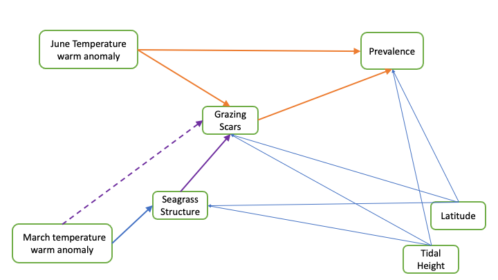
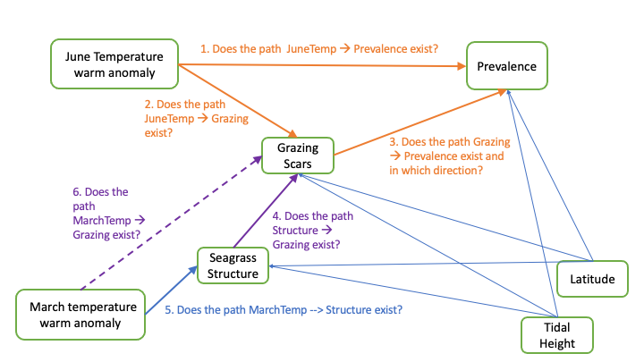
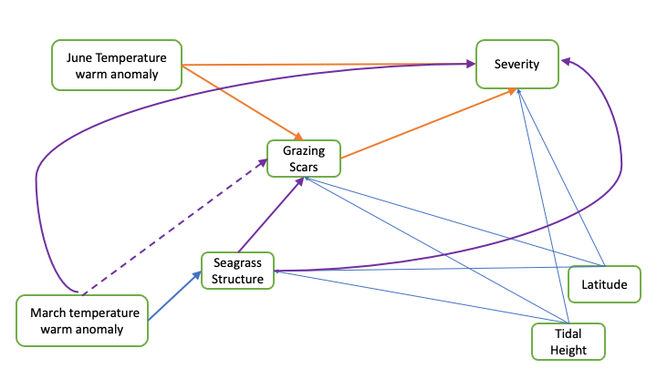
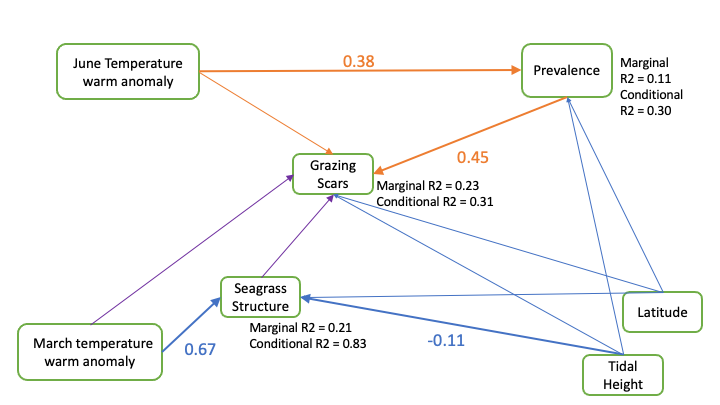
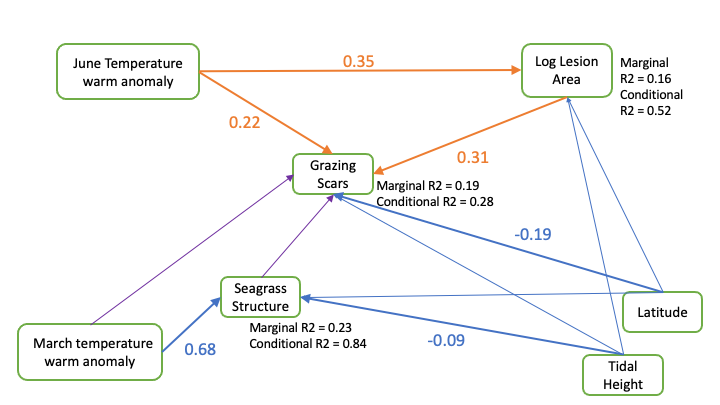
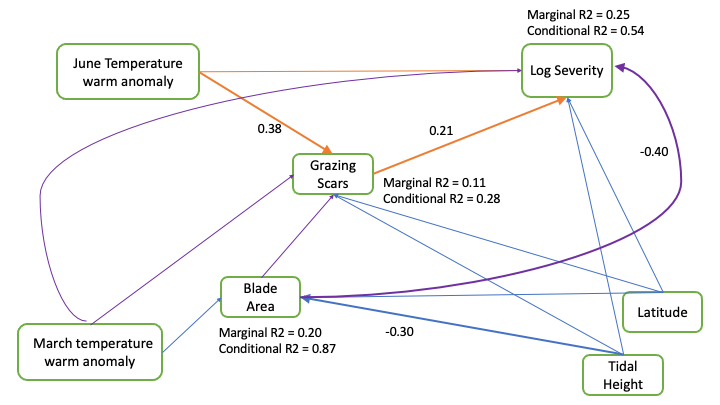
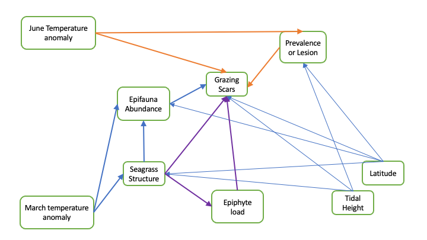

```{r setup, include=FALSE}
knitr::opts_chunk$set(echo = FALSE, message = FALSE, warning=FALSE)
# need these files because coefs() in stable piecewiseSEM() don't work with binomials
library(here)
source(here("R/helpers.R"), local = knitr::knit_global())
source(here("R/coefs.R"), local = knitr::knit_global())
# source("R/helpers.R", local = knitr::knit_global())
# source("R/coefs.R", local = knitr::knit_global())
library(piecewiseSEM)
library(readr)
library(dplyr)
library(ggplot2)
library(lme4)
library(nlme)
region_order=c("AK", "BC", "WA", "OR", "BB", "SD")
```

```{r data}
egwd <- read_csv("data/full_seagrass_epifauna_for_SEM.csv")
egwd1 <- subset(egwd, Year=="2019")
egwd1$TempAnomWarm_MarchMay <- egwd1$TempAnomWarm_March + egwd1$TempAnomWarm_April +egwd1$TempAnomWarm_May
egwd1 <- select(egwd1, c("PrevalenceMean", "GrazingScarsMeanTransect", "TempAnomWarm_June", "TempAnomWarm_March",
                         "TidalHeight", "Region", "Meadow", "TransectBeginDecimalLatitude", "TempAnomWarm_MarchMay",
                         "CountBlades", "StructureLog", "CountScars", "LesionAreaMean", "SeverityMean", "DensityShootsMean",
                         "BladeAreaMean", "EpiphytePerAreaMean", "CanopyHeight"))
egwd1 <- na.omit(egwd1)
egwd1$TidalHeightBinary <- ifelse(egwd1$TidalHeight=="L", 0, 1)
egwd1$Region <- ordered(egwd1$Region, levels=region_order)

egwd2 <- subset(egwd1, PrevalenceMean>0)
egwd2$LogLesionArea <- log10(egwd2$LesionAreaMean)
egwd2$LogSeverityMean <- log10(egwd2$SeverityMean)
```
This document walks through the analysis of grazing scars and eelgrass wasting disease. The analysis is in-progress, and this doc will be most useful for sharing and receiving feedback at the seagrass team meeting July 21.

## Background and SEM development

Through many conversations including at the project team meeting in May, we developed a proposed SEM network connecting grazing, temperature anomalies, seagrass structure, and disease metrics. The image shows the network with wasting disease prevalence as the disease metric.  

  

The arrows indicate hypothesized relationships, based on prior knowledge and analysis of the data. The arrows are lighter from Tidal Height and Latitude because I don't expect those metrics to be very important but they are part of the study design (Latitude is a continuous alternative to Region, because categorical predictors are more difficult to deal with in SEMs). The arrow from March temperature anomaly to Grazing Scars is dashed because the mechanism is not necessarily clear and may rely on a mediator (more on this later).  

The same figure is shown again below with text indicating the questions we can answer through SEM analysis. By comparing model sets with different paths, we can determine which network fits the data better and therefore which set of paths is best supported by the data.  

  
Similar SEMs can be prepared for severity and lesion area. For the severity SEM, an additional path likely exists from March temperature anomaly to Severity, and a path might exist from seagrass structure to severity (see below). Compared to the disease metrics of prevalence and lesion area, severity is influenced more strongly by the plant growth, so factors that are important to the seagrass (such as the temperatures in early spring) may be more important. The lesion area SEM network is comparable to the Prevalence network. 

  

### Data notes

Note this analysis is done with __2019 data only__ (note that grazing scar data exist for most sites in 2019 and 2021 only). This is for two reasons. First, the temperature record is most complete for 2019, and temperature anomalies are available throughout the study range. For 2021, comparable temperature anomaly records are not available for Bodega Bay (and several sites in San Diego). Relationships with temperature do change if BB is excluded. I haven't figured out how to solve this for 2021 yet, but we are working on it. Second, Prevalence data are most relevant for 2019, because this is when we first established the transects in continuous seagrass. In some areas, seagrass has been lost on the permanent transects, so Prevalence in 2021 is not as relevant. However, we can still run the SEMs for disease severity and lesion area in 2021, which may be less influenced by the loss of seagrass. 

Also note analysis is at the __transect__ scale (makes sense for epifauna and seagrass measurements).  

### Seagrass structure variable 

A key question has been what metric to use for the "seagrass structure" variable in the network. We measured a suite of metrics during the surveys that could relate to grazing and/or disease, including:  
- sheath length  
- canopy height  
- blade area  
- shoot density  

We chose not to use sheath length as it is strongly correlated with canopy height. Canopy height has the strongest correlation with some epifauna metrics (total epifauna biomass), and shoot density and blade area are correlated with disease metrics, particularly severity (correlations with prevalence are weaker). An idea from the May meeting was to create a new variable, "Seagrass Structure", as the product of canopy height and shoot density - sort of quasi-LAI or a measure of the amount of seagrass per unit area. This is an ecologically interesting metric, because it gives some idea of the habitat available for critters, and it also is a bit more comparable across regions, since shoot density varies by hundreds of shoots per m and canopy height by tens of centimeters. Seagrass structure (or the log of seagrass structure), was correlated with grazing scars, suggesting it might be a useful metric.

```{r structure_hist}
ggplot(egwd1, aes(x=StructureLog, fill=Region))+geom_histogram()+
  xlab("Seagrass structure (log of m seagrass per m2)")+
  ylab("Count")+
  labs(title = "Distribution of seagrass structure")+
  theme_bw(base_size = 14)+
  theme(panel.grid = element_blank())
```

### Temperature metrics

Prior analysis (L&O paper) showed the warm anomaly in June was the best temperature predictor of disease metrics in 2019. Pair plots confirmed a correlation between the June anomaly and grazing scars, so it is reasonable to use June anomaly as a predictor. Using systemic exploration in the `climwin` package, I found that temperature anomalies from March and May influenced seagrass structure, and using pair plots, grazing scars were correlated with the March anomaly. Therefore, I used the two temperature metrics from March and June as predictors in the SEM. Ecologically, it makes sense that June temps would influence prevalence and disease of the 3rd rank blade, as we sampled in July and the third rank blade was likely growing throughout June. Whereas the early spring temperatures might be important to seagrass status overall, based on the ability of plants to start growing earlier in the season, accumulate C reserves, etc.  

### Random effects

Prior analysis has shown that much of the site-specific variation needs to be explained by a random Meadow variable. Including Region (e.g. AK, WA, etc.) as a random effect typically does not improve the model. Region can be included as a fixed effect, but the pSEM framework does not work well with categorical variables with more than one level. After some tinkering, I chose to use Latitude as a continuous predictor that captures some of the Region variation. Using Latitude simplifies the model structure and allows it to converge (some issues otherwise). 

## Prevalence SEM {.tabset}

### Initial network 

Start by running a piecewise SEM for the network diagrammed above, with Prevalence as the disease response variable. The models include:  
- binomial GLMM for Prevalence as a function of Grazing, JuneTemp, TidalHeight, Latitude  
- binomial GLMM for Grazing as a function of JuneTemp, Seagrass Structure, TidalHeight, Latitude  
- linear model for Seagrass Structure, as a fuction of MarchTemp, TidalHeight, Latitude  

The code to set up this model and the summary of the output is as follows:  
```{r prev_sem1, echo=TRUE}
egwd.sem1 <- psem(
  glmer(PrevalenceMean ~ GrazingScarsMeanTransect + TempAnomWarm_June + TidalHeightBinary + TransectBeginDecimalLatitude + (1|Meadow),
        family="binomial",
        data=egwd1,
        weights=CountBlades),
  glmer(GrazingScarsMeanTransect ~ TempAnomWarm_June + TidalHeightBinary + StructureLog + TransectBeginDecimalLatitude + (1|Meadow),
        family="binomial",
        data=egwd1,
        weights=CountScars),
  lme(fixed = StructureLog ~ TempAnomWarm_March + TidalHeightBinary + TransectBeginDecimalLatitude,
       random = c(~1|Meadow),
       data=egwd1)
)
summary(egwd.sem1)
```
Output shows:  
- Global model fits the data well (passes Fisher's C test with p>0.05)  
- Tests of directed separation do not identify any missing paths that are significant  
- AIC of the initial network is 39.2

For now, ignore the coefficient estimates and p-values. Don't need to assess these until we determine which model paths are most relevant. To do this, we run alternative model sets to determine which paths best describe the data (as specified in the questions above).  

### Test alternate paths
<details>
<summary> Code and output of alternative model sets are below. Click to expand to see the details. Specific questions are answered as follows:   <br>
 1. Does the path JuneTemp --> Prevalence exist? Yes, a model set without this path has higher AIC (51) and the dSep tests indicate a significant missing path from JuneTemp to Prevalence  <br> 
 2. Does the path JuneTemp --> Grazing exist? Yes, a model without this path fails the global goodness of fit  <br>
 3. Does the path Grazing --> Prevalence exist and in which direction? Yes, a model without this path fails the global goodness of fit. Comparison of standardized coefficients indicates the path direction is from Prevalence to Grazing.  <br>
 4. Does the path Structure --> Grazing exist? No, a model without this path is equivalent by AIC to the initial model, and dSep does not indicate missing paths.  <br>
 5. Does the path MarchTemp --> Structure exist? Yes, a model without this path has higher AIC and dSep indicates missing paths  <br>
 6. Does the path MarchTemp --> Grazing exist? No, a model with this path added does not improve AIC or R2 for grazing.  <br>
</summary>

#### alternative model - remove the path from June temp to Prevalence
```{r prev_sem2}
# first alternative - remove the path from June temp to Prevalence - i.e. is the effect indirect?
egwd.sem2 <- psem(
  lme(fixed =StructureLog ~ TempAnomWarm_March + TidalHeightBinary + TransectBeginDecimalLatitude,
       random = c(~1|Meadow),
       data=egwd1),
  glmer(formula = GrazingScarsMeanTransect ~ TempAnomWarm_June + TidalHeightBinary + StructureLog + TransectBeginDecimalLatitude + (1|Meadow),
        family="binomial",
        data=egwd1,
        weights=CountScars),
  glmer(formula = PrevalenceMean ~ GrazingScarsMeanTransect + TidalHeightBinary + TransectBeginDecimalLatitude + (1|Meadow),
        family="binomial",
        data=egwd1,
        weights=CountBlades)
)
summary(egwd.sem2)
# does not represent data well, dSep suggests missing path of temperature on prevalence
```
Although this model passes the global goodness of fit test, the dSep test indicate missing significant path and the AIC is much greater (>10) than original model AIC.  

#### alternative model -  remove the path from grazing to prevalence

```{r prev_sem3}
# egwd.sem3 <- psem(
#   lme(fixed = StructureLog ~ TempAnomWarm_March + TidalHeightBinary + TransectBeginDecimalLatitude,
#       random = c(~1|Meadow),
#       data=egwd1),
#   glmer(PrevalenceMean ~ TempAnomWarm_June + TidalHeightBinary + TransectBeginDecimalLatitude + (1|Meadow),
#         family="binomial",
#         data=egwd1,
#         weights=CountBlades),
#   glmer(GrazingScarsMeanTransect ~ TempAnomWarm_June + TidalHeightBinary + StructureLog + TransectBeginDecimalLatitude + (1|Meadow),
#         family="binomial",
#         data=egwd1,
#         weights=CountScars)
#   )
# summary(egwd.sem3, conserve=TRUE)
# note, sometimes I get an error running this, and I have no idea why. The error says no applicable method for 'family' applied to object of class "lme" but this is demonstrably false... can't quite figure out how to fix this from package documentation
```

This model does not pass the global goodness of fit test and dSep indicates missing significant path.  

#### alternative model - remove path from JuneTemp to grazing

```{r prev_sem4}
egwd.sem4 <- psem(
  lme(fixed =StructureLog ~ TempAnomWarm_March + TidalHeightBinary + TransectBeginDecimalLatitude,
       random = c(~1|Meadow),
       data=egwd1),
  glmer(PrevalenceMean ~ GrazingScarsMeanTransect + TempAnomWarm_June + TidalHeightBinary + TransectBeginDecimalLatitude + (1|Meadow),
        family="binomial",
        data=egwd1,
        weights=CountBlades),
  glmer(GrazingScarsMeanTransect ~ TidalHeightBinary + StructureLog + TransectBeginDecimalLatitude + (1|Meadow),
        family="binomial",
        data=egwd1,
        weights=CountScars)
)

summary(egwd.sem4)
```
This model does not pass the global goodness of fit test and dSep indicates missing significant path.  

#### alternative model - reverse direction of Prev Grazing relationship

```{r prev_sem5}
egwd.sem5 <- psem(
  # lme(fixed =StructureLog ~ TempAnomWarm_March + TidalHeightBinary + TransectBeginDecimalLatitude,
  #      random = c(~1|Meadow),
  #      data=egwd1),
  lmer(formula =StructureLog ~ TempAnomWarm_March + TidalHeightBinary + TransectBeginDecimalLatitude + (1|Meadow),
       data=egwd1),
  glmer(formula = PrevalenceMean ~ TempAnomWarm_June + TidalHeightBinary + TransectBeginDecimalLatitude + (1|Meadow),
        data = egwd1, family ="binomial", weights = CountBlades),
  glmer(formula = GrazingScarsMeanTransect ~ PrevalenceMean + TempAnomWarm_June + TidalHeightBinary + StructureLog + TransectBeginDecimalLatitude + (1|Meadow),
        family="binomial",
        data=egwd1,
        weights = CountScars)
)

# summary(egwd.sem5, conserve = TRUE)
# same error as above for sem3 but sometimes it runs...
```
This model passes global goodness of fit and has no missing paths (dSep). AIC is equivalent to the initial model (40.1 vs 39.2), because the only difference is the direction of the path. To better compare these two alternative models, we can look at the coefficients. Need to standardize to get the relative strength of each path. 

```{r}
# coefs(egwd.sem1)
# coefs(egwd.sem5)
```


For prevalence as a function of grazing, the standardized coefficient is 0.24, i.e. for a 1 SD change in grazing, expect a 0.24 SD change in prevalence.  
For grazing as a function of prevalence, the standardized coefficient is 0.45, i.e. for a 1 SD change in prevalence, expect a 0.45 SD change in grazing.  

This indicates that the path should run __from prevalence to grazing__.  

#### alternative model - remove paths from JuneTemp (i.e. grazing and prevalence are related but not to temperature)  

```{r prev_sem6}
egwd.sem6 <- psem(
  glmer(PrevalenceMean ~ GrazingScarsMeanTransect + TidalHeightBinary + TransectBeginDecimalLatitude + (1|Meadow),
        family="binomial",
        data=egwd1,
        weights=CountBlades),
  glmer(GrazingScarsMeanTransect ~ TidalHeightBinary + StructureLog + TransectBeginDecimalLatitude + (1|Meadow),
        family="binomial",
        data=egwd1,
        weights=CountScars),
  lme(fixed = StructureLog ~ TempAnomWarm_March + TidalHeightBinary + TransectBeginDecimalLatitude,
      random = c(~1|Meadow),
      data=egwd1),
  TempAnomWarm_June ~ 1
)
summary(egwd.sem6)
```

This model fails the goodness of fit test and dSep tests indicate missing significant paths.

#### alternative model - remove path from Structure to Grazing  

```{r prev_sem7}
# egwd.sem7 <- psem(
#   glmer(PrevalenceMean ~ TempAnomWarm_June + TidalHeightBinary + TransectBeginDecimalLatitude + (1|Meadow),
#         family="binomial",
#         data=egwd1,
#         weights=CountBlades),
#   glmer(GrazingScarsMeanTransect ~ PrevalenceMean + TempAnomWarm_June + TidalHeightBinary + TransectBeginDecimalLatitude + (1|Meadow),
#         family="binomial",
#         data=egwd1,
#         weights=CountScars),
#   lme(fixed = StructureLog ~ TempAnomWarm_March + TidalHeightBinary + TransectBeginDecimalLatitude,
#       random = c(~1|Meadow),
#       data=egwd1)
# )
# 
# summary(egwd.sem7, conserve=TRUE)
```

This model passes the global goodness of fit, dSep tests do not indicate any missing paths. AIC is equivalent to the initial model (39.0). Doesn't seem that the path from struture to grazing needs to exist.  

#### alternative model - remove path from MarchTemp to Structure 

```{r prev_sem8}
egwd.sem8 <- psem(
  glmer(PrevalenceMean ~ GrazingScarsMeanTransect + TempAnomWarm_June + TidalHeightBinary + TransectBeginDecimalLatitude + (1|Meadow),
        family="binomial",
        data=egwd1,
        weights=CountBlades),
  glmer(GrazingScarsMeanTransect ~ TempAnomWarm_June + TidalHeightBinary + StructureLog + TransectBeginDecimalLatitude + (1|Meadow),
        family="binomial",
        data=egwd1,
        weights=CountScars),
    lme(fixed = StructureLog ~ TidalHeightBinary + TransectBeginDecimalLatitude,
      random = c(~1|Meadow),
      data=egwd1),
  TempAnomWarm_March ~ 1
)

summary(egwd.sem8)
# passes global goodness of fit test, but AIC is higher (46.5) and dSep indicates the missing path from March Temp to Structure
```

This model passes global goodness of fit test, but AIC is higher (46.5) and dSep indicates the missing path from March Temp to Structure

#### alternative model - add path from March Temp to Grazing

```{r prev_sem9}
egwd.sem9 <- psem(
  glmer(PrevalenceMean ~ GrazingScarsMeanTransect + TempAnomWarm_June + TidalHeightBinary + TransectBeginDecimalLatitude + (1|Meadow),
        family="binomial",
        data=egwd1,
        weights=CountBlades),
  glmer(GrazingScarsMeanTransect ~ TempAnomWarm_March + TempAnomWarm_June + TidalHeightBinary + StructureLog + TransectBeginDecimalLatitude + (1|Meadow),
        family="binomial",
        data=egwd1,
        weights=CountScars),
  lme(fixed = StructureLog ~ TempAnomWarm_March + TidalHeightBinary + TransectBeginDecimalLatitude,
      random = c(~1|Meadow),
      data=egwd1)
)

summary(egwd.sem9)
```

This model passes global test, but March temp to grazing path is not significant, R2 for grazing doesn't improve, and AIC is slightly higher than initial model (41.1 vs. 39.2). So it makes the model worse to include the path.  

</details>

### Updated network for prevalence

Based on model comparisons above, the best model for prevalence includes paths from JuneTemp to grazing and prevalence, and does not have a seagrass structure path to grazing (or prevalence). The direction of the grazing prevalence path is from prevalence to grazing - i.e. transects that are more diseased experience more grazing. This may indicate the preference for diseased tissue by amphipods (Olivia's work) and/or reduced plant resources to resist herbivory when diseased. And/or effects of microbiome changes?  

Standardized coefficients and R2 values for each variable are below.  

```{r prev_update}
prev_update <- psem(
  # lme(fixed =StructureLog ~ TempAnomWarm_March + TidalHeightBinary + TransectBeginDecimalLatitude,
  #      random = c(~1|Meadow),
  #      data=egwd1),
  lmer(formula =StructureLog ~ TempAnomWarm_March + TidalHeightBinary + TransectBeginDecimalLatitude + (1|Meadow),
       data=egwd1),
  glmer(formula = PrevalenceMean ~ TempAnomWarm_June + TidalHeightBinary + TransectBeginDecimalLatitude + (1|Meadow),
        data = egwd1, family ="binomial", weights = CountBlades),
  glmer(formula = GrazingScarsMeanTransect ~ PrevalenceMean + TempAnomWarm_June + TidalHeightBinary + StructureLog + TransectBeginDecimalLatitude + (1|Meadow),
        family="binomial",
        data=egwd1,
        weights = CountScars)
)
coefs(prev_update)
rsquared(prev_update)
# plot(prev_final)
# summary(prev_final, conserve = TRUE)
# same error as above for sem3 but sometimes it runs...
```

Marginal R2 show that we can explain 22% of variation in Grazing with Prevalence as the only significant predictor and 11% of variation in Prevalence using JuneTempAnom. High conditional R2 of Structure indicates the importance of Meadow (random effect) for seagrass condition.  



This network is vaguely unsatisfying, partially because the path from seagrass structure to grazing was not significant, so we aren't really connecting the different parts of the network. I think it might be useful to consider expanding the network to include epifauna biomass, which is more strongly correlated with seagrass parameters (i.e. canopy height) and is also correlated with grazing scars. If the seagrass habitat influences epifauna biomass, which also incluences grazing, we can start to see how the whole network connects.   

If this result holds up, that Prevalence causes Grazing rather than the other way around, that's pretty interesting.  However, we need to compare with networks for other disease variables (Severity and Lesion Area) and also to test the other year(s) of data. 

### Next steps

- Try a more complex model, including epifauna biomass as well as grazing scars to try to connect with seagrass parameters.  
- Model 2021 data and see if the path direction holds up (however caveats are missing Bodega temps and Prevalence becomes less meaningful)  
- Build a 3-y model for WA sites only to see if path direction holds up (caveat about Prevalence)  

## Lesion Area

### Intial network
```{r les_sem1}
les_sem1 <- psem(
  lmer(LogLesionArea ~ TempAnomWarm_June + TempAnomWarm_March + GrazingScarsMeanTransect + StructureLog + 
         TidalHeightBinary + TransectBeginDecimalLatitude + (1|Meadow),
       data=egwd2),
  glmer(GrazingScarsMeanTransect ~ TempAnomWarm_June + StructureLog + 
          TidalHeightBinary + TransectBeginDecimalLatitude + (1|Meadow),
        data=egwd2,
        family="binomial", 
        weights=CountScars),
  lme(fixed = StructureLog ~ TempAnomWarm_March + TidalHeightBinary + TransectBeginDecimalLatitude,
      random = c(~1|Meadow),
      data=egwd2)
)

summary(les_sem1)
```
This model passes global goodness of fit, no missing significant paths in dSep. AIC is 42.9 

### Test alternate paths

<details>

<summary>

</summary>

#### alternative model - remove path from JuneTemp to Lesion Area

```{r les_sem2}
les_sem2 <- psem(
  lmer(LogLesionArea ~  TempAnomWarm_March + GrazingScarsMeanTransect + StructureLog + 
         TidalHeightBinary + TransectBeginDecimalLatitude + (1|Meadow),
       data=egwd2),
  glmer(GrazingScarsMeanTransect ~ TempAnomWarm_June + StructureLog + 
          TidalHeightBinary + TransectBeginDecimalLatitude + (1|Meadow),
        data=egwd2,
        family="binomial", 
        weights=CountScars),
  lme(fixed = StructureLog ~ TempAnomWarm_March + TidalHeightBinary + TransectBeginDecimalLatitude,
      random = c(~1|Meadow),
      data=egwd2)
)

summary(les_sem2)
```

Passes global fit test. AIC is 45.3 (comparable to initial). dSep does not indicate that LesionArea to JuneTemp is a significant path, although R2 is slightly lower for Lesion Area. Suggest this path is not significant.  

#### alternative model - remove path from Grazing to Lesion Area

```{r les_sem3}
les_sem3 <- psem(
  lmer(LogLesionArea ~ TempAnomWarm_June + TempAnomWarm_March + StructureLog + 
         TidalHeightBinary + TransectBeginDecimalLatitude + (1|Meadow),
       data=egwd2),
  glmer(GrazingScarsMeanTransect ~ TempAnomWarm_June + StructureLog + 
          TidalHeightBinary + TransectBeginDecimalLatitude + (1|Meadow),
        data=egwd2,
        family="binomial", 
        weights=CountScars),
  lme(fixed = StructureLog ~ TempAnomWarm_March + TidalHeightBinary + TransectBeginDecimalLatitude,
      random = c(~1|Meadow),
      data=egwd2)
)

summary(les_sem3)
```

Fails global test. dSep indicates Grazing to Lesion Area path is significant.  


#### alternative model - remove path from JuneTemp to Grazing

```{r les_sem4}
les_sem4 <- psem(
  lmer(LogLesionArea ~ TempAnomWarm_June + TempAnomWarm_March + GrazingScarsMeanTransect + StructureLog + 
         TidalHeightBinary + TransectBeginDecimalLatitude + (1|Meadow),
       data=egwd2),
  glmer(GrazingScarsMeanTransect ~ StructureLog + 
          TidalHeightBinary + TransectBeginDecimalLatitude + (1|Meadow),
        data=egwd2,
        family="binomial", 
        weights=CountScars),
  lme(fixed = StructureLog ~ TempAnomWarm_March + TidalHeightBinary + TransectBeginDecimalLatitude,
      random = c(~1|Meadow),
      data=egwd2)
)

summary(les_sem4)
```

Fails global test, dSep indicates Grazing to JuneTemp path is significant.  

#### alternative model - reverse direction of Grazing-Lesion Area path
```{r les_sem5}
les_sem5 <- psem(
  lmer(LogLesionArea ~ TempAnomWarm_June + TempAnomWarm_March + StructureLog + 
         TidalHeightBinary + TransectBeginDecimalLatitude + (1|Meadow),
       data=egwd2),
  glmer(GrazingScarsMeanTransect ~ LogLesionArea + TempAnomWarm_June + StructureLog + 
          TidalHeightBinary + TransectBeginDecimalLatitude + (1|Meadow),
        data=egwd2,
        family="binomial", 
        weights=CountScars),
  lme(fixed = StructureLog ~ TempAnomWarm_March + TidalHeightBinary + TransectBeginDecimalLatitude,
      random = c(~1|Meadow),
      data=egwd2)
)

summary(les_sem5)
```

Passes global test. AIC is 44.1 (slightly higher than the initial of 42.9, but deltaAIC is less than 2). Standardized coefficients are equivalent (0.33 for Lesion as a function of Grazing and 0.32 for Grazing as a function of Lesion). R2 values for Lesion Area as a function of Prevalence is higher than for Prevalence as a function of Lesion Area. This supports the same pattern as with Prevalence (?).    

```{r}
# coefs(les_sem1)
# coefs(les_sem5)
anova(les_sem1, les_sem5)
```

#### alternative model - remove both paths from JuneTemp

```{r les_sem6}
les_sem6 <- psem(
  lmer(LogLesionArea ~ TempAnomWarm_March + GrazingScarsMeanTransect + StructureLog + 
         TidalHeightBinary + TransectBeginDecimalLatitude + (1|Meadow),
       data=egwd2),
  glmer(GrazingScarsMeanTransect ~ StructureLog + 
          TidalHeightBinary + TransectBeginDecimalLatitude + (1|Meadow),
        data=egwd2,
        family="binomial", 
        weights=CountScars),
  lme(fixed = StructureLog ~ TempAnomWarm_March + TidalHeightBinary + TransectBeginDecimalLatitude,
      random = c(~1|Meadow),
      data=egwd2),
  TempAnomWarm_June ~ 1
)

summary(les_sem6)
```

Fails global test and dSep indicates Grazing to JuneTemp is significant. 

#### alternative model - remove path from Structure to Grazing

```{r les_sem7}
les_sem7 <- psem(
  lmer(LogLesionArea ~ TempAnomWarm_June + TempAnomWarm_March + GrazingScarsMeanTransect + StructureLog + 
         TidalHeightBinary + TransectBeginDecimalLatitude + (1|Meadow),
       data=egwd2),
  glmer(GrazingScarsMeanTransect ~ TempAnomWarm_June + 
          TidalHeightBinary + TransectBeginDecimalLatitude + (1|Meadow),
        data=egwd2,
        family="binomial", 
        weights=CountScars),
  lme(fixed = StructureLog ~ TempAnomWarm_March + TidalHeightBinary + TransectBeginDecimalLatitude,
      random = c(~1|Meadow),
      data=egwd2)
)

summary(les_sem7, conserve=TRUE)
```

Passes goodness of fit test, no significant paths missing in dSep. AIC is 43 (comparable to initial). R2 values are similar. Can loose the Structure to Grazing path.  

#### alternative model - remove path from March Temp to Structure 

```{r les_sem8}
les_sem8 <- psem(
  lmer(LogLesionArea ~ TempAnomWarm_June + TempAnomWarm_March + GrazingScarsMeanTransect + StructureLog + 
         TidalHeightBinary + TransectBeginDecimalLatitude + (1|Meadow),
       data=egwd2),
  glmer(GrazingScarsMeanTransect ~ TempAnomWarm_June + StructureLog + 
          TidalHeightBinary + TransectBeginDecimalLatitude + (1|Meadow),
        data=egwd2,
        family="binomial", 
        weights=CountScars),
  lme(fixed = StructureLog ~ TidalHeightBinary + TransectBeginDecimalLatitude,
      random = c(~1|Meadow),
      data=egwd2)
)

summary(les_sem8)
```

Passes global fit test but AIC is higher (50) and dSep indicates MarchTemp to Structure is significant. Keep this path.  

#### alternative model - add path from March Temp to Grazing

```{r les_sem9}
les_sem9 <- psem(
  lmer(LogLesionArea ~ TempAnomWarm_June + TempAnomWarm_March + GrazingScarsMeanTransect + StructureLog + 
         TidalHeightBinary + TransectBeginDecimalLatitude + (1|Meadow),
       data=egwd2),
  glmer(GrazingScarsMeanTransect ~ TempAnomWarm_June + TempAnomWarm_March + StructureLog + 
          TidalHeightBinary + TransectBeginDecimalLatitude + (1|Meadow),
        data=egwd2,
        family="binomial", 
        weights=CountScars),
  lme(fixed = StructureLog ~ TempAnomWarm_March + TidalHeightBinary + TransectBeginDecimalLatitude,
      random = c(~1|Meadow),
      data=egwd2)
)

summary(les_sem9)
```

Passes global fit test. AIC is 44.7 - equivalent to initial. R2 values are all the same. Don't keep this path.  

#### alternative model - Lesion Area and Grazing are correlated errors

```{r les_sem10}
les_sem10 <- psem(
  lmer(LogLesionArea ~ TempAnomWarm_June + TempAnomWarm_March + StructureLog + 
         TidalHeightBinary + TransectBeginDecimalLatitude + (1|Meadow),
       data=egwd2),
  glmer(GrazingScarsMeanTransect ~ TempAnomWarm_June + StructureLog + 
          TidalHeightBinary + TransectBeginDecimalLatitude + (1|Meadow),
        data=egwd2,
        family="binomial", 
        weights=CountScars),
  LogLesionArea%~~%GrazingScarsMeanTransect,
  lme(fixed = StructureLog ~ TempAnomWarm_March + TidalHeightBinary + TransectBeginDecimalLatitude,
      random = c(~1|Meadow),
      data=egwd2)
)

summary(les_sem10)
```

AIC is 40.9. This is actually less than for the Lesion --> Grazing model. But, the R2 values are less? 0.16 for Lesion is the same (same predictors) and 0.11 for Grazing. So there is missing information if we do not have an actual path between Lesion and Grazing.  

</details>

### Updated network for lesion area

Overall, Lesion Area network gives the same patterns as the Prevalence network - path is from Lesion Area to Grazing, Seagrass Structure doesn't relate to Grazing or Lesion Area.  

```{r les_update}
les_update <- psem(
  lmer(LogLesionArea ~ TempAnomWarm_June + TempAnomWarm_March + StructureLog + 
         TidalHeightBinary + TransectBeginDecimalLatitude + (1|Meadow),
       data=egwd2),
  glmer(GrazingScarsMeanTransect ~ LogLesionArea + TempAnomWarm_June + StructureLog + 
          TidalHeightBinary + TransectBeginDecimalLatitude + (1|Meadow),
        data=egwd2,
        family="binomial", 
        weights=CountScars),
  lmer(StructureLog ~ TempAnomWarm_March + TidalHeightBinary + TransectBeginDecimalLatitude + (1|Meadow),
      data=egwd2)
  # lme(fixed = StructureLog ~ TempAnomWarm_March + TidalHeightBinary + TransectBeginDecimalLatitude,
  #     random = c(~1|Meadow),
  #     data=egwd2)
)

stdCoefs(les_update)
rsquared(les_update)
```


### Next steps

Same as for prevalence - try this with a more complex model? Not really satisfied at this point.  

## Severity

### Intial network

Use blade area instead of Structure for Severity. Blade area was a significant and strong predictor of Severity in prior work (L&O paper) and since the grazing-structure relationship hasn't come through in the other models, try blade area as a stronger relationship with Severity. 

```{r sev_sem1}
sev_sem1 <- psem(
  lmer(LogSeverityMean ~ TempAnomWarm_June + TempAnomWarm_March + GrazingScarsMeanTransect + BladeAreaMean + 
         TidalHeightBinary + TransectBeginDecimalLatitude + (1|Meadow),
       data=egwd2),
  glmer(GrazingScarsMeanTransect ~ TempAnomWarm_June + BladeAreaMean + 
          TidalHeightBinary + TransectBeginDecimalLatitude + (1|Meadow),
        data=egwd2,
        family="binomial", 
        weights=CountScars),
  lme(fixed = BladeAreaMean ~ TempAnomWarm_March + TidalHeightBinary + TransectBeginDecimalLatitude,
      random = c(~1|Meadow),
      data=egwd2)
)
  
summary(sev_sem1)
```

This model passes the global goodness of fit test and has AIC 44.7. 

### Test alternate paths
<details>

<summary>
Click to see model comparisons

</summary>

#### alternative model - remove path from JuneTemp to Severity

```{r sev_sem2}
sev_sem2 <- psem(
  lmer(LogSeverityMean ~ TempAnomWarm_March + GrazingScarsMeanTransect + BladeAreaMean + 
         TidalHeightBinary + TransectBeginDecimalLatitude + (1|Meadow),
       data=egwd2),
  glmer(GrazingScarsMeanTransect ~ TempAnomWarm_June + BladeAreaMean + 
          TidalHeightBinary + TransectBeginDecimalLatitude + (1|Meadow),
        data=egwd2,
        family="binomial", 
        weights=CountScars),
  lme(fixed = BladeAreaMean ~ TempAnomWarm_March + TidalHeightBinary + TransectBeginDecimalLatitude,
      random = c(~1|Meadow),
      data=egwd2)
)
  
summary(sev_sem2)
```

Passes global fit test. No significant paths missing. AIC 42.9. So support fo the JuneTemp to severity path is weak (as from prior modeling).  

#### alternative model - remove path from Grazing to Severity
```{r sev_sem3}
sev_sem3 <- psem(
  lmer(LogSeverityMean ~ TempAnomWarm_June + TempAnomWarm_March + BladeAreaMean + 
         TidalHeightBinary + TransectBeginDecimalLatitude + (1|Meadow),
       data=egwd2),
  glmer(GrazingScarsMeanTransect ~ TempAnomWarm_June + BladeAreaMean + 
          TidalHeightBinary + TransectBeginDecimalLatitude + (1|Meadow),
        data=egwd2,
        family="binomial", 
        weights=CountScars),
  lme(fixed = BladeAreaMean ~ TempAnomWarm_March + TidalHeightBinary + TransectBeginDecimalLatitude,
      random = c(~1|Meadow),
      data=egwd2)
)
  
summary(sev_sem3)
```

Does not pass global fit, dSep indicates Grazing to Severity is significant, AIC is 57 (increase>10)

#### alternative model - remove path from JuneTemp to Grazing

```{r sev_sem4}
sev_sem4 <- psem(
  lmer(LogSeverityMean ~ TempAnomWarm_June + TempAnomWarm_March + GrazingScarsMeanTransect + BladeAreaMean + 
         TidalHeightBinary + TransectBeginDecimalLatitude + (1|Meadow),
       data=egwd2),
  glmer(GrazingScarsMeanTransect ~ BladeAreaMean + 
          TidalHeightBinary + TransectBeginDecimalLatitude + (1|Meadow),
        data=egwd2,
        family="binomial", 
        weights=CountScars),
  lme(fixed = BladeAreaMean ~ TempAnomWarm_March + TidalHeightBinary + TransectBeginDecimalLatitude,
      random = c(~1|Meadow),
      data=egwd2)
)
  
summary(sev_sem4)
```

Does not pass global fit test, dSep calls for JuneTemp to Grazing path, AIC increases by >10 to 58  

#### alternative model - reverse direction of Grazing-Severity path

```{r sev_sem5}
sev_sem5 <- psem(
  lmer(LogSeverityMean ~ TempAnomWarm_June + TempAnomWarm_March + BladeAreaMean + 
         TidalHeightBinary + TransectBeginDecimalLatitude + (1|Meadow),
       data=egwd2),
  glmer(GrazingScarsMeanTransect ~ LogSeverityMean + TempAnomWarm_June + BladeAreaMean + 
          TidalHeightBinary + TransectBeginDecimalLatitude + (1|Meadow),
        data=egwd2,
        family="binomial", 
        weights=CountScars),
  lme(fixed = BladeAreaMean ~ TempAnomWarm_March + TidalHeightBinary + TransectBeginDecimalLatitude,
      random = c(~1|Meadow),
      data=egwd2)
)
  
summary(sev_sem5)
```

AIC is 44.5, same as initial. 

```{r}
sev_sem5.1 <- psem(
  lmer(LogSeverityMean ~ TempAnomWarm_June + TempAnomWarm_March + BladeAreaMean + 
         TidalHeightBinary + TransectBeginDecimalLatitude + (1|Meadow),
       data=egwd2),
  glmer(GrazingScarsMeanTransect ~ LogSeverityMean + TempAnomWarm_June + BladeAreaMean + 
          TidalHeightBinary + TransectBeginDecimalLatitude + (1|Meadow),
        data=egwd2,
        family="binomial", 
        weights=CountScars),
  lmer(BladeAreaMean ~ TempAnomWarm_March + TidalHeightBinary + TransectBeginDecimalLatitude + (1|Meadow),
      data=egwd2)
)

sev_sem1.1 <- psem(
  lmer(LogSeverityMean ~ TempAnomWarm_June + TempAnomWarm_March + GrazingScarsMeanTransect + BladeAreaMean + 
         TidalHeightBinary + TransectBeginDecimalLatitude + (1|Meadow),
       data=egwd2),
  glmer(GrazingScarsMeanTransect ~ TempAnomWarm_June + BladeAreaMean + 
          TidalHeightBinary + TransectBeginDecimalLatitude + (1|Meadow),
        data=egwd2,
        family="binomial", 
        weights=CountScars),
  lmer(BladeAreaMean ~ TempAnomWarm_March + TidalHeightBinary + TransectBeginDecimalLatitude + (1|Meadow),
      data=egwd2)
)
```

By R2, keep path from Grazing to Severity?

#### alternative model - remove both paths from JuneTemp
```{r sev_sem6}
sev_sem6 <- psem(
  lmer(LogSeverityMean ~ TempAnomWarm_March + GrazingScarsMeanTransect + BladeAreaMean + 
         TidalHeightBinary + TransectBeginDecimalLatitude + (1|Meadow),
       data=egwd2),
  glmer(GrazingScarsMeanTransect ~ BladeAreaMean + 
          TidalHeightBinary + TransectBeginDecimalLatitude + (1|Meadow),
        data=egwd2,
        family="binomial", 
        weights=CountScars),
  TempAnomWarm_June ~ 1, 
  lme(fixed = BladeAreaMean ~ TempAnomWarm_March + TidalHeightBinary + TransectBeginDecimalLatitude,
      random = c(~1|Meadow),
      data=egwd2)
)
  
summary(sev_sem6)
```

Does not pass global fit test, dSep needs path from JuneTemp to Grazing, AIC increases to 57.  

#### alternative model - remove path from Structure to Grazing
#### alternative model - remove path from March Temp to Grazing
#### alternative model - add path from March Temp to Grazing
### alternative model - Grazing and Severity are correlated errors 

```{r sev_sem10}
sev_sem10 <- psem(
  lmer(LogSeverityMean ~ TempAnomWarm_June + TempAnomWarm_March + BladeAreaMean + 
         TidalHeightBinary + TransectBeginDecimalLatitude + (1|Meadow),
       data=egwd2),
  glmer(GrazingScarsMeanTransect ~ TempAnomWarm_June + BladeAreaMean + 
          TidalHeightBinary + TransectBeginDecimalLatitude + (1|Meadow),
        data=egwd2,
        family="binomial", 
        weights=CountScars),
  GrazingScarsMeanTransect%~~%LogSeverityMean,
  lme(fixed = BladeAreaMean ~ TempAnomWarm_March + TidalHeightBinary + TransectBeginDecimalLatitude,
      random = c(~1|Meadow),
      data=egwd2)
)
  
summary(sev_sem10)
```

Same AIC and R2 as Severity to Grazing path - better R2 for Grazing to Severity

</details>

### Updated network for lesion area

So here we will keep the initial model, with path from Grazing to Severity



### Next steps
 -Same as for Prevalence and Lesion - use more complex model?  
 
## More complex model

Idea would be to try and connect grazing-disease with seagrass metrics. The connections exist through Severity, but it's not clear what the mechanism there would be. A possible more complex model:  

