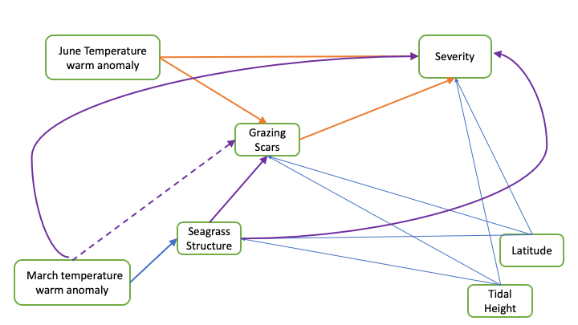

Grazing Scar SEM Analysis
================
Lillian Aoki
2022-07-19

-   <a href="#background-and-sem-development"
    id="toc-background-and-sem-development">Background and SEM
    development</a>
    -   <a href="#data-notes" id="toc-data-notes">Data notes</a>
    -   <a href="#seagrass-structure-variable"
        id="toc-seagrass-structure-variable">Seagrass structure variable</a>
    -   <a href="#temperature-metrics" id="toc-temperature-metrics">Temperature
        metrics</a>
    -   <a href="#random-effects" id="toc-random-effects">Random effects</a>
-   <a href="#prevalence-sem" id="toc-prevalence-sem">Prevalence SEM</a>
    -   <a href="#initial-network" id="toc-initial-network">Initial network</a>
    -   <a href="#test-alternate-paths" id="toc-test-alternate-paths">Test
        alternate paths</a>
    -   <a href="#updated-network-for-prevalence"
        id="toc-updated-network-for-prevalence">Updated network for
        prevalence</a>
    -   <a href="#next-steps" id="toc-next-steps">Next steps</a>
-   <a href="#lesion-area" id="toc-lesion-area">Lesion Area</a>
    -   <a href="#intial-network" id="toc-intial-network">Intial network</a>
    -   <a href="#test-alternate-paths-1" id="toc-test-alternate-paths-1">Test
        alternate paths</a>
    -   <a href="#updated-network-for-lesion-area"
        id="toc-updated-network-for-lesion-area">Updated network for lesion
        area</a>
    -   <a href="#next-steps-1" id="toc-next-steps-1">Next steps</a>
-   <a href="#severity" id="toc-severity">Severity</a>
    -   <a href="#intial-network-1" id="toc-intial-network-1">Intial network</a>
    -   <a href="#test-alternate-paths-2" id="toc-test-alternate-paths-2">Test
        alternate paths</a>
    -   <a
        href="#alternative-model---grazing-and-severity-are-correlated-errors"
        id="toc-alternative-model---grazing-and-severity-are-correlated-errors">alternative
        model - Grazing and Severity are correlated errors</a>
    -   <a href="#updated-network-for-lesion-area-1"
        id="toc-updated-network-for-lesion-area-1">Updated network for lesion
        area</a>
    -   <a href="#next-steps-2" id="toc-next-steps-2">Next steps</a>
-   <a href="#more-complex-model" id="toc-more-complex-model">More complex
    model</a>

This document walks through the analysis of grazing scars and eelgrass
wasting disease. The analysis is in-progress, and this doc will be most
useful for sharing and receiving feedback at the seagrass team meeting
July 21.

## Background and SEM development

Through many conversations including at the project team meeting in May,
we developed a proposed SEM network connecting grazing, temperature
anomalies, seagrass structure, and disease metrics. The image shows the
network with wasting disease prevalence as the disease metric.


The arrows indicate hypothesized relationships, based on prior knowledge
and analysis of the data. The arrows are lighter from Tidal Height and
Latitude because I don’t expect those metrics to be very important but
they are part of the study design (Latitude is a continuous alternative
to Region, because categorical predictors are more difficult to deal
with in SEMs). The arrow from March temperature anomaly to Grazing Scars
is dashed because the mechanism is not necessarily clear and may rely on
a mediator (more on this later).

The same figure is shown again below with text indicating the questions
we can answer through SEM analysis. By comparing model sets with
different paths, we can determine which network fits the data better and
therefore which set of paths is best supported by the data.

  
Similar SEMs can be prepared for severity and lesion area. For the
severity SEM, an additional path likely exists from March temperature
anomaly to Severity, and a path might exist from seagrass structure to
severity (see below). Compared to the disease metrics of prevalence and
lesion area, severity is influenced more strongly by the plant growth,
so factors that are important to the seagrass (such as the temperatures
in early spring) may be more important. The lesion area SEM network is
comparable to the Prevalence network.



### Data notes

Note this analysis is done with **2019 data only** (note that grazing
scar data exist for most sites in 2019 and 2021 only). This is for two
reasons. First, the temperature record is most complete for 2019, and
temperature anomalies are available throughout the study range. For
2021, comparable temperature anomaly records are not available for
Bodega Bay (and several sites in San Diego). Relationships with
temperature do change if BB is excluded. I haven’t figured out how to
solve this for 2021 yet, but we are working on it. Second, Prevalence
data are most relevant for 2019, because this is when we first
established the transects in continuous seagrass. In some areas,
seagrass has been lost on the permanent transects, so Prevalence in 2021
is not as relevant. However, we can still run the SEMs for disease
severity and lesion area in 2021, which may be less influenced by the
loss of seagrass.

Also note analysis is at the **transect** scale (makes sense for
epifauna and seagrass measurements).

### Seagrass structure variable

A key question has been what metric to use for the “seagrass structure”
variable in the network. We measured a suite of metrics during the
surveys that could relate to grazing and/or disease, including:  
- sheath length  
- canopy height  
- blade area  
- shoot density

We chose not to use sheath length as it is strongly correlated with
canopy height. Canopy height has the strongest correlation with some
epifauna metrics (total epifauna biomass), and shoot density and blade
area are correlated with disease metrics, particularly severity
(correlations with prevalence are weaker). An idea from the May meeting
was to create a new variable, “Seagrass Structure”, as the product of
canopy height and shoot density - sort of quasi-LAI or a measure of the
amount of seagrass per unit area. This is an ecologically interesting
metric, because it gives some idea of the habitat available for
critters, and it also is a bit more comparable across regions, since
shoot density varies by hundreds of shoots per m and canopy height by
tens of centimeters. Seagrass structure (or the log of seagrass
structure), was correlated with grazing scars, suggesting it might be a
useful metric.

<!-- -->

### Temperature metrics

Prior analysis (L&O paper) showed the warm anomaly in June was the best
temperature predictor of disease metrics in 2019. Pair plots confirmed a
correlation between the June anomaly and grazing scars, so it is
reasonable to use June anomaly as a predictor. Using systemic
exploration in the `climwin` package, I found that temperature anomalies
from March and May influenced seagrass structure, and using pair plots,
grazing scars were correlated with the March anomaly. Therefore, I used
the two temperature metrics from March and June as predictors in the
SEM. Ecologically, it makes sense that June temps would influence
prevalence and disease of the 3rd rank blade, as we sampled in July and
the third rank blade was likely growing throughout June. Whereas the
early spring temperatures might be important to seagrass status overall,
based on the ability of plants to start growing earlier in the season,
accumulate C reserves, etc.

### Random effects

Prior analysis has shown that much of the site-specific variation needs
to be explained by a random Meadow variable. Including Region (e.g. AK,
WA, etc.) as a random effect typically does not improve the model.
Region can be included as a fixed effect, but the pSEM framework does
not work well with categorical variables with more than one level. After
some tinkering, I chose to use Latitude as a continuous predictor that
captures some of the Region variation. Using Latitude simplifies the
model structure and allows it to converge (some issues otherwise).

## Prevalence SEM

### Initial network

Start by running a piecewise SEM for the network diagrammed above, with
Prevalence as the disease response variable. The models include:  
- binomial GLMM for Prevalence as a function of Grazing, JuneTemp,
TidalHeight, Latitude  
- binomial GLMM for Grazing as a function of JuneTemp, Seagrass
Structure, TidalHeight, Latitude  
- linear model for Seagrass Structure, as a fuction of MarchTemp,
TidalHeight, Latitude

The code to set up this model and the summary of the output is as
follows:

``` r
egwd.sem1 <- psem(
  glmer(PrevalenceMean ~ GrazingScarsMeanTransect + TempAnomWarm_June + TidalHeightBinary + TransectBeginDecimalLatitude + (1|Meadow),
        family="binomial",
        data=egwd1,
        weights=CountBlades),
  glmer(GrazingScarsMeanTransect ~ TempAnomWarm_June + TidalHeightBinary + StructureLog + TransectBeginDecimalLatitude + (1|Meadow),
        family="binomial",
        data=egwd1,
        weights=CountScars),
  lme(fixed = StructureLog ~ TempAnomWarm_March + TidalHeightBinary + TransectBeginDecimalLatitude,
       random = c(~1|Meadow),
       data=egwd1)
)
summary(egwd.sem1)
```

    ##   |                                                                              |                                                                      |   0%  |                                                                              |==================                                                    |  25%  |                                                                              |===================================                                   |  50%  |                                                                              |====================================================                  |  75%  |                                                                              |======================================================================| 100%

    ## 
    ## Structural Equation Model of egwd.sem1 
    ## 
    ## Call:
    ##   PrevalenceMean ~ GrazingScarsMeanTransect + TempAnomWarm_June + TidalHeightBinary + TransectBeginDecimalLatitude
    ##   GrazingScarsMeanTransect ~ TempAnomWarm_June + TidalHeightBinary + StructureLog + TransectBeginDecimalLatitude
    ##   StructureLog ~ TempAnomWarm_March + TidalHeightBinary + TransectBeginDecimalLatitude
    ## 
    ##     AIC      BIC
    ##  39.245   94.142
    ## 
    ## ---
    ## Tests of directed separation:
    ## 
    ##                                        Independ.Claim Test.Type  DF Crit.Value
    ##                StructureLog ~ TempAnomWarm_June + ...      coef  23    -0.5600
    ##   GrazingScarsMeanTransect ~ TempAnomWarm_March + ...      coef 156     0.0643
    ##             PrevalenceMean ~ TempAnomWarm_March + ...      coef 156     0.3868
    ##                   PrevalenceMean ~ StructureLog + ...      coef 156     0.6548
    ##   P.Value 
    ##    0.5809 
    ##    0.9487 
    ##    0.6989 
    ##    0.5126 
    ## 
    ## Global goodness-of-fit:
    ## 
    ##   Fisher's C = 3.245 with P-value = 0.918 and on 8 degrees of freedom
    ## 
    ## ---
    ## Coefficients:
    ## 
    ##                   Response                    Predictor Estimate Std.Error  DF
    ##             PrevalenceMean     GrazingScarsMeanTransect   1.5132    0.1781 156
    ##             PrevalenceMean            TempAnomWarm_June   0.0906    0.0272 156
    ##             PrevalenceMean            TidalHeightBinary   0.1051    0.0844 156
    ##             PrevalenceMean TransectBeginDecimalLatitude  -0.0009    0.0280 156
    ##   GrazingScarsMeanTransect            TempAnomWarm_June   0.1039    0.0313 156
    ##   GrazingScarsMeanTransect            TidalHeightBinary  -0.2572    0.1808 156
    ##   GrazingScarsMeanTransect                 StructureLog  -0.3114    0.3990 156
    ##   GrazingScarsMeanTransect TransectBeginDecimalLatitude  -0.0591    0.0337 156
    ##               StructureLog           TempAnomWarm_March   0.0615    0.0254  24
    ##               StructureLog            TidalHeightBinary  -0.0973    0.0312 128
    ##               StructureLog TransectBeginDecimalLatitude  -0.0188    0.0176 128
    ##   Crit.Value P.Value Std.Estimate    
    ##       8.4941  0.0000            - ***
    ##       3.3286  0.0009            - ***
    ##       1.2458  0.2128            -    
    ##      -0.0327  0.9739            -    
    ##       3.3183  0.0009            - ***
    ##      -1.4221  0.1550            -    
    ##      -0.7805  0.4351            -    
    ##      -1.7544  0.0794            -    
    ##       2.4219  0.0234       0.6651   *
    ##      -3.1212  0.0022      -0.1069  **
    ##      -1.0685  0.2873      -0.2935    
    ## 
    ##   Signif. codes:  0 '***' 0.001 '**' 0.01 '*' 0.05
    ## 
    ## ---
    ## Individual R-squared:
    ## 
    ##                   Response method Marginal Conditional
    ##             PrevalenceMean  delta     0.16        0.30
    ##   GrazingScarsMeanTransect  delta     0.11        0.26
    ##               StructureLog   none     0.21        0.83

Output shows:  
- Global model fits the data well (passes Fisher’s C test with
p\>0.05)  
- Tests of directed separation do not identify any missing paths that
are significant  
- AIC of the initial network is 39.2

For now, ignore the coefficient estimates and p-values. Don’t need to
assess these until we determine which model paths are most relevant. To
do this, we run alternative model sets to determine which paths best
describe the data (as specified in the questions above).

### Test alternate paths

<details>
<summary>
Code and output of alternative model sets are below. Click to expand to
see the details. Specific questions are answered as follows: <br> 1.
Does the path JuneTemp –\> Prevalence exist? Yes, a model set without
this path has higher AIC (51) and the dSep tests indicate a significant
missing path from JuneTemp to Prevalence <br> 2. Does the path JuneTemp
–\> Grazing exist? Yes, a model without this path fails the global
goodness of fit <br> 3. Does the path Grazing –\> Prevalence exist and
in which direction? Yes, a model without this path fails the global
goodness of fit. Comparison of standardized coefficients indicates the
path direction is from Prevalence to Grazing. <br> 4. Does the path
Structure –\> Grazing exist? No, a model without this path is equivalent
by AIC to the initial model, and dSep does not indicate missing paths.
<br> 5. Does the path MarchTemp –\> Structure exist? Yes, a model
without this path has higher AIC and dSep indicates missing paths <br>
6. Does the path MarchTemp –\> Grazing exist? No, a model with this path
added does not improve AIC or R2 for grazing. <br>
</summary>

#### alternative model - remove the path from June temp to Prevalence

    ##   |                                                                              |                                                                      |   0%  |                                                                              |==============                                                        |  20%  |                                                                              |============================                                          |  40%  |                                                                              |==========================================                            |  60%  |                                                                              |========================================================              |  80%  |                                                                              |======================================================================| 100%

    ## 
    ## Structural Equation Model of egwd.sem2 
    ## 
    ## Call:
    ##   StructureLog ~ TempAnomWarm_March + TidalHeightBinary + TransectBeginDecimalLatitude
    ##   GrazingScarsMeanTransect ~ TempAnomWarm_June + TidalHeightBinary + StructureLog + TransectBeginDecimalLatitude
    ##   PrevalenceMean ~ GrazingScarsMeanTransect + TidalHeightBinary + TransectBeginDecimalLatitude
    ## 
    ##     AIC      BIC
    ##  51.348   103.196
    ## 
    ## ---
    ## Tests of directed separation:
    ## 
    ##                                        Independ.Claim Test.Type  DF Crit.Value
    ##   GrazingScarsMeanTransect ~ TempAnomWarm_March + ...      coef 156     0.0643
    ##             PrevalenceMean ~ TempAnomWarm_March + ...      coef 156    -0.5508
    ##                StructureLog ~ TempAnomWarm_June + ...      coef  23    -0.5600
    ##              PrevalenceMean ~ TempAnomWarm_June + ...      coef 156     3.3286
    ##                   PrevalenceMean ~ StructureLog + ...      coef 156     0.5088
    ##   P.Value    
    ##    0.9487    
    ##    0.5818    
    ##    0.5809    
    ##    0.0009 ***
    ##    0.6109    
    ## 
    ## Global goodness-of-fit:
    ## 
    ##   Fisher's C = 17.348 with P-value = 0.067 and on 10 degrees of freedom
    ## 
    ## ---
    ## Coefficients:
    ## 
    ##                   Response                    Predictor Estimate Std.Error  DF
    ##               StructureLog           TempAnomWarm_March   0.0615    0.0254  24
    ##               StructureLog            TidalHeightBinary  -0.0973    0.0312 128
    ##               StructureLog TransectBeginDecimalLatitude  -0.0188    0.0176 128
    ##   GrazingScarsMeanTransect            TempAnomWarm_June   0.1039    0.0313 156
    ##   GrazingScarsMeanTransect            TidalHeightBinary  -0.2572    0.1808 156
    ##   GrazingScarsMeanTransect                 StructureLog  -0.3114    0.3990 156
    ##   GrazingScarsMeanTransect TransectBeginDecimalLatitude  -0.0591    0.0337 156
    ##             PrevalenceMean     GrazingScarsMeanTransect   1.5477    0.1800 156
    ##             PrevalenceMean            TidalHeightBinary   0.1074    0.0844 156
    ##             PrevalenceMean TransectBeginDecimalLatitude   0.0324    0.0313 156
    ##   Crit.Value P.Value Std.Estimate    
    ##       2.4219  0.0234       0.6651   *
    ##      -3.1212  0.0022      -0.1069  **
    ##      -1.0685  0.2873      -0.2935    
    ##       3.3183  0.0009            - ***
    ##      -1.4221  0.1550            -    
    ##      -0.7805  0.4351            -    
    ##      -1.7544  0.0794            -    
    ##       8.6008  0.0000            - ***
    ##       1.2729  0.2031            -    
    ##       1.0337  0.3013            -    
    ## 
    ##   Signif. codes:  0 '***' 0.001 '**' 0.01 '*' 0.05
    ## 
    ## ---
    ## Individual R-squared:
    ## 
    ##                   Response method Marginal Conditional
    ##               StructureLog   none     0.21        0.83
    ##   GrazingScarsMeanTransect  delta     0.11        0.26
    ##             PrevalenceMean  delta     0.05        0.27

Although this model passes the global goodness of fit test, the dSep
test indicate missing significant path and the AIC is much greater
(\>10) than original model AIC.

#### alternative model - remove the path from grazing to prevalence

This model does not pass the global goodness of fit test and dSep
indicates missing significant path.

#### alternative model - remove path from JuneTemp to grazing

    ##   |                                                                              |                                                                      |   0%  |                                                                              |==============                                                        |  20%  |                                                                              |============================                                          |  40%  |                                                                              |==========================================                            |  60%  |                                                                              |========================================================              |  80%  |                                                                              |======================================================================| 100%

    ## 
    ## Structural Equation Model of egwd.sem4 
    ## 
    ## Call:
    ##   StructureLog ~ TempAnomWarm_March + TidalHeightBinary + TransectBeginDecimalLatitude
    ##   PrevalenceMean ~ GrazingScarsMeanTransect + TempAnomWarm_June + TidalHeightBinary + TransectBeginDecimalLatitude
    ##   GrazingScarsMeanTransect ~ TidalHeightBinary + StructureLog + TransectBeginDecimalLatitude
    ## 
    ##     AIC      BIC
    ##  52.645   104.493
    ## 
    ## ---
    ## Tests of directed separation:
    ## 
    ##                                        Independ.Claim Test.Type  DF Crit.Value
    ##   GrazingScarsMeanTransect ~ TempAnomWarm_March + ...      coef 156    -0.7156
    ##             PrevalenceMean ~ TempAnomWarm_March + ...      coef 156     0.3868
    ##                StructureLog ~ TempAnomWarm_June + ...      coef  23    -0.5600
    ##    GrazingScarsMeanTransect ~ TempAnomWarm_June + ...      coef 156     3.3183
    ##                   PrevalenceMean ~ StructureLog + ...      coef 156     0.6548
    ##   P.Value    
    ##    0.4742    
    ##    0.6989    
    ##    0.5809    
    ##    0.0009 ***
    ##    0.5126    
    ## 
    ## Global goodness-of-fit:
    ## 
    ##   Fisher's C = 18.645 with P-value = 0.045 and on 10 degrees of freedom
    ## 
    ## ---
    ## Coefficients:
    ## 
    ##                   Response                    Predictor Estimate Std.Error  DF
    ##               StructureLog           TempAnomWarm_March   0.0615    0.0254  24
    ##               StructureLog            TidalHeightBinary  -0.0973    0.0312 128
    ##               StructureLog TransectBeginDecimalLatitude  -0.0188    0.0176 128
    ##             PrevalenceMean     GrazingScarsMeanTransect   1.5132    0.1781 156
    ##             PrevalenceMean            TempAnomWarm_June   0.0906    0.0272 156
    ##             PrevalenceMean            TidalHeightBinary   0.1051    0.0844 156
    ##             PrevalenceMean TransectBeginDecimalLatitude  -0.0009    0.0280 156
    ##   GrazingScarsMeanTransect            TidalHeightBinary  -0.2601    0.1818 156
    ##   GrazingScarsMeanTransect                 StructureLog  -0.3328    0.4422 156
    ##   GrazingScarsMeanTransect TransectBeginDecimalLatitude  -0.0357    0.0396 156
    ##   Crit.Value P.Value Std.Estimate    
    ##       2.4219  0.0234       0.6651   *
    ##      -3.1212  0.0022      -0.1069  **
    ##      -1.0685  0.2873      -0.2935    
    ##       8.4941  0.0000            - ***
    ##       3.3286  0.0009            - ***
    ##       1.2458  0.2128            -    
    ##      -0.0327  0.9739            -    
    ##      -1.4303  0.1526            -    
    ##      -0.7526  0.4517            -    
    ##      -0.9008  0.3677            -    
    ## 
    ##   Signif. codes:  0 '***' 0.001 '**' 0.01 '*' 0.05
    ## 
    ## ---
    ## Individual R-squared:
    ## 
    ##                   Response method Marginal Conditional
    ##               StructureLog   none     0.21        0.83
    ##             PrevalenceMean  delta     0.16        0.30
    ##   GrazingScarsMeanTransect  delta     0.02        0.28

This model does not pass the global goodness of fit test and dSep
indicates missing significant path.

#### alternative model - reverse direction of Prev Grazing relationship

This model passes global goodness of fit and has no missing paths
(dSep). AIC is equivalent to the initial model (40.1 vs 39.2), because
the only difference is the direction of the path. To better compare
these two alternative models, we can look at the coefficients. Need to
standardize to get the relative strength of each path.

For prevalence as a function of grazing, the standardized coefficient is
0.24, i.e. for a 1 SD change in grazing, expect a 0.24 SD change in
prevalence.  
For grazing as a function of prevalence, the standardized coefficient is
0.45, i.e. for a 1 SD change in prevalence, expect a 0.45 SD change in
grazing.

This indicates that the path should run **from prevalence to grazing**.

#### alternative model - remove paths from JuneTemp (i.e. grazing and prevalence are related but not to temperature)

    ##   |                                                                              |                                                                      |   0%  |                                                                              |============                                                          |  17%  |                                                                              |=======================                                               |  33%  |                                                                              |===================================                                   |  50%  |                                                                              |===============================================                       |  67%  |                                                                              |==========================================================            |  83%  |                                                                              |======================================================================| 100%

    ## 
    ## Structural Equation Model of egwd.sem6 
    ## 
    ## Call:
    ##   PrevalenceMean ~ GrazingScarsMeanTransect + TidalHeightBinary + TransectBeginDecimalLatitude
    ##   GrazingScarsMeanTransect ~ TidalHeightBinary + StructureLog + TransectBeginDecimalLatitude
    ##   StructureLog ~ TempAnomWarm_March + TidalHeightBinary + TransectBeginDecimalLatitude
    ##   TempAnomWarm_June ~ 1
    ## 
    ##     AIC      BIC
    ##  64.749   113.547
    ## 
    ## ---
    ## Tests of directed separation:
    ## 
    ##                                        Independ.Claim Test.Type  DF Crit.Value
    ##   GrazingScarsMeanTransect ~ TempAnomWarm_March + ...      coef 156    -0.7156
    ##             PrevalenceMean ~ TempAnomWarm_March + ...      coef 156    -0.5508
    ##                StructureLog ~ TempAnomWarm_June + ...      coef  23    -0.5600
    ##    GrazingScarsMeanTransect ~ TempAnomWarm_June + ...      coef 156     3.3183
    ##              PrevalenceMean ~ TempAnomWarm_June + ...      coef 156     3.3286
    ##                   PrevalenceMean ~ StructureLog + ...      coef 156     0.5088
    ##   P.Value    
    ##    0.4742    
    ##    0.5818    
    ##    0.5809    
    ##    0.0009 ***
    ##    0.0009 ***
    ##    0.6109    
    ## 
    ## Global goodness-of-fit:
    ## 
    ##   Fisher's C = 32.749 with P-value = 0.001 and on 12 degrees of freedom
    ## 
    ## ---
    ## Coefficients:
    ## 
    ##                   Response                    Predictor Estimate Std.Error  DF
    ##             PrevalenceMean     GrazingScarsMeanTransect   1.5477    0.1800 156
    ##             PrevalenceMean            TidalHeightBinary   0.1074    0.0844 156
    ##             PrevalenceMean TransectBeginDecimalLatitude   0.0324    0.0313 156
    ##   GrazingScarsMeanTransect            TidalHeightBinary  -0.2601    0.1818 156
    ##   GrazingScarsMeanTransect                 StructureLog  -0.3328    0.4422 156
    ##   GrazingScarsMeanTransect TransectBeginDecimalLatitude  -0.0357    0.0396 156
    ##               StructureLog           TempAnomWarm_March   0.0615    0.0254  24
    ##               StructureLog            TidalHeightBinary  -0.0973    0.0312 128
    ##               StructureLog TransectBeginDecimalLatitude  -0.0188    0.0176 128
    ##   Crit.Value P.Value Std.Estimate    
    ##       8.6008  0.0000            - ***
    ##       1.2729  0.2031            -    
    ##       1.0337  0.3013            -    
    ##      -1.4303  0.1526            -    
    ##      -0.7526  0.4517            -    
    ##      -0.9008  0.3677            -    
    ##       2.4219  0.0234       0.6651   *
    ##      -3.1212  0.0022      -0.1069  **
    ##      -1.0685  0.2873      -0.2935    
    ## 
    ##   Signif. codes:  0 '***' 0.001 '**' 0.01 '*' 0.05
    ## 
    ## ---
    ## Individual R-squared:
    ## 
    ##                   Response method Marginal Conditional
    ##             PrevalenceMean  delta     0.05        0.27
    ##   GrazingScarsMeanTransect  delta     0.02        0.28
    ##               StructureLog   none     0.21        0.83

This model fails the goodness of fit test and dSep tests indicate
missing significant paths.

#### alternative model - remove path from Structure to Grazing

This model passes the global goodness of fit, dSep tests do not indicate
any missing paths. AIC is equivalent to the initial model (39.0).
Doesn’t seem that the path from struture to grazing needs to exist.

#### alternative model - remove path from MarchTemp to Structure

    ##   |                                                                              |                                                                      |   0%  |                                                                              |==============                                                        |  20%  |                                                                              |============================                                          |  40%  |                                                                              |==========================================                            |  60%  |                                                                              |========================================================              |  80%  |                                                                              |======================================================================| 100%

    ## 
    ## Structural Equation Model of egwd.sem8 
    ## 
    ## Call:
    ##   PrevalenceMean ~ GrazingScarsMeanTransect + TempAnomWarm_June + TidalHeightBinary + TransectBeginDecimalLatitude
    ##   GrazingScarsMeanTransect ~ TempAnomWarm_June + TidalHeightBinary + StructureLog + TransectBeginDecimalLatitude
    ##   StructureLog ~ TidalHeightBinary + TransectBeginDecimalLatitude
    ##   TempAnomWarm_March ~ 1
    ## 
    ##     AIC      BIC
    ##  46.571   98.419
    ## 
    ## ---
    ## Tests of directed separation:
    ## 
    ##                                        Independ.Claim Test.Type  DF Crit.Value
    ##                StructureLog ~ TempAnomWarm_June + ...      coef  24    -1.1728
    ##               StructureLog ~ TempAnomWarm_March + ...      coef  24     2.4219
    ##   GrazingScarsMeanTransect ~ TempAnomWarm_March + ...      coef 156     0.0643
    ##             PrevalenceMean ~ TempAnomWarm_March + ...      coef 156     0.3868
    ##                   PrevalenceMean ~ StructureLog + ...      coef 156     0.7118
    ##   P.Value  
    ##    0.2524  
    ##    0.0234 *
    ##    0.9487  
    ##    0.6989  
    ##    0.4766  
    ## 
    ## Global goodness-of-fit:
    ## 
    ##   Fisher's C = 12.571 with P-value = 0.249 and on 10 degrees of freedom
    ## 
    ## ---
    ## Coefficients:
    ## 
    ##                   Response                    Predictor Estimate Std.Error  DF
    ##             PrevalenceMean     GrazingScarsMeanTransect   1.5132    0.1781 156
    ##             PrevalenceMean            TempAnomWarm_June   0.0906    0.0272 156
    ##             PrevalenceMean            TidalHeightBinary   0.1051    0.0844 156
    ##             PrevalenceMean TransectBeginDecimalLatitude  -0.0009    0.0280 156
    ##   GrazingScarsMeanTransect            TempAnomWarm_June   0.1039    0.0313 156
    ##   GrazingScarsMeanTransect            TidalHeightBinary  -0.2572    0.1808 156
    ##   GrazingScarsMeanTransect                 StructureLog  -0.3114    0.3990 156
    ##   GrazingScarsMeanTransect TransectBeginDecimalLatitude  -0.0591    0.0337 156
    ##               StructureLog            TidalHeightBinary  -0.0973    0.0312 128
    ##               StructureLog TransectBeginDecimalLatitude   0.0153    0.0116 128
    ##   Crit.Value P.Value Std.Estimate    
    ##       8.4941  0.0000            - ***
    ##       3.3286  0.0009            - ***
    ##       1.2458  0.2128            -    
    ##      -0.0327  0.9739            -    
    ##       3.3183  0.0009            - ***
    ##      -1.4221  0.1550            -    
    ##      -0.7805  0.4351            -    
    ##      -1.7544  0.0794            -    
    ##      -3.1212  0.0022      -0.1069  **
    ##       1.3280  0.1865       0.2394    
    ## 
    ##   Signif. codes:  0 '***' 0.001 '**' 0.01 '*' 0.05
    ## 
    ## ---
    ## Individual R-squared:
    ## 
    ##                   Response method Marginal Conditional
    ##             PrevalenceMean  delta     0.16        0.30
    ##   GrazingScarsMeanTransect  delta     0.11        0.26
    ##               StructureLog   none     0.06        0.83

This model passes global goodness of fit test, but AIC is higher (46.5)
and dSep indicates the missing path from March Temp to Structure

#### alternative model - add path from March Temp to Grazing

    ##   |                                                                              |                                                                      |   0%  |                                                                              |=======================                                               |  33%  |                                                                              |===============================================                       |  67%  |                                                                              |======================================================================| 100%

    ## 
    ## Structural Equation Model of egwd.sem9 
    ## 
    ## Call:
    ##   PrevalenceMean ~ GrazingScarsMeanTransect + TempAnomWarm_June + TidalHeightBinary + TransectBeginDecimalLatitude
    ##   GrazingScarsMeanTransect ~ TempAnomWarm_March + TempAnomWarm_June + TidalHeightBinary + StructureLog + TransectBeginDecimalLatitude
    ##   StructureLog ~ TempAnomWarm_March + TidalHeightBinary + TransectBeginDecimalLatitude
    ## 
    ##     AIC      BIC
    ##  41.139   99.086
    ## 
    ## ---
    ## Tests of directed separation:
    ## 
    ##                              Independ.Claim Test.Type  DF Crit.Value P.Value 
    ##      StructureLog ~ TempAnomWarm_June + ...      coef  23    -0.5600  0.5809 
    ##   PrevalenceMean ~ TempAnomWarm_March + ...      coef 156     0.3868  0.6989 
    ##         PrevalenceMean ~ StructureLog + ...      coef 156     0.6548  0.5126 
    ## 
    ## Global goodness-of-fit:
    ## 
    ##   Fisher's C = 3.139 with P-value = 0.791 and on 6 degrees of freedom
    ## 
    ## ---
    ## Coefficients:
    ## 
    ##                   Response                    Predictor Estimate Std.Error  DF
    ##             PrevalenceMean     GrazingScarsMeanTransect   1.5132    0.1781 156
    ##             PrevalenceMean            TempAnomWarm_June   0.0906    0.0272 156
    ##             PrevalenceMean            TidalHeightBinary   0.1051    0.0844 156
    ##             PrevalenceMean TransectBeginDecimalLatitude  -0.0009    0.0280 156
    ##   GrazingScarsMeanTransect           TempAnomWarm_March   0.0050    0.0775 156
    ##   GrazingScarsMeanTransect            TempAnomWarm_June   0.1044    0.0323 156
    ##   GrazingScarsMeanTransect            TidalHeightBinary  -0.2580    0.1813 156
    ##   GrazingScarsMeanTransect                 StructureLog  -0.3198    0.4197 156
    ##   GrazingScarsMeanTransect TransectBeginDecimalLatitude  -0.0620    0.0565 156
    ##               StructureLog           TempAnomWarm_March   0.0615    0.0254  24
    ##               StructureLog            TidalHeightBinary  -0.0973    0.0312 128
    ##               StructureLog TransectBeginDecimalLatitude  -0.0188    0.0176 128
    ##   Crit.Value P.Value Std.Estimate    
    ##       8.4941  0.0000            - ***
    ##       3.3286  0.0009            - ***
    ##       1.2458  0.2128            -    
    ##      -0.0327  0.9739            -    
    ##       0.0643  0.9487            -    
    ##       3.2294  0.0012            -  **
    ##      -1.4230  0.1547            -    
    ##      -0.7620  0.4461            -    
    ##      -1.0978  0.2723            -    
    ##       2.4219  0.0234       0.6651   *
    ##      -3.1212  0.0022      -0.1069  **
    ##      -1.0685  0.2873      -0.2935    
    ## 
    ##   Signif. codes:  0 '***' 0.001 '**' 0.01 '*' 0.05
    ## 
    ## ---
    ## Individual R-squared:
    ## 
    ##                   Response method Marginal Conditional
    ##             PrevalenceMean  delta     0.16        0.30
    ##   GrazingScarsMeanTransect  delta     0.11        0.26
    ##               StructureLog   none     0.21        0.83

This model passes global test, but March temp to grazing path is not
significant, R2 for grazing doesn’t improve, and AIC is slightly higher
than initial model (41.1 vs. 39.2). So it makes the model worse to
include the path.

</details>

### Updated network for prevalence

Based on model comparisons above, the best model for prevalence includes
paths from JuneTemp to grazing and prevalence, and does not have a
seagrass structure path to grazing (or prevalence). The direction of the
grazing prevalence path is from prevalence to grazing - i.e. transects
that are more diseased experience more grazing. This may indicate the
preference for diseased tissue by amphipods (Olivia’s work) and/or
reduced plant resources to resist herbivory when diseased. And/or
effects of microbiome changes?

Standardized coefficients and R2 values for each variable are below.

    ##                    Response                    Predictor Estimate Std.Error  DF
    ## 1              StructureLog           TempAnomWarm_March   0.0615    0.0254  23
    ## 2              StructureLog            TidalHeightBinary  -0.0973    0.0312 129
    ## 3              StructureLog TransectBeginDecimalLatitude  -0.0188    0.0176  23
    ## 4            PrevalenceMean            TempAnomWarm_June   0.1155    0.0307 156
    ## 5            PrevalenceMean            TidalHeightBinary   0.0487    0.0828 156
    ## 6            PrevalenceMean TransectBeginDecimalLatitude  -0.0267    0.0316 156
    ## 7  GrazingScarsMeanTransect               PrevalenceMean   3.4467    0.5083 156
    ## 8  GrazingScarsMeanTransect            TempAnomWarm_June   0.0278    0.0280 156
    ## 9  GrazingScarsMeanTransect            TidalHeightBinary  -0.3230    0.1880 156
    ## 10 GrazingScarsMeanTransect                 StructureLog  -0.6004    0.3680 156
    ## 11 GrazingScarsMeanTransect TransectBeginDecimalLatitude  -0.0352    0.0282 156
    ##    Crit.Value P.Value Std.Estimate    
    ## 1      5.8655  0.0237       0.6651   *
    ## 2      9.7419  0.0022      -0.1069  **
    ## 3      1.1418  0.2964      -0.2935    
    ## 4      3.7588  0.0002       0.3853 ***
    ## 5      0.5888  0.5560       0.0110    
    ## 6     -0.8436  0.3989      -0.0854    
    ## 7      6.7810  0.0000       0.4498 ***
    ## 8      0.9902  0.3221       0.0918    
    ## 9     -1.7183  0.0857      -0.0722    
    ## 10    -1.6314  0.1028      -0.1220    
    ## 11    -1.2478  0.2121      -0.1118

    ##                   Response   family     link method  Marginal Conditional
    ## 1             StructureLog gaussian identity   none 0.2110180   0.8310955
    ## 2           PrevalenceMean binomial    logit  delta 0.1113992   0.2976521
    ## 3 GrazingScarsMeanTransect binomial    logit  delta 0.2286164   0.3141148

Marginal R2 show that we can explain 22% of variation in Grazing with
Prevalence as the only significant predictor and 11% of variation in
Prevalence using JuneTempAnom. High conditional R2 of Structure
indicates the importance of Meadow (random effect) for seagrass
condition.


This network is vaguely unsatisfying, partially because the path from
seagrass structure to grazing was not significant, so we aren’t really
connecting the different parts of the network. I think it might be
useful to consider expanding the network to include epifauna biomass,
which is more strongly correlated with seagrass parameters (i.e. canopy
height) and is also correlated with grazing scars. If the seagrass
habitat influences epifauna biomass, which also incluences grazing, we
can start to see how the whole network connects.

If this result holds up, that Prevalence causes Grazing rather than the
other way around, that’s pretty interesting. However, we need to compare
with networks for other disease variables (Severity and Lesion Area) and
also to test the other year(s) of data.

### Next steps

-   Try a more complex model, including epifauna biomass as well as
    grazing scars to try to connect with seagrass parameters.  
-   Model 2021 data and see if the path direction holds up (however
    caveats are missing Bodega temps and Prevalence becomes less
    meaningful)  
-   Build a 3-y model for WA sites only to see if path direction holds
    up (caveat about Prevalence)

## Lesion Area

### Intial network

    ##   |                                                                              |                                                                      |   0%  |                                                                              |===================================                                   |  50%  |                                                                              |======================================================================| 100%

    ## 
    ## Structural Equation Model of les_sem1 
    ## 
    ## Call:
    ##   LogLesionArea ~ TempAnomWarm_June + TempAnomWarm_March + GrazingScarsMeanTransect + StructureLog + TidalHeightBinary + TransectBeginDecimalLatitude
    ##   GrazingScarsMeanTransect ~ TempAnomWarm_June + StructureLog + TidalHeightBinary + TransectBeginDecimalLatitude
    ##   StructureLog ~ TempAnomWarm_March + TidalHeightBinary + TransectBeginDecimalLatitude
    ## 
    ##     AIC      BIC
    ##  42.924   106.007
    ## 
    ## ---
    ## Tests of directed separation:
    ## 
    ##                                        Independ.Claim Test.Type  DF Crit.Value
    ##                StructureLog ~ TempAnomWarm_June + ...      coef  23    -0.4191
    ##   GrazingScarsMeanTransect ~ TempAnomWarm_March + ...      coef 149     0.0904
    ##   P.Value 
    ##     0.679 
    ##     0.928 
    ## 
    ## Global goodness-of-fit:
    ## 
    ##   Fisher's C = 0.924 with P-value = 0.921 and on 4 degrees of freedom
    ## 
    ## ---
    ## Coefficients:
    ## 
    ##                   Response                    Predictor Estimate Std.Error
    ##              LogLesionArea            TempAnomWarm_June   0.0247    0.0149
    ##              LogLesionArea           TempAnomWarm_March  -0.0350    0.0357
    ##              LogLesionArea     GrazingScarsMeanTransect   0.6653    0.1660
    ##              LogLesionArea                 StructureLog   0.3288    0.1804
    ##              LogLesionArea            TidalHeightBinary  -0.0972    0.0863
    ##              LogLesionArea TransectBeginDecimalLatitude   0.0268    0.0254
    ##   GrazingScarsMeanTransect            TempAnomWarm_June   0.1023    0.0289
    ##   GrazingScarsMeanTransect                 StructureLog  -0.3863    0.3857
    ##   GrazingScarsMeanTransect            TidalHeightBinary  -0.3137    0.1832
    ##   GrazingScarsMeanTransect TransectBeginDecimalLatitude  -0.0623    0.0310
    ##               StructureLog           TempAnomWarm_March   0.0633    0.0253
    ##               StructureLog            TidalHeightBinary  -0.0861    0.0315
    ##               StructureLog TransectBeginDecimalLatitude  -0.0193    0.0176
    ##         DF Crit.Value P.Value Std.Estimate    
    ##    23.4166     2.7392  0.1113       0.2443    
    ##    23.2304     0.9565  0.3381      -0.2371    
    ##   141.7673    15.6695  0.0001       0.3253 ***
    ##    85.0985     3.1524  0.0794        0.207    
    ##   123.8910     1.2683  0.2623      -0.0663    
    ##    22.1732     1.1103  0.3034       0.2613    
    ##   149.0000     3.5420  0.0004            - ***
    ##   149.0000    -1.0014  0.3166            -    
    ##   149.0000    -1.7126  0.0868            -    
    ##   149.0000    -2.0074  0.0447            -   *
    ##    24.0000     2.4981  0.0197       0.6813   *
    ##   121.0000    -2.7340  0.0072      -0.0932  **
    ##   121.0000    -1.0973  0.2747      -0.2987    
    ## 
    ##   Signif. codes:  0 '***' 0.001 '**' 0.01 '*' 0.05
    ## 
    ## ---
    ## Individual R-squared:
    ## 
    ##                   Response method Marginal Conditional
    ##              LogLesionArea   none     0.22        0.55
    ##   GrazingScarsMeanTransect  delta     0.11        0.24
    ##               StructureLog   none     0.23        0.84

This model passes global goodness of fit, no missing significant paths
in dSep. AIC is 42.9

### Test alternate paths

<details>
<summary>
</summary>

#### alternative model - remove path from JuneTemp to Lesion Area

    ##   |                                                                              |                                                                      |   0%  |                                                                              |=======================                                               |  33%  |                                                                              |===============================================                       |  67%  |                                                                              |======================================================================| 100%

    ## 
    ## Structural Equation Model of les_sem2 
    ## 
    ## Call:
    ##   LogLesionArea ~ TempAnomWarm_March + GrazingScarsMeanTransect + StructureLog + TidalHeightBinary + TransectBeginDecimalLatitude
    ##   GrazingScarsMeanTransect ~ TempAnomWarm_June + StructureLog + TidalHeightBinary + TransectBeginDecimalLatitude
    ##   StructureLog ~ TempAnomWarm_March + TidalHeightBinary + TransectBeginDecimalLatitude
    ## 
    ##     AIC      BIC
    ##  45.316   105.395
    ## 
    ## ---
    ## Tests of directed separation:
    ## 
    ##                                        Independ.Claim Test.Type       DF
    ##   GrazingScarsMeanTransect ~ TempAnomWarm_March + ...      coef 149.0000
    ##                StructureLog ~ TempAnomWarm_June + ...      coef  23.0000
    ##               LogLesionArea ~ TempAnomWarm_June + ...      coef  23.4166
    ##   Crit.Value P.Value 
    ##       0.0904  0.9280 
    ##      -0.4191  0.6790 
    ##       2.7392  0.1113 
    ## 
    ## Global goodness-of-fit:
    ## 
    ##   Fisher's C = 5.316 with P-value = 0.504 and on 6 degrees of freedom
    ## 
    ## ---
    ## Coefficients:
    ## 
    ##                   Response                    Predictor Estimate Std.Error
    ##              LogLesionArea           TempAnomWarm_March  -0.0519    0.0356
    ##              LogLesionArea     GrazingScarsMeanTransect   0.7110    0.1641
    ##              LogLesionArea                 StructureLog   0.3185    0.1833
    ##              LogLesionArea            TidalHeightBinary  -0.1009    0.0862
    ##              LogLesionArea TransectBeginDecimalLatitude   0.0459    0.0236
    ##   GrazingScarsMeanTransect            TempAnomWarm_June   0.1023    0.0289
    ##   GrazingScarsMeanTransect                 StructureLog  -0.3863    0.3857
    ##   GrazingScarsMeanTransect            TidalHeightBinary  -0.3137    0.1832
    ##   GrazingScarsMeanTransect TransectBeginDecimalLatitude  -0.0623    0.0310
    ##               StructureLog           TempAnomWarm_March   0.0633    0.0253
    ##               StructureLog            TidalHeightBinary  -0.0861    0.0315
    ##               StructureLog TransectBeginDecimalLatitude  -0.0193    0.0176
    ##         DF Crit.Value P.Value Std.Estimate    
    ##    24.4229     2.1189  0.1582      -0.3517    
    ##   142.9960    18.2898  0.0000       0.3476 ***
    ##    92.5961     2.8722  0.0935       0.2005    
    ##   123.8667     1.3655  0.2448      -0.0688    
    ##    22.3322     3.7871  0.0643       0.4478    
    ##   149.0000     3.5420  0.0004            - ***
    ##   149.0000    -1.0014  0.3166            -    
    ##   149.0000    -1.7126  0.0868            -    
    ##   149.0000    -2.0074  0.0447            -   *
    ##    24.0000     2.4981  0.0197       0.6813   *
    ##   121.0000    -2.7340  0.0072      -0.0932  **
    ##   121.0000    -1.0973  0.2747      -0.2987    
    ## 
    ##   Signif. codes:  0 '***' 0.001 '**' 0.01 '*' 0.05
    ## 
    ## ---
    ## Individual R-squared:
    ## 
    ##                   Response method Marginal Conditional
    ##              LogLesionArea   none     0.16        0.54
    ##   GrazingScarsMeanTransect  delta     0.11        0.24
    ##               StructureLog   none     0.23        0.84

Passes global fit test. AIC is 45.3 (comparable to initial). dSep does
not indicate that LesionArea to JuneTemp is a significant path, although
R2 is slightly lower for Lesion Area. Suggest this path is not
significant.

#### alternative model - remove path from Grazing to Lesion Area

    ##   |                                                                              |                                                                      |   0%  |                                                                              |=======================                                               |  33%  |                                                                              |===============================================                       |  67%  |                                                                              |======================================================================| 100%

    ## 
    ## Structural Equation Model of les_sem3 
    ## 
    ## Call:
    ##   LogLesionArea ~ TempAnomWarm_June + TempAnomWarm_March + StructureLog + TidalHeightBinary + TransectBeginDecimalLatitude
    ##   GrazingScarsMeanTransect ~ TempAnomWarm_June + StructureLog + TidalHeightBinary + TransectBeginDecimalLatitude
    ##   StructureLog ~ TempAnomWarm_March + TidalHeightBinary + TransectBeginDecimalLatitude
    ## 
    ##     AIC      BIC
    ##  70.710   130.789
    ## 
    ## ---
    ## Tests of directed separation:
    ## 
    ##                                        Independ.Claim Test.Type  DF Crit.Value
    ##                StructureLog ~ TempAnomWarm_June + ...      coef  23    -0.4191
    ##   GrazingScarsMeanTransect ~ TempAnomWarm_March + ...      coef 149     0.0904
    ##        GrazingScarsMeanTransect ~ LogLesionArea + ...      coef 149     5.0996
    ##   P.Value    
    ##     0.679    
    ##     0.928    
    ##     0.000 ***
    ## 
    ## Global goodness-of-fit:
    ## 
    ##   Fisher's C = 30.71 with P-value = 0 and on 6 degrees of freedom
    ## 
    ## ---
    ## Coefficients:
    ## 
    ##                   Response                    Predictor Estimate Std.Error
    ##              LogLesionArea            TempAnomWarm_June   0.0358    0.0158
    ##              LogLesionArea           TempAnomWarm_March  -0.0335    0.0385
    ##              LogLesionArea                 StructureLog   0.2722    0.1908
    ##              LogLesionArea            TidalHeightBinary  -0.1266    0.0899
    ##              LogLesionArea TransectBeginDecimalLatitude   0.0151    0.0273
    ##   GrazingScarsMeanTransect            TempAnomWarm_June   0.1023    0.0289
    ##   GrazingScarsMeanTransect                 StructureLog  -0.3863    0.3857
    ##   GrazingScarsMeanTransect            TidalHeightBinary  -0.3137    0.1832
    ##   GrazingScarsMeanTransect TransectBeginDecimalLatitude  -0.0623    0.0310
    ##               StructureLog           TempAnomWarm_March   0.0633    0.0253
    ##               StructureLog            TidalHeightBinary  -0.0861    0.0315
    ##               StructureLog TransectBeginDecimalLatitude  -0.0193    0.0176
    ##         DF Crit.Value P.Value Std.Estimate    
    ##    22.3322     5.1204  0.0337        0.354   *
    ##    23.4765     0.7553  0.3936      -0.2271    
    ##    85.7336     1.9290  0.1685       0.1713    
    ##   125.4098     1.9764  0.1622      -0.0863    
    ##    21.7841     0.3051  0.5863       0.1469    
    ##   149.0000     3.5420  0.0004            - ***
    ##   149.0000    -1.0014  0.3166            -    
    ##   149.0000    -1.7126  0.0868            -    
    ##   149.0000    -2.0074  0.0447            -   *
    ##    24.0000     2.4981  0.0197       0.6813   *
    ##   121.0000    -2.7340  0.0072      -0.0932  **
    ##   121.0000    -1.0973  0.2747      -0.2987    
    ## 
    ##   Signif. codes:  0 '***' 0.001 '**' 0.01 '*' 0.05
    ## 
    ## ---
    ## Individual R-squared:
    ## 
    ##                   Response method Marginal Conditional
    ##              LogLesionArea   none     0.16        0.53
    ##   GrazingScarsMeanTransect  delta     0.11        0.24
    ##               StructureLog   none     0.23        0.84

Fails global test. dSep indicates Grazing to Lesion Area path is
significant.

#### alternative model - remove path from JuneTemp to Grazing

    ##   |                                                                              |                                                                      |   0%  |                                                                              |=======================                                               |  33%  |                                                                              |===============================================                       |  67%  |                                                                              |======================================================================| 100%

    ## 
    ## Structural Equation Model of les_sem4 
    ## 
    ## Call:
    ##   LogLesionArea ~ TempAnomWarm_June + TempAnomWarm_March + GrazingScarsMeanTransect + StructureLog + TidalHeightBinary + TransectBeginDecimalLatitude
    ##   GrazingScarsMeanTransect ~ StructureLog + TidalHeightBinary + TransectBeginDecimalLatitude
    ##   StructureLog ~ TempAnomWarm_March + TidalHeightBinary + TransectBeginDecimalLatitude
    ## 
    ##     AIC      BIC
    ##  58.062   118.141
    ## 
    ## ---
    ## Tests of directed separation:
    ## 
    ##                                        Independ.Claim Test.Type  DF Crit.Value
    ##                StructureLog ~ TempAnomWarm_June + ...      coef  23    -0.4191
    ##    GrazingScarsMeanTransect ~ TempAnomWarm_June + ...      coef 149     3.5420
    ##   GrazingScarsMeanTransect ~ TempAnomWarm_March + ...      coef 149    -0.7659
    ##   P.Value    
    ##    0.6790    
    ##    0.0004 ***
    ##    0.4438    
    ## 
    ## Global goodness-of-fit:
    ## 
    ##   Fisher's C = 18.062 with P-value = 0.006 and on 6 degrees of freedom
    ## 
    ## ---
    ## Coefficients:
    ## 
    ##                   Response                    Predictor Estimate Std.Error
    ##              LogLesionArea            TempAnomWarm_June   0.0247    0.0149
    ##              LogLesionArea           TempAnomWarm_March  -0.0350    0.0357
    ##              LogLesionArea     GrazingScarsMeanTransect   0.6653    0.1660
    ##              LogLesionArea                 StructureLog   0.3288    0.1804
    ##              LogLesionArea            TidalHeightBinary  -0.0972    0.0863
    ##              LogLesionArea TransectBeginDecimalLatitude   0.0268    0.0254
    ##   GrazingScarsMeanTransect                 StructureLog  -0.3882    0.4418
    ##   GrazingScarsMeanTransect            TidalHeightBinary  -0.3236    0.1845
    ##   GrazingScarsMeanTransect TransectBeginDecimalLatitude  -0.0409    0.0376
    ##               StructureLog           TempAnomWarm_March   0.0633    0.0253
    ##               StructureLog            TidalHeightBinary  -0.0861    0.0315
    ##               StructureLog TransectBeginDecimalLatitude  -0.0193    0.0176
    ##         DF Crit.Value P.Value Std.Estimate    
    ##    23.4166     2.7392  0.1113       0.2443    
    ##    23.2304     0.9565  0.3381      -0.2371    
    ##   141.7673    15.6695  0.0001       0.3253 ***
    ##    85.0985     3.1524  0.0794        0.207    
    ##   123.8910     1.2683  0.2623      -0.0663    
    ##    22.1732     1.1103  0.3034       0.2613    
    ##   149.0000    -0.8786  0.3796            -    
    ##   149.0000    -1.7536  0.0795            -    
    ##   149.0000    -1.0886  0.2763            -    
    ##    24.0000     2.4981  0.0197       0.6813   *
    ##   121.0000    -2.7340  0.0072      -0.0932  **
    ##   121.0000    -1.0973  0.2747      -0.2987    
    ## 
    ##   Signif. codes:  0 '***' 0.001 '**' 0.01 '*' 0.05
    ## 
    ## ---
    ## Individual R-squared:
    ## 
    ##                   Response method Marginal Conditional
    ##              LogLesionArea   none     0.22        0.55
    ##   GrazingScarsMeanTransect  delta     0.03        0.26
    ##               StructureLog   none     0.23        0.84

Fails global test, dSep indicates Grazing to JuneTemp path is
significant.

#### alternative model - reverse direction of Grazing-Lesion Area path

    ##   |                                                                              |                                                                      |   0%  |                                                                              |===================================                                   |  50%  |                                                                              |======================================================================| 100%

    ## 
    ## Structural Equation Model of les_sem5 
    ## 
    ## Call:
    ##   LogLesionArea ~ TempAnomWarm_June + TempAnomWarm_March + StructureLog + TidalHeightBinary + TransectBeginDecimalLatitude
    ##   GrazingScarsMeanTransect ~ LogLesionArea + TempAnomWarm_June + StructureLog + TidalHeightBinary + TransectBeginDecimalLatitude
    ##   StructureLog ~ TempAnomWarm_March + TidalHeightBinary + TransectBeginDecimalLatitude
    ## 
    ##     AIC      BIC
    ##  44.158   107.241
    ## 
    ## ---
    ## Tests of directed separation:
    ## 
    ##                                        Independ.Claim Test.Type  DF Crit.Value
    ##                StructureLog ~ TempAnomWarm_June + ...      coef  23    -0.4191
    ##   GrazingScarsMeanTransect ~ TempAnomWarm_March + ...      coef 149     0.6734
    ##   P.Value 
    ##    0.6790 
    ##    0.5007 
    ## 
    ## Global goodness-of-fit:
    ## 
    ##   Fisher's C = 2.158 with P-value = 0.707 and on 4 degrees of freedom
    ## 
    ## ---
    ## Coefficients:
    ## 
    ##                   Response                    Predictor Estimate Std.Error
    ##              LogLesionArea            TempAnomWarm_June   0.0358    0.0158
    ##              LogLesionArea           TempAnomWarm_March  -0.0335    0.0385
    ##              LogLesionArea                 StructureLog   0.2722    0.1908
    ##              LogLesionArea            TidalHeightBinary  -0.1266    0.0899
    ##              LogLesionArea TransectBeginDecimalLatitude   0.0151    0.0273
    ##   GrazingScarsMeanTransect                LogLesionArea   0.9311    0.1843
    ##   GrazingScarsMeanTransect            TempAnomWarm_June   0.0678    0.0268
    ##   GrazingScarsMeanTransect                 StructureLog  -0.6491    0.3610
    ##   GrazingScarsMeanTransect            TidalHeightBinary  -0.2143    0.1880
    ##   GrazingScarsMeanTransect TransectBeginDecimalLatitude  -0.0566    0.0281
    ##               StructureLog           TempAnomWarm_March   0.0633    0.0253
    ##               StructureLog            TidalHeightBinary  -0.0861    0.0315
    ##               StructureLog TransectBeginDecimalLatitude  -0.0193    0.0176
    ##         DF Crit.Value P.Value Std.Estimate    
    ##    22.3322     5.1204  0.0337        0.354   *
    ##    23.4765     0.7553  0.3936      -0.2271    
    ##    85.7336     1.9290  0.1685       0.1713    
    ##   125.4098     1.9764  0.1622      -0.0863    
    ##    21.7841     0.3051  0.5863       0.1469    
    ##   149.0000     5.0529  0.0000            - ***
    ##   149.0000     2.5321  0.0113            -   *
    ##   149.0000    -1.7980  0.0722            -    
    ##   149.0000    -1.1398  0.2544            -    
    ##   149.0000    -2.0173  0.0437            -   *
    ##    24.0000     2.4981  0.0197       0.6813   *
    ##   121.0000    -2.7340  0.0072      -0.0932  **
    ##   121.0000    -1.0973  0.2747      -0.2987    
    ## 
    ##   Signif. codes:  0 '***' 0.001 '**' 0.01 '*' 0.05
    ## 
    ## ---
    ## Individual R-squared:
    ## 
    ##                   Response method Marginal Conditional
    ##              LogLesionArea   none     0.16        0.53
    ##   GrazingScarsMeanTransect  delta     0.19        0.28
    ##               StructureLog   none     0.23        0.84

Passes global test. AIC is 44.1 (slightly higher than the initial of
42.9, but deltaAIC is less than 2). Standardized coefficients are
equivalent (0.33 for Lesion as a function of Grazing and 0.32 for
Grazing as a function of Lesion). R2 values for Lesion Area as a
function of Prevalence is higher than for Prevalence as a function of
Lesion Area. This supports the same pattern as with Prevalence (?).

    ## Chi-square Difference Test
    ## 
    ##         AIC     BIC Fisher.C Fisher.C.Diff DF.diff P.value    
    ##  1    42.924 106.007    0.924                                  
    ##  vs 2 44.158 107.241    2.158         1.234       0       0 ***
    ## ---
    ## Signif. codes:  0 '***' 0.001 '**' 0.01 '*' 0.05

#### alternative model - remove both paths from JuneTemp

    ##   |                                                                              |                                                                      |   0%  |                                                                              |==================                                                    |  25%  |                                                                              |===================================                                   |  50%  |                                                                              |====================================================                  |  75%  |                                                                              |======================================================================| 100%

    ## 
    ## Structural Equation Model of les_sem6 
    ## 
    ## Call:
    ##   LogLesionArea ~ TempAnomWarm_March + GrazingScarsMeanTransect + StructureLog + TidalHeightBinary + TransectBeginDecimalLatitude
    ##   GrazingScarsMeanTransect ~ StructureLog + TidalHeightBinary + TransectBeginDecimalLatitude
    ##   StructureLog ~ TempAnomWarm_March + TidalHeightBinary + TransectBeginDecimalLatitude
    ##   TempAnomWarm_June ~ 1
    ## 
    ##     AIC      BIC
    ##  60.453   117.528
    ## 
    ## ---
    ## Tests of directed separation:
    ## 
    ##                                        Independ.Claim Test.Type       DF
    ##   GrazingScarsMeanTransect ~ TempAnomWarm_March + ...      coef 149.0000
    ##                StructureLog ~ TempAnomWarm_June + ...      coef  23.0000
    ##    GrazingScarsMeanTransect ~ TempAnomWarm_June + ...      coef 149.0000
    ##               LogLesionArea ~ TempAnomWarm_June + ...      coef  23.4166
    ##   Crit.Value P.Value    
    ##      -0.7659  0.4438    
    ##      -0.4191  0.6790    
    ##       3.5420  0.0004 ***
    ##       2.7392  0.1113    
    ## 
    ## Global goodness-of-fit:
    ## 
    ##   Fisher's C = 22.453 with P-value = 0.004 and on 8 degrees of freedom
    ## 
    ## ---
    ## Coefficients:
    ## 
    ##                   Response                    Predictor Estimate Std.Error
    ##              LogLesionArea           TempAnomWarm_March  -0.0519    0.0356
    ##              LogLesionArea     GrazingScarsMeanTransect   0.7110    0.1641
    ##              LogLesionArea                 StructureLog   0.3185    0.1833
    ##              LogLesionArea            TidalHeightBinary  -0.1009    0.0862
    ##              LogLesionArea TransectBeginDecimalLatitude   0.0459    0.0236
    ##   GrazingScarsMeanTransect                 StructureLog  -0.3882    0.4418
    ##   GrazingScarsMeanTransect            TidalHeightBinary  -0.3236    0.1845
    ##   GrazingScarsMeanTransect TransectBeginDecimalLatitude  -0.0409    0.0376
    ##               StructureLog           TempAnomWarm_March   0.0633    0.0253
    ##               StructureLog            TidalHeightBinary  -0.0861    0.0315
    ##               StructureLog TransectBeginDecimalLatitude  -0.0193    0.0176
    ##         DF Crit.Value P.Value Std.Estimate    
    ##    24.4229     2.1189  0.1582      -0.3517    
    ##   142.9960    18.2898  0.0000       0.3476 ***
    ##    92.5961     2.8722  0.0935       0.2005    
    ##   123.8667     1.3655  0.2448      -0.0688    
    ##    22.3322     3.7871  0.0643       0.4478    
    ##   149.0000    -0.8786  0.3796            -    
    ##   149.0000    -1.7536  0.0795            -    
    ##   149.0000    -1.0886  0.2763            -    
    ##    24.0000     2.4981  0.0197       0.6813   *
    ##   121.0000    -2.7340  0.0072      -0.0932  **
    ##   121.0000    -1.0973  0.2747      -0.2987    
    ## 
    ##   Signif. codes:  0 '***' 0.001 '**' 0.01 '*' 0.05
    ## 
    ## ---
    ## Individual R-squared:
    ## 
    ##                   Response method Marginal Conditional
    ##              LogLesionArea   none     0.16        0.54
    ##   GrazingScarsMeanTransect  delta     0.03        0.26
    ##               StructureLog   none     0.23        0.84

Fails global test and dSep indicates Grazing to JuneTemp is significant.

#### alternative model - remove path from Structure to Grazing

    ##   |                                                                              |                                                                      |   0%  |                                                                              |==================                                                    |  25%  |                                                                              |===================================                                   |  50%  |                                                                              |====================================================                  |  75%  |                                                                              |======================================================================| 100%

    ## 
    ## Structural Equation Model of les_sem7 
    ## 
    ## Call:
    ##   LogLesionArea ~ TempAnomWarm_June + TempAnomWarm_March + GrazingScarsMeanTransect + StructureLog + TidalHeightBinary + TransectBeginDecimalLatitude
    ##   GrazingScarsMeanTransect ~ TempAnomWarm_June + TidalHeightBinary + TransectBeginDecimalLatitude
    ##   StructureLog ~ TempAnomWarm_March + TidalHeightBinary + TransectBeginDecimalLatitude
    ## 
    ##     AIC      BIC
    ##  43.392   103.471
    ## 
    ## ---
    ## Tests of directed separation:
    ## 
    ##                                        Independ.Claim Test.Type  DF Crit.Value
    ##                StructureLog ~ TempAnomWarm_June + ...      coef  23    -0.4191
    ##   GrazingScarsMeanTransect ~ TempAnomWarm_March + ...      coef 149    -0.2337
    ##         GrazingScarsMeanTransect ~ StructureLog + ...      coef 149    -0.9714
    ##   P.Value 
    ##    0.6790 
    ##    0.8152 
    ##    0.3313 
    ## 
    ## Global goodness-of-fit:
    ## 
    ##   Fisher's C = 3.392 with P-value = 0.758 and on 6 degrees of freedom
    ## 
    ## ---
    ## Coefficients:
    ## 
    ##                   Response                    Predictor Estimate Std.Error
    ##              LogLesionArea            TempAnomWarm_June   0.0247    0.0149
    ##              LogLesionArea           TempAnomWarm_March  -0.0350    0.0357
    ##              LogLesionArea     GrazingScarsMeanTransect   0.6653    0.1660
    ##              LogLesionArea                 StructureLog   0.3288    0.1804
    ##              LogLesionArea            TidalHeightBinary  -0.0972    0.0863
    ##              LogLesionArea TransectBeginDecimalLatitude   0.0268    0.0254
    ##   GrazingScarsMeanTransect            TempAnomWarm_June   0.1079    0.0302
    ##   GrazingScarsMeanTransect            TidalHeightBinary  -0.2738    0.1787
    ##   GrazingScarsMeanTransect TransectBeginDecimalLatitude  -0.0707    0.0320
    ##               StructureLog           TempAnomWarm_March   0.0633    0.0253
    ##               StructureLog            TidalHeightBinary  -0.0861    0.0315
    ##               StructureLog TransectBeginDecimalLatitude  -0.0193    0.0176
    ##         DF Crit.Value P.Value Std.Estimate    
    ##    23.4166     2.7392  0.1113       0.2443    
    ##    23.2304     0.9565  0.3381      -0.2371    
    ##   141.7673    15.6695  0.0001       0.3253 ***
    ##    85.0985     3.1524  0.0794        0.207    
    ##   123.8910     1.2683  0.2623      -0.0663    
    ##    22.1732     1.1103  0.3034       0.2613    
    ##   149.0000     3.5705  0.0004            - ***
    ##   149.0000    -1.5323  0.1255            -    
    ##   149.0000    -2.2107  0.0271            -   *
    ##    24.0000     2.4981  0.0197       0.6813   *
    ##   121.0000    -2.7340  0.0072      -0.0932  **
    ##   121.0000    -1.0973  0.2747      -0.2987    
    ## 
    ##   Signif. codes:  0 '***' 0.001 '**' 0.01 '*' 0.05
    ## 
    ## ---
    ## Individual R-squared:
    ## 
    ##                   Response method Marginal Conditional
    ##              LogLesionArea   none     0.22        0.55
    ##   GrazingScarsMeanTransect  delta     0.11        0.25
    ##               StructureLog   none     0.23        0.84

Passes goodness of fit test, no significant paths missing in dSep. AIC
is 43 (comparable to initial). R2 values are similar. Can loose the
Structure to Grazing path.

#### alternative model - remove path from March Temp to Structure

    ##   |                                                                              |                                                                      |   0%  |                                                                              |=======================                                               |  33%  |                                                                              |===============================================                       |  67%  |                                                                              |======================================================================| 100%

    ## 
    ## Structural Equation Model of les_sem8 
    ## 
    ## Call:
    ##   LogLesionArea ~ TempAnomWarm_June + TempAnomWarm_March + GrazingScarsMeanTransect + StructureLog + TidalHeightBinary + TransectBeginDecimalLatitude
    ##   GrazingScarsMeanTransect ~ TempAnomWarm_June + StructureLog + TidalHeightBinary + TransectBeginDecimalLatitude
    ##   StructureLog ~ TidalHeightBinary + TransectBeginDecimalLatitude
    ## 
    ##     AIC      BIC
    ##  50.421   110.5
    ## 
    ## ---
    ## Tests of directed separation:
    ## 
    ##                                        Independ.Claim Test.Type  DF Crit.Value
    ##                StructureLog ~ TempAnomWarm_June + ...      coef  24    -1.0637
    ##               StructureLog ~ TempAnomWarm_March + ...      coef  24     2.4981
    ##   GrazingScarsMeanTransect ~ TempAnomWarm_March + ...      coef 149     0.0904
    ##   P.Value  
    ##    0.2980  
    ##    0.0197 *
    ##    0.9280  
    ## 
    ## Global goodness-of-fit:
    ## 
    ##   Fisher's C = 10.421 with P-value = 0.108 and on 6 degrees of freedom
    ## 
    ## ---
    ## Coefficients:
    ## 
    ##                   Response                    Predictor Estimate Std.Error
    ##              LogLesionArea            TempAnomWarm_June   0.0247    0.0149
    ##              LogLesionArea           TempAnomWarm_March  -0.0350    0.0357
    ##              LogLesionArea     GrazingScarsMeanTransect   0.6653    0.1660
    ##              LogLesionArea                 StructureLog   0.3288    0.1804
    ##              LogLesionArea            TidalHeightBinary  -0.0972    0.0863
    ##              LogLesionArea TransectBeginDecimalLatitude   0.0268    0.0254
    ##   GrazingScarsMeanTransect            TempAnomWarm_June   0.1023    0.0289
    ##   GrazingScarsMeanTransect                 StructureLog  -0.3863    0.3857
    ##   GrazingScarsMeanTransect            TidalHeightBinary  -0.3137    0.1832
    ##   GrazingScarsMeanTransect TransectBeginDecimalLatitude  -0.0623    0.0310
    ##               StructureLog            TidalHeightBinary  -0.0864    0.0315
    ##               StructureLog TransectBeginDecimalLatitude   0.0159    0.0116
    ##         DF Crit.Value P.Value Std.Estimate    
    ##    23.4166     2.7392  0.1113       0.2443    
    ##    23.2304     0.9565  0.3381      -0.2371    
    ##   141.7673    15.6695  0.0001       0.3253 ***
    ##    85.0985     3.1524  0.0794        0.207    
    ##   123.8910     1.2683  0.2623      -0.0663    
    ##    22.1732     1.1103  0.3034       0.2613    
    ##   149.0000     3.5420  0.0004            - ***
    ##   149.0000    -1.0014  0.3166            -    
    ##   149.0000    -1.7126  0.0868            -    
    ##   149.0000    -2.0074  0.0447            -   *
    ##   121.0000    -2.7441  0.0070      -0.0936  **
    ##   121.0000     1.3677  0.1739        0.246    
    ## 
    ##   Signif. codes:  0 '***' 0.001 '**' 0.01 '*' 0.05
    ## 
    ## ---
    ## Individual R-squared:
    ## 
    ##                   Response method Marginal Conditional
    ##              LogLesionArea   none     0.22        0.55
    ##   GrazingScarsMeanTransect  delta     0.11        0.24
    ##               StructureLog   none     0.07        0.84

Passes global fit test but AIC is higher (50) and dSep indicates
MarchTemp to Structure is significant. Keep this path.

#### alternative model - add path from March Temp to Grazing

    ##   |                                                                              |                                                                      |   0%  |                                                                              |======================================================================| 100%

    ## 
    ## Structural Equation Model of les_sem9 
    ## 
    ## Call:
    ##   LogLesionArea ~ TempAnomWarm_June + TempAnomWarm_March + GrazingScarsMeanTransect + StructureLog + TidalHeightBinary + TransectBeginDecimalLatitude
    ##   GrazingScarsMeanTransect ~ TempAnomWarm_June + TempAnomWarm_March + StructureLog + TidalHeightBinary + TransectBeginDecimalLatitude
    ##   StructureLog ~ TempAnomWarm_March + TidalHeightBinary + TransectBeginDecimalLatitude
    ## 
    ##     AIC      BIC
    ##  44.774   110.861
    ## 
    ## ---
    ## Tests of directed separation:
    ## 
    ##                           Independ.Claim Test.Type DF Crit.Value P.Value 
    ##   StructureLog ~ TempAnomWarm_June + ...      coef 23    -0.4191   0.679 
    ## 
    ## Global goodness-of-fit:
    ## 
    ##   Fisher's C = 0.774 with P-value = 0.679 and on 2 degrees of freedom
    ## 
    ## ---
    ## Coefficients:
    ## 
    ##                   Response                    Predictor Estimate Std.Error
    ##              LogLesionArea            TempAnomWarm_June   0.0247    0.0149
    ##              LogLesionArea           TempAnomWarm_March  -0.0350    0.0357
    ##              LogLesionArea     GrazingScarsMeanTransect   0.6653    0.1660
    ##              LogLesionArea                 StructureLog   0.3288    0.1804
    ##              LogLesionArea            TidalHeightBinary  -0.0972    0.0863
    ##              LogLesionArea TransectBeginDecimalLatitude   0.0268    0.0254
    ##   GrazingScarsMeanTransect            TempAnomWarm_June   0.1030    0.0299
    ##   GrazingScarsMeanTransect           TempAnomWarm_March   0.0065    0.0717
    ##   GrazingScarsMeanTransect                 StructureLog  -0.3992    0.4109
    ##   GrazingScarsMeanTransect            TidalHeightBinary  -0.3147    0.1835
    ##   GrazingScarsMeanTransect TransectBeginDecimalLatitude  -0.0660    0.0520
    ##               StructureLog           TempAnomWarm_March   0.0633    0.0253
    ##               StructureLog            TidalHeightBinary  -0.0861    0.0315
    ##               StructureLog TransectBeginDecimalLatitude  -0.0193    0.0176
    ##         DF Crit.Value P.Value Std.Estimate    
    ##    23.4166     2.7392  0.1113       0.2443    
    ##    23.2304     0.9565  0.3381      -0.2371    
    ##   141.7673    15.6695  0.0001       0.3253 ***
    ##    85.0985     3.1524  0.0794        0.207    
    ##   123.8910     1.2683  0.2623      -0.0663    
    ##    22.1732     1.1103  0.3034       0.2613    
    ##   149.0000     3.4479  0.0006            - ***
    ##   149.0000     0.0904  0.9280            -    
    ##   149.0000    -0.9714  0.3313            -    
    ##   149.0000    -1.7150  0.0863            -    
    ##   149.0000    -1.2692  0.2044            -    
    ##    24.0000     2.4981  0.0197       0.6813   *
    ##   121.0000    -2.7340  0.0072      -0.0932  **
    ##   121.0000    -1.0973  0.2747      -0.2987    
    ## 
    ##   Signif. codes:  0 '***' 0.001 '**' 0.01 '*' 0.05
    ## 
    ## ---
    ## Individual R-squared:
    ## 
    ##                   Response method Marginal Conditional
    ##              LogLesionArea   none     0.22        0.55
    ##   GrazingScarsMeanTransect  delta     0.11        0.24
    ##               StructureLog   none     0.23        0.84

Passes global fit test. AIC is 44.7 - equivalent to initial. R2 values
are all the same. Don’t keep this path.

#### alternative model - Lesion Area and Grazing are correlated errors

    ##   |                                                                              |                                                                      |   0%  |                                                                              |===================================                                   |  50%  |                                                                              |======================================================================| 100%

    ## 
    ## Structural Equation Model of les_sem10 
    ## 
    ## Call:
    ##   LogLesionArea ~ TempAnomWarm_June + TempAnomWarm_March + StructureLog + TidalHeightBinary + TransectBeginDecimalLatitude
    ##   GrazingScarsMeanTransect ~ TempAnomWarm_June + StructureLog + TidalHeightBinary + TransectBeginDecimalLatitude
    ##   LogLesionArea ~~ GrazingScarsMeanTransect
    ##   StructureLog ~ TempAnomWarm_March + TidalHeightBinary + TransectBeginDecimalLatitude
    ## 
    ##     AIC      BIC
    ##  40.924   101.003
    ## 
    ## ---
    ## Tests of directed separation:
    ## 
    ##                                        Independ.Claim Test.Type  DF Crit.Value
    ##                StructureLog ~ TempAnomWarm_June + ...      coef  23    -0.4191
    ##   GrazingScarsMeanTransect ~ TempAnomWarm_March + ...      coef 149     0.0904
    ##   P.Value 
    ##     0.679 
    ##     0.928 
    ## 
    ## Global goodness-of-fit:
    ## 
    ##   Fisher's C = 0.924 with P-value = 0.921 and on 4 degrees of freedom
    ## 
    ## ---
    ## Coefficients:
    ## 
    ##                   Response                    Predictor Estimate Std.Error
    ##              LogLesionArea            TempAnomWarm_June   0.0358    0.0158
    ##              LogLesionArea           TempAnomWarm_March  -0.0335    0.0385
    ##              LogLesionArea                 StructureLog   0.2722    0.1908
    ##              LogLesionArea            TidalHeightBinary  -0.1266    0.0899
    ##              LogLesionArea TransectBeginDecimalLatitude   0.0151    0.0273
    ##   GrazingScarsMeanTransect            TempAnomWarm_June   0.1023    0.0289
    ##   GrazingScarsMeanTransect                 StructureLog  -0.3863    0.3857
    ##   GrazingScarsMeanTransect            TidalHeightBinary  -0.3137    0.1832
    ##   GrazingScarsMeanTransect TransectBeginDecimalLatitude  -0.0623     0.031
    ##            ~~LogLesionArea   ~~GrazingScarsMeanTransect   0.3154         -
    ##               StructureLog           TempAnomWarm_March   0.0633    0.0253
    ##               StructureLog            TidalHeightBinary  -0.0861    0.0315
    ##               StructureLog TransectBeginDecimalLatitude  -0.0193    0.0176
    ##         DF Crit.Value P.Value Std.Estimate    
    ##    22.3322     5.1204  0.0337        0.354   *
    ##    23.4765     0.7553  0.3936      -0.2271    
    ##    85.7336     1.9290  0.1685       0.1713    
    ##   125.4098     1.9764  0.1622      -0.0863    
    ##    21.7841     0.3051  0.5863       0.1469    
    ##   149.0000     3.5420  0.0004            - ***
    ##   149.0000    -1.0014  0.3166            -    
    ##   149.0000    -1.7126  0.0868            -    
    ##   149.0000    -2.0074  0.0447            -   *
    ##   149.0000     4.0161  0.0000       0.3154 ***
    ##    24.0000     2.4981  0.0197       0.6813   *
    ##   121.0000    -2.7340  0.0072      -0.0932  **
    ##   121.0000    -1.0973  0.2747      -0.2987    
    ## 
    ##   Signif. codes:  0 '***' 0.001 '**' 0.01 '*' 0.05
    ## 
    ## ---
    ## Individual R-squared:
    ## 
    ##                   Response method Marginal Conditional
    ##              LogLesionArea   none     0.16        0.53
    ##   GrazingScarsMeanTransect  delta     0.11        0.24
    ##               StructureLog   none     0.23        0.84

AIC is 40.9. This is actually less than for the Lesion –\> Grazing
model. But, the R2 values are less? 0.16 for Lesion is the same (same
predictors) and 0.11 for Grazing. So there is missing information if we
do not have an actual path between Lesion and Grazing.

</details>

### Updated network for lesion area

Overall, Lesion Area network gives the same patterns as the Prevalence
network - path is from Lesion Area to Grazing, Seagrass Structure
doesn’t relate to Grazing or Lesion Area.

    ##                    Response                    Predictor    Estimate  Std.Error
    ## 1             LogLesionArea            TempAnomWarm_June  0.03580295 0.01581750
    ## 2             LogLesionArea           TempAnomWarm_March -0.03353695 0.03848894
    ## 3             LogLesionArea                 StructureLog  0.27220058 0.19076561
    ## 4             LogLesionArea            TidalHeightBinary -0.12661276 0.08994824
    ## 5             LogLesionArea TransectBeginDecimalLatitude  0.01506467 0.02726055
    ## 6  GrazingScarsMeanTransect                LogLesionArea  0.93110298 0.18427209
    ## 7  GrazingScarsMeanTransect            TempAnomWarm_June  0.06784596 0.02679406
    ## 8  GrazingScarsMeanTransect                 StructureLog -0.64909803 0.36101506
    ## 9  GrazingScarsMeanTransect            TidalHeightBinary -0.21430253 0.18802433
    ## 10 GrazingScarsMeanTransect TransectBeginDecimalLatitude -0.05661215 0.02806316
    ## 11             StructureLog           TempAnomWarm_March  0.06331675 0.02534562
    ## 12             StructureLog            TidalHeightBinary -0.08611244 0.03149706
    ## 13             StructureLog TransectBeginDecimalLatitude -0.01928633 0.01757625
    ##           DF Crit.Value      P.Value Std.Estimate sig
    ## 1   22.33221  5.1203836 3.370139e-02   0.35399797   *
    ## 2   23.47650  0.7553071 3.935998e-01  -0.22713927    
    ## 3   85.73356  1.9289995 1.684654e-01   0.17134045    
    ## 4  125.40981  1.9763757 1.622455e-01  -0.08629594    
    ## 5   21.78407  0.3051000 5.863260e-01   0.14685769    
    ## 6  149.00000  5.0528705 4.352191e-07   0.31357253 ***
    ## 7  149.00000  2.5321268 1.133730e-02   0.22591560   *
    ## 8  149.00000 -1.7979805 7.218010e-02  -0.13760096    
    ## 9  149.00000 -1.1397596 2.543865e-01  -0.04919041    
    ## 10 149.00000 -2.0173124 4.366292e-02  -0.18586052   *
    ## 11  22.90164  6.2406253 2.011222e-02   0.68126538   *
    ## 12 122.37565  7.4723712 7.194766e-03  -0.09324121  **
    ## 13  22.90389  1.2040510 2.839163e-01  -0.29868667

    ##                   Response   family     link method  Marginal Conditional
    ## 1            LogLesionArea gaussian identity   none 0.1556544   0.5285381
    ## 2 GrazingScarsMeanTransect binomial    logit  delta 0.1921288   0.2804566
    ## 3             StructureLog gaussian identity   none 0.2270679   0.8400813


### Next steps

Same as for prevalence - try this with a more complex model? Not really
satisfied at this point.

## Severity

### Intial network

Use blade area instead of Structure for Severity. Blade area was a
significant and strong predictor of Severity in prior work (L&O paper)
and since the grazing-structure relationship hasn’t come through in the
other models, try blade area as a stronger relationship with Severity.

    ##   |                                                                              |                                                                      |   0%  |                                                                              |===================================                                   |  50%  |                                                                              |======================================================================| 100%

    ## 
    ## Structural Equation Model of sev_sem1 
    ## 
    ## Call:
    ##   LogSeverityMean ~ TempAnomWarm_June + TempAnomWarm_March + GrazingScarsMeanTransect + BladeAreaMean + TidalHeightBinary + TransectBeginDecimalLatitude
    ##   GrazingScarsMeanTransect ~ TempAnomWarm_June + BladeAreaMean + TidalHeightBinary + TransectBeginDecimalLatitude
    ##   BladeAreaMean ~ TempAnomWarm_March + TidalHeightBinary + TransectBeginDecimalLatitude
    ## 
    ##     AIC      BIC
    ##  44.718   107.801
    ## 
    ## ---
    ## Tests of directed separation:
    ## 
    ##                                        Independ.Claim Test.Type  DF Crit.Value
    ##               BladeAreaMean ~ TempAnomWarm_June + ...      coef  23    -1.0423
    ##   GrazingScarsMeanTransect ~ TempAnomWarm_March + ...      coef 149     0.2099
    ##   P.Value 
    ##    0.3081 
    ##    0.8337 
    ## 
    ## Global goodness-of-fit:
    ## 
    ##   Fisher's C = 2.718 with P-value = 0.606 and on 4 degrees of freedom
    ## 
    ## ---
    ## Coefficients:
    ## 
    ##                   Response                    Predictor Estimate Std.Error
    ##            LogSeverityMean            TempAnomWarm_June   0.0017    0.0106
    ##            LogSeverityMean           TempAnomWarm_March   0.0025    0.0250
    ##            LogSeverityMean     GrazingScarsMeanTransect   0.3284    0.1210
    ##            LogSeverityMean                BladeAreaMean  -0.0077    0.0021
    ##            LogSeverityMean            TidalHeightBinary  -0.0226    0.0724
    ##            LogSeverityMean TransectBeginDecimalLatitude   0.0111    0.0180
    ##   GrazingScarsMeanTransect            TempAnomWarm_June   0.1118    0.0324
    ##   GrazingScarsMeanTransect                BladeAreaMean   0.0088    0.0068
    ##   GrazingScarsMeanTransect            TidalHeightBinary  -0.1168    0.2164
    ##   GrazingScarsMeanTransect TransectBeginDecimalLatitude  -0.0653    0.0343
    ##              BladeAreaMean           TempAnomWarm_March  -3.0287    1.6731
    ##              BladeAreaMean            TidalHeightBinary -17.1667    1.7747
    ##              BladeAreaMean TransectBeginDecimalLatitude   1.0026    1.1602
    ##         DF Crit.Value P.Value Std.Estimate    
    ##    23.6179     0.0260  0.8733       0.0226    
    ##    22.8800     0.0103  0.9200        0.023    
    ##   141.2382     7.1566  0.0084        0.214  **
    ##    60.8222    12.3540  0.0008      -0.4022 ***
    ##   141.8994     0.0959  0.7573      -0.0205    
    ##    22.1577     0.3799  0.5440       0.1446    
    ##   149.0000     3.4555  0.0005            - ***
    ##   149.0000     1.2953  0.1952            -    
    ##   149.0000    -0.5399  0.5893            -    
    ##   149.0000    -1.9048  0.0568            -    
    ##    24.0000    -1.8102  0.0828      -0.5253    
    ##   121.0000    -9.6729  0.0000      -0.2996 ***
    ##   121.0000     0.8642  0.3892       0.2503    
    ## 
    ##   Signif. codes:  0 '***' 0.001 '**' 0.01 '*' 0.05
    ## 
    ## ---
    ## Individual R-squared:
    ## 
    ##                   Response method Marginal Conditional
    ##            LogSeverityMean   none     0.25        0.54
    ##   GrazingScarsMeanTransect  delta     0.11        0.28
    ##              BladeAreaMean   none     0.20        0.87

This model passes the global goodness of fit test and has AIC 44.7.

### Test alternate paths

<details>
<summary>

Click to see model comparisons

</summary>

#### alternative model - remove path from JuneTemp to Severity

    ##   |                                                                              |                                                                      |   0%  |                                                                              |=======================                                               |  33%  |                                                                              |===============================================                       |  67%  |                                                                              |======================================================================| 100%

    ## 
    ## Structural Equation Model of sev_sem2 
    ## 
    ## Call:
    ##   LogSeverityMean ~ TempAnomWarm_March + GrazingScarsMeanTransect + BladeAreaMean + TidalHeightBinary + TransectBeginDecimalLatitude
    ##   GrazingScarsMeanTransect ~ TempAnomWarm_June + BladeAreaMean + TidalHeightBinary + TransectBeginDecimalLatitude
    ##   BladeAreaMean ~ TempAnomWarm_March + TidalHeightBinary + TransectBeginDecimalLatitude
    ## 
    ##     AIC      BIC
    ##  42.989   103.068
    ## 
    ## ---
    ## Tests of directed separation:
    ## 
    ##                                        Independ.Claim Test.Type       DF
    ##   GrazingScarsMeanTransect ~ TempAnomWarm_March + ...      coef 149.0000
    ##               BladeAreaMean ~ TempAnomWarm_June + ...      coef  23.0000
    ##             LogSeverityMean ~ TempAnomWarm_June + ...      coef  23.6179
    ##   Crit.Value P.Value 
    ##       0.2099  0.8337 
    ##      -1.0423  0.3081 
    ##       0.0260  0.8733 
    ## 
    ## Global goodness-of-fit:
    ## 
    ##   Fisher's C = 2.989 with P-value = 0.81 and on 6 degrees of freedom
    ## 
    ## ---
    ## Coefficients:
    ## 
    ##                   Response                    Predictor Estimate Std.Error
    ##            LogSeverityMean           TempAnomWarm_March   0.0011    0.0230
    ##            LogSeverityMean     GrazingScarsMeanTransect   0.3344    0.1180
    ##            LogSeverityMean                BladeAreaMean  -0.0078    0.0021
    ##            LogSeverityMean            TidalHeightBinary  -0.0244    0.0718
    ##            LogSeverityMean TransectBeginDecimalLatitude   0.0125    0.0155
    ##   GrazingScarsMeanTransect            TempAnomWarm_June   0.1118    0.0324
    ##   GrazingScarsMeanTransect                BladeAreaMean   0.0088    0.0068
    ##   GrazingScarsMeanTransect            TidalHeightBinary  -0.1168    0.2164
    ##   GrazingScarsMeanTransect TransectBeginDecimalLatitude  -0.0653    0.0343
    ##              BladeAreaMean           TempAnomWarm_March  -3.0287    1.6731
    ##              BladeAreaMean            TidalHeightBinary -17.1667    1.7747
    ##              BladeAreaMean TransectBeginDecimalLatitude   1.0026    1.1602
    ##         DF Crit.Value P.Value Std.Estimate    
    ##    23.4088     0.0022  0.9628       0.0098    
    ##   140.1580     7.7932  0.0060        0.218  **
    ##    61.1025    13.4097  0.0005      -0.4074 ***
    ##   142.7174     0.1140  0.7362      -0.0222    
    ##    21.7382     0.6579  0.4261        0.163    
    ##   149.0000     3.4555  0.0005            - ***
    ##   149.0000     1.2953  0.1952            -    
    ##   149.0000    -0.5399  0.5893            -    
    ##   149.0000    -1.9048  0.0568            -    
    ##    24.0000    -1.8102  0.0828      -0.5253    
    ##   121.0000    -9.6729  0.0000      -0.2996 ***
    ##   121.0000     0.8642  0.3892       0.2503    
    ## 
    ##   Signif. codes:  0 '***' 0.001 '**' 0.01 '*' 0.05
    ## 
    ## ---
    ## Individual R-squared:
    ## 
    ##                   Response method Marginal Conditional
    ##            LogSeverityMean   none     0.26        0.54
    ##   GrazingScarsMeanTransect  delta     0.11        0.28
    ##              BladeAreaMean   none     0.20        0.87

Passes global fit test. No significant paths missing. AIC 42.9. So
support fo the JuneTemp to severity path is weak (as from prior
modeling).

#### alternative model - remove path from Grazing to Severity

    ##   |                                                                              |                                                                      |   0%  |                                                                              |=======================                                               |  33%  |                                                                              |===============================================                       |  67%  |                                                                              |======================================================================| 100%

    ## 
    ## Structural Equation Model of sev_sem3 
    ## 
    ## Call:
    ##   LogSeverityMean ~ TempAnomWarm_June + TempAnomWarm_March + BladeAreaMean + TidalHeightBinary + TransectBeginDecimalLatitude
    ##   GrazingScarsMeanTransect ~ TempAnomWarm_June + BladeAreaMean + TidalHeightBinary + TransectBeginDecimalLatitude
    ##   BladeAreaMean ~ TempAnomWarm_March + TidalHeightBinary + TransectBeginDecimalLatitude
    ## 
    ##     AIC      BIC
    ##  57.114   117.193
    ## 
    ## ---
    ## Tests of directed separation:
    ## 
    ##                                        Independ.Claim Test.Type  DF Crit.Value
    ##               BladeAreaMean ~ TempAnomWarm_June + ...      coef  23    -1.0423
    ##   GrazingScarsMeanTransect ~ TempAnomWarm_March + ...      coef 149     0.2099
    ##      GrazingScarsMeanTransect ~ LogSeverityMean + ...      coef 149     3.3713
    ##   P.Value    
    ##    0.3081    
    ##    0.8337    
    ##    0.0007 ***
    ## 
    ## Global goodness-of-fit:
    ## 
    ##   Fisher's C = 17.114 with P-value = 0.009 and on 6 degrees of freedom
    ## 
    ## ---
    ## Coefficients:
    ## 
    ##                   Response                    Predictor Estimate Std.Error
    ##            LogSeverityMean            TempAnomWarm_June   0.0076    0.0111
    ##            LogSeverityMean           TempAnomWarm_March   0.0030    0.0269
    ##            LogSeverityMean                BladeAreaMean  -0.0073    0.0022
    ##            LogSeverityMean            TidalHeightBinary  -0.0275    0.0739
    ##            LogSeverityMean TransectBeginDecimalLatitude   0.0052    0.0192
    ##   GrazingScarsMeanTransect            TempAnomWarm_June   0.1118    0.0324
    ##   GrazingScarsMeanTransect                BladeAreaMean   0.0088    0.0068
    ##   GrazingScarsMeanTransect            TidalHeightBinary  -0.1168    0.2164
    ##   GrazingScarsMeanTransect TransectBeginDecimalLatitude  -0.0653    0.0343
    ##              BladeAreaMean           TempAnomWarm_March  -3.0287    1.6731
    ##              BladeAreaMean            TidalHeightBinary -17.1667    1.7747
    ##              BladeAreaMean TransectBeginDecimalLatitude   1.0026    1.1602
    ##         DF Crit.Value P.Value Std.Estimate    
    ##    22.6697     0.4664  0.5016       0.1004    
    ##    23.2449     0.0127  0.9113       0.0274    
    ##    68.7326    10.1186  0.0022      -0.3808  **
    ##   142.9620     0.1369  0.7119       -0.025    
    ##    22.1956     0.0718  0.7912        0.067    
    ##   149.0000     3.4555  0.0005            - ***
    ##   149.0000     1.2953  0.1952            -    
    ##   149.0000    -0.5399  0.5893            -    
    ##   149.0000    -1.9048  0.0568            -    
    ##    24.0000    -1.8102  0.0828      -0.5253    
    ##   121.0000    -9.6729  0.0000      -0.2996 ***
    ##   121.0000     0.8642  0.3892       0.2503    
    ## 
    ##   Signif. codes:  0 '***' 0.001 '**' 0.01 '*' 0.05
    ## 
    ## ---
    ## Individual R-squared:
    ## 
    ##                   Response method Marginal Conditional
    ##            LogSeverityMean   none     0.18        0.53
    ##   GrazingScarsMeanTransect  delta     0.11        0.28
    ##              BladeAreaMean   none     0.20        0.87

Does not pass global fit, dSep indicates Grazing to Severity is
significant, AIC is 57 (increase\>10)

#### alternative model - remove path from JuneTemp to Grazing

    ##   |                                                                              |                                                                      |   0%  |                                                                              |=======================                                               |  33%  |                                                                              |===============================================                       |  67%  |                                                                              |======================================================================| 100%

    ## 
    ## Structural Equation Model of sev_sem4 
    ## 
    ## Call:
    ##   LogSeverityMean ~ TempAnomWarm_June + TempAnomWarm_March + GrazingScarsMeanTransect + BladeAreaMean + TidalHeightBinary + TransectBeginDecimalLatitude
    ##   GrazingScarsMeanTransect ~ BladeAreaMean + TidalHeightBinary + TransectBeginDecimalLatitude
    ##   BladeAreaMean ~ TempAnomWarm_March + TidalHeightBinary + TransectBeginDecimalLatitude
    ## 
    ##     AIC      BIC
    ##  58.471   118.55
    ## 
    ## ---
    ## Tests of directed separation:
    ## 
    ##                                        Independ.Claim Test.Type  DF Crit.Value
    ##               BladeAreaMean ~ TempAnomWarm_June + ...      coef  23    -1.0423
    ##    GrazingScarsMeanTransect ~ TempAnomWarm_June + ...      coef 149     3.4555
    ##   GrazingScarsMeanTransect ~ TempAnomWarm_March + ...      coef 149    -0.5588
    ##   P.Value    
    ##    0.3081    
    ##    0.0005 ***
    ##    0.5763    
    ## 
    ## Global goodness-of-fit:
    ## 
    ##   Fisher's C = 18.471 with P-value = 0.005 and on 6 degrees of freedom
    ## 
    ## ---
    ## Coefficients:
    ## 
    ##                   Response                    Predictor Estimate Std.Error
    ##            LogSeverityMean            TempAnomWarm_June   0.0017    0.0106
    ##            LogSeverityMean           TempAnomWarm_March   0.0025    0.0250
    ##            LogSeverityMean     GrazingScarsMeanTransect   0.3284    0.1210
    ##            LogSeverityMean                BladeAreaMean  -0.0077    0.0021
    ##            LogSeverityMean            TidalHeightBinary  -0.0226    0.0724
    ##            LogSeverityMean TransectBeginDecimalLatitude   0.0111    0.0180
    ##   GrazingScarsMeanTransect                BladeAreaMean   0.0115    0.0076
    ##   GrazingScarsMeanTransect            TidalHeightBinary  -0.0766    0.2265
    ##   GrazingScarsMeanTransect TransectBeginDecimalLatitude  -0.0384    0.0424
    ##              BladeAreaMean           TempAnomWarm_March  -3.0287    1.6731
    ##              BladeAreaMean            TidalHeightBinary -17.1667    1.7747
    ##              BladeAreaMean TransectBeginDecimalLatitude   1.0026    1.1602
    ##         DF Crit.Value P.Value Std.Estimate    
    ##    23.6179     0.0260  0.8733       0.0226    
    ##    22.8800     0.0103  0.9200        0.023    
    ##   141.2382     7.1566  0.0084        0.214  **
    ##    60.8222    12.3540  0.0008      -0.4022 ***
    ##   141.8994     0.0959  0.7573      -0.0205    
    ##    22.1577     0.3799  0.5440       0.1446    
    ##   149.0000     1.5041  0.1326            -    
    ##   149.0000    -0.3380  0.7353            -    
    ##   149.0000    -0.9062  0.3648            -    
    ##    24.0000    -1.8102  0.0828      -0.5253    
    ##   121.0000    -9.6729  0.0000      -0.2996 ***
    ##   121.0000     0.8642  0.3892       0.2503    
    ## 
    ##   Signif. codes:  0 '***' 0.001 '**' 0.01 '*' 0.05
    ## 
    ## ---
    ## Individual R-squared:
    ## 
    ##                   Response method Marginal Conditional
    ##            LogSeverityMean   none     0.25        0.54
    ##   GrazingScarsMeanTransect  delta     0.03        0.33
    ##              BladeAreaMean   none     0.20        0.87

Does not pass global fit test, dSep calls for JuneTemp to Grazing path,
AIC increases by \>10 to 58

#### alternative model - reverse direction of Grazing-Severity path

    ##   |                                                                              |                                                                      |   0%  |                                                                              |===================================                                   |  50%  |                                                                              |======================================================================| 100%

    ## 
    ## Structural Equation Model of sev_sem5 
    ## 
    ## Call:
    ##   LogSeverityMean ~ TempAnomWarm_June + TempAnomWarm_March + BladeAreaMean + TidalHeightBinary + TransectBeginDecimalLatitude
    ##   GrazingScarsMeanTransect ~ LogSeverityMean + TempAnomWarm_June + BladeAreaMean + TidalHeightBinary + TransectBeginDecimalLatitude
    ##   BladeAreaMean ~ TempAnomWarm_March + TidalHeightBinary + TransectBeginDecimalLatitude
    ## 
    ##     AIC      BIC
    ##  44.508   107.591
    ## 
    ## ---
    ## Tests of directed separation:
    ## 
    ##                                        Independ.Claim Test.Type  DF Crit.Value
    ##               BladeAreaMean ~ TempAnomWarm_June + ...      coef  23    -1.0423
    ##   GrazingScarsMeanTransect ~ TempAnomWarm_March + ...      coef 149     0.0925
    ##   P.Value 
    ##    0.3081 
    ##    0.9263 
    ## 
    ## Global goodness-of-fit:
    ## 
    ##   Fisher's C = 2.508 with P-value = 0.643 and on 4 degrees of freedom
    ## 
    ## ---
    ## Coefficients:
    ## 
    ##                   Response                    Predictor Estimate Std.Error
    ##            LogSeverityMean            TempAnomWarm_June   0.0076    0.0111
    ##            LogSeverityMean           TempAnomWarm_March   0.0030    0.0269
    ##            LogSeverityMean                BladeAreaMean  -0.0073    0.0022
    ##            LogSeverityMean            TidalHeightBinary  -0.0275    0.0739
    ##            LogSeverityMean TransectBeginDecimalLatitude   0.0052    0.0192
    ##   GrazingScarsMeanTransect              LogSeverityMean   0.8536    0.2530
    ##   GrazingScarsMeanTransect            TempAnomWarm_June   0.1054    0.0294
    ##   GrazingScarsMeanTransect                BladeAreaMean   0.0132    0.0066
    ##   GrazingScarsMeanTransect            TidalHeightBinary  -0.1150    0.2128
    ##   GrazingScarsMeanTransect TransectBeginDecimalLatitude  -0.0705    0.0313
    ##              BladeAreaMean           TempAnomWarm_March  -3.0287    1.6731
    ##              BladeAreaMean            TidalHeightBinary -17.1667    1.7747
    ##              BladeAreaMean TransectBeginDecimalLatitude   1.0026    1.1602
    ##         DF Crit.Value P.Value Std.Estimate    
    ##    22.6697     0.4664  0.5016       0.1004    
    ##    23.2449     0.0127  0.9113       0.0274    
    ##    68.7326    10.1186  0.0022      -0.3808  **
    ##   142.9620     0.1369  0.7119       -0.025    
    ##    22.1956     0.0718  0.7912        0.067    
    ##   149.0000     3.3744  0.0007            - ***
    ##   149.0000     3.5909  0.0003            - ***
    ##   149.0000     2.0155  0.0438            -   *
    ##   149.0000    -0.5404  0.5889            -    
    ##   149.0000    -2.2525  0.0243            -   *
    ##    24.0000    -1.8102  0.0828      -0.5253    
    ##   121.0000    -9.6729  0.0000      -0.2996 ***
    ##   121.0000     0.8642  0.3892       0.2503    
    ## 
    ##   Signif. codes:  0 '***' 0.001 '**' 0.01 '*' 0.05
    ## 
    ## ---
    ## Individual R-squared:
    ## 
    ##                   Response method Marginal Conditional
    ##            LogSeverityMean   none     0.18        0.53
    ##   GrazingScarsMeanTransect  delta     0.14        0.27
    ##              BladeAreaMean   none     0.20        0.87

AIC is 44.5, same as initial.

By R2, keep path from Grazing to Severity?

#### alternative model - remove both paths from JuneTemp

    ##   |                                                                              |                                                                      |   0%  |                                                                              |==================                                                    |  25%  |                                                                              |===================================                                   |  50%  |                                                                              |====================================================                  |  75%  |                                                                              |======================================================================| 100%

    ## 
    ## Structural Equation Model of sev_sem6 
    ## 
    ## Call:
    ##   LogSeverityMean ~ TempAnomWarm_March + GrazingScarsMeanTransect + BladeAreaMean + TidalHeightBinary + TransectBeginDecimalLatitude
    ##   GrazingScarsMeanTransect ~ BladeAreaMean + TidalHeightBinary + TransectBeginDecimalLatitude
    ##   TempAnomWarm_June ~ 1
    ##   BladeAreaMean ~ TempAnomWarm_March + TidalHeightBinary + TransectBeginDecimalLatitude
    ## 
    ##     AIC      BIC
    ##  56.742   113.817
    ## 
    ## ---
    ## Tests of directed separation:
    ## 
    ##                                        Independ.Claim Test.Type       DF
    ##   GrazingScarsMeanTransect ~ TempAnomWarm_March + ...      coef 149.0000
    ##               BladeAreaMean ~ TempAnomWarm_June + ...      coef  23.0000
    ##    GrazingScarsMeanTransect ~ TempAnomWarm_June + ...      coef 149.0000
    ##             LogSeverityMean ~ TempAnomWarm_June + ...      coef  23.6179
    ##   Crit.Value P.Value    
    ##      -0.5588  0.5763    
    ##      -1.0423  0.3081    
    ##       3.4555  0.0005 ***
    ##       0.0260  0.8733    
    ## 
    ## Global goodness-of-fit:
    ## 
    ##   Fisher's C = 18.742 with P-value = 0.016 and on 8 degrees of freedom
    ## 
    ## ---
    ## Coefficients:
    ## 
    ##                   Response                    Predictor Estimate Std.Error
    ##            LogSeverityMean           TempAnomWarm_March   0.0011    0.0230
    ##            LogSeverityMean     GrazingScarsMeanTransect   0.3344    0.1180
    ##            LogSeverityMean                BladeAreaMean  -0.0078    0.0021
    ##            LogSeverityMean            TidalHeightBinary  -0.0244    0.0718
    ##            LogSeverityMean TransectBeginDecimalLatitude   0.0125    0.0155
    ##   GrazingScarsMeanTransect                BladeAreaMean   0.0115    0.0076
    ##   GrazingScarsMeanTransect            TidalHeightBinary  -0.0766    0.2265
    ##   GrazingScarsMeanTransect TransectBeginDecimalLatitude  -0.0384    0.0424
    ##              BladeAreaMean           TempAnomWarm_March  -3.0287    1.6731
    ##              BladeAreaMean            TidalHeightBinary -17.1667    1.7747
    ##              BladeAreaMean TransectBeginDecimalLatitude   1.0026    1.1602
    ##         DF Crit.Value P.Value Std.Estimate    
    ##    23.4088     0.0022  0.9628       0.0098    
    ##   140.1580     7.7932  0.0060        0.218  **
    ##    61.1025    13.4097  0.0005      -0.4074 ***
    ##   142.7174     0.1140  0.7362      -0.0222    
    ##    21.7382     0.6579  0.4261        0.163    
    ##   149.0000     1.5041  0.1326            -    
    ##   149.0000    -0.3380  0.7353            -    
    ##   149.0000    -0.9062  0.3648            -    
    ##    24.0000    -1.8102  0.0828      -0.5253    
    ##   121.0000    -9.6729  0.0000      -0.2996 ***
    ##   121.0000     0.8642  0.3892       0.2503    
    ## 
    ##   Signif. codes:  0 '***' 0.001 '**' 0.01 '*' 0.05
    ## 
    ## ---
    ## Individual R-squared:
    ## 
    ##                   Response method Marginal Conditional
    ##            LogSeverityMean   none     0.26        0.54
    ##   GrazingScarsMeanTransect  delta     0.03        0.33
    ##              BladeAreaMean   none     0.20        0.87

Does not pass global fit test, dSep needs path from JuneTemp to Grazing,
AIC increases to 57.

#### alternative model - remove path from Structure to Grazing

#### alternative model - remove path from March Temp to Grazing

#### alternative model - add path from March Temp to Grazing

### alternative model - Grazing and Severity are correlated errors

    ##   |                                                                              |                                                                      |   0%  |                                                                              |===================================                                   |  50%  |                                                                              |======================================================================| 100%

    ## 
    ## Structural Equation Model of sev_sem10 
    ## 
    ## Call:
    ##   LogSeverityMean ~ TempAnomWarm_June + TempAnomWarm_March + BladeAreaMean + TidalHeightBinary + TransectBeginDecimalLatitude
    ##   GrazingScarsMeanTransect ~ TempAnomWarm_June + BladeAreaMean + TidalHeightBinary + TransectBeginDecimalLatitude
    ##   GrazingScarsMeanTransect ~~ LogSeverityMean
    ##   BladeAreaMean ~ TempAnomWarm_March + TidalHeightBinary + TransectBeginDecimalLatitude
    ## 
    ##     AIC      BIC
    ##  42.718   102.797
    ## 
    ## ---
    ## Tests of directed separation:
    ## 
    ##                                        Independ.Claim Test.Type  DF Crit.Value
    ##               BladeAreaMean ~ TempAnomWarm_June + ...      coef  23    -1.0423
    ##   GrazingScarsMeanTransect ~ TempAnomWarm_March + ...      coef 149     0.2099
    ##   P.Value 
    ##    0.3081 
    ##    0.8337 
    ## 
    ## Global goodness-of-fit:
    ## 
    ##   Fisher's C = 2.718 with P-value = 0.606 and on 4 degrees of freedom
    ## 
    ## ---
    ## Coefficients:
    ## 
    ##                     Response                    Predictor Estimate Std.Error
    ##              LogSeverityMean            TempAnomWarm_June   0.0076    0.0111
    ##              LogSeverityMean           TempAnomWarm_March   0.0030    0.0269
    ##              LogSeverityMean                BladeAreaMean  -0.0073    0.0022
    ##              LogSeverityMean            TidalHeightBinary  -0.0275    0.0739
    ##              LogSeverityMean TransectBeginDecimalLatitude   0.0052    0.0192
    ##     GrazingScarsMeanTransect            TempAnomWarm_June   0.1118    0.0324
    ##     GrazingScarsMeanTransect                BladeAreaMean   0.0088    0.0068
    ##     GrazingScarsMeanTransect            TidalHeightBinary  -0.1168    0.2164
    ##     GrazingScarsMeanTransect TransectBeginDecimalLatitude  -0.0653    0.0343
    ##   ~~GrazingScarsMeanTransect            ~~LogSeverityMean   0.1967         -
    ##                BladeAreaMean           TempAnomWarm_March  -3.0287    1.6731
    ##                BladeAreaMean            TidalHeightBinary -17.1667    1.7747
    ##                BladeAreaMean TransectBeginDecimalLatitude   1.0026    1.1602
    ##         DF Crit.Value P.Value Std.Estimate    
    ##    22.6697     0.4664  0.5016       0.1004    
    ##    23.2449     0.0127  0.9113       0.0274    
    ##    68.7326    10.1186  0.0022      -0.3808  **
    ##   142.9620     0.1369  0.7119       -0.025    
    ##    22.1956     0.0718  0.7912        0.067    
    ##   149.0000     3.4555  0.0005            - ***
    ##   149.0000     1.2953  0.1952            -    
    ##   149.0000    -0.5399  0.5893            -    
    ##   149.0000    -1.9048  0.0568            -    
    ##   149.0000     2.4239  0.0083       0.1967  **
    ##    24.0000    -1.8102  0.0828      -0.5253    
    ##   121.0000    -9.6729  0.0000      -0.2996 ***
    ##   121.0000     0.8642  0.3892       0.2503    
    ## 
    ##   Signif. codes:  0 '***' 0.001 '**' 0.01 '*' 0.05
    ## 
    ## ---
    ## Individual R-squared:
    ## 
    ##                   Response method Marginal Conditional
    ##            LogSeverityMean   none     0.18        0.53
    ##   GrazingScarsMeanTransect  delta     0.11        0.28
    ##              BladeAreaMean   none     0.20        0.87

Same AIC and R2 as Severity to Grazing path - better R2 for Grazing to
Severity

</details>

### Updated network for lesion area

So here we will keep the initial model, with path from Grazing to
Severity


### Next steps

-Same as for Prevalence and Lesion - use more complex model?

## More complex model

Idea would be to try and connect grazing-disease with seagrass metrics.
The connections exist through Severity, but it’s not clear what the
mechanism there would be. A possible more complex model:


