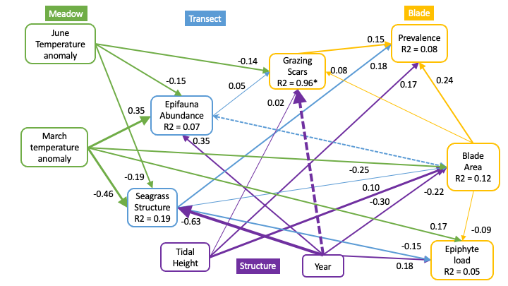

```{r setup, include=FALSE}
knitr::opts_chunk$set(echo = FALSE, message = FALSE, warning=FALSE)
# need these files because coefs() in stable piecewiseSEM() don't work with binomials
library(here)
source(here("R/helpers.R"), local = knitr::knit_global())
source(here("R/coefs.R"), local = knitr::knit_global())
# source("R/helpers.R", local = knitr::knit_global())
# source("R/coefs.R", local = knitr::knit_global())
library(piecewiseSEM)
library(readr)
library(dplyr)
library(ggplot2)
library(lme4)
library(nlme)
library(optimx)
region_order=c("AK", "BC", "WA", "OR", "BB", "SD")
```

```{r data}
# read in data
blade <- read_csv("data/blade_data_for_SEM.csv")
tran <- read_csv("data/full_seagrass_epifauna_for_SEM.csv")
tran_vars <- select(tran, "PercentOtherMean", "PercentBareMean", "Structure", "StructureLog", "epifauna_per_g_log_transect",
                    "Meadow", "Year", "TidalHeight", "Region", "SiteCode", "Transect", "TransectBeginDecimalLatitude",
                    "TempAnomWarm_March", "TempAnomWarm_April", "TempAnomWarm_May", "TempAnomWarm_June")
combo <- left_join(blade, tran_vars)
combo$EpiphytePerAreaMg <- combo$EpiphyteDryMass/combo$BladeArea *1000
combo$BladeAreaLog <- log10(combo$BladeArea)
combo$TempAnomWarm_March_Mean <- combo$TempAnomWarm_March/31
combo$TempAnomWarm_June_Mean <- combo$TempAnomWarm_June/30
combo$TidalHeightBinary <- ifelse(combo$TidalHeight=="L", 0, 1)
combo$YearBinary <- ifelse(combo$Year=="2019", 0, 1)

combo1 <- select(combo, c("PercentOtherMean", "PercentBareMean", "Structure", "StructureLog", "epifauna_per_g_log_transect",
                          "Meadow", "Year", "TidalHeight", "Region", "SiteCode", "Transect", "TransectBeginDecimalLatitude",
                          "TempAnomWarm_March", "TempAnomWarm_April", "TempAnomWarm_May", "TempAnomWarm_June",
                          "GrazingScars", "Prevalence", "LesionArea", "BladeArea", "Severity", "BladeAreaLog", 
                          "EpiphytePerAreaMg", "TempAnomWarm_March_Mean", "TempAnomWarm_June_Mean", "TidalHeightBinary",
                          "YearBinary"))
combo2 <- na.omit(combo1)

combo_19 <- subset(combo1, Year=="2019")
combo_19 <- na.omit(combo_19) # this is missing San Diego, because epiphyte blades weren't scanned
# unique(combo_19$Meadow) # 21 meadows
combo_19$sTransectBeginDecimalLatitude <- scale(combo_19$TransectBeginDecimalLatitude)

combo_21 <- subset(combo1, Year=="2021")
combo_21 <- na.omit(combo_21)

combo_19_sev <- subset(combo_19, Severity>0)
combo_19_sev$SeverityLog <- log10(combo_19_sev$Severity)
combo_19_sev$LesionAreaLog <- log10(combo_19_sev$LesionArea)

```


This is a very bare-bones update to inform conversations with Emmett at ISBW in Aug. Will update again if time permits.

The idea here is to build a more compelx SEM network that involves more predictors. I've done this in two ways, with everything averaged at the transect scale and alternatively with some information broken out to the blade level. Because we have very fine-scale data for some variables (disease, epiphyte load, blade area, grazing scars) we can look at the associations of those variables at the blade level. My idea is that there are environmental drivers at the ecosystem scale (i.e. temperature) which may affect the community level (e.g. seagrass structure and epifauna abundance), and these community-scale drivers may affect individual blade-level disease, grazing, etc. Or, ecosystem/environmental drivers may affect the blade-level variables directly. The network looks something like this:  


I am not showing all the model comparisons here - I haven't done an exhaustive comparison of possible paths, but all these models are global fits for the data. 

## Prevalence

For prevalence, we get the following model and network diagram using 2019 data only.  

```{r prev}

sem4 <- psem(
  glmer(Prevalence ~ BladeAreaLog + EpiphytePerAreaMg + GrazingScars + 
          StructureLog + epifauna_per_g_log_transect +
          TempAnomWarm_June_Mean + TempAnomWarm_March_Mean +
          TidalHeightBinary + sTransectBeginDecimalLatitude + 
          (1|Meadow),
        family = "binomial",
        # control = glmerControl(optimizer ='optimx', optCtrl=list(method='L-BFGS-B')), # this is to use a simpler optimization method
        data=combo_19),
  glmer(GrazingScars ~ epifauna_per_g_log_transect + TempAnomWarm_June_Mean + 
          TidalHeightBinary + BladeAreaLog + sTransectBeginDecimalLatitude + 
          (1|Meadow), 
        family = "binomial", 
        control = glmerControl(optimizer ='optimx', optCtrl=list(method='L-BFGS-B')), # this is to use a simpler optimization method
        data=combo_19),
  lmer(BladeAreaLog ~ StructureLog + TidalHeightBinary + TempAnomWarm_June_Mean + 
         TempAnomWarm_March_Mean + sTransectBeginDecimalLatitude + 
         (1|Meadow),
       data=combo_19),
  lmer(EpiphytePerAreaMg ~ StructureLog + TidalHeightBinary + TempAnomWarm_June_Mean +
         BladeAreaLog + TempAnomWarm_March_Mean + sTransectBeginDecimalLatitude + 
         (1|Meadow),
       offset = combo_19$BladeAreaLog,
       data=combo_19),
  lmer(epifauna_per_g_log_transect ~ TempAnomWarm_March_Mean + TempAnomWarm_June_Mean + 
         TidalHeightBinary + StructureLog + sTransectBeginDecimalLatitude + 
         (1|Meadow),
       data=combo_19),
  lmer(StructureLog ~ TempAnomWarm_March_Mean + TempAnomWarm_June_Mean + 
         TidalHeightBinary + sTransectBeginDecimalLatitude + 
         (1|Meadow),
       data=combo_19),
  epifauna_per_g_log_transect%~~%BladeAreaLog
)
# summary(sem4)
coefs(sem4)
rsquared(sem4)
```


Note the R2 values are **MARGINAL** to look at fixed effects. Meadow is a random effect in all the models.  

What I take away from this diagram is that ecosystem-level drivers (temperature, latitude, tidal height) are acting on disease directly, and there is some contribution from the local drivers of grazing and blade area. But, those local drivers are not really mediating effects from epifauna abundance or seagrass structure. So the network doesn't "flow" particularly.  

If we run the same model structure with 2019 and 2021 data, it doesn't show as much temperature influence on disease prevalence and there are weird Year effects on Grazing. This is for two reasons - one is that disease prevalence went down because of seagrass loss in 2021 (see the negative correlation with seagrass structure). And for grazing - in 2021, there was 100% grazing on the epiphyte blades (5 per transect). So that makes it very weird to model with Year as a predictor - Year increaes the R2 of grazing to 0.96 but is not significant.  

Because of the weirdness of Year, I did the rest of the analysis with 2019 data only so far.  

```{r prev2}
sem2 <- psem(
  glmer(Prevalence ~ BladeAreaLog + EpiphytePerAreaMg + GrazingScars + 
          StructureLog + epifauna_per_g_log_transect +
          TempAnomWarm_March_Mean + TempAnomWarm_June_Mean + YearBinary +
          TidalHeightBinary + 
          (1|Meadow),
        family = "binomial",
        data=combo2),
  glmer(GrazingScars ~ epifauna_per_g_log_transect + TempAnomWarm_June_Mean + 
          TidalHeightBinary + BladeAreaLog + YearBinary + 
          (1|Meadow), 
        family = "binomial", 
        control = glmerControl(optimizer ='optimx', optCtrl=list(method='L-BFGS-B')), # this is to use a simpler optimization method
        data=combo2),
  lmer(BladeAreaLog ~ StructureLog + TidalHeightBinary + TempAnomWarm_June_Mean + 
         TempAnomWarm_March_Mean + YearBinary + 
         (1|Meadow),
       data=combo2),
  lmer(EpiphytePerAreaMg ~ StructureLog + TidalHeightBinary + YearBinary + 
         BladeAreaLog + TempAnomWarm_March_Mean +
         (1|Meadow),
       offset = combo2$BladeAreaLog,
       data=combo2),
  lmer(epifauna_per_g_log_transect ~ TempAnomWarm_March_Mean + TempAnomWarm_June_Mean + 
         TidalHeightBinary + YearBinary + StructureLog + 
         (1|Meadow),
       data=combo2),
  lmer(StructureLog ~ TempAnomWarm_March_Mean + TempAnomWarm_June_Mean + TidalHeightBinary + YearBinary + 
         (1|Meadow),
       data=combo2),
  epifauna_per_g_log_transect%~~%BladeAreaLog
)
# summary(sem2)
coefs(sem2)
rsquared(sem2)
```



## Severity

For 2019 only. Grazing isn't correlated with severity, and the direct temperature link to disease is missing here. This suggests (maybe) that temperature is affecting the seagrass more than the Laby? Note that the other links change in part due to running this model on only diseased plants. For the moment, this is the most feasible way to run the R code (could do a zero-inflated model for severity, but not supported by piecewiseSEM(). Could do by hand...)

```{r sev}
sem6 <- psem(
  lmer(SeverityLog ~ BladeAreaLog + EpiphytePerAreaMg + GrazingScars + 
         StructureLog + epifauna_per_g_log_transect +
         TempAnomWarm_June_Mean + TempAnomWarm_March_Mean +
         TidalHeightBinary + sTransectBeginDecimalLatitude + 
         (1|Meadow),
       data=combo_19_sev),
  glmer(GrazingScars ~ epifauna_per_g_log_transect + TempAnomWarm_June_Mean + StructureLog +
          TidalHeightBinary + BladeAreaLog + sTransectBeginDecimalLatitude + 
          (1|Meadow), 
        family = "binomial", 
        control = glmerControl(optimizer ='optimx', optCtrl=list(method='L-BFGS-B')), # this is to use a simpler optimization method
        data=combo_19_sev),
  lmer(BladeAreaLog ~ StructureLog + TidalHeightBinary + TempAnomWarm_June_Mean + 
         TempAnomWarm_March_Mean + sTransectBeginDecimalLatitude + 
         (1|Meadow),
       data=combo_19_sev),
  lmer(EpiphytePerAreaMg ~ StructureLog + TidalHeightBinary + TempAnomWarm_June_Mean +
         BladeAreaLog + TempAnomWarm_March_Mean + sTransectBeginDecimalLatitude + 
         (1|Meadow),
       offset = combo_19_sev$BladeAreaLog,
       data=combo_19_sev),
  lmer(epifauna_per_g_log_transect ~ TempAnomWarm_March_Mean + TempAnomWarm_June_Mean + 
         TidalHeightBinary + StructureLog + sTransectBeginDecimalLatitude + 
         (1|Meadow),
       data=combo_19_sev),
  lmer(StructureLog ~ TempAnomWarm_March_Mean + TempAnomWarm_June_Mean + 
         TidalHeightBinary + sTransectBeginDecimalLatitude + 
         (1|Meadow),
       data=combo_19_sev),
  epifauna_per_g_log_transect%~~%BladeAreaLog
)
# summary(sem6)
coefs(sem6)
rsquared(sem2)
```


So severity is really a function of seagrass propoerties (blade area, seagrass structure) and is not mediated by grazing. This maybe suggests that grazing is a vector (affects transmission) but doesn't alter plant defenses? Hard to say since grazing is a presence/absence, not extent. 

## Lesion Area

This is the same as for severity, because they are the same leaves. No correlation between grazing and lesion area either. 

```{r les}

sem7 <- psem(
  lmer(LesionAreaLog ~ BladeAreaLog + EpiphytePerAreaMg + GrazingScars + 
         StructureLog + epifauna_per_g_log_transect +
         TempAnomWarm_June_Mean + TempAnomWarm_March_Mean +
         TidalHeightBinary + sTransectBeginDecimalLatitude + 
         (1|Meadow),
       data=combo_19_sev),
  glmer(GrazingScars ~ epifauna_per_g_log_transect + TempAnomWarm_June_Mean + StructureLog +
          TidalHeightBinary + BladeAreaLog + sTransectBeginDecimalLatitude + 
          (1|Meadow), 
        family = "binomial", 
        control = glmerControl(optimizer ='optimx', optCtrl=list(method='L-BFGS-B')), # this is to use a simpler optimization method
        data=combo_19_sev),
  lmer(BladeAreaLog ~ StructureLog + TidalHeightBinary + TempAnomWarm_June_Mean + 
         TempAnomWarm_March_Mean + sTransectBeginDecimalLatitude + 
         (1|Meadow),
       data=combo_19_sev),
  lmer(EpiphytePerAreaMg ~ StructureLog + TidalHeightBinary + TempAnomWarm_June_Mean +
         BladeAreaLog + TempAnomWarm_March_Mean + sTransectBeginDecimalLatitude + 
         (1|Meadow),
       offset = combo_19_sev$BladeAreaLog,
       data=combo_19_sev),
  lmer(epifauna_per_g_log_transect ~ TempAnomWarm_March_Mean + TempAnomWarm_June_Mean + 
         TidalHeightBinary + StructureLog + sTransectBeginDecimalLatitude + 
         (1|Meadow),
       data=combo_19_sev),
  lmer(StructureLog ~ TempAnomWarm_March_Mean + TempAnomWarm_June_Mean + 
         TidalHeightBinary + sTransectBeginDecimalLatitude + 
         (1|Meadow),
       data=combo_19_sev),
  epifauna_per_g_log_transect%~~%BladeAreaLog
)
# summary(sem7)
coefs(sem7)
rsquared(sem7)

```


Since the network is basically the same as for severity, interpretation is the same... grazing isn't correlated with lesion area.  

## Everything at transect level but more complex

SO an alternative to having these blade-level metrics is to keep everything at the transect level and just add in epifauna, etc. I did that for Prevalence, and we get basically the same thing as above - prevalence is a function of grazing and temperature. Just showing the figure here:


One thing to note is that the magnitude (and sometimes the direction!) of paths can shift depending on the exact dataset that we are using. E.g. here for transect-level means, there's a significant path from epiphyte load to prevalence, but at the blade-level above, that path was not significant. So we need to think carefully about how to slice the data.  


## Thoughts

- Are there better "community-level" predictors we could use? E.g. instead of epifauna abundance, use richness, or abundance of functional groups?  
- Possibly include other predictors like macroalgae cover? Tried it a bit and didn't see anything come out... what else did we measure that could be mediating temperature?  
- Grazing was 100% on the epiphyte blades in 2021 (5 per transect) but not quite 100% for all disease blades. I need to do the analysis for the full set (20 per transect) for 2021 only to see if there's something there. Also consider a network without grazing scars - if there is grazing on (almost) every leaf, maybe it's not that helpful.  
- Still need to try breaking down to Region or even Meadow scale. I did some preliminary stuff with the WA region only data and the patterns looked pretty much the same as for the whole dataset. But, maybe splitting out other regions will reveal something.  

In terms of actual questions that the SEM analysis can answer:  
1. Does grazing mediate effects of temperature on disease? I would say no - for prevalence, there's a direct temperature effect on disease, and for severity and lesion area, there's no direct temperature effect nor is there a correlation with grazing.  

2. Does grazing community (epifauna abundance or grazing scars) mediate seagrass properties (structure, blade area) effects on disease? Possibly for prevalence, in the sense that epifauna abundance drives grazing which drives prevalence. But not for severity or lesion area. And the prevalence R2 is relatively small  

I think it would help to consider how relationships between disease and grazing might vary by site in a meaningful way. What are the conditions that would change these relationships? Lacuna abundance, richness, other?   
