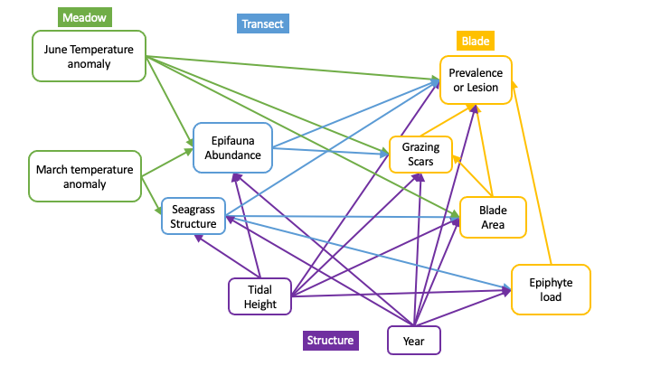
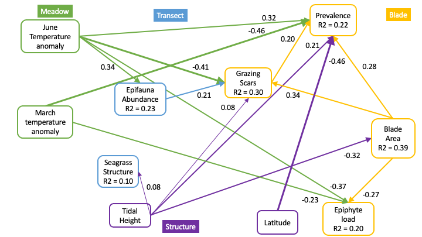
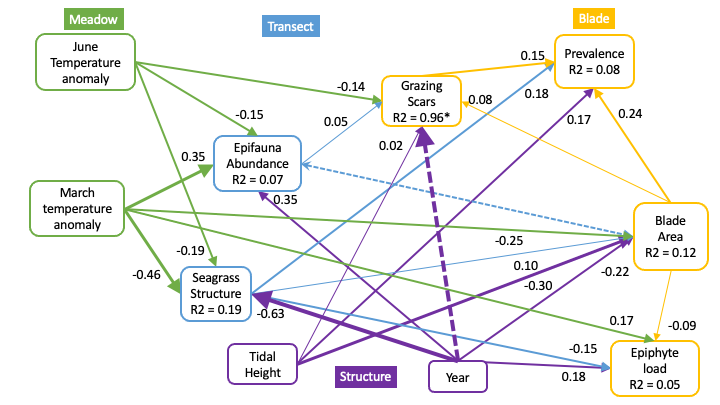
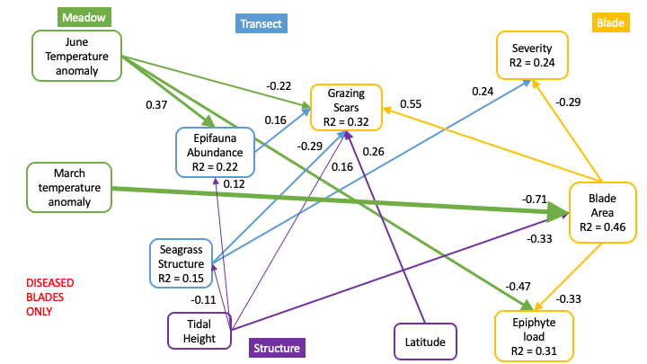
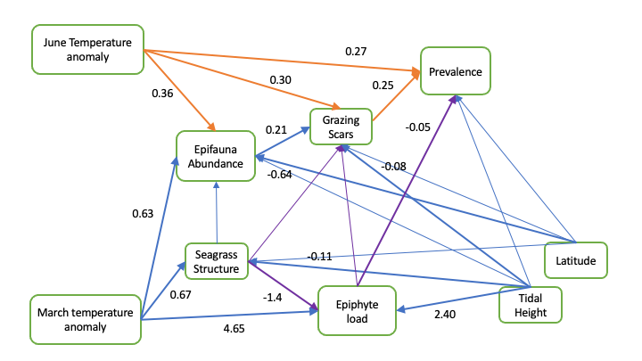

Grazing Scar SEM Analysis - Include Blade Level
================
Lillian Aoki
2022-07-28

-   <a href="#prevalence" id="toc-prevalence">Prevalence</a>
-   <a href="#severity" id="toc-severity">Severity</a>
-   <a href="#lesion-area" id="toc-lesion-area">Lesion Area</a>
-   <a href="#everything-at-transect-level-but-more-complex"
    id="toc-everything-at-transect-level-but-more-complex">Everything at
    transect level but more complex</a>
-   <a href="#thoughts" id="toc-thoughts">Thoughts</a>

This is a very bare-bones update to inform conversations with Emmett at
ISBW in Aug. Will update again if time permits.

The idea here is to build a more compelx SEM network that involves more
predictors. I’ve done this in two ways, with everything averaged at the
transect scale and alternatively with some information broken out to the
blade level. Because we have very fine-scale data for some variables
(disease, epiphyte load, blade area, grazing scars) we can look at the
associations of those variables at the blade level. My idea is that
there are environmental drivers at the ecosystem scale
(i.e. temperature) which may affect the community level (e.g. seagrass
structure and epifauna abundance), and these community-scale drivers may
affect individual blade-level disease, grazing, etc. Or,
ecosystem/environmental drivers may affect the blade-level variables
directly. The network looks something like this:

I am not showing all the model comparisons here - I haven’t done an
exhaustive comparison of possible paths, but all these models are global
fits for the data.

## Prevalence

For prevalence, we get the following model and network diagram using
2019 data only.

    ##                         Response                     Predictor Estimate
    ## 1                     Prevalence                  BladeAreaLog   1.4194
    ## 2                     Prevalence             EpiphytePerAreaMg  -0.0198
    ## 3                     Prevalence                  GrazingScars   0.9382
    ## 4                     Prevalence                  StructureLog  -0.0916
    ## 5                     Prevalence   epifauna_per_g_log_transect   0.4171
    ## 6                     Prevalence        TempAnomWarm_June_Mean   3.5772
    ## 7                     Prevalence       TempAnomWarm_March_Mean   7.5680
    ## 8                     Prevalence             TidalHeightBinary   0.9213
    ## 9                     Prevalence sTransectBeginDecimalLatitude  -1.0464
    ## 10                  GrazingScars   epifauna_per_g_log_transect   1.1881
    ## 11                  GrazingScars        TempAnomWarm_June_Mean  -5.9542
    ## 12                  GrazingScars             TidalHeightBinary   0.5078
    ## 13                  GrazingScars                  BladeAreaLog   2.2789
    ## 14                  GrazingScars sTransectBeginDecimalLatitude  -0.2527
    ## 15                  BladeAreaLog                  StructureLog   0.0908
    ## 16                  BladeAreaLog             TidalHeightBinary  -0.2829
    ## 17                  BladeAreaLog        TempAnomWarm_June_Mean  -0.3118
    ## 18                  BladeAreaLog       TempAnomWarm_March_Mean  -1.5227
    ## 19                  BladeAreaLog sTransectBeginDecimalLatitude  -0.0030
    ## 20             EpiphytePerAreaMg                  StructureLog  -0.5763
    ## 21             EpiphytePerAreaMg             TidalHeightBinary  -0.0873
    ## 22             EpiphytePerAreaMg        TempAnomWarm_June_Mean  -3.5071
    ## 23             EpiphytePerAreaMg                  BladeAreaLog  -1.1706
    ## 24             EpiphytePerAreaMg       TempAnomWarm_March_Mean  -1.9846
    ## 25             EpiphytePerAreaMg sTransectBeginDecimalLatitude  -0.1665
    ## 26   epifauna_per_g_log_transect       TempAnomWarm_March_Mean   1.6681
    ## 27   epifauna_per_g_log_transect        TempAnomWarm_June_Mean   0.9079
    ## 28   epifauna_per_g_log_transect             TidalHeightBinary   0.0291
    ## 29   epifauna_per_g_log_transect                  StructureLog  -0.1238
    ## 30   epifauna_per_g_log_transect sTransectBeginDecimalLatitude  -0.1514
    ## 31                  StructureLog       TempAnomWarm_March_Mean   1.9011
    ## 32                  StructureLog        TempAnomWarm_June_Mean  -0.3198
    ## 33                  StructureLog             TidalHeightBinary  -0.0621
    ## 34                  StructureLog sTransectBeginDecimalLatitude  -0.2118
    ## 35 ~~epifauna_per_g_log_transect                ~~BladeAreaLog   0.0038
    ##    Std.Error       DF Crit.Value P.Value Std.Estimate    
    ## 1     0.4165 593.0000     3.4080  0.0007       0.2790 ***
    ## 2     0.0609 593.0000    -0.3256  0.7447      -0.0166    
    ## 3     0.2576 593.0000     3.6419  0.0003       0.2047 ***
    ## 4     0.4843 593.0000    -0.1892  0.8499      -0.0158    
    ## 5     0.2794 593.0000     1.4929  0.1355       0.0995    
    ## 6     1.1801 593.0000     3.0313  0.0024       0.3176  **
    ## 7     3.1467 593.0000     2.4051  0.0162       0.5045   *
    ## 8     0.2339 593.0000     3.9393  0.0001       0.2016 ***
    ## 9     0.4677 593.0000    -2.2374  0.0253      -0.4577   *
    ## 10    0.3388 593.0000     3.5074  0.0005       0.2167 ***
    ## 11    2.1508 593.0000    -2.7684  0.0056      -0.4043  **
    ## 12    0.2584 593.0000     1.9654  0.0494       0.0850   *
    ## 13    0.4836 593.0000     4.7122  0.0000       0.3425 ***
    ## 14    0.4119 593.0000    -0.6134  0.5396      -0.0845    
    ## 15    0.0557 526.1874     2.6086  0.1069       0.0796    
    ## 16    0.0201 573.5270   197.4803  0.0000      -0.3150 ***
    ## 17    0.3085  17.1800     1.0212  0.3263      -0.1409    
    ## 18    0.7932  18.0078     3.6837  0.0709      -0.5165    
    ## 19    0.1238  17.4852     0.0006  0.9811      -0.0066    
    ## 20    0.2996 184.5629     3.5265  0.0620      -0.1186    
    ## 21    0.1388 584.1903     0.3939  0.5305      -0.0228    
    ## 22    0.9555  17.7170    13.4590  0.0018      -0.3718  **
    ## 23    0.2388 501.1867    23.5436  0.0000      -0.2747 ***
    ## 24    2.5345  20.0990     0.6102  0.4438      -0.1580    
    ## 25    0.3858  18.2853     0.1858  0.6714      -0.0870    
    ## 26    1.0044  18.2048     2.7566  0.1140       0.4662    
    ## 27    0.3897  17.2173     5.4278  0.0322       0.3380   *
    ## 28    0.0281 574.1443     1.0726  0.3008       0.0267    
    ## 29     0.077 490.2074     2.5271  0.1126      -0.0895    
    ## 30    0.1565  17.5807     0.9354  0.3466      -0.2776    
    ## 31    0.9942  17.1962     3.6565  0.0727       0.7352    
    ## 32    0.3909  17.0800     0.6694  0.4245      -0.1647    
    ## 33    0.0142 571.2300    18.9960  0.0000      -0.0789 ***
    ## 34    0.1562  17.1195     1.8392  0.1927      -0.5374    
    ## 35         - 593.0000     0.0929  0.4630       0.0038

    ##                      Response   family     link method  Marginal Conditional
    ## 1                  Prevalence binomial    logit  delta 0.2247630   0.3524365
    ## 2                GrazingScars binomial    logit  delta 0.2953133   0.5881452
    ## 3                BladeAreaLog gaussian identity   none 0.3871249   0.7449730
    ## 4           EpiphytePerAreaMg gaussian identity   none 0.1976457   0.3981422
    ## 5 epifauna_per_g_log_transect gaussian identity   none 0.2314966   0.6407268
    ## 6                StructureLog gaussian identity   none 0.1000052   0.8356494

Note the R2 values are **MARGINAL** to look at fixed effects. Meadow is
a random effect in all the models.

What I take away from this diagram is that ecosystem-level drivers
(temperature, latitude, tidal height) are acting on disease directly,
and there is some contribution from the local drivers of grazing and
blade area. But, those local drivers are not really mediating effects
from epifauna abundance or seagrass structure. So the network doesn’t
“flow” particularly.

If we run the same model structure with 2019 and 2021 data, it doesn’t
show as much temperature influence on disease prevalence and there are
weird Year effects on Grazing. This is for two reasons - one is that
disease prevalence went down because of seagrass loss in 2021 (see the
negative correlation with seagrass structure). And for grazing - in
2021, there was 100% grazing on the epiphyte blades (5 per transect). So
that makes it very weird to model with Year as a predictor - Year
increaes the R2 of grazing to 0.96 but is not significant.

Because of the weirdness of Year, I did the rest of the analysis with
2019 data only so far.

    ##                         Response                   Predictor Estimate Std.Error
    ## 1                     Prevalence                BladeAreaLog   1.1780    0.2962
    ## 2                     Prevalence           EpiphytePerAreaMg  -0.0021    0.0216
    ## 3                     Prevalence                GrazingScars   0.7132    0.2421
    ## 4                     Prevalence                StructureLog   0.8848    0.2804
    ## 5                     Prevalence epifauna_per_g_log_transect   0.4175    0.2296
    ## 6                     Prevalence     TempAnomWarm_March_Mean  -1.1040    1.3326
    ## 7                     Prevalence      TempAnomWarm_June_Mean   0.2967    0.4224
    ## 8                     Prevalence                  YearBinary  -0.5548    0.5199
    ## 9                     Prevalence           TidalHeightBinary   0.6743    0.1572
    ## 10                  GrazingScars epifauna_per_g_log_transect   1.1763    0.3378
    ## 11                  GrazingScars      TempAnomWarm_June_Mean  -5.9935    2.1143
    ## 12                  GrazingScars           TidalHeightBinary   0.5270    0.2561
    ## 13                  GrazingScars                BladeAreaLog   2.3404    0.4749
    ## 14                  GrazingScars                  YearBinary  26.8025 2315.4453
    ## 15                  BladeAreaLog                StructureLog   0.0791      0.03
    ## 16                  BladeAreaLog           TidalHeightBinary  -0.2446    0.0152
    ## 17                  BladeAreaLog      TempAnomWarm_June_Mean  -0.0652    0.0481
    ## 18                  BladeAreaLog     TempAnomWarm_March_Mean  -0.6274    0.1636
    ## 19                  BladeAreaLog                  YearBinary  -0.1959     0.064
    ## 20             EpiphytePerAreaMg                StructureLog  -0.8639    0.3364
    ## 21             EpiphytePerAreaMg           TidalHeightBinary   0.2952    0.1984
    ## 22             EpiphytePerAreaMg                  YearBinary   1.5535    0.6416
    ## 23             EpiphytePerAreaMg                BladeAreaLog  -0.8120     0.351
    ## 24             EpiphytePerAreaMg     TempAnomWarm_March_Mean   4.1213    1.6438
    ## 25   epifauna_per_g_log_transect     TempAnomWarm_March_Mean   1.1032    0.2023
    ## 26   epifauna_per_g_log_transect      TempAnomWarm_June_Mean  -0.2720    0.0596
    ## 27   epifauna_per_g_log_transect           TidalHeightBinary   0.0121    0.0188
    ## 28   epifauna_per_g_log_transect                  YearBinary   0.3821    0.0792
    ## 29   epifauna_per_g_log_transect                StructureLog  -0.0609    0.0372
    ## 30                  StructureLog     TempAnomWarm_March_Mean  -1.2598    0.1625
    ## 31                  StructureLog      TempAnomWarm_June_Mean  -0.3071    0.0477
    ## 32                  StructureLog           TidalHeightBinary  -0.0444    0.0151
    ## 33                  StructureLog                  YearBinary  -0.6121    0.0627
    ## 34 ~~epifauna_per_g_log_transect              ~~BladeAreaLog  -0.0661         -
    ##           DF Crit.Value P.Value Std.Estimate    
    ## 1  1093.0000     3.9777  0.0001       0.2324 ***
    ## 2  1093.0000    -0.0963  0.9233      -0.0034    
    ## 3  1093.0000     2.9459  0.0032       0.1462  **
    ## 4  1093.0000     3.1553  0.0016       0.1976  **
    ## 5  1093.0000     1.8183  0.0690       0.1017    
    ## 6  1093.0000    -0.8285  0.4074      -0.0861    
    ## 7  1093.0000     0.7023  0.4825       0.0404    
    ## 8  1093.0000    -1.0670  0.2860      -0.1244    
    ## 9  1093.0000     4.2899  0.0000       0.1518 ***
    ## 10 1093.0000     3.4819  0.0005       0.0485 ***
    ## 11 1093.0000    -2.8347  0.0046      -0.1380  **
    ## 12 1093.0000     2.0581  0.0396       0.0200   *
    ## 13 1093.0000     4.9278  0.0000       0.0780 ***
    ## 14 1093.0000     0.0116  0.9908       1.0160    
    ## 15 1073.3515     6.9010  0.0087       0.0896  **
    ## 16 1063.9127   259.2544  0.0000      -0.2791 ***
    ## 17 1067.1832     1.8254  0.1770      -0.0451    
    ## 18  914.5666    14.5091  0.0001      -0.2480 ***
    ## 19  892.1161     9.2295  0.0025      -0.2228  **
    ## 20  817.3372     6.4931  0.0110      -0.1176   *
    ## 21 1079.4913     2.2107  0.1373       0.0405    
    ## 22  534.4794     5.7275  0.0170       0.2123   *
    ## 23 1039.9678     5.3092  0.0214      -0.0976   *
    ## 24  600.0451     6.1537  0.0134       0.1958   *
    ## 25  891.7720    29.3226  0.0000       0.3530 ***
    ## 26 1062.0628    20.6941  0.0000      -0.1521 ***
    ## 27 1063.9677     0.4129  0.5206       0.0112    
    ## 28  867.4060    22.9440  0.0000       0.3516 ***
    ## 29 1069.3275     2.6676  0.1027      -0.0559    
    ## 30 1061.1510    59.6529  0.0000      -0.4398 ***
    ## 31 1087.2037    41.2523  0.0000      -0.1873 ***
    ## 32 1064.2764     8.5905  0.0035      -0.0447  **
    ## 33 1055.1146    94.4641  0.0000      -0.6146 ***
    ## 34 1093.0000    -2.1882  0.0144      -0.0661   *

    ##                      Response   family     link method   Marginal Conditional
    ## 1                  Prevalence binomial    logit  delta 0.07899001   0.3193580
    ## 2                GrazingScars binomial    logit  delta 0.95503171   0.9711237
    ## 3                BladeAreaLog gaussian identity   none 0.11890746   0.6867687
    ## 4           EpiphytePerAreaMg gaussian identity   none 0.05368539   0.4252272
    ## 5 epifauna_per_g_log_transect gaussian identity   none 0.06795409   0.6551229
    ## 6                StructureLog gaussian identity   none 0.18280747   0.8089081

## Severity

For 2019 only. Grazing isn’t correlated with severity, and the direct
temperature link to disease is missing here. This suggests (maybe) that
temperature is affecting the seagrass more than the Laby? Note that the
other links change in part due to running this model on only diseased
plants. For the moment, this is the most feasible way to run the R code
(could do a zero-inflated model for severity, but not supported by
piecewiseSEM(). Could do by hand…)

    ##                         Response                     Predictor Estimate
    ## 1                    SeverityLog                  BladeAreaLog  -0.4818
    ## 2                    SeverityLog             EpiphytePerAreaMg  -0.0427
    ## 3                    SeverityLog                  GrazingScars   0.1711
    ## 4                    SeverityLog                  StructureLog   0.4373
    ## 5                    SeverityLog   epifauna_per_g_log_transect  -0.0571
    ## 6                    SeverityLog        TempAnomWarm_June_Mean   0.4133
    ## 7                    SeverityLog       TempAnomWarm_March_Mean  -0.1286
    ## 8                    SeverityLog             TidalHeightBinary  -0.0275
    ## 9                    SeverityLog sTransectBeginDecimalLatitude   0.1527
    ## 10                  GrazingScars   epifauna_per_g_log_transect   0.6627
    ## 11                  GrazingScars        TempAnomWarm_June_Mean  -2.8922
    ## 12                  GrazingScars                  StructureLog  -1.7238
    ## 13                  GrazingScars             TidalHeightBinary   0.7499
    ## 14                  GrazingScars                  BladeAreaLog   2.9447
    ## 15                  GrazingScars sTransectBeginDecimalLatitude   0.5467
    ## 16                  BladeAreaLog                  StructureLog   0.1590
    ## 17                  BladeAreaLog             TidalHeightBinary  -0.2836
    ## 18                  BladeAreaLog        TempAnomWarm_June_Mean  -0.3341
    ## 19                  BladeAreaLog       TempAnomWarm_March_Mean  -1.8215
    ## 20                  BladeAreaLog sTransectBeginDecimalLatitude   0.0518
    ## 21             EpiphytePerAreaMg                  StructureLog  -0.3257
    ## 22             EpiphytePerAreaMg             TidalHeightBinary  -0.0365
    ## 23             EpiphytePerAreaMg        TempAnomWarm_June_Mean  -3.8666
    ## 24             EpiphytePerAreaMg                  BladeAreaLog  -1.1071
    ## 25             EpiphytePerAreaMg       TempAnomWarm_March_Mean  -3.7870
    ## 26             EpiphytePerAreaMg sTransectBeginDecimalLatitude   0.0301
    ## 27   epifauna_per_g_log_transect       TempAnomWarm_March_Mean   0.9158
    ## 28   epifauna_per_g_log_transect        TempAnomWarm_June_Mean   1.1757
    ## 29   epifauna_per_g_log_transect             TidalHeightBinary   0.1365
    ## 30   epifauna_per_g_log_transect                  StructureLog   0.0024
    ## 31   epifauna_per_g_log_transect sTransectBeginDecimalLatitude  -0.0347
    ## 32                  StructureLog       TempAnomWarm_March_Mean   1.9965
    ## 33                  StructureLog        TempAnomWarm_June_Mean  -0.2864
    ## 34                  StructureLog             TidalHeightBinary  -0.0834
    ## 35                  StructureLog sTransectBeginDecimalLatitude  -0.2372
    ## 36 ~~epifauna_per_g_log_transect                ~~BladeAreaLog  -0.0703
    ##    Std.Error       DF Crit.Value P.Value Std.Estimate    
    ## 1     0.1733 187.9836     7.4434  0.0070      -0.2883  **
    ## 2     0.0468 211.2767     0.8062  0.3703      -0.0852    
    ## 3     0.0886 228.6134     3.7105  0.0553       0.1199    
    ## 4     0.1948  82.0856     4.7604  0.0320       0.2395   *
    ## 5     0.1037 210.9805     0.2925  0.5892      -0.0439    
    ## 6     0.4789  27.2768     0.7363  0.3983       0.1014    
    ## 7     1.1398  18.6700     0.0125  0.9121      -0.0301    
    ## 8     0.0943 227.9022     0.0830  0.7736      -0.0192    
    ## 9     0.1686  16.6507     0.8113  0.3806       0.2417    
    ## 10    0.3304 244.0000     2.0055  0.0449       0.1589   *
    ## 11    1.2265 244.0000    -2.3581  0.0184      -0.2213   *
    ## 12    0.4608 244.0000    -3.7412  0.0002      -0.2943 ***
    ## 13     0.337 244.0000     2.2255  0.0260       0.1632   *
    ## 14    0.5452 244.0000     5.4008  0.0000       0.5494 ***
    ## 15    0.1714 244.0000     3.1903  0.0014       0.2698  **
    ## 16    0.0836 203.7222     3.4851  0.0634       0.1455    
    ## 17    0.0285 225.7933    98.5191  0.0000      -0.3308 ***
    ## 18    0.3101  16.8347     1.1596  0.2967      -0.1370    
    ## 19    0.8003  17.7858     5.1698  0.0356      -0.7115   *
    ## 20    0.1246  17.1964     0.1722  0.6833       0.1369    
    ## 21    0.3092 181.2909     1.0639  0.3037      -0.0893    
    ## 22    0.1262 230.9733     0.0828  0.7738      -0.0128    
    ## 23    1.0706  16.8966    13.0321  0.0022      -0.4752  **
    ## 24    0.2402 236.6104    20.8617  0.0000      -0.3318 ***
    ## 25     2.795  18.4192     1.8292  0.1926      -0.4434    
    ## 26    0.4296  17.0842     0.0049  0.9449       0.0239    
    ## 27    1.0838  18.1005     0.7110  0.4101       0.2784    
    ## 28    0.4166  16.8453     7.9519  0.0119       0.3751   *
    ## 29    0.0494 228.3562     7.6077  0.0063       0.1239  **
    ## 30    0.1373 151.0957     0.0003  0.9864       0.0017    
    ## 31    0.1679  17.2893     0.0426  0.8388      -0.0715    
    ## 32    0.9556  16.8689     4.3646  0.0522       0.8524    
    ## 33    0.3769  16.9680     0.5774  0.4578      -0.1283    
    ## 34    0.0202 223.5463    17.1139  0.0000      -0.1063 ***
    ## 35    0.1503  16.8596     2.4902  0.1331      -0.6856    
    ## 36         - 244.0000    -1.0940  0.1375      -0.0703

    ##                      Response   family     link method   Marginal Conditional
    ## 1                  Prevalence binomial    logit  delta 0.07899001   0.3193580
    ## 2                GrazingScars binomial    logit  delta 0.95503171   0.9711237
    ## 3                BladeAreaLog gaussian identity   none 0.11890746   0.6867687
    ## 4           EpiphytePerAreaMg gaussian identity   none 0.05368539   0.4252272
    ## 5 epifauna_per_g_log_transect gaussian identity   none 0.06795409   0.6551229
    ## 6                StructureLog gaussian identity   none 0.18280747   0.8089081

So severity is really a function of seagrass propoerties (blade area,
seagrass structure) and is not mediated by grazing. This maybe suggests
that grazing is a vector (affects transmission) but doesn’t alter plant
defenses? Hard to say since grazing is a presence/absence, not extent.

## Lesion Area

This is the same as for severity, because they are the same leaves. No
correlation between grazing and lesion area either.

    ##                         Response                     Predictor Estimate
    ## 1                  LesionAreaLog                  BladeAreaLog   0.5182
    ## 2                  LesionAreaLog             EpiphytePerAreaMg  -0.0427
    ## 3                  LesionAreaLog                  GrazingScars   0.1711
    ## 4                  LesionAreaLog                  StructureLog   0.4373
    ## 5                  LesionAreaLog   epifauna_per_g_log_transect  -0.0571
    ## 6                  LesionAreaLog        TempAnomWarm_June_Mean   0.4133
    ## 7                  LesionAreaLog       TempAnomWarm_March_Mean  -0.1286
    ## 8                  LesionAreaLog             TidalHeightBinary  -0.0275
    ## 9                  LesionAreaLog sTransectBeginDecimalLatitude   0.1527
    ## 10                  GrazingScars   epifauna_per_g_log_transect   0.6627
    ## 11                  GrazingScars        TempAnomWarm_June_Mean  -2.8922
    ## 12                  GrazingScars                  StructureLog  -1.7238
    ## 13                  GrazingScars             TidalHeightBinary   0.7499
    ## 14                  GrazingScars                  BladeAreaLog   2.9447
    ## 15                  GrazingScars sTransectBeginDecimalLatitude   0.5467
    ## 16                  BladeAreaLog                  StructureLog   0.1590
    ## 17                  BladeAreaLog             TidalHeightBinary  -0.2836
    ## 18                  BladeAreaLog        TempAnomWarm_June_Mean  -0.3341
    ## 19                  BladeAreaLog       TempAnomWarm_March_Mean  -1.8215
    ## 20                  BladeAreaLog sTransectBeginDecimalLatitude   0.0518
    ## 21             EpiphytePerAreaMg                  StructureLog  -0.3257
    ## 22             EpiphytePerAreaMg             TidalHeightBinary  -0.0365
    ## 23             EpiphytePerAreaMg        TempAnomWarm_June_Mean  -3.8666
    ## 24             EpiphytePerAreaMg                  BladeAreaLog  -1.1071
    ## 25             EpiphytePerAreaMg       TempAnomWarm_March_Mean  -3.7870
    ## 26             EpiphytePerAreaMg sTransectBeginDecimalLatitude   0.0301
    ## 27   epifauna_per_g_log_transect       TempAnomWarm_March_Mean   0.9158
    ## 28   epifauna_per_g_log_transect        TempAnomWarm_June_Mean   1.1757
    ## 29   epifauna_per_g_log_transect             TidalHeightBinary   0.1365
    ## 30   epifauna_per_g_log_transect                  StructureLog   0.0024
    ## 31   epifauna_per_g_log_transect sTransectBeginDecimalLatitude  -0.0347
    ## 32                  StructureLog       TempAnomWarm_March_Mean   1.9965
    ## 33                  StructureLog        TempAnomWarm_June_Mean  -0.2864
    ## 34                  StructureLog             TidalHeightBinary  -0.0834
    ## 35                  StructureLog sTransectBeginDecimalLatitude  -0.2372
    ## 36 ~~epifauna_per_g_log_transect                ~~BladeAreaLog  -0.0703
    ##    Std.Error       DF Crit.Value P.Value Std.Estimate    
    ## 1     0.1733 187.9836     8.6111  0.0038       0.3214  **
    ## 2     0.0468 211.2767     0.8062  0.3703      -0.0883    
    ## 3     0.0886 228.6134     3.7105  0.0553       0.1243    
    ## 4     0.1948  82.0856     4.7604  0.0320       0.2481   *
    ## 5     0.1037 210.9805     0.2925  0.5892      -0.0455    
    ## 6     0.4789  27.2768     0.7363  0.3983       0.1051    
    ## 7     1.1398  18.6700     0.0125  0.9121      -0.0312    
    ## 8     0.0943 227.9022     0.0830  0.7736      -0.0199    
    ## 9     0.1686  16.6507     0.8113  0.3806       0.2505    
    ## 10    0.3304 244.0000     2.0055  0.0449       0.1589   *
    ## 11    1.2265 244.0000    -2.3581  0.0184      -0.2213   *
    ## 12    0.4608 244.0000    -3.7412  0.0002      -0.2943 ***
    ## 13     0.337 244.0000     2.2255  0.0260       0.1632   *
    ## 14    0.5452 244.0000     5.4008  0.0000       0.5494 ***
    ## 15    0.1714 244.0000     3.1903  0.0014       0.2698  **
    ## 16    0.0836 203.7222     3.4851  0.0634       0.1455    
    ## 17    0.0285 225.7933    98.5191  0.0000      -0.3308 ***
    ## 18    0.3101  16.8347     1.1596  0.2967      -0.1370    
    ## 19    0.8003  17.7858     5.1698  0.0356      -0.7115   *
    ## 20    0.1246  17.1964     0.1722  0.6833       0.1369    
    ## 21    0.3092 181.2909     1.0639  0.3037      -0.0893    
    ## 22    0.1262 230.9733     0.0828  0.7738      -0.0128    
    ## 23    1.0706  16.8966    13.0321  0.0022      -0.4752  **
    ## 24    0.2402 236.6104    20.8617  0.0000      -0.3318 ***
    ## 25     2.795  18.4192     1.8292  0.1926      -0.4434    
    ## 26    0.4296  17.0842     0.0049  0.9449       0.0239    
    ## 27    1.0838  18.1005     0.7110  0.4101       0.2784    
    ## 28    0.4166  16.8453     7.9519  0.0119       0.3751   *
    ## 29    0.0494 228.3562     7.6077  0.0063       0.1239  **
    ## 30    0.1373 151.0957     0.0003  0.9864       0.0017    
    ## 31    0.1679  17.2893     0.0426  0.8388      -0.0715    
    ## 32    0.9556  16.8689     4.3646  0.0522       0.8524    
    ## 33    0.3769  16.9680     0.5774  0.4578      -0.1283    
    ## 34    0.0202 223.5463    17.1139  0.0000      -0.1063 ***
    ## 35    0.1503  16.8596     2.4902  0.1331      -0.6856    
    ## 36         - 244.0000    -1.0940  0.1375      -0.0703

    ##                      Response   family     link method  Marginal Conditional
    ## 1               LesionAreaLog gaussian identity   none 0.1488825   0.3473460
    ## 2                GrazingScars binomial    logit  delta 0.3243842   0.3243842
    ## 3                BladeAreaLog gaussian identity   none 0.4644015   0.8191116
    ## 4           EpiphytePerAreaMg gaussian identity   none 0.3146206   0.7411652
    ## 5 epifauna_per_g_log_transect gaussian identity   none 0.2204355   0.6302915
    ## 6                StructureLog gaussian identity   none 0.1473731   0.8741877

Since the network is basically the same as for severity, interpretation
is the same… grazing isn’t correlated with lesion area.

## Everything at transect level but more complex

SO an alternative to having these blade-level metrics is to keep
everything at the transect level and just add in epifauna, etc. I did
that for Prevalence, and we get basically the same thing as above -
prevalence is a function of grazing and temperature. Just showing the
figure here:

One thing to note is that the magnitude (and sometimes the direction!)
of paths can shift depending on the exact dataset that we are using.
E.g. here for transect-level means, there’s a significant path from
epiphyte load to prevalence, but at the blade-level above, that path was
not significant. So we need to think carefully about how to slice the
data.

## Thoughts

-   Are there better “community-level” predictors we could use? E.g.
    instead of epifauna abundance, use richness, or abundance of
    functional groups?  
-   Possibly include other predictors like macroalgae cover? Tried it a
    bit and didn’t see anything come out… what else did we measure that
    could be mediating temperature?  
-   Grazing was 100% on the epiphyte blades in 2021 (5 per transect) but
    not quite 100% for all disease blades. I need to do the analysis for
    the full set (20 per transect) for 2021 only to see if there’s
    something there. Also consider a network without grazing scars - if
    there is grazing on (almost) every leaf, maybe it’s not that
    helpful.  
-   Still need to try breaking down to Region or even Meadow scale. I
    did some preliminary stuff with the WA region only data and the
    patterns looked pretty much the same as for the whole dataset. But,
    maybe splitting out other regions will reveal something.

In terms of actual questions that the SEM analysis can answer:  
1. Does grazing mediate effects of temperature on disease? I would say
no - for prevalence, there’s a direct temperature effect on disease, and
for severity and lesion area, there’s no direct temperature effect nor
is there a correlation with grazing.

2.  Does grazing community (epifauna abundance or grazing scars) mediate
    seagrass properties (structure, blade area) effects on disease?
    Possibly for prevalence, in the sense that epifauna abundance drives
    grazing which drives prevalence. But not for severity or lesion
    area. And the prevalence R2 is relatively small

I think it would help to consider how relationships between disease and
grazing might vary by site in a meaningful way. What are the conditions
that would change these relationships? Lacuna abundance, richness,
other?
